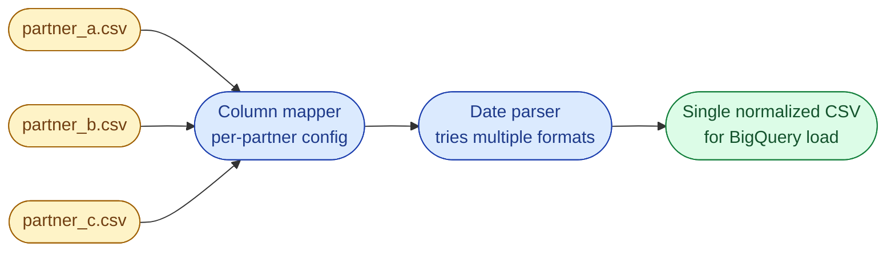



## Scenario

Every Monday morning, a folder of CSV files from different partners lands in your bucket. Same domain (customer signups) but every partner names columns differently, uses a different date format, and adds extra columns nobody downstream wants.

```
# partner_a.csv
customer_id,full_name,email,signup_date
201,Alice Lee,alice@a.com,2025-10-01
202,Bob Khan,bob@a.com,2025-10-02
```

```
# partner_b.csv
CustomerID,Name,Email,SignupDate,Country
301,Carol Tan,carol@b.com,2025-10-01,SG
302,,daniel@b.com,2025-10-04,MY
```

```
# partner_c.csv
cust_id,name,email_addr,joined_on
401,Eve Patel,eve@c.com,01/10/2025
402,Frank Wu,frank@c.com,02/10/2025
```



## Output

A single `customers_merged.csv` with exactly four columns: `customer_id, name, email, signup_date`. Dates normalized to ISO `YYYY-MM-DD`. Missing names replaced by `"Unknown"`. Source partner traceable on every row.

## Constraints

- The folder can contain hundreds of files. Process them as a stream, do not load all of them into memory at once.
- Column names should be matched **case-insensitively** and via aliases per partner.
- Unknown columns are silently dropped (not an error).

## Bonus

- Add a `source_file` column so analysts can trace any row back to its partner CSV.
- Add a per-file row count to the run summary at the end.
- Discuss what changes if a partner's schema drifts mid-week (new column shows up).

## What a Good Answer Covers

- A clear progression from naive read-and-merge to a config-driven mapping table.
- A date parser that tries a list of formats rather than guessing.
- A reject sink for rows that fail (you cannot just lose data quietly).
- Time and space complexity for each approach.


<div class="pr-solution-divider"></div>


_Reference implementation_ — `solution.py`

```python
"""
Problem 5, Merging Messy CSVs from Multiple Partners
Author: Amirul Islam

Three solutions, ordered the way a senior would walk through them.

    Approach 1: pandas concat with hard-coded renames                   (works for two)
    Approach 2: streaming with per-partner column map                   (clean)
    Approach 3: streaming + config-driven mapping + multi-format dates  (production)

Approach 3 wins as soon as you have more than three partners or one of them
ships a schema drift. Hard-coded renames in code do not survive that.
"""

from __future__ import annotations

import csv
import sys
from collections import Counter
from datetime import datetime
from pathlib import Path
from typing import Iterable


CANONICAL = ["customer_id", "name", "email", "signup_date", "source_file"]

DATE_FORMATS = [
    "%Y-%m-%d",      # 2025-10-01
    "%d/%m/%Y",      # 01/10/2025
    "%m/%d/%Y",      # 10/01/2025
    "%Y/%m/%d",
    "%d-%m-%Y",
]


def _normalize_date(s: str) -> str | None:
    s = (s or "").strip()
    if not s:
        return None
    for fmt in DATE_FORMATS:
        try:
            return datetime.strptime(s, fmt).strftime("%Y-%m-%d")
        except ValueError:
            continue
    return None


# =============================================================================
# Approach 1, pandas concat with hard-coded renames
# -----------------------------------------------------------------------------
# Time:  O(N) but with high per-file overhead
# Space: O(N) all rows in memory across all files
#
# Why it stops working:
#   You hard-code the column rename per partner. Every new partner is a code
#   change. Every schema drift is a hot-fix. Memory explodes when the folder
#   has hundreds of files.
# =============================================================================
def pandas_concat(folder: str, out_path: str) -> None:
    import pandas as pd

    frames = []
    for f in sorted(Path(folder).glob("*.csv")):
        df = pd.read_csv(f)
        if "customer_id" in df.columns:
            pass
        elif "CustomerID" in df.columns:
            df = df.rename(columns={"CustomerID": "customer_id", "Name": "name",
                                    "Email": "email", "SignupDate": "signup_date"})
        elif "cust_id" in df.columns:
            df = df.rename(columns={"cust_id": "customer_id", "email_addr": "email",
                                    "joined_on": "signup_date"})
        df = df[["customer_id", "name", "email", "signup_date"]]
        df["source_file"] = f.name
        frames.append(df)
    pd.concat(frames).to_csv(out_path, index=False)


# =============================================================================
# Approach 2, streaming with per-partner column map
# -----------------------------------------------------------------------------
# Time:  O(N) one pass per file
# Space: O(1) per row
#
# Memory-bounded. Still per-partner code, but the loop is the same.
# =============================================================================
def streaming_per_partner(folder: str, out_path: str) -> None:
    column_maps: dict[str, dict[str, str]] = {
        "partner_a.csv": {"customer_id": "customer_id", "full_name": "name",
                          "email": "email", "signup_date": "signup_date"},
        "partner_b.csv": {"CustomerID": "customer_id", "Name": "name",
                          "Email": "email", "SignupDate": "signup_date"},
        "partner_c.csv": {"cust_id": "customer_id", "name": "name",
                          "email_addr": "email", "joined_on": "signup_date"},
    }

    with open(out_path, "w", newline="") as fout:
        writer = csv.DictWriter(fout, fieldnames=CANONICAL)
        writer.writeheader()
        for f in sorted(Path(folder).glob("*.csv")):
            mapping = column_maps.get(f.name)
            if mapping is None:
                continue
            with open(f) as fin:
                reader = csv.DictReader(fin)
                for row in reader:
                    out = {target: (row.get(src) or "").strip()
                           for src, target in mapping.items()}
                    out["name"] = out.get("name") or "Unknown"
                    out["signup_date"] = _normalize_date(out.get("signup_date", "")) or ""
                    out["source_file"] = f.name
                    writer.writerow(out)


# =============================================================================
# Approach 3, streaming + config-driven mapping + multi-format dates + rejects
# -----------------------------------------------------------------------------
# Time:  O(N), one pass per file
# Space: O(1) per row + O(P) partner config where P is the number of aliases
#
# Production shape:
#   - aliases sit in a per-partner config dict, easy to extend without code
#   - column-name matching is case-insensitive
#   - date parser tries a list of formats, fails loud rather than guessing
#   - rejects go to merged_rejects.csv with a reason
#   - source_file column preserved for lineage
# =============================================================================
PARTNER_CONFIG: dict[str, dict[str, list[str]]] = {
    # canonical -> list of aliases the partner may use, case-insensitive
    "customer_id": ["customer_id", "customerid", "cust_id", "cust no"],
    "name":        ["name", "full_name", "fullname"],
    "email":       ["email", "email_addr", "emailaddress"],
    "signup_date": ["signup_date", "signupdate", "joined_on", "join_date"],
}


def _resolve_column(headers: Iterable[str], aliases: list[str]) -> str | None:
    lookup = {h.lower(): h for h in headers}
    for alias in aliases:
        if alias.lower() in lookup:
            return lookup[alias.lower()]
    return None


def streaming_config_driven(folder: str,
                            out_path: str = "customers_merged.csv",
                            reject_path: str = "merged_rejects.csv",
                            ) -> Counter[str]:
    rejects: Counter[str] = Counter()
    per_file_counts: Counter[str] = Counter()

    with open(out_path, "w", newline="") as fout, \
         open(reject_path, "w", newline="") as frej:
        writer = csv.DictWriter(fout, fieldnames=CANONICAL)
        rwriter = csv.DictWriter(frej, fieldnames=CANONICAL + ["reason"])
        writer.writeheader()
        rwriter.writeheader()

        for f in sorted(Path(folder).glob("*.csv")):
            with open(f) as fin:
                reader = csv.DictReader(fin)
                headers = reader.fieldnames or []
                resolved = {target: _resolve_column(headers, aliases)
                            for target, aliases in PARTNER_CONFIG.items()}

                if not resolved.get("email"):
                    rejects["missing_email_column"] += 1
                    continue

                for row in reader:
                    out: dict[str, str | None] = {target: (row.get(src) if src else None) or ""
                                                  for target, src in resolved.items()}
                    out["source_file"] = f.name

                    if not (out["email"] or "").strip():
                        rejects["missing_email"] += 1
                        out["reason"] = "missing_email"
                        rwriter.writerow(out)
                        continue

                    parsed_date = _normalize_date(out["signup_date"] or "")
                    if not parsed_date:
                        rejects["bad_date"] += 1
                        out["reason"] = "bad_date"
                        rwriter.writerow(out)
                        continue

                    out["signup_date"] = parsed_date
                    out["name"] = (out["name"] or "").strip() or "Unknown"
                    writer.writerow({k: out.get(k) for k in CANONICAL})
                    per_file_counts[f.name] += 1

    print("Rows written per file:")
    for name, n in per_file_counts.most_common():
        print(f"  {name}: {n}")
    return rejects


def main() -> None:
    folder = sys.argv[1] if len(sys.argv) > 1 else "../../data/partners/"
    counts = streaming_config_driven(folder)
    if counts:
        print("Rejected rows by reason:")
        for reason, n in counts.most_common():
            print(f"  {reason}: {n}")


if __name__ == "__main__":
    main()
```

