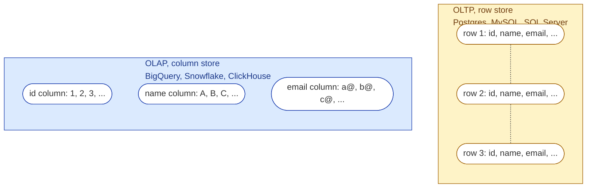
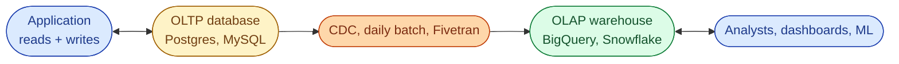



**Scenario:**
An analyst on your team writes a SQL query against the production Postgres database. The query is simple: count orders by day for the last year. It takes 90 seconds and the on-call engineer pings you because it briefly slowed down the checkout API. You explain that this kind of query does not belong on the production database. They ask you why.

In the interview, the question is:

> What is OLTP, what is OLAP, and why does the same query feel fast in one and slow in the other?

---

### Your Task:

1. Define OLTP and OLAP in one sentence each.
2. Explain how the underlying storage and query engine differ.
3. Give an example of a typical OLTP query and a typical OLAP query.
4. Explain why running the wrong query on the wrong system is bad for both speed and the business.

---

### What a Good Answer Covers:

* Row-oriented vs columnar storage.
* Indexes and point lookups vs scans and aggregates.
* Transactions and ACID guarantees vs append-only analytical workloads.
* Why we have a separate warehouse at all.



## Solution 8: OLTP vs OLAP

### Short version you can say out loud

> OLTP is the database behind the app. It is built to handle many small reads and writes very fast, like "fetch this user" or "insert this order." OLAP is the database behind reporting. It is built to scan huge amounts of data and compute aggregates, like "revenue by region by month." They store data in completely different ways, which is why the same query can take 50ms in one and 50 seconds in the other.

### Picture it

Row store: best at *give me row id=42* and *insert this new order*.
Column store: best at *SUM(amount) by month* and *reading 5 columns out of 100*.

### What each one is, in one paragraph

**OLTP (Online Transaction Processing)** powers the running application. It handles thousands of tiny operations per second: insert this order, update this balance, fetch this user. The data is stored row by row, so it can quickly grab or update a complete record. It uses indexes (usually B-tree) for fast lookups by id, and it enforces ACID transactions so the business never sees a half-applied change.

**OLAP (Online Analytical Processing)** powers reporting, dashboards and analytics. It handles a small number of huge queries: total revenue by country last year, daily active users for the last 12 months. The data is stored column by column, so when you select 3 columns out of 100, it only reads those 3. It is optimised for big scans and aggregates, not for updating one row at a time.

### The same data, two storage formats

Imagine an `orders` table with columns: `id, customer_id, status, amount, country, created_at`.

A query like `SELECT SUM(amount) FROM orders WHERE country = 'SG'` does this:

* On an **OLTP row store**: read every row on disk, all six columns of each row, even though we only care about two of them. Slow.
* On an **OLAP column store**: read only the `country` and `amount` columns. The other four never touch the disk. Fast.

Now flip it. A query like `SELECT * FROM orders WHERE id = 12345`:

* On an **OLTP row store**: the B-tree index jumps straight to the row, one disk seek. Done in milliseconds.
* On an **OLAP column store**: there is no row index. The engine may scan a partition or block range. Easily 1000x slower than the OLTP version.

So neither one is "better." They are tuned for opposite workloads.

### Side by side

| Aspect | OLTP | OLAP |
| --------------------- | ----------------------------------- | ------------------------------------- |
| Typical user | The application | Analysts, BI tools, ML pipelines |
| Typical query | Read or update one row | Aggregate millions of rows |
| Storage layout | Row-oriented | Column-oriented |
| Indexes | Many (primary key, foreign keys) | Few or none (uses partition + cluster)|
| Updates and deletes | Frequent | Rare, often batch |
| Concurrency | Thousands of small transactions | Few large queries |
| ACID | Strict | Eventual or relaxed in many engines |
| Data freshness | Real time | Minutes to hours behind |
| Examples | Postgres, MySQL, SQL Server, DynamoDB | BigQuery, Snowflake, Redshift, ClickHouse |

### Why we keep them separate

The story at the top of the problem is the answer: if you run a long analytical query on the production database, you slow down the app for real users. Even if you don't, you push the database's cache out, hurting every other small query. The whole reason warehouses exist is so analytical work has its own home.

A typical company therefore runs:

### Bonus follow-up the interviewer might throw

> *"What about HTAP, like CockroachDB or TiDB? Aren't they both?"*

HTAP (Hybrid Transactional and Analytical Processing) systems try to do both in one box, usually by keeping a row store for writes and a column store replica for analytics inside the same cluster. They work well for moderate scale and reduce operational complexity, but for very large analytical workloads most companies still keep a dedicated warehouse, because a purpose built engine like BigQuery or Snowflake is still cheaper and faster at that job.

