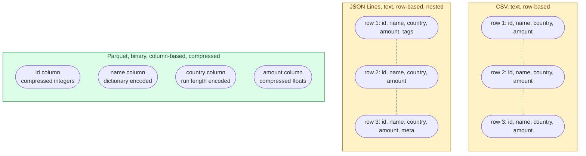



**Scenario:**
Your team is choosing the storage format for a 5 TB events archive in S3. One engineer wants CSV "because everything reads it." Another wants JSON "because that's how the events arrive." You suggest Parquet. The team has not used it before and asks you to explain.

In the interview, the question is:

> When would you use Parquet, CSV, or JSON for storing data, and how would you explain Parquet to someone who has never heard of it?

---

### Your Task:

1. Explain the three formats in plain words.
2. Compare them on size, query speed, schema, and tooling.
3. Explain why Parquet is so popular for analytics.
4. Say when you would actually pick CSV or JSON over Parquet.

---

### What a Good Answer Covers:

* Row-oriented vs column-oriented storage.
* Compression and predicate pushdown.
* The schema-on-write vs schema-on-read difference.
* Real numbers: same dataset in CSV vs Parquet sizes.
* Honest cases where Parquet is the wrong call.



## Solution 12: Parquet vs CSV vs JSON

### Short version you can say out loud

> CSV is a plain text grid. Easy to read for humans, easy to share with anyone, but slow to query and large on disk. JSON is good for nested or schema-changing data, even more expensive on size, and slow to scan. Parquet is a columnar binary format used for analytics: it stores each column together with its own compression, so when your query reads 3 columns out of 50, it reads only those 3 columns from disk. For a 5 TB archive that gets queried a lot, Parquet usually ends up about 5 to 10x smaller and 10 to 100x faster to scan than CSV.

### Picture it

A query `SELECT SUM(amount) WHERE country='SG'`:

- **CSV and JSON**: read every column of every row.
- **Parquet**: read only the `country` and `amount` columns. Skip everything else.

### How each one is laid out

**CSV** stores data row by row, as plain text. Every column is a string, even when it represents a number or a date. No types, no compression by default, no schema. Universal: every tool on earth reads CSV.

**JSON** (here meaning JSON Lines, one object per line) is also row by row, also plain text, but each row carries its own structure. You can have nested objects, arrays, missing fields, and types are implicit per value. Great for "this row might have new fields tomorrow" use cases.

**Parquet** is a binary, columnar format. Inside one Parquet file, data is grouped into "row groups," and inside each row group, each column is stored separately with its own compression and statistics (min, max, null count). This layout gives you three big wins for analytics:

1. **Read fewer columns.** A query that needs 3 of 50 columns reads about 6 percent of the file.
2. **Better compression.** Values in the same column are similar (same type, often repeating). Compression ratios of 5 to 10x over CSV are normal.
3. **Predicate pushdown.** Each column has min and max per row group. The query engine can skip whole row groups when the filter range cannot match. This is why BigQuery, Snowflake, Athena, Spark all love Parquet.

### Side by side comparison

| Aspect | CSV | JSON | Parquet |
| --------------------- | ----------------- | ------------------- | ------------------------ |
| Format | Text, row-based | Text, row-based | Binary, column-based |
| Schema | None (all string) | Implicit per row | Strict, embedded |
| Compression | None by default | None by default | Built in (snappy, zstd) |
| Size on disk | Largest | Larger than CSV | 5 to 10x smaller |
| Query 1 column out of 50 | Reads all | Reads all | Reads ~2% |
| Nested data | Awkward | Native | Native (structs, arrays) |
| Human readable | Yes | Yes | No |
| Streaming friendly | Yes (append) | Yes (append) | Not really (block based) |
| Best for | Exchange, small files | Streaming events with changing shape | Analytics archive |

### Real numbers (typical)

A 100 GB CSV of NYC taxi trips often becomes around 10-15 GB in Parquet with snappy compression and 6-8 GB with zstd. A query that filters by date and selects two columns typically goes from minutes on the CSV to seconds on Parquet on the same Athena or BigQuery setup.

### When to actually pick each one

**Pick CSV when:**
* You are exchanging data with a non-technical partner who opens files in Excel.
* The data is small (under a few hundred MB) and human review matters.
* A tool you cannot change only accepts CSV.

**Pick JSON (or JSON Lines) when:**
* Events have a flexible or evolving structure with many optional fields.
* You need to keep the original payload exactly as it arrived (audit, replay).
* It is the native shape that an API emits, and you want to land raw before transforming.

**Pick Parquet when:**
* The data lives in a data lake and gets queried by analytics engines (BigQuery, Athena, Spark, DuckDB, Snowflake).
* The dataset is large (anything above a few GB).
* You have a stable schema.
* You care about cost (in BigQuery and Athena you pay per byte scanned, and Parquet directly reduces that).

### Common mistakes interviewers want you to name

1. **Storing analytical data as CSV in S3.** The bill is silently 5x higher than it needs to be.
2. **Writing tiny Parquet files** (a few KB each). The columnar advantage is lost, and the engine spends most of its time opening files. Aim for files in the 128 MB to 1 GB range.
3. **Parquet for tiny dataframes** in code. The reader/writer overhead can be slower than CSV at small sizes.
4. **Choosing JSON for "future flexibility"** and never actually using the flexibility. Pay the cost forever for no benefit.
5. **Mixing types across rows in JSON.** A field that is sometimes a string and sometimes a number breaks every consumer that tries to declare a schema.

### Bonus follow-up the interviewer might throw

> *"How do Parquet and ORC compare? Or Avro?"*

* **ORC** is also columnar, came from the Hive ecosystem. Very similar to Parquet, slightly better compression sometimes. Parquet won on adoption outside Hadoop.
* **Avro** is row-based binary with an explicit schema. Excellent for streaming (Kafka loves Avro) and for write-heavy workloads, but bad for "read 2 columns out of 50."

A common pattern in real teams: **Avro on the wire** (Kafka events), **Parquet at rest** (data lake). You convert as data lands.

