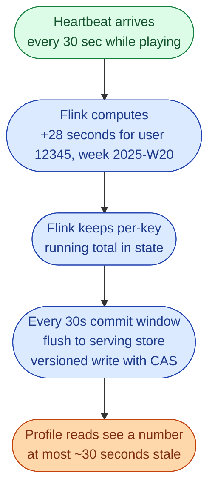



**Scenario:**
A music streaming app shows "minutes listened this week" on every user's profile. Hundreds of millions of users open the app each day. Scanning the full play event history every time someone opens their profile would be impossibly expensive. The product team wants the number to be at most 5 minutes stale.

In the interview, the question is:

> Design how Spotify might compute "minutes listened this week" without scanning all play events every time someone opens the app.

---

### Your Task:

1. Estimate the read and write volumes at the scale described.
2. Pick a storage and update pattern.
3. Decide what "this week" means and how it rolls over.
4. Cover correctness in the presence of pauses, skips, and replays.
5. Mention how it stays fast at 200 million daily users.

---

### What a Good Answer Covers:

* A pre-aggregated counter per (user, week), updated incrementally.
* Streaming aggregation over play heartbeat events.
* The "what counts as a minute listened" definition.
* Week boundary handling and time zones.
* The serving store choice.


<div class="pr-solution-divider"></div>


## Solution 24: Spotify Minutes Listened This Week

### Volume math first

> ~500 million users total, ~200 million daily active. Average maybe 30 minutes a day listened. Play events with heartbeats every ~30 seconds gives roughly:
>
> 200M users × 60 heartbeats/day = **12 billion events per day**.
>
> Profile loads: maybe 1 billion per day. That's the read side.

Two takeaways:

* We cannot scan play history per request. Even one full scan of the week per user would be tens of GB per user per request.
* We must pre-aggregate. The "minutes listened this week" must be a single value already sitting somewhere, updated in the background.

### The architecture

```mermaid
flowchart TB
    CL([Clients<br/>apps, web, speakers<br/>play heartbeats every 30s])
    K([Kafka topic<br/>play_heartbeats<br/>12B events per day])
    FL([Flink stream processor<br/>validate, compute elapsed seconds<br/>key by user_id and week_id<br/>increment counter])
    SS([Serving store<br/>Bigtable, Cassandra, DynamoDB<br/>key: user_id | week_id])
    PROF([Profile service<br/>point read under 20 ms])

    WH([S3 then BigQuery<br/>Year in Review, ML, audit])

    CL --> K --> FL --> SS --> PROF
    K -. parallel .-> WH

    style CL fill:#dcfce7,stroke:#15803d,color:#14532d
    style K fill:#fed7aa,stroke:#c2410c,color:#7c2d12
    style FL fill:#dbeafe,stroke:#1e40af,color:#1e3a8a
    style SS fill:#dbeafe,stroke:#1e40af,color:#1e3a8a
    style PROF fill:#dbeafe,stroke:#1e40af,color:#1e3a8a
    style WH fill:#fef3c7,stroke:#a16207,color:#713f12
```

### What counts as a "minute listened"

This sounds obvious but it is the whole pipeline's correctness problem. We need a clear rule:

* A heartbeat fires every 30 seconds during active playback.
* If the next heartbeat for the same user arrives within 60 seconds and is on the same content, count the elapsed real time between them.
* If more than 60 seconds passed, the user paused, switched device, or lost network. Do not count the gap.
* Skips and seeks emit different events and never count toward minutes.

This logic lives in the stream processor. The output of the processor is "this heartbeat contributed N seconds." It is N, not 30, exactly because of pause/gap handling.

### The week boundary

"This week" is ambiguous. We pick:

* **ISO week**, starts Monday 00:00 in the user's local time zone.
* `week_id` is `2025-W20` style.

Why local time zone, not UTC? Because the user looks at the profile in their own day. A user in Singapore at 1 AM Monday should see a fresh week. With UTC weeks they would still see last week.

The stream processor knows each user's time zone (from a small user table broadcast to the job). It computes the right `week_id` per event.

On the boundary moment, the user has both `2025-W20` and `2025-W21` records in the store. The profile reads only the current one.

### Why the key is (user, week) and not just user

* Reads only one row. A single point read. Fast.
* On Monday the row resets naturally (a new key exists).
* Old weeks remain queryable: "compared to last week, you listened 12% more."
* TTL the old rows (90 days) so the store stays small.

The store ends up roughly: 200M active users × ~12 weeks of retention = ~2.4 billion rows. Each row is small (~80 bytes). Around 200 GB. Trivial for Bigtable.

### Update path



We do not write to the store on every heartbeat (that's 12B writes a day). We write once per commit window per user. Most users have 1 heartbeat per 30 seconds anyway, so the savings come from buffering and from idle users dropping out of writes entirely.

### Idempotency

Heartbeats can be duplicated (network retries). Each heartbeat carries a unique `heartbeat_id`. The processor dedupes within a short window (a few minutes) using Flink keyed state.

If Flink restarts, it resumes from checkpoint. The serving store write is a CAS on `version`, so a replayed write does not double-count.

End result: the same user activity always produces the same minute count.

### The "first profile load on Monday" problem

When a new week starts, the store does not have a row yet. The profile service:

* Reads the (user, current week) key.
* If missing, return `0` minutes (correct).
* The row appears the moment the user plays anything.

No special migration needed.

### The "user plays nothing this week" case

There is no row at all. The profile shows 0. Correct.

### Why a key-value store, not a SQL warehouse

* 1B reads/day at sub-50ms requires a single-row point read store.
* Writes are also high. Bigtable handles 100k+ writes/sec per cluster.
* No JOINs are needed at read time. The row already has the answer.
* Cost: a SQL warehouse like BigQuery is built for scans, not for billions of point reads.

A relational database (Postgres) would actually work for this if sharded well, but Bigtable/DynamoDB/Cassandra is the easier scale story.

### What about the warehouse layer?

It still exists, but for different reasons:

* Year in Review and the more sophisticated personalised statistics.
* ML features: who listened to what, when, where.
* Auditing the streamed minutes (for royalty calculations).
* Reprocessing a week if a bug in the rule was discovered.

The warehouse never sees a profile load. The warehouse is for analytics and offline processing.

### Common mistakes interviewers want you to name

1. **Scanning play events at read time.** Even with partitioning, 12B rows/day cannot serve 1B reads.
2. **Using UTC weeks.** Users hate that.
3. **Counting all heartbeats as 30 seconds.** Pauses and gaps must be detected, otherwise minutes look inflated.
4. **No idempotency.** Heartbeat retries double the minutes.
5. **One global Redis.** A single cluster cannot do this; you need a partitioned store.

### Bonus follow-up the interviewer might throw

> *"What if the business asks for 'minutes listened today,' down to the hour?"*

Two ways:

1. Add another key, `(user_id, day_id)`. Same approach. Reset at midnight local time.
2. If they want hourly granularity, store a small dictionary in the row: `{ '14': 12, '15': 28,... }`. Updated by the same stream processor.

The architecture does not change. The data model just gets a finer grain.

