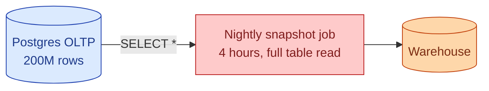
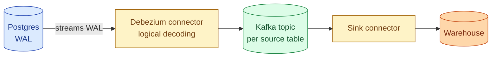



**Scenario:**
Your team has been doing nightly full-table snapshots of a 200M-row Postgres OLTP database into the warehouse. The snapshot takes four hours, blows up the source disk IO, and silently misses any row that was created and deleted on the same day. The product team wants the warehouse to be "near real-time." The DBA refuses to add triggers on the production tables. You suggest change data capture.

In the interview, the question is:

> What is change data capture, what are the two main flavours, and how do you pick between them?

---

### Your Task:

1. Define CDC in plain English and say why you would reach for it.
2. Compare log-based and query-based CDC. What each gets right and where each hurts.
3. Sketch a realistic log-based setup (Postgres + Debezium + Kafka + warehouse).
4. Cover the three gotchas that bite real CDC pipelines: initial snapshot, schema changes, and large transactions.

---

### What a Good Answer Covers:

* Why nightly full reloads break at scale.
* The Postgres WAL / MySQL binlog as the source of truth for changes.
* What query-based CDC looks like with an `updated_at` column and why deletes are the hole.
* How Debezium handles the initial snapshot.
* Schema evolution: drop column on the source, what happens downstream.
* The transactional ordering guarantee and what it does not cover.


<div class="pr-solution-divider"></div>


## Solution 76: Change Data Capture, Log-Based vs Query-Based

### Short version you can say out loud

> Change data capture is the pattern of streaming every insert, update, and delete out of a source database, instead of re-reading the whole table on a schedule. Two flavours exist. Log-based CDC reads the database's own write-ahead log (Postgres WAL, MySQL binlog, Mongo oplog) and emits one event per row change. It is the gold standard because it sees every change including deletes, captures them in the same order the database committed them, and adds almost no load to the source. Query-based CDC polls the source with a query like `SELECT * WHERE updated_at > :last_seen`. It is easier to set up but cannot see deletes and pays repeated query cost. Pick log-based whenever the source supports it. Use query-based only when you cannot get to the log, usually for legacy databases or vendor-locked SaaS sources.

### Why the team's nightly snapshot is failing



Three failure modes, all caused by the same thing: a full re-read.

1. **Latency.** The warehouse is stale by up to 24 hours.
2. **Source pressure.** A four-hour `SELECT *` competes with production traffic.
3. **Same-day churn is invisible.** A row created at 09:00 and deleted at 17:00 never appears in any snapshot.

CDC solves all three by reading changes as they happen.

### Log-based CDC

Every relational database writes a redo log before it commits anything to the data files. Postgres calls it the WAL, MySQL calls it the binlog, SQL Server calls it the transaction log. The log is the source of truth for "what changed when," and it already exists for replication and crash recovery. Log-based CDC plugs into that log.



Each row change becomes a structured event:

```json
{
  "op": "u",
  "ts_ms": 1717491812345,
  "before": {"id": 42, "email": "a@x.com", "country": "SG"},
  "after":  {"id": 42, "email": "a@x.com", "country": "MY"},
  "source": {"lsn": "0/16B3768", "txId": 938472}
}
```

`op` is one of `c` (create), `u` (update), `d` (delete), `r` (read, used during snapshot). The downstream consumer applies these to a warehouse table with a `MERGE` keyed on the primary key, and deletes are handled by a tombstone or a soft-delete column.

### Query-based CDC

The lazy version. Add an `updated_at TIMESTAMP` column on every source table, then poll:

```sql
SELECT * FROM users
WHERE updated_at > :last_high_watermark
ORDER BY updated_at;
```

You store the high watermark in the warehouse, advance it after each batch, and rerun every N minutes. This is what Fivetran and Airbyte do for sources where no log access is possible.

What it gets right: simple, no special privileges, works on any source you can query.

What it does not see:

* **Deletes.** A deleted row is not in the result set. The warehouse keeps the dead row forever unless you do a periodic reconciliation full scan.
* **Updates that do not bump `updated_at`.** Easy to forget on a column update, easy for a buggy app to skip on purpose.
* **Changes between polls.** If a row is updated twice between two polls, you only see the final state. For most reporting this is fine; for audit data it is not.

It also re-reads every changed row each poll, so on a high-churn table the source cost adds up.

### The three gotchas log-based CDC still has

**1. The initial snapshot.**

When you turn on CDC for the first time, the log only contains "what changed from now on." You still need a starting point. Debezium handles this by doing one consistent snapshot of the table on startup, then switching to streaming from a known WAL position. During the snapshot the source is locked (or uses a consistent read view), which on a hot 200M-row table can still take hours. Plan for it. Some teams snapshot off a read replica.

**2. Schema changes on the source.**

When the source drops a column, every downstream consumer needs to know. Log-based CDC emits a schema-change event, but the warehouse `MERGE` does not magically add or drop columns. Three coping strategies:

* **Schema registry** (Avro / Protobuf via Confluent Schema Registry). Producer and consumer evolve compatibly.
* **All-string staging table.** Land everything as JSON or `STRING`, parse downstream. Defers the pain.
* **Process gate.** A code review on the source repo runs a check that warns the data team before the migration ships. Best paired with a contract.

**3. Large transactions.**

A `DELETE FROM orders WHERE created_at < '2024-01-01'` against 50 million rows produces 50 million CDC events in one transaction. Until that transaction commits, none of them are visible. Until they all flow through Kafka, the downstream is behind. Two mitigations:

* Break large maintenance transactions into chunks on the source.
* Set a Kafka lag alert with an SLO you can defend.

### Pick log-based when you can

| Property | Log-based | Query-based |
| --- | --- | --- |
| Sees deletes | yes | no |
| Sees in-order changes | yes | no, only final state per poll |
| Source load | minimal | a query every poll |
| Latency | seconds | minutes to hours |
| Setup difficulty | medium, needs DBA help | easy |
| Works on SaaS / legacy sources | rarely | usually |

For the scenario above, the right answer is log-based CDC with Debezium reading the Postgres WAL. The DBA's "no triggers" rule still holds because logical decoding is not a trigger; it is a replication slot, the same mechanism Postgres uses for its own read replicas.

### Common mistakes interviewers want you to name

1. **Treating query-based CDC as a complete solution.** The missing-deletes hole is what bites you in audit and compliance reporting.
2. **No idempotency on the consumer side.** Kafka redelivers. If your `MERGE` is not idempotent, retries double-count.
3. **Forgetting the initial snapshot cost.** "We turned on CDC over the weekend" then the source falls over Monday morning.
4. **Letting the WAL grow unbounded.** A stalled consumer means Postgres keeps WAL forever and the disk fills.
5. **No schema contract.** The first surprise column drop takes the pipeline down for a day.

### Bonus follow-up the interviewer might throw

> *"What about a really hot table, ten thousand updates per second? Does CDC still scale?"*

Yes, but partitioning matters. Kafka topics for that table should be partitioned by the primary key, so all updates to a given row land on the same partition and stay ordered. Consumers parallelise across partitions. The bottleneck shifts to the warehouse `MERGE`, which is where you usually batch micro-commits every N seconds. If even that is too slow, the next step is to land changes into an Iceberg or Delta table and let the warehouse query the lake directly, skipping the row-by-row `MERGE`.

