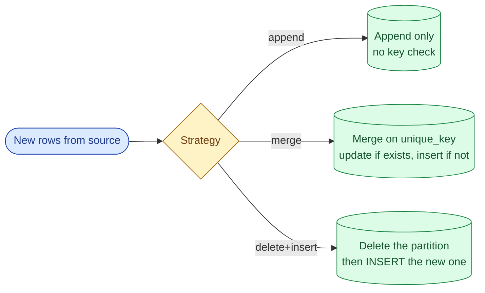



**Scenario:**
A dbt project has 40 models. Most are materialised as `table`, which means every `dbt run` rebuilds the whole warehouse from scratch. The largest fact table now has 800 million rows and the daily run takes 90 minutes. The bill is climbing. A teammate suggests changing every model to `incremental`. You say "not every model, and not the way you think." You are asked to teach the difference.

In the interview, the question is:

> When should a dbt model be incremental, when should it be a full refresh, and what does the `incremental` materialisation actually do under the hood?

---

### Your Task:

1. Explain the three dbt materialisations (view, table, incremental) in one sentence each.
2. Walk through what `is_incremental()` does and how a typical incremental model looks.
3. Cover the three incremental strategies (append, merge, delete+insert) and when each fits.
4. Explain when an incremental model is the wrong choice.

---

### What a Good Answer Covers:

* `MERGE` under the hood, generated by dbt.
* The unique key and what happens without one.
* Late-arriving data and the lookback window.
* When a full refresh is still the right answer (small dim tables, model logic changed).
* `--full-refresh` flag and when to run it.


<div class="pr-solution-divider"></div>


## Solution 77: dbt Incremental vs Full Refresh

### Short version you can say out loud

> dbt's three core materialisations are view (a SQL view, no storage, slow at read time), table (rebuilt fully on every run, fast at read time, expensive at run time), and incremental (rebuilt as "new rows only" on every run, fast at run time, mostly fast at read time). Incremental is right when the model is large, append-mostly, and has a stable filter for "what is new." It is wrong for small dimensions, for models whose business logic just changed, or for models where rows update in place across the whole history. Under the hood, an incremental model is just a `MERGE` (or `INSERT` plus `DELETE`) generated by dbt from your `is_incremental()` block, and the unique key controls whether re-running is safe.

### The three materialisations

| Materialisation | What dbt creates | Cost at run | Cost at read | When to use |
| --- | --- | --- | --- | --- |
| `view` | A SQL view | Free | Slow on big models | Small, rarely queried, always-fresh logic |
| `table` | A new table, rebuilt every run | Pays for the whole rebuild | Fast | Small to medium tables, dims, or where simplicity matters |
| `incremental` | A table, rebuilt only for new rows | Pays only for the new slice | Fast | Large, append-mostly facts |

The teammate's "change everything to incremental" mistake is the same one juniors make with indexes: applying a sharp tool everywhere instead of where it pays off.

### What an incremental model actually looks like

```sql
{{ config(
    materialized='incremental',
    unique_key='order_id',
    incremental_strategy='merge'
) }}

SELECT
  order_id,
  customer_id,
  amount,
  updated_at
FROM {{ ref('stg_orders') }}


WHERE updated_at > (SELECT MAX(updated_at) FROM {{ this }})

```

The `` block is the trick. dbt evaluates it differently in two modes:

* On the first run, or when you pass `--full-refresh`, the block is skipped. dbt drops the table and inserts everything.
* On every subsequent run, the block runs. dbt only reads rows newer than the high watermark, and writes them in via `MERGE` on the unique key.

That `MERGE` is dbt's generated SQL. It looks like:

```sql
MERGE INTO analytics.orders AS target
USING (SELECT ... FROM stg_orders WHERE updated_at > ...) AS source
ON target.order_id = source.order_id
WHEN MATCHED THEN UPDATE SET ...
WHEN NOT MATCHED THEN INSERT (...);
```

### The three incremental strategies



**1. `append`**

Simplest. New rows go in, no deduping. Use when the source is guaranteed never to emit the same row twice (immutable logs, click events with a unique event id you trust).

Risk: a retry double-inserts. You need an idempotent source or you wear the duplicates.

**2. `merge`**

The default on most warehouses. Uses the `unique_key` to upsert. Safe to retry. Handles updates to existing rows correctly.

Cost: `MERGE` does a join under the hood. For very large tables this can be expensive. Use a partition filter (BigQuery: `partition_by` plus an `on_schema_change` config) so the merge only touches recent partitions.

**3. `delete+insert`**

For partitioned tables. Identify which partitions the new data touches, delete those partitions, then insert. Equivalent to the "delete and reinsert by partition" pattern from problem 9. Safe to retry by construction.

Best for time-partitioned facts where you know "this run only touches the last 3 days."

### The unique key is not optional in real life

If `unique_key` is missing on a `merge` model, dbt appends every row. Rerunning a backfill duplicates everything. Almost every dbt outage where "the numbers doubled" is a missing or wrong unique key.

The unique key must be:

* Stable. Surrogate keys, `event_id`, `order_id`. Not "first name plus city."
* Actually unique in the source. If the source has duplicates, `MERGE` will pick one and you will not see the conflict.

For wide composite keys, use a `surrogate_key` macro to hash them, or list the columns explicitly.

### When incremental is the wrong choice

1. **Small tables.** A 10,000-row dim table builds in 2 seconds as `table`. Making it incremental adds complexity for no win.
2. **Logic changed.** The SQL of an incremental model changed yesterday. Now half the table is on the old logic and half on the new. Run `dbt run --full-refresh -s my_model` to force a rebuild.
3. **Late-arriving data outside your lookback window.** If a row updates 30 days after creation and your incremental filter only looks at the last 7 days, you miss it. Two fixes: widen the window, or accept reprocessing the late rows separately.
4. **Wide updates.** If most rows in the history can update on any given day, incremental does not help: every run re-touches the whole table. Stay on `table`.
5. **You are still iterating on the model.** During development, `table` is honest and fast to reason about. Switch to `incremental` only when the model is stable.

### A realistic incremental for the 800M-row fact

```sql
{{ config(
    materialized='incremental',
    unique_key='order_id',
    incremental_strategy='merge',
    partition_by={'field': 'order_date', 'data_type': 'date'},
    on_schema_change='append_new_columns'
) }}

SELECT
  order_id,
  customer_id,
  order_date,
  amount,
  updated_at
FROM {{ ref('stg_orders') }}


WHERE updated_at > (SELECT MAX(updated_at) - INTERVAL '2 days' FROM {{ this }})
  AND order_date >= (SELECT MAX(order_date) - INTERVAL '7 days' FROM {{ this }})

```

Three things this does:

* Picks up updates from the last 2 days (lookback for late rows).
* Restricts the `MERGE` to partitions in the last 7 days (cost control).
* `on_schema_change='append_new_columns'` keeps the table valid when a new column lands.

### When to run `--full-refresh`

* The model SQL changed in a way that affects old rows (a calculation fix, a renamed column).
* The unique key changed (rare, but it happens).
* You suspect drift between source and warehouse and want a clean rebuild.

Schedule full refresh quarterly for very long-lived incremental models as a sanity check, or write a dbt test that compares aggregate row counts against the source.

### Common mistakes interviewers want you to name

1. **Making every model incremental.** Most dbt projects have 80% dim/small models that should stay as `table`.
2. **Missing or wrong unique key.** The doubled-numbers outage.
3. **Lookback window too small.** Late rows quietly missed.
4. **Schema change during incremental.** Without `on_schema_change`, the model breaks or silently drops the new column.
5. **Forgetting `--full-refresh` after a logic change.** Half-old, half-new data lives in the warehouse forever.

### Bonus follow-up the interviewer might throw

> *"How would you test an incremental model?"*

Three layers:

1. **Source tests.** `unique` and `not_null` on the unique key. If the source is broken, `MERGE` silently picks a winner.
2. **Model tests.** Same `unique` and `not_null` on the model itself. Catches dbt's `MERGE` going wrong.
3. **A row-count or aggregate sanity test.** Compare the model against the source on a sample date. dbt's `equality` test or a custom one. This is the only thing that catches a stale lookback window.

Run them on every PR and after every dbt run in production.

