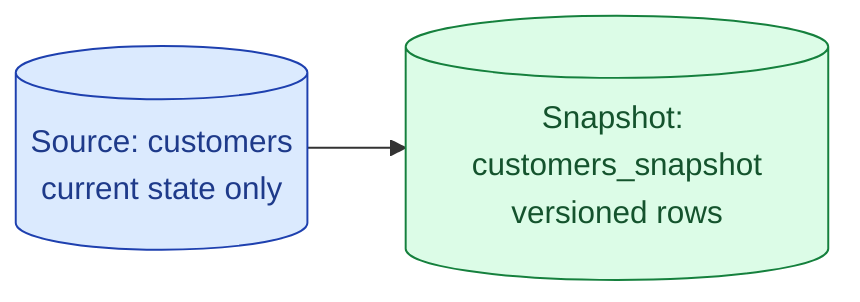



**Scenario:**
The finance team needs to know what a customer's billing plan was on any given day for the last two years. The source `customers` table in the OLTP database only holds the current state. Yesterday a refund dispute came in for a customer who changed their plan three times in six months. Finance has no way to see the history. The lead asks you to "build a Type 2 SCD in dbt."

In the interview, the question is:

> Walk me through how you would use dbt snapshots to track slowly changing dimensions, and where snapshots fit alongside other SCD strategies.

---

### Your Task:

1. Re-explain SCD Type 2 quickly (one paragraph, link mentally to problem 10).
2. Show a working dbt snapshot config and walk through what dbt does on each run.
3. Compare timestamp strategy vs check strategy and where each fails.
4. Cover the operational story: where snapshots live, when they should run, how to use them downstream.

---

### What a Good Answer Covers:

* The four columns dbt adds: `dbt_valid_from`, `dbt_valid_to`, `dbt_scd_id`, `dbt_updated_at`.
* Why snapshots are their own materialisation, not a model.
* Source freshness matters: a missed snapshot run is a hole in history.
* `check` strategy for sources without a reliable `updated_at`.
* Joining a fact to a snapshot via `BETWEEN dbt_valid_from AND dbt_valid_to`.
* When to use dbt snapshots vs CDC into Iceberg vs handwritten SCD logic.


<div class="pr-solution-divider"></div>


## Solution 78: dbt Snapshots for Slowly Changing Dimensions

### Short version you can say out loud

> A dbt snapshot is a special materialisation that records the full history of a source table as a Type 2 SCD. Every time you run `dbt snapshot`, dbt diffs the current source against the snapshot table. New rows get inserted with `dbt_valid_from = now()` and `dbt_valid_to = null`. Rows whose tracked columns changed get the old version closed off (`dbt_valid_to = now()`) and a new version inserted. Unchanged rows are left alone. The result is a table where every row represents one period of time a record existed in a given state. Downstream models join to it with `BETWEEN dbt_valid_from AND dbt_valid_to` to ask "what did the customer look like on this date." Snapshots are the easiest way to add history to a source that only stores current state.

### The shape of a snapshot table



Before any change, the snapshot looks like the source plus four metadata columns:

```
id  | plan    | dbt_valid_from        | dbt_valid_to | dbt_scd_id | dbt_updated_at
42  | starter | 2025-01-15 09:00:00   | NULL         | abc123...  | 2025-01-15 09:00:00
```

The customer upgrades to `pro` on 2025-03-20. On the next snapshot run:

```
id  | plan    | dbt_valid_from        | dbt_valid_to          | dbt_scd_id | dbt_updated_at
42  | starter | 2025-01-15 09:00:00   | 2025-03-20 10:14:22   | abc123...  | 2025-01-15 09:00:00
42  | pro     | 2025-03-20 10:14:22   | NULL                  | def456...  | 2025-03-20 10:14:22
```

The old row is closed, the new row opens. `dbt_scd_id` is a hash that uniquely identifies each version, useful as a join key.

### The snapshot config

```sql


{{
    config(
      target_schema='snapshots',
      unique_key='id',
      strategy='timestamp',
      updated_at='updated_at'
    )
}}

SELECT * FROM {{ source('oltp', 'customers') }}


```

Five things to notice:

1. **`target_schema`** is separate from regular models. Snapshots live next to them but are kept apart on purpose: they are append-mostly history, not transformed marts.
2. **`unique_key`** is the source's primary key. Not a surrogate hash. dbt uses it to match source rows against snapshot rows.
3. **`strategy='timestamp'`** says "use the `updated_at` column on the source to detect changes."
4. **`updated_at`** is the column dbt reads to know when a row last changed.
5. The query is just `SELECT * FROM the source`. No filtering. dbt does the diff itself.

### Timestamp strategy vs check strategy

Two strategies handle the "how do I know it changed" question.

**`timestamp`**

Trust the source's `updated_at` column. If `updated_at` is newer than the snapshot's last seen value for that row, the row changed.

Fast, cheap, exact. Use it when you trust the source.

Fails when:
* The source forgets to update `updated_at` on some updates (common with manual data fixes).
* The source has no `updated_at` column.

**`check`**

```sql
{{
    config(
      target_schema='snapshots',
      unique_key='id',
      strategy='check',
      check_cols=['plan', 'country', 'tier']
    )
}}
```

dbt compares the listed columns row-by-row between source and snapshot. If any of them differ, the row is treated as changed.

Slower (does a column-wise comparison) but trustworthy. Use it when:
* The source has no `updated_at`.
* You only care about changes to specific columns and want to ignore noise on others.
* You have been burned once by an unreliable `updated_at`.

`check_cols=['all']` compares every column. Often too noisy in practice.

### Source freshness matters more than you expect

Snapshots see what the source looked like at the moment they ran. If the snapshot job runs daily at 03:00 and a customer changes their plan three times on Tuesday afternoon, the snapshot table records the last state at 03:00 Wednesday. The two intermediate states are lost forever.

Two responses:

1. **Match snapshot frequency to the change rate.** For most dimensions, daily is fine. For things that change many times a day (status flags, sessions), run hourly or pull from CDC into Iceberg instead.
2. **Treat a missed run as data loss.** If the snapshot fails Tuesday and runs Wednesday, the intermediate state is gone. Alert loudly. Backfill is not possible because the source no longer remembers.

This is also why snapshots should always run before any model that depends on them. Put them in a separate dbt run earlier in the schedule.

### Joining a fact to a snapshot

The whole point is to ask "what did this look like at the time of this event."

```sql
SELECT
  o.order_id,
  o.order_date,
  o.amount,
  c.plan AS plan_at_time_of_order
FROM {{ ref('fct_orders') }} o
LEFT JOIN {{ ref('customers_snapshot') }} c
  ON  o.customer_id = c.id
  AND o.order_date >= c.dbt_valid_from
  AND (o.order_date < c.dbt_valid_to OR c.dbt_valid_to IS NULL)
```

The trick is the `<` not `<=` on the upper bound. dbt uses `dbt_valid_to` exclusive: the row was valid up to but not including that timestamp. Getting this wrong gives you double-counted orders on the boundary day.

For the finance use case in the scenario, this join gives the dispute team the exact plan the customer was on when the disputed charge happened. No more guessing.

### Snapshots vs CDC into Iceberg vs handwritten SCD

| Approach | Effort | History granularity | When it fits |
| --- | --- | --- | --- |
| dbt snapshot | Low, one config block | Daily or hourly | The source only stores current state, change rate is moderate |
| CDC into Iceberg | High, infra and consumers | Every row change | Need every intermediate state, high change rate, multiple consumers |
| Handwritten SCD | Highest, full SQL ownership | Whatever you build | dbt is not in the stack, or you need custom logic |

For finance and audit use cases on slow-moving dims, dbt snapshots are usually the right answer. For real-time analytics over high-churn data, go to CDC.

### Common mistakes interviewers want you to name

1. **Putting snapshots in the same schema as models.** Snapshots are append-mostly history, not derived data. Keep them separate so `dbt run --full-refresh` does not blow them away.
2. **`dbt run --full-refresh` on a snapshot.** dbt protects you, but the muscle memory is dangerous. Snapshots are the one thing you cannot rebuild from source.
3. **No alerting on missed snapshot runs.** A silent gap in history is the worst kind of data loss because it shows up months later in an audit.
4. **`BETWEEN dbt_valid_from AND dbt_valid_to` instead of the exclusive upper bound.** Double counts on boundary days.
5. **Snapshotting a high-churn table.** Daily snapshots on a table that changes hourly lose intermediate states. Pick CDC instead.

### Bonus follow-up the interviewer might throw

> *"What happens if the source row is deleted?"*

By default, nothing. dbt's snapshot only sees what is in the source result set. A deleted row stays open in the snapshot with `dbt_valid_to = null`, which is wrong.

The fix is the `invalidate_hard_deletes=True` config option. dbt then closes off any snapshot row that does not appear in the source on the next run. It does this by checking the snapshot's open rows against the source's primary keys.

Use it whenever deletes are a real possibility on the source. Without it, your history quietly believes deleted customers still exist.

