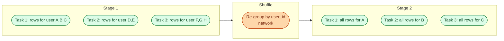



**Scenario:**
A nightly Spark job that aggregates a year of clickstream by user runs for four hours and costs the team a third of their EMR bill. Most of the executors finish in 20 minutes. A few stragglers grind on for the rest. The output dataset has 80,000 files, most under 1 MB. A new senior engineer hands you the job and asks you to make it fast and cheap. You start by explaining what is actually going wrong.

In the interview, the question is:

> Walk me through how a Spark job ends up slow and expensive, focusing on shuffles, data skew, and the small file problem. What do you actually change to fix it?

---

### Your Task:

1. Explain what a shuffle is and why every aggregation or join causes one.
2. Define data skew and show how it produces a few "long tail" tasks.
3. Explain the small file problem on both write and read sides.
4. Walk through a real diagnostic flow using the Spark UI: which tabs to open, what to look for.
5. Cover three concrete fixes (broadcast join, salting, AQE, coalesce / repartition).

---

### What a Good Answer Covers:

* Stages, tasks, and partitions as the unit of work.
* The shuffle as the moment data crosses the network.
* Why a single hot key destroys parallelism.
* Adaptive Query Execution (AQE) and what it can and cannot save.
* `coalesce` vs `repartition` and when each is right.
* The small file problem on Parquet output and how to size partitions.


<div class="pr-solution-divider"></div>


## Solution 79: Spark Shuffle, Skew, and the Small File Problem

### Short version you can say out loud

> Spark divides work into stages and partitions. Inside a stage, partitions run in parallel and no data moves between them. Every wide operation (`groupBy`, `join`, `distinct`, window) ends a stage and starts a new one with a shuffle, which is when every executor sends partial results across the network to be regrouped by key. Shuffles are expensive, but bad shuffles are catastrophic. The three failure modes are: shuffle is too big (move less data), shuffle is uneven because one key has way more rows than others (skew), or you wrote out millions of tiny files (downstream readers pay forever). The fixes in order of impact are: broadcast small joins, enable Adaptive Query Execution, salt the hot keys, and coalesce the output. The Spark UI tells you which of the three you are hitting in about ninety seconds.

### Why a shuffle happens at all



Before the shuffle, "all rows for user A" are scattered across every task. To compute `groupBy(user_id).sum(clicks)`, all of A's rows have to end up on the same task. That movement is the shuffle: each task hashes its rows by `user_id`, writes them to local disk in N buckets (N = next stage's partition count), and each task in the next stage pulls its bucket from every upstream task.

Three costs sit inside that picture: serialise, write to disk, read across network, deserialise. For a terabyte of data with 200 partitions, that is a lot of network.

### Data skew, the long tail

Now picture one user, the "test user" the app team uses, that has 40% of the rows. After the shuffle, one task gets 40% of the data while the rest get 0.3% each.

```
Task progress:
1  [██████████] 100%  10s
2  [██████████] 100%  10s
3  [██] 20%           still running after 30 minutes
4  [██████████] 100%  10s
...
```

The job is done with 199 tasks and waiting on one. That straggler is the four-hour tail. The cluster is mostly idle and the bill is mostly waste.

This is the standard pattern for "Spark job is slow" when the data has any natural concentration: null user ids, a default tenant, a popular SKU, a single bot. Always inspect the data first.

### The small file problem

Spark writes one Parquet file per output partition per output task. If you ask for 200 output partitions and 400 input tasks, you can easily end up with thousands of small files per directory.

Two reasons that is bad:

1. **Write cost.** Object storage charges per PUT. 80,000 PUTs at S3 prices is small but not free.
2. **Read cost forever.** Every downstream reader opens every file, reads the Parquet footer, and plans the scan. With small files, planning dominates over reading. Trino, Spark, and DuckDB all degrade noticeably past about 10,000 files per partition.

The right output file size sits between 128 MB and 1 GB compressed. Anything smaller is wasted overhead; anything larger fights parallel reads.

### Diagnostic flow in the Spark UI

Two minutes max. Open the running or completed job.

**1. The Stages tab.** Sort by duration. The slowest stage is your problem stage. Look at its shuffle read/write column. Numbers in the tens of GB are normal; numbers in the TB tell you to reduce shuffle data.

**2. The slowest stage's task summary.** dbt summary shows min, 25th, 50th, 75th, max for task duration. If max is 100x median, you have skew. If max and median are close, the stage is just big.

**3. The SQL tab.** Click into your query. Look for `SortMergeJoin` between a giant table and a small one (broadcastable). That is a missed broadcast.

**4. The output directory.** `aws s3 ls --summarize --recursive` (or whatever your storage offers). If the file count is in the tens of thousands for an aggregate, you have the small file problem.

### Fix 1: broadcast small joins

If one side of a join fits in memory (under about 100 MB after compression), broadcast it. Spark sends a copy to every executor and the join becomes a local lookup, no shuffle at all.

AQE (Adaptive Query Execution, on by default since Spark 3.2) will broadcast automatically when it can see the size at runtime. If your small side is the output of a complex CTE that AQE cannot estimate, hint it:

```python
from pyspark.sql.functions import broadcast
joined = facts.join(broadcast(dim_users), "user_id")
```

For the clickstream job in the scenario, broadcasting the user dimension can take the shuffle from terabytes to gigabytes.

### Fix 2: enable AQE and skew join handling

AQE turns shuffles from a static plan into an adaptive one. Two things matter here:

```python
spark.conf.set("spark.sql.adaptive.enabled", "true")
spark.conf.set("spark.sql.adaptive.skewJoin.enabled", "true")
```

With skew join on, AQE detects a skewed partition at runtime and splits it across multiple tasks. The hot user_id no longer makes one task carry the whole stage.

This alone takes a lot of "slow Spark job" tickets from days to hours.

### Fix 3: salt the hot key when AQE is not enough

For aggregations (where AQE skew handling is weaker than for joins), salt the key. Pre-shuffle, append a random suffix to break the hot key into N pieces. Aggregate twice: once per salted key, once to combine.

```python
from pyspark.sql.functions import col, expr, sum as _sum

salted = events.withColumn("salt", expr("floor(rand() * 8)"))
partial = (salted
    .groupBy("user_id", "salt")
    .agg(_sum("clicks").alias("clicks_part")))
final = (partial
    .groupBy("user_id")
    .agg(_sum("clicks_part").alias("clicks")))
```

You have multiplied the work by 8, but you have also spread the hot key across 8 partitions. Net win is huge when the skew is severe.

### Fix 4: coalesce or repartition the output

For the small file problem, the question is: how many files do I want?

* **`repartition(n)`** does a shuffle to land exactly n partitions of roughly equal size. Use before `write` when you want a specific layout.
* **`coalesce(n)`** combines partitions without a shuffle, but only down (from many to few). Cheaper, but unbalanced if upstream partitions were uneven.

Target file size of 256 MB:

```python
events_per_partition_mb = 256
total_mb = df.rdd.map(lambda r: len(r)).sum() / 1024 / 1024  # rough
n = max(1, int(total_mb / events_per_partition_mb))
df.repartition(n, "user_id").write.parquet(out)
```

For partitioned output (`partitionBy("date")`), do this per date or you still end up with skew on the busy days.

### The order to apply fixes

1. **Read the UI first.** Skew, big shuffle, or small files: each has a different cure.
2. **Broadcast if you can.** Biggest single-shot win.
3. **Turn on AQE if it is off.** Free wins.
4. **Salt only when AQE is not enough.** Adds complexity.
5. **Coalesce the output last.** Pure write-side fix, no effect on the compute.

For the four-hour job in the scenario, my guess from the description is: missed broadcast on the user dim (long shuffle), one or two skewed keys (long tail), and coalesce missing on output (80,000 files). Doing all three usually drops a four-hour job to 30 minutes.

### Common mistakes interviewers want you to name

1. **Tuning executor memory before diagnosing.** Throwing more memory at a skewed job does not help; the bottleneck is one task on one core. See problem 54.
2. **`coalesce(1)` on a big output.** Single writer, no parallelism, OOM. Use it only when the result is small.
3. **Salting everything.** The complexity bleeds into downstream models. Salt only the keys that are actually hot.
4. **Ignoring `partitionBy` on the output.** Writing to a non-partitioned table works at small scale and silently melts under volume.
5. **Treating Spark like SQL.** A `groupBy` looks identical to SQL but the cost model is completely different.

### Bonus follow-up the interviewer might throw

> *"What if you cannot change the code? The job is in a pipeline you do not own."*

Three knobs from outside the code:

1. **Cluster size.** A skewed job does not benefit from more executors. A balanced job does. Confirm shape first.
2. **`spark.sql.shuffle.partitions`.** Default 200 is wrong for most workloads. Raise it for big shuffles, lower it for small ones. AQE tunes this dynamically if enabled.
3. **AQE config.** `spark.sql.adaptive.advisoryPartitionSizeInBytes` controls AQE's target partition size after coalesce. Raise from the default 64 MB to 256 MB and the small file problem shrinks at the source.

These three changes are no-code. They are the first thing to try when the codebase is not yours.

