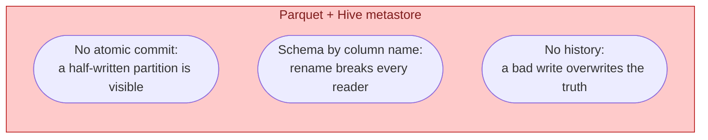
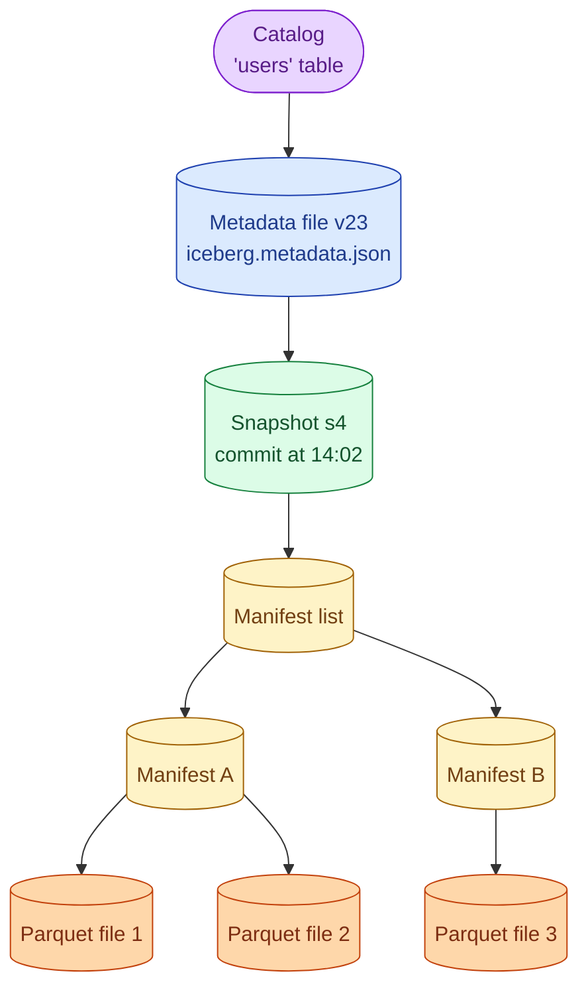



**Scenario:**
Your team writes daily Parquet files into S3, partitioned by date, registered in a Hive metastore. A backfill three weeks ago renamed `user_id` to `customer_id` on the source. The day-by-day files now disagree. Spark reads break on the older partitions. A junior asks if the team should "just rename the column in the metastore." A senior mentions Iceberg has "schema evolution." The lead wants you to explain what Iceberg actually buys and whether the team should migrate.

In the interview, the question is:

> What problem does Apache Iceberg solve that plain Parquet on object storage does not, and how does it handle schema evolution and time travel?

---

### Your Task:

1. Explain the three pain points of "Parquet files in S3 + Hive metastore" at scale.
2. Describe Iceberg's table format at the level of snapshot, manifest, data file.
3. Walk through what happens when you add, rename, and drop a column.
4. Cover time travel queries and the operational cost of maintaining an Iceberg table.

---

### What a Good Answer Covers:

* Atomic commits on object storage.
* The metadata tree: snapshot, manifest list, manifest, data file.
* Column IDs vs column names, and why that makes safe rename possible.
* `AS OF` queries and snapshot retention.
* Compaction, snapshot expiry, orphan file cleanup.
* When Iceberg is overkill (small tables, single-engine workloads).


<div class="pr-solution-divider"></div>


## Solution 80: Iceberg, Schema Evolution and Time Travel

### Short version you can say out loud

> Iceberg is a table format that sits on top of Parquet files in object storage and gives you the properties a warehouse table has but Hive-style tables never did: atomic commits, safe schema evolution, snapshot isolation, and time travel. The trick is a tree of metadata files that records which data files belong to the table at each commit, keyed by column IDs instead of column names. Renaming a column is a metadata edit, no data rewrite. Time travel means querying the table as of a previous snapshot, which is free until you expire that snapshot. The price is operational: you have to compact small files, expire old snapshots, and clean up orphans, or the table slowly becomes expensive to read.

### The three things plain Parquet on S3 hurts at



1. **Atomicity.** S3 has no rename, no transactional `MV`. You write files one by one, then update the metastore. If you crash between two of those, half the partition is visible to readers. The team's broken backfill is exactly this.
2. **Schema evolution by string match.** The metastore stores column names. If you rename `user_id` to `customer_id`, all your old Parquet files still have the old name in their footer. Readers either see two columns (most engines) or one column with nulls (a few). Either way, queries break.
3. **No time travel.** The lake is "the latest files." When a bad write overwrites yesterday's partition, the old data is gone. Restoring it means digging into S3 versioning, which is off by default.

Iceberg fixes all three with a single design choice: the table is defined by metadata, not by directory listing.

### What an Iceberg table actually is



Reading top to bottom:

* The **catalog** (Glue, Hive metastore, Nessie, Polaris) holds one pointer: which metadata file is current.
* The **metadata file** holds the table schema (with column IDs), partition spec, and a list of snapshots.
* A **snapshot** is a commit. It points to a manifest list.
* A **manifest list** points to several **manifests**. Each manifest lists data files with per-file stats (row count, min/max per column).
* The **data files** are the actual Parquet (or ORC, Avro).

A commit is "write new files, write a new manifest, write a new manifest list, write a new metadata file, atomic-swap the catalog pointer." Atomicity collapses to the catalog pointer swap, which most catalogs do as a single transaction.

Readers see exactly the snapshot the pointer was on when their query started. A writer committing mid-query does not affect them.

### Why rename is now free

Iceberg numbers every column with a stable integer ID at the moment it is added. The Parquet footers also use those IDs, not the column names. Renaming `user_id` to `customer_id` is a metadata edit: the schema in the metadata file changes the name attached to ID 7, the Parquet files are unchanged. Every reader, old or new, joins on ID 7.

That is the answer to the junior's "just rename in the metastore." On Hive, that breaks readers. On Iceberg, it works.

The full set of safe schema changes:

| Change | Iceberg | Plain Hive Parquet |
| --- | --- | --- |
| Add nullable column | yes, no rewrite | usually breaks old readers |
| Rename column | yes, metadata only | breaks every reader |
| Drop column | yes, metadata only | leftover data in old files, sometimes shows up |
| Reorder columns | yes | order matters in Hive |
| Widen type (int -> long) | yes | sometimes |
| Narrow type | no, would need rewrite | unsafe |
| Promote nullable -> non-null | no, requires backfill | unsafe |

### Time travel

Every snapshot is a fully consistent view of the table. As long as the snapshot has not been expired, you can query it:

```sql
SELECT count(*)
FROM iceberg.db.users
FOR SYSTEM_VERSION AS OF 7459284714928374;
-- or by timestamp:
SELECT *
FROM iceberg.db.users
FOR SYSTEM_TIME AS OF TIMESTAMP '2026-05-30 12:00:00';
```

Useful for three real cases:

1. **Auditing.** "What did this report show yesterday at 09:00?"
2. **Rollback.** Bad write at 14:02. Roll back to snapshot at 14:01, no restore from backup.
3. **Reproducible models.** A training job pins to a snapshot id so re-runs see the same data.

You can also do **incremental reads** by asking for files changed between snapshot A and snapshot B, which is how Iceberg powers CDC-like flows for batch consumers.

### The operational cost nobody mentions in blog posts

Iceberg is not free to run. Three jobs need to exist:

1. **Compaction.** Small files accumulate (one per micro-batch). Periodic compaction rewrites them into bigger files, deleting the small ones. Without it, query planning slows down because there are millions of manifest entries to read.
2. **Snapshot expiry.** Snapshots are cheap to keep but they pin the underlying data files. After 7 or 30 days you expire old snapshots so unused files can be dropped.
3. **Orphan file cleanup.** Crashed writes leave Parquet files in S3 that no manifest references. A scheduled job lists files and drops anything not referenced.

All three ship as Spark or Trino procedures. They are not optional. Teams that "set up Iceberg and forget it" end up paying lake costs that look like a warehouse.

### When Iceberg is overkill

* **One engine, one team, small table.** If only Spark writes and reads a 10 GB table, plain Parquet is fine.
* **No need for time travel or schema evolution.** If the schema is frozen and you are happy with append-only, Hive-style works.
* **You already pay for a warehouse.** Snowflake or BigQuery already gives you most Iceberg properties on managed tables.

Iceberg shines when more than one engine touches the table (Spark + Trino + DuckDB), when schema changes are real, or when you need to detach storage from compute and not get locked in.

### Common mistakes interviewers want you to name

1. **Treating Iceberg as a query engine.** It is not. Spark, Trino, Flink, DuckDB, and Snowflake are query engines; Iceberg is the file format for the table they read.
2. **Forgetting compaction.** Read latency degrades silently. Look for "many small files" in the query plan.
3. **Confusing time travel with backups.** Expiring snapshots deletes the underlying files. Time travel only goes back as far as your retention.
4. **Picking a catalog late.** The catalog is the only thing that makes Iceberg atomic. Choose deliberately: Glue for AWS shops, Nessie or Polaris for git-like branching, Hive metastore if you already have one.
5. **Mixing partition specs across snapshots without checking.** Iceberg supports hidden partitioning and partition evolution, but a query that does not understand the spec change can scan too much.

### Bonus follow-up the interviewer might throw

> *"How is Iceberg different from Delta Lake or Hudi?"*

All three are open table formats that bring ACID, schema evolution, and time travel to files in object storage. The differences:

* **Delta Lake** started inside Databricks and is the most polished single-vendor experience. Its metadata is a transaction log of JSON files plus checkpoints. Works best on Spark; reading from other engines lags Delta releases.
* **Hudi** focuses on streaming upserts and indexed lookups. Good when you do CDC into the lake and read it hot. Two table types (copy-on-write, merge-on-read) make it more configurable but more to operate.
* **Iceberg** is the most engine-neutral and the most mature on schema evolution. Snapshot model is the cleanest of the three for time travel and rollback.

For greenfield projects in the past two years, Iceberg has become the default for multi-engine lakehouse setups. Delta is still strong inside the Databricks ecosystem.

