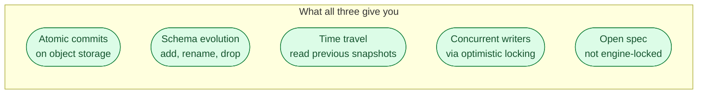



**Scenario:**
Your platform team is picking a lakehouse table format for the next two years of new pipelines. The shop runs Spark, Trino, and some Snowflake. A Databricks rep pitched Delta Lake. The Snowflake rep pitched Iceberg. Someone read a Uber engineering blog about Hudi. The lead wants a one-pager that says "pick X for these reasons" with the trade-offs honest.

In the interview, the question is:

> Three open table formats exist for lakehouses: Delta Lake, Iceberg, and Hudi. Compare them and recommend one for a multi-engine shop.

---

### Your Task:

1. Explain what an open table format is and what all three share.
2. Compare each format on metadata, engine support, schema evolution, and operational complexity.
3. Cover where each one shines.
4. Recommend one for the scenario above and defend it.

---

### What a Good Answer Covers:

* The shared base: ACID on object storage, schema evolution, time travel.
* Delta's transaction log of JSON + checkpoint parquet.
* Iceberg's snapshot/manifest tree and column IDs.
* Hudi's two table types (CoW, MoR) and indexed lookups.
* Engine support in 2026 (Spark, Trino, DuckDB, Snowflake, BigQuery).
* The "pick by who is reading" rule of thumb.



## Solution 81: Delta vs Iceberg vs Hudi

### Short version you can say out loud

> Three open table formats compete to be the de facto lakehouse standard: Delta Lake (from Databricks), Apache Iceberg (Netflix, now Apache), and Apache Hudi (Uber, now Apache). All three give you ACID commits, schema evolution, and time travel on top of Parquet files in object storage. The differences are in metadata design, engine support, and what each one optimises for. Delta is the most polished single-vendor experience and pairs perfectly with Spark and Databricks. Iceberg is the most engine-neutral and has the cleanest snapshot model; it has become the default choice for multi-engine shops. Hudi is the right pick when you have heavy streaming upserts and need indexed lookups, but it is harder to operate. For a multi-engine team running Spark, Trino, and Snowflake, the answer in 2026 is Iceberg.

### What they all share

Each puts a metadata layer on top of plain Parquet files. The metadata layer is what makes the table "transactional" instead of "a directory full of files." The differences are entirely in how that metadata layer is built.

### Delta Lake

**Metadata model.** A transaction log: a directory of small JSON files, each describing one commit (which files were added, which were removed). Every N commits, Delta writes a Parquet checkpoint that summarises the log so far. New readers replay from the latest checkpoint plus newer JSON entries.

**What it gets right.**

* Smooth UX on Spark. `df.write.format("delta")` and you are done.
* Liquid clustering and OPTIMIZE are well integrated.
* Delta Universal Format (UniForm) writes both Delta and Iceberg metadata at the same time, partial answer to interoperability.
* Strong inside Databricks: shares unity catalog, deletion vectors, change data feed.

**Where it hurts.**

* Outside Spark and Databricks, support lags. Trino, Flink, and DuckDB read Delta but newer features (deletion vectors, identity columns) land on Spark first.
* The transaction log is many small JSON files. Without checkpoints they slow planning; the checkpoint job is essential.
* Single-vendor pull. The spec is open, the centre of gravity is Databricks.

**Pick Delta when.** The stack is Spark-first and Databricks is already in the picture, or you want the lowest-friction single-engine experience.

### Iceberg

**Metadata model.** A tree: catalog points to a metadata file, metadata file lists snapshots, each snapshot points to a manifest list, manifest list points to manifests, manifests point to data files. See problem 80 for the picture.

**What it gets right.**

* Engine-neutral by design. Spark, Trino, Flink, DuckDB, Snowflake, BigQuery, and Athena all read and write Iceberg in 2026.
* Column IDs make rename and reorder safe forever.
* Snapshot model is the cleanest of the three. Time travel and rollback are first-class.
* Partition evolution: change how a table is partitioned without rewriting old data.
* Multiple catalog choices (Glue, Hive metastore, Nessie, Polaris, REST). You are not locked in.

**Where it hurts.**

* Operationally three jobs (compaction, snapshot expiry, orphan cleanup) are required. Easy to skip them and pay the price later.
* The catalog is load-bearing. Picking it late or wrong is hard to unwind.
* Some engines lag on newer features (V3 spec, deletion vectors equivalent).

**Pick Iceberg when.** More than one engine touches the table, you want to keep options open across vendors, or you need rigorous schema evolution and time travel.

### Hudi

**Metadata model.** A timeline of commits on disk plus optional indexes. Two table types:

* **Copy-on-Write (CoW).** Every update rewrites the file containing the row. Read-fast, write-slow. Equivalent to Iceberg or Delta's default behaviour.
* **Merge-on-Read (MoR).** Updates land in row-based delta logs. Readers merge them at query time, with periodic compaction folding deltas into base files. Write-fast, read-slower until compaction.

**What it gets right.**

* Streaming upserts. The MoR table type and built-in record-level indexes (HBase, Bloom, Bucket) make "merge billions of changes into a 100 TB table" tractable.
* Built-in incremental queries: ask for "files changed since timestamp X" and get a reader-friendly view.
* DeltaStreamer ingests from Kafka directly into Hudi tables, no Spark code.

**Where it hurts.**

* Operational complexity. Choosing CoW vs MoR is a real decision. Compaction has knobs. Indexes have knobs.
* Engine support is the weakest of the three outside Spark.
* Documentation and community size are smaller than Delta and Iceberg.

**Pick Hudi when.** You have heavy streaming upserts (CDC into the lake) and need read-time freshness; you are willing to invest in the operational side.

### The 2026 engine matrix (rough but useful)

| Engine | Delta | Iceberg | Hudi |
| --- | --- | --- | --- |
| Spark | excellent | excellent | excellent |
| Databricks | native | via UniForm | community |
| Snowflake | read | native (manage and read) | preview |
| BigQuery | read | external tables | read |
| Trino / Athena | good | excellent | good |
| Flink | community | excellent | excellent |
| DuckDB | read | read | read |

"Excellent" means write and read with full feature parity. "Read" means query-only or limited write.

### Picking by who is reading the table

That table is the simplest rule. Look at every engine that needs to query this table over the next two years, then pick the format with the widest "excellent" coverage across that list.

For the scenario (Spark + Trino + Snowflake), Iceberg is the clear winner: native or excellent on all three. Delta needs UniForm to talk to Snowflake. Hudi has gaps on Trino and Snowflake.

For a Databricks-only shop, Delta is fine and friendlier. For a streaming-CDC pipeline, consider Hudi MoR. For everything else in 2026, Iceberg is the safer bet because it does not pull you toward any one vendor.

### The recommendation for the scenario

> **Iceberg.** Catalog: Polaris if Snowflake is the primary, Glue if AWS is the primary, Nessie if the team wants git-like branching. Run scheduled compaction, snapshot expiry (30 days), and orphan cleanup as Spark procedures.

If Databricks-the-platform becomes the main consumer in year two, UniForm lets the same files be read as Delta with no migration. That optionality is the strongest reason to start on Iceberg.

### Common mistakes interviewers want you to name

1. **Confusing format with engine.** Delta, Iceberg, Hudi are table formats. Spark, Trino, Snowflake are engines. Mixing them up signals you have not used them.
2. **Picking based on what the cloud vendor pushes.** Each vendor pushes "their" format. Pick by who reads the table, not by who sold it.
3. **Underestimating the catalog choice.** The catalog is the only thing that gives you atomicity. Migrating catalogs later is painful.
4. **Ignoring compaction.** Lake costs balloon silently. All three formats need a compaction story.
5. **Assuming the formats are equivalent for upserts.** They are not. Hudi MoR is the fastest for high-churn upserts; Delta and Iceberg have caught up for batch but trail for streaming.

### Bonus follow-up the interviewer might throw

> *"What about Snowflake-managed Iceberg tables? Are those still 'open'?"*

Yes, but with an asterisk. Snowflake-managed Iceberg tables put the metadata under Snowflake's catalog and Snowflake handles compaction and snapshot expiry. The data files are still standard Parquet, the manifest is standard Iceberg, and external engines (Spark, Trino) can read them by pointing at Snowflake's catalog through its Iceberg REST endpoint.

The trade-off is operational simplicity vs portability. You get the benefits of a managed catalog, you pay Snowflake to do the chores, but if you want to leave Snowflake later you can: the data is yours, the metadata is in an open spec, the catalog is the only thing you need to migrate. Reasonable choice for many teams.

