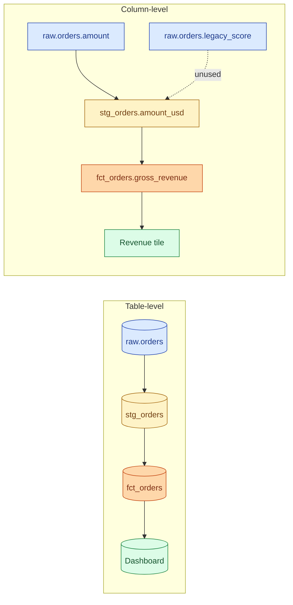
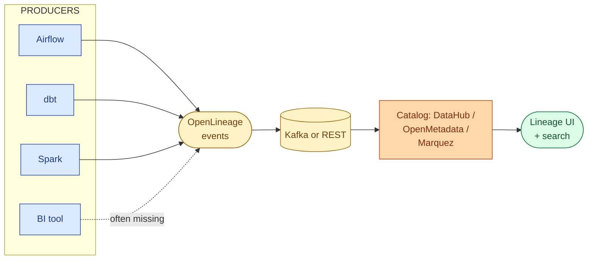



**Scenario:**
A product manager wants to deprecate the `legacy_score` column on the `customers` table. Three engineers say "we don't think anything uses it." A junior says "let me check." Four hours later they list 12 dashboards and 7 dbt models that touch it directly. Nobody knows about the four downstream models that read those. The PM postpones the deprecation. The lead asks you to set up column-level lineage so the next deprecation takes minutes, not days.

In the interview, the question is:

> Why is column-level lineage useful and how do you set it up across a typical warehouse + dbt + BI stack?

---

### Your Task:

1. Explain the difference between table-level and column-level lineage.
2. List the three concrete things lineage unlocks (impact analysis, root-cause debugging, compliance).
3. Walk through how lineage is actually extracted (SQL parsing, dbt manifest, OpenLineage events).
4. Cover the real limits: dynamic SQL, views, UDFs, BI tools that hide their queries.

---

### What a Good Answer Covers:

* dbt's `manifest.json` and `catalog.json` as the cheapest source of lineage.
* OpenLineage as the open standard for emitting lineage from anywhere.
* Tools that consume it (DataHub, OpenMetadata, Marquez, Atlan, Collibra).
* Why BI tools are usually the lineage cliff.
* The difference between static lineage (from SQL) and runtime lineage (from execution).


<div class="pr-solution-divider"></div>


## Solution 82: Column-Level Lineage in Practice

### Short version you can say out loud

> Lineage is the dependency graph of your data: which table feeds which, and at column-level, which input column feeds which output column. Table-level lineage answers "is anything downstream of table X." Column-level answers "is anything downstream of column X.score." The second question is what you actually need for safe deprecations, root-cause debugging, and PII tracking. The cheapest source is dbt's compiled manifest, which already captures column-level dependencies inside dbt. For everything else (Spark jobs, Airflow tasks, ingestion, BI tools), OpenLineage is the open standard for emitting lineage events as work runs. A consumer (DataHub, OpenMetadata, Marquez) collects those events and gives you the graph. BI tools are usually the lineage cliff because most of them generate SQL at click-time and do not emit it cleanly.

### Table-level vs column-level



Table-level says "the dashboard depends on `fct_orders`." Column-level says "the Revenue tile is computed from `gross_revenue`, which is `amount * fx_rate`, which traces back to `raw.orders.amount`. The legacy_score column has no downstream consumer."

The scenario in the question is the classic case for column-level. The PM does not need to know "is anything downstream of `customers`." Of course something is. They need to know whether the specific column they want to drop has any consumer.

### The three concrete things lineage unlocks

**1. Impact analysis.** Before changing a column, list everything downstream. "Drop legacy_score? Two dashboards reference it. Zero models. Safe after these two are updated."

**2. Root-cause debugging.** A dashboard is wrong. Walk lineage upstream. The first column whose freshness or distribution looks off is the suspect. Problems 31, 46, and 49 all reduce in time if you have this graph.

**3. Compliance and PII.** Tag `users.email` as PII. Column-level lineage auto-tags every downstream column. Right-to-be-forgotten requests have a precise blast radius.

Without column-level, all three answers degrade to "anything downstream of the table," which is too broad to act on.

### Where lineage actually comes from

Two sources combine to give you the full picture.

**Static lineage from SQL parsing.**

For dbt, the parser already exists. `target/manifest.json` after `dbt compile` has every model's compiled SQL plus its inputs. A column-level parser (sqlglot, dbt's own column-level lineage, or one of the catalog tools) reads that SQL and produces the column map. Free, no runtime overhead, accurate for everything dbt knows about.

For non-dbt SQL, a parser like sqlglot works on the raw text. Good for warehouse views, scheduled queries, BI tool SQL that you can scrape.

**Runtime lineage from OpenLineage.**

OpenLineage is a JSON schema for "a job ran" events. Producers emit events at the start, completion, and failure of a job:

```json
{
  "eventType": "COMPLETE",
  "eventTime": "2026-06-04T03:00:00Z",
  "job": {"namespace": "airflow.prod", "name": "daily_orders_load"},
  "run": {"runId": "abc-123"},
  "inputs":  [{"namespace": "postgres.prod", "name": "raw.orders"}],
  "outputs": [{"namespace": "warehouse.prod", "name": "stg.orders",
               "facets": {"columnLineage": { ... }}}]
}
```

The `columnLineage` facet maps output columns to input columns. Producers that emit it natively in 2026: Spark, Flink, dbt (via the `dbt-ol` wrapper), Airflow operators, Trino, Marquez integrations.

A consumer (DataHub, OpenMetadata, Marquez) listens to a Kafka topic or REST endpoint and stitches all the events into the lineage graph.

### The realistic setup



For most teams, the path of least resistance:

1. Turn on dbt's column-level lineage in `manifest.json` and parse it into the catalog. Covers 70% of the warehouse.
2. Add the OpenLineage Airflow plugin. Covers the orchestration boundary.
3. Add OpenLineage Spark listener. Covers any non-dbt transformation.
4. Wire the BI tool. This is the hard part (see next section).
5. Tag PII and key business columns at the source. Tags propagate downstream automatically.

### The BI tool cliff

Most BI tools generate SQL at query time. Tableau, Looker, Power BI, and Mode all do this. The SQL is in their logs but extracting it cleanly is non-trivial:

* **Looker** has the cleanest story. LookML defines explicit dependencies; lineage falls out of the model.
* **dbt Semantic Layer / Cube** also defines explicit dependencies, lineage is clean.
* **Tableau, Power BI** can be scraped from their REST APIs and parsed, but custom SQL and parameter-driven queries are noisy.
* **Notebooks (Jupyter, Hex, Deepnote)** are the worst. SQL is buried in cells, parameters are runtime. Static analysis is unreliable.

Plan for this. A team that cannot trace a column past the warehouse boundary has half a lineage system.

### Static vs runtime, and why you need both

* **Static** sees everything the code says happens. Misses dynamic SQL, conditional branches, and runtime UDFs.
* **Runtime** sees what actually happened. Misses jobs that did not run since the lineage system started.

A mature setup uses both: static for impact analysis on a candidate change, runtime for "what actually ran last week."

### Common mistakes interviewers want you to name

1. **Stopping at table-level.** Useful but does not answer the questions that hurt.
2. **Treating BI tools as out-of-scope.** Most of your real consumers are there. Half a graph is no graph.
3. **Manual lineage in a wiki.** It rots within a week and people stop trusting it.
4. **One-time backfill, no ongoing capture.** Lineage that does not move forward with the system is wrong the day after you finish it.
5. **Lineage without ownership tagging.** Knowing what is downstream is useful; knowing who owns each downstream is what makes deprecation possible.

### Bonus follow-up the interviewer might throw

> *"How do you handle a job that reads from one of a thousand tables based on a parameter?"*

Static lineage will list all 1,000 inputs (overcount). Runtime lineage will list only the one the run actually touched (undercount across runs).

The pragmatic answer: aggregate runtime lineage over a window. "Over the last 30 days, this job has read from these 47 of 1,000 tables." That is the effective dependency, even if the code allows for more. Use static lineage to validate that the 47 is a subset of the 1,000, not to claim it is the full picture.

