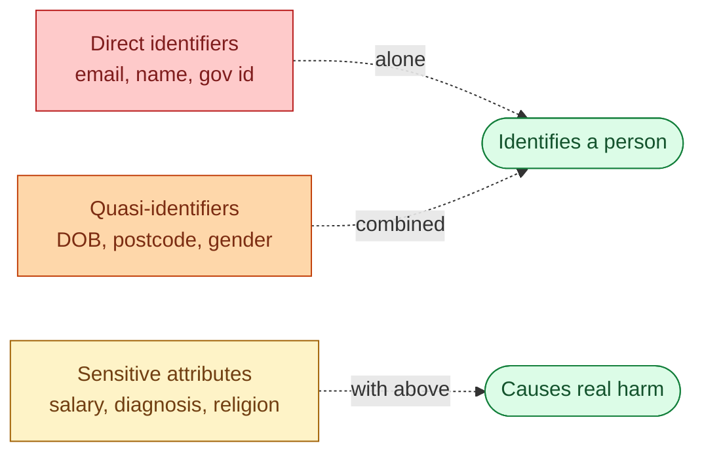
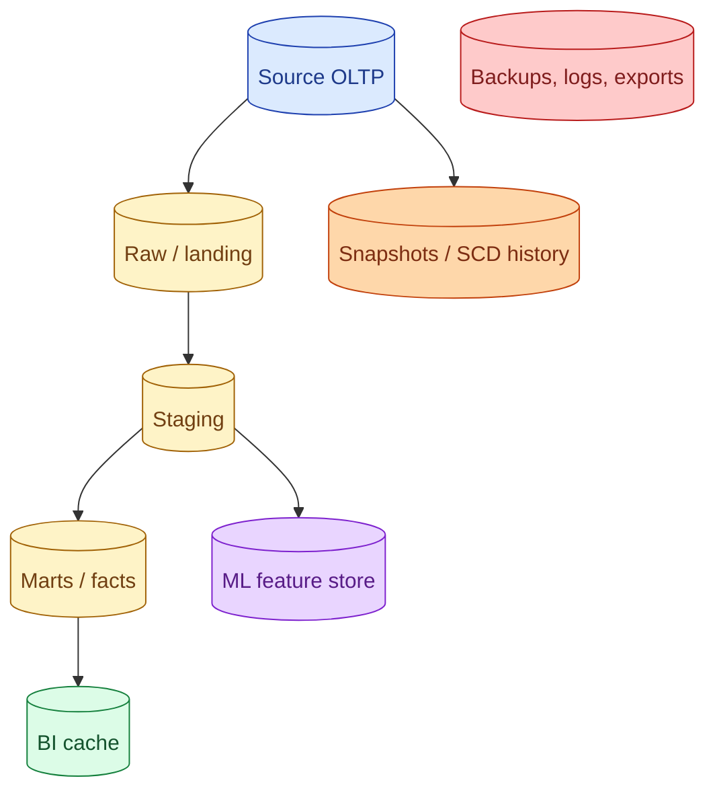



**Scenario:**
Legal sent a "right to be forgotten" request: a user wants every record deleted. Your warehouse holds their email in 18 tables. Their email also appears in three dashboards. The compliance officer wants a one-line answer: "is it gone?" The CTO wants a longer answer: "and how do we make this take an hour next time, not a week."

In the interview, the question is:

> Walk me through how a data platform handles PII end-to-end: classification, masking, and right-to-be-forgotten deletes.

---

### Your Task:

1. Define PII and explain why a clear taxonomy matters.
2. Compare the three main protection techniques (masking, hashing, tokenisation) and where each fits.
3. Walk through the deletion playbook for a real RTBF request.
4. Cover the policies you can encode (row-level access, column policies, retention).

---

### What a Good Answer Covers:

* Direct identifiers vs quasi-identifiers vs sensitive attributes.
* Static masking (in storage) vs dynamic masking (at query time).
* Hashing being one-way vs tokenisation being reversible with a vault.
* Why aggregates and ML features still leak (k-anonymity, joinability).
* The deletion fan-out: source, snapshots, derived models, backups, logs.
* Retention policies that prevent the next RTBF from being a week-long project.


<div class="pr-solution-divider"></div>


## Solution 83: PII, Masking, and Right-to-be-Forgotten

### Short version you can say out loud

> Personally identifiable information is any data that can identify a real person, directly (name, email, government id) or in combination (date of birth plus postcode plus employer). Treating it well means three things: classify it explicitly so everyone knows what is sensitive, protect it with the right technique (mask, hash, or tokenise depending on the use case), and design the warehouse so deletes are easy. Right-to-be-forgotten requests are the moment the design pays off or punishes you. Teams that handle them in an hour have a single user-id key, a forgetting table that downstream models honour, and tokenised PII that disappears when the vault entry is deleted. Teams that handle them in a week have email and phone embedded in 18 places with no central index.

### Three flavours of identifying data



The taxonomy matters because each tier needs a different treatment:

* **Direct identifiers** need full protection. Mask or tokenise by default. Most teams handle this layer.
* **Quasi-identifiers** are the trap. Date of birth + postcode + employer can re-identify the same person even with name and email gone. K-anonymity techniques exist for this; usually you redact to bucket level (year, prefix of postcode).
* **Sensitive attributes** become a problem when joined to either of the above. The salary table is fine alone, dangerous joined to the name table.

Most regulatory frameworks (GDPR, CCPA, HIPAA) cover all three but with different language. The data team needs one internal taxonomy that maps to all of them.

### Mask, hash, tokenise: three protection techniques

| Technique | What it does | Reversible? | When to use |
| --- | --- | --- | --- |
| **Mask** | Replace with stars or fixed value | No | Display in BI for non-privileged users |
| **Hash** | Replace with deterministic one-way hash | No (in practice) | Joining or counting without seeing identity |
| **Tokenise** | Replace with random token, store mapping in a vault | Yes (only with vault access) | When the original value must be retrievable for specific operations (notifications, support) |

**Masking** is what most BI tools show. The data is in storage but the user sees `***@***.com`. Useful when the issue is "this analyst should not see emails." Useless when the issue is "this data should not exist in clear text at all."

**Hashing** is what you use to count unique users without storing the email. `sha256(email + salt)` gives you a stable identifier that joins correctly but cannot be reversed. The salt is the whole story: without it, attackers brute-force the hash space of common emails in minutes.

**Tokenisation** is the answer when the business needs to operate on the underlying value (send an email, look up a customer) but the warehouse should not see it. The token is a meaningless reference; the email lives in a separate vault with strict access. Right-to-be-forgotten becomes a vault delete, and every downstream copy of the token instantly becomes useless.

The right approach is usually a mix: tokenise at ingestion, mask in BI, hash for joins.

### What "data" means for an RTBF delete



A right-to-be-forgotten request has to cover every box. The order matters:

1. **Source OLTP.** Delete the row. Most regulations require this within 30 days.
2. **Raw / landing tables.** Delete rows for that user.
3. **Staging and marts.** Re-derive without the user, or apply a "forget" mask. dbt models that join to a `forgotten_users` table can filter on read.
4. **Snapshots and SCD history.** This is where most teams get stuck. Snapshots are append-only history. The pragma is: rewrite the history rows to scrub the PII columns while keeping the row (for audit), or delete the rows entirely and accept the gap.
5. **BI cache.** Refresh or invalidate.
6. **ML feature store.** Both online (KV) and offline (training set) copies need attention. Online is easy. Offline is hard because old training sets may have been used for production models.
7. **Backups, logs, exports.** Hardest. Most regulations let you defer until the backup naturally rotates out (typically 90 days) if you document the policy and ensure the data is not restored.

### The forgetting-table pattern

The cleanest design for staying RTBF-ready:

```sql
-- One central table, written when a request arrives
CREATE TABLE governance.forgotten_users (
  user_id BIGINT PRIMARY KEY,
  forgotten_at TIMESTAMP NOT NULL,
  request_id TEXT NOT NULL
);
```

Every downstream model that joins to users filters on this:

```sql
SELECT u.*
FROM {{ ref('dim_users') }} u
WHERE NOT EXISTS (
  SELECT 1 FROM {{ ref('forgotten_users') }} f WHERE f.user_id = u.user_id
);
```

A single insert into `forgotten_users` instantly removes the user from every model that respects the pattern. The 18-table fan-out becomes a one-row write.

This is also why a single stable `user_id` matters more than people realise. If the team identifies users by email in some tables and by phone in others, the forgetting table cannot fan out cleanly. Pick one identity column and use it everywhere.

### Policies you can encode in the warehouse

Most modern warehouses give you these as first-class objects:

* **Column-level access policies** (Snowflake, BigQuery, Databricks). The `email` column returns NULL or the masked value depending on the role.
* **Row-level access policies.** "Marketing users see only EU customers."
* **Dynamic masking.** Based on the querying role: full value for support, hash for analytics, NULL for everyone else.
* **Retention.** Drop data after N days automatically.

These are not a substitute for tokenisation but they cover most day-to-day uses of "the warehouse has too much PII." Combine them with tagging at the catalog level so a column marked `pii=email` automatically gets the mask applied.

### A realistic RTBF playbook

Day 0, request arrives.

1. Look up the user's `user_id` in the identity table.
2. `INSERT INTO governance.forgotten_users (...)` with that id and the request id.
3. Trigger the source OLTP delete (or queue it for the OLTP team).
4. Trigger a vault delete for any tokens referring to that user.
5. Run a job that scrubs snapshot/SCD history rows: replace PII columns with NULL, keep the row for audit.
6. Invalidate BI caches and run the next regular dbt refresh.

Day 7, verify.

7. Run a verification job that scans all PII columns in the warehouse for the user's identifiers. Should find zero hits.
8. File the confirmation with legal.

Done. With the forgetting-table pattern in place, steps 2 and 5 cover most of the warehouse with a single insert and a single procedure.

### Common mistakes interviewers want you to name

1. **Embedding PII as the join key.** Once `email` is the join everywhere, deletes fan out to dozens of tables. Use a stable surrogate `user_id`.
2. **Hashing without salt.** Reversal by lookup tables for common values is trivial.
3. **Static masking with the raw value also visible.** The mask exists in the BI, the raw column still sits in the warehouse. Did nothing.
4. **Ignoring snapshots and feature stores.** RTBF deletes that miss SCD history leave the email in the past.
5. **No central forgotten-users table.** Every model rewrites its own filter. Inconsistent, expensive, error-prone.

### Bonus follow-up the interviewer might throw

> *"What about model training data? You used a deleted user's data to train a model that is now in production."*

Genuinely hard. Three positions:

1. **The data is gone from the training set, not from the model.** Most regulators accept this if the training data is deleted and the model is not retrained for that purpose.
2. **Retrain regularly anyway.** Production models that are retrained every quarter naturally age out a deleted user's signal.
3. **Differential privacy at training.** Add noise during training so no single user materially affects the model. Doable for some workloads, expensive for others.

The first answer is what most companies actually do. The second is what most regulators are starting to expect. The third is where this is heading.

