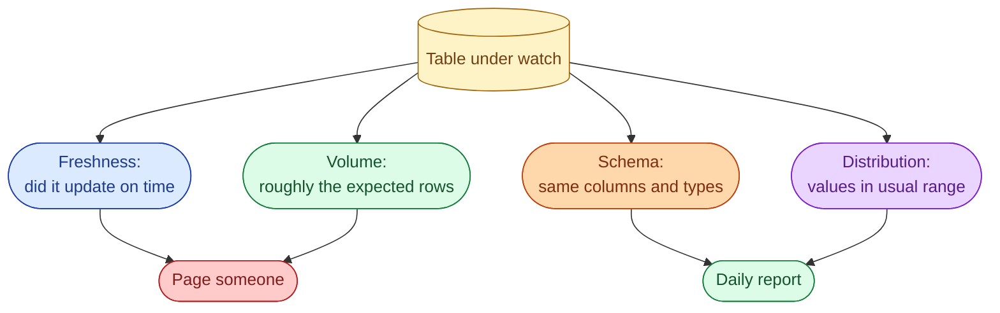



**Scenario:**
A revenue dashboard sat at "no change since yesterday" for four days before a finance analyst noticed. The job had been failing silently, the warehouse had stale numbers, and downstream models continued to read them. The lead asks you to design a data observability layer so a four-day stale dashboard is impossible.

In the interview, the question is:

> What does data observability mean, what do you actually monitor, and how do you turn it into alerts that page the right person?

---

### Your Task:

1. List the four pillars of data observability (freshness, volume, schema, distribution) and what each catches.
2. Walk through how each is implemented as a check against a warehouse table.
3. Cover where the checks live (dbt tests, Great Expectations, Monte Carlo, custom).
4. Explain the SLA / SLO / SLI vocabulary applied to data.
5. Cover the alert fatigue problem and how to avoid it.

---

### What a Good Answer Covers:

* `MAX(updated_at)` as the cheapest freshness check.
* Row-count-per-day Z-scores for volume.
* `INFORMATION_SCHEMA` diffs for schema drift.
* Min, max, null-rate, distinct-count for distribution drift.
* Why "alert on every dbt test failure" burns the team in a week.
* SLO on critical tables vs noisy alerts on the rest.


<div class="pr-solution-divider"></div>


## Solution 84: Data Observability, Freshness, Volume, and Drift

### Short version you can say out loud

> Data observability is the discipline of treating data the way SREs treat services: define what "healthy" means, measure it continuously, alert when it breaks, and review the misses. The four pillars are freshness (is the data up to date), volume (did roughly the expected number of rows arrive), schema (did anything change about the structure), and distribution (do the values look like they usually do). Each pillar maps to a cheap SQL check you can run after every load. Tools (Great Expectations, Monte Carlo, dbt tests, custom checks) automate the checks; the hard part is not the checking, it is deciding which tables get a paging SLO and which get only a daily report. A team that pages on every test failure burns out within a week. A team that only pages on the few tables that drive money keeps its sanity and still catches the four-day stale dashboard.

### The four pillars



### Pillar 1, freshness

The cheapest, the most important, and the one the team in the scenario was missing.

```sql
SELECT
  TIMESTAMP_DIFF(CURRENT_TIMESTAMP(), MAX(updated_at), MINUTE) AS minutes_stale
FROM analytics.fct_revenue;
```

If `minutes_stale > 120` on a table that should refresh hourly, the table is stale. Page someone.

Two refinements that matter in real life:

* Use the table's expected schedule, not "minutes since now." A nightly table is fresh until tomorrow morning, not "stale after 90 minutes."
* Honour weekends and holidays for tables whose source is only active on weekdays. Otherwise the alert pages Saturday morning every week.

For the scenario, a single freshness check on the revenue table would have caught the four-day silence on day one.

### Pillar 2, volume

How many rows did we get today versus a normal day?

```sql
WITH daily_count AS (
  SELECT DATE(created_at) AS day, COUNT(*) AS n
  FROM analytics.fct_orders
  WHERE created_at >= CURRENT_DATE - INTERVAL '30' DAY
  GROUP BY day
),
stats AS (
  SELECT AVG(n) AS mean, STDDEV(n) AS sd
  FROM daily_count
  WHERE day < CURRENT_DATE
)
SELECT
  today.n,
  (today.n - stats.mean) / stats.sd AS zscore
FROM daily_count today, stats
WHERE today.day = CURRENT_DATE;
```

A z-score outside `[-3, 3]` is suspicious. Outside `[-5, 5]` is almost certainly broken.

Two failure modes the volume check catches that freshness does not:

* **Partial load.** The job finished on time but loaded 10% of the rows. Freshness says OK; volume catches it.
* **Doubled load.** The job ran twice. Freshness says OK; volume catches it. See problem 9.

### Pillar 3, schema

Did anything change about the structure since yesterday?

```sql
SELECT column_name, data_type
FROM `region.INFORMATION_SCHEMA.COLUMNS`
WHERE table_name = 'fct_orders'
ORDER BY ordinal_position;
```

Snapshot this daily. Diff against yesterday. Any change (column added, type widened, column dropped) goes to the schema-change report.

This is rarely a pager-level alert; it is a signal for the team to read in the morning. A column dropping silently usually means an upstream change that downstream models will fail on within hours; spotting it before that happens turns an incident into a quiet fix.

### Pillar 4, distribution

The most subtle. Yesterday the `country` column was 70% US, 20% UK, 10% other. Today it is 100% US. Nothing failed but something changed.

Cheap proxies that catch most drift:

```sql
SELECT
  COUNT(*) AS n,
  AVG(amount) AS avg_amount,
  STDDEV(amount) AS sd_amount,
  COUNT(DISTINCT user_id) AS unique_users,
  COUNTIF(amount IS NULL) AS null_amount,
  MIN(amount) AS min_amount,
  MAX(amount) AS max_amount
FROM analytics.fct_orders
WHERE DATE(created_at) = CURRENT_DATE;
```

Compare against rolling 30-day baselines. Alert when a column's null rate jumps from 1% to 30%, or when `MAX(amount)` triples.

For high-cardinality categorical columns (country, plan), a KS-test or PSI (Population Stability Index) is more rigorous, but the simple per-day summary catches 80% of real drift. ML feature stores almost always have PSI built in.

### Where the checks live

Three layers, increasing in power and cost:

| Layer | Examples | Coverage |
| --- | --- | --- |
| In-pipeline tests | dbt tests, Great Expectations | Cheap, fast, run after every load |
| Out-of-band monitor | Monte Carlo, Anomalo, Bigeye | Catches anomalies in tables the team forgot to test |
| Custom SQL on schedule | Anything you write | The pillars not covered above |

A pragmatic team uses all three: dbt tests for known invariants (uniqueness, not-null, accepted values), a vendor for the catch-all anomaly detection, and a small set of custom checks for the highest-value tables.

### SLA, SLO, SLI for data

* **SLI**, service-level indicator. The specific metric. "Minutes since `fct_revenue` last updated."
* **SLO**, service-level objective. Your internal target. "99% of days, fct_revenue is under 60 minutes stale."
* **SLA**, service-level agreement. The external promise to the business, usually wider than the SLO. "Revenue numbers available by 09:00 every working day."

The discipline is the same as for services. Define SLOs only on tables that matter. Track them. Review them quarterly. If you blow the SLO three months running, either the table needs investment or the SLO was wrong.

### Avoiding alert fatigue

The biggest mistake teams make with data observability is the same one ops teams used to make: alert on everything, page no one effectively.

Three rules that keep alerts useful:

1. **Tier tables.** Tier 1 (revenue, billing, ML production features) gets paging alerts. Tier 2 (analytics) gets Slack alerts in business hours. Tier 3 (experimental) gets a daily report.
2. **Alert on user-impacting failure, not on every test failure.** A failing `unique` test on a staging table is not a page. A four-day stale revenue table is.
3. **Burn-rate alerts, not single-failure alerts.** Page when the error budget is being burned through (e.g., 5 freshness misses in a week), not on every individual miss.

The scenario should resolve to: `fct_revenue` is Tier 1, freshness SLO of 60 minutes, paging alert when stale for more than 90 minutes. A single check, paging once, would have caught the four-day outage in hour one.

### Common mistakes interviewers want you to name

1. **No SLOs.** "Alert when stale" with no threshold means either too noisy or never fires.
2. **Same tier for every table.** Burns the team. Tier them.
3. **Tests that always pass.** Unique on a primary key catches almost nothing in steady state. Freshness and volume catch the real incidents.
4. **Distribution checks without baselines.** A standalone "max amount is 9000" is meaningless. Compared to a 30-day baseline it tells you everything.
5. **No runbook.** Alert fires, on-call has no idea what to do. Every paging alert needs a one-page runbook.

### Bonus follow-up the interviewer might throw

> *"How do you bootstrap the baseline when there is no history yet?"*

Two answers depending on the table's age.

For a brand new table with no history, start with sanity checks (not null, monotonic id, schema), no anomaly detection. Collect 30 days of baseline. Switch on the anomaly checks at day 31.

For an older table you are just adding to monitoring, scan the last 90 days, compute the baseline, and flag the days that look anomalous now so the team can label them. The first month of an anomaly monitor is always noisy because you are catching things that were always wrong; that is a feature, not a bug.

