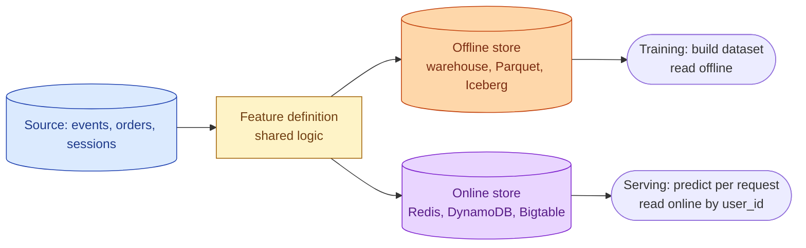
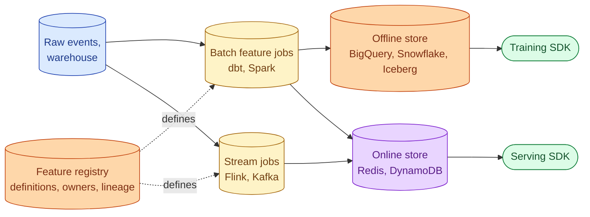



**Scenario:**
The ML team trained a churn model on warehouse data: 90-day rolling average of orders, days since last order, plan tier. The model performs great offline. In production it under-performs and looks confused. After two weeks of debugging, the data engineer finds that the online inference path computes "days since last order" from a different table than the training pipeline, and the boundaries differ. The CTO asks why you do not have a feature store yet.

In the interview, the question is:

> What is a feature store, why does the online / offline split matter, and how do you handle training-serving skew?

---

### Your Task:

1. Define the offline store and the online store and what each is good at.
2. Explain training-serving skew and the two flavours (calculation skew, time skew).
3. Sketch a realistic feature store architecture (Feast, Tecton, Vertex AI Feature Store, or homegrown).
4. Cover point-in-time correctness and why it is the hard problem.
5. Compare buying vs building.

---

### What a Good Answer Covers:

* The offline store is the warehouse; the online store is a low-latency KV (Redis, DynamoDB, Bigtable).
* The shared feature definition that produces both consistently.
* "As of" joins for training that respect each row's timestamp.
* Real-time vs batch features and where streaming sits.
* Monitoring features for drift, the same way you monitor data.


<div class="pr-solution-divider"></div>


## Solution 85: Feature Store, Online vs Offline

### Short version you can say out loud

> A feature store is the layer that produces, stores, and serves the features an ML model uses, with the same logic at training time and serving time. It has two storage sides: an offline store (your warehouse, optimised for large batch reads when you build training sets), and an online store (a low-latency KV like Redis or DynamoDB, optimised for single-key reads at inference time). The reason it matters is training-serving skew: the model learned on one definition of "days since last order" and production gave it a different one. A feature store solves this by having one definition that emits to both sides at once. Point-in-time correctness is the hard problem: when you build a training set, every feature value must be what it was at the moment of the label, not what it is now. Get that wrong and your model learns from the future.

### The two sides



* **Offline store.** The warehouse already does this job. Features are wide tables keyed by entity (`user_id`) and time. Training jobs read them in bulk. Reads are throughput-optimised.
* **Online store.** Optimised for "give me feature vector for user 42 in 5 ms." Keyed by entity id, no time component for the simple case (the latest value is what serving needs). Reads are latency-optimised.

A feature store is the thing that keeps these two consistent.

### Training-serving skew, the two flavours

**Calculation skew.** The same feature is computed by two different code paths. The training pipeline does `SUM(orders_last_90d)` in dbt. The serving pipeline does it in a Flask handler with slightly different boundaries. Numbers diverge.

This is exactly the scenario above. The fix is structural: there must be one definition. A feature store gives you a way to write it once and run it on both sides.

**Time skew.** The training set joins on "the latest" feature value when it should have joined on "what was true at the time of the label." If you trained a churn model on `last_order_date` but built the dataset today, every user has a `last_order_date` from today's snapshot, not from the time of the label you are predicting. The model learns "all churned users have an old last_order_date" which is trivially true given how you built the data.

This is the more dangerous flavour because the model looks great offline (you accidentally leaked the label) and bombs in production.

### Point-in-time correctness

The fix is the as-of join. For every label row at time T, join each feature as of time T.

```sql
-- Pseudocode for one feature
SELECT
  l.user_id,
  l.label_at,
  l.churned,
  f.days_since_last_order AS days_since_last_order_at_label
FROM labels l
LEFT JOIN feature_history f
  ON f.user_id = l.user_id
  AND f.valid_from <= l.label_at
  AND (f.valid_to > l.label_at OR f.valid_to IS NULL)
```

`feature_history` is a Type 2 SCD of the feature value over time. Build the training set this way and every row gets the feature value that was visible at the moment of the label, not the value today.

Feature stores ship this as `get_historical_features(entity_df)` or similar. The entity_df has `user_id` and `event_timestamp`; the store returns the feature vector as of each timestamp.

### A realistic feature store architecture



The pieces:

* **Feature registry.** YAML or Python definitions: "this is `days_since_last_order`, computed this way, refreshed daily, owned by team X."
* **Batch jobs.** Periodic dbt models or Spark jobs that materialise feature values into the offline store and push to the online store.
* **Stream jobs.** For features that need sub-minute freshness (real-time risk scores), compute in Flink and write to the online store.
* **Offline store.** The warehouse. Iceberg or partitioned native tables, with the SCD shape needed for point-in-time joins.
* **Online store.** Redis for sub-millisecond reads, DynamoDB or Bigtable for petabyte scale. Just the latest value per entity, or a small recent window.
* **Training SDK.** `get_historical_features(entity_df)` returns the point-in-time-correct training set.
* **Serving SDK.** `get_online_features(entity_ids)` returns the latest feature vector for inference.

### Real-time, batch, and the lambda problem

If a feature is computed in batch (overnight dbt run) and the serving SDK reads the online store, the online store has the result of yesterday's batch. Fine for slow-moving features (90-day order count).

For features that need to be fresh (last action 5 seconds ago), you stream them. The streaming job writes the latest value to the online store directly.

If the same feature needs both (historical for training, fresh for serving), you have a lambda architecture: batch backfills the history, stream maintains the current. The feature store's job is to make sure both produce numbers that match at the boundaries. Most teams pick one path per feature and accept the trade-offs.

### Buy vs build

| Option | When it fits |
| --- | --- |
| **Feast** (open source) | Small to medium teams, simple feature set, want full control |
| **Tecton** (vendor, commercial Feast) | Real-time features, large team, can afford it |
| **Vertex AI / SageMaker Feature Store** | Already deep in GCP or AWS, want managed |
| **Databricks Feature Store** | Already on Databricks |
| **Homegrown** (warehouse + KV + a registry table) | Small team, no real-time needs, already have warehouse and KV |

For the scenario, a homegrown setup is enough: dbt models maintain the offline feature tables, a small job pushes the latest row per user to Redis on schedule, and a thin Python SDK reads from both. Feast is overkill until the team has half a dozen models in production.

### Monitoring features

Treat features the same as data: pillars from problem 84 apply.

* Freshness, did the feature update on its schedule.
* Volume, are we writing the expected number of rows per day.
* Distribution drift, is the feature distribution still what the model trained on. PSI is the standard metric here.

Drift on a feature does not necessarily mean the model is wrong, but it is a strong signal to retrain or investigate.

### Common mistakes interviewers want you to name

1. **Two code paths for the same feature.** The exact bug in the scenario. One definition, two consumers.
2. **No point-in-time joins.** Training set leaks the label, model looks great offline, fails in production.
3. **Online store with no TTL on training-only features.** Wasted Redis memory; some features are needed offline but never served.
4. **No feature drift monitoring.** Model performance silently degrades. You find out from a metric dashboard, not from the system.
5. **Building a feature store before you have models.** Premature platform investment. Wait until you have two or three models with feature overlap.

### Bonus follow-up the interviewer might throw

> *"How do you handle a feature that needs the last 7 days of behaviour at inference time?"*

Two patterns.

**Precompute the rollup, store the latest in the online store.** A nightly job computes `orders_last_7d` for every user, writes one row per user to Redis. Serving reads one row. Fast and cheap, freshness lags by up to a day.

**Store the raw events in the online store, compute on the fly.** Each event is appended to a list keyed by user_id with a TTL of 7 days. At inference, you SUM or COUNT the list. Always fresh, but more storage and slower reads.

Pick the first whenever the freshness lag is acceptable for the model. Use the second for features where freshness matters (fraud, real-time risk).

