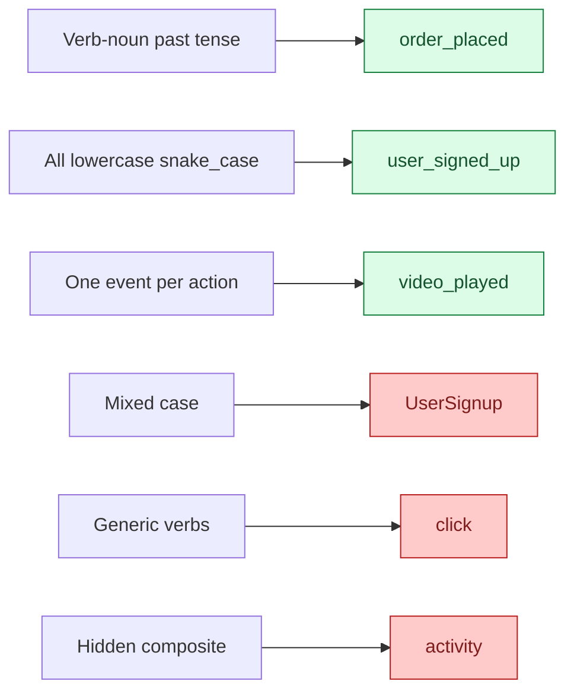
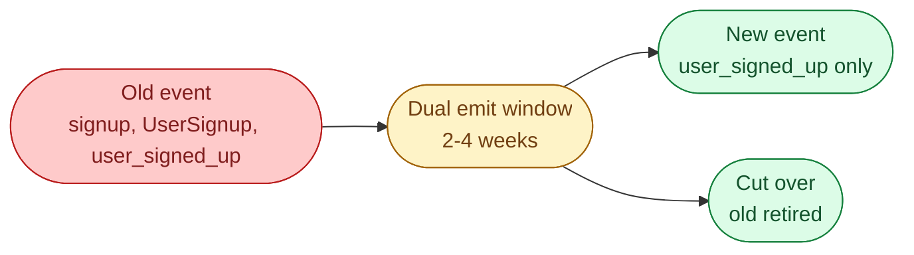



**Scenario:**
A product analytics team has three years of event data. Some events are named `signup`, some `user_signed_up`, some `UserSignup`. Properties are inconsistent: one event has `user_id`, another has `userId`, a third has `uid`. Queries take hours and answers disagree. The PM asks "can we just rename them now." You sit down with the analytics engineer to design a tracking schema worth keeping for the next three years.

In the interview, the question is:

> Design a clean event tracking schema for a product. What do you put in every event, what stays out, and how do you avoid the mess most products end up in?

---

### Your Task:

1. Define the common envelope: properties every event should have.
2. Design the event taxonomy (naming conventions, hierarchies, version).
3. Cover the contract enforcement story (schema registry, CI checks, client SDKs).
4. Walk through migrating a legacy mess to a clean schema.

---

### What a Good Answer Covers:

* `event_id`, `user_id`, `timestamp`, `session_id`, `source`, `schema_version`.
* Verb-noun naming, lower_snake_case, no abbreviations.
* Why "page_viewed" is better than "page_view" (action, not noun).
* Schema registry as the contract (Avro, Protobuf, JSON schema).
* The dual-schema migration: emit old + new for a window, then cut over.


<div class="pr-solution-divider"></div>


## Solution 86: Event Tracking Schema Design

### Short version you can say out loud

> A good event tracking schema has three layers. First, a common envelope on every event: a unique event id, a user id, a session id, a timestamp from both client and server, a source, and a schema version. Second, a strict naming convention for event names and properties: lowercase snake case, verb past-tense ("page_viewed", "order_placed"), one event per meaningful user action. Third, a registry that holds the schema for every event and is enforced at the SDK layer so emitting a malformed event fails at compile time, not in a warehouse query three weeks later. The mess in the scenario happened because none of these existed and every client team made up its own names. Migrating out of that mess is a dual-schema period: emit both old and new for a window, dual-read downstream, then cut over.

### The common envelope

Every event, regardless of type, carries these:

```json
{
  "event_id": "01HX2T8K7CYZN3A9P7BJQEMW0K",
  "event_name": "order_placed",
  "schema_version": 2,
  "user_id": 19283,
  "anonymous_id": "ab12-cd34",
  "session_id": "0c8f8b22",
  "client_timestamp": "2026-06-04T08:30:14.123Z",
  "server_timestamp": "2026-06-04T08:30:14.587Z",
  "source": "web",
  "app_version": "3.14.2",
  "context": {
    "country": "SE",
    "locale": "en-SE"
  },
  "properties": {
    "order_id": "ord_4823",
    "amount": 249.50,
    "currency": "SEK"
  }
}
```

The fields and what they buy you:

* **`event_id`.** Universally unique. ULID or UUIDv7 preferred so they sort by time. Used for deduplication at the consumer.
* **`event_name`.** Just the name. All event-specific properties go in `properties`.
* **`schema_version`.** Integer that bumps when the event's schema changes. Lets you handle two versions in parallel.
* **`user_id` and `anonymous_id`.** Both. Logged-in users have both; logged-out users have only anonymous. Stitching the two on signup is its own problem worth solving once.
* **`session_id`.** Lets you compute funnels without re-deriving sessions in every query.
* **`client_timestamp` and `server_timestamp`.** Client time is what the user experienced. Server time is what your system actually saw. Differences expose clock drift and late events.
* **`source`.** Web, ios, android, server, third-party. Always tell the consumer where this came from.
* **`app_version`.** Critical for "did the bug start when we shipped 3.14.0?"
* **`context`.** Things that describe the device or environment.
* **`properties`.** The event-specific payload.

### Naming conventions



**Rules.**

* Lowercase snake_case for event names and property names. Universal across analysts who write SQL.
* Verb past-tense. "Order_placed", not "place_order" and not "order". Past-tense because the event represents something that happened.
* One event per real user action. Resist the urge to have a generic "interaction" with a `type` property; you cannot query that.
* Property names are the same across events when the meaning is the same. `user_id` is always `user_id`, not `uid` or `userId` somewhere.
* No abbreviations. "Subscription_started", not "sub_started".

### The taxonomy doc

Maintain one document (a spreadsheet, a Notion page, a markdown file in the repo) that lists:

* Every event name.
* Its purpose in one sentence.
* The full property schema (name, type, required, description).
* Which surfaces emit it.
* Who owns it.

This is the artifact the analytics team reads before they query. It is also what changes get reviewed against. If an event is not in the doc, it should not be emitted.

### Enforcement with a schema registry

The doc is the human contract. The registry is the machine contract.

Use Avro or Protobuf schemas (or JSON schema for a simpler shop) and a registry (Confluent Schema Registry, Apicurio, or a homegrown one). The flow:

1. Engineer defines the event schema in a `.avsc` file, opens a PR.
2. CI validates the schema is backward-compatible with the previous version (no removed required fields, no incompatible type changes).
3. Merge updates the registry.
4. The SDK on the client side reads the registry at build time. Calling `track("order_placed", { amount: 250 })` fails compilation if `amount` is required to be a `Decimal(10,2)` and the caller passed a string.

Result: malformed events stop existing. The producers are forced to emit the canonical schema.

### Migrating from the mess



The phased migration plan:

1. **Lock the canonical names.** Decide them once. Publish the taxonomy doc.
2. **Backfill historic events.** A dbt model maps the old names to the new at warehouse level, producing a clean view. Old raw stays raw. New analytics build only against the clean view.
3. **Update SDKs and clients to emit the new names.** Start emitting both old and new for a window.
4. **Dual-read.** Dashboards run against the clean view, which UNIONs old (renamed) and new (passthrough).
5. **Stop emitting the old.** After two to four weeks, retire the old names at the source.
6. **Drop the rename layer.** Eventually the warehouse only sees the clean names.

Do this per event, not all at once. A migration that bundles 80 events is a migration that takes a year and gets abandoned.

### Versioning real changes

When an event genuinely changes (adding a required property, changing a unit), bump the schema_version and emit the new version alongside the old. Consumers handle both for the migration window. After two to four weeks, drop v1.

Never silently change a property. Once a value of `amount` has meant "in dollars" for two years of warehouse data, changing it to "in cents" without a version bump corrupts every query that used it.

### A note on event volume

For a high-traffic product, event volume can become a cost driver. Three habits that pay off:

1. **Sample low-value events at the client.** "Page_viewed" at 1 in 10 is fine; "order_placed" must be 100%.
2. **Batch events at the SDK.** Send every 10 seconds or every 50 events, not on every action.
3. **Drop properties that are never queried.** Audit annually.

### Common mistakes interviewers want you to name

1. **No envelope.** Every event has different metadata. Joining and filtering becomes hard for every query.
2. **Allowing free-form properties.** "Extra" or "metadata" with arbitrary keys gets used by every team for different things. Becomes unqueryable.
3. **Bumping properties without versioning.** Historical queries silently break.
4. **No naming convention or no enforcement.** "We will be careful." You will not.
5. **Big-bang migration.** Locks the team for months; usually abandoned. Phase it.

### Bonus follow-up the interviewer might throw

> *"How do you handle PII in events? An email or phone number is sometimes useful in a property."*

Two rules.

**Never log raw PII in `properties` if you can avoid it.** Use `user_id` and look up the user in the warehouse, where PII is centrally protected.

**When you must (third-party tools that need an email for matching), hash it deterministically at emit time** and emit only the hash. The original lives in the user table. See problem 83 for the broader pattern.

If you find emails or phone numbers in the property dictionary of an existing schema, treat that as a high-priority cleanup. Backfill the property to NULL in storage and forget the raw value, or you carry the privacy debt forever.

