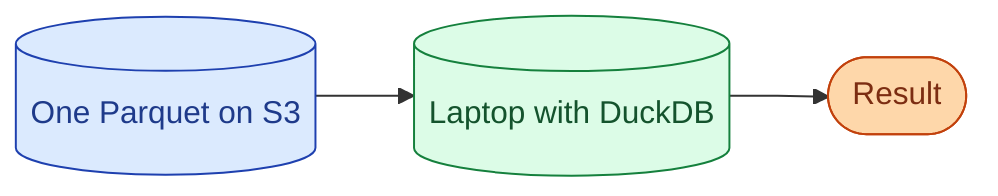



**Scenario:**
A teammate is spinning up a Snowflake warehouse to crunch a 30 GB Parquet file once a quarter for a regulatory report. The warehouse is on for an hour and costs more than the report is worth. A junior asks "why don't we just use DuckDB on my laptop." The senior engineer hesitates. You explain why the junior is right, and where DuckDB is actually the wrong choice.

In the interview, the question is:

> What is DuckDB, what workloads is it the right answer for, and where does it stop being the right answer?

---

### Your Task:

1. Explain what DuckDB is in one paragraph.
2. List the workloads where it is the right answer.
3. List the workloads where it is the wrong answer.
4. Walk through a realistic example: querying Parquet on S3 from a laptop.
5. Cover where DuckDB fits in a modern stack alongside Snowflake and Spark.

---

### What a Good Answer Covers:

* In-process, columnar, vectorised, MIT licensed.
* No server, no cluster, runs in Python / R / C++ / browser.
* Direct queries on Parquet, CSV, JSON, Iceberg, S3.
* The "if it fits on one machine" rule and what that means in 2026.
* Where Spark or a warehouse beat it (multi-user, persistent storage, governance).


<div class="pr-solution-divider"></div>


## Solution 87: DuckDB for Single-Machine Analytics

### Short version you can say out loud

> DuckDB is an in-process columnar analytical database, MIT licensed, and runs anywhere with a process: a laptop, a Lambda, a notebook, a browser via WebAssembly. It speaks standard SQL, queries Parquet and CSV and JSON directly without loading them first, and reads from S3, GCS, or HTTP. For single-user, single-machine analytics on data that fits in memory or streams through it, DuckDB is dramatically faster and cheaper than a warehouse, and it has no cluster to manage. It is the right answer when one person is asking one question over data that fits on one machine. It is the wrong answer when many people need to query the same data with governance, when the data is too big for one node, or when you need persistent transactional storage. For the regulatory report in the scenario, DuckDB on a laptop reading the Parquet file directly is the better answer than spinning up Snowflake for an hour.

### What DuckDB actually is

A C++ library that gives you a full SQL database in your process. No server, no daemon, no port to open. You import it (`import duckdb`, `library(duckdb)`, `#include <duckdb.hpp>`) and you have a database.

Three design choices define it:

1. **Columnar storage and vectorised execution.** Internally, data is stored column-by-column and processed in batches of thousands of values at a time. Same idea as Snowflake, BigQuery, ClickHouse. Bad for OLTP, great for analytics.
2. **In-process.** No client-server. A query against a Parquet file on disk does not cross a network or a socket. The overhead per query is microseconds, not seconds.
3. **Files as tables.** `SELECT * FROM 'orders.parquet'` works without any "load this file first" step. DuckDB pushes down filters and projections into the Parquet reader so it only reads what is needed.

### When DuckDB is the right answer



The pattern: one person, one question, data that fits.

* **Ad-hoc analysis on large files.** A 50 GB Parquet file scans on a modern laptop in seconds.
* **Local development against production-shaped data.** A 10 GB sample of production in DuckDB is faster to iterate against than the warehouse.
* **One-off reports.** Quarterly regulatory reports, board decks, audits.
* **Embedded analytics in notebooks.** Jupyter, Marimo, Hex. DuckDB beats Pandas on most workloads and uses less memory.
* **Lakehouse query layer for a small team.** DuckDB reads Iceberg and Delta tables. For a team querying a multi-engine lakehouse, DuckDB is the cheapest engine.
* **CI checks.** Run dbt against DuckDB in CI to catch SQL errors before merging.

The "fits on one machine" rule is more generous than people assume. In 2026 a workstation with 128 GB RAM is normal; AWS rents 1 TB RAM machines by the hour. DuckDB streams through data, so the working set, not the total dataset, is what matters.

### When DuckDB is the wrong answer

* **Multi-user concurrent OLTP.** DuckDB has limited write concurrency. Use Postgres.
* **Hundreds of analysts querying the same data with governance.** A warehouse manages roles, permissions, billing, audit. DuckDB does not.
* **Data that genuinely does not fit.** A petabyte spread across a hundred nodes wants Spark or Trino. DuckDB on one node, even a big one, is the wrong tool.
* **Sub-second latency for serving features.** Use a KV store or a feature store, not a SQL engine.
* **Continuous streaming workloads.** Use Flink, Kafka Streams.

### Walking through a realistic example

The regulatory report scenario, end to end:

```python
import duckdb

con = duckdb.connect()
con.execute("INSTALL httpfs; LOAD httpfs;")
con.execute("""
  SET s3_region='us-east-1';
  SET s3_access_key_id='...';
  SET s3_secret_access_key='...';
""")

result = con.execute("""
  SELECT
    country,
    DATE_TRUNC('month', order_date) AS month,
    SUM(amount) AS total
  FROM 's3://my-bucket/orders/year=2026/*.parquet'
  WHERE order_date BETWEEN '2026-01-01' AND '2026-03-31'
  GROUP BY country, month
  ORDER BY country, month
""").df()

result.to_csv("q1_report.csv")
```

What just happened:

* `INSTALL httpfs` adds the S3 extension at runtime. DuckDB extensions are first-class and load on demand.
* The `FROM 's3://...'` clause reads Parquet files directly from S3, no download.
* DuckDB pushes the `WHERE` clause into the Parquet reader. Only the relevant row groups are read.
* `.df()` returns the result as a Pandas DataFrame for downstream use.

Cost: zero, beyond the engineer's laptop. Time: usually seconds to a minute for a query like this against tens of GB.

Compare to spinning up a warehouse: minutes of warm-up, a per-second compute bill, role configuration to read from S3. For one-off work, it is the wrong tool.

### Where DuckDB fits in a stack

Think of DuckDB as a query engine, not a warehouse. It plays well with the rest.

* **Lakehouse + Snowflake + DuckDB.** Iceberg tables in S3. Snowflake for multi-user BI. DuckDB for ad-hoc and CI. Same data, three engines.
* **Snowflake + dbt + DuckDB CI.** Production runs on Snowflake. CI runs the same dbt project against DuckDB with a local sample, catching errors per-PR for cents.
* **Lambda + DuckDB.** A serverless function that reads Parquet from S3 and returns a JSON answer. Cheap when traffic is bursty.
* **dbt with `dbt-duckdb` adapter.** The full dbt workflow against a local DuckDB file. Useful for solo work and small teams.

### Common mistakes interviewers want you to name

1. **Treating DuckDB as a warehouse substitute for a multi-user team.** It is not. The warehouse exists for governance, concurrency, and persistence.
2. **Loading data into DuckDB instead of querying files in place.** `CREATE TABLE AS SELECT * FROM 'file.parquet'` adds nothing when you can query the file directly.
3. **Running DuckDB in a Docker container with default 1 GB RAM.** It needs the host's RAM to be useful. Memory-bound silently.
4. **Forgetting it is in-process.** A long DuckDB query in a web request blocks the process.
5. **Confusing it with Polars or Pandas.** DuckDB is SQL with a query optimiser. Polars is a DataFrame library with its own engine. Different tools, sometimes complementary.

### Bonus follow-up the interviewer might throw

> *"DuckDB or Polars for ETL?"*

Different shapes of the same problem.

DuckDB if your team thinks in SQL, your transformations are joins and aggregations, and you want to reuse the same logic on the warehouse.

Polars if your team thinks in DataFrames, your transformations are row-wise functions and reshaping, and Python is the host language. Polars is faster for many DataFrame-style operations and has a lazy API similar to Spark.

For mixed workloads, use both. They share Arrow as the in-memory format, so passing data between them is zero-copy. See problem 88 for the deeper comparison.

