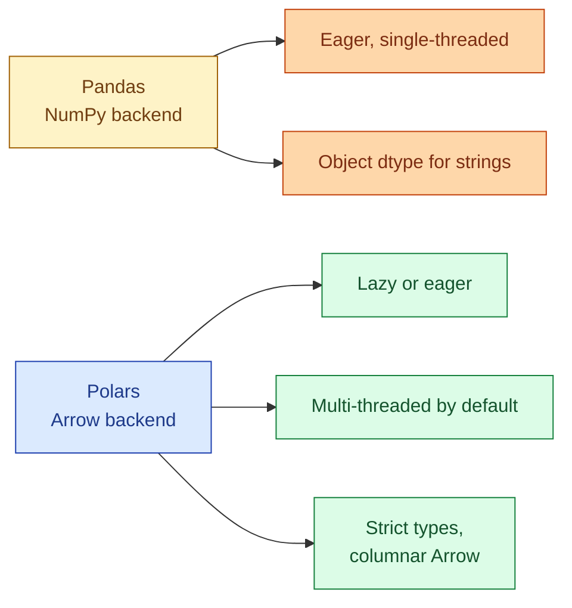



**Scenario:**
A Pandas ETL job that processes a 20 GB Parquet file runs out of memory on a 64 GB box and falls back to processing in chunks, taking 90 minutes. A teammate rewrites the same job in Polars and it finishes in 6 minutes using 30 GB of memory. They ask whether the team should standardise on Polars. You explain when that is right and when Pandas still wins.

In the interview, the question is:

> Pandas or Polars: what is the actual difference, and how do you pick for an ETL pipeline?

---

### Your Task:

1. Explain Pandas in one paragraph: what it gets right, what it gets wrong.
2. Explain Polars in one paragraph: what is different.
3. Compare on memory, speed, API surface, and ecosystem.
4. Walk through a realistic ETL: read Parquet, join, group, write.
5. Cover when to stay on Pandas, even now.

---

### What a Good Answer Covers:

* Pandas built on NumPy, single-threaded, object dtype, eager.
* Polars built on Arrow, multi-threaded, strict typing, lazy + eager.
* The lazy execution model and query optimisation.
* The DataFusion / DuckDB / Polars convergence around Arrow.
* Why Pandas still wins for small data, niche libraries, teaching, notebooks.


<div class="pr-solution-divider"></div>


## Solution 88: Polars vs Pandas for ETL

### Short version you can say out loud

> Pandas is the older, more universal, single-threaded DataFrame library built on NumPy, and it is what every Python data person learned first. Polars is the newer, faster, multi-threaded DataFrame library built on Apache Arrow with a lazy query optimiser. For ETL jobs with files measured in gigabytes, Polars is meaningfully faster (often 5 to 20 times) and uses less memory because Arrow's columnar layout and Polars' streaming engine are designed for it. Pandas still wins for small data in notebooks, for any project that depends on the Pandas ecosystem (scikit-learn pre-Arrow, many plotting libraries, Excel I/O), and for teams that already know Pandas and do not have a performance problem. For new ETL jobs over big files, Polars is the better default in 2026.

### The shapes of the two libraries



**Pandas.** NumPy under the hood. Strings stored as Python objects (`object` dtype), which is slow and memory-heavy. Everything runs eagerly: each line of your code triggers a computation. One process, one thread. The API surface is enormous and not always consistent because it grew over a decade.

**Polars.** Apache Arrow under the hood. Strings are dictionary-encoded by default. Multi-threaded by default. Strict typing: you cannot accidentally have a column that mixes ints and strings. Two execution modes: eager (like Pandas) and lazy (build a query plan, optimise it, then execute). The lazy mode is where most of the speed comes from.

### The lazy execution model

Polars' lazy API looks like a query plan, not a sequence of operations.

```python
import polars as pl

result = (
    pl.scan_parquet("orders.parquet")    # not read yet
    .filter(pl.col("amount") > 100)
    .group_by("country")
    .agg(pl.col("amount").sum().alias("total"))
    .sort("total", descending=True)
    .collect()                            # plan optimised, then executed
)
```

When `.collect()` runs, Polars builds a query plan from the chained calls and optimises it. It pushes the filter into the Parquet reader (predicate pushdown), reads only the columns it needs (projection pushdown), parallelises the group-by across cores, and streams batches if memory is tight.

Pandas executes each step eagerly: read the whole file, then filter (materialising the intermediate), then group (materialising another intermediate). On a 20 GB file the intermediates kill memory.

### Memory and speed in practice

For the scenario, the rewrite from Pandas (90 min, OOM on a 64 GB box) to Polars (6 min, 30 GB) is typical. Three things explain the gap:

1. **Arrow strings vs Python objects.** A 20 GB Parquet often expands to 60+ GB in Pandas memory because Python object headers per string row are huge. Arrow representation stays close to the on-disk size.
2. **Streaming.** Polars can stream a filter or aggregation in batches, never materialising the whole file. Pandas needs the full DataFrame.
3. **Parallelism.** A group-by on Polars uses every core. Pandas uses one.

For small data (under a few hundred megabytes), the gap is invisible. The constant overhead of starting Polars is comparable to a Pandas operation that finishes in 200 ms.

### API surface differences

Polars' API is more SQL-like:

```python
# Polars
df.filter(pl.col("status") == "paid").group_by("country").agg(pl.col("amount").sum())

# Pandas
df[df["status"] == "paid"].groupby("country")["amount"].sum()
```

Both are readable. Polars' expressions compose cleanly and are typed; Pandas' indexing is famously inconsistent (does `df["a"]` give a Series, a column, or raise depending on dtype?).

Polars catches errors at plan time when it can: a typo in a column name fails when you `.collect()`, not silently. Pandas often returns NaN or silently coerces.

### A realistic ETL example

The same transformation in both libraries.

**Pandas, eager.**

```python
import pandas as pd

orders = pd.read_parquet("orders.parquet")
users = pd.read_parquet("users.parquet")

joined = orders.merge(users, on="user_id", how="left")
filtered = joined[joined["amount"] > 0]
agg = filtered.groupby(["country", pd.Grouper(key="order_date", freq="M")]).agg(
    total=("amount", "sum"), n=("order_id", "count")
).reset_index()
agg.to_parquet("monthly_country.parquet")
```

**Polars, lazy.**

```python
import polars as pl

orders = pl.scan_parquet("orders.parquet")
users = pl.scan_parquet("users.parquet")

agg = (
    orders.join(users, on="user_id", how="left")
    .filter(pl.col("amount") > 0)
    .group_by([
        "country",
        pl.col("order_date").dt.truncate("1mo").alias("month")
    ])
    .agg([
        pl.col("amount").sum().alias("total"),
        pl.col("order_id").count().alias("n"),
    ])
    .collect(streaming=True)
)
agg.write_parquet("monthly_country.parquet")
```

On a 20 GB orders file with a 1 GB users file:

* Pandas: 90 min and OOM on 64 GB unless you chunk manually.
* Polars: 5 to 10 min with peak memory around 30 GB.

### When to stay on Pandas

* **Tiny data.** Under a few hundred MB. The wins do not show; the disruption of switching is real.
* **Ecosystem lock-in.** Some libraries only accept Pandas DataFrames. Convert to Pandas at the boundary only.
* **Notebook and teaching contexts.** Pandas is what most courses use. Polars is gaining ground but the muscle memory is widespread.
* **Excel I/O, fancy plotting integrations.** Pandas has the most polished bridges to these.
* **Existing codebase.** Rewriting a 5,000-line Pandas pipeline for marginal gains is the wrong battle.

### The Arrow convergence

DuckDB, Polars, Pandas 2.x with Arrow backend, and Spark all use (or are moving to) Arrow as their in-memory format. Zero-copy interchange between them is the unstated benefit:

```python
import duckdb, polars as pl

orders_pl = pl.scan_parquet("orders.parquet").filter(pl.col("amount") > 100).collect()
result = duckdb.sql("SELECT country, SUM(amount) FROM orders_pl GROUP BY country").pl()
```

DuckDB reads the Polars DataFrame directly without copying. Use SQL when the operation is SQL-shaped, Polars expressions when the operation is DataFrame-shaped, pick per-step.

### Picking for the team in the scenario

For new ETL pipelines over files in the GB range: Polars. For their existing Pandas codebase, migrate the slowest 20% (the jobs hitting memory limits) and leave the rest alone until something forces a rewrite. The cost of switching paradigms wholesale is rarely worth it.

For DataFrame work in notebooks: either is fine; Polars is gaining ground because of the cleaner API and the speed.

### Common mistakes interviewers want you to name

1. **Rewriting everything for the sake of speed.** Most Pandas jobs are fine.
2. **Using Polars eagerly when lazy would have optimised the plan.** Eager Polars is 2x to 3x faster than Pandas; lazy Polars is 10x faster. Default to lazy.
3. **Mixing the two in one function.** Convert at boundaries, not in the middle of logic.
4. **Treating Polars as "Pandas, fast."** The expressions API is different; cargo-culting Pandas idioms gets you weird Polars code.
5. **Comparing only on toy benchmarks.** Choose based on the shape of your data and the shape of your transformations, not on a TPC-H number.

### Bonus follow-up the interviewer might throw

> *"What about Modin or Dask? Are they relevant here?"*

Both target "Pandas, but distributed." Modin claims to be a drop-in Pandas replacement that scales out. Dask is more general (distributed Pandas-like DataFrames plus parallel arrays and ML).

In 2026, Polars has eaten most of the use cases Modin and Dask targeted, because Polars is faster on a single big node and the constant of "fits on one machine" keeps getting more generous. Dask is still relevant for genuinely distributed workloads where you need many nodes, but for those, Spark or DuckDB + Iceberg is usually the better answer. Modin has not found a real niche.

For single-node ETL, the choice is Pandas vs Polars. Distributed is Spark territory.

