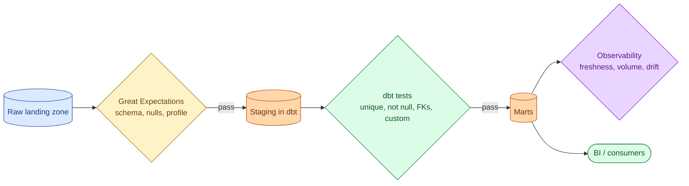



**Scenario:**
A team is starting to take data quality seriously. The lead has two camps: one wants to use Great Expectations because "it has hundreds of validators and a UI", the other says "we already have dbt, why add another tool, just use dbt tests." You are asked to write a one-page decision so the team can move on.

In the interview, the question is:

> dbt tests, Great Expectations, or both? What does each one cover that the other does not, and how should a team pick?

---

### Your Task:

1. Explain what dbt tests cover, with examples.
2. Explain what Great Expectations covers, with examples.
3. Compare on placement (where the test runs), expressiveness, lifecycle, and operational overhead.
4. Recommend a pragmatic stack for the team in the scenario.
5. Cover the testing pyramid for data: source tests, model tests, contract tests, monitoring.

---

### What a Good Answer Covers:

* dbt's four built-in tests and the custom test pattern.
* Great Expectations' expectation suites and data docs.
* Test placement: source vs model vs downstream.
* Why neither replaces observability (see problem 84).
* The cost of running tests on big tables and how to scope them.


<div class="pr-solution-divider"></div>


## Solution 89: Great Expectations vs dbt Tests

### Short version you can say out loud

> dbt tests are simple SQL assertions that run as part of a dbt build: "this column is unique", "this column has no nulls", "every value is in this list", plus any custom SELECT that should return zero rows. They are cheap, live next to the model, and gate every PR. Great Expectations is a Python framework for data validation with hundreds of pre-built expectations, profiling, and a generated "data docs" site. It is more expressive (statistical expectations, conditional ones, expectations across columns), works on data outside dbt (Spark output, raw landing tables, files), and produces a rich audit trail. They are not competitors so much as different tools for different layers. The pragmatic answer for most teams: dbt tests for everything inside the dbt project (the bulk of the warehouse), Great Expectations for raw landing layers and non-dbt pipelines, observability tools (problem 84) for the anomaly catch-all.

### What dbt tests cover

```sql
-- schema.yml next to the model
models:
  - name: dim_users
    columns:
      - name: user_id
        tests:
          - unique
          - not_null
      - name: country_code
        tests:
          - accepted_values:
              values: ['US', 'SE', 'BD', 'UK']
      - name: ref_user_id
        tests:
          - relationships:
              to: ref('source_users')
              field: id
```

Four built-in tests:

* `unique`: column has no duplicates.
* `not_null`: column has no nulls.
* `accepted_values`: every value is in a small list.
* `relationships`: every value exists in another model's column (FK check).

These cover the schema-level invariants of any well-modeled warehouse table.

For anything more, write a custom test as a SQL select that should return zero rows:

```sql
-- tests/orders_amount_positive.sql
SELECT * FROM {{ ref('fct_orders') }} WHERE amount <= 0
```

If the select returns any rows, the test fails. This is enough for 90% of bespoke checks.

**What dbt tests get right:**

* Live in the same repo as the model. The contract and the data definition are colocated.
* Run as part of `dbt build`, so a PR cannot merge without them.
* Cheap to write, cheap to read, no extra infra.
* `dbt build --select model+` lets you re-run only the changed model and its tests.

**What dbt tests miss:**

* Statistical expectations (mean within range, standard deviation, distribution).
* Conditional assertions ("if column A is X, then column B is in this set").
* Tests on raw landing data before it gets into a dbt model.
* Tests on the output of Spark jobs or other non-dbt pipelines.

### What Great Expectations covers

```python
import great_expectations as gx
context = gx.get_context()
batch = context.sources.add_pandas("pd").read_parquet("orders.parquet")

validator = batch.validate(expectation_suite_name="orders_suite")

# Expectations the suite contains:
# - expect_column_values_to_not_be_null("amount")
# - expect_column_mean_to_be_between("amount", 50, 500)
# - expect_column_values_to_match_regex("email", r"^[\w.-]+@[\w.-]+$")
# - expect_compound_columns_to_be_unique(["user_id", "order_date"])
# - expect_column_value_lengths_to_be_between("country_code", 2, 3)
```

Hundreds of pre-built expectations, organised into reusable suites. Output goes to "data docs," an auto-generated HTML site that shows what was validated, what failed, and history. Profilers automatically suggest expectations based on a sample of the data.

**What Great Expectations gets right:**

* Statistical expectations out of the box. Mean, stddev, distinct count, quantile.
* Works on anything Pandas, Polars, Spark, or SQL can read, not just dbt models.
* Profiler bootstraps a suite from data, useful for legacy datasets where nobody knows the rules.
* Data docs are good artefacts to show to auditors and stakeholders.
* Integrations with Airflow, Prefect, GitHub Actions for placing checks in pipelines.

**What Great Expectations misses (or adds friction to):**

* Requires its own setup, config, and a learning curve. Heavier than dbt tests.
* The data docs site needs to live somewhere. Static hosting works; some teams skip the docs entirely.
* Suites can become large and stale. The same maintenance burden as a big test pyramid.

### Comparison

| Dimension | dbt tests | Great Expectations |
| --- | --- | --- |
| Lives in | dbt repo | Separate suite files |
| Test language | SQL | Python (or YAML) |
| Built-in tests | 4 | Hundreds |
| Custom tests | SELECT returning zero rows | Custom expectation class |
| Statistical checks | Manual | First-class |
| Profiling | None | Automated |
| Output | Pass/fail in build log | HTML data docs + pass/fail |
| Operational overhead | None beyond dbt | Setup, hosting docs, storing results |
| Best for | Anything inside dbt | Landing zones, non-dbt pipelines, audit |

### Where each test should run



* **Source layer (raw landing).** Great Expectations or a small custom validator. Catches malformed input before it pollutes the warehouse.
* **dbt layer.** dbt tests on every model. Catches transformation bugs and contract violations.
* **Mart layer.** Same dbt tests plus business invariants.
* **Beyond the warehouse.** Observability monitoring (problem 84) catches anomalies the tests do not anticipate.

This is the testing pyramid for data: cheap unit-like tests at every transformation, expensive anomaly detection at the boundaries.

### The cost of testing big tables

A `unique` test on a 5 billion-row table is a `SELECT user_id, COUNT(*) FROM big GROUP BY user_id HAVING COUNT(*) > 1`. Not free.

Three pragmas:

1. **Scope to the changed partition.** Test only today's data on incremental models. Backfill the test separately.
2. **Sample.** A unique test on a 1% sample catches 99% of duplication bugs at 1% of the cost. Use the full test before releases.
3. **Severity.** dbt tests have `severity: warn` vs `severity: error`. Use warn for tests you cannot afford to block on but want to track.

### The recommendation for the team

For the scenario:

* Adopt dbt tests immediately for every dbt model. Cost is hours, value is immediate.
* Add Great Expectations for the landing zone (one or two suites covering the source files that feed dbt). Catches malformed input before dbt.
* Add observability monitoring (problem 84) on the top three tables that drive money. Catches the anomalies tests do not anticipate.

The "tests are everywhere or nowhere" approach is wrong. Layer them.

### Common mistakes interviewers want you to name

1. **Treating dbt tests and Great Expectations as competitors.** Different layers, different jobs.
2. **Running every test on every full table every run.** Costs balloon. Scope to changed data.
3. **No severity tiering.** Every failure pages, the team mutes the channel, real failures are missed.
4. **Tests for tests' sake.** A test that always passes catches nothing. Audit and drop dead tests.
5. **Skipping observability.** Tests catch known failure modes. Anomaly detection catches the unknown ones.

### Bonus follow-up the interviewer might throw

> *"How do you keep test suites from rotting?"*

Three habits:

1. **Tie test additions to incident postmortems.** Every incident produces at least one test that would have caught it. This grows the suite where it matters.
2. **Quarterly audit.** Look at tests that have not failed in six months. Either the data really is clean (consider keeping the test as a regression check) or the test is checking nothing useful (drop it).
3. **Tests as contracts.** When a downstream consumer says "I depend on this column being not-null," add the dbt test and tag it with the consumer. The test now has an owner.

The worst test suite is the one nobody trusts. Pruning is healthy.

