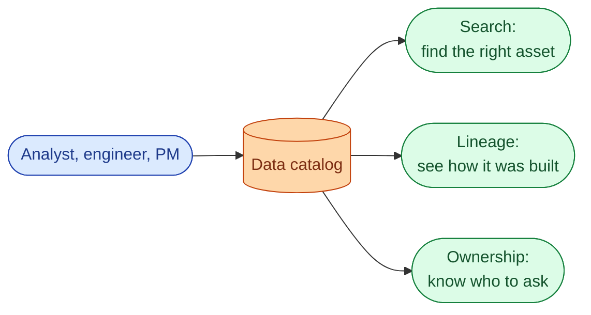
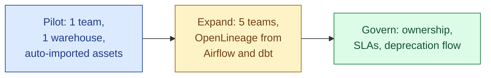



**Scenario:**
The company has 4,000 tables across three warehouses and two lakes. A new analyst takes a week to find the "right" customers table because there are nine of them with similar names. A data engineer wastes an afternoon trying to figure out who owns a table before they refactor it. The CTO has heard "data catalog" and "data discovery" and wants to know what to actually buy or build.

In the interview, the question is:

> What is a data catalog, what does OpenLineage have to do with it, and how would you stand one up for a 4,000-table organisation?

---

### Your Task:

1. Define the data catalog and the three things it must do (search, lineage, ownership).
2. Explain OpenLineage as the open standard for emitting lineage events.
3. Compare the main options (DataHub, OpenMetadata, Atlan, Collibra, homegrown).
4. Walk through the rollout: pilot, expand, govern.
5. Cover the failure mode where the catalog rots.

---

### What a Good Answer Covers:

* Search-by-name and search-by-meaning (semantic search over columns and tags).
* Lineage at table and column level.
* Owner and freshness metadata as first-class.
* The open-source vs vendor decision in 2026.
* Why the catalog dies without a "register or it does not exist" policy.


<div class="pr-solution-divider"></div>


## Solution 90: OpenLineage and Data Discovery

### Short version you can say out loud

> A data catalog is the searchable directory of every data asset in the organisation: tables, columns, dashboards, pipelines, and the relationships between them. It does three things: lets people find the right asset (search), lets them understand how it was built (lineage), and tells them who owns it (governance). OpenLineage is the open standard for emitting lineage events from pipelines, and the catalog consumes those events to draw the dependency graph. The main products that do this in 2026 are DataHub (open-source, ex-LinkedIn), OpenMetadata (open-source, fast-moving), Atlan (vendor, polished UX), Collibra (vendor, enterprise governance). The choice depends on team size, governance needs, and how much you want to operate. The harder problem than picking is keeping the catalog alive: it dies fast if registering an asset is optional or if metadata is hand-maintained.

### The three jobs of a catalog



**Search.** Not just by name. By tag (`pii`), by domain (`finance`), by column (`is there a table with a column called gross_revenue`), and ideally by meaning (semantic search over descriptions and column names). Modern catalogs use a vector index over descriptions so "tables about customer churn" finds the right one even when no column is called "churn."

**Lineage.** Both table-level ("who reads this") and column-level ("who reads this column"). See problem 82. The catalog draws the graph; OpenLineage feeds it the edges.

**Ownership.** Each asset has an owner team, a freshness SLA, and a contact. Without this the catalog is read-only; with it, the catalog becomes the place to start any conversation about data.

### OpenLineage, the protocol

OpenLineage is a JSON spec for "a job ran" events. A job (Spark, dbt, Airflow task, Trino query) emits a START event when it begins, a COMPLETE or FAIL event when it ends. Each event names the inputs and outputs of the job, optionally with column-level lineage and run-level metadata.

```json
{
  "eventType": "COMPLETE",
  "eventTime": "2026-06-04T03:00:12Z",
  "job": {"namespace": "dbt.analytics", "name": "fct_orders"},
  "run": {"runId": "abc-123", "facets": {...}},
  "inputs":  [{"namespace": "snowflake.prod", "name": "stg.orders"}],
  "outputs": [
    {
      "namespace": "snowflake.prod",
      "name": "analytics.fct_orders",
      "facets": {"columnLineage": {
        "fields": {
          "gross_revenue": {
            "inputFields": [
              {"namespace": "snowflake.prod", "name": "stg.orders", "field": "amount"},
              {"namespace": "snowflake.prod", "name": "stg.fx", "field": "rate"}
            ]
          }
        }
      }}
    }
  ]
}
```

In 2026 the major producers all emit OpenLineage natively or with a thin wrapper:

* **dbt** via the `dbt-ol` wrapper.
* **Airflow** via the OpenLineage provider.
* **Spark** via the OpenLineage listener.
* **Flink, Trino, Dagster** all native.
* **Snowflake, BigQuery** via query history connectors.

The catalog subscribes to the event stream and stitches the graph.

### The 2026 catalog options

| Option | Type | Strengths | Watch out for |
| --- | --- | --- | --- |
| **DataHub** | Open source | Strong lineage, big community, plug-in friendly | Operational complexity, several services to run |
| **OpenMetadata** | Open source | Fast-moving, good UX, easier to operate | Newer, fewer integrations than DataHub |
| **Atlan** | Vendor | Polished UX, low setup, governance features | Cost, vendor lock |
| **Collibra** | Vendor (enterprise) | Strongest governance and audit story | Heavy, slow to roll out, costly |
| **Castor / Secoda / others** | Vendor | Lightweight, opinionated | Less depth on lineage |
| **Homegrown** | DIY | Bespoke to your needs | Maintenance burden, never reaches feature parity |

The decision tree most teams follow:

* Under 50 people, no compliance pressure: OpenMetadata.
* 50 to a few hundred, modest budget: Atlan or DataHub depending on UX taste and operating capacity.
* Heavy regulatory environment (finance, healthcare): Collibra or Atlan + Collibra.
* Public sector, security-first: DataHub self-hosted.
* "We want to build it ourselves": only if your team has 3+ engineers to dedicate. Otherwise no.

### Rolling it out without it dying



**Phase 1, pilot.** One team, one warehouse. Auto-import every table from the warehouse with its `INFORMATION_SCHEMA` metadata. No human curation. Goal: get the team to search the catalog and find tables. Measure usage. If usage is zero, the problem is the catalog itself or your search; fix that before adding more sources.

**Phase 2, expand.** Add more teams, more sources. Enable OpenLineage from dbt and Airflow so the lineage graph fills in. Add tags for PII, domain (finance, product, infra), and tier (1/2/3).

**Phase 3, govern.** Make registration mandatory for new tables. The dbt project requires an `owner` field on every model; the model fails build without it. Deprecation requires a flag in the catalog, a 60-day notice, and lineage shows zero downstream readers before drop.

### The failure mode: it rots

Most catalogs go through this life cycle:

1. Set up. Excitement. Everyone fills in descriptions.
2. Six months later. Half the descriptions are out of date. Nobody trusts the freshness SLA. Search returns dead tables.
3. Twelve months. Team uses Slack and tribal knowledge again. Catalog has zero users.

The catalogs that do not rot share three habits:

* **Auto-extract everything that can be auto-extracted.** Schema, lineage, owner from git CODEOWNERS, freshness from query history. Hand-maintained metadata rots; extracted metadata stays current.
* **Make registration mandatory.** A dbt model without an `owner` tag fails CI. A new warehouse table without a registration entry triggers an alert. "Register or it does not exist."
* **Deprecate the dead.** A monthly job marks tables that have not been queried in 90 days as candidates for deprecation. The owner has 30 days to defend or drop.

Without these, the catalog drifts from reality and becomes worse than no catalog at all.

### Where OpenLineage fits vs Marquez and DataHub

A common confusion: OpenLineage is the spec, not a product. Marquez is the reference implementation of an OpenLineage consumer (open source, originally LF AI & Data). DataHub and OpenMetadata also consume OpenLineage.

In practice:

* You emit OpenLineage from your jobs.
* You point the events at a consumer (Marquez, DataHub, OpenMetadata, Atlan).
* The consumer shows you the graph.

You can swap consumers later because the producers do not know which consumer is listening. That decoupling is the whole point of the spec.

### Common mistakes interviewers want you to name

1. **Building a catalog without OpenLineage producers in place.** The graph stays empty.
2. **Hand-maintained descriptions.** They rot in a quarter.
3. **No ownership enforcement.** Tables exist without owners, nobody can deprecate anything.
4. **Catalog as documentation system.** Different problem. Catalog is for finding and depending; docs are for explaining.
5. **No deprecation flow.** Dead tables accumulate forever and pollute search.

### Bonus follow-up the interviewer might throw

> *"How do you handle the BI tool layer in the catalog?"*

Same lineage cliff from problem 82. Three pragmatics:

1. **Looker and dbt Semantic Layer.** Define LookML or Semantic Layer models, lineage falls out automatically. The catalog reads it.
2. **Tableau and Power BI.** Use their REST APIs to scrape workbooks and parse their custom SQL. Imperfect; covers about 70% of dashboards.
3. **Notebooks.** Hex and Marimo emit OpenLineage natively in 2026. Jupyter does not; you scrape execution logs or accept the gap.

The end-to-end catalog requires all three to be on board. A catalog that stops at the warehouse boundary still helps engineering teams and misses the BI side of the impact analysis. Plan for the gap; do not pretend it does not exist.

