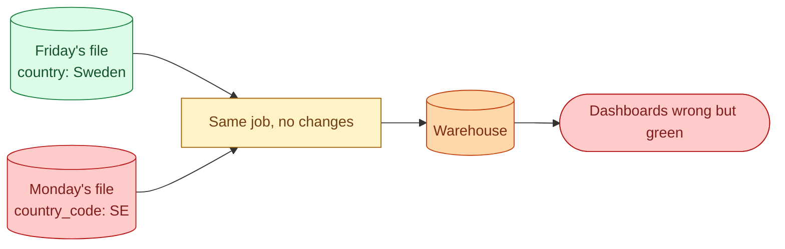
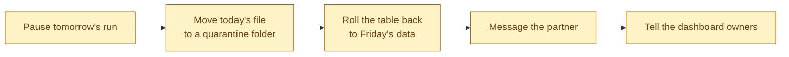
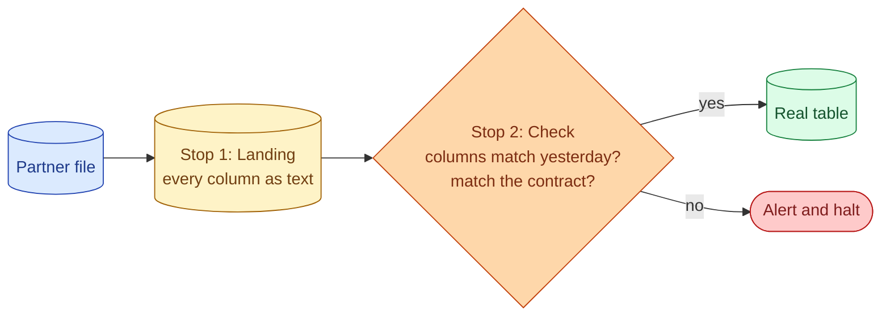



**Scenario:**
You own a nightly ingestion job that pulls a partner's `customers.csv` file from their S3 bucket into your warehouse. The job has run cleanly for 14 months. Monday at 09:00 you walk in and downstream dbt models are red. The CSV loaded successfully but the third column, which has been `country` (values like "Sweden", "Bangladesh"), arrived this morning as `country_code` (values like "SE", "BD"). Nobody on the partner side mentioned a change. Three dashboards that group by country are now showing one bucket called "SE". Tomorrow's load runs in 22 hours.

In the interview, the question is:

> Walk me through how you stabilise this pipeline against schema drift. What do you do today, what do you build this week, and what changes so the next surprise from a partner is a Slack ping, not an outage.

---

### Your Task:

1. List what you do in the first 30 minutes, before touching the architecture.
2. Describe the durable design so the same situation does not need an engineer next time.
3. Cover the four detection layers that catch drift at different points.
4. Explain the contract side: what you ask the partner for, and what you guarantee them.

---

### What a Good Answer Covers:

* The split between immediate triage and durable fix.
* All-string landing as a buffer between source and warehouse.
* Schema diff against the previous run.
* Great Expectations or a custom validator on the landing layer.
* The data contract: SLA on advance notice, schema version field, named owner on both sides.
* The "fail loudly, never silently" rule for ingestion.


<div class="pr-solution-divider"></div>


## Solution 91: Partner CSV, Schema Drift on Monday Morning

### So, what just happened?

Friday, the partner's file had a column called `country` with values like "Sweden". Monday morning, the same file shows up with a column called `country_code` and values like "SE". Nobody told you. The job did not fail because the file is still a perfectly valid CSV. It is just not the same file as before.

Now your dashboards are quietly wrong. Every chart that groups by country is reading whatever ended up in that third column, and it is no longer the name of a country, it is a two-letter code.



The scary part is that nothing went red. The job is green, the warehouse query returns rows, and no alert fired. You only know because a person looked at a dashboard.

### Why this is the dangerous kind of break

There are two flavours of broken pipeline.

The loud kind is when something fails outright. The job throws an error, the orchestrator pages someone, and you fix it. Annoying, but at least everyone knows.

The quiet kind is when everything succeeds and the data is wrong. That is what you have here. The cost is much higher, because the team can spend a week making decisions on bad numbers before anyone notices.

So the goal of the fix is not "stop the pipeline from failing." It is "turn this quiet break into a loud one."

### Step 1, before you change any code

You will want to dive into the pipeline and start adding checks. Resist for now. You have 22 hours before tomorrow's run. The first job is to stop the damage from spreading, not to redesign the system.

Here is the order:



**Pause tomorrow's run.** If you do not, you get a second day of bad data on top of the first. Now you have two days to clean up instead of one.

**Move today's file to a quarantine folder.** Do not delete it. You may need to reload it once you understand what changed. Just get it out of the live path so nothing else picks it up by accident.

**Roll the table back.** Snowflake, BigQuery, and Iceberg all support time travel. Restore the table to its state before today's load. If you cannot time-travel, use yesterday's snapshot. The point is to put the warehouse back to "correct as of Friday" before any human queries it again.

**Message the partner.** One sentence. "Hi, we noticed your customers.csv file changed column names this morning. Was this intentional? We have paused our ingestion until we hear back." Specific, calm, asks one thing. No meeting needed.

**Tell the dashboard owners.** One Slack message in the data channel. What happened, what you have done, when you will be back. This stops the "is the dashboard broken?" thread from starting on its own.

The whole sequence is about half an hour. The cost of skipping any step is a worse Monday.

### Step 2, the durable fix

Now the long-term fix.

The single rule that kills this whole class of problem: the partner's file never goes straight into your real table. There are two stops in between.



Two stops, two simple ideas. Let me walk through each one.

### Why the landing layer is the trick

The landing table is just a copy of the file where every column is a `STRING`. No types, no rules, nothing strict.

Why does that help? Because the load step can never fail. A column rename, a type change, a new column, a missing column. None of it kills the load, because the load is not enforcing anything yet.

That sounds bad at first, but it is exactly what you want. The file is now safely inside your warehouse, in a controlled place, where you can look at it and decide what to do next. The damage cannot leak further than the landing table.

Compare with the old setup. The load went straight into the typed table. If a type changed, the load itself died and you lost the file. If the type happened to still match (like the scenario), the load succeeded silently and everything downstream went wrong.

### The check that catches it

Now the second stop. Before anything moves from landing to the real table, run one small query:

```sql
SELECT column_name FROM information_schema.columns
WHERE table_name = 'landing_partner_csv'
ORDER BY ordinal_position;
```

Save the result every morning. Tomorrow's job compares to yesterday's saved result. If anything is different (a new column, a missing one, a different order), the job halts and posts one Slack message:

```
Schema drift on partner_csv
  + country_code (text)
  - country
```

That is all you need. One alert, with the diff right in the message. The on-call engineer sees it at 03:15, decides "expected" or "not expected," and resumes or calls the partner.

Run this check on the morning of the scenario, and instead of an angry PM at 09:14 you have a quiet Slack ping at 03:15 that already tells you exactly what changed. The rest of the morning is calm.

### The contract part

The two technical stops only buy you time. They do not stop drift from happening. Stopping drift is a people problem.

So get the partner to sign one page that says:

- Here are the columns and their types.
- Here is the file name pattern.
- You will tell us 10 business days before any change.
- Here is the person we call if we see a surprise.

One page. Not a 20-page MSA. The point is that when the next drift happens, you have a named human to call, a notice window to point at, and a written agreement to enforce.

The hard part is getting them to sign it. Worth pushing for, because every conversation about the next incident is now about whether the contract was followed, not whether one existed.

### Tomorrow's drift, walked through

To make it concrete: tomorrow the partner adds a `signup_source` column without telling you. Here is what happens now.

1. The file lands in `landing_partner_csv`. Loads fine, every column is text.
2. The column-diff check sees 8 columns today, 7 yesterday. Job halts.
3. Slack alert: `+ signup_source (text)`. You see it at 03:15.
4. You decide whether it is expected. Yes means add the column to the staging model and resume. No means ping the partner contact.

The real table is untouched until you make the call. Dashboards stay on yesterday's correct numbers. No PM messages.

### Things people get wrong

- **Turning on "auto-add new columns."** Sounds friendly. Means the next surprise column lands silently and your model does not even know it should query it.
- **Loading straight into typed tables.** A type change kills the load and you lose the file too. With a landing layer, the file is safe.
- **Keeping the contract in a wiki.** Wikis rot. Put it in the code repo so it shows up in code reviews.
- **No named partner contact.** "We thought you knew" is the most expensive sentence in data engineering.

### Take-home

> Land partner files as text first. Compare today's columns to yesterday's. Promote only if they match. The morning surprise becomes a Slack ping instead of a board meeting question.

