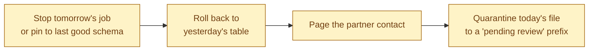
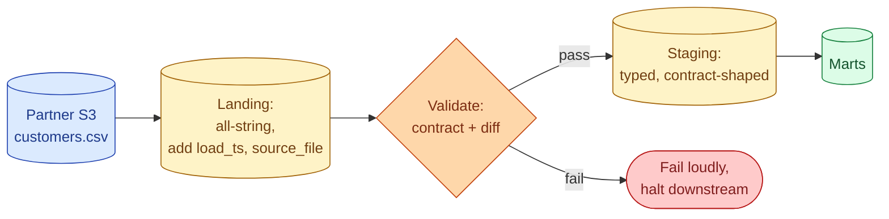



**Scenario:**
You own a nightly ingestion job that pulls a partner's `customers.csv` file from their S3 bucket into your warehouse. The job has run cleanly for 14 months. Monday at 09:00 you walk in and downstream dbt models are red. The CSV loaded successfully but the third column, which has been `country` (values like "Sweden", "Bangladesh"), arrived this morning as `country_code` (values like "SE", "BD"). Nobody on the partner side mentioned a change. Three dashboards that group by country are now showing one bucket called "SE". Tomorrow's load runs in 22 hours.

In the interview, the question is:

> Walk me through how you stabilise this pipeline against schema drift. What do you do today, what do you build this week, and what changes so the next surprise from a partner is a Slack ping, not an outage.

---

### Your Task:

1. List what you do in the first 30 minutes, before touching the architecture.
2. Describe the durable design so the same situation does not need an engineer next time.
3. Cover the four detection layers that catch drift at different points.
4. Explain the contract side: what you ask the partner for, and what you guarantee them.

---

### What a Good Answer Covers:

* The split between immediate triage and durable fix.
* All-string landing as a buffer between source and warehouse.
* Schema diff against the previous run.
* Great Expectations or a custom validator on the landing layer.
* The data contract: SLA on advance notice, schema version field, named owner on both sides.
* The "fail loudly, never silently" rule for ingestion.


<div class="pr-solution-divider"></div>


## Solution 91: Partner CSV, Schema Drift on Monday Morning

### Short version you can say out loud

> Schema drift from a partner you do not control is a question of when, not if. The immediate move is to stop today's bad data from poisoning anything more, restore yesterday's correct state in the warehouse, and notify the partner. The durable design is a three-layer ingestion: land the file as raw strings into a "landing" table that cannot fail on schema changes, validate that landing against a known contract before promoting to staging, and only then transform. Add a schema diff that runs after every land and fails the build with a Slack ping when the column list, order, or types differ from yesterday. Pair this with a written contract that names an owner on the partner side, a 10-day notice requirement, and a `schema_version` column you both agree to bump on any break. Done well, the next surprise lands as a CI failure with the diff in the alert, not a Monday morning outage.

### Triage in the first 30 minutes



1. **Stop the next run.** Pause tomorrow's scheduled job. The pipeline is in an unknown state and a second run will compound the damage.
2. **Roll back the warehouse.** If you have time travel (Snowflake, BigQuery, Iceberg), restore the affected tables to their state before today's load. If not, restore from yesterday's snapshot.
3. **Quarantine today's file.** Move `customers.csv` from the live prefix to `quarantine/2026-06-04/`. Do not delete; you may need to reload it once the situation is understood.
4. **Notify the partner.** Single point of contact, one message, what changed, what you need (confirmation of intent, a rollback if it was a mistake, or a contract update if it was deliberate).
5. **Tell stakeholders.** The three dashboard owners. One Slack message in the data channel. Estimate of the fix window.

The whole sequence is under 30 minutes if you have the runbook ready. Building that runbook is part of the durable design below.

### The durable design: three-layer ingestion



**Layer 1, landing.** The CSV lands into a single landing table with one column per source column, all typed as `STRING`. Plus `load_ts`, `source_file`, and `row_number`. This layer cannot fail on a schema change because every value is a string. It cannot fail on a value change because nothing is being asserted yet.

**Layer 2, validate.** Before any downstream model reads from staging, run the contract check. Three independent checks:

* **Column list and order match yesterday's** (schema diff).
* **Every column matches the named contract** (column count, names, types).
* **Distribution looks sane** (null rate, distinct count, regex match for known formats).

Any failure halts the pipeline. Staging is not updated. Marts read yesterday's staging until the team intervenes.

**Layer 3, staging.** Once validation passes, cast strings into typed columns, apply the contract's column names, and write to staging. The transform from landing to staging is the one place where the schema is enforced.

### The four detection layers

You want drift to surface as early as possible. Different layers catch different breakages.

| Layer | What it catches | Cost |
| --- | --- | --- |
| Schema diff (landing vs yesterday) | Renamed, added, dropped, reordered columns | Cheap, runs in seconds |
| Contract check (landing vs declared spec) | Drift from your agreed-on schema | Cheap |
| Distribution checks (landing) | Value-level drift (units, encoding, format) | Medium |
| dbt tests (staging and marts) | Logical breakages your code depends on | Already in place |

The cheapest and most valuable is the schema diff. One query:

```sql
WITH today AS (
  SELECT column_name, ordinal_position, data_type
  FROM `region.INFORMATION_SCHEMA.COLUMNS`
  WHERE table_name = 'landing_customers'
),
yesterday AS (
  SELECT column_name, ordinal_position, data_type
  FROM `governance.schema_snapshots`
  WHERE table_name = 'landing_customers'
    AND snapshot_date = CURRENT_DATE - INTERVAL '1' DAY
)
SELECT * FROM today FULL OUTER JOIN yesterday USING (column_name, ordinal_position)
WHERE today.column_name IS NULL OR yesterday.column_name IS NULL
   OR today.data_type <> yesterday.data_type;
```

Returns zero rows on a stable run. Returns a row per change otherwise. Wire to Slack.

In the scenario, that single check would have caught the rename at 03:15 instead of 09:00, with a diff in the message: `+country_code (STRING), -country (STRING)`.

### The data contract

The contract is the human side. Three things in writing:

1. **Schema spec.** Column list, types, accepted values for enum-like columns, required vs nullable. Versioned (`v1`, `v2`).
2. **Notice SLA.** "Any change to the schema requires 10 business days notice. Breaking changes require 30 days and a parallel-run window." Specific durations, not "reasonable."
3. **Named owners on both sides.** A specific person on the partner side, a specific person on your side. Both get paged when drift is detected.

A `schema_version` field in the file (column or filename suffix) lets your pipeline reject a v2 file when only v1 has been agreed. Stop, do not process, page.

What you give the partner in return:

* A clear validation report after every load. "Today's file accepted, no drift."
* Your contract spec in their language, reviewed quarterly.
* A test environment where they can drop a candidate file and see your validation result before going live.

### The "fail loudly" rule

The opposite of drift defense is silent degradation. Two patterns to refuse:

* **Auto-add new columns.** A "schema_change_policy: append" config silently swallows new columns. Today's `country_code` becomes a third column in staging while your dbt model still reads `country` (now full of nulls). Marts go silently wrong.
* **Coerce on type change.** A type change from `INT64` to `STRING` "succeeds" by casting everything. Aggregations break later.

For partner data, fail. The cost of a halted pipeline is hours. The cost of silent corruption is weeks of wrong dashboards plus rebuilds.

### What changes long-term

* The runbook gets shorter every time you use it.
* Validation rules accumulate (each incident adds one).
* The contract gets clauses added for every category of break that ever happened.
* The partner sees fewer surprises from their side too, because you push diffs both ways.

Two years in, a "schema drift incident" is a five-minute Slack thread, not a four-hour debug.

### Common mistakes interviewers want you to name

1. **No landing layer.** Direct load into typed staging means any schema change breaks the load itself. You lose the file too.
2. **Schema-on-read everywhere.** Lets drift pass silently. Use it for raw, not for marts.
3. **Contract in a wiki nobody reads.** It rots. Put it in the source tree, review it on every partner onboarding.
4. **No partner notification SLA in writing.** "We thought you knew" is the most expensive sentence in data engineering.
5. **Reactive Slack alerts only.** Every alert needs a runbook entry. Otherwise the on-call engineer reinvents the response each time.

### Bonus follow-up the interviewer might throw

> *"What if the partner refuses to sign a contract or version their schema?"*

Three positions, ordered by how much pain you accept.

1. **Treat their data as untrusted.** Heavy validation, all-string landing, no automatic acceptance of new columns. Costs you engineer hours; lets you survive without their cooperation.
2. **Charge the cost back internally.** Each incident gets a postmortem that names the partner and the dollar impact. Two or three of these and procurement starts caring.
3. **Replace the source.** If the partner is critical and uncooperative, the durable answer is a different source. Sometimes that means buying it; sometimes it means moving to a vendor (Fivetran, Airbyte) that handles the contract layer for you.

In practice the answer is usually (1) with (2) running in parallel until something changes.

