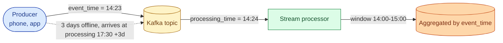
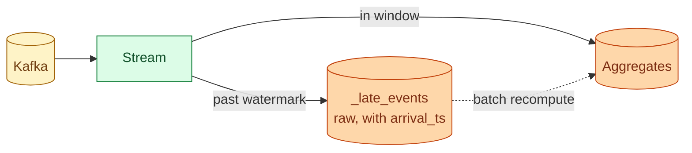



**Scenario:**
You run a streaming pipeline that aggregates app events into hourly buckets. The SLA promises a window is "closed and final" 30 minutes after the hour ends. A product manager flags that the Saturday 14:00 to 18:00 buckets look low. Investigation finds 380,000 events from those hours that arrived three days late, when a customer's phone came off airplane mode. The watermark moved past 18:30 on Saturday and those rows landed in a side table called `_late`. Sunday's daily rollup, the Monday dashboard, and the ML feature pipeline all used the "final" numbers and are wrong.

In the interview, the question is:

> How does your pipeline handle this kind of late arrival, what does the recovery look like for the already-published numbers, and how do you decide the policy for "how late is too late."

---

### Your Task:

1. Define event time vs processing time and explain why this case needs both.
2. Cover watermarks and allowed lateness, and where 380,000 events three days late falls.
3. Walk through the recovery: what to recompute, what not to, and how to communicate.
4. Cover the policy choice: how late do you accept, where do the rest go, and who decides.

---

### What a Good Answer Covers:

* Event time as the truth for aggregation; processing time as the truth for SLA.
* `withWatermark` and `allowedLateness` in the stream processor.
* The `_late` side table as a deliberate design, not an accident.
* Idempotent recomputation of closed windows.
* The cost-vs-correctness curve: open windows forever or freeze them.
* Communicating revised numbers to downstream consumers.


<div class="pr-solution-divider"></div>


## Solution 92: Late Events After the Partition Closed

### Short version you can say out loud

> Late data is the rule, not the exception, the moment your producers run on devices you do not control. Streaming pipelines handle it with two concepts: event time (when the event happened, on the producer's clock) and processing time (when your system saw it). Aggregations group by event time so the answer is correct, and the watermark is the system's promise that "no more events older than X will be accepted into the live window." Allowed lateness extends that window for a configurable amount of time. Anything later than that goes to a side table you handle out of band. The recovery for 380,000 three-day-late events is a deterministic, idempotent recomputation of the affected closed hours, followed by a revised-numbers note to every downstream that read the wrong total. The policy choice is a trade-off: longer allowed lateness means slower closes and more memory; shorter means more side-table events. There is no right answer, only a defensible one.

### Event time and processing time



The event carries its own timestamp (`event_time`). The system stamps when it sees the event (`processing_time`). For "events in the 14:00-15:00 hour," you group by event_time, not processing_time, or your number reflects "events I happened to see at that hour," which is wrong the moment any event is delayed.

But you cannot wait forever for late events. You have to declare the window closed and ship the number.

### Watermarks and allowed lateness

The watermark is your stream processor's belief about how far event time has progressed. In Flink and Spark Structured Streaming, you declare it explicitly:

```python
events = (spark.readStream
    .format("kafka")
    .load()
    .selectExpr("CAST(value AS STRING)")
    .select(from_json("value", schema).alias("e"))
    .select("e.*")
    .withWatermark("event_time", "30 minutes")
)

agg = (events
    .groupBy(window("event_time", "1 hour"), "country")
    .count()
)
```

`withWatermark("event_time", "30 minutes")` tells the engine: "Trust event_time. I claim the watermark is the maximum event_time seen so far, minus 30 minutes."

Once the watermark passes the end of a window, the engine emits the result and drops the window's state. Late events that arrive after that are either:

* Silently dropped (default).
* Routed to a side table for out-of-band handling (preferred).
* Updated into the window if `allowedLateness` is set wider (memory-expensive).

For 380,000 events three days late, no reasonable production system holds the window open that long. The right answer is the side table.

### The side table is a deliberate design



`_late_events` holds the raw event payload, the original event_time, and the arrival_time. It accumulates until you decide what to do.

For most teams the policy is:

* Daily, scan `_late_events` for events that fall into the previous N days of closed windows.
* If the count or impact exceeds a threshold, run a deterministic recomputation of the affected windows.
* Update the aggregates table.
* Send a "revised numbers" notification to downstream consumers.

In the scenario, the 380,000 events trigger this exact flow.

### Idempotent recomputation

The recompute reads the closed window's source events plus the late events, recomputes the aggregate, and replaces the old row.

```sql
-- Deterministic: same inputs, same output
MERGE INTO hourly_events_by_country target
USING (
  SELECT
    DATE_TRUNC(event_time, HOUR) AS hour,
    country,
    COUNT(*) AS n
  FROM (
    SELECT * FROM raw_events
    UNION ALL
    SELECT * FROM _late_events
  )
  WHERE event_time >= '2026-05-31 14:00:00'
    AND event_time <  '2026-05-31 18:00:00'
  GROUP BY hour, country
) source
ON target.hour = source.hour AND target.country = source.country
WHEN MATCHED THEN UPDATE SET n = source.n
WHEN NOT MATCHED THEN INSERT (hour, country, n) VALUES (...);
```

Two properties matter:

* **Idempotent.** Running the recompute twice gives the same result. Safe to retry, safe to rerun the next day.
* **Deterministic.** Same input set, same numbers. No `NOW()` or random seeds in the aggregate.

After the merge, downstream models that depend on the aggregate either re-derive (if incremental, the new max(updated_at) pulls the change) or get a `--full-refresh` for the affected window.

### The "how late is too late" policy

Three knobs, with consequences:

| Knob | What it costs | Where it shines |
| --- | --- | --- |
| `watermark = X` (10s, 1m, 30m) | Memory: state for windows up to X late | The base trade-off |
| `allowedLateness = Y` (0, 5m, 1h) | More memory, slower close | Sub-minute updates for slightly-late |
| Side table reprocessing window | Storage + a batch job | Anything later than allowedLateness |

The decision is policy, not engineering. Three questions:

* **How fresh does the dashboard need to be?** A 30-minute close serves "today's number by tomorrow morning" with room to spare. A 5-second close is for real-time fraud, ads, or trading.
* **What is the cost of revising a number after the fact?** For an internal dashboard, low. For an SEC filing, infinite.
* **How late do events actually arrive?** Measure it. The 99th percentile delay tells you the real-world floor for "how long should I wait."

For the scenario, the 30-minute watermark plus a 7-day side-table reprocessing window is a reasonable default. Anything later than 7 days is dropped with a metric so you can argue with the policy if it bites.

### Communicating revised numbers

Recomputation is half the job. The other half is telling people their previous number changed.

* **Note the revision in the aggregate.** A `last_revised_at` column on the row. Dashboards display "revised 2026-06-04" when the value is newer than the original close.
* **Notify subscribers.** A Slack message to the data channel naming the affected window, the impact, and the new number. Auto-generated, not hand-written.
* **Flag the lineage.** Anywhere that depends on the original number (a published report, an investor deck) gets a flag. Downstream owners decide whether to republish.

This is the difference between a mature streaming pipeline and an early one: revisions are a planned event, not a fire drill.

### Common mistakes interviewers want you to name

1. **Grouping by processing time.** "Events seen at 14:00" is meaningless; it changes with system load.
2. **`allowedLateness = 7 days`.** State blows up. The OOM finds you Monday morning.
3. **Silently dropping late events.** They show up in raw queries; nobody reconciles them; trust erodes.
4. **Non-idempotent recompute.** Two reruns yield two different numbers. Trust dies.
5. **No revision notification.** The dashboard quietly changes; the PM who screenshotted it last week is now wrong and does not know.

### Bonus follow-up the interviewer might throw

> *"Would Lambda architecture have prevented this?"*

Lambda runs a fast streaming layer (approximate, low-latency) and a slow batch layer (exact, eventual) in parallel. The batch layer reads everything including late events and overwrites the streaming layer's numbers on a schedule.

It would have caught the 380,000 events when the batch ran. So yes, the wrong numbers would still have been visible for a day, then corrected automatically.

Modern teams usually skip lambda in favor of a single streaming engine with watermarks and a side table because it has the same property (the side-table reprocess is the batch layer in spirit) with one codebase instead of two. Pick lambda only when you genuinely cannot reconcile fast and exact in the same engine, which in 2026 is rare.

