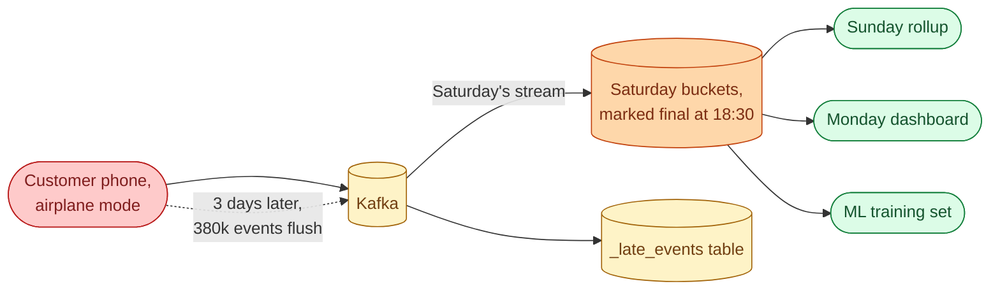
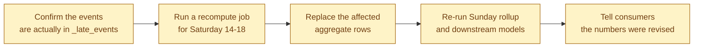
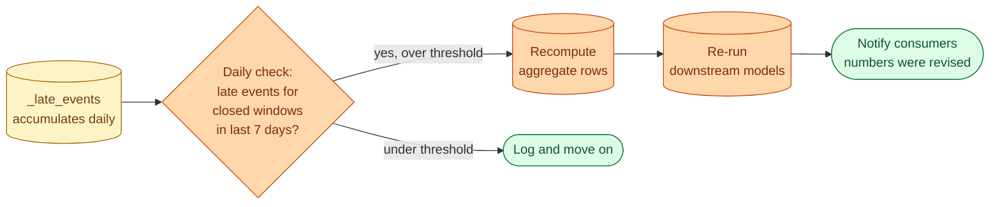



**Scenario:**
You run a streaming pipeline that aggregates app events into hourly buckets. The SLA promises a window is "closed and final" 30 minutes after the hour ends. A product manager flags that the Saturday 14:00 to 18:00 buckets look low. Investigation finds 380,000 events from those hours that arrived three days late, when a customer's phone came off airplane mode. The watermark moved past 18:30 on Saturday and those rows landed in a side table called `_late`. Sunday's daily rollup, the Monday dashboard, and the ML feature pipeline all used the "final" numbers and are wrong.

In the interview, the question is:

> How does your pipeline handle this kind of late arrival, what does the recovery look like for the already-published numbers, and how do you decide the policy for "how late is too late."

---

### Your Task:

1. Define event time vs processing time and explain why this case needs both.
2. Cover watermarks and allowed lateness, and where 380,000 events three days late falls.
3. Walk through the recovery: what to recompute, what not to, and how to communicate.
4. Cover the policy choice: how late do you accept, where do the rest go, and who decides.

---

### What a Good Answer Covers:

* Event time as the truth for aggregation; processing time as the truth for SLA.
* `withWatermark` and `allowedLateness` in the stream processor.
* The `_late` side table as a deliberate design, not an accident.
* Idempotent recomputation of closed windows.
* The cost-vs-correctness curve: open windows forever or freeze them.
* Communicating revised numbers to downstream consumers.



## Solution 92: Late Events After the Partition Closed

### So, what just happened?

You have a streaming pipeline that buckets app events by hour. The promise to consumers is: "30 minutes after the hour ends, that bucket is final." Saturday closed cleanly. Sunday's rollup ran on those final numbers. Monday's dashboard refreshed. The ML training pipeline grabbed a snapshot.

Then Tuesday afternoon, 380,000 events for Saturday 14:00 to 18:00 showed up. A customer's phone was in airplane mode all weekend. The app buffered events locally. When the phone reconnected, everything flushed at once.

Your "final" Saturday numbers are now too low. Sunday's rollup is wrong. Monday's dashboard is wrong. The ML features used for last night's training are wrong.

### Two clocks, that is the whole problem

Every event has two timestamps.

**Event time** is when the event actually happened, on the user's phone. Saturday 14:23.

**Processing time** is when your system saw the event. Tuesday 11:47.

Group your hourly buckets by event time and you get correct totals for Saturday. Group by processing time and you get "events I happened to see at that hour," which is meaningless the second any event is delayed.

Your pipeline already does the right thing. Buckets are keyed by event time. That is not the problem.

The problem is the next question: when do you stop waiting and call the bucket "final"? Wait forever and the dashboard never updates. Stop too soon and late events get lost.

This is what a watermark is for.

### What a watermark is, in one sentence

A watermark is your pipeline saying out loud: "I believe event time has now reached this point. Anything older is closed."

You set it to 30 minutes. That works fine for normal users on a normal day. It does not work for a phone that has been offline for three days, and no setting ever would.

Anything later than 30 minutes goes into `_late_events`, not into the live bucket. That side table is not a bug. It is the part of the system designed to catch exactly this situation.

The good news: your 380,000 events are sitting in `_late_events` right now, waiting for you.

### What you do this afternoon

You need to put the numbers right without breaking anything that already depends on them.

**Confirm the late events are captured.** First question: are they actually there, or did they fall through the cracks? Query `_late_events` for the affected window. If 380,000 rows are sitting there, good, you can rebuild. If they are not, the recovery is much harder and the policy needs a rethink.

**Recompute the affected hours.** Read all events (live plus late) for Saturday 14-18. Regroup by event time. Recompute the aggregates from scratch. The recompute must be idempotent: same inputs, same numbers, every single time. No `NOW()`, no random seeds, no environment-dependent quirks.

**Replace the rows.** Use `MERGE` keyed on the bucket so the recompute can run safely twice without doubling anything. The affected aggregate rows get the new totals. The unaffected rows stay untouched.

**Re-run downstream models.** Sunday rollup reads the aggregates. Rerun it. ML feature snapshot for those hours, regenerate. If you have proper lineage, this is a single dbt command. If you do not, this is the moment you wish you did.

**Tell people.** One Slack message naming the window, the size of the revision (something like "Saturday 14-18 revenue revised up by 1.4%"), and the new "as of" timestamp. Auto-generate if you can. Hand-write if you cannot. Either way, do not let stakeholders find out by accident.

### Make it routine, not a fire drill

You will deal with this again. There is always another offline customer, another bad cell tower, another delayed sync.

So the recompute should be a scheduled job, not something an engineer reinvents each time.

Every day, the job scans `_late_events` for the last 7 days of closed windows. If the count or impact crosses a threshold, recompute and notify. Below the threshold, log it and move on. The 7-day window is your policy: anything later than that, you drop or hold for manual review.

The threshold matters. Recomputing for 12 late events is wasted work. Recomputing for 380,000 is mandatory. Pick a number that catches what matters and skips the noise.

### The policy is a written choice, not a default

You have three knobs. Each one trades freshness against completeness.

**Watermark length.** How late an event can be and still land in the live bucket. Short = fresher numbers, more events lost to the side table. Long = slower close, more memory in the stream processor.

**Reprocessing window.** How far back you accept revisions. 7 days is reasonable for most teams. 1 day is too short for offline users. 30 days is too long for "stable" numbers.

**Drop policy.** What you do with events later than the reprocessing window. Drop and log, or hold for human review.

There is no objectively right answer. There is only a written policy you can defend. Pick the numbers based on data you actually have. The 99th-percentile delay from the last 30 days tells you whether your policy is even close to reality. If you have never measured this, do it before you tune anything.

### Two weeks from now, walked through

Different customer, different problem. They go offline for two days. 18,000 events arrive late for Thursday afternoon.

1. The events land in `_late_events`. Friday morning, the daily check runs.
2. It sees 18,000 late events for Thursday 12-16, above your threshold of, say, 5,000.
3. The recompute job runs. Thursday aggregates update. Sunday rollup will pick them up on its next run because it filters on `MAX(updated_at)`.
4. Slack message at 06:45: "Thursday 12-16 revenue revised up by 0.3%."
5. Dashboard shows a small "revised Fri 06:45" badge over that range.

No fire drill. No PM ping. The system handled the revision the same way it handles a normal close.

### Things people get wrong

- **Grouping by processing time.** "Events seen at 14:00" changes with system load and means nothing. Always group by event time.
- **Allowed lateness of 7 days.** The stream processor holds state for everything for a week. Memory blows up. The OOM finds you on Monday.
- **Silently dropping late events.** Analysts notice the discrepancy in raw queries and lose trust in the aggregates.
- **Non-idempotent recompute.** Two runs give two different totals. That is the worst kind of bug.
- **No revision notification.** The number quietly changes overnight. The PM who screenshotted yesterday's number is now wrong without knowing.

### Take-home

> Buckets close on a watermark. Late events land in a side table on purpose. A scheduled job recomputes the affected windows, replaces rows idempotently, and tells consumers their numbers were revised. Late data is not an emergency. It is a planned event.

