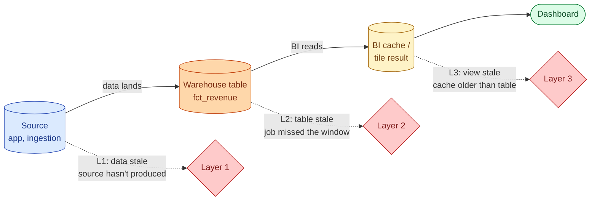
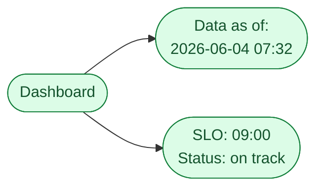



**Scenario:**
A finance PM messages at 09:14: "Revenue dashboard is showing yesterday's number. Did the job fail again?" You check. The job ran at 06:00 and succeeded. The warehouse query against `fct_revenue` returns today's data. The PM refreshes the dashboard; still yesterday. You realise the source for the dashboard is a BI cache that was refreshed at 06:05, and the source data only landed in the warehouse at 07:30. The 06:00 job ran on yesterday's late-arriving data. Three teams disagree on what "stale" means. The CTO asks you to lead a fix that prevents this monthly conversation.

In the interview, the question is:

> What does "stale" actually mean in a layered data stack, and how do you design freshness so this same conversation does not happen next month?

---

### Your Task:

1. Decompose "stale" into the three layers it can live in (data lands late, job runs early, cache is stale).
2. Propose a freshness contract that resolves the ambiguity.
3. Walk through the technical changes (SLA timing, dependency-aware scheduling, cache invalidation).
4. Cover the cultural change: the conversation pattern that ends "is it stale?" debates.

---

### What a Good Answer Covers:

* Data freshness vs job freshness vs view freshness.
* Why 06:00 was the wrong schedule and what should set the schedule.
* Sensor-based dependencies in the orchestrator (event-driven, not time-driven).
* Cache TTL vs cache invalidation triggered by the load.
* The "freshness SLO" as a one-line declaration per critical table.
* Communicating freshness in the BI tool itself (last-updated badge).


<div class="pr-solution-divider"></div>


## Solution 93: Dashboard Stale Despite a Healthy Job

### Short version you can say out loud

> "Stale" is three different problems wearing the same word. Data is stale when the source has not produced today's events yet. The job is stale when it ran on an old window. The view is stale when the cache is older than the underlying table. The 06:00 success in the scenario is a job that ran on data that had not arrived, then a BI cache that snapshotted the wrong result. The fix has three layers. First, make the job event-driven: do not start until the upstream source signals it is done, not on a wall clock. Second, invalidate caches on table update, not on a fixed TTL. Third, declare a freshness SLO per critical table in writing, expose the "data as of" timestamp in the dashboard, and tier alerts so the team learns about staleness before the PM does. Done together, the monthly "is it stale?" conversation ends, because the answer is in the dashboard and the on-call is paged before anyone sees the bad number.

### Three layers of "stale"



* **Layer 1, data freshness.** Has the source produced the rows for the period in question? In the scenario, source data landed at 07:30. At 06:00 the answer was no.
* **Layer 2, job freshness.** Did the job that builds the warehouse table run after the source produced its data? In the scenario, the job ran at 06:00, before 07:30. No, by 90 minutes.
* **Layer 3, view freshness.** Is what the user sees from the latest table refresh? The BI cache snapshotted at 06:05 and still serves that. As of 09:14, no.

A "fresh" dashboard requires all three. The current setup answers yes on the wrong question (did the job succeed) and no on the right one (does the user see the latest correct number).

### The fix, layer by layer

**Layer 1, data freshness.** The source produces a "today is complete" signal. This is a small SQL write or a Kafka event, depending on the source:

```sql
-- Run after the ingestion job finishes
INSERT INTO governance.source_completion
VALUES ('raw.orders', CURRENT_DATE, CURRENT_TIMESTAMP());
```

Or for object storage, a `_SUCCESS` file written when the load finishes. Downstream consumers wait for the signal, they do not assume.

**Layer 2, job freshness.** Replace the 06:00 cron with a dependency sensor. In Airflow:

```python
from airflow.sensors.sql import SqlSensor

wait_for_source = SqlSensor(
    task_id="wait_for_orders_source",
    conn_id="warehouse",
    sql="""
      SELECT 1 FROM governance.source_completion
      WHERE source_name = 'raw.orders'
        AND completion_date = CURRENT_DATE
    """,
    poke_interval=300,
    timeout=4 * 3600,  # give up after 4 hours, alert
)

build_revenue = DbtRunOperator(
    task_id="build_revenue", select="fct_revenue",
)

wait_for_source >> build_revenue
```

The job starts when the source signals completion, not at 06:00. If 12:00 comes and the source has not landed, the sensor times out and alerts. The right person hears about the lateness, not the PM.

**Layer 3, view freshness.** Two options.

* **Cache invalidation on table update.** The dbt build emits an event when `fct_revenue` is rewritten. The BI tool invalidates the dashboard's cache. Looker's persistent derived tables, Tableau extracts with on-update triggers, Power BI scheduled refresh from a webhook. Most BI tools support this in 2026.
* **Short TTL plus last-updated badge.** If the BI tool cannot do invalidation, set the cache TTL to 15 minutes and expose `MAX(updated_at)` from the underlying table as a "data as of" badge on the dashboard. The PM sees the number plus when it was last touched.

The badge is the cultural change. "Stale" stops being an opinion the moment the timestamp is on the screen.

### The freshness SLO

For each critical table, a single line in the table's metadata:

```yaml
# In dbt schema.yml or wherever metadata lives
models:
  - name: fct_revenue
    meta:
      freshness:
        target: "data complete by 09:00 local"
        warn_after: 30
        error_after: 60
        owner: "@data-platform"
```

A monitor reads this and pages the owner when `MAX(updated_at)` is more than `error_after` minutes past the target. The PM never has to ask.

Three things to notice:

1. The SLO is about user-facing freshness, not job success. A job that succeeds at 06:00 on the wrong data does not meet the SLO.
2. The owner is named. Not "the data team."
3. The target is a time on the clock, not a vague "morning." `09:00 local` is unambiguous.

### Communicating freshness to consumers



Three artefacts the user should see without asking:

* **Last updated.** A timestamp on every dashboard, taken from `MAX(updated_at)` of the underlying table.
* **SLA target.** "Daily by 09:00." So the user knows whether being at 09:14 is on track or late.
* **Status.** Red, amber, green. Computed by the freshness monitor. If the SLO is at risk, the dashboard shows it before the PM has to ask.

This is the cultural fix. The conversation about freshness moves from "is it stale?" to "the dashboard says it is stale; is that expected?"

### What did not happen in the scenario, and why

* No one had a freshness SLO. The job runs at 06:00 because somebody picked 06:00.
* No one read `MAX(updated_at)`. The job's "success" was treated as freshness.
* The BI cache was on a fixed TTL with no invalidation.
* The "stale or not" decision was a debate among three teams. Should have been one badge on the screen.

Fix any one and the conversation gets shorter. Fix all four and it ends.

### Common mistakes interviewers want you to name

1. **Equating job success with freshness.** The job can succeed on stale or partial data. Measure the data, not the job.
2. **Time-driven scheduling instead of event-driven.** Cron at 06:00 assumes the upstream is done. It usually is not.
3. **Cache TTL without invalidation.** Always a window of staleness, even when the data is fresh.
4. **Freshness as a vibe.** Without a written SLO, every stakeholder has their own number in their head.
5. **No badge.** Forces a Slack message every time someone wonders.

### Bonus follow-up the interviewer might throw

> *"What if the upstream genuinely cannot produce a completion signal? Legacy SaaS, third-party, no API."*

Three pragmas in increasing cost.

1. **Pattern-based heuristic.** Watch the row-count or file-size curve from the last 30 days. Once today's curve hits 95% of normal, declare it done. Wrong on big traffic days, but cheap.
2. **Polling for stability.** Watch the upstream every N minutes. When the row count or file size has not changed for 30 minutes, declare done. Works for landing zones where new files stop arriving.
3. **A negotiated SLA.** Get the upstream team to commit to a wall-clock time and treat it as the signal. "We commit to all rows by 07:30." Run after 07:30 and trust the contract. If they miss it, the contract failure alerts before the freshness SLO does.

In practice (3) is best, (2) is workable, (1) is a fallback. None is as good as a real `_SUCCESS` file or a Kafka event, which is why a small investment in the upstream is usually the right ask.

