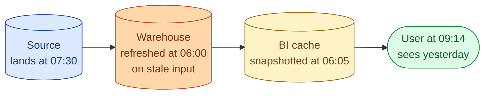
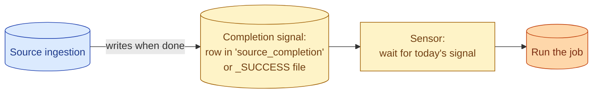
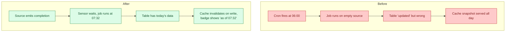



**Scenario:**
A finance PM messages at 09:14: "Revenue dashboard is showing yesterday's number. Did the job fail again?" You check. The job ran at 06:00 and succeeded. The warehouse query against `fct_revenue` returns today's data. The PM refreshes the dashboard; still yesterday. You realise the source for the dashboard is a BI cache that was refreshed at 06:05, and the source data only landed in the warehouse at 07:30. The 06:00 job ran on yesterday's late-arriving data. Three teams disagree on what "stale" means. The CTO asks you to lead a fix that prevents this monthly conversation.

In the interview, the question is:

> What does "stale" actually mean in a layered data stack, and how do you design freshness so this same conversation does not happen next month?

---

### Your Task:

1. Decompose "stale" into the three layers it can live in (data lands late, job runs early, cache is stale).
2. Propose a freshness contract that resolves the ambiguity.
3. Walk through the technical changes (SLA timing, dependency-aware scheduling, cache invalidation).
4. Cover the cultural change: the conversation pattern that ends "is it stale?" debates.

---

### What a Good Answer Covers:

* Data freshness vs job freshness vs view freshness.
* Why 06:00 was the wrong schedule and what should set the schedule.
* Sensor-based dependencies in the orchestrator (event-driven, not time-driven).
* Cache TTL vs cache invalidation triggered by the load.
* The "freshness SLO" as a one-line declaration per critical table.
* Communicating freshness in the BI tool itself (last-updated badge).


<div class="pr-solution-divider"></div>


## Solution 93: Dashboard Stale Despite a Healthy Job

### So, what just happened?

It is 09:14 on Monday. A finance PM messages: "Revenue dashboard is showing yesterday's number. Did the job fail again?"

You check three things, fast.

The job: ran at 06:00, success.
The warehouse table: query returns today's data.
The dashboard: still shows yesterday.

Then it clicks. The job ran at 06:00. But today's source data only landed at 07:30. So the 06:00 job ran on yesterday's late-arriving data and produced a "successful" but empty refresh. Then at 06:05, the BI tool's cache snapshotted that result. As of 09:14, the cache is still serving it.

Three things broke, in three places. Each one looks fine on its own.



### "Stale" is three different problems wearing one word

This is why three teams disagree about whether the dashboard is stale.

**Data is stale** when the source has not produced today's events yet. At 06:00 the source had not landed. So the inputs were stale.

**The table is stale** when the job ran but on old data, or did not run at all. The 06:00 job "succeeded" on empty input. That made the warehouse table stale, even though the warehouse query technically works.

**The view is stale** when the dashboard's cache is older than the table. The 06:05 cache snapshot is still showing what the warehouse looked like at 06:00.

A fresh dashboard needs all three to be current. Any one of them rotting kills the user experience.

When a PM says "is it stale?" they mean "the number I see does not match reality." They do not care which of the three layers caused it. Your job is to keep all three in sync, and to tell the user which one broke when one of them does.

### Fix the wrong-time problem first

The biggest miss in the scenario is the job at 06:00. It runs on a wall-clock schedule that has nothing to do with when the data actually arrives.

This is the kind of bug that comes from someone two years ago typing `0 6 * * *` in cron because that felt right. Nobody checked again.

The fix is to wait for the data, not for the clock.



How it actually works:

The source job, when it finishes loading today's data, writes a row to a `source_completion` table or drops a `_SUCCESS` file. That is the "I am done" signal.

Your downstream job has a sensor that polls for that signal. When it shows up, the job runs. If the signal does not arrive within a reasonable window (say, 4 hours), the sensor times out and alerts the right person.

Now the job runs at 07:30, when the data is actually there. And "job success" finally means something real: "the table has today's data." Not "the cron fired."

In Airflow this is `SqlSensor` or `S3KeySensor`. In Dagster it is sensors. In dbt Cloud, you wire the job behind a source freshness check. Every modern orchestrator has the primitive.

### Now fix the cache

The cache is showing 06:05's result. You need it to refresh when the table refreshes.

Three options, best to worst.

**Cache invalidation on write.** When the dbt build finishes writing the table, it fires a webhook at the BI tool. The BI tool invalidates the dashboard's cache. Looker, Tableau extracts, Power BI scheduled refresh, all of them support some version of this. Best option when the BI tool plays nice.

**Short TTL.** Set the cache to expire after 5 minutes. The user is at most 5 minutes behind. Costs go up because the BI tool re-queries more often, but the infra change is nothing. Decent fallback when invalidation is too hard.

**Last-updated badge.** Whatever you do for the cache, also show a "data as of HH:MM" badge on the dashboard, pulled from `MAX(updated_at)` on the table. Suddenly "stale" stops being an opinion. The user reads the timestamp and knows.

The badge is the cheapest win and the biggest impact. Do it even if you also do invalidation.

### A one-line freshness SLO per table

The deeper fix is to declare, in writing, what fresh means for each critical table.

```yaml
models:
  - name: fct_revenue
    meta:
      freshness:
        target: "data complete by 09:00 local"
        warn_after: 30
        error_after: 60
        owner: "@data-platform"
```

A monitor reads this every morning. If `MAX(updated_at)` is more than 60 minutes past 09:00, the named owner gets paged. The PM never has to ask. The data team finds out before the user does.

Three things to notice about that little block of YAML.

The target is "data complete by 09:00," not "job runs at 06:00." Job success and data freshness are not the same thing. Your SLO is about the user-facing thing, not the internal cron.

The owner is named. Not "the data team." A specific person or team that gets paged. Otherwise the alert goes nowhere and the SLO is theatre.

The thresholds are specific. 30 minutes and 60 minutes. Not "promptly" or "reasonable." Vague thresholds always slip.

### Before and after, side by side



Three changes. None of them is huge. Together they end the monthly conversation about whether the dashboard is right.

### Wednesday morning, walked through

Wednesday rolls around. Source lands a bit late at 07:45 because of a transient API hiccup. The sensor waits, the job kicks off at 07:46, the table is written by 07:51. The BI tool gets the webhook and drops the dashboard cache.

PM opens the dashboard at 08:30. Today's number is there. The badge reads "data as of 07:51." No question, no Slack message.

If the source had been very late (say, the API was down until 09:30), the freshness monitor would page the on-call at 10:00, the moment the SLO error threshold trips. The PM still opens at 08:30, sees yesterday's number with a "data as of yesterday 23:50" badge and a red "behind SLO" indicator. No Slack message needed; the dashboard tells the truth on its own.

### Things people get wrong

- **Confusing job success with freshness.** A job can succeed on stale or empty input. Measure the data, not the job.
- **Cron-driven jobs instead of signal-driven.** "06:00" is a guess. Data does not arrive on cue.
- **Cache TTL with no invalidation.** You always have a stale window, even when the data is fresh.
- **No badge on the dashboard.** Forces a Slack thread every time someone wonders.
- **"Freshness" without an SLO.** Every stakeholder has their own number in their head and they all disagree.

### Take-home

> Freshness is three layers, not one. Make the job wait for the data, invalidate the cache when the table updates, show a "data as of" badge, and write an SLO with an owner. The PM's morning question stops happening because the answer is already on the screen.

