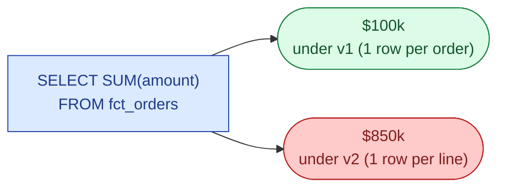
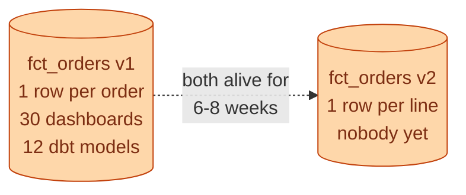
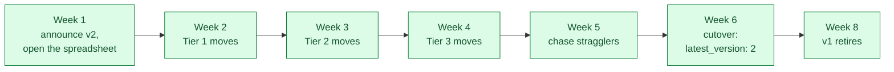



**Scenario:**
The product team wants per-line analysis on orders: which SKUs ship together, which lines get refunded. Your current `fct_orders` is one row per order. You need to change it to one row per order line. 30 dashboards and 12 dbt models depend on the current grain. A naive change breaks every revenue number in the company on the day you ship it. The CFO's board meeting is in three weeks. The lead asks you to plan the rollout.

In the interview, the question is:

> Walk me through how you ship a breaking change to a heavily-used model. What do you version, how do you keep the old grain alive during the transition, and how do you communicate the deprecation.

---

### Your Task:

1. Explain why this is a contract change, not a refactor.
2. Design the dual-version setup: v1 and v2 living side by side.
3. Cover the deprecation timeline and what milestones go in writing.
4. Walk through the rollback plan if v2 misbehaves after cutover.

---

### What a Good Answer Covers:

* The grain change is a semantic break, not a syntactic one.
* dbt's `versions:` feature and `ref('fct_orders', v=1)` syntax.
* The migration matrix: which consumers move when.
* `is_deprecated` and `deprecation_date` metadata on v1.
* Parallel-running both grains and validating row totals match.
* The communication cadence: announce, remind, deprecate, retire.


<div class="pr-solution-divider"></div>


## Solution 94: Versioning a Breaking Grain Change

### So, what just happened?

The product team wants to know which SKUs ship together and which lines get refunded. To answer that, you need to break `fct_orders` apart: one row per order line instead of one row per order.

Sounds like a refactor. It is not. It is a contract change.

Here is the trap. Every consumer of `fct_orders` wrote SQL assuming one row per order. The exact same query, run against the new grain, gives a different number. No error. Just a different number.



Same query, same column name, same model, with an 8.5x difference. Nobody gets an error. Every dashboard silently changes.

This is the worst kind of breaking change because it looks fine. The CFO's board deck runs the same query as last quarter. The number is wildly different. They notice in the meeting.

You have to stop that from happening.

### The rule: never rename or replace a model in place

If you change the shape of a model that other people query, you cannot ship it as an "upgrade." You ship it as a new version, and let consumers move over deliberately.



Both versions live side by side. Consumers move from v1 to v2 on their own schedule, with your help. Only after every consumer has moved does v1 retire.

dbt supports this directly. Existing code keeps working, new code opts in:

```sql
-- New code, on purpose
SELECT * FROM {{ ref('fct_orders', v=2) }}

-- Existing code, unchanged
SELECT * FROM {{ ref('fct_orders', v=1) }}
```

In `schema.yml`:

```yaml
models:
  - name: fct_orders
    versions:
      - v: 2
        defined_in: fct_orders_v2
      - v: 1
        defined_in: fct_orders_v1
        deprecation_date: 2026-08-15
    latest_version: 1   # do not change yet
```

Two physical models, both buildable, both queryable. Two grains, one project.

### The one weird trick: v1 is derived from v2

There is a trap people fall into. They maintain v1 and v2 as two separate pipelines. v1 still loads from source the old way, v2 loads the new way. Both run independently.

Do not do this. The two will drift. By week 3, v1's total revenue will not match the sum over v2. Trust collapses.

The cleanest design: v2 is the source of truth. v1 is a view that rolls v2 back up to the order level.

```sql
-- models/fct_orders_v1.sql, after the change
SELECT
  order_id,
  customer_id,
  order_date,
  SUM(line_amount) AS amount,
  COUNT(*) AS line_count
FROM {{ ref('fct_orders_v2') }}
GROUP BY order_id, customer_id, order_date
```

Two big wins.

No drift. v1's total revenue is, by construction, the sum over v2. You cannot have them disagree.

One backfill. When the source changes, you backfill v2. v1 follows automatically on the next dbt run. You never have to remember to backfill two places.

Prove the change is safe before you ship:

```yaml
# tests on fct_orders_v1
tests:
  - dbt_utils.equality:
      compare_model: ref('fct_orders_v1_snapshot_before_change')
      compare_columns: [order_id, amount]
```

Snapshot v1 the day before. The test compares the new v1 (derived from v2) against the snapshot. Land the change only when the test passes. Now you have machine-checked proof that no number changed.

### The migration matrix, before any code change

Spreadsheet. One row per consumer. Open it on day one.

| Consumer | Owner | Tier | Uses for | Move by | Status |
| --- | --- | --- | --- | --- | --- |
| Revenue dashboard | Finance | 1 | `SUM(amount)` per day | week 2 | not started |
| Daily order count | Ops | 2 | `COUNT(*)` per region | week 3 | not started |
| Cohort analysis | Growth | 3 | `MAX(order_date)` per user | week 4 | not started |
| ... | ... | ... | ... | ... | ... |

Tier 1 is finance, the board, anything regulated. They cannot tolerate a wrong number, even for a day. They move first.

Tier 2 is operational. Daily dashboards the team checks. They move in week 3.

Tier 3 is exploratory. Notebooks, ad-hoc SQL. Move them in week 4 or accept that they break. Their owners knew about the timeline.

This spreadsheet is the project. Do not flip `latest_version: 2` until every Tier 1 row is "moved."

### The timeline, week by week



Each milestone is a Slack message in the data channel. No emails. No meetings unless there is a real question. The spreadsheet is the source of truth, not a calendar invite.

Week 6 cutover is one PR. `latest_version: 2`. After this:

- Consumers who already moved: no change, they were already on v2.
- Consumers who explicitly stayed on `ref('fct_orders', v=1)`: no change, the explicit reference still resolves to v1.
- Consumers who used the unqualified ref and never migrated: they get v2 starting today. That should be no one, if you ran the spreadsheet well.

Week 8 is retirement. By now, everyone is on v2 or has a written reason to stay on v1. The retire PR drops the v1 model and the validation snapshot. dbt has been warning on every build for two weeks because `deprecation_date` is set, so nobody is surprised.

### Rollback is one line

If v2 misbehaves after cutover (a calculation bug, a join going wrong), flip the YAML back: `latest_version: 1`. One PR, one minute. Consumers on `ref('fct_orders', v=2)` keep their explicit reference and need to fix forward. Consumers on the unqualified ref drop back to v1's behaviour automatically.

This is why v1 is not retired at cutover. The two weeks v1 stays alive after cutover are your real safety net. The deprecation date is not bureaucracy, it is insurance.

### What about the board meeting?

Three weeks from the start of the project. Finance is Tier 1. They move in week 2. By week 3 the board number is being produced from v1, which is derived from v2.

The board number is identical to what it would have been with no change. The validation test proves it. The CFO's deck has the same number it always would have had.

That is the whole point of the design. The board meeting is not a risk. It is just a Tuesday.

### Things people get wrong

- **Renaming in place.** Overwriting `fct_orders` with the new grain. Every consumer silently breaks in different ways.
- **Two independent pipelines for v1 and v2.** They drift from day one. By cutover the totals disagree.
- **No deprecation date.** v1 lives forever. Two years later, someone is still querying it for reasons no one remembers.
- **No migration matrix.** "I sent an email" is not a plan. The spreadsheet is the plan.
- **Cutover before Tier 1 has moved.** The CFO's number changes on the day you flip the switch.

### Take-home

> A grain change is a contract change. Ship v2 next to v1, derive v1 from v2 so they cannot drift, give consumers six to eight weeks to migrate by tier, cut over, retire. Done right, the board meeting is identical to last quarter even though everything underneath is new.

