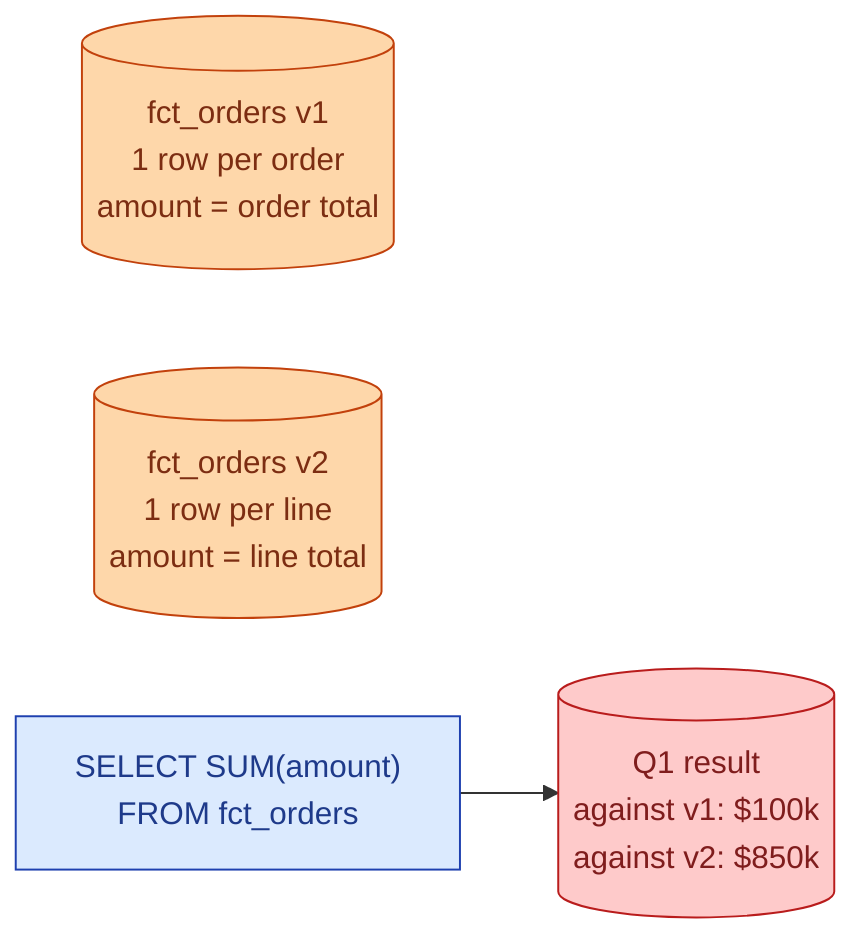
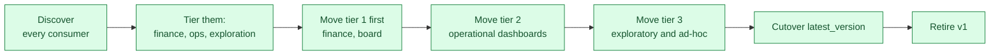



**Scenario:**
The product team wants per-line analysis on orders: which SKUs ship together, which lines get refunded. Your current `fct_orders` is one row per order. You need to change it to one row per order line. 30 dashboards and 12 dbt models depend on the current grain. A naive change breaks every revenue number in the company on the day you ship it. The CFO's board meeting is in three weeks. The lead asks you to plan the rollout.

In the interview, the question is:

> Walk me through how you ship a breaking change to a heavily-used model. What do you version, how do you keep the old grain alive during the transition, and how do you communicate the deprecation.

---

### Your Task:

1. Explain why this is a contract change, not a refactor.
2. Design the dual-version setup: v1 and v2 living side by side.
3. Cover the deprecation timeline and what milestones go in writing.
4. Walk through the rollback plan if v2 misbehaves after cutover.

---

### What a Good Answer Covers:

* The grain change is a semantic break, not a syntactic one.
* dbt's `versions:` feature and `ref('fct_orders', v=1)` syntax.
* The migration matrix: which consumers move when.
* `is_deprecated` and `deprecation_date` metadata on v1.
* Parallel-running both grains and validating row totals match.
* The communication cadence: announce, remind, deprecate, retire.


<div class="pr-solution-divider"></div>


## Solution 94: Versioning a Breaking Grain Change

### Short version you can say out loud

> A grain change is a contract change. Every consumer of the old model wrote SQL assuming one row per order; the new grain means every SUM, every COUNT, every GROUP BY now means something different. You cannot ship this in place. The pattern is: build v2 next to v1 with both grains live, give consumers a documented migration window of four to six weeks to move, mark v1 as deprecated with a hard retirement date, and retire it only after every consumer has either moved or signed off on staying broken. dbt supports this directly via model versions: `ref('fct_orders', v=1)` and `ref('fct_orders', v=2)` are two distinct selectables. Underneath, v1 is materialised by a query that aggregates v2's grain back to the order level, so there is one source of truth, no drift. The board meeting in three weeks runs on v1 numbers that are guaranteed identical to the old ones because v1 is a derived view over v2. The deprecation conversation is the slow part; the technical change is the easy part.

### Why this is a contract change



`SUM(amount)` against the new grain is the sum of line totals. Against the old grain it was the sum of order totals. Both queries are valid SQL. Both are "the same query." The numbers differ by ~10x because the average order has ~10 lines.

A consumer running the same query against the migrated model gets a different answer with no error. This is the worst kind of breaking change: silent, plausible-looking, wrong.

The implication: you cannot rename, you cannot replace in place, you cannot trust "we updated all the downstream models." Some of those models will get updated, run, produce a number that looks fine, and ship to leadership. The CEO's quarterly review will be wrong and you will hear about it.

The defense is to version explicitly and never let v1 disappear silently.

### The dual-version setup

dbt's model versions are the cleanest way:

```yaml
# models/marts/fct_orders.yml
models:
  - name: fct_orders
    versions:
      - v: 2
        defined_in: fct_orders_v2
      - v: 1
        defined_in: fct_orders_v1
        deprecation_date: 2026-08-15
    latest_version: 1   # do not change until cutover
```

Two physical models in the project: `fct_orders_v1.sql` and `fct_orders_v2.sql`. Consumers reference them explicitly:

```sql
-- New code, picks the new grain on purpose
SELECT * FROM {{ ref('fct_orders', v=2) }}

-- Existing code, unchanged
SELECT * FROM {{ ref('fct_orders', v=1) }}

-- Future-proofed code
SELECT * FROM {{ ref('fct_orders') }}   -- resolves to latest_version
```

The cutover is a single PR that flips `latest_version: 2`. Until then, every unqualified `ref('fct_orders')` keeps pointing at v1.

### One source of truth

The critical design decision: do not maintain v1 and v2 as independent pipelines. They will drift. v2 is the source; v1 is derived from v2.

```sql
-- models/fct_orders_v1.sql
SELECT
  order_id,
  customer_id,
  order_date,
  SUM(line_amount) AS amount,
  COUNT(*) AS line_count
FROM {{ ref('fct_orders_v2') }}
GROUP BY order_id, customer_id, order_date
```

Two consequences:

1. **No drift.** v1's total revenue is, by construction, equal to the sum over v2. There is no scenario where they disagree.
2. **One backfill, not two.** Backfills happen on v2. v1 follows from the next dbt run.

Validate this with a dbt test on launch:

```yaml
tests:
  - dbt_utils.equality:
      compare_model: ref('fct_orders_v1_old_snapshot')
      compare_columns: [order_id, amount]
```

Run the test against a snapshot of the original v1 to prove the new v1 (derived from v2) returns the same numbers. Land the change only when the test passes.

### The migration matrix



A spreadsheet, before code changes:

| Consumer | Owner | Tier | Uses grain for | Move by | Status |
| --- | --- | --- | --- | --- | --- |
| Revenue dashboard | Finance | 1 | `SUM(amount)` per day | week 2 | not started |
| Daily order count | Ops | 2 | `COUNT(*)` per region | week 3 | not started |
| Cohort analysis | Growth | 3 | `MAX(order_date)` per user | week 4 | not started |
| ... | ... | ... | ... | ... | ... |

Each consumer gets a PR that swaps `ref('fct_orders')` for `ref('fct_orders', v=2)` and adjusts the SQL for the new grain. Finance moves first because the board meeting depends on them.

Until tier 1 has moved, do not change `latest_version`. The default `ref('fct_orders')` keeps resolving to v1 and the board number stays exactly what it was.

### The communication cadence

A timeline written down on day one, sent to every consumer's channel:

| Week | Action |
| --- | --- |
| 1 | Announce v2. Show diff. Open the migration spreadsheet. |
| 2 | Tier-1 consumers move. Pairing sessions if needed. |
| 3 | Tier-2 consumers move. Daily standup mention. |
| 4 | Tier-3 consumers move. Reminder in every relevant channel. |
| 5 | All consumers should have moved. Run a query to find any remaining `ref('fct_orders', v=1)`. |
| 6 | Cutover: `latest_version: 2`. v1 still exists. |
| 8 | Hard retirement: drop v1. The deprecation_date in the YAML enforces this; dbt warns on every build for two weeks before. |

Each milestone is a Slack message in the data channel, not an email. The spreadsheet stays the single source of truth for "are we ready to cutover."

### The rollback plan

If v2 misbehaves after cutover (a calculation error, a join with the wrong table), the rollback is one PR: `latest_version: 1`. Consumers on `ref('fct_orders', v=2)` keep their explicit reference; consumers on the unqualified `ref('fct_orders')` go back to the old behaviour.

This is why v1 is not retired at cutover. The eight-week window is the actual rollback safety, not a courtesy.

### What v1 retirement looks like

When v1 is finally retired:

* Run a query against the warehouse query history for any reference to `fct_orders_v1` in the last 30 days. Zero hits, proceed.
* dbt's `deprecation_date` will already have been warning on every build for two weeks. Anyone still on v1 has been notified.
* The retire PR drops the v1 model and the `fct_orders_v1_old_snapshot` table.
* A Slack announcement: "v1 retired. The unqualified `ref('fct_orders')` has been resolving to v2 for 8 weeks. If you are seeing errors, ping me."

By this point retirement is a non-event because the work happened over the previous eight weeks.

### Common mistakes interviewers want you to name

1. **In-place replacement.** Renaming `fct_orders` to keep the same name with a new grain. Every consumer breaks silently.
2. **Two independent pipelines for v1 and v2.** Drift starts on week one. By week six v1 and v2 disagree on totals.
3. **No deprecation date in metadata.** "We will retire it eventually" never happens. v1 lives forever, queried by zero people, audited by nobody.
4. **No migration matrix.** "I sent an email" is not a plan. The spreadsheet is the plan.
5. **Cutover before tier 1 has moved.** The CFO's number changes on the day you flip the switch.

### Bonus follow-up the interviewer might throw

> *"What if a consumer refuses to migrate?"*

Three positions, depending on who they are.

If they are a high-priority consumer (finance, regulatory), v1 stays alive past the deprecation date. The deprecation slips. You document why and move on.

If they are a low-priority consumer (one ad-hoc dashboard nobody looks at), v1 retires anyway, their dashboard breaks, and you are willing to absorb the complaint. Sometimes the right answer is to force the issue, particularly when "the dashboard nobody looks at" is the source of "we need to keep v1 forever."

If they are mid-priority and uncooperative, the lever is leadership. The deprecation date was agreed in writing on week one. Their non-cooperation needs to be visible to whoever cares about platform velocity. This is the same problem as the partner contract in problem 91: technical answers do not solve organisational refusals.

The goal of a clean versioning system is to make the technical part trivial so the conversation can be about the organisational part.

