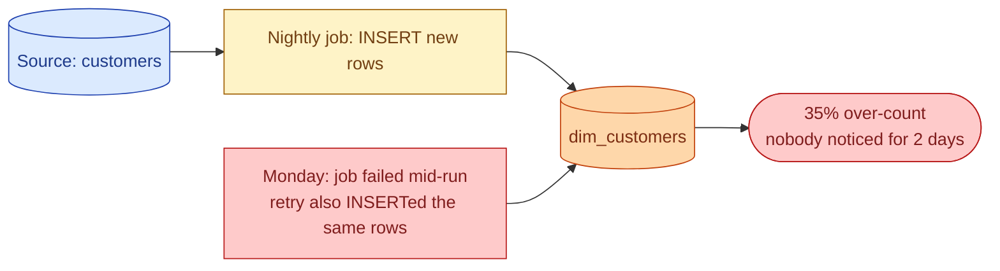
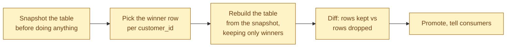



**Scenario:**
The nightly load to `dim_customers` has been "green" for months. This Tuesday an analyst notices the daily active count jumped 35% with no real reason. You check. The table has 2.4M rows. It should have around 1.8M. Querying for duplicates: a third of the customer_ids appear two or three times. Same id, slightly different `last_seen_at`. The job never failed once. Nobody got paged. The data just slowly stopped being trustworthy.

In the interview, the question is:

> Walk me through how you diagnose this, clean it up, and stop it from happening again. What is the underlying pattern most teams get wrong here?

---

### Your Task:

1. Explain how a "successful" job can quietly produce duplicates.
2. Walk through the cleanup: pick the winner, dedupe safely, prove the fix worked.
3. Describe the durable fix and why one common shortcut does not work.
4. Cover the tests that catch this on the next change.

---

### What a Good Answer Covers:

* Append-only INSERTs vs idempotent MERGE.
* Retries on a non-idempotent job double-write.
* Two sources overlapping on the same key.
* `ROW_NUMBER()` for picking the right version.
* A `unique` test on the natural key as the long-term safety net.


<div class="pr-solution-divider"></div>


## Solution 95: Duplicate Rows From a Successful Pipeline

### So, what just happened?

You have a job that loads `dim_customers` every night. Friday it loaded 12k new rows. Saturday 11k. Sunday 13k. Monday it failed once at 02:00, the orchestrator retried, the retry succeeded. Tuesday morning the analyst notices the daily-active count is off.

You query for duplicates and find them everywhere:

```
customer_id  | last_seen_at        | count
8472         | 2026-06-01 03:12    | 1
8472         | 2026-06-02 03:12    | 1   <-- Monday's duplicate
9134         | 2026-05-29 03:12    | 1
9134         | 2026-05-30 03:12    | 1
...
```

The job is green. The table query works. But every dashboard that does `SELECT COUNT(*) FROM dim_customers` is now wrong by about 30%.



This is the same quiet-break pattern from problem 91, in a different costume. Nothing failed. The data is just wrong.

### Why a "successful" job can write duplicates

Three usual suspects, in order of how often they bite.

**The job is not idempotent.** Most often this means `INSERT` straight into the target. A successful first run inserts rows. A failed-then-retried run inserts them a second time. The orchestrator's "retry on failure" feature, which sounds harmless, is what triggers it.

**Two sources overlap.** A customer appears in two upstream tables (say, app signups and partner imports). Both load into `dim_customers`. Both contribute the same customer_id with different `last_seen_at`.

**The "unique" assumption is wrong.** The team assumed `email` was unique. It is not, because users can change email. Or `customer_id` was unique per source, but two sources can have the same id.

For the scenario, Monday's retry is the smoking gun. The other two are still worth checking, because if you fix the retry but the source overlap is real, duplicates come back next week.

### Cleanup, in three steps

You need correct data by tomorrow morning and you cannot afford to delete real rows.



**Snapshot first.** Before you touch a single row, take a copy. `CREATE TABLE dim_customers_20260603_backup AS SELECT * FROM dim_customers`. If anything in the cleanup goes wrong, you have the original. This is not paranoia, this is two minutes of insurance.

**Pick the winner.** When the same customer_id has two rows, which one is the truth? Usually the latest. Sometimes the earliest. Decide explicitly, do not assume.

```sql
WITH ranked AS (
  SELECT *,
    ROW_NUMBER() OVER (
      PARTITION BY customer_id
      ORDER BY last_seen_at DESC
    ) AS rn
  FROM dim_customers
)
SELECT * FROM ranked WHERE rn = 1
```

`ROW_NUMBER()` is the tool here. Partition by the key that should be unique. Order by the column that defines "latest." Keep only `rn = 1`.

**Rebuild the table.** Do not `DELETE` duplicates in place. That is slow, hard to verify, and easy to get wrong. Build a clean table from the snapshot and swap.

```sql
CREATE OR REPLACE TABLE dim_customers AS
SELECT customer_id, email, country, last_seen_at, /* ... */
FROM ( /* the ROW_NUMBER query above */ )
WHERE rn = 1;
```

**Diff before promoting.** Count the rows you kept vs the rows you dropped. Spot check 20 customers across the boundary. If anything looks wrong, you still have the snapshot.

**Tell consumers.** One Slack message. "dim_customers had ~30% duplicate rows from a Monday retry. The table is now correct. Daily active for the last two days will look different. Snapshot at dim_customers_20260603_backup if you need to compare."

### Now the durable fix

The cleanup is one-time work. The durable fix is what stops this from happening again.

The rule: stop doing `INSERT INTO dim_customers`. Start doing `MERGE`.

```sql
MERGE INTO dim_customers AS target
USING staging_customers AS source
ON target.customer_id = source.customer_id
WHEN MATCHED THEN UPDATE SET
  email = source.email,
  country = source.country,
  last_seen_at = source.last_seen_at
WHEN NOT MATCHED THEN INSERT (
  customer_id, email, country, last_seen_at
) VALUES (
  source.customer_id, source.email, source.country, source.last_seen_at
);
```

Why this fixes Monday's retry: the second `MERGE` finds the same customer_ids already in the target. They match. They get updated in place, not inserted again. Run the same `MERGE` ten times, the target looks the same as running it once. That is idempotency, and it is the property you need.

In dbt, this is one line in the model config:

```sql
{{ config(materialized='incremental', unique_key='customer_id') }}
```

dbt generates the `MERGE` for you. The unique_key is the part that matters. Get it wrong and you are back to duplicates with a different paint job.

### What about the shortcut?

A common suggestion: "just `SELECT DISTINCT` at the end of the model." This is a trap.

```sql
SELECT DISTINCT * FROM staging_customers   -- hides the bug
```

Three reasons this is wrong.

It hides the duplicate problem instead of fixing it. The job keeps producing duplicates. You just paper over them at the last step. The day someone forgets the `DISTINCT`, duplicates are back.

It only works when all columns match exactly. The scenario's duplicates have slightly different `last_seen_at` between runs. `DISTINCT` keeps both rows because they are not actually identical.

It does not scale. `SELECT DISTINCT` on a 100M row table is expensive every single run. `MERGE` on a unique key is not.

Use `MERGE`. Skip the shortcut.

### The test that catches it next time

Even with `MERGE` in place, you want a test that screams if duplicates ever show up. dbt's `unique` test is one line:

```yaml
models:
  - name: dim_customers
    columns:
      - name: customer_id
        tests:
          - unique
          - not_null
```

Runs after every build. If `customer_id` ever has duplicates, the build fails and the downstream models do not refresh. The wrong data never reaches the dashboards.

For tables where the natural key is composite (say, `customer_id + event_date`), use `dbt_utils.unique_combination_of_columns`. Same idea, just multiple columns.

### Tomorrow morning, walked through

Same scenario, new design. Friday's job runs. 12k new customers, 0 updates. Monday the job dies at 02:00, the orchestrator retries.

1. The retry runs the same `MERGE`. The customer_ids from the first partial attempt are already in `dim_customers`. They match. Their values get rewritten with the same source data.
2. The `unique` test runs after the build. Passes.
3. Tuesday morning the dashboard is correct.

Nothing to clean up. No Slack message. No analyst noticing weird numbers.

### Things people get wrong

- **Assuming "successful" means "correct."** Job success only means the SQL ran without error. The data could be a mess.
- **DELETE-in-place cleanup.** Slow, easy to mis-target, hard to verify. Rebuild from snapshot instead.
- **`SELECT DISTINCT` as a fix.** Papers over the bug, breaks on near-duplicates.
- **MERGE without a unique key check.** A wrong unique_key gives you a different shape of duplicate bug.
- **No `unique` test on the natural key.** The build keeps passing while the table rots.

### Take-home

> Successful jobs can quietly write duplicates the moment a retry happens. The fix is MERGE on a stable unique key, plus a unique test that screams when the assumption breaks. Cleanup is rebuild-and-swap with a snapshot for safety.

