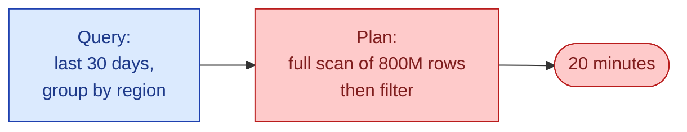
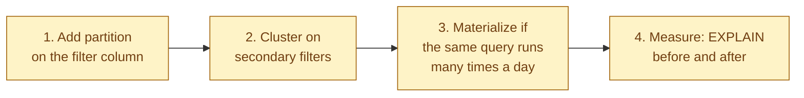



**Scenario:**
A finance analyst messages you: "Why does the daily revenue query take 20 minutes? It is just last 30 days, grouped by region. The dashboard times out and I have to keep refreshing." You run the query yourself. It is 14 lines of SQL: a `SELECT` on `fct_orders`, a join to `dim_customer` for region, a `WHERE order_date >= CURRENT_DATE - 30`, and a `GROUP BY region`. The table has 800M rows. The query plan shows a full scan. 20 minutes is generous.

In the interview, the question is:

> Walk me through how you make this query fast. What do you actually change, and why does the optimizer not save you?

---

### Your Task:

1. Read the query plan and explain what is going wrong.
2. Walk through the layered fix: partition filter first, then clustering, then materialization if needed.
3. Cover the common mistake of "just add an index."
4. Explain how to verify the fix actually worked.

---

### What a Good Answer Covers:

* Partition pruning vs full scan.
* Clustering for the filter columns the optimizer cannot prune.
* Pre-aggregated tables when the same group-by runs 100x a day.
* `EXPLAIN ANALYZE` before and after.
* Why a "missing index" answer reveals you have not used a columnar warehouse before.


<div class="pr-solution-divider"></div>


## Solution 96: The 20-Minute Query That Should Be 2 Seconds

### So, what just happened?

The query the analyst sent you looks innocent:

```sql
SELECT c.region, SUM(o.amount) AS revenue
FROM fct_orders o
JOIN dim_customer c USING (customer_id)
WHERE o.order_date >= CURRENT_DATE - INTERVAL '30 days'
GROUP BY c.region;
```

14 lines. The intent is clear. Last 30 days, group by region, sum revenue.

You run `EXPLAIN`. The plan reads the entire `fct_orders` table. 800 million rows. The 30-day filter is applied after the scan, not before. The join to `dim_customer` is a hash join over the full result. Then the group-by runs over the result of the join.

Every row in the table gets touched, for a query that should read 4% of them.



This is the most common slow-query story in a modern warehouse. The fix is rarely "write better SQL." It is "give the engine a way to skip rows."

### How a warehouse actually skips rows

A columnar warehouse (Snowflake, BigQuery, Redshift, Databricks, anything similar) does not use B-tree indexes. It uses two simpler tricks.

**Partition pruning.** The table is physically split into partitions, each one labeled with a range of values. When you filter on the partition column, the engine reads only the matching partitions. The rest never touch disk.

**Column pruning and clustering.** Within a partition, the engine stores each column separately and tracks min/max per chunk. A filter on a clustered column skips chunks whose min/max miss the filter.

If the table is partitioned by `order_date`, the 30-day filter reads 30 partitions, not all of them. That is the difference between 20 minutes and 2 seconds.

In the scenario, `fct_orders` is almost certainly not partitioned. Or partitioned by something unhelpful like `created_at` while the query filters on `order_date`. Check the table's DDL before guessing.

### Step 1, check the partitioning

Open the table's metadata. In dbt:

```sql
{{ config(
    materialized='table',
    partition_by={'field': 'order_date', 'data_type': 'date'}
) }}
```

In raw SQL (BigQuery flavour):

```sql
CREATE TABLE fct_orders
PARTITION BY DATE(order_date)
AS SELECT ...
```

If `order_date` is not the partition column, the query cannot prune. Adding the partition is a one-time table rebuild. The rebuild is expensive, but the 100x query speedup that follows pays for it inside a week.

After partitioning, the same query reads ~30 partitions instead of the whole table.


Partition first. Most of the time, this single change is the whole answer.

### Step 2, cluster on the filter columns

Suppose the query is fast at 30 days but slow at 24 hours, because the analyst added `AND country = 'SE'`. The partition still reads 30 partitions, but inside each one, the engine scans every row to find Sweden.

Clustering fixes that. Inside each partition, rows are sorted by the cluster column. Filters on the cluster column skip chunks.

```sql
CREATE TABLE fct_orders
PARTITION BY DATE(order_date)
CLUSTER BY country, region
AS SELECT ...
```

Pick cluster columns the way you pick indexes in OLTP: the columns that show up in `WHERE` and `JOIN` most often, ordered by selectivity (most selective first).

Two clusters is usually enough. Four is the limit. Adding more does not help and slows writes.

### Step 3, materialize if the same query runs 100 times a day

If the dashboard hits this query every page load, you are paying for it over and over. The same aggregation, the same 30 days, the same group-by. The engine cannot cache it across users, and even if it could, the cache misses every time the underlying table updates.

The fix is to pre-aggregate. Build a small table:

```sql
{{ config(materialized='table') }}

SELECT
  DATE(order_date) AS order_date,
  c.region,
  SUM(o.amount) AS revenue,
  COUNT(*) AS n_orders
FROM {{ ref('fct_orders') }} o
JOIN {{ ref('dim_customer') }} c USING (customer_id)
WHERE order_date >= CURRENT_DATE - INTERVAL '90 days'
GROUP BY order_date, c.region;
```

The dashboard queries this 200-row daily-by-region table. Sub-second every time. The expensive join and aggregation runs once when the model builds, not once per dashboard view.

In BigQuery this is a materialized view. In Snowflake, a dynamic table. In dbt, just a regular `table` materialization in your project. Pick whichever your stack supports cleanly.

### A common wrong answer: "just add an index"

If your instinct was to add an index, you have not used a columnar warehouse before. Columnar warehouses do not have B-tree indexes on user tables. The replacement is partitioning + clustering, which works differently.

In Postgres or MySQL, the answer is an index on `(order_date, customer_id)`. In Snowflake, BigQuery, Redshift, Databricks, you partition by `order_date` and cluster by `customer_id`. Same idea, different mechanism. Same goal: do not read what you do not need.

Naming this difference matters in interviews. Saying "add an index" in a Snowflake context tells the interviewer you are guessing.

### Prove the fix actually worked

After every change, re-run with `EXPLAIN ANALYZE` (or your engine's equivalent: BigQuery's "execution details," Snowflake's query profile).

The two numbers to watch:

**Bytes scanned.** Should drop from "full table" to "the slice you actually need." For the scenario, target 4% of full table (30 days of 750 days = 4%).

**Wall time.** Should drop proportionally. If bytes dropped 25x but time only dropped 2x, something else (join, group-by) is now the bottleneck. Different fix.

Write the before/after in the PR description. "Was 20 min / 800 GB scanned. Now 1.4 s / 32 GB scanned." Makes the change reviewable and gives the next person a baseline.

### The order to fix in



Most queries are fixed by step 1. Step 2 catches 80% of the rest. Step 3 is for hot dashboard queries. Step 4 is non-negotiable.

Do not skip ahead. Materializing a query that is slow because of a missing partition just shifts the slow build to the dbt run.

### Tomorrow morning, walked through

You ship the partition + cluster change. dbt rebuilds `fct_orders` overnight. In the morning the same query runs in 1.8 seconds.

The analyst messages you back: "Wait, did you change something? The dashboard loads instantly now." You point them at the PR. They learn what the partition is doing. Next time they design a model, they add the partition themselves.

The dashboard latency drops from "the analyst gives up and refreshes" to "they stop noticing." The compute bill drops by something like 90% for that one query, more if there are similar ones.

### Things people get wrong

- **Reaching for indexes.** Wrong tool for a columnar warehouse.
- **Adding partitions on the wrong column.** Partition on what you actually filter on, not on a generic "created_at."
- **Clustering on too many columns.** Three or four max. More slows writes for no read win.
- **Materializing the slow query without partitioning first.** The model build is now slow instead of the dashboard.
- **Not measuring after.** Without bytes-scanned numbers, you do not know if you fixed it or got lucky.

### Take-home

> Slow queries on a columnar warehouse are almost always missing a partition filter. Partition on the filter column, cluster on secondary filters, materialize hot aggregates. Measure bytes scanned before and after, not just time.

