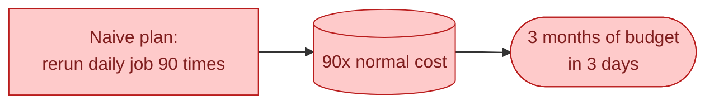
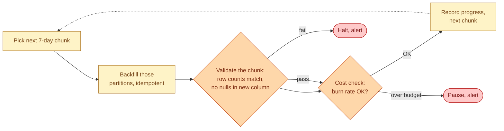



**Scenario:**
Three weeks ago, the source team added a new column `signup_channel` to the events stream. You picked it up two weeks ago, and from then on, the warehouse has it populated. But for the 90 days before, the column is null. Product wants the historical period populated for cohort analysis. The naive plan, "just rerun the daily job for each of the 90 days," would cost about 90x a normal day. Your monthly warehouse credit budget is enough for one and a half days of that. Finance will not approve more. The board meeting is in nine days.

In the interview, the question is:

> Plan the backfill. What do you reprocess, what do you skip, how do you make it idempotent, and how do you keep it from killing the budget or the warehouse?

---

### Your Task:

1. Define what actually needs to be backfilled vs what does not.
2. Walk through chunked, idempotent processing for the affected period.
3. Cover throttling and how to pause/resume safely.
4. Explain how to verify the backfill is correct before you mark it done.

---

### What a Good Answer Covers:

* The "least work needed" framing: only the affected column.
* Partition-replace for idempotency.
* Running the backfill in chunks (e.g., 7 days at a time).
* Throttling against cost: stop if today's burn exceeds N% of daily budget.
* Resume-from-where-you-stopped, not start-over.
* A spot-check that proves the new column matches what daily would produce.


<div class="pr-solution-divider"></div>


## Solution 97: Backfill 90 Days Without Blowing the Budget

### So, what just happened?

Three weeks ago the source team added a column called `signup_channel` to the events stream. Two weeks ago you picked it up in the pipeline. From that point on, the warehouse has it. Before that, the column is `NULL` for 90 days of history.

Product wants the historical period populated. The cohort analysis they want for the board meeting only works if `signup_channel` is non-null going back 3 months.

The obvious plan: rerun the daily job for each of the past 90 days. Each run costs about the same as a normal day. Total: 90x your normal daily warehouse spend. Your monthly budget is 30x a daily run. You would burn 3 months of budget in 3 days, the warehouse would queue up, finance would call.



The good news: you do not actually need to redo 90 days of work. You only need to fill one column. The senior move is to figure out the smallest correct thing, run that, and prove it matches the truth.

### Step 1, scope the work down

Before writing any code, ask: what do I actually need to update?

The daily job does many things. It loads raw events, derives 30 columns, joins to three dimensions, writes 4 marts. Of all that, only one output table (`fct_events_daily`) needs the historical `signup_channel` column populated.

You do not need to rebuild the marts. You do not need to recompute the joins. You do not need to refresh the dimensions. The source data for that column already exists in the raw landing table. You just need to populate one column on one table for 90 days of partitions.

```sql
-- Per partition, this is the whole backfill
UPDATE fct_events_daily
SET signup_channel = src.signup_channel
FROM raw_events src
WHERE fct_events_daily.event_date = src.event_date
  AND fct_events_daily.event_id = src.event_id
  AND fct_events_daily.event_date = '2026-04-15';
```

Wait, an `UPDATE` on a partitioned warehouse table is usually expensive too. Most warehouses prefer a partition-replace pattern. Same idea, different shape:

```sql
-- Idempotent partition replace
CREATE OR REPLACE TABLE fct_events_daily$20260415 AS
SELECT
  ev.event_id, ev.event_date, ev.user_id, ev.event_name,
  src.signup_channel,   -- the new column, sourced from raw
  ev.other_cols_unchanged
FROM fct_events_daily WHERE event_date = '2026-04-15' ev
LEFT JOIN raw_events src
  ON ev.event_id = src.event_id;
```

Whichever shape your warehouse prefers, this is per-partition work, not full-table work. The cost per partition is small. The cost across 90 partitions is roughly 90x small, not 90x the full daily run.

That alone often turns a budget-blowing plan into an affordable one.

### Step 2, run it in chunks

Even now, 90 days at once is not a great idea. If something goes wrong on day 47, you want to know without having paid for days 48-90 first.

So you process in chunks: 7 days at a time is a good default.



After each chunk, two checks.

**Validation.** Row counts on the backfilled partitions still match the original. The new column has no surprise nulls. A spot-check of 20 random event_ids matches what a same-day-only rerun would produce.

**Cost.** Query your warehouse's billing API or `INFORMATION_SCHEMA.QUERY_HISTORY`. If today's burn is over 110% of normal, pause. If under, continue.

Both checks are short queries, not human review. The whole thing is one orchestrator DAG that runs as long as it is safe to.

### Step 3, make it resumable

If the backfill hits a transient error on chunk 4 of 13, you do not want to restart from chunk 1. You want to pick up where you left off.

Keep a tiny progress table:

```sql
CREATE TABLE governance.backfill_progress (
  backfill_id TEXT,        -- 'signup_channel_2026_q1'
  partition_date DATE,
  status TEXT,             -- 'pending', 'done', 'failed'
  finished_at TIMESTAMP
);
```

Before each chunk: query the table for the next batch of `pending` partitions. After each chunk: update to `done` or `failed`. The job becomes loopable, restartable, and observable. You can answer "where are we" with a single `SELECT`.

This is the same pattern as the side-table reprocessing in problem 92, just for batch.

### Step 4, idempotency is the safety net

Partition replace is naturally idempotent. Running the same backfill SQL on the same partition twice gives the same result. That matters because:

- The job can be retried on transient failure without doubling anything.
- A human can re-run a specific date range if they suspect it was wrong, without fear.
- You can re-run the whole backfill side by side with a control group to validate.

The day someone says "I think the signup_channel for April is still wrong," your answer is "let me re-run April, the partition replace is safe to retry." Not "let me check what state we are in and write a custom recovery script."

### Step 5, prove it before declaring done

The backfill is not done when the last chunk finishes. It is done when you can show it matches what a daily run would have produced.

Pick a recent day that you have already backfilled, say 2026-04-15. Run the normal daily job for just that day, write to a side table called `fct_events_daily_validation`. Compare:

```sql
SELECT
  COUNT(*) AS rows_in_validation,
  COUNT(*) FILTER (WHERE fact.signup_channel IS DISTINCT FROM val.signup_channel)
    AS rows_disagreeing
FROM fct_events_daily fact
JOIN fct_events_daily_validation val USING (event_id)
WHERE fact.event_date = '2026-04-15';
```

Zero disagreements: ship it. Some disagreements: investigate before the board meeting.

This validation step is what separates a backfill that "looks fine" from one that you can defend in writing.

### A simpler thing the team usually forgets

Sometimes you do not need to backfill at all. If `signup_channel` is derivable from another column you already have (say, `referrer_url`), you can compute it on the fly in the cohort model:

```sql
SELECT
  event_id,
  COALESCE(signup_channel, derive_channel_from_url(referrer_url)) AS signup_channel,
  ...
FROM {{ ref('fct_events_daily') }}
```

Now the historical period gets the column at query time. No partition rewrites at all. The model takes slightly longer per query but the backfill is zero cost.

This is not always possible. But check before you commit to a 90-partition rewrite.

### Tomorrow morning, walked through

The first 7-day chunk runs overnight. By 06:00 you check:

- Validation: 7 partitions backfilled, row counts match, no surprise nulls.
- Cost: yesterday's burn was 1.1x normal. Within budget.

The backfill is on track for 13 chunks total = roughly 13 days, well inside the 9-day deadline if you run 2 chunks per day.

By day 7 the historical period is filled. By day 8 the validation script confirms April matches what daily would have produced. By day 9 the cohort analysis is in the board deck.

Total cost: about 5x a normal day, not 90x. The senior move was scoping the work down before writing code.

### Things people get wrong

- **Rerunning the daily job 90 times.** Almost always 10-50x more expensive than necessary.
- **No idempotency.** Retries double-write. Or worse, partial replays produce inconsistent state.
- **No throttling.** The backfill starts, the bill spikes, finance pauses it mid-flight, the state is half-done.
- **No validation.** You declare it done. Next month an analyst spots a 2% discrepancy. Now you have to redo it under more pressure.
- **No progress table.** A transient failure on chunk 4 means restarting from chunk 1.

### Take-home

> Scope the backfill down to the smallest correct thing. Use partition replace so it is idempotent. Process in chunks with cost and validation gates between them. Resume from the last good chunk. Prove the result matches a control before declaring done.

