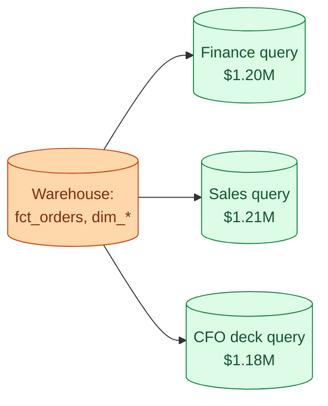
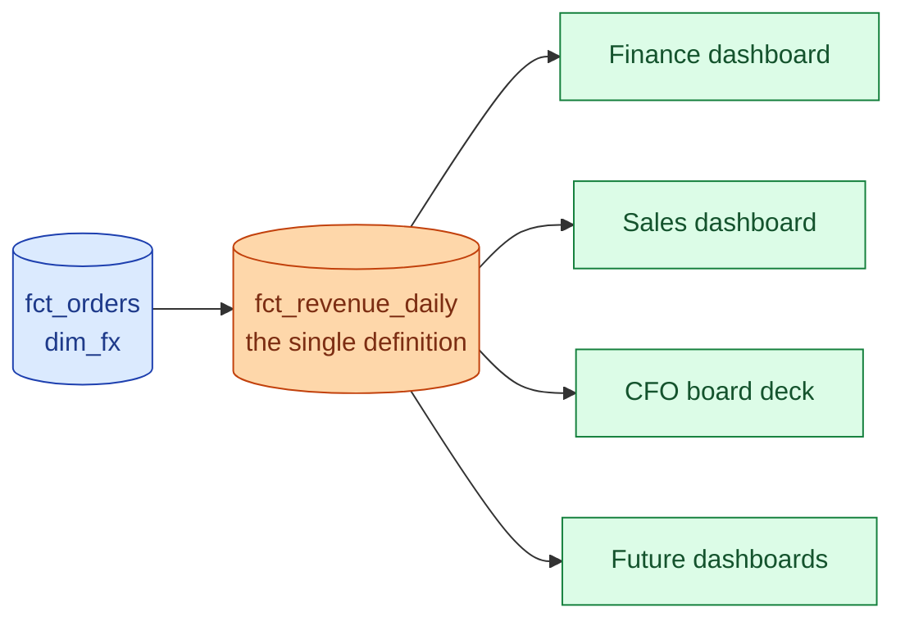



**Scenario:**
Monday's standup. The finance dashboard says June revenue is $1.20M. The sales dashboard says $1.21M. The CFO's board deck, sent yesterday, says $1.18M. All three queries say "from the warehouse." All three queries say "June revenue." The CEO asks which number is right. Three teams point at each other. You realise no one in the room knows the actual answer because three different SQL queries were used and nobody compared them.

In the interview, the question is:

> Walk me through how you resolve this without picking sides, and how you stop it from happening again. What is the durable fix that most teams skip because it feels slow?

---

### Your Task:

1. Resolve the immediate disagreement by reading the actual SQL behind each number.
2. Identify the patterns that cause this (timezone, refunds, currency, definition of "order").
3. Walk through introducing a single source of truth for the metric.
4. Cover what changes for the next metric so this does not happen again.

---

### What a Good Answer Covers:

* Reading SQL is faster than running meetings.
* The four usual definition gaps: refunds, time zone, currency, order vs line.
* A `fct_revenue_daily` (or semantic-layer metric) that every dashboard joins to.
* Naming the metric what it actually is ("gross revenue, USD, ex-tax, on order date").
* The metric review process for any new metric.


<div class="pr-solution-divider"></div>


## Solution 98: Same Metric, Three Different Numbers

### So, what just happened?

Finance dashboard says $1.20M. Sales dashboard says $1.21M. The CFO's board deck says $1.18M. All three labelled "June revenue." All three sourced "from the warehouse."

The CEO asks which one is right. Three teams point at each other. Nobody actually knows, because nobody has read the three SQL queries side by side.



This is the most political-feeling problem in data engineering and the most technical. The fix is not a meeting. The fix is reading code.

### Step 1, read the SQL

Stop the room. Get the actual SQL behind each number. Not the description, not what the analyst remembers, the exact SQL the dashboard runs.

```sql
-- Finance: $1.20M
SELECT SUM(amount)
FROM fct_orders
WHERE order_date BETWEEN '2026-06-01' AND '2026-06-30';

-- Sales: $1.21M
SELECT SUM(o.amount)
FROM fct_orders o
WHERE o.status != 'cancelled'
  AND DATE(o.order_at) BETWEEN '2026-06-01' AND '2026-06-30';

-- CFO deck: $1.18M
SELECT SUM(o.amount * fx.rate)
FROM fct_orders o
JOIN dim_fx fx ON fx.currency = o.currency AND fx.fx_date = o.order_date
WHERE o.order_date BETWEEN '2026-06-01' AND '2026-06-30'
  AND o.refund_amount = 0;
```

Now diff them. The differences jump out in 30 seconds.

- Sales filters on `status != 'cancelled'`, finance does not.
- CFO multiplies by FX rate, the others do not. So CFO is in USD; the others mix currencies.
- CFO excludes orders with any refund. Finance and sales include them.
- Sales uses `order_at` (a timestamp), finance uses `order_date` (a date). If `order_at` is UTC and customers are in different timezones, the day boundaries differ for some rows.

Nobody is lying. Each query is correct for what its author thought "revenue" meant. The three numbers are answers to three slightly different questions.

The CEO's question, "which one is right," has no answer until someone defines what revenue means for this company.

### Step 2, name the four usual culprits

The same four things cause this fight in almost every company. Worth memorising.

**Refunds and cancellations.** Gross revenue includes them. Net excludes them. Most "wrong number" disagreements are this.

**Currency.** Multi-currency businesses have to pick: convert at order date, at month-end, at fixed rate. Each gives a different total.

**Time zone.** `2026-06-30 23:30 UTC` is `01:30 July 1 in Stockholm`. Depending on which timezone you use to define "June," the same order falls on either side.

**Grain.** One row per order vs one row per order line. SUM(amount) on the two grains gives wildly different answers, as in problem 94.

For the scenario, the three queries hit three of these (refunds, currency, time zone). The fourth is hiding, waiting for the next argument.

### Step 3, define the metric once, in writing

The fix is not to pick the "right" query. The fix is to define revenue, in writing, in one place, and rebuild every dashboard on top of that single definition.

The definition is one sentence and a link:

> **June revenue** = gross order amount, in USD at order-date FX rate, excluding cancelled orders, with refunds counted as negative line items, grouped by order_date in UTC.

That sentence is your spec. The implementation is one model:

```sql
-- models/marts/fct_revenue_daily.sql
SELECT
  DATE(o.order_at AT TIME ZONE 'UTC') AS revenue_date,
  o.region,
  SUM(
    (o.amount - COALESCE(o.refund_amount, 0))
    * fx.rate
  ) AS revenue_usd
FROM {{ ref('fct_orders') }} o
LEFT JOIN {{ ref('dim_fx') }} fx
  ON fx.currency = o.currency AND fx.fx_date = DATE(o.order_at)
WHERE o.status != 'cancelled'
GROUP BY revenue_date, o.region;
```

Every dashboard that talks about revenue queries this model. Not `fct_orders`. Not their own custom rollup. This model.



A semantic layer (dbt Semantic Layer, Cube, LookML) is the modern version of this. The metric is defined once in code; every BI tool consumes it. If you have one, use it. If you do not, a plain dbt model named `fct_revenue_daily` does the same job.

### Step 4, name the metric what it actually is

Calling it just "revenue" is part of the problem. The senior version names the assumptions in the table name or column name:

`revenue_gross_usd_ex_tax_by_order_date`

Ugly? Yes. Unambiguous? Also yes. Use a long name once and you stop the next debate before it starts.

If a future stakeholder wants "net revenue with deferred recognition over 12 months," they get a different model with a different name. Two metrics, two models, two names. Each one defines exactly what it is.

### Step 5, a tiny process for new metrics

The technical fix only holds if new metrics do not slip in unannounced. The senior pattern is a one-page metric review for any new metric proposal:

1. **Name.** What is it called, including the assumptions.
2. **Definition.** One sentence.
3. **SQL.** The model that produces it.
4. **Owner.** The team that approves changes.
5. **Validation.** A row in the test suite that compares to a known external check.

A new metric is a PR. The PR adds the model and the definition doc together. No model lands without the doc. No doc lands without the model.

This is more bureaucracy than analysts like. It is also why finance, sales, and the CFO produce the same number next quarter.

### Tomorrow morning, walked through

Wednesday rolls around. A product manager wants "active user revenue" for a churn investigation.

1. They open a PR that adds `fct_active_user_revenue_daily.sql` plus a metric doc.
2. The data team reviews. Naming is OK. Definition matches what product wants. SQL builds clean.
3. PR merges. The dashboard the PM is building queries the new model.
4. When the CFO asks "is this the same revenue you reported last week?", the answer is "no, this is active-user revenue, see the doc" with a link.

No fight. No three-team meeting. No "which one is right." The definitions live in code where they can be checked.

### Things people get wrong

- **Trying to resolve in a meeting.** Read the SQL. The answer is in the SQL.
- **Naming metrics generically.** "Revenue" hides the choices. Long names show them.
- **Skipping the central model.** Every team rewrites the same SQL slightly differently. Drift is guaranteed.
- **Defining metrics in a wiki.** Wikis rot. Definitions belong next to the code that implements them.
- **No metric review for new ones.** Six months in, you have 47 versions of "active user."

### Take-home

> Three numbers for the same metric is a definition problem, not a number problem. Read the SQL, identify the gap, define the metric once in a single model with a long honest name, and route every dashboard through it. The next disagreement gets settled by a link, not a meeting.

