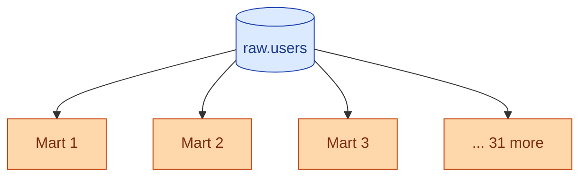
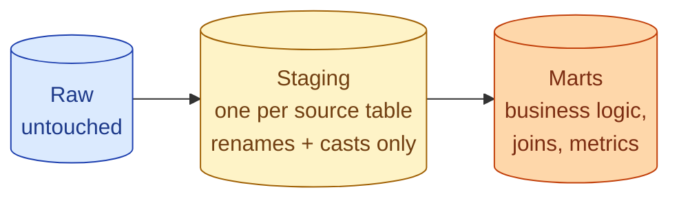
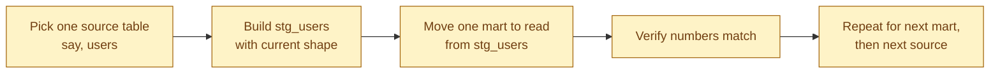



**Scenario:**
You inherit a dbt project a junior set up six months ago. It works. 40 marts, all clean-looking SQL, builds in 20 minutes. Then last week the source team renamed `user_id` to `account_id` in the `users` source table. 31 of the 40 marts broke at once. Each one queries `raw.users` directly. Each one has to be edited and tested. Two days of work, half the team blocked. Meanwhile, you notice the same business logic ("active customer") is implemented in 8 different ways across 8 different marts, each one slightly different.

In the interview, the question is:

> What is missing from this project, and how do you introduce it without rewriting everything at once?

---

### Your Task:

1. Explain why every mart joining to raw is the underlying problem.
2. Walk through the three-layer architecture (raw, staging, marts) and what each layer is for.
3. Cover the gradual migration path: introducing staging without breaking what works.
4. Explain why this is the single highest-impact refactor most dbt projects need.

---

### What a Good Answer Covers:

* The "every mart talks to raw" anti-pattern.
* One staging model per source table, only renames and casts.
* Marts read staging, never raw.
* Centralised business logic (e.g., `is_active_user`) defined once.
* Migration: build staging, point marts one at a time, retire raw access at the end.


<div class="pr-solution-divider"></div>


## Solution 99: No Staging Layer, Everything Touches Raw

### So, what just happened?

A dbt project with 40 marts. Each mart starts with `SELECT * FROM raw.users` and joins to other raw tables. Pretty SQL, builds fast, looks clean.

Then the source team renames `user_id` to `account_id`. Every one of those 31 marts breaks the next morning. Each one needs the same edit. Each one needs its own PR, review, test, deploy. Two days of work, half the team blocked on the rename.

While you are in the code, you notice something worse. The same business question, "is this customer active," is answered 8 different ways:

```sql
-- mart 1
WHERE last_seen_at > CURRENT_DATE - 30

-- mart 2
WHERE last_seen_at > CURRENT_DATE - 30 AND status = 'active'

-- mart 3
WHERE last_order_at > CURRENT_DATE - 90

-- mart 4 ... (and on)
```

Eight definitions of "active." When the CEO asks "how many active customers," eight numbers exist. This is problem 98 in slow motion: a metric problem that grows out of a structure problem.



Every mart touches raw. Any source change explodes outward to every mart. Every mart reinvents shared logic locally. This is the most common dbt project anti-pattern, and it is the single highest-impact thing a senior fixes.

### What a layered project looks like

Three layers, each with one job.



**Raw.** Exactly as it arrived from the source. Read-only. No transformations.

**Staging.** One model per source table. Job: rename columns to your project's standard, cast types, drop columns you do not use. No joins. No business logic. Just clean, predictable shapes.

**Marts.** The business answers. Joins live here. Business logic lives here. "Active customer" is defined here, once, and reused.

The rule is hard: marts read staging, never raw. That single rule fixes both problems in the scenario.

### Why staging is the trick

The staging layer looks pointless when you first see it. It is "just renames," people say. Why add an entire layer for that?

Because it is the layer that absorbs source-side change.

When the source team renames `user_id` to `account_id`, only one model changes: `stg_users`. Inside it:

```sql
-- models/staging/stg_users.sql
SELECT
  account_id AS user_id,   -- ← the only change, in one place
  email,
  country,
  CAST(created_at AS TIMESTAMP) AS created_at
FROM {{ source('raw', 'users') }}
```

You edit one file, ship one PR. The 31 marts downstream do not know the rename happened. They see `user_id` because staging gives them `user_id`. Two days of work becomes 20 minutes.

That single property pays for the staging layer many times over the project's life. Source teams will rename things. Vendors will change column types. Files will get a new optional column. With a staging layer, none of those touches the marts.

### Why the business logic gets centralised too

Once staging exists, marts have an obvious place to share logic too. The mart layer gets its own internal layer for shared transforms:

```sql
-- models/intermediate/int_active_customers.sql
SELECT
  user_id,
  CASE
    WHEN last_order_at > CURRENT_DATE - 90 THEN TRUE
    ELSE FALSE
  END AS is_active
FROM {{ ref('stg_users') }}
LEFT JOIN {{ ref('stg_orders') }} USING (user_id)
```

Now the eight marts that wanted "is_active" all join to `int_active_customers` and reference the column. One definition. One place to update when the business changes what "active" means. Every dashboard updates with it.

The project starts to look like:

```
raw (sources)
├── stg_users           ← rename + cast
├── stg_orders
├── stg_events
├── int_active_customers ← shared business logic
├── int_customer_lifetime_value
├── fct_orders_daily    ← marts
├── fct_revenue_daily
├── dim_customer
└── ... (more marts)
```

Four layer types. Each has its own folder. Each has a clear job. Code review starts to feel different because the reviewer knows which layer the change belongs in.

### How to introduce staging without rewriting everything

You do not have to rewrite 40 marts at once. The migration is incremental.



**Pick one source.** Start with the one that changes most often or has the most consumers. Users is usually a good first pick.

**Build the staging model.** `stg_users` selects from `raw.users` and renames or casts as needed. At first, it can be a pure passthrough. Match the current column names so no consumer has to change yet.

**Move one mart at a time.** Open one mart that reads `raw.users`. Change the `ref` to `stg_users`. Run the model. Compare row counts and a few sums against the previous version. If they match, ship the PR.

**Repeat.** Mart by mart, source by source. After two or three weeks, most marts are on staging. At some point, you can ban `raw` references from the marts folder using a dbt project hook or a CI check.

The migration is boring, low risk, and entirely on your own timeline. You never have to commit to a "big bang."

### What changes the next time the source renames a column

Same situation as the scenario: source renames `user_id` to `account_id`.

1. You edit `stg_users.sql`. Three minutes.
2. Run the model. The output shape is unchanged because staging is doing the rename.
3. Run the marts that depend on `stg_users`. They build clean.
4. Commit. Ship. Done before lunch.

No coordinated rename across 31 marts. No half-broken state. No two-day stall.

### Things people get wrong

- **Skipping staging because it "feels like extra work."** It is, until the first time you wish you had it.
- **Putting business logic in staging.** Staging is rename + cast only. The moment a `CASE WHEN` shows up, move it to intermediate.
- **One giant `stg_all_sources` model.** One staging model per source table. That is the whole rule.
- **Big-bang migration.** Move one mart at a time. You can do it over weeks without blocking anyone.
- **Letting marts keep reading raw "just for one query."** That one query is how the architecture stays broken.

### Take-home

> Marts should never read raw. Insert a staging layer that does only renames and casts, one model per source table. Source changes now touch one model instead of 31. Shared business logic moves to an intermediate layer and stops being reinvented. Migrate one mart at a time, no big bang needed.

