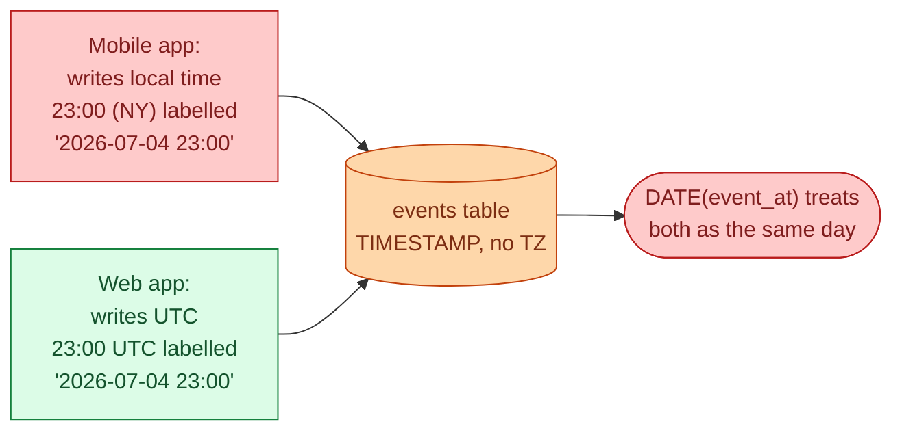
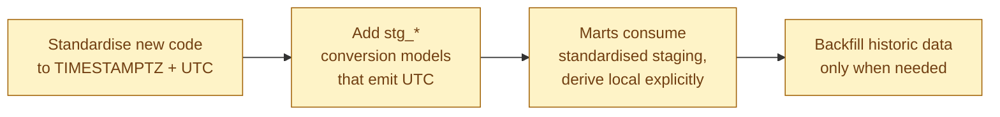



**Scenario:**
A marketing analyst messages: "Our July 4th campaign report does not match what Meta is reporting. We're under by about 6%." After two days of digging, you find it. The `events` table stores `event_at` as `TIMESTAMP WITHOUT TIME ZONE`. The mobile app was sending local device time. The web app was sending UTC. Group-by-day was using `DATE(event_at)`, which silently interpreted local-time and UTC values the same way. For users in the US, "23:00 July 4 local" became "03:00 July 5 UTC," and the event slipped into the next day's bucket. Across the warehouse, "what happened on day X" is off by some fraction wherever the timezone story is unclear.

In the interview, the question is:

> How would you fix timezones across the warehouse, and what does a clean default look like so this does not happen again?

---

### Your Task:

1. Explain why this break is silent and slow to notice.
2. Walk through auditing what is currently stored where.
3. Define the clean default: UTC in storage, local for display, and the daylight-saving trap.
4. Cover the migration: fixing existing tables without breaking historical reports.

---

### What a Good Answer Covers:

* `TIMESTAMP` vs `TIMESTAMPTZ` and why one is a footgun.
* Storing UTC, deriving local at query time with explicit user timezone.
* Why daylight saving makes "local date" group-bys unreliable.
* Adding `_at_utc` and `_at_local` columns explicitly for clarity.
* The data contract: every new event field documents its timezone.


<div class="pr-solution-divider"></div>


## Solution 100: Timezones Silently Wrong Across the Warehouse

### So, what just happened?

Marketing reports July 4th campaign performance. The number is 6% lower than Meta's number for the same campaign on the same day. After two days, you find the cause.

The `events` table stores `event_at` as `TIMESTAMP WITHOUT TIME ZONE`. The web app writes UTC. The mobile app writes the user's local device time. The warehouse does not know the difference. They look identical in storage:

```
event_at              | source
2026-07-04 23:00:00   | mobile_app  ← actually 23:00 New York = 03:00 July 5 UTC
2026-07-04 23:00:00   | web         ← actually 23:00 UTC
```

The dashboard does `DATE(event_at)`. It puts both rows on July 4. But the mobile event really happened on July 5 (UTC) or, depending on what you mean by "the day," might belong on either side.



This is the quietest possible break. Nothing fails. Every query returns a number. The number is just wrong by 1 to 24 hours' worth of events at every day boundary.

### Why it is so slow to notice

Three reasons.

The numbers look reasonable. You are off by a few percent, not by 10x. Nobody flags it until someone compares to an external source like Meta.

The break is at boundaries only. Most of the day's data is correct. Just the events near midnight slip into the wrong bucket. So the discrepancy is small, persistent, and hard to attribute.

There is no error to trace. Every query parses, every join works, every dashboard renders. The error is in the meaning of the numbers, not in the running of the code.

This is why timezone bugs survive for years. They are real but quiet.

### Step 1, audit what you actually have

Before fixing anything, find out where the problem lives. One query gets you the shape of it:

```sql
SELECT
  table_name,
  column_name,
  data_type
FROM information_schema.columns
WHERE data_type LIKE 'TIMESTAMP%'
ORDER BY table_name, column_name;
```

You will find three categories.

**`TIMESTAMP WITH TIME ZONE` (TIMESTAMPTZ).** Fine. The timezone is part of the value. UTC is stored, conversions are explicit.

**`TIMESTAMP WITHOUT TIME ZONE` (plain TIMESTAMP).** Suspect. The value is a wall clock with no timezone attached. You have to know, from outside the data, what timezone it is in.

**`DATE` or `STRING` storing date-like things.** Even more suspect. Same problem, less obvious.

Most warehouses have a default that is one of the first two. Snowflake's default is `TIMESTAMP_NTZ` (no zone). BigQuery's `TIMESTAMP` is actually UTC under the hood. Redshift's is no-zone. Defaults bite, so check yours.

### Step 2, define the clean rule

The senior default everyone converges on:

> **Storage is always UTC. Display is computed at the boundary, with the user's timezone supplied explicitly.**

Two implications.

Every timestamp column in the warehouse is in UTC. The type is `TIMESTAMPTZ` (or whatever your warehouse calls "timestamp with timezone"). The name carries it: `event_at`, `created_at`. No ambiguity about what they hold.

When a report needs "local time" (a marketing report by US local day, say), the conversion happens in the query, with an explicit timezone:

```sql
SELECT
  DATE(event_at AT TIME ZONE 'America/New_York') AS event_date_ny,
  COUNT(*) AS events
FROM stg_events
WHERE event_at >= '2026-07-04' AND event_at < '2026-07-06'
GROUP BY event_date_ny;
```

Two `_at` columns sometimes makes life easier:

```
event_at_utc        ← stored, source of truth
event_at_local      ← derived in the mart, includes the timezone in the column name
```

Naming `event_at_local` makes it obvious that the column is timezone-dependent. The next analyst does not assume.

### Step 3, the daylight saving trap

There is a subtle gotcha that catches even experienced engineers.

`DATE(event_at AT TIME ZONE 'America/New_York')` gives you the local date. Group by it and you get "events per local day." Sounds fine.

Until daylight saving switches. On the spring forward day, the local day is 23 hours long. On the fall back day, it is 25 hours. Your SLO of "process within 24 hours of local midnight" is unreliable around those dates. Your year-over-year same-day comparison is unreliable for a week around each switch.

The pragma is:

- For **operational SLAs and pipelines**, use UTC days. They are always 24 hours. Schedules behave predictably.
- For **reporting to humans who think in local time**, use local days, but flag the DST weekend in your model so reports can show the boundary differently.

This is one of those "small detail with big consequence" things that distinguishes a senior answer in an interview.

### Step 4, the migration

You have 30 tables with `TIMESTAMP` columns and unclear meanings. You cannot fix all of them tomorrow.



**Stop the bleeding.** Every new event source ships with `TIMESTAMPTZ` UTC. Document this in the data contract for new schemas. Old sources stay as they are for now.

**Fix in the staging layer.** As you build staging models (problem 99), the staging model is where you convert. If the source is plain `TIMESTAMP` storing UTC, cast to `TIMESTAMPTZ` at the source's known zone. If the source is mixed (mobile vs web in the scenario), you may need separate staging models per source and a UNION that normalises.

```sql
-- models/staging/stg_events.sql
SELECT
  event_id,
  user_id,
  CASE source
    WHEN 'web'    THEN event_at AT TIME ZONE 'UTC'
    WHEN 'mobile' THEN event_at AT TIME ZONE user_timezone
  END AS event_at_utc,
  source
FROM {{ source('raw', 'events') }}
```

For mobile, you need `user_timezone` to be carried alongside the event. If it is not, this is the bug that has to get fixed upstream first.

**Marts consume UTC, derive local.** Once staging is clean, no mart deals with raw `TIMESTAMP`. They join to staging and convert at the query.

**Backfill only when it matters.** Most historical data is fine being slightly wrong. Backfill only the slices that have downstream consequences (financial reports, audited numbers). For the rest, label the period "pre-timezone-fix" and move on.

### Tomorrow morning, walked through

A new product team starts shipping events. With the new defaults:

1. Their event schema includes `event_at TIMESTAMPTZ` (UTC) and `user_timezone TEXT`.
2. Their staging model is one passthrough plus the `_local` derived column.
3. The marketing dashboard joins to staging. Filter is `event_at_utc BETWEEN ...`. Group-by is `DATE(event_at_local AT TIME ZONE 'America/New_York')`.
4. The Meta comparison matches to the tenth of a percent.

The team never knew there used to be a timezone issue. That is the goal.

### Things people get wrong

- **Using `TIMESTAMP` without TZ as the default.** Saves seven characters per column at the cost of every future analyst's sanity.
- **Storing local time.** Then the database has to know per-row what timezone each value is in. Painful.
- **Grouping by local date for SLO calculations.** The DST weekend breaks them.
- **No `user_timezone` on events.** You cannot reconstruct the user's local time without it.
- **Skipping the audit.** "We use UTC everywhere" is rarely actually true.

### Take-home

> Store everything in UTC as TIMESTAMPTZ. Convert to local time explicitly at the query, with the timezone named in code. Use UTC days for operations, local days for human reports, and remember that DST breaks the symmetry. Audit existing columns before assuming.

