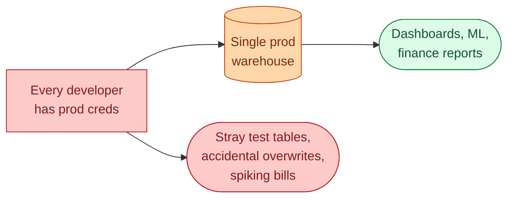
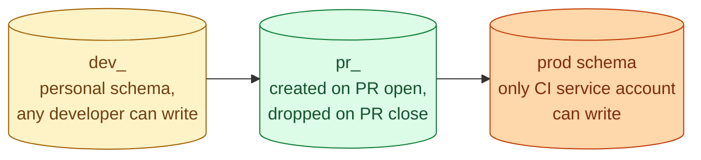



**Scenario:**
The team you joined has one dbt project. It targets production. To test a change, you either run it in prod and hope, or run it locally with prod credentials and write to a temp table. Last week a teammate accidentally wrote a 50M-row CTAS to `analytics.fct_orders_test` and forgot to drop it. Storage cost spiked 12%. Another teammate's "quick test" overwrote `fct_revenue` for two hours before someone caught it. The CTO asks you to set up "a proper dev environment" by end of next week.

In the interview, the question is:

> Walk me through how you separate dev, CI, and prod for a dbt project, what the boundaries are, and how you prevent the "I tested in prod" mistake from happening again.

---

### Your Task:

1. Explain why "we share prod" is unsafe and how the team got there.
2. Define dev, CI, and prod as three distinct environments with three distinct rules.
3. Walk through the dbt targets and schema patterns that make it work.
4. Cover the cleanup and permission changes that keep dev cheap and prod safe.

---

### What a Good Answer Covers:

* `target: dev` writes to a personal schema named after the developer.
* `target: ci` writes to a `pr_NNN` schema, dropped after merge.
* `target: prod` is locked: only the CI service account can write.
* Production credentials never leave CI.
* A nightly job drops dev and CI schemas older than N days.


<div class="pr-solution-divider"></div>


## Solution 101: No Dev Environment, Everyone Tests in Prod

### So, what just happened?

The team has one dbt project. One target. It writes to `analytics` in production. Every developer has prod credentials. The unspoken rule is "be careful."

Last week somebody was not careful enough. A `CREATE TABLE AS SELECT` for a test got committed to a temp table in prod. 50M rows. Nobody dropped it. The storage bill ticked up 12%. The week before that, someone's local "quick test" overwrote `fct_revenue` for two hours because the same model name was already in use.

Both incidents happened because the team has the right people doing the wrong thing. The fix is not "tell people to be more careful." The fix is to make the unsafe thing impossible.



### Three environments, three jobs

The senior model is three environments, with three different rules.

**Dev.** Where developers iterate. Cheap. Disposable. Writes to a personal schema. Reads from prod sources is fine, but writes can only land in `dev_yourname`.

**CI.** Where a PR is validated automatically. The CI runs dbt against a temporary schema (e.g., `pr_123`). Reviewers can query the actual built tables. After merge, the schema gets dropped.

**Prod.** Where the business reads from. Locked. Only the CI service account on the main branch can write. No human credentials exist that can `CREATE OR REPLACE` a prod table.



The boundary between dev and prod is the credential. Developers do not have prod write access. Period. CI does, but only when it runs against the main branch.

### What this looks like in dbt

A `profiles.yml` with three targets, all pointed at the same warehouse but at different schemas with different permissions:

```yaml
my_project:
  target: dev
  outputs:
    dev:
      type: snowflake
      schema: "dev_{{ env_var('USER') }}"
      threads: 4
      # uses developer creds, can only write to dev_*

    ci:
      type: snowflake
      schema: "pr_{{ env_var('PR_NUMBER') }}"
      threads: 8
      # uses CI service account, can only write to pr_*

    prod:
      type: snowflake
      schema: analytics
      threads: 16
      # uses prod service account, only available in main-branch CI
```

The schema name comes from an environment variable. In dev, the schema is `dev_amirul` for Amirul, `dev_priya` for Priya. In CI, the schema is `pr_142` for PR 142. In prod, it is `analytics`.

The runtime config keeps people in their lane without requiring discipline.

### The permissions that make it real

Code conventions are not enough. The warehouse has to enforce them.

In Snowflake or BigQuery, create three roles:

```sql
-- developers: can write to anything starting with dev_*
GRANT USAGE ON DATABASE warehouse TO ROLE developer;
GRANT CREATE SCHEMA ON DATABASE warehouse TO ROLE developer;
GRANT USAGE, SELECT ON ALL SCHEMAS IN DATABASE warehouse TO ROLE developer;
-- (read prod, write only to dev_* via a future grant trigger or naming hook)

-- ci_service: can write to pr_* schemas
-- prod_service: can write to analytics, marts, etc. Only used in main-branch CI.
```

Then the trick: the developer role cannot create schemas that do not start with `dev_<their name>`. This is enforced with a future-grants policy or a creation hook. The CI role cannot write to anything but `pr_*`. The prod role's credentials are encrypted in CI secrets and never exposed to a developer terminal.

Now even if a developer does `CREATE TABLE analytics.test`, the warehouse rejects it with a permission error. The mistake becomes impossible, not just discouraged.

### Schema-per-PR makes review real

The CI target is the trick that makes code review actually useful. When a PR opens, the CI pipeline runs:

```bash
export PR_NUMBER=142
dbt build --target ci
```

It creates `pr_142` schema, builds every changed model into it, and runs the tests. A reviewer opens the PR and can query:

```sql
SELECT * FROM pr_142.fct_revenue_daily LIMIT 100;
SELECT SUM(revenue_usd) FROM pr_142.fct_revenue_daily WHERE event_date = '2026-06-01';
```

They are looking at the actual output the PR produces, not staring at SQL diffs trying to predict what will happen. Review changes from "does the code look right" to "does the data look right."

After the PR is merged or closed, a CI cleanup step drops `pr_142`. The schema lives for the lifetime of the PR.

### Cleanup, because dev rots

Dev schemas accumulate. Three months in, the warehouse has `dev_amirul` from someone who left the company, `dev_priya_test_v2_FINAL_for_real`, and 40 abandoned PR schemas because cleanup hooks failed silently.

The nightly job:

```sql
-- pseudocode for the cleanup job
FOR schema IN SELECT name FROM information_schema.schemata
              WHERE name LIKE 'dev_%' OR name LIKE 'pr_%'
LOOP
  IF last_modified(schema) < CURRENT_DATE - 30 THEN
    DROP SCHEMA schema CASCADE;
  END IF;
END LOOP;
```

30 days for dev schemas is a kind default. 7 days for PR schemas after the PR closes. Tune to fit your team.

The point: cleanup is automatic, not "please remember to drop your test tables."

### A common middle-ground that does not work

Some teams skip CI and call dev "shared." Everyone writes to a single `dev` schema. Coordination by Slack: "I'm using dev_fct_orders for a bit, don't touch."

Do not do this. The same coordination problem that put you in prod just moves to dev. Two developers will collide weekly. Everyone's models will get accidentally overwritten. The team will not trust the dev environment, so people drift back to prod.

Personal schemas, with each developer's name in the schema name, is the rule that scales.

### Tomorrow morning, walked through

Wednesday rolls around. You ship the new setup. By Friday:

- Amirul makes a change locally. `dbt build` writes to `dev_amirul`. Iterates in 30 seconds, no risk of touching prod.
- Priya opens a PR. CI runs and writes to `pr_157`. Reviewer queries the schema, confirms the numbers look right, approves.
- The PR merges to main. CI runs against `target: prod` with the prod service account. Production models update.
- The CI job for the closed PR drops `pr_157`.

Three weeks later, the CTO asks about the storage spike from last month. The answer: "It has not happened again. Developers cannot write to prod anymore."

### Things people get wrong

- **Sharing prod credentials with developers.** The root cause of every story in the scenario.
- **One shared dev schema.** Same collision problem as prod, in a different room.
- **No cleanup job.** Schemas accumulate, storage costs rise, people stop trusting the dev environment.
- **CI runs dbt against prod for "validation."** This is just running in prod with extra steps. CI runs against `pr_NNN`.
- **No permission enforcement.** Conventions without warehouse-level grants are wishful thinking.

### Take-home

> Three environments, three rules: dev is personal and cheap, CI is per-PR and disposable, prod is locked and writable only by CI on main. The warehouse enforces the boundary with grants, not Slack messages. Cleanup runs nightly so dev stays cheap.

