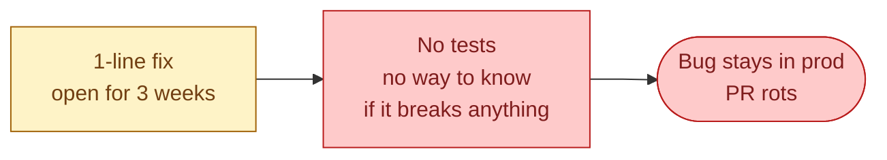
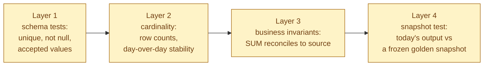
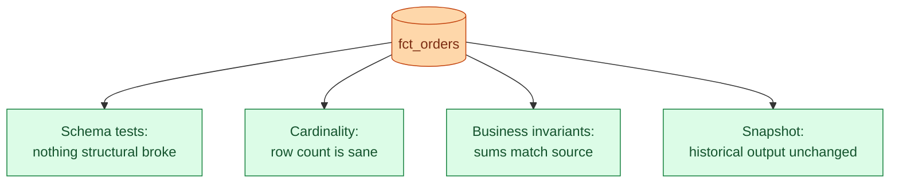



**Scenario:**
`fct_orders` is the most queried model in the warehouse. 200+ dashboards read from it. 12 dbt models reference it. It has zero tests. The SQL is 600 lines with three nested CTEs and four `CASE WHEN` statements. There is a known bug: refunds are sometimes double-counted in the southeast region. The fix is one line. The PR has been open for three weeks because nobody dares merge it. "What if it breaks something?" is the comment on every review. The lead asks you to make `fct_orders` safe to change.

In the interview, the question is:

> Walk me through how you make a critical, untested, much-depended-on model safe to change. What tests do you add, in what order, and why does this matter before the refactor?

---

### Your Task:

1. Explain why the team is paralysed and what to do about it.
2. Walk through the four layers of tests you add, in order, before changing any logic.
3. Cover characterization tests: how to lock down the model's current behaviour.
4. Explain how to then ship the one-line bug fix with confidence.

---

### What a Good Answer Covers:

* The PR is stuck because there is no safety net.
* Layer 1: schema tests (unique, not null, accepted_values).
* Layer 2: row-count and cardinality invariants.
* Layer 3: business invariants (sum reconciles to source).
* Layer 4: snapshot test (today's output vs frozen snapshot).
* The "tests first, then refactor" rule for legacy code.


<div class="pr-solution-divider"></div>


## Solution 102: Critical Model, No Tests, Nobody Dares Touch It

### So, what just happened?

`fct_orders` is at the centre of the warehouse. 200+ dashboards depend on it. 12 downstream dbt models reference it. It has no tests.

There is a real bug: in the southeast region, refunds get double-counted. The fix is one line. The PR sits open for three weeks. Every reviewer writes the same thing: "Looks right, but what if it breaks something?"

Nobody is being cowardly. The reviewers are right. With no tests, a one-line change to a 600-line model could break any of 200 dashboards in any of 50 ways. No human reads enough of those 200 dashboards to know.



The fix is not to "review harder." The fix is to add the missing safety net so that the next change to `fct_orders` is reviewable in 10 minutes.

### The rule: tests before refactor

The senior move on a load-bearing legacy model is counter-intuitive. You do not start by fixing the bug. You start by adding tests that describe what the model already does, bug and all.

This is called characterization testing. The test does not say "the model should be right." It says "the model currently behaves this way, and if it stops behaving that way, alert me." Now any change becomes visible. The reviewer sees which tests pass and which fail. The reviewer's job stops being "imagine all the things this might break" and becomes "look at which tests broke."

Once the tests are in place, the one-line fix is straightforward. You change the line. The test that pinned the broken behaviour fails. You update that test. Every other test still passes. Ship.

### Step 1, the four-layer test stack

Add tests in this order. Each layer is cheap. Each catches different failure modes.



### Layer 1, schema tests

The cheapest. dbt's built-in `unique` and `not_null` on the columns you depend on.

```yaml
models:
  - name: fct_orders
    columns:
      - name: order_id
        tests:
          - unique
          - not_null
      - name: customer_id
        tests:
          - not_null
      - name: order_date
        tests:
          - not_null
      - name: status
        tests:
          - accepted_values:
              values: ['placed', 'shipped', 'delivered', 'cancelled', 'refunded']
```

What this catches: primary key duplicates (problem 95), upstream feeds that start dropping required fields, status values that drift (a new "partially_refunded" status that no downstream code handles).

Add these first. Three minutes of work. The model passes immediately if it is well-formed. If it does not pass, you have just found the first bug to fix before touching the refactor.

### Layer 2, cardinality

The next layer asks: did the model produce roughly the right number of rows today?

```sql
-- tests/fct_orders_daily_row_count_stable.sql
WITH counts AS (
  SELECT
    DATE(order_date) AS d,
    COUNT(*) AS n
  FROM {{ ref('fct_orders') }}
  WHERE order_date >= CURRENT_DATE - 30
  GROUP BY 1
),
stats AS (
  SELECT AVG(n) AS mean, STDDEV(n) AS sd
  FROM counts WHERE d < CURRENT_DATE
)
SELECT *
FROM counts, stats
WHERE counts.d = CURRENT_DATE
  AND ABS(counts.n - stats.mean) > 3 * stats.sd;
```

Returns rows when today's row count is more than 3 standard deviations from the 30-day mean. Tied to problem 84's volume check.

What this catches: a code change that accidentally doubles output (a missing `DISTINCT`, a join that exploded), or accidentally halves output (a `WHERE` clause that filters too much).

### Layer 3, business invariants

This is the tier most teams skip. It is the most valuable.

A business invariant is a true statement about the data that should hold regardless of model internals.

For `fct_orders`, examples:

```sql
-- tests/fct_orders_total_matches_source.sql
SELECT 1
FROM (
  SELECT SUM(amount) AS fact_total FROM {{ ref('fct_orders') }}
  WHERE order_date = CURRENT_DATE - 1
) f,
(
  SELECT SUM(amount) AS src_total FROM {{ source('raw', 'orders') }}
  WHERE order_date = CURRENT_DATE - 1
    AND status != 'cancelled'
) s
WHERE ABS(f.fact_total - s.src_total) > 1.00;
```

This says "the sum of amounts in `fct_orders` for yesterday equals the sum in the source for yesterday, give or take a dollar." If the model accidentally drops refunds, or adds them when it should not, this test catches it.

For the southeast double-count bug specifically:

```sql
-- tests/fct_orders_refund_invariant_southeast.sql
SELECT 1
FROM (
  SELECT SUM(refund_amount) AS refunds FROM {{ ref('fct_orders') }}
  WHERE region = 'southeast' AND order_date = CURRENT_DATE - 1
) f,
(
  SELECT SUM(refund_amount) AS src_refunds FROM {{ source('raw', 'refunds') }}
  WHERE region = 'southeast' AND refund_date = CURRENT_DATE - 1
) s
WHERE f.refunds <> s.src_refunds;
```

Run this test today. It fails, because the bug is real. Now you know exactly what the bug looks like in the data. You add the fix. The test passes. Ship.

### Layer 4, snapshot test

The strongest characterization test. Freeze the current output, then assert that the next build matches.

```sql
-- snapshot the output today
CREATE TABLE governance.fct_orders_snapshot_2026_06_03 AS
SELECT * FROM {{ ref('fct_orders') }}
WHERE order_date BETWEEN '2026-05-01' AND '2026-05-31';
```

Add a test that compares the rebuilt model to the snapshot:

```yaml
tests:
  - dbt_utils.equality:
      compare_model: ref('fct_orders_snapshot_2026_06_03')
      compare_columns: [order_id, amount, status]
```

Now every build compares its output for May 2026 to the May 2026 snapshot. Any change to the model that alters the output for that historical period fails the test.

When you ship the refund fix, this test will fail on the southeast rows. That is expected. You update the snapshot to reflect the corrected output, ship the fix, and the test now pins the new correct behaviour.

This is the test that turns "I am scared to change this model" into "I can see exactly which rows my change affects."

### Step 2, ship the bug fix

With Layer 1 through 4 in place, the refund fix becomes routine.

1. Run the test suite. All four layers pass except the refund invariant on the southeast region (Layer 3). That is the bug, made visible.
2. Make the one-line fix.
3. Run the test suite again. Refund invariant now passes. Snapshot test fails on the affected rows.
4. Update the snapshot to reflect the corrected numbers.
5. PR includes the fix and the snapshot update. Reviewer sees: code change is one line. Tests that changed: refund invariant (now passes), snapshot (updated by N rows).
6. Reviewer can read the N rows. They look right. Ship.

The PR that was open for three weeks merges in 30 minutes.

### What the four layers do, together



Schema catches structure changes. Cardinality catches scale changes. Business invariants catch correctness drift. Snapshot catches "anything I did not predict." Together they are the safety net.

You do not need every test on day one. Layers 1 and 2 give you 80% of the value in an hour. Layer 3 takes a day for the first model, faster for the next ones. Layer 4 takes an hour and is the one most teams forget.

### Tomorrow morning, walked through

You ship the test stack on Tuesday. By Wednesday morning:

- The refund fix PR merges with five eyes on it, not zero. Reviewers feel they can defend the merge.
- The southeast refund bug is gone.
- Two unrelated PRs that have been sitting in draft because "fct_orders is scary" get opened.

By the end of the quarter, three more bugs in `fct_orders` have been found and fixed. None of them caused a downstream incident, because the tests caught any regression. The model went from radioactive to routine.

### Things people get wrong

- **Refactoring first, adding tests later.** The bug ships hidden inside the refactor. Nobody can tell which change broke what.
- **Adding only `unique` and `not_null`.** Schema tests catch the easy 20% of bugs. The other 80% need business invariants.
- **No snapshot test.** Without it, you cannot tell whether a code change altered the historical output.
- **Treating tests as a one-time project.** Every incident should produce at least one new test. The suite grows where it has been bitten.
- **Tests that always pass.** A test that has not failed in six months may be checking nothing. Audit yearly.

### Take-home

> A critical model with no tests is paralysing. Add four layers of safety in this order: schema, cardinality, business invariants, snapshot. Now the next change is reviewable, the bug fix becomes routine, and the team stops being afraid of the model.

