
## What we are building

A URL shortener takes a long link like:

```
https://example.com/products/electronics/laptops/macbook-pro-16?ref=newsletter&utm_campaign=fall
```

and gives back a short one:

```
https://shrt.ly/Xk2pQz3
```

When anyone visits the short URL, the service redirects their browser to the original. That is the whole product. That is bit.ly.

The problem looks easy. Most candidates draw a database and a service in five minutes and stop. The interesting part is what comes after.

There are four real problems hiding in this product:

1. **Where do short codes come from?** Two servers must never pick the same one.
2. **How does a redirect stay fast?** 100ms feels slow. The target is under 50ms anywhere on Earth.
3. **What happens when one link goes viral?** 100,000 requests per second to one row will melt a database.
4. **What happens when a link is malicious?** It is cached on six continents and we have one minute to kill it.

We will start with the simplest version that works. Then we add one piece at a time as each problem appears.

---

## The lifecycle of one short link

Every short link goes through a small set of states. Picture it before drawing any boxes.

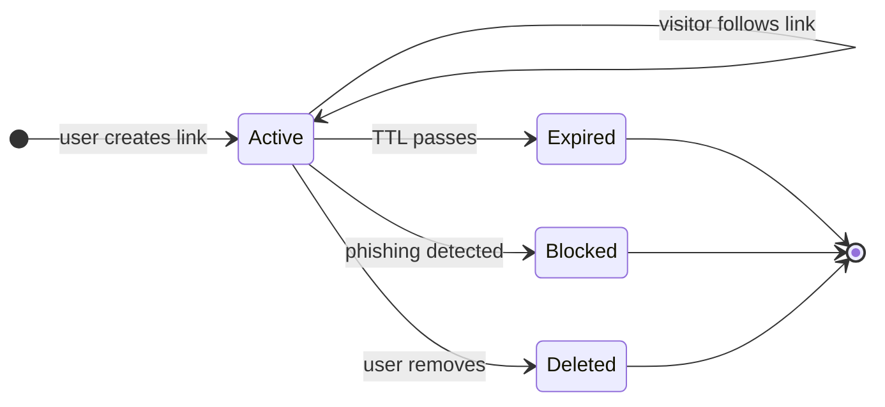

A link spends almost all its life in `Active`, getting clicked. Everything else (caches, sharding, analytics) exists to make that "click" path fast and to handle the transitions out of `Active` cleanly.

> **Take this with you.** A URL shortener is a key-value store with a tiny lifecycle. Short code is the key. Long URL is the value. Status (active, expired, blocked) is what makes it a real service instead of a hash map.

---

## How big this gets

A bit.ly-shaped product gives us these numbers to work with.

| Input | Number |
|-------|--------|
| New short URLs created | 100 million per month |
| Read-to-write ratio | 10 to 1 |
| Average long URL length | ~100 bytes |
| Storage retention | 5 years |
| Redirect latency target (P99, global) | < 100ms |

From these we can derive everything else.

<details markdown="1">
<summary><b>Show: the derived numbers</b></summary>

| Metric | Value | How |
|--------|-------|-----|
| Writes per second, steady | ~38 | 100M / (30 × 86,400) |
| Writes per second, peak | ~150 | 3-5x steady |
| Reads per second, steady | ~380 | 10x writes |
| Reads per second, peak | ~1,500 | 10x peak writes |
| Total links after 5 years | 6 billion | 100M × 12 × 5 |
| Total storage | ~900 GB | 6B × 150 bytes/row |
| Hot working set (Zipf 80/20) | ~150 MB | top 1M URLs × 150 bytes |

Three observations:

1. **The throughput is tiny.** A single Postgres can do 38 writes per second without breaking a sweat. We do not shard for capacity. We shard later for failure isolation and regional latency.
2. **The hot set fits in one Redis box.** 150 MB is nothing. ~80% of traffic hits that cache. The database is almost a backstop.
3. **A redirect has no body.** It is just an HTTP 302 with a `Location` header. Bandwidth costs are negligible compared to a normal web request.

</details>

> **Take this with you.** Reads beat writes 10 to 1, and the working set is tiny. The read path is where the design effort goes.

---

## The smallest version that works

Before optimizing anything, draw the simplest service that does the job.

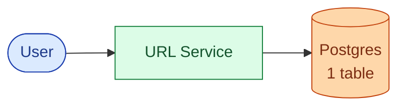

Two endpoints carry the entire product.

| Endpoint | What it does |
|----------|--------------|
| `POST /links` | Accept a long URL, return a short code |
| `GET /:code` | Look up the code, redirect with `302 Location: <long_url>` |

<details markdown="1">
<summary><b>Show: the one table</b></summary>

```sql
CREATE TABLE short_links (
    shortcode    VARCHAR(16) PRIMARY KEY,
    long_url     TEXT NOT NULL,
    creator_id   BIGINT,
    created_at   TIMESTAMPTZ NOT NULL DEFAULT NOW(),
    expires_at   TIMESTAMPTZ,
    status       SMALLINT NOT NULL DEFAULT 1
);
```

Six columns. `shortcode` is the primary key (and the lookup key) so the redirect skips an index hop. `long_url` is `TEXT` because real URLs can exceed 2,048 characters. `status` is a small integer instead of an enum so adding `4 = quarantined` later does not need a migration.

</details>

This is enough for a hundred users on a Tuesday. The interesting question is what breaks first as the system grows. Three things will: how we mint codes, how we serve reads, and how we handle abuse. We address each in turn.

---

## Decision 1: where do short codes come from?

A short code has four requirements:

1. **Unique.** Two creates must never produce the same code.
2. **Short.** Seven base62 characters give us 62⁷ = 3.5 trillion possible codes. Enough.
3. **Unguessable.** If codes are sequential, a scraper iterates through them and harvests every link.
4. **Cheap.** Generating one cannot require a slow database lookup on every write.

There are three real options. Each has a problem.

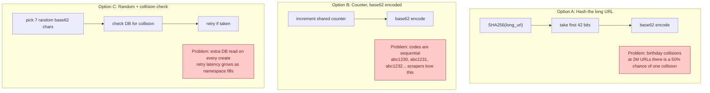

The fix is to combine the best parts of B and C: **counter with ranges, then XOR-scrambled.**

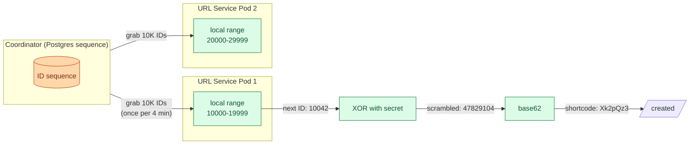

What the three tricks buy:

| Trick | What it solves |
|-------|----------------|
| Range allocation | One coordinator call per 10,000 writes per pod (not one per write). At 38 writes per second per pod, that is one call every 4 minutes. |
| Counter (not hash) | Zero collisions. Ever. No retry loop. |
| XOR scramble | Same uniqueness as the counter, but consecutive counters give scattered codes. `10042` becomes `Xk2pQz3`, `10043` becomes `Y8fM9aQ`. Scrapers cannot guess the next code. |

> **Take this with you.** Counter with ranges, XOR-scrambled, base62 encoded. Zero collisions, no per-write coordination, unguessable codes. The trap to avoid: never run the coordinator on plain Redis because its failover can hand the same range out twice.

---

## Decision 2: how do we serve reads fast?

Every redirect is one lookup: `shortcode → long_url, status`. With 1,500 reads per second and a 150 MB hot set, a single Postgres can technically handle it. But Postgres is not fast enough for the latency target (under 50ms cross-region), and a viral link will overwhelm one row.

The answer is layers. Each layer catches the easy cases. The next layer handles what slips through.

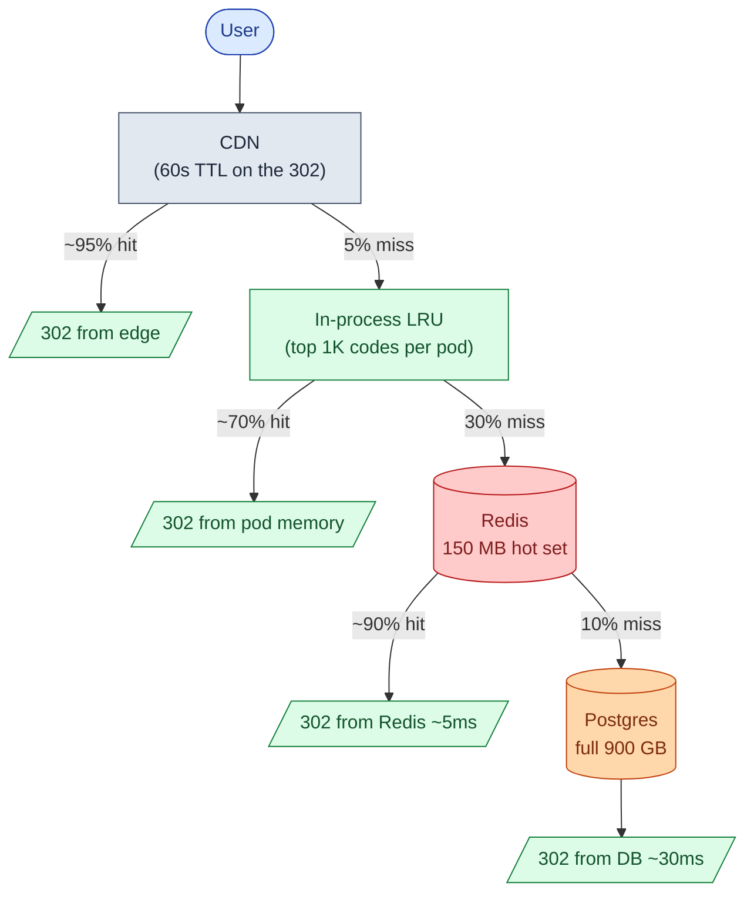

If we multiply the hit rates: of every 1,000 redirects, roughly 950 are served by the CDN, 35 by in-process cache, 13 by Redis, and 2 reach Postgres. The database handles the cold tail and nothing else.

A few rules make this hierarchy correct:

- **Use 302, not 301.** A 301 tells the browser to cache the redirect forever locally. If we ever need to revoke the link, the user's browser ignores us and goes straight to the (now bad) target. With 302 every click goes through us, so we keep control.
- **Jitter the TTLs.** If every Redis entry expires at exactly 1 hour, the top 1% of keys all expire in the same second and the database sees a stampede. Add ±10% random jitter on every TTL.
- **Coalesce on miss.** When a popular entry expires, 10,000 concurrent requests all try to refresh it. Only the first should hit the database. The rest wait on a per-key lock and read the populated value. This turns 10,000 DB reads into one.

> **Take this with you.** Layered cache, jittered TTLs, request coalescing. The CDN does the most work for the lowest cost. Postgres is the backstop, not the front line.

---

## Decision 3: how do we kill a bad link fast?

A safe-browsing worker flags `shrt.ly/Xk2pQz3` as phishing. We flip `status = blocked` in Postgres. But the link is still being redirected for up to 60 seconds from the CDN, every pod's in-process cache, and every Redis replica. That is 60 seconds of users sent to a phishing page.

Invalidation has to fan out across all three caching layers.

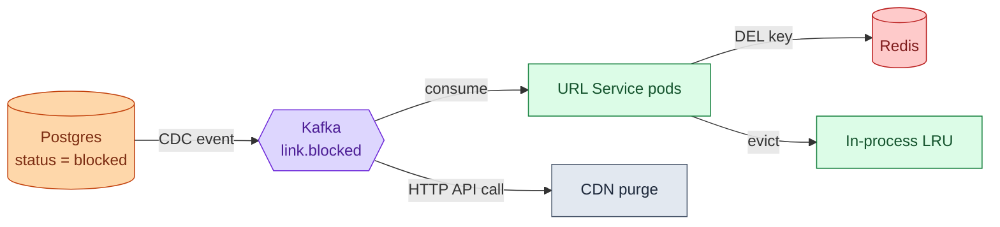

A few seconds after the status flip, every layer has dropped the old value. The next visitor gets `451 Unavailable For Legal Reasons` from the service.

> **Take this with you.** Cache invalidation is not a single delete. It is three: evict from in-process, evict from Redis, purge from CDN. Kafka carries the event so each layer can react independently.

---

## The full architecture

Putting the three decisions together gives us the system.

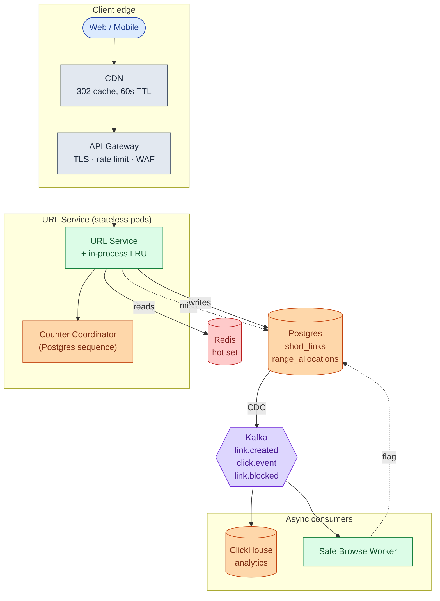

Each component, in one sentence:

| Component | Purpose |
|-----------|---------|
| CDN | Caches the 302 at the edge. Handles ~95% of viral traffic without reaching origin. |
| API Gateway | TLS termination, per-IP rate limits, bot blocking. |
| URL Service | Stateless. Mints codes, resolves redirects, owns the in-process LRU. |
| Counter Coordinator | Hands out ranges of 10,000 IDs. Called once per 4 minutes per pod. |
| Redis | Hot working set (~150 MB). Catches ~90% of what the CDN missed. |
| Postgres | Source of truth. Two tables: `short_links` and the range allocation ledger. |
| Kafka | Carries events out. Click events, link.created, link.blocked. |
| ClickHouse | Click counts and time-series analytics, downstream of Kafka. |
| Safe Browse Worker | Calls Google Safe Browsing asynchronously. Flags bad links after creation. |

Notice what is not on the synchronous path: analytics, phishing checks, and notifications. If ClickHouse goes down at 3 a.m., redirects still work. Click counts just lag.

---

## Walk: a redirect, end to end

Bob visits `shrt.ly/Xk2pQz3`. Here is what happens.

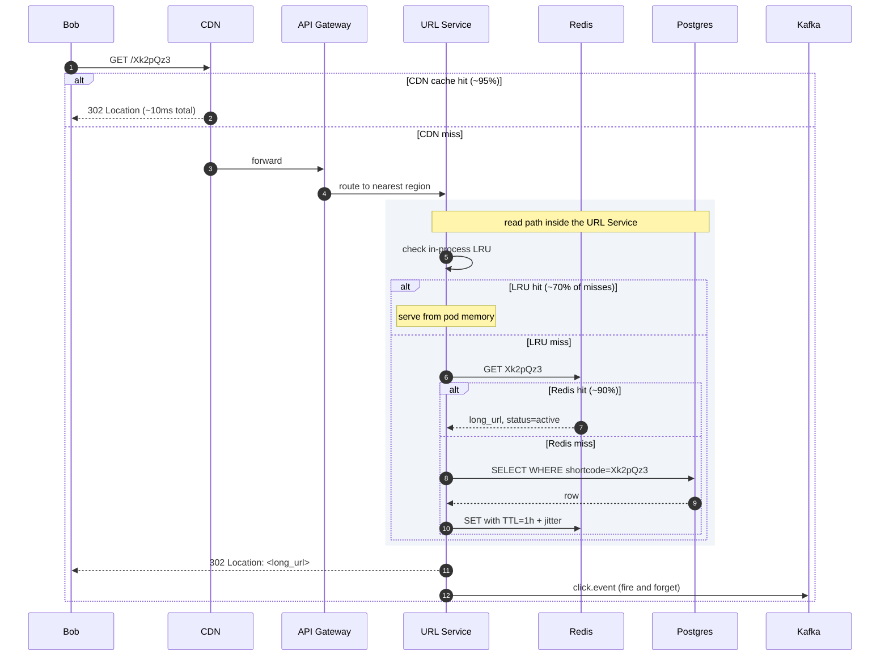

What to notice:

1. The CDN handles most of the work before the request reaches origin. A warm CDN cache costs almost nothing.
2. The 302 is returned **before** the click event is published. Analytics never adds latency to the redirect.
3. The URL Service is stateless. Restart any pod at any time. State lives in Postgres and Redis.

---

## Walk: a create, end to end

Alice posts a new long URL.

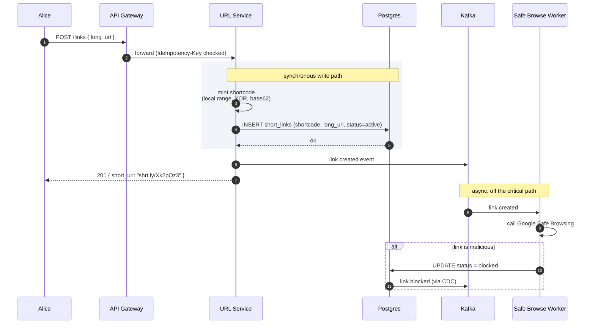

The create returns in ~50ms because nothing slow is on the path: no Safe Browsing call, no analytics write, no cache warming. Those all happen after the response goes out.

---

## The hot key problem

One link goes viral. A single shortcode is now taking 100,000 requests per second. Other links are fine, but the Redis shard that owns this one key is at 100% CPU and every key on that shard is suffering.

We have already designed for this. The defenses, cheapest first:

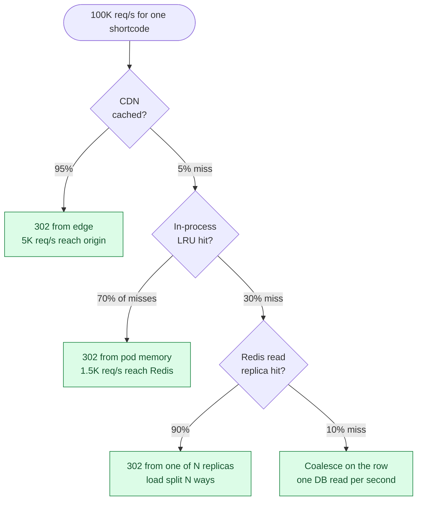

For predictable virality (marketing announces something at noon), warm every region's cache at 11:55 by pre-populating the entry. The storm hits a warm cache, not a cold one.

> **Take this with you.** Viral traffic is solved by layered caching, not by scaling Postgres. The CDN does most of the work. The rest is in-process LRU, Redis replicas, and request coalescing.

---

## Follow-up questions

Try answering each in 2 or 3 sentences before opening the solution.

1. **Two users submit the same long URL within milliseconds.** Same shortcode or different ones? What if both are anonymous? What if both are logged in as the same user?

2. **Custom aliases.** User A reserves `summer-sale` at the same moment as user B. How do you make sure only one of them gets it, atomically, without a slow lock?

3. **A single shortcode goes viral and takes 100K req/s.** What is your layered defense? What is the cheapest layer and what does it buy you?

4. **Phishing detection.** Google Safe Browsing takes 200 to 500ms per check. You cannot block the create endpoint on that. What is the trade-off you accept, and how do you handle URLs that turn malicious after creation?

5. **Click counts.** Every redirect needs to bump a counter. You have 1,500 redirects per second. Why does `UPDATE short_links SET clicks = clicks + 1` not work? What do you do instead?

6. **Custom domains.** Acme Corp wants `shrt.acme.com/abc1234` instead of `shrt.ly/abc1234`. What changes in routing, TLS, and the data model?

7. **Expiration with retention.** Links expire after 1 year. Do you delete the row, mark it expired, or just let the cache TTL win? What about historical analytics?

8. **Thundering herd on cache miss.** A popular URL's cache entry just expired. 10K requests arrive in the next 100ms. Walk through what happens without protection. Then walk through the fix.

9. **GDPR delete.** A user wants every short URL they created deleted. You have 64 sharded databases. How do you find and delete everything? What about their click history?

10. **3 a.m. page: the counter coordinator handed the same range to two instances.** What is the blast radius? How do you detect it? How do you recover? How do you prevent it from happening again?

---

## Related problems

- **[Distributed Cache (009)](../009-distributed-cache/question.md).** The caching layer this problem leans on. Understand its eviction and replication before tackling the hot key problem here.
- **[Rate Limiter (004)](../004-rate-limiter/question.md).** The rate limiter on `POST /links` uses the same algorithms (token bucket, sliding window) you would design from scratch in that problem.
- **[Notification System (010)](../010-notification-system/question.md).** The click stream pipeline uses the same fan-out, retry, and durability patterns as a notification system's event delivery.


<div class="pr-solution-divider"></div>


## Solution: URL Shortener

### What this system is

A URL shortener is a lookup table with three hard requirements layered on top: short codes must be uniquely minted across many servers, the redirect must be very fast everywhere on the planet, and a bad link must be killable in under a minute even when copies are cached on six continents.

The architecture is a stateless service in front of a multi-layer cache in front of a sharded database. Reads beat writes 10 to 1. The hot working set is small enough (~150 MB) that a single Redis box serves about 80% of all traffic. The database is mostly a backstop for cold lookups.

The data model fits on a napkin: one main table keyed by shortcode, plus a tiny ledger for ID range allocations. Scale is not the hard part. At bit.ly numbers the system handles ~38 writes per second steady-state. The interesting work is at the edges: surviving a viral link, revoking a phishing URL fast, recovering from a counter coordinator misfire.

---

### 1. The two questions that matter most

If only two clarifying questions are allowed, ask these.

**How much traffic, and what is the latency target?** Without traffic numbers we cannot size anything. Without a latency target we cannot decide whether a CDN is mandatory or optional.

**Custom aliases, yes or no?** Aliases change the write path. With aliases, every create has to atomically check whether the specific string is taken. Without, every create just mints a fresh code from local memory.

Everything else (expiration policy, analytics shape, abuse handling) flows from those two.

---

### 2. The math

| Metric | Value |
|--------|-------|
| Writes per second, steady | ~38 |
| Writes per second, peak | ~150 |
| Reads per second, steady | ~380 |
| Reads per second, peak | ~1,500 |
| Total URLs after 5 years | 6 billion |
| Total storage | ~900 GB |
| Hot working set (top 1M URLs) | ~150 MB |

What this tells us:

- The system is small. A single Postgres handles the writes. Sharding is for failure isolation and latency, not capacity.
- Cache fits in memory. The whole hot set is 150 MB. One Redis node serves about 80% of all traffic.
- A 302 has no body. We serve nothing back. The user goes straight to the target.

---

### 3. The API

Two endpoints carry the entire product.

**Create:**
```
POST /api/v1/links
Idempotency-Key: <uuid>

{
  "long_url": "https://example.com/very/long/path?with=query",
  "custom_alias": "summer-sale",            // optional
  "expires_at": "2027-12-31T00:00:00Z"      // optional
}
```

**Redirect:**
```
GET /:shortcode
HTTP/1.1 302 Found
Location: <long_url>
Cache-Control: private, max-age=0
```

A few small but load-bearing choices:

| Choice | Reason |
|--------|--------|
| 302, not 301 | A 301 tells the browser to cache forever locally. We lose the ability to revoke. |
| `Idempotency-Key` required on create | Mobile drops connections. Without the key, retries mint duplicate codes. |
| `Cache-Control: private` on the redirect | Stops middleboxes from caching. The CDN can still cache because we control it explicitly. |

Status codes worth knowing:

| Code | Meaning |
|------|---------|
| `201` | Link created |
| `302` | Redirect (the common case) |
| `404` | Code does not exist |
| `409` | Custom alias already taken |
| `410` | Link was deleted or expired |
| `451` | Blocked for legal or safety reasons |

---

### 4. The data model

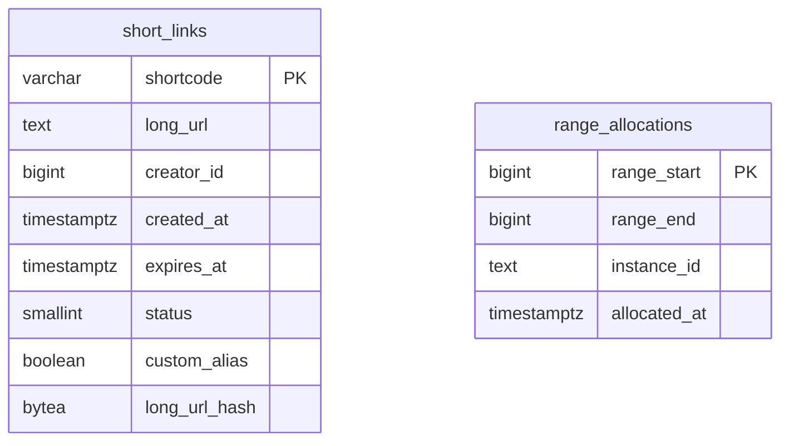

<details markdown="1">
<summary><b>Show: the full SQL</b></summary>

```sql
CREATE TABLE short_links (
    shortcode      VARCHAR(16) PRIMARY KEY,
    long_url       TEXT NOT NULL,
    creator_id     BIGINT,
    created_at     TIMESTAMPTZ NOT NULL DEFAULT NOW(),
    expires_at     TIMESTAMPTZ,
    status         SMALLINT NOT NULL DEFAULT 1,
    custom_alias   BOOLEAN NOT NULL DEFAULT FALSE,
    long_url_hash  BYTEA
);

CREATE INDEX idx_creator_created
    ON short_links (creator_id, created_at DESC);
CREATE UNIQUE INDEX idx_dedup
    ON short_links (creator_id, long_url_hash)
    WHERE creator_id IS NOT NULL;
CREATE INDEX idx_expires
    ON short_links (expires_at)
    WHERE expires_at IS NOT NULL;

CREATE TABLE range_allocations (
    range_start    BIGINT PRIMARY KEY,
    range_end      BIGINT NOT NULL,
    instance_id    TEXT NOT NULL,
    allocated_at   TIMESTAMPTZ NOT NULL DEFAULT NOW()
);
```

</details>

Four small things doing real work:

**`shortcode` is the primary key.** Reads lookup by shortcode. Matching the primary key to the lookup key removes one index hop per redirect. Small per-request, but at 1,500 reads per second across 6 billion rows, it compounds.

**`long_url` is `TEXT`, not `VARCHAR(2048)`.** Google Maps share links, OAuth callbacks, and tracked marketing URLs routinely exceed 2,048 characters. Set no upper bound.

**`status` is `SMALLINT`.** Adding new states later (`pending_review`, `quarantined`) is just a new integer value. No schema migration.

**Unique index on `(creator_id, long_url_hash)`.** This is what makes dedup safe under concurrent writes. Two simultaneous POSTs of the same URL by the same user: one wins, the other gets a conflict and returns the existing shortcode. The database does the work, not the application.

Why Postgres and not Cassandra? Two reasons. We need ACID for the counter range allocation and the dedup unique index, which Postgres gives us for free. And at 38 writes per second steady, we are nowhere near needing a NoSQL store.

---

### 5. How short codes are minted

The mint path has three steps.

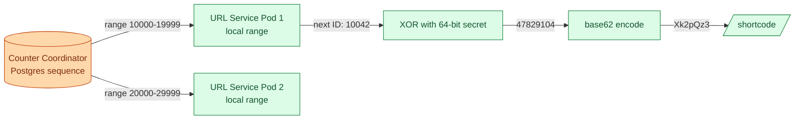

<details markdown="1">
<summary><b>Show: the mint function</b></summary>

```python
def mint_shortcode():
    if local_range.exhausted():
        local_range = coordinator.allocate_range(size=10_000)

    counter_id = local_range.next()
    scrambled = counter_id ^ XOR_SECRET   # bijection: no collisions, looks random
    return base62_encode(scrambled)
```

</details>

Three properties make this work in production:

| Property | Why it matters |
|----------|----------------|
| Range allocation | One coordinator call per 10,000 writes per pod. At 38 writes/sec per pod, one call every ~4 minutes. The coordinator is rarely on the critical path. |
| XOR bijection | Same uniqueness as the raw counter, but consecutive counters give scattered codes. Scrapers cannot guess the next one. |
| Postgres sequence as backing store | Sequences are durable and survive restarts. Plain Redis is the wrong choice because its failover can replay recently-issued IDs. |

Why not hash the URL? Birthday collisions. At 2 million URLs, 50% chance of one collision. At 6 billion, many. A retry loop handles them but adds unpredictable tail latency on writes.

---

### 6. The architecture

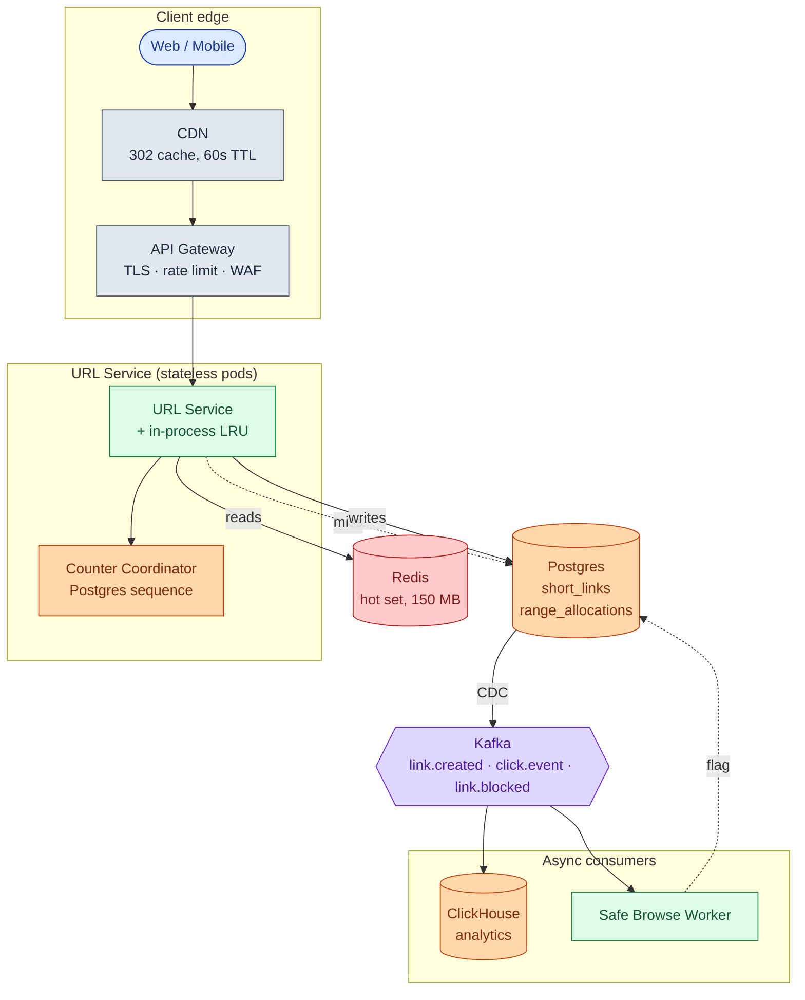

Five things to notice:

- The CDN is in front of everything. For a viral link, ~95% of traffic never reaches origin.
- The synchronous write path has one external dependency: the counter coordinator. Called once per 10,000 writes per pod.
- ClickHouse is downstream of Kafka. If it falls over, redirects keep working. Click counts just lag.
- The Safe Browse Worker is also downstream of Kafka. A phishing URL may be live for up to a minute before being blocked. That trade-off buys ~400ms off the create latency.
- URL Service pods are stateless. State lives in Postgres and Redis. Roll the pods any time.

---

### 7. A redirect, traced


Target latencies for the common paths:

| Path | P99 |
|------|-----|
| CDN hit | ~10ms (edge node distance) |
| In-process LRU hit | ~5ms |
| Redis hit | ~30ms regional, ~80ms cross-region |
| Postgres hit (cache miss) | ~50ms regional |
| Create (new link) | ~50ms (DB insert + Kafka) |

---

### 8. The scaling journey: 1,000 users to 1 billion links

At each stage, name what just broke and what fixes it. Build nothing preemptively.

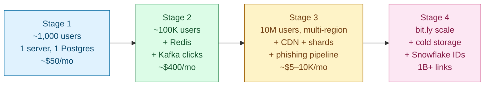

#### Stage 1: ~1,000 users

One server. Single Postgres. Counter is a Postgres sequence (no separate coordinator yet). No CDN, no Kafka, no sharding. ~$50/month. Ships in a weekend.

This is enough because we see ten links a day. Anything more is overbuilt.

#### Stage 2: ~100,000 users

What breaks: read latency rises during the day, and Postgres CPU sits at 60%.

What we add:
- Redis in front of Postgres. ~85% cache hit rate. Postgres CPU drops to 10%.
- Move click counting to a Kafka pipeline so the redirect stops bumping a row on every hit.
- One read replica for durability.

Still single-region, still unsharded. ~$400/month.

#### Stage 3: 10 million users, multi-region

What breaks:
- European users see 200ms latency (server is in us-east).
- One viral link starts taking 30K req/s and pegs one Redis CPU.
- Phishing complaints arrive weekly.

What we add (in this order):
1. **CDN.** Edge caches the 302. Drops origin traffic by ~80% for popular links.
2. **Regional read paths.** URL Service + Redis + read replica per region. Writes still go to one primary region.
3. **Database sharding.** 64 shards by hash of shortcode. Spreads load.
4. **Dedicated counter coordinator.** Range allocation backed by Postgres or ZooKeeper. Never Redis.
5. **Phishing pipeline.** Safe Browsing API consumed via Kafka. Cache invalidation via pub/sub when a link is flagged.

Cost ~$5,000-10,000/month.

#### Stage 4: bit.ly scale (1B+ links)

What changes:
- CDN becomes critical, not optional. ~95% of viral traffic served from edge.
- Hot-key defenses (in-process LRU, Redis replicas, coalescing) are routine, not emergency.
- Storage goes multi-tier. Cold tier in S3 for links older than 1 year.
- Multi-region writes become tempting. Usually still not worth it because writes are only ~150/sec at peak.

The architecture has not fundamentally changed since Stage 3. We added more shards, more replicas, more edge coverage, more careful abuse handling. The data model is still the table from Stage 1.

At ~10x bit.ly, the counter coordinator becomes a chokepoint. Move to Snowflake-style IDs (machine ID + timestamp + sequence). No coordinator at all. Each pod mints codes forever. Trade-off: codes get one character longer.

---

### 9. Reliability

**Cache failure.** Redis goes down. All reads fall through to Postgres. The DB can handle 1,500 req/s for a while, not forever. The URL Service detects the failure and switches to protective mode: stricter rate limits, shed non-essential traffic with `503 Retry-After`.

**DB primary failure.** Promote a read replica. Writes are unavailable for 30 to 60 seconds during failover. Reads keep working from replicas everywhere else.

**Counter coordinator failure.** The worst case. If the coordinator hands the same range to two pods, both will mint colliding codes. The unique constraint on `shortcode` catches the collision at INSERT time (one wins, the other returns a 500 that the client retries). The `range_allocations` ledger detects the overlap within a minute and pages. Recovery: scan the conflicting range, find any duplicates, reissue affected codes.

**Region failure.** Global LB shifts traffic to healthy regions. The new region's cache is cold initially. Expect ~5 minutes of higher latency as it warms.

**CDN failure.** Rare but high-impact. Traffic falls to origin. Origin sees ~5x normal load. Auto-scaling buys time. If load is too high, shed with 503s and tighten rate limits.

---

### 10. Observability

| Metric | Why it matters |
|--------|----------------|
| `redirect.latency` p50/p95/p99 by region | The headline SLO. The whole product is "the redirect is fast." |
| `redirect.cache_hit_rate` per layer | Drop below 80% on Redis means something is wrong: TTL too short, cache node died, or the Zipf assumption broke. |
| `redirect.404_rate` | A spike usually means someone is scraping the namespace. Time to tighten rate limits. |
| `create.latency` p50/p99 | Slow creates point at the counter coordinator or the DB write path. |
| `create.dedup_rate` | If 30% of POSTs hit the dedup unique index, clients are buggy or not respecting Idempotency-Key. |
| `counter.range_overlap_detected` | Must be 0. Any non-zero value pages immediately. |
| `safe_browsing.flagged_rate` | A sudden spike means an active abuse campaign. |
| `kafka.click_event_lag` | If clicks lag more than 5 minutes, analytics is stale. |
| `db.replication_lag_p99` | Must stay under 1 second. |

**Page on:** redirect P99 > 200ms for 5 minutes. Cache hit rate < 70% for 5 minutes. Counter range overlap detected (any).

**Ticket on:** dedup rate spike. 404 rate spike (could be scraping, could be someone deleted a popular link).

---

### 11. Follow-up answers

**1. Two users submit the same long URL within milliseconds.**

If both are anonymous, give them different shortcodes. Two devices submitting the same URL should not be linkable as the same person.

If both are logged in as the same user, dedup. Compute `sha256(long_url)`. Use `INSERT ... ON CONFLICT (creator_id, long_url_hash) DO UPDATE ... RETURNING shortcode`. The unique index makes the race safe. The second INSERT sees the conflict and returns the first one's shortcode.

If a logged-in user wants two separate codes for the same URL (A/B testing two marketing campaigns), accept a `force_new=true` parameter to skip dedup.

**2. Custom aliases (atomic reservation).**

```sql
INSERT INTO short_links (shortcode, long_url, creator_id, custom_alias)
VALUES ($alias, $url, $user, TRUE)
ON CONFLICT (shortcode) DO NOTHING
RETURNING shortcode;
```

If `RETURNING` is empty, the alias was taken. Return 409. Atomic at the DB level. No application-level locks.

One extra concern: a custom alias like `abc1234` looks identical to a generated code. Reserve disjoint namespaces. Custom aliases must be at least 4 characters and contain a non-base62 character (hyphen, underscore), or at least 8 characters. Generated codes are exactly 7 base62 characters. No overlap.

**3. Hot key (viral link).**

Layered defense, cheapest first:

- **CDN.** ~95% of load served from the edge. Origin sees 5% of the storm.
- **In-process LRU on each pod.** Top 1,000 keys, 60s TTL. Zero network cost per hit.
- **Redis read replicas.** Round-robin reads across N replicas. Multiplies hot-key throughput by N.
- **Request coalescing on cache miss.** Only one goroutine fetches from DB. The rest wait on a per-key lock.

For predictable virality, pre-warm every region's cache before the announcement.

**4. Phishing detection.**

Google Safe Browsing takes 200 to 500ms. We cannot block create on that.

At create time: synchronous check against a small bloom filter of known-bad domains. Catches the worst offenders instantly. Asynchronously via Kafka: a worker calls Safe Browsing. If flagged, flip `status = blocked` and evict the cache everywhere via pub/sub. Continuously: a nightly job rescans links created in the last 30 days, because phishing campaigns sometimes weaponize URLs that were clean at creation.

The trade-off: a phishing URL can be live for 1 to 2 minutes before being blocked. To shrink the window further, fire the Safe Browsing call before returning from create but only wait for the response if it lands within 50ms.

**5. Click counts.**

`UPDATE short_links SET clicks = clicks + 1` on every redirect: 1,500 writes per second serialized on hot rows. Lock contention on viral links. It melts the DB.

Pipeline instead: redirect emits `{shortcode, ts, ip_hash, ua_hash}` to Kafka. A streaming job (Flink or ksqlDB) aggregates per shortcode in 1-minute windows. Aggregates go to Redis for rolling totals and ClickHouse for time series. The UI reads from those, not from the primary DB.

Consistency: eventually consistent, 1 to 2 minutes behind real time. Fine for almost every use case.

**6. Custom domains (shrt.acme.com/abc1234).**

- **TLS.** Per-customer cert via Let's Encrypt automation, or a wildcard cert if customers are subdomains.
- **Routing.** Load balancer SNI-routes the TLS connection to the URL Service. The service reads the `Host` header and looks up which tenant owns it.
- **Data model.** Add `tenant_id` to `short_links`, and a `custom_domains` table mapping domain to tenant. Shortcodes are now scoped per tenant. The same `abc1234` can exist for two tenants.
- **DNS.** Customer adds a CNAME from their domain to your load balancer.

This is how every URL shortener supports paid plans. The base shortener is the loss leader. Custom domains are the upsell.

**7. Expiration with retention.**

Three states: `active`, `expired`, `deleted`.

Expired links return 410. The row stays for analytics. Deleted links are gone. For GDPR, null out `long_url` while keeping the shortcode reservation so the code is not reissued.

A nightly job sets `status = expired WHERE expires_at < now()`. Cache entries naturally expire and the next fetch picks up the new status. Move rows older than 6 months to a cold storage table, then to S3 after a year.

**8. Thundering herd on cache miss.**

Without protection: a popular cache entry expires. 10,000 concurrent requests all hit the DB for the same row. CPU spikes. The DB potentially falls over.

Three fixes, all needed together:

- **Jittered TTL.** Add ±10% random jitter to every TTL. Prevents the top 1% of keys from expiring in the same second.
- **Request coalescing.** First request fetches from DB and populates cache. Others wait on a per-key lock and read the populated value. 10,000 DB reads become one.
- **Stale-while-revalidate.** Serve the stale value while one background goroutine refreshes. Same idea HTTP's `stale-while-revalidate` uses. Every major CDN does this internally.

**9. GDPR delete.**

Scatter-gather across all 64 shards: `WHERE creator_id = ?` runs in parallel, union the results. Either DELETE the rows or null out `long_url` and `creator_id` and set `status = gdpr_deleted`. Keep the shortcode reservation so the code is not reissued. Anonymize click history: hash or drop the user identifier and IP. Publish a pub/sub event to evict all of this user's keys from every cache. Confirm to the user within the 30-day GDPR window.

If many GDPR requests are expected, maintain a `creator_id -> shortcode[]` secondary index in a dedicated table. Avoids the scatter-gather for the common case.

**10. Counter coordinator handed the same range twice.**

**Detection.** Every range allocation writes to `range_allocations`. A periodic job (every minute) scans for overlaps:

```sql
SELECT a.*, b.*
  FROM range_allocations a, range_allocations b
 WHERE a.range_start < b.range_end
   AND b.range_start < a.range_end
   AND a.instance_id != b.instance_id;
```

Non-empty result pages immediately.

**Recovery.** Scan the conflicting range against `short_links`. Find IDs minted by both pods. For each duplicate with a different `long_url`, keep the earlier one and reissue the later one with a new shortcode. Notify the affected user.

**Prevention.** Never run the coordinator on plain Redis. Its failover can lose recent writes, replaying the same N seconds of IDs. Use Postgres sequences or ZooKeeper. The cost is a small bit of extra infrastructure. The benefit is correctness.

A mid-level answer covers only prevention. A senior answer covers detection, recovery, and prevention in one breath.

---

### 12. Trade-offs worth stating out loud

**Why not a multi-master database.** DynamoDB Global Tables or Spanner would let writes happen in every region. The operational complexity and write-latency tax are not worth it at URL-shortener traffic. Single-primary with read replicas is the right answer here.

**Why not content-addressed (hash-based) shortcodes.** If the code is a hash of the URL, the target cannot be changed. Mutability is a feature here: moderation, phishing takedowns, and legal compliance all need it.

**Why 302 and not 301 is not trivia.** It is the difference between having control over users' browser caches and not. The phishing use case makes 302 mandatory, not just preferable.

**What to revisit at 10x scale.** Move to Snowflake-style IDs to eliminate the counter coordinator entirely. Make the tiered cache (in-process LRU, regional Redis, DB) explicit in the design rather than emergent. At 64 shards, reconsider Postgres. Cassandra or DynamoDB start winning on operational cost at that point.

---

### 13. Common mistakes

**Diving straight into "use Redis and a database."** No clarification, no math, no API. Loses the interviewer in the first two minutes.

**Hashing the URL with MD5 and assuming no collisions.** Birthday paradox. At 6 billion URLs we will have many. Either acknowledge the collision-handling cost or use a counter.

**Using 301 instead of 302.** Browsers cache 301s forever locally. We lose the ability to block phishing, change targets, or count clicks at the service level. 302 is correct.

**Ignoring click analytics.** Every URL shortener has them. A senior candidate mentions the async pipeline even if not asked.

**Hand-waving cache invalidation.** "We'll use TTLs" handles routine eviction but not blocked links that need immediate revocation. Mention the pub/sub eviction path.

**No mention of phishing.** It is a real operational issue. Any URL shortener that accepts anonymous submissions needs to address it.

**Over-engineering from the start.** Do not propose a globally distributed multi-master CRDT-backed KV store unless the numbers demand it. They do not.

**Ignoring the hot key problem.** It will be asked. Layered caching is the answer.

**No story for counter coordinator failure.** This is where senior candidates separate from mid-level ones. Detection, recovery, and prevention in one breath.

If seven of these nine show up cleanly in the answer, the interview is at staff level. The three that matter most: 302 vs 301, the layered hot-key defense, and the counter coordinator failure story.

