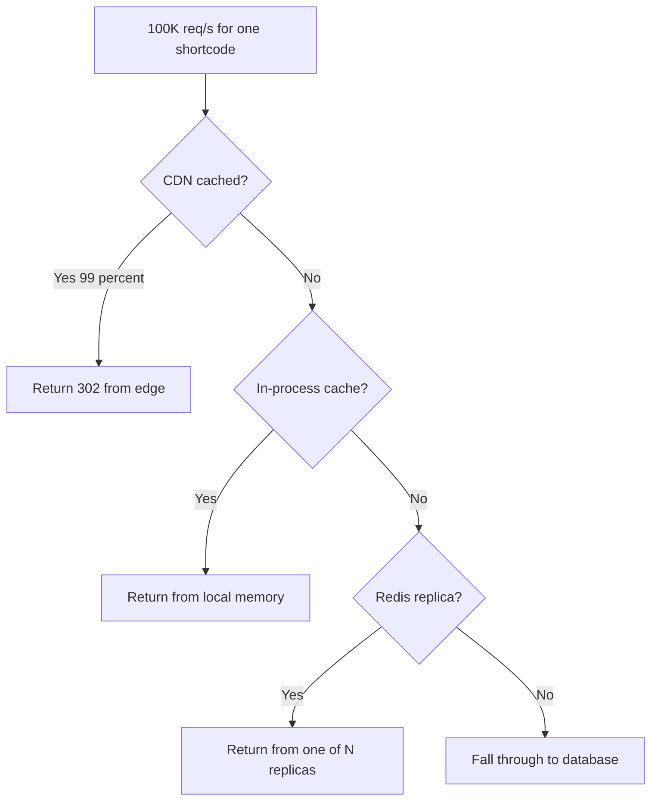
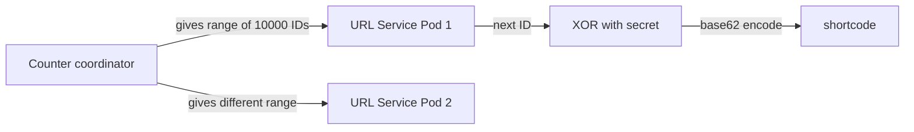
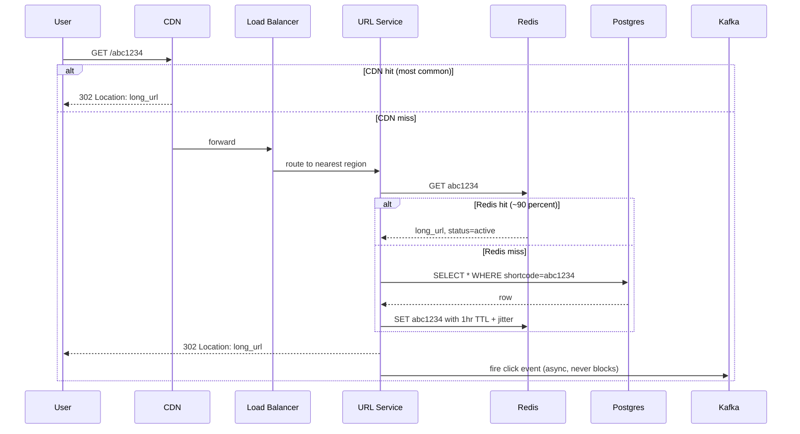


## The scene

You sit down. The interviewer opens a blank doc. They type one line and turn the screen toward you.

> *"Design a URL shortener like bit.ly."*

Then they sit back. They wait. They are not going to say more until you ask.

This is the most common system design question on the planet. It sounds easy. A short string maps to a long string. Done in 10 minutes, right?

Not quite. The trap is in the small word "shortener." It hides a pile of real problems. How do you mint a short code without two servers picking the same one? What happens when a single link goes viral and gets 100,000 hits per second? How do you stop someone from using your service to send people to a phishing site? And how do you keep the redirect under 50ms when your database lives in another continent?

We will walk this from a tiny weekend project to a system that handles billions of links. At every step we will name what breaks first, then add the smallest fix that solves it.

---

## Step 1: Ask the right questions

Before you draw any boxes, sit for five minutes. Write down questions you would ask the interviewer.

A good answer is not "20 questions about every detail." It is the small handful of questions that change the design if answered differently.

<details markdown="1">
<summary><b>Show: 7 questions that matter</b></summary>

1. **How much traffic?** New links per day? Redirects per day? *(Without this you cannot size anything. A bit.ly answer is about 100M new links per month and 10x more reads than writes.)*
2. **How short is short?** 7 characters? 8? Custom aliases like `summer-sale`? *(7 base62 characters gives 3.5 trillion codes. Custom aliases change the design because you have to check for conflicts.)*
3. **Do links expire?** Forever, or after a year? Can users delete them? *(Permanent storage and TTL storage look very different.)*
4. **How fast must the redirect be?** Under 100ms anywhere on Earth? Or 500ms in one region is fine? *(Globally fast means a CDN. One region means you can be much simpler.)*
5. **Click counts?** Real-time number, or "yesterday's total is fine"? *(Real-time needs a separate write path. Batch is cheaper.)*
6. **Anonymous, or logged in?** Can anyone shorten? Or do you need an account? *(This pulls in rate limiting, abuse handling, and a phishing check.)*
7. **Same long URL twice, same shortcode?** If two requests submit the same URL, do they get the same short code back? *(This is dedup. It changes the write path.)*

If you walked in asking only "how many URLs," the interviewer is left guessing. The seven above give you enough to scope the design.

</details>

---

## Step 2: How big is this thing?

The interviewer hands you these numbers:

- 100M new short URLs per month
- Reads are 10x writes
- Average long URL: 100 bytes
- Keep links for 5 years
- Redirect P99 target: 100ms globally

Compute four things on paper before peeking:

1. Writes per second (steady, not peak)
2. Reads per second (steady)
3. Total URLs stored after 5 years
4. How much storage you need for the URLs themselves

<details markdown="1">
<summary><b>Show: the math</b></summary>

**Writes per second.**

100M / month = 100M / (30 × 86400) ≈ **38 writes/sec steady**. Peak is 3 to 5 times that, so call it **~150 writes/sec at peak**. Tiny.

**Reads per second.**

10x writes = **~380 reads/sec steady, ~1,500/sec peak**. Still tiny.

**Total URLs after 5 years.**

100M × 12 × 5 = **6 billion URLs**.

**Storage.**

Each row: 7 byte short code + 100 byte long URL + a few timestamps + a user id + some overhead. Round to **150 bytes per record**.

6B × 150 bytes ≈ **900GB**. Round up to 1TB. That fits on a single big server. You will shard later, but not because of storage size. You shard for other reasons (failure blast radius, regional latency).

**Cache size.**

URL popularity follows a Zipf curve (a few links are huge, most are tiny). The top 1 million URLs serve roughly 80% of the redirects. 1M × 150 bytes ≈ **150MB**. That fits on one small Redis box.

**What the math is telling you:**

The numbers are small. A URL shortener is not a throughput problem. The cache is small. The database is small. A single Postgres could handle the writes.

The interesting part is everything else: making the redirect fast everywhere on Earth, surviving a viral link, and stopping abuse. Capacity is not the hard part.

Also, reads beat writes 10 to 1. The read path matters more than the write path.

</details>

---

## Step 3: How do you make a short code?

This is the central decision. Before you draw boxes, decide where short codes come from.

You need a 7-character string. It must be unique. It should not be guessable (or scrapers will harvest every link). It must be fast to generate (no slow database lookup on every write).

Three real approaches. Here they are with a problem to think through.

```
Approach A: Hash the long URL
   shortcode = base62( first 42 bits of SHA256(long_url) )

Approach B: Counter, then base62 encode
   shortcode = base62( next_counter_value() )

Approach C: Random string, check for collision
   loop: code = random 7 chars; if not in DB, use it
```

Before peeking, ask yourself:
- Approach A: what happens at 6 billion URLs?
- Approach B: what does a sequence of codes look like? Is that a problem?
- Approach C: what happens when the database fills up?

<details markdown="1">
<summary><b>Show: the comparison and what to pick</b></summary>

| Approach | How it works | Pros | Cons |
|----------|-------------|------|------|
| **A. Hash the long URL** | Take first 42 bits of SHA256, base62 encode | Same URL gives same code (great for dedup). No coordination needed. | Birthday collisions. At ~2M URLs, 50% chance of one collision. At 6B URLs, lots. You need a retry loop with a salt. |
| **B. Counter, base62** | Increment a 64-bit counter, encode it | Zero collisions ever. Compact. Predictable. | Counter is shared state. Sequential codes are guessable. A scraper can iterate `abc1230, abc1231, abc1232...` and harvest every link. |
| **C. Random + check** | Generate random 7 chars, check DB, retry if taken | Unguessable. Simple to code. | Every write does an extra DB lookup. Retry latency grows as the namespace fills. |

**Pick: counter with sharded ranges, then scrambled.**

Here is the trick. Each URL Service instance grabs a range of 10,000 IDs at a time from a small coordinator (Redis or a tiny Postgres sequence). Then it hands them out from its local range, no coordination per write. When the range runs out, it grabs another 10,000.

> Why this matters: without the range trick, every write would call out to a shared counter. That is one network hop per write. With the range, you call out once per 10,000 writes. Round-trip vanishes from the critical path.

Then, before encoding, you **scramble** the counter. XOR with a 64-bit secret, then base62. Same uniqueness (XOR is reversible). But consecutive counters now give scattered codes:

```
counter 1000      -> XOR secret -> 84729104 -> base62 -> "Xk2pQz3"
counter 1001      -> XOR secret -> 84729105 -> base62 -> "Y8fM9aQ"
```

A scraper cannot guess the next code. They look random.

**Why not hash?** Birthday collisions. At 2 million URLs you already have a 50% chance of one collision. At 6 billion you will have many. The retry loop works but its latency is unpredictable. Counter is just cleaner.

**Why not pure random?** Every write does a database round-trip just to check. That is wasted latency on every single create. Counter avoids it.

</details>

---

## Step 4: Draw the system

You know where short codes come from. Now draw the boxes that run the whole thing.

Try to fill in the missing pieces. Five boxes are missing. Think about: what sits in front (handles TLS, blocks bad traffic), what runs the logic, what serves reads fast, what stores the truth, and what collects click data.

```
    Client (browser, mobile app)
           |
           v
    +-----------------+
    |   [ ? ]         |   TLS, rate limit, WAF, geo-route
    +--------+--------+
             |
             v
    +-----------------+
    |   [ ? ]         |   stateless, scales horizontally
    | runs the logic  |
    +-+-------+-------+
      |       |
read  |       |  write
      |       |
      v       v
  +---------+ +-----------+
  | [ ? ]   | |  [ ? ]    |   source of truth
  | fast    | |           |
  +---------+ +-----+-----+
                    |
                    | async
                    v
              +-----------+
              |  [ ? ]    |   click events, analytics
              +-----------+
```

<details markdown="1">
<summary><b>Show: the full architecture</b></summary>

```
    Client (browser, mobile app)
           |
           v
    +-------------------+
    |  CDN / Edge       |   caches popular 302s (60s TTL)
    +---------+---------+
              |
              v
    +-------------------+
    |  Load Balancer    |   anycast, geo-route, TLS,
    |  + WAF + Rate     |   rate limit, block bad bots
    |    Limiter        |
    +---------+---------+
              |
              v
    +-------------------+
    |   URL Service     |   stateless, runs per region
    |  (read + write)   |   owns counter range
    +--+-------------+--+
       |             |
 read  |             |  write
       |             |
       v             v
   +---------+   +---------------+
   |  Redis  |   |   Postgres    |   sharded by hash(shortcode),
   | (cache) |   |  (database)   |   replicas in every region
   +---------+   +-------+-------+
                         |
                         |  CDC / outbox
                         v
                +---------------+
                |   Kafka       |   click_event, link_created
                |   topics      |
                +-------+-------+
                        |
                        v
                +----------------+
                | ClickHouse /   |   counts per shortcode,
                | BigQuery       |   1-min rollups
                +----------------+
```

What each piece does, in one line:

- **CDN / Edge.** Caches the 302 redirects for popular links right next to the user. Most viral traffic never reaches your origin.
- **Load Balancer.** TLS termination, geo-routing to the nearest healthy region, rate limit, WAF (blocks SQL injection, bots, known-bad patterns).
- **URL Service.** Stateless. Reads cache, writes to DB, owns a local counter range. You can scale it horizontally with no coordination.
- **Redis.** Holds the hot links in memory. ~90% of reads should hit it. The DB is a fallback.
- **Postgres.** Source of truth. Sharded by hash of shortcode (spreads load evenly). Read replicas in every region.
- **Kafka + ClickHouse.** Click events stream here async. The redirect path never blocks on analytics.

> Why a CDN before the load balancer? Because the redirect is just a 302 with a `Location` header. It is the perfect thing to cache at the edge. A viral link should never bother your origin servers. The CDN serves it from a box 20ms from the user.

</details>

---

## Step 5: The API

Two endpoints carry the whole product. Create a short link, follow a short link. Everything else is reading data back.

```
POST /api/v1/links
  body: { long_url, custom_alias?, expires_at? }
  returns: 201 with { short_url, shortcode }

GET /<shortcode>
  returns: 302 with Location: <long_url>
```

Now, what status codes do you need? Think through:
- What if the custom alias is taken?
- What if the link was flagged as phishing?
- What if the link expired?
- What if the user is being rate-limited?

<details markdown="1">
<summary><b>Show: the full API with status codes</b></summary>

**Create a link**

```
POST /api/v1/links
Content-Type: application/json
Idempotency-Key: <uuid>          # required, stops dup links on retry

{
  "long_url": "https://example.com/very/long/path?with=query",
  "custom_alias": "my-link",      # optional
  "expires_at": "2026-12-31T..."  # optional
}
```

| Status | Meaning |
|--------|---------|
| 201 Created | New short URL minted |
| 200 OK | Same long URL submitted by same user before, returning existing one |
| 400 Bad Request | Invalid URL, bad alias format, expires in the past |
| 409 Conflict | Custom alias already taken |
| 429 Too Many Requests | Rate limit hit |
| 451 Unavailable for Legal Reasons | URL flagged as phishing |

**Follow a link**

```
GET /<shortcode>
```

| Status | Meaning | Headers |
|--------|---------|---------|
| 302 Found | Redirect to long URL | `Location: <long_url>`, `Cache-Control: private, max-age=0` |
| 404 Not Found | Shortcode does not exist |  |
| 410 Gone | Shortcode existed but expired or was deleted |  |
| 451 Unavailable for Legal Reasons | URL was flagged later |  |

A few small but load-bearing choices:

- **302, not 301.** This one is sneaky. A 301 means "permanent redirect." Browsers cache it forever. If a phishing site uses your shortener and you need to block it, the user's browser will skip your service and go straight to the bad URL. You lose all control. With 302, you stay in the loop on every click.

- **`Idempotency-Key` is required on create.** Mobile networks drop packets. The app retries. Without an idempotency key, you mint two short codes for the same submission. With the key, the second request returns the first one's result.

- **`Cache-Control: private, max-age=0` on the redirect.** Tells browsers and middleboxes not to cache the 302 themselves. Your CDN can still cache it because you control the CDN. Browsers should always hit you, so you can revoke a link by flipping its status to blocked.

</details>

---

## Step 6: The viral link problem (hot key)

One day, a celebrity tweets a short link. Suddenly that one shortcode gets 100,000 requests per second. All the other shortcodes still work fine. But this one shortcode is melting one Redis node.

This is called the **hot key** problem. One specific cache key is taking all the load. The Redis shard owning that key pegs at 100% CPU. Latency for every other key on that shard degrades. You start dropping traffic.

How do you survive?

<details markdown="1">
<summary><b>Show: layered defenses against a hot key</b></summary>

You stack four defenses, from cheap to expensive.



**1. CDN at the edge.**

The first and biggest line. The 302 response is tiny and the same for every user. Perfect for caching. Set a 60-second TTL. If 99% of the 100K req/s hits the CDN, your origin only sees 1,000 req/s for that key. That is easy.

> Why 60 seconds and not 24 hours? Because if the link gets flagged as phishing, you want it offline fast. 60 seconds is the sweet spot between cache hit rate and how quickly you can revoke a bad link.

**2. In-process cache on the URL Service.**

Each URL Service pod keeps a tiny LRU cache in its own memory. The top 1,000 keys live there with a 60s TTL. A cache hit here costs nothing. No network call.

**3. Redis read replicas.**

Redis can replicate a key to N read-only replicas. The URL Service round-robins reads across them. If you have 5 replicas, each one takes 1/5 of the traffic. Multiplies hot-key throughput by 5.

**4. Request coalescing on cache miss.**

When the cache entry expires, 10,000 concurrent requests all try to refresh it at the same time. They all hit the database for the same row. The DB melts.

Fix: when a request sees a stale cache entry, only the first one fetches from the DB. The rest wait on a per-key lock and read the populated value. 10,000 misses become 1 DB read.

> Pre-warming for predictable virality. If a marketing team is about to announce something at noon, push the entry to every region's cache at 11:55. The cache is already hot when the storm hits.

</details>

---

## Step 7: One short code, four ways things can go wrong

Same system, four real failures. Each one stresses a different part of the design.

For each, think about: what breaks first, and what is the smallest fix?

**A. Same long URL, two submissions in the same millisecond.** Two API calls with `long_url = "https://example.com/sale"` arrive at the same instant. Do they get the same short code or two different ones?

**B. The counter coordinator hands out the same range twice.** Redis failed over, the replica was stale, and it gave the range `[10000, 20000]` to both pod A and pod B. Now they are minting the same short codes.

**C. A short code is flagged as phishing after 1 million people already saved it.** The link has been live for 3 days. It is in everyone's CDN cache. How do you kill it?

**D. The cache evicts a viral link's entry during a 50K req/s burst.** Suddenly the database gets 50K req/s for one row.

<details markdown="1">
<summary><b>Show: what each one teaches</b></summary>

**A. Dedup race.**

If both submissions are by the same logged-in user, you want dedup (give back the same shortcode). The race: both requests hit `SELECT shortcode WHERE creator_id = ? AND long_url_hash = ?`. Both miss. Both proceed to INSERT.

Fix: a **unique index** on `(creator_id, long_url_hash)`. Then use:

```sql
INSERT INTO short_links (...)
VALUES (...)
ON CONFLICT (creator_id, long_url_hash) DO UPDATE SET ...
RETURNING shortcode;
```

The second INSERT sees the conflict, returns the first one's shortcode. The database does the work. No app-level locks.

If both submissions are anonymous: give them different codes. Same URL going to two short codes is fine for anonymous users (it actually preserves privacy, two devices submitting the same URL should not be linked).

**B. Coordinator handed the same range twice.**

This is the scariest scenario. Two pods are minting the same codes. Eventually they will both try to insert the same shortcode. The DB unique constraint catches one of them (good) but the user gets a 500.

The fix has two parts:
- **Detection:** every range allocation writes a row to a `range_allocations` ledger table `(range_start, range_end, instance_id, allocated_at)`. A periodic job scans for overlapping ranges and alerts.
- **Prevention:** never run the coordinator on plain Redis. Back it with a strongly-consistent store. Postgres sequences work. ZooKeeper works. Redis with replication does not, because failover can lose recent writes.

> The mid-level answer covers only prevention. The senior answer covers detection, recovery, and prevention in one breath.

**C. Killing a flagged link with cached copies everywhere.**

You set `status = blocked` in the database. But:
- Your CDN still has the old 302. Up to 60 seconds of bad redirects continue.
- Every URL Service's local in-process cache still has the old value.
- Redis still has the old value.

Cache invalidation, three layers:
- DB write: `UPDATE short_links SET status = 'blocked'`.
- Publish to a Redis pub/sub channel `link.invalidated`. Every URL Service pod subscribes. Each one evicts the key from its in-process cache and from Redis.
- For the CDN: send a purge API call (every CDN supports this). If purge is slow, accept the 60-second window. Bad links go quiet within a minute.

**D. Cache miss on a viral key (thundering herd).**

Same as #4 above. Mitigations:
- **Jittered TTL.** Don't let all the top 1000 keys expire in the same second. Add ±10% random jitter to every TTL.
- **Request coalescing.** First request fetches from DB. Others wait.
- **Stale-while-revalidate.** Serve the old value while one background goroutine refreshes. Same trick HTTP uses.

**The big idea.** A URL shortener looks like a simple key-value lookup. The interesting engineering lives at the edges: the hot key, the dedup race, the coordinator failure, the cache invalidation. That is what the interviewer wants to hear about.

</details>

---

## Follow-up questions

Try answering each in 2 or 3 sentences before opening the solution.

1. **Two users submit the same long URL within milliseconds.** Same shortcode or different ones? What if both are anonymous? What if both are logged in as the same user?

2. **Custom aliases.** User A reserves `summer-sale` at the same moment as user B. How do you make sure only one of them gets it, atomically, without a slow lock?

3. **A single shortcode goes viral and takes 100K req/s.** What is your layered defense? What is the cheapest layer and what does it buy you?

4. **Phishing detection.** Google Safe Browsing takes 200 to 500ms per check. You cannot block the create endpoint on that. What is the trade-off you accept, and how do you handle URLs that turn malicious after creation?

5. **Click counts.** Every redirect needs to bump a counter. You have 1,500 redirects per second. Why does `UPDATE short_links SET clicks = clicks + 1` not work? What do you do instead?

6. **Custom domains.** Acme Corp wants `shrt.acme.com/abc1234` instead of `shrt.ly/abc1234`. What changes in routing, TLS, and the data model?

7. **Expiration with retention.** Links expire after 1 year. Do you delete the row, mark it expired, or just let the cache TTL win? What about historical analytics?

8. **Thundering herd on cache miss.** A popular URL's cache entry just expired. 10k requests arrive in the next 100ms. Walk through what happens without protection. Then walk through the fix.

9. **GDPR delete.** A user wants every short URL they created deleted. You have 64 sharded databases. How do you find and delete everything? What about their click history?

10. **3am page: the counter coordinator handed the same range to two instances.** What is the blast radius? How do you detect it? How do you recover? How do you prevent it from happening again?

---

## Related problems

- **[Distributed Cache (009)](../009-distributed-cache/question.md).** The caching layer this problem leans on. Understand its eviction and replication before tackling the hot key problem here.
- **[Rate Limiter (004)](../004-rate-limiter/question.md).** The rate limiter on `POST /links` uses the same algorithms (token bucket, sliding window) you would design from scratch in that problem.
- **[Notification System (010)](../010-notification-system/question.md).** The click stream pipeline at the bottom uses the same fan-out, retry, and durability patterns as a notification system's event delivery.


<div class="pr-solution-divider"></div>


## Solution: URL Shortener

### The short version

A URL shortener is a key-value lookup with one twist: reads beat writes by 10 to 1, and one specific key can suddenly take 100,000 requests per second when it goes viral.

The runtime is small. A stateless service in front of a cache in front of a sharded database. Short codes come from a counter that hands out ranges (no coordination on the write path), then get XOR-scrambled so they look random. Reads almost always hit cache. The database is a backstop.

The data model fits on a napkin: one table with shortcode as the primary key. Scale is not the hard part. At bit.ly numbers the whole system handles 38 writes per second steady. The hard part is the edges: surviving a viral link, handling phishing, recovering when the counter coordinator misbehaves.

---

### 1. The clarifying questions, in one paragraph

The single most important question is *how much traffic?* Without numbers you cannot pick a cache size, a sharding scheme, or even a database. Second is *custom aliases yes or no?* Because aliases change the write path from "mint a fresh code" to "atomically reserve this exact string." Third is *who can shorten?* Because anonymous shortening forces rate limits, abuse handling, and a phishing pipeline that logged-in services often skip.

Everything else (latency target, analytics shape, retention) follows from those three.

---

### 2. The math, in plain numbers

| Number | Value |
|--------|-------|
| New URLs per month | 100M |
| Writes per second, steady | ~38 |
| Writes per second, peak | ~150 |
| Reads per second, steady | ~380 |
| Reads per second, peak | ~1,500 |
| Total URLs after 5 years | 6 billion |
| Total storage | ~900GB |
| Hot working set (top 1M URLs) | ~150MB |

What the numbers tell you:

- **The system is small.** A single Postgres could handle the writes. You shard for failure blast radius and regional latency, not for capacity.
- **Cache wins everything.** 150MB hot set on one Redis node serves ~80% of traffic. Get the cache right and the database is almost an afterthought.
- **The redirect bandwidth is zero.** A 302 with a `Location` header has no body. The user goes away to the target. You serve nothing.

---

### 3. The API

Two endpoints. Create a link. Follow a link. Full schemas are in `question.md`. The non-obvious choices:

- **302, not 301.** A 301 says "permanent." Browsers cache it for life. If you ever need to block the link (phishing, copyright, etc.), the user's browser will not even ask you. With 302, every click goes through you, so you keep control.

- **`Idempotency-Key` is required on create.** Mobile drops connections. The client retries. Without the key, one tap becomes two short codes.

- **`Cache-Control: private, max-age=0` on the redirect response.** Tells the browser and middlebox proxies not to cache. Your CDN can still cache it because you control the CDN explicitly.

Status codes worth knowing: **410 Gone** for expired or deleted links (different from 404 because it tells the browser not to retry), **451 Unavailable for Legal Reasons** for blocked URLs.

---

### 4. The data model

One main table. That's it.

```sql
CREATE TABLE short_links (
    shortcode      VARCHAR(16) PRIMARY KEY,         -- base62, usually 7 chars
    long_url       TEXT NOT NULL,
    creator_id     BIGINT,                          -- NULL for anonymous
    created_at     TIMESTAMPTZ NOT NULL DEFAULT NOW(),
    expires_at     TIMESTAMPTZ,                     -- NULL = no expiry
    status         SMALLINT NOT NULL DEFAULT 1,     -- 1=active, 2=expired, 3=blocked
    custom_alias   BOOLEAN NOT NULL DEFAULT FALSE,
    long_url_hash  BYTEA                            -- SHA-256 for dedup lookups
);

CREATE INDEX idx_creator_created ON short_links (creator_id, created_at DESC);
CREATE UNIQUE INDEX idx_dedup ON short_links (creator_id, long_url_hash)
    WHERE creator_id IS NOT NULL;
CREATE INDEX idx_expires ON short_links (expires_at) WHERE expires_at IS NOT NULL;
```

Four small choices doing real work:

**`shortcode` as the primary key.** Reads are by shortcode. Matching the PK to the lookup key skips an index hop on every single redirect. Sounds tiny. At 1,500 reads per second across 6 billion rows, it matters.

**`long_url` is `TEXT`, not `VARCHAR(2048)`.** Real URLs exceed 2048 characters. Google Maps share links. Deep OAuth callbacks. Trust the use case.

**`status` is `SMALLINT`, not an enum.** When you want to add `4 = pending_review` or `5 = quarantined`, no schema migration. Just write the new number.

**Unique index on `(creator_id, long_url_hash)`.** This is what makes dedup safe under concurrent writes. Two simultaneous INSERTs of the same URL by the same user: one wins, the other gets a conflict, returns the existing shortcode. No app-level locks.

> Why Postgres and not Cassandra? Because you want ACID for the counter-range allocation and the dedup unique index. Postgres gives you both for free. At 38 writes per second steady, you are nowhere near needing a NoSQL store. Save the complexity for a real reason.

---

### 5. How short codes get made

The engine of the write path. Three approaches, the recommendation, and why.



**The chosen approach: sharded counter, scrambled.**

```python
def mint_shortcode():
    # Local range, no network call most of the time
    if local_range.exhausted():
        local_range = coordinator.allocate_range(size=10000)

    counter_id = local_range.next()                    # e.g. 8472913
    scrambled = counter_id ^ XOR_SECRET                # bijective scramble
    return base62_encode(scrambled)                    # 7 chars
```

Three things make this work:

**1. Range allocation removes the per-write coordination call.** A pod grabs 10,000 IDs from the coordinator. Then it serves 10,000 writes from local memory before talking to the coordinator again. At 38 writes per second per pod, that is one coordinator call every 4 minutes per pod. Trivial.

**2. The XOR scramble kills sequential guessability.** Without it, codes look like `Aaa0001, Aaa0002, Aaa0003`. A scraper iterates the namespace and harvests every link. With XOR, consecutive counters give scattered codes. Same uniqueness (XOR is bijective). No scraping risk.

**3. The coordinator's state has to survive a failover.** This is the trap. If the coordinator is plain Redis and the replica is stale, the same range gets handed out twice and two pods mint colliding codes. The fix is to back the coordinator with a strongly-consistent store (a Postgres sequence, or ZooKeeper).

> Why not just hash the URL? Birthday collisions. At 2 million URLs you have a 50% chance of one collision. At 6 billion, lots. You can handle collisions with a retry loop and a salt, but the loop's latency is unpredictable at the tail. Counters are cleaner.

---

### 6. The architecture, drawn out

```
                 +--------------------------------------+
                 |  Clients: web, mobile, anywhere      |
                 +-------------------+------------------+
                                     |
                                     v
                          +-----------------+
                          |   CDN / Edge    |  caches 302s, 60s TTL,
                          |  (CloudFront,   |  most viral traffic
                          |   Fastly)       |  never reaches origin
                          +--------+--------+
                                   |
                                   v
                          +-----------------+
                          |  Global LB +    |  anycast IP, routes
                          |  WAF + Rate     |  to nearest region,
                          |  Limiter        |  TLS termination
                          +--------+--------+
                                   |
            +----------------------+----------------------+
            |                      |                      |
            v                      v                      v
    +-------------+        +-------------+        +-------------+
    |  Region:    |        |  Region:    |        |  Region:    |
    |  us-east    |        |  eu-west    |        |  ap-south   |
    |             |        |             |        |             |
    | URL Service |        | URL Service |        | URL Service |
    |    + Redis  |        |    + Redis  |        |    + Redis  |
    |    + DB     |        |    + DB     |        |    + DB     |
    |  read repl  |        |  read repl  |        |  read repl  |
    +------+------+        +------+------+        +------+------+
           |                      |                      |
           +----------+-----------+-----------+----------+
                      |                       |
                      v                       v
            +-------------------+    +------------------+
            | Primary DB        |    | Counter          |
            | (one region for   |    | Coordinator      |
            | writes, sharded   |    | (Postgres        |
            | by shortcode hash)|    | sequence or ZK)  |
            +---------+---------+    +------------------+
                      |
                      |  CDC / outbox
                      v
            +-------------------+
            | Kafka topics      |
            | link.created      |
            | click.event       |
            | link.blocked      |
            +---+---------+-----+
                |         |
                v         v
        +------------+ +--------------+
        | ClickHouse | | Safe Browse  |
        | (analytics)| | Worker       |
        |            | | (async check)|
        +------------+ +--------------+
```

Five things to notice while reading this:

- **The CDN is in front of everything.** A viral link's 302 is cached at the edge. Most clicks never reach your origin. This is the single biggest performance lever in the design.
- **Each region is mostly self-sufficient.** Local URL Service, local Redis, local DB read replica. Reads stay regional. Only writes go to the primary region.
- **The write path has exactly one external dependency.** The counter coordinator. Called once per 10,000 writes per pod. Everything else is a local DB transaction.
- **Click analytics is downstream of Kafka.** Never in the redirect path. If ClickHouse falls over, redirects keep working. Click counts just lag.
- **Safe Browsing is downstream of Kafka.** Same idea. The create call doesn't wait for the safe-browsing check. A bad URL might be live for a minute before being blocked. That trade-off is worth the latency win.

---

### 7. A redirect, drawn end to end



Target latencies in the common path:

- CDN hit: **~10ms** (depends on user's distance to the edge).
- Redis hit, no CDN: **~30ms** regional, ~80ms cross-region.
- DB hit (cache miss): **~50ms** regional.

The create path is similar but writes happen instead of reads. Counter allocation (cached locally), DB INSERT, write-through to Redis, fire `link.created` event to Kafka, return 201. P99 around 200ms. The bottleneck is the synchronous DB insert.

---

### 8. The scaling journey: from one server to billions of links

This is the part interviewers care about most. At every stage, name what just broke and what fixes it. Build nothing preemptively.

#### Stage 1: 1,000 users

One server. Single Postgres. Cache in memory. No CDN, no Kafka, no sharding. Counter is a Postgres sequence. About $50/month. Ships in a weekend.

Enough because you see 10 links a day. Anything more is over-engineering.

#### Stage 2: 100,000 users

Something breaks: read latency spikes during the day, and Postgres CPU hits 60%.

Add Redis in front. The hot working set (a few hundred MB) fits in one Redis node easily. Cache hit rate goes from 0% to ~85%, Postgres CPU drops to 10%. Add one read replica for durability. Move click counting to a Kafka pipeline so the redirect path stops bumping a row on every hit.

Still one region. Still no sharding. Counter is still a Postgres sequence. About $400/month.

#### Stage 3: 10 million users, multi-region

New problems pile up:

- European users see 200ms latency because the server is in us-east.
- One viral link starts getting 30K req/s and pegs one Redis CPU.
- Phishing complaints arrive weekly. You need a process.

Fixes, in order:

- **Add a CDN.** Caches the 302 at the edge. Drops origin traffic by 80% for popular links.
- **Add regional read paths.** URL Service + Redis + read replica in each region. Writes still go to one primary region.
- **Shard the database.** 64 shards by hash of shortcode. Spreads load evenly. Now no single DB node feels the write pressure.
- **Move the counter to a dedicated coordinator.** Range allocation, durable state in Postgres or ZooKeeper.
- **Build a phishing pipeline.** Safe Browsing API consumed via Kafka. Async. Cache invalidation via pub/sub when a link is flagged.

Cost climbs to $5-10k/month. Latency is good worldwide.

#### Stage 4: 1 billion users (bit.ly scale)

What changes:

- The CDN is now critical infrastructure, not a nice-to-have. 95% of viral traffic served from the edge.
- Hot key problem becomes routine. Layered defenses (CDN, in-process cache, Redis replicas, request coalescing) all in place.
- Storage is multi-TB. Cold tier in S3 for links older than 1 year.
- Multi-region writes become tempting. Probably still not worth it. A single primary region for writes is simpler and the write rate is small.

The architecture has not fundamentally changed since Stage 3. You added more shards, more replicas, more CDN coverage, more careful abuse handling. The core data model is the same one you wrote in Stage 1.

#### What you would do at 10x of bit.ly

Move counter allocation client-side with a Snowflake-style ID: machine ID + timestamp + sequence. No coordinator at all. Each pod can mint codes forever without ever talking to a central service. Trade: you lose a tiny bit of compactness (codes get one character longer).

---

### 9. The four hard problems, fast

Same engine, four hard cases. Each one stresses a different feature.

- **Viral link (hot key)** uses layered caching. CDN at the edge, in-process cache on each pod, Redis read replicas, request coalescing on miss. The cheapest layer (CDN) buys the most.
- **Dedup race** uses a unique index on `(creator_id, long_url_hash)`. The DB serializes the writes. The second INSERT gets a conflict, returns the first's shortcode. No app-level locks.
- **Phishing detection** is async via Kafka. The create call returns fast. A worker calls Safe Browsing later. If flagged, status flips to blocked and pub/sub evicts the cache everywhere. The trade-off: the link is live for a minute before being killed.
- **Counter coordinator failure** uses a ledger. Every range allocation writes a row. A periodic job scans for overlapping ranges and alerts. Prevention: never run the coordinator on plain Redis. Use Postgres sequences or ZooKeeper.

One engine, four hard problems, all solved with small targeted patterns. That is the design victory.

---

### 10. Reliability

The engine has only one shared write dependency (the counter coordinator) and one shared read dependency (the cache). Each failure mode has a known fallback.

**Cache failure.** Redis is down. All reads fall through to the DB. The DB can hold 1,500 req/s for a while, but not forever. The URL Service detects Redis health and switches to a self-protective mode: stricter rate limits, smaller payloads, shed any non-essential traffic with 503 + `Retry-After`.

**DB primary failure.** Promote a read replica. Writes are unavailable for 30 to 60 seconds (typical Postgres failover). Reads keep working everywhere else. The counter coordinator must not lose state during this window, which is why it lives on its own store.

**Counter coordinator failure.** The worst case. If the coordinator hands the same range to two pods, two pods mint colliding codes. The DB unique constraint catches the collision (one INSERT wins, the other 500s), so the user-visible effect is some failed creates. The ledger detects the overlap within minutes and alerts. Recovery: scan the conflicting range, find any collisions that happened, reissue the duplicates manually.

**Region failure.** The global LB detects it and shifts traffic to healthy regions. The failed region's cache is cold elsewhere. Expect ~5 minutes of degraded latency as the new region's cache warms up.

**CDN failure.** Rare but happens (provider outage). Traffic falls back to origin. Origin sees 5x normal load. Auto-scaling buys time. If the load is too high, shed with 503s and pray.

---

### 11. Observability

What must be instrumented from day one:

| Metric | Why it matters |
|--------|----------------|
| `redirect.latency` p50/p95/p99 by region | The headline SLO. The whole product is "the redirect is fast." |
| `redirect.cache_hit_rate` | If this drops below 80%, something is wrong (TTL too short, cache box died, Zipf assumption broken). |
| `redirect.404_rate` | Spikes mean someone is scraping the namespace. New rate limit rule needed. |
| `create.latency` p50/p99 | Slow creates point to the counter coordinator or DB. |
| `create.dedup_rate` | If 30% of POSTs are dedups, your clients are buggy or not respecting the idempotency key. |
| `counter.range_fetches_per_sec` | Should be roughly write QPS divided by range size. |
| `counter.range_overlap_detected` | Should be 0. Page on any non-zero value. |
| `safe_browsing.flagged_rate` | Sudden spike means an abuse campaign. |
| `kafka.click_event_lag` | If clicks lag by more than 5 minutes, analytics is stale. |
| `db.replication_lag_p99` | Should stay under 1 second. |

Page on: redirect P99 > 200ms for 5 minutes. Cache hit rate < 70% for 5 minutes. Counter range overlap detected (any).

Ticket on: dedup rate spike. 404 rate spike (could be scraping, could be someone deleted a popular link).

---

### 12. Follow-up answers

These are the questions a senior interviewer is listening for. Each answer is short on purpose. The depth is in the *why*.

**1. Two users submit the same long URL within milliseconds.**

If both are anonymous, give them different shortcodes. Same URL going to two codes is fine, and it preserves privacy. Two devices submitting the same URL should not be linkable as the same person.

If both are logged in as the same user, dedup. Compute `sha256(long_url)`. Do an upsert: `INSERT ... ON CONFLICT (creator_id, long_url_hash) DO UPDATE ... RETURNING shortcode`. The unique index makes the race safe. The second INSERT sees the conflict and returns the first one's shortcode.

If they want different codes for the same URL, add `?force_new=true` to skip dedup. Real-world example: a marketing team running an A/B test wants separate codes so they can track each campaign's clicks separately.

**2. Custom aliases (atomic reservation).**

```sql
INSERT INTO short_links (shortcode, long_url, creator_id, custom_alias)
VALUES ($alias, $url, $user, TRUE)
ON CONFLICT (shortcode) DO NOTHING
RETURNING shortcode;
```

If `RETURNING` is empty, the alias was taken. Return 409. Atomic at the DB level. No locks needed.

One annoying case: a custom alias that looks like a generated code (`abc1234`). Reserve a namespace. Custom aliases must be at least 4 chars and contain at least one non-base62 character (hyphen or underscore), or at least 8 chars. Now generated codes and custom aliases live in disjoint pools. No conflict possible.

**3. Hot key problem (one shortcode getting 100K req/s).**

Layer four defenses, cheapest first:

- **CDN.** 99% of the load served from the edge. Origin sees 1,000 req/s.
- **In-process LRU cache on each pod.** Top 1,000 keys held in pod memory with a 60s TTL. Zero network cost.
- **Redis read replicas.** Read from N replicas, round-robin. Multiplies hot-key throughput by N.
- **Request coalescing on cache miss.** When the entry expires, only one goroutine refreshes. The rest wait on a per-key lock.

The cheapest layer (CDN) does the most work. The expensive layer (replicas) is a backstop.

For pre-known viral events: pre-warm the cache. If marketing announces something at noon, push the entry to every region's cache at 11:55. The storm hits a warm cache.

**4. Phishing detection.**

Google Safe Browsing takes 200 to 500ms. You cannot block create on that.

The approach:

- At create time: synchronous check against a small in-memory bloom filter of known-bad domains. Cheap. Catches the worst offenders.
- Asynchronously via Kafka: a worker calls the Safe Browsing API. If flagged, `status = blocked` and a pub/sub event evicts the cache everywhere.
- Continuously: a nightly job rescans URLs created in the last 30 days. Phishing campaigns sometimes weaponize URLs that were clean at creation.

Trade-off: a phishing URL can be live for 1 to 2 minutes before being blocked. To shrink the window, fire the Safe Browsing call before returning from create, but only block on the response if it lands within 50ms. After that, return success and let the async pipeline catch late detection.

**5. Click count analytics.**

`UPDATE short_links SET clicks = clicks + 1` on every redirect would melt the DB. 1,500 writes per second serialized on hot rows. Lock contention on viral links.

Pipeline:

- Redirect emits an event to Kafka: `{shortcode, ts, ip_hash, ua_hash}`.
- A streaming job (Flink, ksqlDB) aggregates per shortcode in 1-minute windows.
- Aggregates written to a counter store (Redis `INCR` for the rolling total, ClickHouse for the time series).
- UI queries the counter store, not the primary DB.

Consistency: eventually consistent, 1 to 2 minutes behind real time. Fine for almost every use case. If a customer needs real-time-exact counts, point them at the Kafka stream directly and explain the cost.

**6. Custom domains.**

`shrt.acme.com/abc1234` instead of `shrt.ly/abc1234`. What changes:

- **TLS.** Per-customer or wildcard cert. Let's Encrypt automation per domain works for most.
- **Routing.** Load balancer SNI-routes the TLS connection to the URL Service. The service reads the `Host` header and looks up which tenant owns it.
- **Database.** Add `tenant_id` to `short_links`, and a `custom_domains` table mapping domain to tenant. Shortcodes are now scoped per tenant. The same `abc1234` can exist for two tenants.
- **DNS.** Customer adds a CNAME from their domain to your load balancer.

Real-world: this is how every URL shortener supports paid plans. The base shortener is the loss leader; custom domains are the upsell.

**7. Link expiration with retention.**

Three states: `active`, `expired`, `deleted`.

- Expired links return 410. The row stays for analytics ("how many clicks did this campaign get before it expired?").
- Deleted links are gone. For GDPR you may even null out `long_url`.

A nightly job sets `status = expired` on rows where `expires_at < now()`. Cache entries naturally expire and the next fetch picks up the new status. No special invalidation needed.

For old data: keep expired rows in cold storage tables. Move to S3 after 6 months. Click analytics retains shortcode references but not the full row.

**8. Thundering herd on cache miss.**

A popular URL's cache entry expires. 10K concurrent requests all hit the DB for the same row. CPU spikes.

Three fixes, all needed:

- **Jittered TTL.** Don't let all the top 1% of keys expire in the same second. Add ±10% random jitter to every TTL.
- **Request coalescing.** First request fetches from DB and populates the cache. Others wait on a per-key lock and read the populated value. 10K misses become 1 DB read.
- **Stale-while-revalidate.** Serve the stale value while one background request refreshes. Same trick HTTP's `stale-while-revalidate` directive uses.

> Real example: every CDN does this internally. Cloudflare's tiered caching coalesces concurrent origin fetches for the same key.

**9. GDPR delete.**

User asks for all their data deleted.

- **Find.** Scatter-gather across all 64 shards. `WHERE creator_id = ?` runs in parallel. Union the results.
- **Delete or anonymize.** Either DELETE the rows, or NULL out `long_url`, `creator_id` and set `status = gdpr_deleted`. Keep the shortcode reservation so the code is not reissued.
- **Click history.** Anonymize the analytics records. Hash or drop the user identifier and IP.
- **Cache.** Publish a pub/sub event to evict all of this user's keys from every cache.
- **Confirm.** Tell the user within the regulatory window (30 days under GDPR).

If you expect many GDPR requests, maintain a `creator_id -> shortcode[]` secondary index in a dedicated table. Avoids the scatter-gather for the common case.

**10. Counter coordinator handed the same range twice.**

The scariest 3am page. Two pods are minting the same codes. Some creates will collide on the DB unique constraint and 500.

**Detection.** Every range allocation writes a row to a `range_allocations` ledger: `(range_start, range_end, instance_id, allocated_at)`. A periodic job (every minute) scans for overlapping ranges:

```sql
SELECT a.*, b.*
  FROM range_allocations a, range_allocations b
 WHERE a.range_start < b.range_end
   AND b.range_start < a.range_end
   AND a.instance_id != b.instance_id;
```

Non-empty result, page immediately.

**Recovery.** Scan the conflicting range against the actual short_links table. Find which IDs got minted by both pods. For each duplicate that ended up with a different `long_url` (the disaster case): keep the earlier one, contact the second user, reissue with a new shortcode.

**Prevention.** Never run the coordinator on plain Redis. Back it with Postgres (a real sequence) or ZooKeeper (designed for this). The cost of Redis failover during a primary swap is sometimes "the replica is stale by N seconds." For a counter, that means handing out the same N seconds worth of IDs twice.

The mid-level answer covers only prevention. The senior answer covers detection, recovery, and prevention in one breath.

---

### 13. Trade-offs worth saying out loud

**Why not a multi-master database.** DynamoDB Global Tables or Spanner would let writes happen in every region. The write-latency tax and operational complexity are rarely worth it at URL-shortener traffic (38 writes per second). Single-primary with read replicas is the right answer at this scale.

**Why not content-addressed (hash) URLs.** Sometimes asked as a curveball. If shortcodes are hashes of the long URL, you cannot ever change the target. Mutability is a feature here. You need it for moderation, for phishing, for legal takedowns.

**Why YAML/config for nothing.** Unlike workflow engines, a URL shortener doesn't need user-defined logic. The whole product fits in one schema. Don't invent a DSL.

**What you would revisit at 10x scale.**
- Snowflake-style IDs to remove the counter coordinator entirely.
- Tiered cache (in-process LRU, regional Redis, DB) as an explicit design, not emergent.
- Reevaluate Postgres at 64 shards. Cassandra or DynamoDB starts winning on operational cost at that point.

---

### 14. Common mistakes

Most weak answers fall into one of these:

**Diving straight into "use Redis and a database."** No clarification, no math, no API. Loses the interviewer immediately.

**Hashing the long URL with MD5 and assuming no collisions.** Birthday paradox. At 6 billion URLs you will have many. Either acknowledge the collision-handling cost or use a counter.

**Using 301 instead of 302.** Browsers cache 301s forever. You lose the ability to block phishing, change targets, or count clicks at the service. 302 is correct.

**Ignoring click analytics.** Every URL shortener has them. A senior candidate mentions the async pipeline even if not asked.

**Hand-waving cache invalidation.** "We'll use TTLs" is fine for routine eviction but does not cover blocked links that need immediate revocation. Mention pub/sub eviction.

**No mention of phishing.** It is a real operational issue. Acknowledge it.

**Over-engineering.** Don't propose a globally distributed multi-master CRDT-backed KV store unless the numbers demand it. They don't.

**Ignoring the hot key problem.** You will be asked. Layered caching is the answer.

**No story for the counter coordinator failure.** This is where senior candidates separate from mid-level ones.

If you hit 7 of these 9 cleanly, you are interviewing at staff level. The three that matter most: 302 vs 301, the layered hot-key defense, and the counter coordinator failure recovery. Those are the answers a senior architect listens for.

