
## The scene

You sit down. The interviewer leans in.

> *"Think about Twitter's home feed. When I log in, I see a list of posts from people I follow. Design that. Start with a small app, a thousand users. Then grow it until we're at Twitter scale, three hundred million daily users."*
>
> *"And tell me: what's the single number that decides the whole design?"*

It sounds like a simple list query. It is not.

The trap is the word "feed." It sounds like a `SELECT ... ORDER BY time`. The real question is hidden:

- What happens when one person has 100 million followers and posts right now?
- How do you show anyone's feed in under 200ms?
- How do you handle a post being deleted after it has already reached a million feeds?
- Where does ranking live, and what breaks if you get it wrong?

We will start with 1,000 users and a single database. Then we add one pressure at a time and watch the design grow.

---

## Step 1: Picture one feed

Before boxes or SQL, picture what a feed is. Alice follows Bob and Carol. She opens the app.

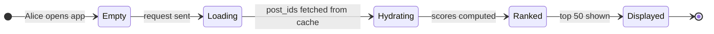

That is the whole read path. The interesting design work is in the loading and hydrating steps: where do those post_ids come from, and how do they get there?

> **Take this with you.** A feed is not a query against a posts table. It is a pre-built list of post_ids, assembled when people post, ready to read in milliseconds.

---

## Step 2: Ask the right questions

In a real interview, pause for two minutes and write down what you want to ask. Not twenty questions. Five good ones.

<details markdown="1">
<summary><b>Show: 5 questions that change the design</b></summary>

1. **What is the biggest user's follower count?** Median user has maybe 100 followers. Top user: 1 million? 100 million? *This single number decides the whole architecture. If the biggest user has 1,000 followers, you can push to everyone. If they have 100 million, you cannot.*
2. **Time order or ranked by an algorithm?** Old Twitter was time order. New Twitter, Instagram, and Facebook all run an ML ranking step. Ranking adds 30ms on the read path and forces ranking to live there, not at write time.
3. **How fast must the feed load?** Sub-200ms P99 is the target. Anything slower feels broken.
4. **How many reads per write?** Posts are rare; scrolling is constant. About 100 reads per post write is typical. That ratio justifies pre-building feeds rather than computing them on demand.
5. **How fresh must the feed be?** My own post should appear instantly (client-side prepend). A friend's post can take 5 seconds. Knowing the tolerance shapes how aggressively we can cache.

A strong candidate also asks the meta question: *"Is the biggest user 1 million followers or 100 million?"* The two answers lead to very different architectures.

</details>

---

## Step 3: How big is this thing?

Same product, two very different scales.

| Scale | Posts/sec | Feed loads/sec | One celebrity post |
|-------|-----------|----------------|-------------------|
| 1,000-user app | ~0.01 | ~0.1 | not relevant |
| 300M DAU (Twitter) | ~5,800 (peak 17k) | ~35,000 (peak 100k) | 100M writes, one post |

<details markdown="1">
<summary><b>Show: how the numbers come out</b></summary>

**Inputs:** 300M daily active users, 500M posts per day, each user opens the app 10 times per day, median user has 100 followers, top celebrity has 100M followers.

**Posts per second.** 500M / 86,400 ≈ **5,800/sec** steady. Peak 3x = ~17,000/sec.

**Feed loads per second.** 300M × 10 = 3B loads/day ÷ 86,400 ≈ **35,000/sec** steady. Peak ~100,000/sec.

**Naive push: write every post to every follower's feed.** On average, each post goes to 100 followers. 5,800 × 100 = **580,000 timeline writes/sec**. A lot, but manageable.

**One celebrity post.** One post by a user with 100M followers = 100M timeline writes. If they post once a minute, that is 100M writes per minute from one account. This is what breaks the system. The fan-out queue grows without bound. Other users see slow feeds.

**Storage for pre-built feeds.** 300M users × 1,000 post_ids per feed × 20 bytes per entry = **6 TB**. Spread across many Redis shards, this fits.

**What the math tells you.** The hard number is not throughput. It is the gap between an average post (100 writes) and a celebrity post (100M writes), which spans six orders of magnitude. No single strategy works for both.

</details>

---

## Step 4: The core decision

Before drawing any boxes, settle one question: when Alice posts, what do you do?

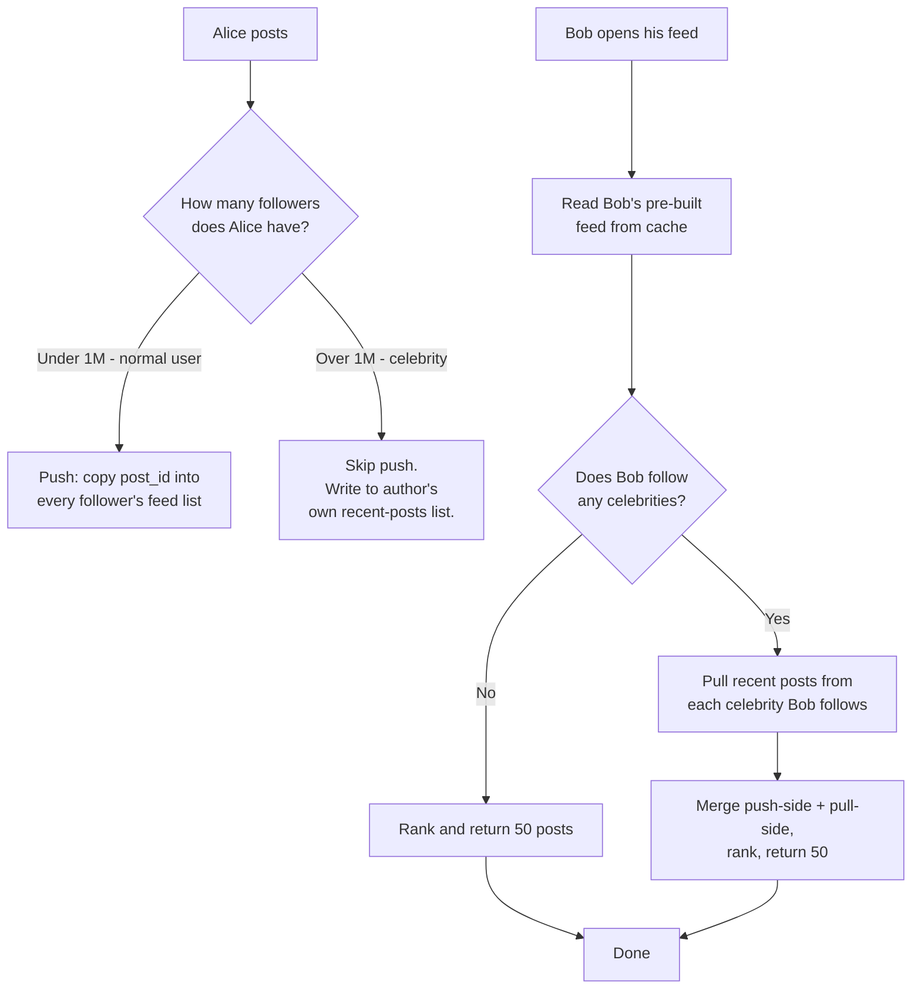

This is hybrid fan-out. Push for normal users; pull for celebrities at read time.

<details markdown="1">
<summary><b>Show: why each pure approach fails</b></summary>

| Approach | Read speed | Write cost | Breaks when |
|----------|------------|------------|-------------|
| **Push only** | ~10ms (cached) | One write per follower | A celebrity posts. 100M writes for one post. |
| **Pull only** | Slow, maybe 500ms | One write per post | A user follows 5,000 accounts: 5,000 reads per feed load. |
| **Hybrid** | ~10ms push + ~10ms celeb pull | Bounded: only push to non-celebrities | Edge cases at the threshold. |

Push fails because of celebrity math. Pull fails because of heavy followers. Hybrid takes the cheap path in each case.

The threshold (1M followers) is not fixed. A user with 800k followers who posts 50 times a day creates the same fan-out load as a celeb who rarely posts. A background job tunes the threshold per author based on `followers × post_rate`.

</details>

> **Take this with you.** This one decision shapes every other choice: the data stores, the worker pool, the read path. If you say "push for everyone" in the interview, the next 30 minutes go nowhere.

---

## Step 5: The smallest thing that works

Forget Twitter scale. We have 1,000 users and a single Postgres. One feed query. No workers.

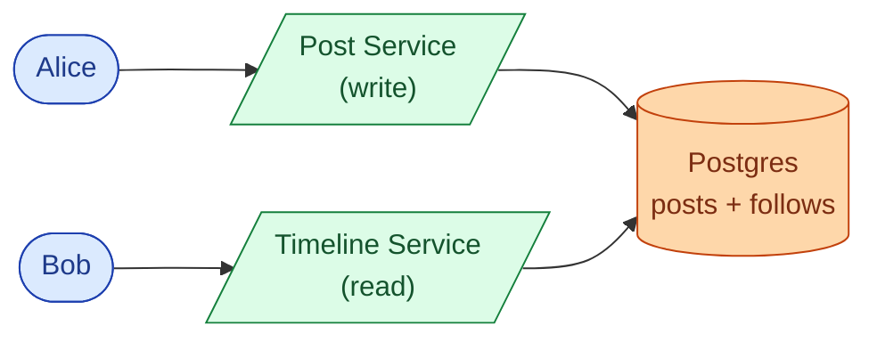

The feed query is a join:

```sql
SELECT p.*
  FROM posts p
  JOIN follows f ON f.followee_id = p.author_id
 WHERE f.follower_id = :user_id
 ORDER BY p.created_at DESC
 LIMIT 50;
```

Fine for 1,000 users. Starts to hurt at 100,000 when users follow 200+ accounts.


> **Take this with you.** Start here. The interesting interview question is what happens next, not what you build on day one.

---

## Step 6: The first crack

The app grows to 100,000 users. Carol follows 400 accounts. Her feed query now scans 400 author IDs, sorts by time, and consistently hits 800ms. Users are complaining.

The fix: stop computing the feed on every read. Compute it at write time instead. When Alice posts, write her post_id into each follower's pre-built feed list. When Bob reads, he gets a single cached list, not a join.

This is the push strategy. It moves work from the read path to the write path.

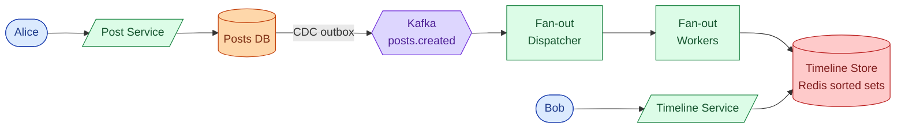

The timeline store is a Redis sorted set per user, keyed by `timeline:{user_id}`. Score is the post's creation timestamp. Members are `post_id`s. We keep the top 1,000 entries and trim on insert.

<details markdown="1">
<summary><b>Show: the Redis data shape</b></summary>

```
Key:    timeline:{user_id}
Type:   ZSET
Score:  created_at (unix ms)
Member: post_id (64-bit Snowflake ID)
Cap:    top 1,000 entries; ZREMRANGEBYRANK trims on insert
```

Insert: `ZADD timeline:bob <timestamp> <post_id>` then `ZREMRANGEBYRANK timeline:bob 0 -1001` to trim.

Read: `ZREVRANGE timeline:bob 0 199` returns 200 candidates in reverse time order.

One write per follower per post. One read per feed load. No joins.

</details>

> **Take this with you.** Pre-building feeds at write time is the single biggest performance unlock. It trades write amplification for sub-10ms reads.

---

## Step 7: Build the architecture, one layer at a time

We have push fan-out working. Now build the full system around it, one layer at a time.

### v1: post → push fan-out → cache → read

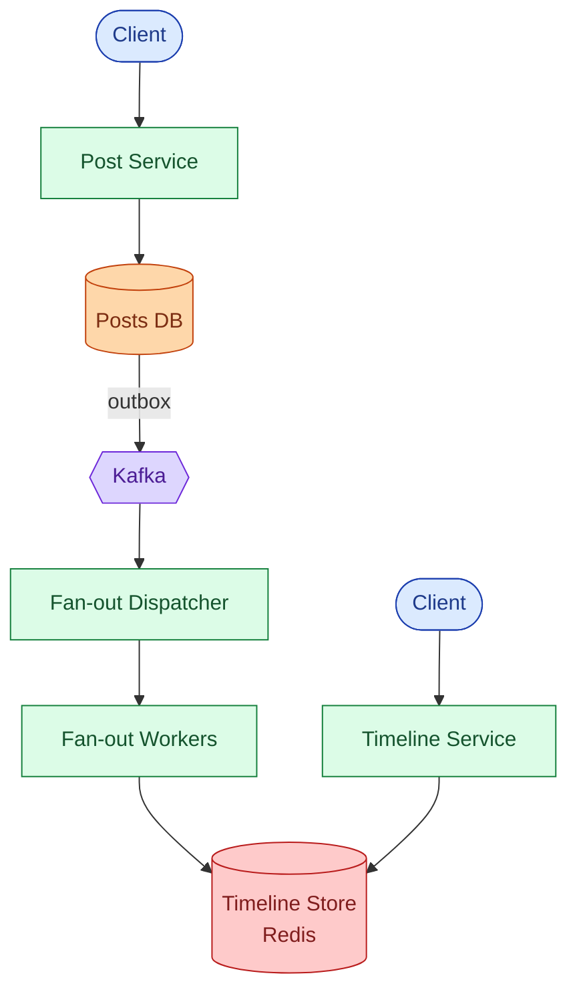

This handles one million users. But no celebrity handling yet.

### v2: add celebrity pull path

When Alice has 50M followers and posts, we skip push. Her post_id goes into `author_recent:{alice_id}`. When Bob opens his feed and follows Alice, the read path pulls from that list.

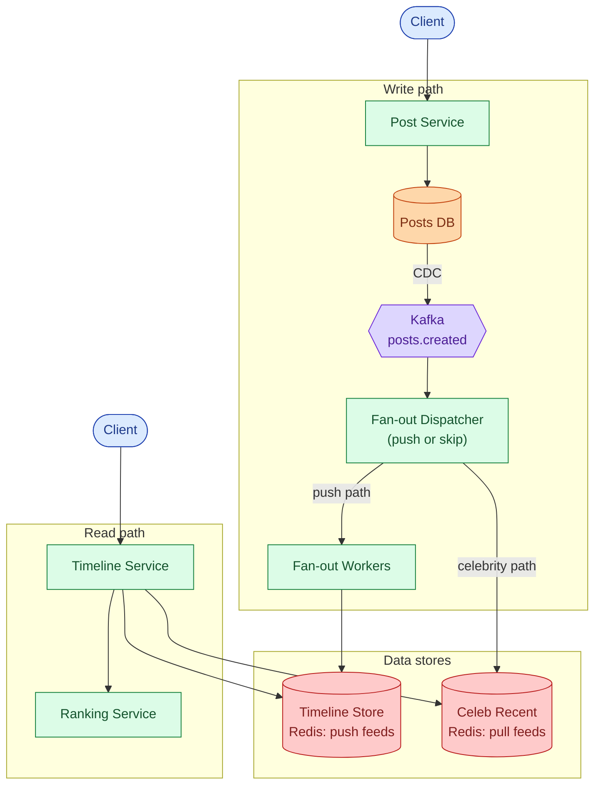

### v3: add API gateway and post hydration

Feed reads return `post_id`s from Redis. We need to hydrate them to full post content. Add a Post Service on the read path (batch lookup by post_id). Also add an API gateway for auth and rate limiting.

### v4: full architecture at Twitter scale

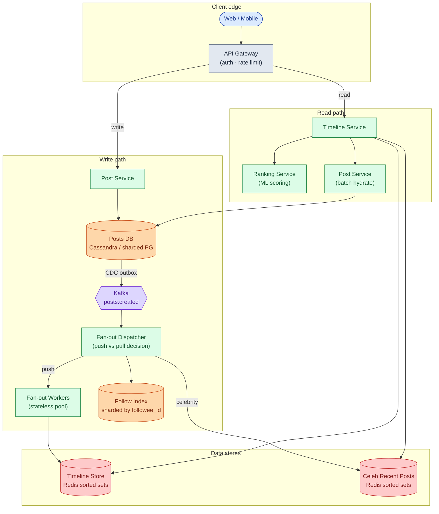

Each box, in one line:

| Box | What it does |
|-----|--------------|
| **API Gateway** | Authenticates callers, rate-limits bots, routes reads vs writes. |
| **Post Service** | Saves posts; returns full post content given a post_id. |
| **Posts DB** | Source of truth for post content. Sharded by post_id. |
| **Kafka** | Async buffer between writes and fan-out. Post creation never waits for fan-out. |
| **Fan-out Dispatcher** | Reads new post events; decides push vs celebrity-pull based on follower count. |
| **Follow Index** | Sharded by followee_id so "who follows Alice?" is one shard, not a scatter. |
| **Fan-out Workers** | Write post_ids into each follower's Redis sorted set. Auto-scale on queue lag. |
| **Timeline Store** | Pre-built feed per user. Redis sorted sets, trimmed to top 1,000 entries. |
| **Celeb Recent Posts** | Per-celebrity recent post_ids. Read at feed time by followers. |
| **Timeline Service** | Reads from both stores, merges, ranks, hydrates, returns. |
| **Ranking Service** | Stateless ML scoring. Takes ~500 candidates, returns scores. |

> **Take this with you.** Fan-out workers and the ranking service are both stateless. Any pod can die at any time. State lives in Kafka, Redis, and the databases.

---

## Step 8: One post and one feed read, end to end

**Posting:**

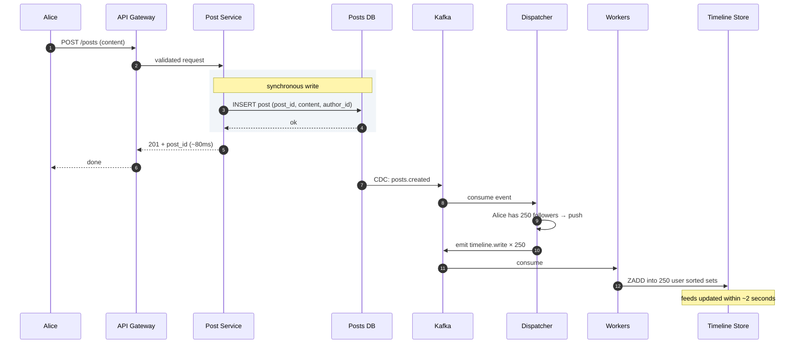

**Reading:**

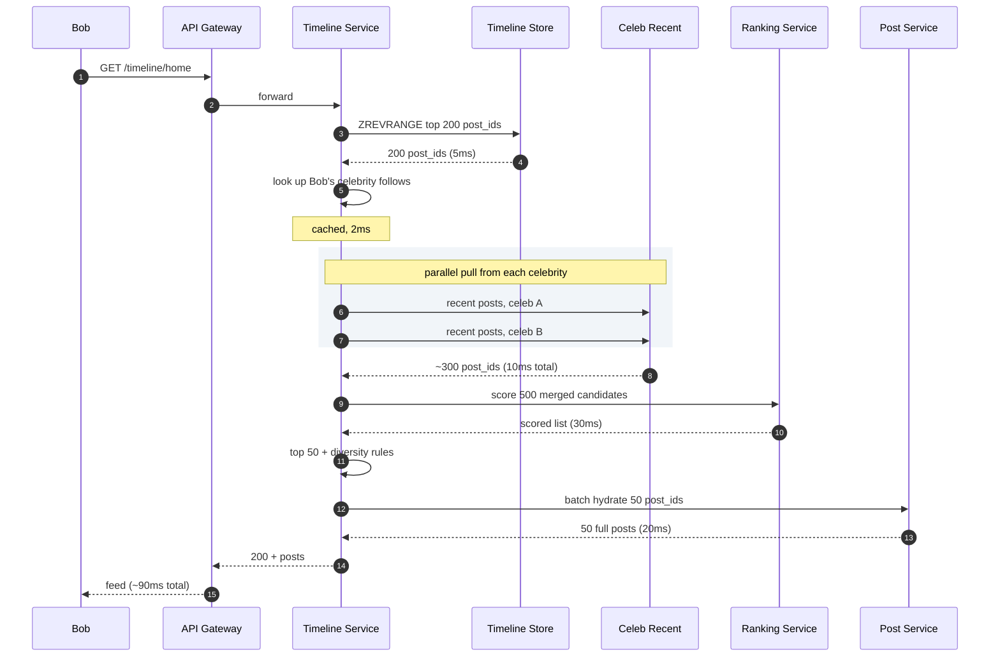

Two things worth pointing at:

1. The post creation returns a 201 before fan-out starts. Alice sees her own post via a client-side prepend, not by waiting for workers.
2. The read path always merges both sides. If Bob follows no celebrities, the pull side returns empty cheaply. No conditional logic needed.

---

## Step 9: Where does ranking live?

Modern feeds are not in time order. They rank by predicted engagement. Where does scoring happen?

<details markdown="1">
<summary><b>Show: why ranking belongs on the read path</b></summary>

Two choices: rank at write time (score posts when they fan out) or rank at read time (score candidates when the user opens the app).

Ranking lives on the read path. Three reasons.

**The model changes weekly.** The ML team ships a new version every Tuesday. If we ranked at write time, every model update means recomputing 300M pre-built feeds. Impossible.

**Some signals only exist at read time.** What did Bob click this morning? What is trending right now? The model uses these. They do not exist at write time.

**Ranking is cheap on a small set.** We score 500 candidates, not 1B posts. Scoring 500 items at read time takes ~30ms. That fits in a 200ms budget.

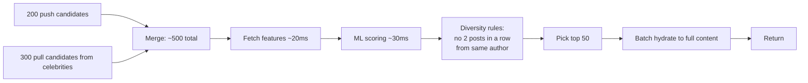

The ranking service is owned by the ML team. The timeline service just sends candidates and gets scores. Each team deploys independently.

</details>

> **Take this with you.** Pre-ranking sounds efficient but breaks every time the model updates. Score on the read path against a small candidate set.

---

## Step 10: Three users, one system

The same architecture handles three wildly different load patterns.

**A. Aisha posts a selfie.** She has 250 followers. Normal user.

**B. Elon posts.** He has 200M followers. Celebrity.

**C. Marcus opens his feed.** He follows 2,000 normal people and 30 celebrities.

<details markdown="1">
<summary><b>Show: what each case teaches</b></summary>

**A. Aisha posts (push path).**

- Post saved to Posts DB.
- `posts.created` event hits Kafka.
- Dispatcher: 250 followers, under threshold. Push.
- 250 tasks emitted to `timeline.write`.
- Workers do 250 ZADDs.
- Total time from Aisha posting to all follower feeds: ~2 seconds.

Common bug: dispatcher uses a cached follower count. Aisha gained 10 followers in the last minute. Those 10 miss this post in their pre-built feed. They see it when she posts next. Tolerable.

**B. Elon posts (celebrity path).**

- Post saved to Posts DB.
- `posts.created` event hits Kafka.
- Dispatcher: 200M followers, over threshold. Skip push.
- Write post_id into `author_recent:{elon}`. One write.
- Done in under 100ms.

No fan-out. Every Elon follower's next feed load does one extra Redis read for his recent posts. Cost shifts to read time, but it is a tiny Redis operation.

Common bug: threshold set too low. A user with 10,000 followers gets treated as a celebrity. Their followers now do an extra Redis pull per load for someone barely notable. Multiply across many borderline users and the pull side gets expensive.

**C. Marcus opens his feed (read path).**

- Read 200 post_ids from Marcus's Redis sorted set. 5ms.
- Look up Marcus's 30 celebrity follows. 2ms.
- Pull recent posts from each celebrity in parallel. 10ms total.
- Merge: ~500 candidates.
- Score with Ranking Service. 30ms.
- Hydrate top 50 post_ids to full content. 20ms.
- Return. ~90ms total.

Common bug: the hydrate step issues 50 sequential requests instead of one batch. 50 × 5ms = 250ms for hydration alone. Always batch.

</details>

---

## Follow-up questions

Try answering each in 2 or 3 sentences before opening the solution.

1. **User blocks another user.** Old posts from the blocked person might be in the blocker's pre-built feed. Do you scrub the feed, or filter at read time?

2. **User unfollows someone.** Their pre-built feed has that author's posts. Remove them right away, or let them age out?

3. **User deletes a post.** The post might be in 100 million pre-built feeds. How do you handle it? You cannot scrub 100M entries.

4. **New user signs up and follows 50 accounts.** Their feed is empty. How do you bootstrap it?

5. **Cold user.** A user has not opened the app for 30 days. Do you keep pushing to their feed every time someone they follow posts?

6. **Backfill on new follow.** I just followed someone. Do their last 10 posts show up in my feed right away, or do I have to wait for their next post?

7. **Live updates.** A new post lands while I am scrolling. Push it over WebSocket, or wait for pull-to-refresh?

8. **Pagination.** I scroll past 50 posts. How does the cursor work? What if one of the posts at the cursor has been deleted?

9. **One fan-out worker is doing 100x the work of others.** What is wrong? How do you fix it?

10. **CEO wants "you might like" injections.** Put 3 recommended posts at positions 5, 15, 25 of every feed. Where does this live in the pipeline?

11. **Repost (retweet).** A celebrity reposts my normal post. Does my post now have to fan out to the celebrity's 100M followers?

12. **Private account.** Someone's account is private. Their post should only reach approved followers. How does fan-out know?

13. **Replication lag.** I post. The post is in the primary DB but not the read replica yet. I open my own feed and don't see it. How do you fix it?

14. **Ad slot.** Position 4 of every feed is an ad. Where does the ad get picked? What happens if the ad service is down?

15. **Region failover.** US-East goes down. Users get routed to US-West. Their feeds are stale by a few minutes. What do they see?

---

## Related problems

- **[Chat System (003)](../003-chat-system/question.md).** Same fan-out and delivery problem. DMs are 1-to-1 fan-out instead of 1-to-many, but the patterns rhyme.
- **[Notification System (010)](../010-notification-system/question.md).** Same fan-out worker pattern, same celebrity problem when a popular account triggers notifications to millions.
- **[Distributed Cache (009)](../009-distributed-cache/question.md).** The timeline store leans hard on Redis. Know its limits.
- **[Typeahead (005)](../005-typeahead-autocomplete/question.md).** Both this problem and search use the "two-stage: candidate generation + ranking" pattern.


<div class="pr-solution-divider"></div>


## Solution: Design a News Feed (Twitter / Instagram)

### The short version

A news feed is a fan-out problem dressed as a read problem. When Alice posts, the system has to decide: write her post_id into every follower's pre-built feed list right now (push), or let each follower fetch her recent posts when they open the app (pull)?

Push is fast to read but explodes when someone has 100 million followers. Pull is cheap to write but chokes when someone follows 5,000 accounts. The answer is both: push for normal users, pull for celebrities. This is hybrid fan-out.

Around that core decision, three things matter most:

- Ranking lives on the read path, never pre-computed at write time.
- Deletes, blocks, and unfollows are handled by filtering at hydration time, not by scrubbing millions of feed lists.
- Stateless services, Kafka as the write-path buffer, Redis for hot feeds, Cassandra for cold.

The throughput numbers are not the hard part. 5,800 posts per second is medium load. The hard part is the six-orders-of-magnitude gap between an average user (100 followers) and a celebrity (100M followers).

---

### 1. The two questions that matter most

**What is the biggest user's follower count?** If the answer is 10,000, push everywhere and go home. If the answer is 100 million, you need hybrid fan-out and most of this design.

**Is the feed time-ordered or ranked?** If ranked, the read path has an extra ML scoring step. That step cannot live at write time because the model changes weekly and uses signals that only exist at the moment of reading.

Everything else (deletes, blocks, cold users, media, ads) follows from those two answers.

---

### 2. The math, in plain numbers

| Metric | Number |
|--------|--------|
| Daily active users | 300M |
| Posts/sec (steady) | ~5,800 |
| Posts/sec (peak) | ~17,000 |
| Feed loads/sec (steady) | ~35,000 |
| Feed loads/sec (peak) | ~100,000 |
| Naive push: timeline writes/sec | ~580,000 |
| One celebrity post (100M followers) | 100M writes |
| Storage for pre-built feeds (post_ids only) | ~6 TB |

The hard number is not any single one of these. It is the ratio between an average post (100 writes) and a celebrity post (100M writes): six orders of magnitude. No single fan-out strategy handles both.

Reads beat writes roughly 100 to 1. Most users scroll for an hour and post nothing. That ratio is what justifies pre-building feeds even at this scale.

---

### 3. The API

Two endpoints carry the whole product.

```
GET /api/v1/timeline/home?cursor=<opaque>&limit=50
Authorization: Bearer <token>

Response 200:
{
  "posts": [
    {
      "id": "1234567890",
      "author": { "id": "u42", "handle": "@aisha" },
      "content": "Hello world",
      "created_at": "2026-05-20T10:00:00Z",
      "likes": 42,
      "media": []
    }
  ],
  "next_cursor": "<opaque>"
}
```

The cursor is opaque on purpose. Inside it encodes `(last_seen_score, last_seen_post_id)`. We can change pagination scheme without breaking clients.

```
POST /api/v1/posts
{
  "content": "Hello",
  "media_ids": ["mid1", "mid2"]    -- uploaded separately via media service
}

Response 201:
{ "post_id": "1234567890", "created_at": "..." }
```

Three small but load-bearing choices:

- Return 201 as soon as the post is durably saved. Fan-out happens after. Alice sees her own post via a client-side prepend, not by waiting for workers.
- Snowflake-style post_id: globally unique without coordination, sortable by time, 64 bits.
- Cursor encodes a score, not an offset. Offset pagination breaks when posts are inserted or deleted between requests.

Status codes: **410 Gone** when a hydrated post was deleted (filter client-side). **429** if a user is posting too fast.

---

### 4. The data model

Five things to store. Two big, three small.

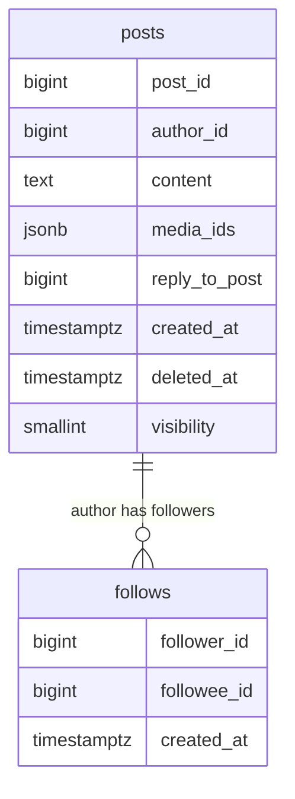

Plus two Redis shapes (not relational):

- `timeline:{user_id}` - ZSET, score = created_at ms, member = post_id, capped at 1,000.
- `author_recent:{author_id}` - ZSET, score = created_at ms, member = post_id, capped at 50.

<details markdown="1">
<summary><b>Show: the full SQL</b></summary>

```sql
CREATE TABLE posts (
    post_id          BIGINT PRIMARY KEY,        -- Snowflake: ts + shard + seq
    author_id        BIGINT NOT NULL,
    content          TEXT NOT NULL,
    media_ids        JSONB,
    reply_to_post    BIGINT,
    repost_of_post   BIGINT,
    created_at       TIMESTAMPTZ NOT NULL,
    deleted_at       TIMESTAMPTZ,               -- soft delete; never hard-delete
    visibility       SMALLINT NOT NULL DEFAULT 1  -- 1=public, 2=followers, 3=private
);
CREATE INDEX idx_author_created
    ON posts (author_id, created_at DESC)
    WHERE deleted_at IS NULL;

CREATE TABLE follows (
    follower_id   BIGINT NOT NULL,
    followee_id   BIGINT NOT NULL,
    created_at    TIMESTAMPTZ NOT NULL,
    PRIMARY KEY (follower_id, followee_id)
);
CREATE INDEX idx_followee ON follows (followee_id);
-- Also keep a reverse table sharded by followee_id so
-- "who follows Elon?" is one shard lookup, not a scatter.
```

</details>

Three small things doing real work:

**Soft delete on posts.** When Alice deletes a post, we set `deleted_at`. We do not scrub the post_id from millions of feed lists. The hydration step skips posts with `deleted_at IS NOT NULL`. Cache entries fade away as new posts push them out.

**Snowflake post_id.** Sortable by time but not centrally coordinated. Different shards mint IDs in parallel.

**Reverse follow index.** Without it, "who follows Elon?" is a scatter across all shards. With it, one shard answers. Cost: one extra async write per follow action.

> **Why Cassandra (or sharded Postgres) for posts.** Posts are append-only. Hot reads are by post_id. Write throughput matters. Cassandra wins on raw write throughput. Postgres wins on tooling. Either works; choose based on team familiarity.

> **Why Redis sorted sets for timelines.** ZADD is O(log N). ZREMRANGEBYRANK trims to top 1,000. ZREVRANGE returns top N. Three operations, three Redis commands. The shape is exact.

---

### 5. The engine: hybrid fan-out

Two functions. Write path and read path.

<details markdown="1">
<summary><b>Show: the fan-out logic</b></summary>

```python
CELEBRITY_THRESHOLD = 1_000_000   # tunable per author by background job

def on_post(post):
    follower_count = follow_index.follower_count(post.author_id)

    if follower_count <= CELEBRITY_THRESHOLD:
        # Push path. Stream followers in batches to stay memory-bounded.
        for batch in follow_index.stream_followers(post.author_id, batch_size=10_000):
            timeline_writer.enqueue_batch(batch, post.id, score=post.created_at)
    else:
        # Celebrity path. Write to author's own recent list. One write.
        author_recent.zadd(post.author_id, post.id, score=post.created_at)
        author_recent.trim(post.author_id, keep=50)


def get_timeline(user_id, cursor=None, limit=50):
    # Push side: pre-built feed
    pushed = timeline_store.zrevrange(user_id, 0, 199)   # 200 candidates

    # Pull side: celebrity authors this user follows
    celeb_authors = follow_index.get_celebrities_followed(user_id)  # cached
    pulled = []
    for author in celeb_authors:
        pulled.extend(author_recent.zrevrange(author, 0, 19))  # parallel in prod

    # Merge, dedupe, score
    candidates = dedupe(pushed + pulled)
    features = feature_store.batch_get(user_id, candidates)
    scores = ranker.score(user_id, candidates, features)

    # Pick top 50, apply diversity rules, hydrate
    ranked = pick_top_with_diversity(candidates, scores, limit)
    posts = post_service.batch_get(ranked, filter_deleted=True)
    return posts, next_cursor(posts)
```

</details>

Three things make this safe at scale:

The write path streams followers in batches of 10,000. Loading 1M follower IDs into memory at once would OOM the dispatcher. Streaming keeps memory flat.

Fan-out workers are idempotent. `ZADD` with the same `(member, score)` twice is a no-op. If a worker crashes mid-batch and replays, no duplicates land in feeds.

The read path always merges both sides. If Bob follows zero celebrities, the pull side returns an empty list cheaply. No branching needed.

> **Why the threshold is per-author, not global.** A user with 800k followers who posts 100 times a day creates more fan-out than a user with 5M followers who posts once a week. A background job tunes the threshold per author based on `followers × daily_post_rate`.

---

### 6. The architecture

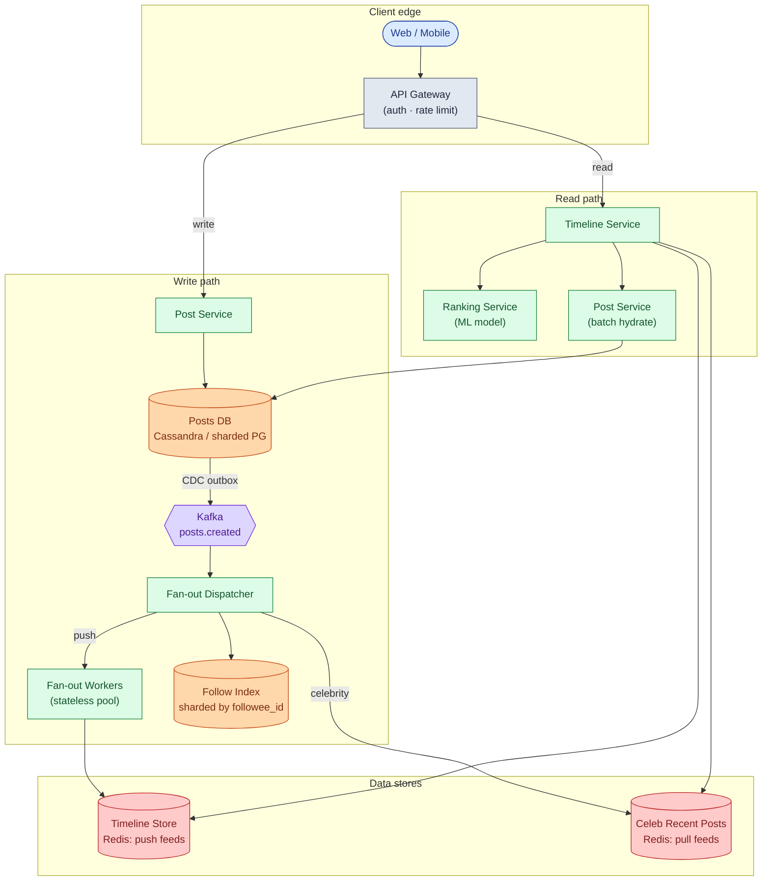

Five things to notice:

- The write path is async after Kafka. Alice gets a 201 in ~80ms. Fan-out happens behind the scenes. If workers fall behind, posts still get created; feeds just take longer to update.
- The read path never touches Posts DB for the feed list. It reads post_ids from Redis, then hydrates from Post Service. Posts DB sees one batch call per feed load, not 50.
- Ranking is its own service. The ML team deploys it on their own cadence. The Timeline Service sends candidates and gets scores back.
- Engine pods are stateless. Roll them any time. State lives in Kafka, Redis, and the databases.

---

### 7. A request, end to end

**Posting:**

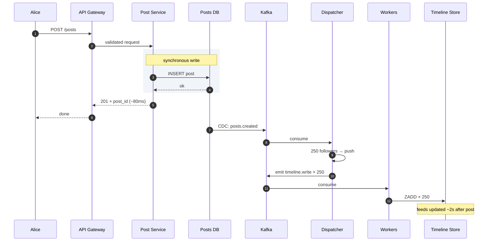

**Reading:**

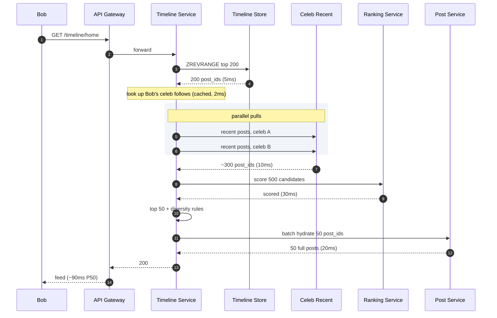

Target latencies:

| Operation | P50 | P99 |
|-----------|-----|-----|
| Create post | ~80ms | ~150ms |
| Read feed | ~90ms | ~200ms |
| Post to all follower feeds | ~2s | ~10s (for normal user) |

---

### 8. The scaling journey: 1,000 users to 300M

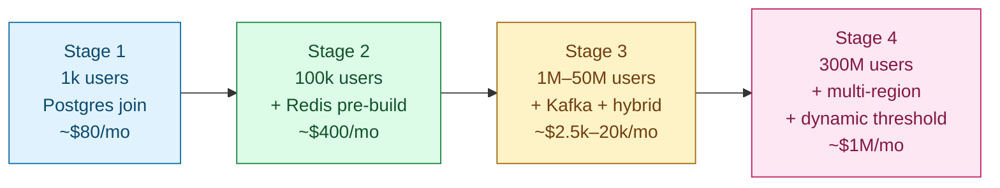

#### Stage 1: 1,000 users

One Postgres. One app instance. Feed is a `SELECT posts JOIN follows ORDER BY created_at LIMIT 50`. No cache, no queue, time-order only. ~$80/month.

Fine because feed loads run in ~50ms when followed sets are small. Adding more is over-engineering.

#### Stage 2: 100,000 users

Something breaks: Carol follows 400 accounts. Her feed query now consistently hits 800ms. Postgres sorts by time across 400 author IDs.

Add Redis pre-built feeds. When Alice posts, write post_id into each follower's sorted set. Feed reads become a ZREVRANGE. Down to ~20ms. Posts appear in follower feeds within ~1 second. Still one Postgres. No Kafka yet. Fan-out is synchronous on the post write path. ~$400/month.

#### Stage 3: 1M to 50M users

Several things break at once: a popular user with 500k followers makes post creation block for 30 seconds (synchronous fan-out). Postgres write throughput is a bottleneck. The first celebrity user with 2M followers arrives.

Fixes: move fan-out async behind Kafka. Shard Posts DB by post_id (4 shards). Bring in the hybrid fan-out dispatcher. The celebrity path goes live. About $2,500-$20,000/month depending on scale within this range.

Ranking also launches here. The ML team adds a Ranking Service. Timeline Service sends 500 candidates, gets scores. ~30ms added to feed reads.

#### Stage 4: 300M users

New problems: top celebrity has 100M followers. EU operations open and EU user data must stay in EU. One influencer gains 50M followers in a week, temporarily overwhelming the static threshold. 35,000 feed reads per second at peak.

Fixes: dynamic threshold per author, tuned hourly by a background job. 64 Redis shards for timelines. 200 fan-out worker pods at peak. Full multi-region stack per region. Cold users (inactive over 7 days) evicted from Redis; feeds rebuild on return. ~$1M/month, ~30 engineers.

#### What you would do at 10x scale

Federated timeline stores per region. Streaming ranking (continuously updating candidate sets rather than rebuilding per read). Edge-cached feeds for global sub-50ms P99. These are optimizations on the same shape, not new architecture.

---

### 9. Reliability

**Posts DB shard failure.** Posts for that shard are unavailable. The Kafka consumer for that shard pauses at its current offset. When the shard recovers, the consumer resumes. No data loss.

**Timeline cache shard failure.** Reads for users in that shard fall through to Cassandra (cold path). Slower (~200ms) but correct.

**Fan-out worker crash.** Another worker picks up the Kafka message. ZADD is idempotent, so replay is safe.

**Ranking service failure.** Timeline Service falls back to time-order on the candidate set. Quality drops; the feed still works.

**Kafka fully down.** Post creation continues (posts saved to DB). Fan-out pauses. Feeds go stale. When Kafka recovers, consumers resume from stored offsets.

**Regional failure.** Global LB routes to another region. Users see a feed stale by a few minutes (last replicated state). Most won't notice.

---

### 10. Observability

| Metric | Why it matters |
|--------|----------------|
| `timeline.read.p99` by region | Headline SLO. Should stay under 200ms. |
| `timeline.candidate_count.p50` | If under 100, ranking quality drops. Cold users or sparse graph. |
| `fanout.queue_depth` | Leading sign of stale feeds. Page if above 1M. |
| `fanout.write_lag_p99` | Time from post event to feed ZADD. Target under 5s. |
| `fanout.celebrity_threshold` | Auto-tuned per author. Alert if it swings hard. |
| `ranking.latency_p99` | Should stay under 50ms. |
| `cache.hit_rate` (timeline, post, feature) | A cascade of misses means a bad day. |
| `post.creation_rate` | Sudden drop signals auth or DB broken. |
| `cold_user.rebuild.rate` | High rate means users returning after long breaks. |

**Page on:** timeline P99 above 500ms for 5 minutes. Fan-out lag above 30 seconds. Ranking error rate above 1%.

**Ticket on:** celebrity threshold large change. Cache hit rate dropping more than 5 points.

---

### 11. Follow-up answers

**1. User blocks another user.**

Filter at read time, not write time. Keep a `blocked:{user_id}` Redis set. On every feed read, filter candidate post_ids against this set before ranking.

Cost: ~0.5ms for 500 candidates. Eager scrubbing of the pre-built feed sounds thorough but does not cover celebrity posts on the pull path. Filter at read covers both push and pull, and avoids the class of bugs where a block partially clears history.

Also apply the filter to `reply_to_post` when hydrating. Otherwise quoted replies from the blocked user still leak through.

**2. User unfollows someone.**

Lazy. Let those posts age out as new ones push them down. Active users see the person gone within a day or two.

Eager scrubbing means reading all 1,000 entries in the sorted set, finding ones from that author, and removing them: ~10ms per unfollow, and it does nothing for the celebrity pull path. Not worth it. Same logic applies to mute.

**3. Post deletion when the post is in 100M feeds.**

Do not scrub. 100M ZREMs is not feasible.

Set `deleted_at` in Posts DB. At hydration time, skip any post where `deleted_at IS NOT NULL`. Cache entries fade naturally as new posts push them out. This is why we store post_ids in the feed cache, not content. Lazy filtering at hydration is free. If we stored content, we would have to scrub 100M entries on every delete.

**4. New user signs up and follows 50 accounts.**

Bootstrap the feed once during signup:

<details markdown="1">
<summary><b>Show: bootstrap function</b></summary>

```python
def bootstrap_feed(new_user_id, followee_ids):
    candidates = []
    for f in followee_ids:            # run in parallel
        candidates.extend(post_index.recent(f, 20))
    candidates.sort(key=lambda p: p.created_at, reverse=True)
    timeline_store.zadd_bulk(new_user_id, candidates[:200])
```

</details>

Takes ~100ms. By the time onboarding finishes, the feed has content. Celebrities in the followee list are handled by the normal pull path on the first feed read.

**5. Cold users.**

Stop pushing to users inactive for 30 days. Three steps:

- Dispatcher checks "is this follower warm?" before emitting a task. Cold users skipped.
- Move their Redis entry to Cassandra after 7 days of inactivity.
- On return, schedule a rebuild: read recent posts from their followees and repopulate Redis.

This saves roughly half of Redis memory and a large chunk of fan-out work. Most user bases are 40-60% cold at any given time.

**6. Backfill on new follow.**

Yes. When Bob follows Alice, fetch Alice's last ~10 posts and ZADD them into Bob's sorted set with the correct scores. Do this in the follow request's response path. Takes ~10ms.

Without this, the follow feels broken. Bob added someone and saw nothing change.

If Alice is a celebrity: she is never in Bob's pre-built feed by design. The first feed read pulls her recent posts through the celebrity path. No special code needed.

**7. Live updates.**

For most apps: pull-to-refresh. Simple, no extra infrastructure.

For Twitter-style real-time feel: a WebSocket channel pushes lightweight notifications ("3 new posts available"). The user taps to load. The WebSocket carries counts, not full post content. The full feed reload still goes through the normal read path.

Pushing full posts over WebSocket doubles the work. The browser already has a fast feed endpoint.

**8. Pagination.**

Cursor on `(score, post_id)`. Score is post creation timestamp. Post_id breaks ties for posts at exactly the same millisecond. The request returns posts strictly older than that cursor.

If the post at the cursor was deleted: fine. The cursor is a position, not a reference. Deeper than 500 posts, ranking quality degrades in ways the cursor cannot represent. Accept this; nobody scrolls that deep.

**9. One fan-out worker doing 100x the work.**

Diagnose in order:

1. **Hot partition.** Workers consume one Kafka partition each. If partitioned by `author_id` and one author lands on the same partition, it gets uneven load. Repartition by `(post_id, follower_id_hash)` to spread hot authors.
2. **Duplicate consumer.** Two pods accidentally consuming the same partition. Look for duplicate ZADDs in the timeline store. Check Kafka consumer group health.
3. **Borderline celebrity.** A user with 900k followers, just under the threshold. Their fan-out fills one worker. Lower the threshold or raise them to the celebrity path.
4. **Slow task type.** A specific kind of write is taking longer than usual. Look at task latency by author fan-out tier.

The senior answer covers all four. The mid-level answer only says "rebalance the consumer group."

**10. "You might like" injections.**

After ranking but before returning, call the recommendation service in parallel with the existing feed fetch:

<details markdown="1">
<summary><b>Show: injection logic</b></summary>

```python
def get_timeline_with_recommendations(user_id):
    organic = get_timeline(user_id)         # existing 50 posts
    recs = rec_service.get(user_id, 3)      # parallel call, 30ms budget
    return inject(organic, recs, positions=[5, 15, 25])
```

</details>

Latency cost: ~30ms parallel call. If the rec service times out, serve the organic feed unchanged.

Quality risk: recommended content is usually less relevant than organic. A/B test before rolling out; measure dwell time and scroll depth on injected positions. This is also where ads go: same injection pattern, same timeout rule.

**11. Celebrity reposts my normal post.**

The repost is the celebrity's content (a pointer to my original post). It goes through the celebrity's normal path: skip push, write to their recent posts list. When the celebrity's followers load their feed, the pull path returns the repost, which hydrates to show my original post with a "reposted by" header.

My post reaches 200M people without a single extra timeline write. The fan-out decision is based on the reposter's follower count, not the original author's.

**12. Private account.**

Follow requests to private accounts require approval before being recorded in the `follows` table. The fan-out dispatcher reads from `follows`, so push only reaches approved followers. On the celebrity pull path, the Timeline Service checks "is this viewer an approved follower of this private account?" before merging. Check is cached per `(viewer, author)` with a short TTL.

**13. Replication lag on my own post.**

Two fixes, usually both:

- **Optimistic client prepend.** The client inserts the post locally as soon as the 201 comes back. The user sees it instantly. The server's feed catches up within a second.
- **Read-your-writes routing.** For the requester's own feed, route reads to the primary for ~5 seconds after a post. Cookie-based stickiness. After 5 seconds, fall back to replicas.

**14. Ad in position 4.**

The Timeline Service calls the Ad Service after ranking, in parallel. If the Ad Service is down or exceeds a 50ms timeout, skip the slot and show the organic post at position 4. Lose revenue for that minute; do not fail the feed load. The ad slot is enhancement, not requirement.

**15. Region failover.**

US-East goes down. Global LB routes affected users to US-West.

US-West has its own copy of the timeline store but has not received the last few minutes of writes from US-East. Users see a feed stale by 2-5 minutes. They see all posts before the failure, nothing from the failure window. If they post during the failure, the post is stored in US-West and fans out locally. When US-East recovers, cross-region replication catches up.

Most users will not notice. Those who do see "the feed isn't updating." Acceptable for a full region failure.

---

### 12. Trade-offs worth saying out loud

**Why not pre-rank.** Pre-ranking means recomputing 300M feeds every time the model updates (weekly). On the read path, ranking touches 500 candidates per request. The math forces ranking to live at read time.

**Why not adaptive push/pull per request.** We choose push vs pull per author, not per feed read. Per-request would be marginally more precise but adds complexity for small gain. Static-per-author with a dynamically tuned threshold is the right balance.

**Why separate post content from timeline entries.** Posts are ~500 bytes. Timeline entries are 20 bytes (just post_id). Storing content in 100M feed lists bloats memory by 25x. Store post_ids; hydrate at read.

**Why Redis sorted sets and not lists.** Sorted sets give ranked insertion by timestamp, efficient top-N reads, and trim-to-N. All three Redis commands. Lists would need manual ordered insertion.

**Why Kafka and not direct calls.** Fan-out is async. If the dispatcher called workers directly, a slow worker would block the post creation path. Kafka decouples them. If workers are slow, the queue grows; posts still get created.

---

### 13. Common mistakes

**"Just push to every follower."** Fails the celebrity math immediately. 100M writes per post is not feasible.

**"Just pull at read time."** Fails for users who follow 5,000 accounts. 5,000 reads per feed load will not fit in a 200ms budget.

**No ranking.** Modern feeds score by engagement. Describing a purely chronological feed in 2026 signals you haven't used these products.

**Storing post content in the feed cache.** Bloats memory by 25x. Also makes deletion impossible to handle cleanly. Store post_ids; hydrate at read.

**Ignoring deletes.** "What happens when a post in 100M feeds is deleted?" Lazy filter at hydration time. If you cannot answer this, you have not thought through the read path.

**No mention of blocks or mutes.** Filter at read time. Both push and pull paths go through hydration, so one filter covers both.

**Sequential reads in fan-in.** If you describe the celebrity pull as "loop over followees, fetch posts one by one," you get 30-second feeds. Parallel matters.

**Treating notifications as part of the feed.** The feed is the home timeline. Notifications are a different product that consumes the same events.

**Forgetting read-your-writes.** Post, open feed, don't see your own post. Either client-side prepend or sticky reads. Otherwise the app feels broken.

**"I'll just add a cache."** Which cache? What is the eviction policy? What is the target hit rate? The answer needs to be specific.

If you hit eight of these without prompting, you are interviewing at staff level. The three that separate strong from average: hybrid fan-out (not push or pull alone), ranking on the read path (not precomputed), and lazy delete via post_id hydration. Those are what a senior architect listens for.

