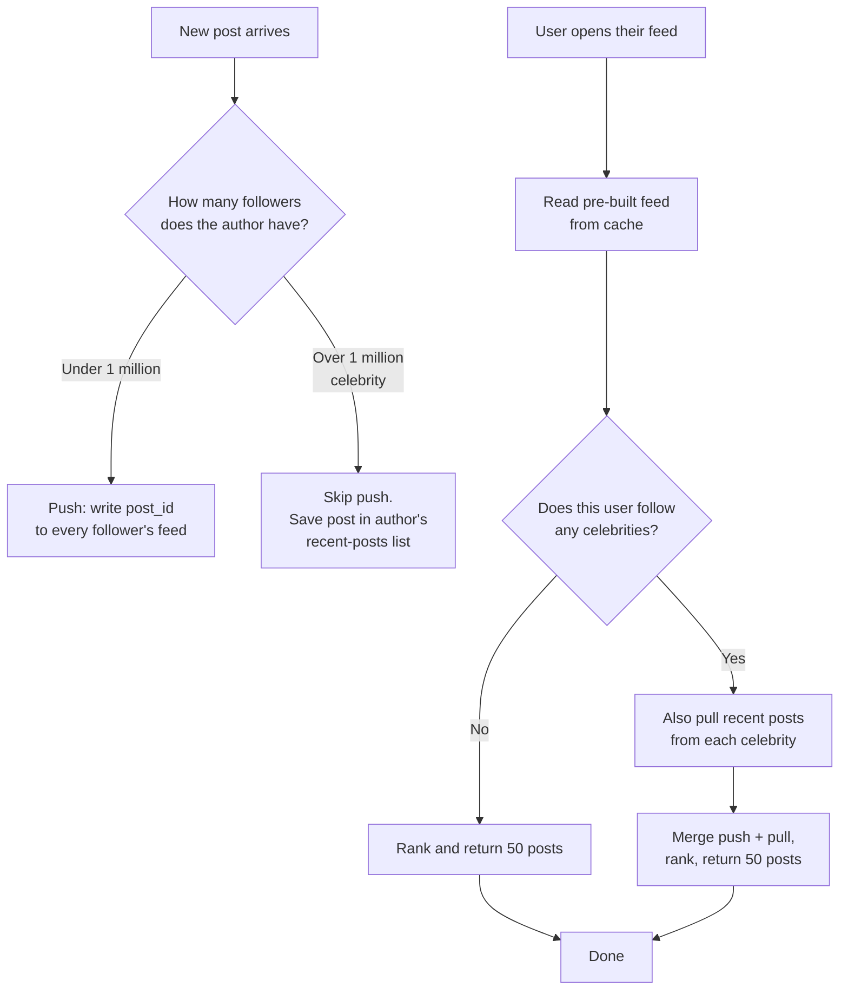
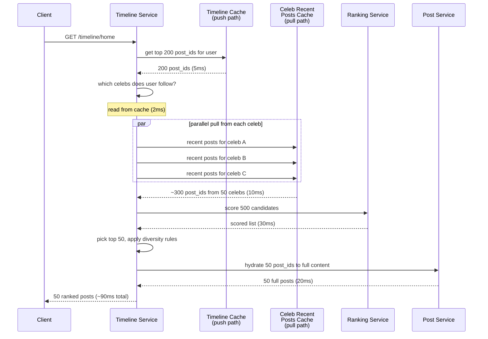
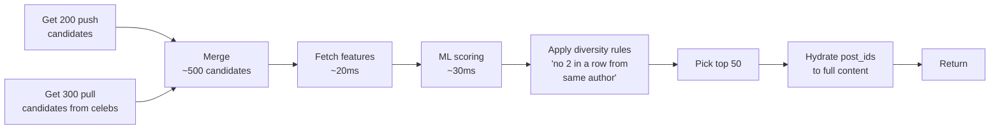
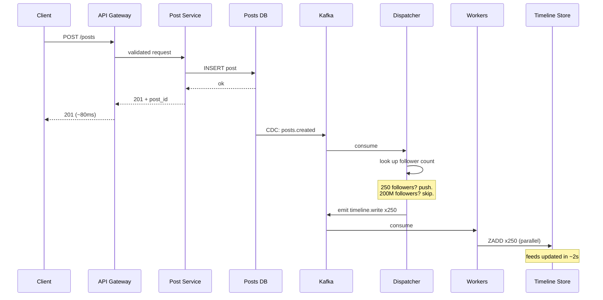
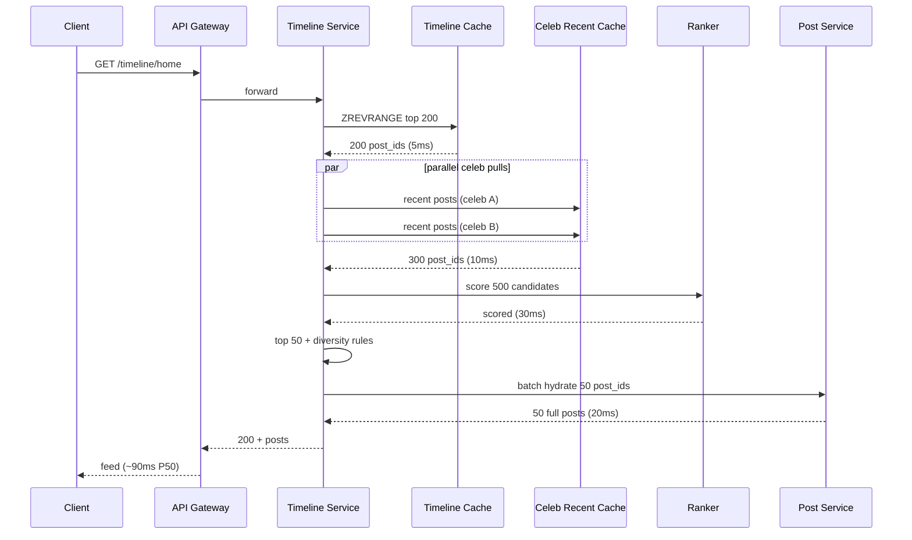


## The scene

You sit down. The interviewer slides a sheet of paper across the table.

> *"Design Twitter. Not the whole thing. Just the home feed. You know, the list of posts from people you follow. Walk me through it."*

Then they lean back and add: *"Start simple. A small app with 1,000 users. Then we'll grow it. By the end I want to see how it works at 300 million users."*

It looks like a simple list problem. It is not. The trap is the word "feed." It sounds like a query. The real question is hidden: what happens when one person has 100 million followers? How do you show a fresh feed in less than 200ms? How do you stop one celebrity's post from melting the whole system?

We will walk this from a 1,000-user app to a Twitter-sized service. At each step we will name what breaks first. Then we will add the smallest fix that solves it.

---

## Step 1: Ask the right questions

Before you draw anything, sit for five minutes. Write down the questions you would ask.

A good answer is not "20 questions about every detail." It is the small handful of questions that change the design if the answer is different.

<details markdown="1">
<summary><b>Show: 8 questions that matter</b></summary>

1. **How big is the biggest user?** Median user has maybe 100 followers. But what about the top user? 1 million? 100 million? *(This single number decides the whole design. If the biggest user has 1,000 followers, you can push to everyone. If they have 100 million, you can't.)*
2. **Is the feed in time order, or ranked by an algorithm?** Old Twitter was time order. New Twitter, Instagram, Facebook are all ranked by a machine learning model. Ranking adds a step on the read path.
3. **How fast must the feed load?** Sub-200ms is the bar. Anything slower feels broken.
4. **How many reads per write?** Posts are rare. Feed reads are constant. About 100 reads per post is normal. That changes the design a lot.
5. **How fresh must it be?** Does my own post need to show up instantly in my feed? (Yes.) Can my friend's post take 5 seconds to reach me? (Usually yes.)
6. **Are posts text only, or with images and video?** Media needs a CDN, thumbnails, and an upload pipeline. We will note it but focus on the feed.
7. **Are notifications part of this design?** Say no. The feed is one product. Notifications are a different product that listens to the same events.
8. **Do we show only posts from people I follow, or also "you might like"?** Recommendations add an injection step in the read path.

A strong candidate also asks the meta question: *"Is the biggest user 1 million followers or 100 million?"* The answer changes everything.

</details>

---

## Step 2: How big is this thing?

Same problem, three sizes. Do the math at each.

**Inputs from the interviewer:**

- 300 million daily active users
- Median user has 100 followers
- Heavy users have 1 million followers
- Top users (celebrities) have 100 million followers
- 500 million posts per day
- Each user opens the app 10 times per day
- Feed shows the latest 50 posts

Try to compute:

1. Posts per second
2. Feed loads per second
3. How many "timeline writes" happen if we push every post to every follower
4. What happens when one celebrity posts

<details markdown="1">
<summary><b>Show: the math</b></summary>

**Posts per second.**
500M / 86,400 seconds ≈ **5,800 posts/sec on average**. Peak is 3x → about **17,000 posts/sec**.

**Feed loads per second.**
300M users × 10 loads = 3 billion loads/day → about **35,000 loads/sec** on average. Peak about **100,000/sec**.

**Naive push: write every post to every follower's feed.**
On average, each post goes to 100 followers. 5,800 × 100 = **580,000 timeline writes per second**. That is a lot, but it fits.

**One celebrity post.**
One post by a user with 100 million followers = 100 million timeline writes. For one post. If that user posts once per second, that is 100 million writes per second from one person.

This is what breaks the system. The fan-out worker queue grows forever. Replication falls behind. Other users see slow feeds.

**Storage for ready-made feeds.**
300M users × 1,000 posts per feed × 50 bytes per entry = **15 TB**. Spread across many shards, this fits.

**What the math tells you:**

The big number is not posts per second. It is not feed loads per second. It is the gap between an average user (100 followers) and the top user (100 million). That gap is 1 million times. No single design works for both. The whole architecture exists to handle that gap.

</details>

---

## Step 3: The big decision: push, pull, or both?

This is the heart of the problem. Before drawing any boxes, decide your approach.

You have three options:

- **Push (write everywhere).** When I post, copy the post into every follower's ready-made feed list. Reads are fast. Writes can be huge.
- **Pull (read everywhere).** When you open your feed, ask every person you follow for their recent posts. Merge them. Writes are tiny. Reads can be slow.
- **Hybrid (mix).** Push for normal users. Pull for celebrities.

Think about it with this flowchart:



<details markdown="1">
<summary><b>Show: side-by-side comparison</b></summary>

| Approach | Read speed | Write cost | Breaks when |
|----------|------------|------------|-------------|
| Push only | ~10ms (cached) | One write per follower | A celebrity posts. 100M writes for one post crushes the system. |
| Pull only | Slow. Maybe 500ms for active users | One write per post | A user follows 5,000 people. Their feed needs 5,000 reads. |
| Hybrid | ~10ms for most. A bit more for people who follow celebrities. | Bounded. Push only for non-celebrities. | Edge cases at the boundary: who counts as a celebrity? |

**Why hybrid wins.**

The math forces it. Push fails for celebrities (100M writes per post). Pull fails for users who follow many people (5,000 reads per feed load). Hybrid takes the cheap path for each case.

- Normal user posts (median 100 followers) → push. Cheap.
- Celebrity posts (over 1M followers) → no push. Save in their own "recent posts" list.
- User opens feed → read their pre-built feed AND pull from any celebrities they follow. Merge.

The threshold (1M followers) is not fixed. Set it lower for users who post often (high posts × high followers = same load). Set it higher for users who rarely post. A background job tunes it.

> **Why this matters.** This decision shapes every other choice. Database, cache, worker pool, all of it. If you say "push for everyone," the next 30 minutes go nowhere.

</details>

---

## Step 4: Draw the system

Now draw the boxes. Try to fill in the missing pieces below. Five boxes are missing. Think about: where posts get stored, what runs the push fan-out, where the ready-made feeds live, who reads them, and who does the merge.

```
            Client (mobile, web)
                   |
                   v
            +---------------+
            |  API Gateway  |  auth, rate limit
            +-+----------+--+
   read       |          |       write (post)
              |          |
              v          v
        +-----------+  +-----------+
        |   [ ? ]   |  |   Post    |  stores posts in main DB
        |  (reads)  |  |  Service  |
        +-----+-----+  +-----+-----+
              |              |
              |              v
              |        +------------+
              |        |   [ ? ]    |  reads new post,
              |        | (dispatch) |  decides push vs pull
              |        +-----+------+
              |              |
              |              v
              |        +------------+
              |        |   [ ? ]    |  workers that write into
              |        | (workers)  |  each follower's feed list
              |        +-----+------+
              |              |
              v              v
        +-------------------------+
        |   [ ? ]                  |  pre-built feeds.
        |   per-user list of       |  Hot users in Redis,
        |   recent post_ids        |  cold in Cassandra.
        +-------------------------+

        Separately, for celebrities:
        +-------------------------+
        |   [ ? ]                  |  per-author recent posts.
        |                          |  Read at feed time.
        +-------------------------+
```

<details markdown="1">
<summary><b>Show: the full architecture</b></summary>

```
            Client (mobile, web)
                   |
                   v
            +---------------+
            |  API Gateway  |  auth, rate limit
            +-+----------+--+
   read       |          |       write (post)
              |          |
              v          v
        +-----------+  +-----------+
        | Timeline  |  |   Post    |  Main store for posts.
        | Service   |  |  Service  |  Sharded by post_id.
        | (reads)   |  +-----+-----+
        +-----+-----+        |
              |              v
              |        +----------------+
              |        |   Posts DB     |  Cassandra or sharded
              |        |                |  Postgres.
              |        +-------+--------+
              |                |
              |                | CDC / outbox
              |                v
              |        +----------------+
              |        | Kafka topic:   |
              |        | posts.created  |
              |        +-------+--------+
              |                |
              |                v
              |        +----------------+
              |        |  Fan-out       |  Reads new post.
              |        |  Dispatcher    |  Author < 1M followers?
              |        +-------+--------+  Push. Else skip.
              |                |
              |                v
              |        +----------------+
              |        | Kafka topic:   |  One message per follower.
              |        | timeline.write |
              |        +-------+--------+
              |                |
              |                v
              |        +----------------+
              |        |  Fan-out       |  Stateless pool.
              |        |  Workers       |  Each task: write
              |        +-------+--------+  one post_id into
              |                |           one feed.
              v                v
        +-------------------------+
        |  Timeline Store          |  Redis sorted sets,
        |  (hot users in Redis,    |  sharded by user_id.
        |   cold in Cassandra)     |  Top 1000 entries per user.
        +-------------------------+

        Pull path for celebrities:
        +-------------------------+
        |  Per-author              |  "Recent 50 posts" list
        |  Recent Posts Cache      |  per author. Cached in Redis.
        |  (Redis)                 |  Read at feed time.
        +-------------------------+

        Ranking:
        +-------------------------+
        |  Ranking Service         |  ML model. Scores candidates.
        |                          |  Called by Timeline Service.
        +-------------------------+
```

**What each piece does, in one line:**

- **API Gateway.** Auth (who is this), rate limit (no bots), basic shape checks.
- **Post Service.** Owns the post. Returns full post content given a post_id.
- **Posts DB.** Source of truth for post content. Sharded by post_id.
- **Kafka (posts.created).** Stream of new posts. Glue between writes and fan-out.
- **Fan-out Dispatcher.** Reads new post events. Decides push vs pull based on author follower count.
- **Fan-out Workers.** Write post_ids into each follower's feed list. Auto-scale on queue depth.
- **Timeline Store.** Per-user list of recent post_ids. Redis for hot users, Cassandra for cold.
- **Per-author Recent Posts Cache.** The pull-path target. Celebrities' posts land here for read-time merging.
- **Timeline Service.** The read path. Pulls from both push and pull stores, merges, ranks, hydrates, returns.
- **Ranking Service.** Stateless ML scoring. Takes ~200 candidates, returns scores.

</details>

---

## Step 5: The celebrity problem (pull at read time)

A celebrity posts. We do not push to their 100 million followers. Good. But now a follower opens their feed. How do we get the celebrity's post in there?

Walk through it in your head. The user follows 50 celebrities. They open their app. What happens?

<details markdown="1">
<summary><b>Show: the read flow with pull</b></summary>

Here is the read flow as a sequence diagram.



**Why this works:**

1. **Each celebrity has their own "recent posts" cache.** When a celeb posts, we write one entry into one Redis key. Cheap.
2. **The user follows 50 celebs.** We do 50 parallel reads. Each is a Redis hit. About 10ms total.
3. **We merge with the pre-built feed.** Push gives ~200 posts. Pull gives ~300. Together: ~500 candidates.
4. **Rank, pick top 50, hydrate, return.** Total under 200ms.

> **Why hybrid beats push for celebrities.** Push would write 100M entries every time the celeb posts. Most of those followers are offline right now. We did the work for nothing. Pull only does the work when someone actually opens their feed. Much cheaper.

> **Why hybrid beats pull for normal users.** Pull would force every feed load to query every account you follow. If you follow 500 normal people, that is 500 reads per feed load. Push lets us read one cached list instead.

</details>

---

## Step 6: Where does ranking live?

Modern feeds are not in time order. They are scored by a machine learning model. Recent posts with high predicted engagement go first. So where in the system does ranking happen?

Two choices:

- **Rank at write time.** When a post is fanned out, we already know its score. Store it ranked.
- **Rank at read time.** Store posts in time order. When the user loads their feed, score the candidates fresh.

Which one?

<details markdown="1">
<summary><b>Show: ranking belongs on the read path</b></summary>

Ranking lives on the read path. Always. Three reasons.

**The model changes weekly.** The ML team ships a new version every Tuesday. If we ranked at write time, every model change means recomputing 300 million feeds. Impossible.

**Some signals only exist at read time.** What did the user click on this morning? What page were they just on? The model uses these. None of them exist at write time.

**Ranking is cheap on a small set.** We rank 200 candidates, not 1 billion posts. Scoring 200 items is ~30ms. Do it on the read path.

**The pipeline:**



> **Why diversity rules?** Without them, a chatty author drowns out everyone else. Diversity rules force a mix. They are simple but important. Usually "no 2 posts in a row from the same author" and "mix post types."

The ranking service is separate from the timeline service. The ranking team owns it. The timeline team just sends candidates and gets scores back. This separation lets each team move at their own speed.

</details>

---

## Step 7: Three real cases, one system

Same architecture. Three different users. Each one stresses a different part of the design.

For each, guess which part of the system does the heavy work. Then check.

**A. Aisha posts a selfie.** She has 250 followers. Normal user.

**B. Elon posts a tweet.** He has 200 million followers. Celebrity.

**C. Marcus opens his feed.** He follows 2,000 normal people plus 30 celebrities. Active user.

<details markdown="1">
<summary><b>Show: what each one teaches</b></summary>

**A. Aisha posts a selfie (push path).**

- Post lands in Posts DB.
- Posts.created event hits Kafka.
- Dispatcher checks: 250 followers, under threshold. Push.
- 250 small messages emitted to timeline.write topic.
- Fan-out workers write 250 ZADDs into 250 Redis sorted sets.
- Total time: ~2 seconds from post to all followers' feeds.

This is the common case. 99% of posts go this way.

> *Common bug:* the dispatcher uses a stale follower count. Aisha gained 10 new followers in the last minute, the cache says 240. Those 10 new followers miss this post in their pre-built feed. They will see it next time they reload. Tolerable.

**B. Elon posts a tweet (pull path).**

- Post lands in Posts DB.
- Posts.created event hits Kafka.
- Dispatcher checks: 200M followers, over threshold. Skip push.
- Write post_id into Elon's "recent posts" cache. One write.
- Done. Total time: under 100ms.

No fan-out work. The cost shifts to read time. Every Elon follower's feed load now does one extra Redis read for Elon's recent posts.

> *Common bug:* the threshold is set too low. A user with 10,000 followers gets treated as a celebrity. Their followers now do an extra pull per feed load for someone who is not actually a celebrity. Sum across many borderline users and the pull side gets expensive.

**C. Marcus opens his feed (read path).**

- Timeline Service gets request.
- Read top 200 post_ids from Marcus's Redis sorted set (push side). 5ms.
- Look up Marcus's 30 celeb follows. 2ms.
- Pull recent posts from each celeb in parallel. 10ms.
- Merge: ~500 candidates.
- Send to Ranking Service. 30ms.
- Hydrate top 50 post_ids to full content. 20ms.
- Return. ~90ms total.

> *Common bug:* the hydrate step is sequential instead of batched. 50 sequential Post Service calls at 5ms each = 250ms. Always batch. Make 1 call that returns 50 posts.

**The big idea.** One system. Three very different load patterns. The architecture handles all three because we picked the right path for each.

</details>

---

## Follow-up questions

Try answering each in 2 or 3 sentences before opening the solution.

1. **User blocks another user.** Old posts from the blocked person might be in the blocker's pre-built feed. Do you scrub the feed, or filter at read time?

2. **User unfollows someone.** Their pre-built feed has that author's posts. Remove them right away, or let them age out?

3. **User deletes a post.** The post might be in 100 million pre-built feeds. How do you handle it? You cannot scrub 100M entries.

4. **New user signs up and follows 50 accounts.** Their feed is empty. How do you bootstrap it?

5. **Cold user.** A user has not opened the app for 30 days. Do you keep pushing to their feed every time someone they follow posts?

6. **Backfill on new follow.** I just followed someone. Do their last 10 posts show up in my feed right away, or do I have to wait for their next post?

7. **Live updates.** A new post lands while I am scrolling. Push it over WebSocket, or wait for pull-to-refresh?

8. **Pagination.** I scroll past 50 posts. How does the cursor work? What if one of the posts at the cursor has been deleted?

9. **One fan-out worker is doing 100x the work of others.** What is wrong? How do you fix it?

10. **CEO wants "you might like" injections.** Put 3 recommended posts at positions 5, 15, 25 of every feed. Where does this live in the pipeline?

11. **Repost (retweet).** A celeb reposts my normal post. Does my post now have to fan out to the celeb's 100M followers?

12. **Private account.** Someone's account is private. Their post should only reach approved followers. How does fan-out know?

13. **Replication lag.** I post. The post is in the primary DB but not the read replica yet. I open my own feed and don't see it. How do you fix it?

14. **Ad slot.** Position 4 of every feed is an ad. Where does the ad get picked? What happens if the ad service is down?

15. **Region failover.** US-East goes down. Users get routed to US-West. Their feeds are stale by a few minutes. What do they see?

---

## Related problems

- **[Chat System (003)](../003-chat-system/question.md).** Same fan-out and delivery problem. DMs are 1-to-1 fan-out instead of 1-to-many, but the patterns rhyme.
- **[Notification System (010)](../010-notification-system/question.md).** Same fan-out worker pattern. Same celebrity problem when a popular account triggers notifications to millions.
- **[Distributed Cache (009)](../009-distributed-cache/question.md).** The timeline store leans hard on Redis. Know its limits.
- **[Typeahead (005)](../005-typeahead-autocomplete/question.md).** Both this problem and search use the "two-stage: candidate generation + ranking" pattern.


<div class="pr-solution-divider"></div>


## Solution: Design a News Feed (Twitter / Instagram)

### The short version

A news feed is a fan-out problem in disguise. When I post, the system has to decide: do I write this post into every follower's feed list now (push), or do I let each follower fetch my recent posts when they open the app (pull)?

Push is fast to read but breaks when someone has 100 million followers. Pull is cheap to write but breaks when someone follows 5,000 accounts. The answer is both: push for normal users, pull for celebrities. We call this hybrid fan-out.

Around that core decision, three things matter most. Where does ranking live? (On the read path, never precomputed.) How do we deal with deletes, blocks, and unfollows without scrubbing millions of feed lists? (Filter at read time, not write time.) And how do we keep the system small enough to debug? (Stateless services, Kafka as the spine, Redis for hot data, Cassandra for cold.)

The throughput numbers are not the hard part. 5,800 posts per second is small. 35,000 feed loads per second is medium. The hard part is the asymmetry between average users and celebrities, which spans 6 orders of magnitude.

---

### 1. The clarifying questions, in one paragraph

The single most important question is *what is the biggest user's follower count?* If the answer is 10,000, you can push everywhere and go home. If the answer is 100 million, you need hybrid fan-out and most of this design.

The second most important question is *is the feed in time order or ranked by an algorithm?* If ranked, the read path has an extra ML scoring step. The third most important is *how many reads per write?* About 100:1 is normal for feeds. That ratio is what justifies pre-building feeds at write time.

Everything else (media, notifications, recommendations, blocks) follows from those three.

---

### 2. The math, in plain numbers

| Thing | Number |
|-------|--------|
| Daily active users | 300M |
| Posts per second (steady) | ~5,800 |
| Posts per second (peak) | ~17,000 |
| Feed loads per second (steady) | ~35,000 |
| Feed loads per second (peak) | ~100,000 |
| Naive push: timeline writes/sec | ~580,000 |
| One celebrity post (100M followers) | 100M writes |
| Storage for pre-built feeds | ~15 TB |

The big number is not any single one of these. It is the gap between an average post (100 writes) and a celebrity post (100M writes). One million times difference. No single approach handles both.

> **Why reads beat writes 100 to 1.** People look more than they post. Most users scroll for an hour and post nothing. So the read path matters more than the write path. That is why we pre-build feeds even at this scale.

---

### 3. The API

Two endpoints carry the whole product: load my feed, create a post. Everything else is metadata.

```
GET /api/v1/timeline/home?cursor=<opaque>&limit=50
Authorization: Bearer <token>

Response (200):
{
  "posts": [
    {
      "id": "1234567890",
      "author": { "id": "u42", "name": "Aisha", "handle": "@aisha" },
      "content": "Hello world",
      "created_at": "2026-05-20T10:00:00Z",
      "likes": 42,
      "media": []
    }
  ],
  "next_cursor": "<opaque>"
}
```

The cursor is opaque on purpose. Inside it encodes `(last_seen_score, last_seen_post_id)`. We can change the pagination scheme without breaking clients.

```
POST /api/v1/posts
{
  "content": "Hello",
  "media_ids": ["mid1", "mid2"]    # uploaded separately
}

Response (201):
{ "post_id": "1234567890", "created_at": "..." }
```

Three small but load-bearing choices:

- **Return 201 as soon as the post is saved.** Fan-out happens after. From the user's view, the post is instantly in their own feed (the client prepends it locally). Other users see it within a few seconds.
- **Snowflake-style post_id.** Globally unique without coordination. Sortable by time. About 64 bits.
- **Cursor encodes a score, not an offset.** Offset pagination breaks when posts are inserted or deleted between requests. Score-based cursors are stable.

Status codes worth knowing: **410 Gone** on a hydrated post that was deleted (filter it client-side). **429** if a user is posting too fast.

---

### 4. The data model

Five things to store. Three big, two small.

**Posts** (sharded by post_id):

```sql
CREATE TABLE posts (
    post_id          BIGINT PRIMARY KEY,        -- Snowflake: ts + shard + seq
    author_id        BIGINT NOT NULL,
    content          TEXT NOT NULL,
    media_ids        JSONB,
    reply_to_post    BIGINT,
    repost_of_post   BIGINT,
    created_at       TIMESTAMPTZ NOT NULL,
    deleted_at       TIMESTAMPTZ,                -- soft delete
    visibility       SMALLINT NOT NULL DEFAULT 1 -- 1=public, 2=followers, 3=private
);
CREATE INDEX idx_author_created
    ON posts (author_id, created_at DESC)
    WHERE deleted_at IS NULL;
```

**Follows** (sharded by follower_id, with a reverse index):

```sql
CREATE TABLE follows (
    follower_id   BIGINT NOT NULL,
    followee_id   BIGINT NOT NULL,
    created_at    TIMESTAMPTZ NOT NULL,
    PRIMARY KEY (follower_id, followee_id)
);
CREATE INDEX idx_followee ON follows (followee_id);
```

We also keep a denormalized reverse table sharded by `followee_id` so we can find all followers of a celebrity in one shard query, not a scatter-gather across all shards.

**Timeline store** (Redis sorted sets, sharded by user_id):

```
Key:   timeline:{user_id}
Type:  ZSET (sorted set)
Score: created_at (so it sorts by time)
Member: post_id
Cap:   keep top 1,000 entries, trim on insert
```

**Celebrity recent posts** (Redis):

```
Key:   author_recent:{author_id}
Type:  ZSET
Score: created_at
Member: post_id
Cap:   top 50 per celebrity
```

**Audit:** not core to the feed. Posts have soft delete. That is the audit.

Three small things doing real work:

**Soft delete on posts (`deleted_at`).** When a post is deleted, we set `deleted_at`. We do NOT remove the post_id from millions of timeline cache entries. Instead, on the read path, the hydration step skips posts with `deleted_at IS NOT NULL`. The cache entries fade away naturally as new posts push them out.

**Snowflake post_id.** Sortable by time but not coordinated. Different shards can mint IDs in parallel without a central counter.

**Reverse follow index.** Without it, "who follows Elon?" is a scatter across all shards. With it, we get the answer from one shard. The cost is one extra write per follow (async, eventually consistent).

> **Why Cassandra (or sharded Postgres) for posts.** Posts are append-only. Hot reads are by post_id. Write throughput matters. Either works. Cassandra wins on raw throughput. Postgres wins on flexibility and tooling.

> **Why Redis for the timeline store.** Sorted sets are exactly the right shape. ZADD is O(log N) insert. ZREMRANGEBYRANK trims to top 1000. ZREVRANGE returns the top N. Three operations, three Redis commands.

---

### 5. The engine: hybrid fan-out

The core decision lives in two functions. Write path and read path.

**Write path:**

```python
CELEBRITY_THRESHOLD = 1_000_000   # tunable per author

def on_post(post):
    follower_count = follow_index.follower_count(post.author_id)

    if follower_count <= CELEBRITY_THRESHOLD:
        # Push path. Stream followers and emit tasks.
        for batch in follow_index.stream_followers(post.author_id, batch_size=10_000):
            timeline_writer.enqueue_batch(batch, post.id, score=post.created_at)
    else:
        # Pull path. Just save in author's recent posts.
        author_recent.zadd(post.author_id, post.id, score=post.created_at)
        author_recent.trim(post.author_id, keep=50)
```

**Read path:**

```python
def get_timeline(user_id, cursor=None, limit=50):
    # Push side: pre-built feed
    pushed = timeline_store.zrevrange(user_id, 0, 199)   # 200 candidates

    # Pull side: celebrity authors this user follows
    celeb_authors = follow_index.get_celebrities_followed(user_id)  # cached
    pulled = []
    for author in celeb_authors:
        pulled.extend(author_recent.zrevrange(author, 0, 19))  # 20 per celeb

    # Merge, dedupe, score
    candidates = dedupe(pushed + pulled)
    features = feature_store.batch_get(user_id, candidates)
    scores = ranker.score(user_id, candidates, features)

    # Pick top 50, apply diversity rules
    ranked = pick_top_with_diversity(candidates, scores, 50)

    # Hydrate post_ids -> full content
    posts = post_service.batch_get(ranked, filter_deleted=True)
    return posts, next_cursor(posts)
```

Three things make this safe at scale:

The write path streams followers in batches of 10,000. Loading 1M followers into memory at once would OOM the dispatcher. Streaming keeps memory bounded.

The fan-out workers are idempotent. ZADD with the same `(member, score)` twice is a no-op. If a worker crashes mid-batch and replays, no duplicates land in the feed.

The read path always merges from both sources. Even if a user follows zero celebrities, the pull side returns empty cheaply. We never have to ask "is this a celebrity user?"; we just always merge.

> **Why the threshold is per-author, not global.** A user with 800k followers who tweets 100 times a day creates more load than a user with 2M followers who tweets once a week. Multiply followers × post rate to get true fan-out cost. A background job tunes per-author thresholds.

---

### 6. The architecture, drawn out

```
                       Clients: mobile, web
                              |
                              v
                       +---------------+
                       | API Gateway   |  auth, rate limit
                       +-+----------+--+
                read     |          |  write
                         |          |
                         v          v
                +-----------+   +-----------+
                | Timeline  |   |   Post    |
                | Service   |   |  Service  |
                | (read)    |   |  (write)  |
                +--+--------+   +-----+-----+
                   |                  |
                   |                  v
                   |          +---------------+
                   |          |   Posts DB    |
                   |          |  (Cassandra   |
                   |          |   or sharded  |
                   |          |   Postgres)   |
                   |          +-------+-------+
                   |                  |
                   |                  | CDC / outbox
                   |                  v
                   |          +---------------+
                   |          | Kafka topic:  |
                   |          | posts.created |
                   |          +-------+-------+
                   |                  |
                   |                  v
                   |          +---------------+
                   |          | Fan-out       |  decides push vs pull,
                   |          | Dispatcher    |  emits per-follower tasks
                   |          +-------+-------+
                   |                  |
                   |                  v
                   |          +---------------+
                   |          | Kafka topic:  |
                   |          | timeline.write|
                   |          +-------+-------+
                   |                  |
                   |                  v
                   |          +---------------+
                   |          | Fan-out       |  stateless pool,
                   |          | Workers       |  auto-scale on lag
                   |          +-------+-------+
                   |                  |
                   v                  v
              +----------------------------+
              | Timeline Store (Redis      |
              | sorted sets, sharded by    |
              | user_id; cold users spill  |
              | to Cassandra)              |
              +----------------------------+

   Pull path for celebrities:
              +----------------------------+
              | Per-author Recent Posts    |  Redis sorted sets,
              | (author_recent:{id})       |  top 50 per celeb
              +----------------------------+

   Ranking (called by Timeline Service):
              +----------------------------+
              | Ranking Service            |  stateless,
              | (ML model + Feature Store) |  scores candidates
              +----------------------------+
```

Five things to notice while reading this:

- **Write path is async after Kafka.** The user sees 201 in ~80ms. Fan-out happens behind the scenes. If fan-out workers fall behind, posts still get created. They just take longer to show up in feeds.
- **Read path never touches Posts DB directly for the feed list.** It reads from Redis (push) and Redis (pull), then hydrates from Post Service. Posts DB sees ~1 read per feed load (the batch hydrate), not 50.
- **Ranking is its own service.** Timeline Service sends candidates, gets scores. The ranking team owns the model, deploys it on their own cadence, A/B tests independently.
- **Cold users spill to Cassandra.** Redis is expensive. We keep only active users hot. When a cold user returns, the first feed load rebuilds their Redis entry.
- **Engine is fully stateless.** Timeline Service, Post Service, dispatcher, workers, ranker. All pods can roll any time with zero coordination. State lives in Redis, Kafka, and the databases.

---

### 7. A post and a feed read, drawn end to end

**Posting:**



**Reading:**



**Target latencies:**

- Create post: P99 ~150ms (durable in primary shard).
- Feed read: P50 ~90ms, P99 ~200ms.
- End-to-end fan-out: median 2 seconds from post submit to all follower feeds for a non-celebrity.

---

### 8. The scaling journey: 1,000 users to 300M

This is the part interviewers care about most. Name what just broke at each stage. Add only the smallest fix.

#### Stage 1: 1,000 users

One Postgres. One app instance. Feed reads are a `SELECT posts WHERE author_id IN (SELECT followee_id FROM follows WHERE follower_id = ?)` with `ORDER BY created_at DESC LIMIT 50`. No cache. No queue. No ranking (just time order). About $80/month.

Fine, because feed loads run in ~50ms when the followed set is small. Adding anything more is over-engineering.

#### Stage 2: 100,000 users

Something breaks: the feed query is now 500ms for users who follow 200+ accounts. Postgres is doing a join across 200 author IDs and sorting by time.

Add Redis. Pre-build feeds. When someone posts, write the post_id into each follower's Redis sorted set. Feed reads become ZREVRANGE. Down to 20ms. Posts get a one-second delay before appearing in followers' feeds. Acceptable.

Still one Postgres. No Kafka yet. The fan-out runs inline on the post write (synchronous). About $400/month.

#### Stage 3: 1M users

A few things break at once:

- Inline fan-out makes post creation slow when a popular user posts (5,000 ZADDs blocks the request).
- Postgres is hot on writes.
- We launched a celebrity user with 500k followers. Their posts take 30 seconds to fan out.

Fixes:

- Move fan-out async. Posts.created event goes to Kafka. Fan-out dispatcher and workers run on the consumer side.
- Shard Posts DB by post_id. 4 shards.
- Bring in the dispatcher: it decides push vs pull based on author follower count. We have not hit the celebrity problem yet, but we are getting close.

About $2,500/month.

#### Stage 4: 50M users

Now the celebrity problem hits hard. We have 50 users with over 1M followers. One of them posts 30 times a day. Each post is 1M writes. That is 30M writes per day from one user.

Fixes:

- Turn on hybrid fan-out. Threshold at 1M. Celebrities skip push entirely; their posts land in `author_recent:{id}` instead.
- Read path now merges push + pull.
- Pre-fetch each user's "celebrity follows" list and cache it.
- Shard the timeline store across 32 Redis nodes. Each holds about 1.5M user feeds.

Ranking is added at this stage. The CTO wants engagement signals in the feed. Build a Ranking Service. Run it on the read path. ~30ms added to feed load.

About $20,000/month.

#### Stage 5: 300M users (Twitter scale)

New problems:

- Top user is now 100M followers.
- 35,000 feed reads/sec sustained, 100,000/sec at peak.
- ML model changes weekly.
- One Twitter influencer goes viral and gets 50M followers in a week. The push/pull threshold doesn't catch it for a day.
- EU users want their data to stay in EU.

Fixes:

- Dynamic threshold per author. Background job tunes it based on (followers × post_rate). A user gaining followers fast gets switched to pull within an hour.
- 64 Redis shards for timelines. 200 worker pods at peak.
- Posts DB sharded across 64 shards.
- Multi-region. Each region has its own full stack. Cross-region celebrity follows handled via a global "celebrity cache" replicated to all regions.
- Cold users (no activity in 7 days) get evicted from Redis. Their feeds rebuild on next visit.
- Ranking service runs as a separate cluster owned by the ML team.

About $1M/month. Headcount: ~30 engineers across feed, ranking, and infra.

#### What you would do at 10x scale

Federated timeline stores per region. Streaming ranking (continuously updating each user's candidate set rather than building it on every read). Edge-cached feeds for sub-50ms global P99. Most of this is optimization, not new architecture.

---

### 9. Reliability

Posts DB shard failure: posts for that shard are unavailable. The Kafka consumer for that shard pauses. When the shard recovers, the consumer resumes from offset. No data loss.

Timeline cache shard failure: reads for users in that shard fall through to Cassandra (cold path). Slower (~200ms) but correct.

Fan-out worker crash: another worker picks up the task. ZADD is idempotent, so replay is safe.

Ranking service failure: timeline service falls back to time order on the candidate set. Quality drops, but the feed still works. Most users won't notice for a few minutes.

Kafka broker failure: producers retry. Consumers continue from the next replica. Hard cap: if Kafka is fully down, post creation continues but fan-out pauses. Feeds get stale until Kafka recovers.

Regional failure: global LB routes traffic to other regions. Affected users see a stale feed (last replicated state) for the minute or two it takes traffic to migrate.

> **Why the system stays up under partial failure.** Stateless services + idempotent operations + Kafka as a buffer. Any one component can die without taking the rest with it. The cost is eventual consistency: a 5-second delay between post and feed during a failure window.

---

### 10. Observability

| Metric | Why it matters |
|--------|----------------|
| `timeline.read.p99` by region | Headline SLO. Should be under 200ms. |
| `timeline.candidate_count.p50` | If under 100, ranking quality drops. Cold users. |
| `fanout.queue_depth` | Leading sign of stale feeds. Page if > 1M. |
| `fanout.write_lag_p99` | Time from post to feed write. Target < 5s. |
| `fanout.celebrity_threshold` | Auto-tuned. Alert if it swings hard. |
| `ranking.latency_p99` | Should be < 50ms. |
| `cache.hit_rate` (timeline, post, feature) | Cascade of misses = bad day. |
| `post.creation_rate` | Sudden drop = auth or DB broken. |
| `cold_user.rebuild.rate` | If high, users are coming back after long breaks. |

**Page on:** timeline P99 > 500ms for 5 min. Fan-out lag > 30s. Ranking error rate > 1%.

**Ticket on:** celebrity threshold change. HRIS-style cache age > 30 min. Cold-user rebuild rate spike.

---

### 11. Follow-up answers

Each answer is short on purpose. The depth is in the *why*.

**1. User blocks another user.**

Filter at read time, not write time. Keep a `blocked:{user_id}` Redis set. On every feed read, filter the candidate post_ids against this set before ranking.

Cost is ~0.5ms for 500 candidates. Eager scrubbing of the pre-built feed sounds nice but does nothing for celebrity posts on the pull path. Filter-at-read covers both push and pull, and avoids the bug class where a block partially clears history.

For replies to the blocked user: also apply the filter when resolving `reply_to_post`. Otherwise quoted replies still leak through.

**2. User unfollows someone.**

Lazy. Let those posts age out naturally as new ones push them down. Active users see them gone within a day.

Eager scrubbing requires reading all 1,000 entries in the sorted set, finding ones from that author, and ZREM-ing them. Costs ~10ms per unfollow. Not worth it. The same logic applies to mute.

If the user complains (they unfollowed Aunt May and still see her), the support team can run a manual scrub for their account.

**3. Post deletion when the post is in 100M feeds.**

Cannot scrub 100M entries. Don't even try.

Mark the post `deleted_at` in Posts DB. On the read path, when hydrating post_ids to full content, skip entries where `deleted_at IS NOT NULL`. The cache entries fade naturally as new posts push them out.

This is why we store `post_id` in feed caches, not `content`. Lazy filtering at hydration time is free. If we stored content, we would have to scrub 100M entries on every delete.

**4. New user signs up and follows 50 accounts.**

Their feed is empty. Bootstrap it once:

```python
def bootstrap_feed(new_user_id, followee_ids):
    candidates = []
    for f in followee_ids:                       # parallel
        candidates.extend(post_index.recent(f, 20))
    candidates.sort(key=lambda p: p.created_at, reverse=True)
    timeline_store.zadd_bulk(new_user_id, candidates[:200])
```

Runs during signup completion. Takes ~100ms. By the time onboarding finishes, the feed has content.

For followees who are celebrities: they don't go through the bootstrap. The first feed read pulls their recent posts through the celebrity pull path. No special handling.

**5. Cold users.**

A user inactive for 30 days. Stop pushing to them. Three steps:

- Dispatcher checks "is this follower warm?" before emitting a task. Cold users skipped.
- Move their Redis entry to Cassandra after 7 days of inactivity.
- On their return, schedule a rebuild task: read recent posts from their followees, repopulate Redis.

This saves about half of Redis memory and a big chunk of fan-out work. Most user bases are 50% cold at any moment.

**6. Backfill on new follow.**

Yes. When User A follows User B, fetch B's last ~10 posts and ZADD them into A's feed with the right scores. Done in the follow request's response path. Takes ~10ms.

Without it, the new follow feels broken. The user added someone and saw nothing change.

Edge case: B is a celebrity. They are never in A's pre-built feed by design. The first feed read pulls B's recent posts through the celebrity path. No special code needed.

**7. Live updates.**

For most apps: pull-to-refresh. Simple, no extra infrastructure.

For Twitter-style real-time feel: a separate WebSocket channel pushes lightweight notifications: *"3 new posts available."* The user taps to load. The WebSocket carries badges and counts, not full post content. The full feed reload still goes through the normal read path.

Pushing full posts over WebSocket sounds nice but doubles the work. The browser already has a fast feed endpoint. Use it.

**8. Pagination.**

Cursor on `(score, post_id)`. Score is post creation timestamp. Post_id is the tiebreaker for posts at exactly the same millisecond.

```
GET /timeline?cursor=<score>:<post_id>&limit=50
```

Returns posts strictly older than that cursor.

If the post at the cursor has been deleted: fine. The cursor is a position, not a reference. The deletion just means one fewer post in this page.

Deeper than 500 posts, ranking quality can shift in ways the cursor cannot represent. Accept this. Nobody scrolls that deep.

**9. One fan-out worker doing 100x the work.**

Diagnosis in order:

1. **Hot partition.** Each worker consumes one Kafka partition. If one partition has all the heavy authors (because we partitioned by author_id and one author happens to land there), it gets uneven load. Repartition by `(post_id, follower_id_hash)` to spread celebs across partitions.
2. **Duplicate consumer.** Two pods accidentally consuming the same partition? Look for duplicate writes in the timeline store. Check Kafka consumer group health.
3. **Borderline celebrity.** A user with 800k followers, just under the threshold. Their fan-out fills one worker. Lower the threshold to put them in pull.
4. **Bad code path.** A specific task type is taking longer than usual. Look at task latency by type.

The senior answer covers all four. The mid-level answer only says "rebalance the consumer group."

**10. "You might like" injection.**

Where: in the Timeline Service, after ranking but before returning.

```python
def get_timeline_with_recommendations(user_id):
    organic = get_timeline(user_id)            # existing 50 posts
    recs = rec_service.get(user_id, 3)         # parallel call
    return inject(organic, recs, positions=[5, 15, 25])
```

Latency cost: one extra ~30ms call to the recommendation service. Parallelize with the existing fetch so it doesn't add to total time.

Quality risk: recommendations are usually worse than organic content. A/B test before rolling out. Measure dwell time and engagement on injected positions.

This is also where ads go. Position 4 of every feed is an ad. Same injection pattern. Productizing this is half the value of the architecture.

**11. Celebrity reposts my normal post.**

The post is mine. I have 250 followers. The celebrity has 200M followers.

When the celebrity reposts, the system creates a `repost` event. The repost is the celeb's content (a pointer to my original post). It goes through the celeb's normal path: pull, not push. So we do NOT fan out my original post to 200M.

When the celeb's followers load their feed, the pull path returns the repost. The repost is hydrated to show my original post with a "reposted by Celeb" header. My post got 200M views without a single extra timeline write.

> **Why this is clean.** Reposts are content of the reposter, not the original author. The fan-out decision is based on the reposter's follower count, not the original author's.

**12. Private account.**

When a user marks their account private, the dispatcher needs to know. Two changes:

- The follow request requires approval before being recorded. Only approved followers exist in `follows`.
- The fan-out dispatcher reads from the same `follows` table. So pushes only go to approved followers.
- On the pull side, the celebrity check stays the same. But if a private user happens to have a lot of followers, their posts go to `author_recent`. The read path needs to check: "is the viewer an approved follower of this private account?" before merging.

The check happens in the merge step. Cached per (viewer, author) pair, short TTL.

**13. Replication lag on my own post.**

I post. The write hits the primary. The 201 comes back. I open my feed. The Timeline Service reads from a replica, which has not seen my post yet.

Two fixes:

- **Optimistic client.** The client prepends my own post locally as soon as the 201 comes back. The user sees it instantly. The server's feed catches up within a second.
- **Read-your-writes.** For the requester's own feed, route reads to the primary for ~5 seconds after a post. Cookie-based stickiness. After 5 seconds, fall back to replicas.

Most products do both. The client prepend is the user-visible fix. Read-your-writes is the backup.

**14. Ad in position 4.**

Same injection pattern as recommendations. The Timeline Service calls an Ad Service after ranking. The Ad Service returns one ad targeted to this user.

If the Ad Service is down: skip the slot. Show organic post 4 in position 4. Lose revenue for that minute. Do NOT fail the feed load.

This is a hard rule: the ad slot is enhancement, not requirement. Wrap the ad call in a 50ms timeout. On timeout, skip.

**15. Region failover.**

US-East is down. Global LB routes US-East users to US-West.

US-West has its own copy of the timeline store. But the last few minutes of writes in US-East have not replicated yet. Users see a feed that is 2-5 minutes stale.

They will see:
- All posts from before the failure.
- No posts from the failure window (until cross-region replication catches up).
- Their own posts from before the failure (from the local US-West replica).
- If they post during the failure: stored in US-West, fan out runs locally. Eventually replicated back to US-East when it recovers.

Most users won't notice. The ones who do will see a few minutes of "the feed isn't updating." Acceptable for a region failure.

---

### 12. Trade-offs worth saying out loud

**Why not pre-rank the feed.** Ranking lives on the read path. Pre-ranking would mean recomputing 300M feeds every time the model changes (weekly). On read, ranking touches 200 items per request. Bounded and cheap.

**Why not adaptive push/pull per request.** We pick push vs pull per author, not per feed read. Per-request would be more precise but adds complexity for small gain. Static-per-author with a dynamically tuned threshold is the right balance.

**Why separate Posts and Timelines.** Posts are 500 bytes (with content). Timeline entries are 20 bytes (just post_id). Storing posts in 100M timelines would bloat memory by 25x. Store post_ids; hydrate at read time.

**Why Redis sorted sets and not lists.** Sorted sets give us ranked insertion (by timestamp), efficient top-N reads, and trim-to-N. Lists would force us to insert at the right position manually. Sorted sets are the right shape.

**Why Kafka and not direct calls.** Fan-out is async. If the dispatcher called workers directly, a slow worker would back up the post creation path. Kafka decouples them. If workers are slow, the queue grows; posts still get created.

**What we would revisit at 10x scale.** Federated timeline stores per region. Streaming ranking. Edge-cached feeds. Most of this is optimization on the same shape, not new architecture.

---

### 13. Common mistakes

The weak answers all fall into one of these traps:

**"Just push to every follower."** Doesn't survive five seconds of celebrity math. 100M writes per post is impossible.

**"Just pull at read time."** Doesn't survive a user who follows 5,000 accounts. 5,000 reads per feed load won't fit in a 200ms budget.

**No ranking.** Modern feeds are not chronological. If you describe a chronological feed in 2026, the interviewer thinks you don't use any of these apps.

**Storing post content in the feed cache.** Bloats memory by 25x. Also makes delete impossible to handle. Store post_ids; hydrate at read.

**Ignoring deletes.** "What happens when a post in 100M feeds is deleted?" Lazy filter at hydration time. If you can't answer this, you haven't thought about the read path.

**No mention of blocks or mutes.** Real product features. Filter at read time is the answer.

**Sequential reads in fan-in.** If you describe pull as "loop over followees, fetch posts," you get 30-second feeds. Parallel matters.

**Treating notifications as part of the feed.** They are not. The feed is the home timeline. Notifications are a different product that listens to the same events.

**Forgetting read-your-writes.** I post. I open my feed. I don't see my post. Either client-side prepend or sticky reads. Otherwise the app feels broken.

**Hand-waving "I'll use a cache."** Which cache? Where? What's the eviction policy? What's the hit rate target? "Just add Redis" is not a design.

If you can hit 8 of these without being prompted, you are interviewing at staff level. The three that separate strong from average: hybrid fan-out (not just push or pull), ranking on the read path (not precomputed), and lazy delete via post_id hydration.

Those are the answers a senior architect listens for.

