
## What we are building

A news feed shows a ranked, personalized list of posts from accounts a user follows. Alice opens Instagram. She sees 50 posts from the 300 people she follows, ordered roughly by how likely she is to engage with them, not by raw time. When Bob posts a photo, it appears in Alice's feed within a few seconds.

That sounds like `SELECT ... ORDER BY time`. It is not.

There are five hard problems hiding in this product:

1. **Where do the post_ids come from?** Computing a feed by joining posts and follows on every read is too slow once a user follows hundreds of accounts.
2. **How do you fan out a post?** When a celebrity with 100 million followers posts, writing to every follower's feed is 100 million database writes from one event.
3. **How does ranking work without blocking the read?** ML models change weekly and use signals that only exist at read time. You cannot pre-rank at write time.
4. **What happens when a post is deleted?** The post_id is in 100 million pre-built feeds. You cannot scrub them all.
5. **How do you keep the feed fast across all user types?** A user who follows 5,000 accounts, a new user with an empty feed, and a user returning after 30 days all need fast first loads.

We start with 1,000 users and a single database. Then we add one pressure at a time.

---

## The lifecycle of one feed load

Before drawing any boxes, picture what happens when Alice opens the app.

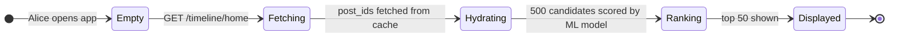

The interesting design work is in `Fetching` and `Hydrating`: where do those post_ids come from, and how did they get there before Alice asked for them?

> **Take this with you.** A feed is not a query. It is a pre-built list of post_ids, assembled at write time, ready to read in milliseconds.

---

## How big this gets

A Twitter-shaped product gives us these numbers.

| Input | Number |
|-------|--------|
| Daily active users | 300 million |
| Posts per day | 500 million |
| Times each user opens the app per day | 10 |
| Median follower count per user | 100 |
| Top celebrity follower count | 100 million |
| Feed load latency target (P99) | under 200ms |

From these we derive everything else.

<details markdown="1">
<summary><b>Show: the derived numbers</b></summary>

| Metric | Value | How |
|--------|-------|-----|
| Posts/sec, steady | ~5,800 | 500M / 86,400 |
| Posts/sec, peak | ~17,000 | 3x steady |
| Feed loads/sec, steady | ~35,000 | 300M × 10 / 86,400 |
| Feed loads/sec, peak | ~100,000 | 3x steady |
| Timeline writes/sec (naive push) | ~580,000 | 5,800 × 100 followers |
| One celebrity post (100M followers) | 100M writes | single event |
| Storage for pre-built feeds (post_ids only) | ~6 TB | 300M users × 1,000 post_ids × 20 bytes |

Three observations:

1. **The hard number is not throughput.** 580,000 timeline writes per second is large but manageable across a pool of workers. The hard number is the ratio between an average post (100 writes) and a celebrity post (100M writes): six orders of magnitude. No single strategy handles both.
2. **Reads beat writes 100 to 1.** Most users scroll without posting. That ratio justifies pre-building feeds even at the cost of write amplification.
3. **Feed storage is expensive but bounded.** 6 TB of post_ids spreads across many Redis shards. Storing full post content instead of post_ids would be 25x that. Store post_ids, hydrate at read.

</details>

> **Take this with you.** The hard number is not average throughput. It is the gap between a normal user (100 followers) and a celebrity (100 million followers). Those two cases need different strategies.

---

## The smallest version that works

One Postgres, one app server, two services. The feed is a join.

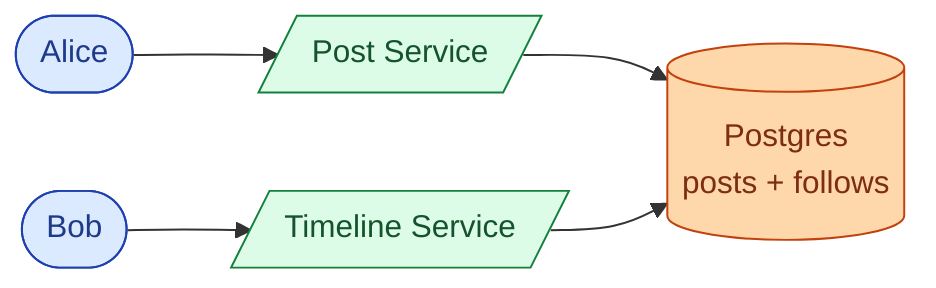

Two endpoints carry the whole product.

| Endpoint | What it does |
|----------|--------------|
| `POST /posts` | Save post, return post_id |
| `GET /timeline/home?cursor=<opaque>&limit=50` | Return 50 ranked posts for the caller |

<details markdown="1">
<summary><b>Show: the feed query at small scale</b></summary>

```sql
SELECT p.*
  FROM posts p
  JOIN follows f ON f.followee_id = p.author_id
 WHERE f.follower_id = :user_id
   AND p.deleted_at IS NULL
 ORDER BY p.created_at DESC
 LIMIT 50;
```

</details>

Fine for 1,000 users. Starts hurting at 100,000 when users follow 200+ accounts.

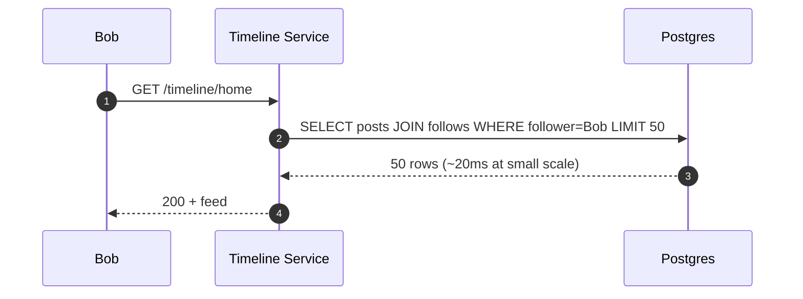

> **Take this with you.** Start here. The interesting question is what breaks first as the product grows, not what you build on day one.

---

## Decision 1: how do we fan-out posts?

When Alice posts, we have two choices: write her post_id into every follower's feed list right now, or wait and fetch her recent posts when each follower opens their feed.

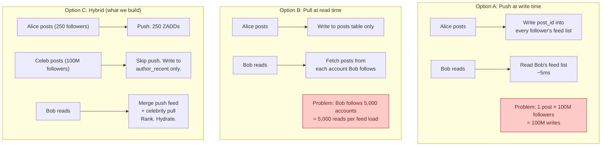

Hybrid fan-out: push for normal users, pull for celebrities at read time.

<details markdown="1">
<summary><b>Show: why the threshold matters and how to set it</b></summary>

The threshold is not just follower count. A user with 800k followers who posts 50 times per day creates more fan-out load than a celebrity with 5M followers who posts once a week. The right metric is `followers × daily_post_rate`.

A background job recomputes the threshold per author hourly and stores it in Redis. The fan-out dispatcher reads that flag when it sees a new post event. No hard-coded cutoff.

The risk of setting the threshold too low: borderline users get treated as celebrities. Their followers do an extra Redis pull per feed load. Across many borderline users, the pull side gets expensive.

</details>

> **Take this with you.** This one decision shapes the entire system. If you say "push to everyone" in the interview, the celebrity math kills the answer. If you say "pull at read time," a user following 5,000 accounts kills it.

---

## Decision 2: how do we store and read pre-built feeds?

We have settled on push for normal users. We need a data structure that supports:

- Insert a post_id with a timestamp score (at write time, from fan-out workers)
- Fetch the top N post_ids in reverse time order (at read time)
- Trim to a maximum depth (cap at 1,000 entries per user to bound memory)

A Redis sorted set does all three with three commands.

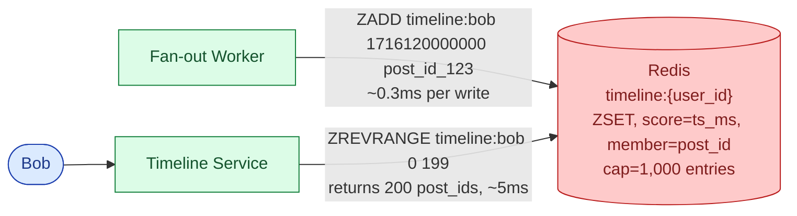

<details markdown="1">
<summary><b>Show: the three Redis commands</b></summary>

```
# Write (fan-out worker, once per follower per post)
ZADD timeline:{user_id} {created_at_ms} {post_id}
ZREMRANGEBYRANK timeline:{user_id} 0 -1001   # trim to top 1,000

# Read (timeline service, once per feed load)
ZREVRANGE timeline:{user_id} 0 199            # top 200 candidates in reverse time order
```

ZADD is O(log N). ZREMRANGEBYRANK trims stale entries. ZREVRANGE returns top N. Three commands. No joins.

</details>

For celebrity authors, we use the same structure but keyed by author instead of by user:

```
author_recent:{author_id}  →  ZSET of recent post_ids, capped at 50
```

At read time the Timeline Service fetches from `timeline:{user_id}` (push side) and from `author_recent:{celeb}` for every celebrity the user follows (pull side), then merges.

> **Take this with you.** Redis sorted sets are a near-perfect fit for pre-built feeds. ZADD inserts with ordering, ZREVRANGE reads top N, ZREMRANGEBYRANK bounds memory. Three commands per write, one per read.

---

## Decision 3: where does ranking live?

Modern feeds rank by predicted engagement, not raw time. The ML model takes a list of candidate post_ids, fetches features for each, and returns scores. Where does this step happen?

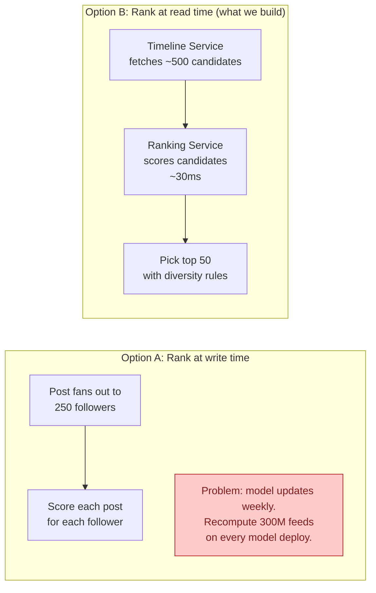

Ranking lives on the read path. Three reasons:

1. **Model changes weekly.** Write-time ranking means recomputing 300M feeds on every deploy. Not feasible.
2. **Some signals only exist at read time.** What did Bob click this morning? What is trending right now? These are not available at write time.
3. **Small candidate set.** We score ~500 posts per feed load, not billions. At 500 candidates, scoring takes ~30ms and fits inside a 200ms budget.

> **Take this with you.** Pre-ranking sounds efficient. It breaks every time the ML team ships a new model, which is weekly. Score on the read path against a small candidate set.

---

## Decision 4: how do we handle deletes, blocks, and unfollows?

A post can be in 100 million pre-built feeds. A block or unfollow can affect thousands. Eagerly scrubbing feed lists is not practical.

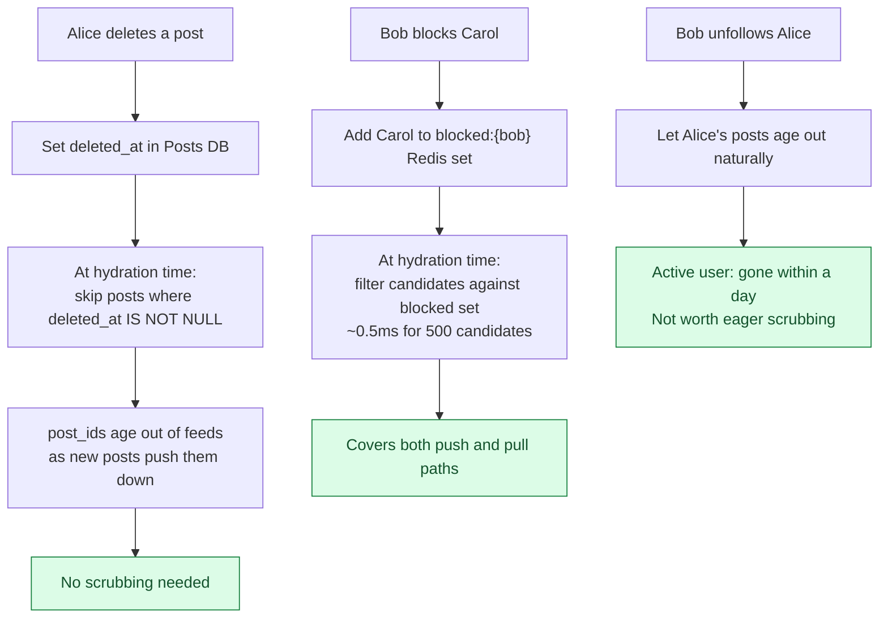

The pattern is: store post_ids, not content, in the feed cache. Hydrate at read time. Filter at hydration. All three operations (delete, block, unfollow) are handled cleanly by a single filter step rather than by scrubbing millions of sorted sets.

> **Take this with you.** Lazy delete and lazy filter at hydration time are not shortcuts. They are the correct architecture. They work because we store post_ids, not post content, in the timeline cache.

---

## The full architecture

Putting the four decisions together:

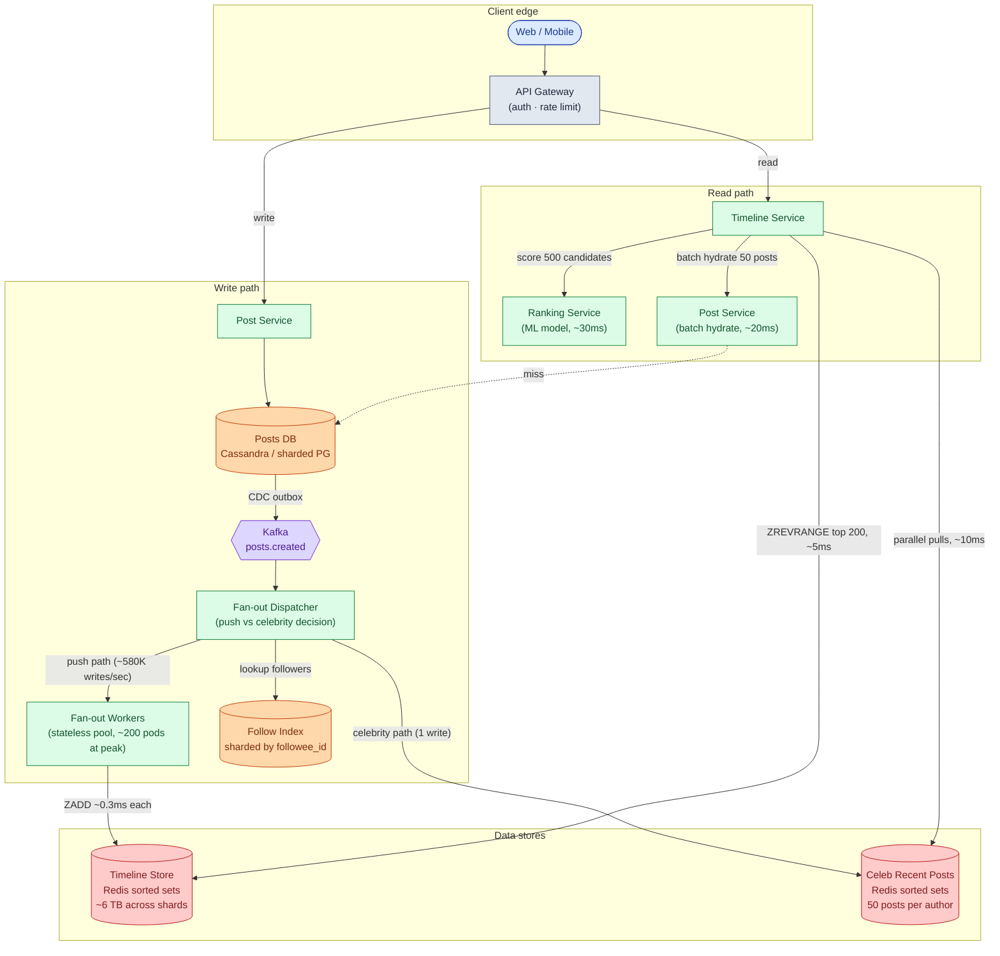

Each component, in one line:

| Component | Purpose |
|-----------|---------|
| API Gateway | TLS termination, auth, per-user rate limits |
| Post Service | Saves posts, batch-fetches post content by post_id |
| Posts DB | Source of truth for post content. Sharded by post_id |
| Kafka | Async buffer between post creation and fan-out |
| Fan-out Dispatcher | Reads post events, decides push vs celebrity path per author |
| Follow Index | Sharded by followee_id so "who follows Alice?" is one shard |
| Fan-out Workers | Write post_ids into follower sorted sets. Auto-scale on Kafka lag |
| Timeline Store | Pre-built feed per user. Redis sorted sets, capped at 1,000 entries |
| Celeb Recent Posts | Per-celebrity recent post_ids. 50 entries per author |
| Timeline Service | Reads both stores, merges, sends to Ranking, hydrates, returns |
| Ranking Service | Stateless ML scoring. Owned by ML team, deployed independently |

Notice what is not on the read path: the Posts DB is only hit by Post Service for hydration, not for the feed list itself. The timeline list comes entirely from Redis.

---

## Walks: posting and reading, end to end

**Alice posts (250 followers, push path):**

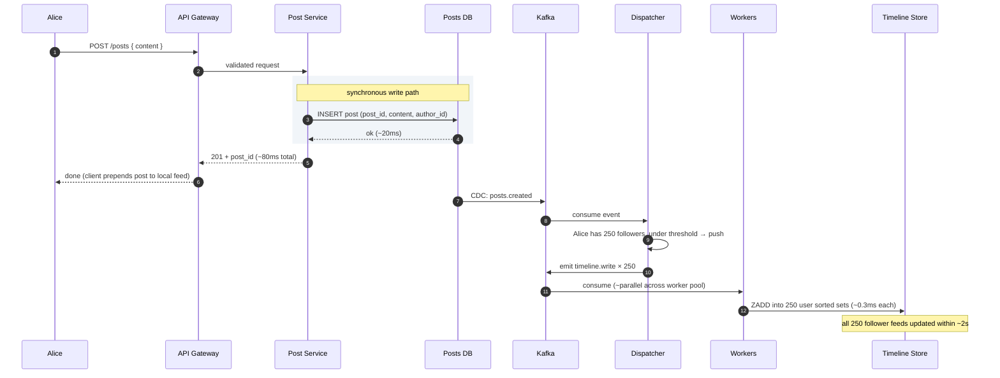

**Bob reads his feed (follows Alice and 2 celebrities):**

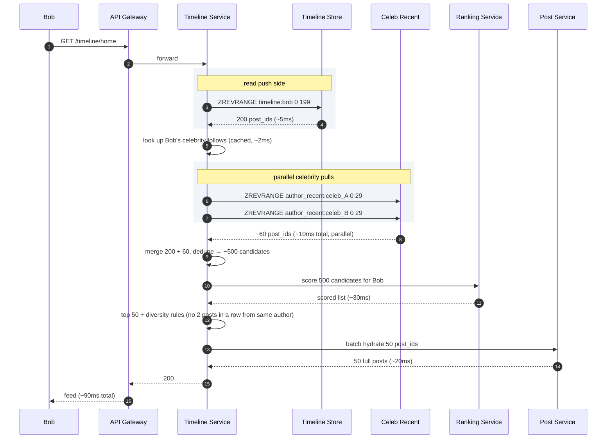

Two things worth noting:

1. Alice's 201 returns before fan-out starts. She sees her own post via a client-side prepend, not by waiting for workers.
2. The read path always merges both sides. If Bob follows no celebrities, the pull side returns empty cheaply.

---

## The deep problem: celebrity posts during peak load

A celebrity with 100 million followers posts. The fan-out dispatcher correctly skips push and writes to `author_recent`. That part is fine.

The hard part: the next few seconds after the celebrity posts, 50 million of their followers open the app almost simultaneously. Every one of them hits the Timeline Service. Every one of them hits `author_recent:{celeb}`. Every one of them then hits Ranking Service with 500 candidates.

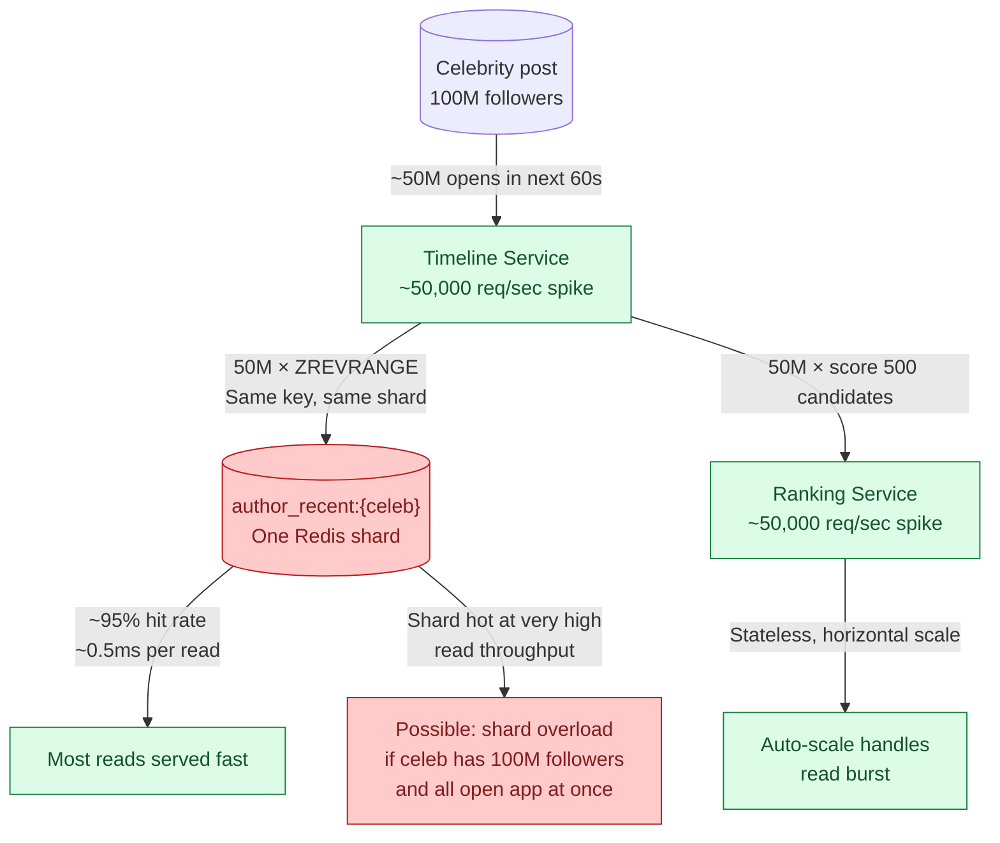

Three defenses for the Redis hot key:

1. **Read replicas for `author_recent`.** Add 5-10 read replicas for the shard hosting top celebrities. Round-robin reads across them. Multiplies read throughput by N.
2. **In-process LRU on Timeline Service pods.** Cache the top 20 post_ids from each celebrity in pod memory with a 10-second TTL. At 200 pods, a single celebrity's recent posts need only ~20 Redis reads per 10 seconds total, not 50,000.
3. **CDN or regional cache for feed responses.** For users whose feeds overlap heavily (same region, same celebrity follows), cache assembled feed responses at the API gateway for 30 seconds. Most users see near-real-time feeds; celebrities get slightly stale.

> **Take this with you.** The celebrity pull path moves the fan-out problem from write time to read time. For the biggest celebrities, you still need to handle hot-key reads. In-process LRU on the read service is the cheapest first defense.

---

## Follow-up questions

Try answering each in 2 or 3 sentences before opening the solution.

1. **User blocks another user.** Old posts from the blocked person are in the blocker's pre-built feed. Do you scrub the feed, or filter at read time?

2. **User unfollows someone.** Their pre-built feed has that author's posts. Remove them right away, or let them age out?

3. **User deletes a post.** The post_id is in 100 million pre-built feeds. How do you handle it? You cannot scrub 100M entries.

4. **New user signs up and follows 50 accounts.** Their feed is empty. How do you bootstrap it?

5. **Cold user.** A user has not opened the app for 30 days. Do you keep pushing to their feed every time someone they follow posts?

6. **Backfill on new follow.** I just followed someone. Do their last 10 posts show up in my feed right away, or do I have to wait for their next post?

7. **Live updates.** A new post lands while I am scrolling. Push it over WebSocket, or wait for pull-to-refresh?

8. **Pagination.** I scroll past 50 posts. How does the cursor work? What if one of the posts at the cursor position has been deleted?

9. **One fan-out worker is doing 100x the work of others.** What is wrong? How do you fix it?

10. **CEO wants "you might like" injections.** Put 3 recommended posts at positions 5, 15, 25 of every feed. Where does this live in the pipeline?

11. **Repost (retweet).** A celebrity reposts my normal post. Does my post now have to fan out to the celebrity's 100 million followers?

12. **Private account.** Someone's account is private. Their post should only reach approved followers. How does fan-out know?

13. **Replication lag.** I post. The post is in the primary DB but not the read replica yet. I open my own feed and don't see it. How do you fix it?

14. **Ad slot.** Position 4 of every feed is an ad. Where does the ad get picked? What happens if the ad service is down?

15. **Region failover.** US-East goes down. Users get routed to US-West. Their feeds are stale by a few minutes. What do they see?

---

## Related problems

- **[Chat System (003)](../003-chat-system/question.md).** Same fan-out and delivery problem. DMs are 1-to-1 fan-out instead of 1-to-many, but the patterns rhyme.
- **[Notification System (010)](../010-notification-system/question.md).** Same fan-out worker pattern. Same celebrity problem when a popular account triggers notifications to millions.
- **[Distributed Cache (009)](../009-distributed-cache/question.md).** The timeline store leans hard on Redis. Know its eviction, replication, and hot-key limits.
- **[Typeahead (005)](../005-typeahead-autocomplete/question.md).** Both use the same two-stage pattern: candidate generation followed by scoring.


<div class="pr-solution-divider"></div>


## Solution: Design a News Feed (Twitter / Instagram)

### The short version

A news feed is a fan-out problem dressed as a read problem. When Alice posts, the system must decide: write her post_id into every follower's pre-built feed list right now (push), or let each follower fetch her recent posts when they open the app (pull)?

Push is fast to read but explodes when someone has 100 million followers. Pull is cheap to write but chokes when a user follows 5,000 accounts. The answer is both: push for normal users, pull for celebrities. This is hybrid fan-out.

Around that core, three things matter most:

- Ranking lives on the read path. Never pre-compute it at write time.
- Deletes, blocks, and unfollows are handled by filtering at hydration time, not by scrubbing millions of feed lists.
- Feed lists store post_ids only. Hydrate to full content at read. This is what makes lazy delete and lazy filter possible.

The throughput numbers are not the hard part. 5,800 posts per second is medium load. The hard part is the six-orders-of-magnitude gap between an average user (100 followers) and a celebrity (100 million followers).

---

### 1. The two questions that matter most

**What is the biggest user's follower count?** If the answer is 10,000, push everywhere and stop here. If the answer is 100 million, you need hybrid fan-out and most of this design. This number decides the architecture more than any other.

**Is the feed time-ordered or ranked?** If ranked, the read path has an extra ML scoring step that cannot live at write time because the model changes weekly and uses signals that only exist at the moment of reading.

Everything else (deletes, blocks, cold users, media, ads) follows from those two answers.

---

### 2. The math, in plain numbers

| Metric | Number |
|--------|--------|
| Daily active users | 300 million |
| Posts/sec (steady) | ~5,800 |
| Posts/sec (peak) | ~17,000 |
| Feed loads/sec (steady) | ~35,000 |
| Feed loads/sec (peak) | ~100,000 |
| Timeline writes/sec (naive push) | ~580,000 |
| One celebrity post (100M followers) | 100 million writes |
| Storage for pre-built feeds (post_ids only) | ~6 TB |

The hard number is not any single one of these. It is the ratio between an average post (100 writes) and a celebrity post (100 million writes): six orders of magnitude from the same event type. No single fan-out strategy handles both.

Reads beat writes roughly 100 to 1. Most users scroll for an hour and post nothing. That ratio justifies pre-building feeds even at the cost of write amplification.

---

### 3. The API

Two endpoints carry the whole product.

```
GET /api/v1/timeline/home?cursor=<opaque>&limit=50
Authorization: Bearer <token>

Response 200:
{
  "posts": [
    {
      "id": "1234567890",
      "author": { "id": "u42", "handle": "@aisha" },
      "content": "Hello world",
      "created_at": "2026-05-20T10:00:00Z",
      "likes": 42,
      "media": []
    }
  ],
  "next_cursor": "<opaque>"
}
```

The cursor is opaque on purpose. Inside it encodes `(last_seen_score, last_seen_post_id)`. We can change the pagination scheme without breaking clients.

```
POST /api/v1/posts
{
  "content": "Hello",
  "media_ids": ["mid1", "mid2"]    -- uploaded separately via media service
}

Response 201:
{ "post_id": "1234567890", "created_at": "..." }
```

Three small but load-bearing choices:

| Choice | Reason |
|--------|--------|
| Return 201 before fan-out | Fan-out is async. Alice sees her own post via client-side prepend, not by waiting for workers. |
| Snowflake post_id | Globally unique without coordination, sortable by time, 64 bits. |
| Cursor encodes a score, not an offset | Offset pagination breaks when posts are inserted or deleted between requests. |

Status codes: **410 Gone** when a hydrated post was deleted (filter client-side). **429** when a user is posting too fast.

---

### 4. The data model

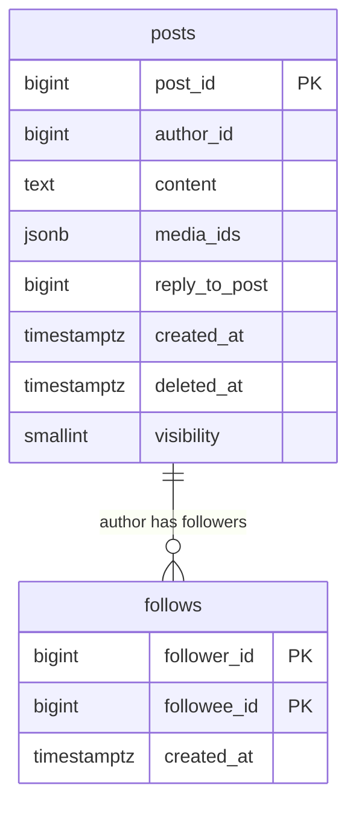

Plus two Redis structures (not relational):

- `timeline:{user_id}` - ZSET, score = created_at ms, member = post_id, capped at 1,000 entries
- `author_recent:{author_id}` - ZSET, score = created_at ms, member = post_id, capped at 50 entries

<details markdown="1">
<summary><b>Show: the full SQL</b></summary>

```sql
CREATE TABLE posts (
    post_id          BIGINT PRIMARY KEY,        -- Snowflake: ts + shard + seq
    author_id        BIGINT NOT NULL,
    content          TEXT NOT NULL,
    media_ids        JSONB,
    reply_to_post    BIGINT,
    repost_of_post   BIGINT,
    created_at       TIMESTAMPTZ NOT NULL,
    deleted_at       TIMESTAMPTZ,               -- soft delete; never hard-delete
    visibility       SMALLINT NOT NULL DEFAULT 1  -- 1=public, 2=followers, 3=private
);
CREATE INDEX idx_author_created
    ON posts (author_id, created_at DESC)
    WHERE deleted_at IS NULL;

CREATE TABLE follows (
    follower_id   BIGINT NOT NULL,
    followee_id   BIGINT NOT NULL,
    created_at    TIMESTAMPTZ NOT NULL,
    PRIMARY KEY (follower_id, followee_id)
);
CREATE INDEX idx_followee ON follows (followee_id);
-- Also keep a reverse table sharded by followee_id so
-- "who follows Elon?" is one shard lookup, not a scatter.
```

</details>

Three things doing real work:

**Soft delete on posts.** When Alice deletes a post, we set `deleted_at`. We do not scrub the post_id from millions of feed lists. The hydration step skips posts where `deleted_at IS NOT NULL`. Cache entries fade naturally as new posts push them out.

**Snowflake post_id.** Sortable by time but not centrally coordinated. Different shards mint IDs in parallel with no coordinator needed.

**Reverse follow index.** Without it, "who follows Elon?" is a scatter across all shards. With it, one shard answers. Cost: one extra async write per follow action.

Why not store post content in the timeline cache? Posts are ~500 bytes. Timeline entries are 20 bytes (just post_id). Storing content in 300 million feed lists bloats memory by 25x and makes lazy delete impossible. Store post_ids; hydrate at read.

Why Redis sorted sets and not lists? Sorted sets give ranked insertion by timestamp, efficient top-N reads, and O(log N) trim-to-cap. All in three Redis commands. Lists would need manual ordered insertion.

---

### 5. The engine: hybrid fan-out

<details markdown="1">
<summary><b>Show: the fan-out and read logic</b></summary>

```python
CELEBRITY_THRESHOLD = 1_000_000   # tunable per author by background job

def on_post(post):
    follower_count = follow_index.follower_count(post.author_id)

    if follower_count <= CELEBRITY_THRESHOLD:
        # Push path. Stream followers in batches to stay memory-bounded.
        for batch in follow_index.stream_followers(post.author_id, batch_size=10_000):
            timeline_writer.enqueue_batch(batch, post.id, score=post.created_at)
    else:
        # Celebrity path. One write.
        author_recent.zadd(post.author_id, post.id, score=post.created_at)
        author_recent.trim(post.author_id, keep=50)


def get_timeline(user_id, cursor=None, limit=50):
    pushed = timeline_store.zrevrange(user_id, 0, 199)       # 200 candidates

    celeb_authors = follow_index.get_celebrities_followed(user_id)  # cached
    pulled = []
    for author in celeb_authors:                             # parallel in prod
        pulled.extend(author_recent.zrevrange(author, 0, 19))

    candidates = dedupe(pushed + pulled)                     # ~500 candidates
    features = feature_store.batch_get(user_id, candidates)
    scores = ranker.score(user_id, candidates, features)

    ranked = pick_top_with_diversity(candidates, scores, limit)
    posts = post_service.batch_get(ranked, filter_deleted=True)
    return posts, next_cursor(posts)
```

</details>

Three things make this safe at scale:

The write path streams followers in batches of 10,000. Loading 1 million follower IDs into memory at once would OOM the dispatcher. Streaming keeps memory flat.

Fan-out workers are idempotent. `ZADD` with the same `(member, score)` twice is a no-op. If a worker crashes mid-batch and replays, no duplicates land in feeds.

The read path always merges both sides. If Bob follows zero celebrities, the pull side returns an empty list cheaply. No conditional branching in the Timeline Service.

The threshold is per-author, not global. A user with 800k followers who posts 100 times per day creates more fan-out than a celebrity with 5M followers who posts once a week. A background job computes `followers × daily_post_rate` per author hourly and writes the celebrity flag to Redis. The dispatcher reads that flag, not a hard-coded number.

---

### 6. The architecture

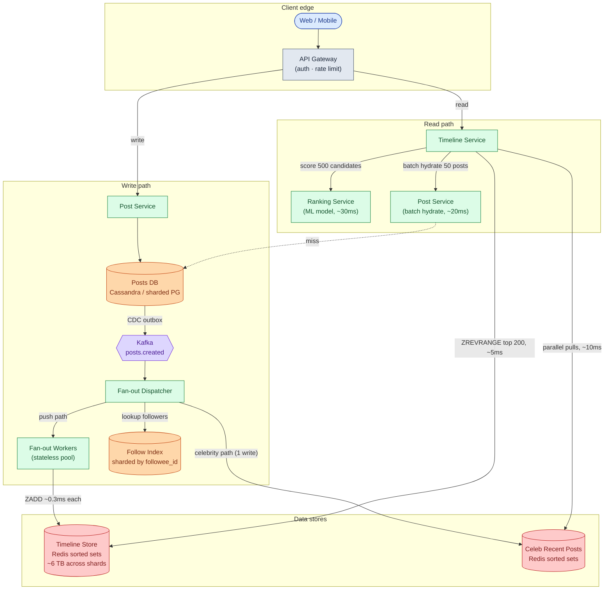

Five things to notice:

- The write path is fully async after Kafka. Alice gets a 201 in ~80ms. Fan-out happens behind the scenes. If workers fall behind, posts still get created; feeds just update slower.
- The read path never touches Posts DB for the feed list. It reads post_ids from Redis, then hydrates from Post Service. Posts DB sees one batch call per feed load, not 50 individual calls.
- Ranking is its own service. The ML team deploys it on their own cadence. The Timeline Service sends candidates and gets scores. Each team deploys independently.
- Fan-out workers are stateless. Roll any pod at any time. State lives in Kafka (unconsumed offsets), Redis (feed lists), and the databases.
- The Follow Index is sharded by followee_id specifically so "who follows Alice?" lands on one shard, not dozens.

---

### 7. A request, end to end

**Alice posts (250 followers):**

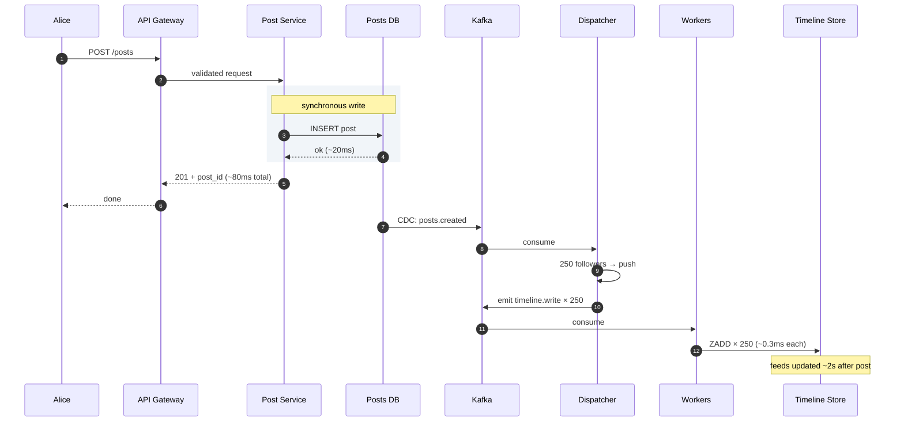

**Bob reads his feed:**


Target latencies:

| Operation | P50 | P99 |
|-----------|-----|-----|
| Create post | ~80ms | ~150ms |
| Read feed (all caches warm) | ~90ms | ~200ms |
| Post fans out to all followers | ~2s | ~10s (normal user) |

---

### 8. The scaling journey: 1,000 users to 300 million

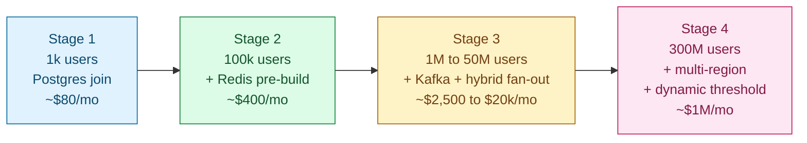

#### Stage 1: 1,000 users

One Postgres, one app instance. Feed is a `SELECT posts JOIN follows ORDER BY created_at LIMIT 50`. No cache, no queue, time-order only. About $80/month. Ships in a weekend.

Fine because feed loads run in ~50ms when followed sets are small. Adding anything more is overbuilt.

#### Stage 2: 100,000 users

What breaks: Carol follows 400 accounts. Her feed query consistently hits 800ms. Postgres sorts by time across 400 author IDs.

What we add: Redis pre-built feeds. When Alice posts, write post_id into each follower's sorted set. Feed reads become a ZREVRANGE, down to ~20ms. Fan-out is still synchronous on the post write path. No Kafka yet. About $400/month.

#### Stage 3: 1 million to 50 million users

What breaks: a popular user with 500k followers makes post creation block for 30 seconds (synchronous fan-out). Postgres write throughput is a ceiling. The first celebrity user with 2M followers arrives.

What we add: async fan-out via Kafka. Shard Posts DB by post_id. Bring in the hybrid fan-out dispatcher. The celebrity path goes live. The ML team adds a Ranking Service. About $2,500 to $20,000/month depending on scale within this range.

#### Stage 4: 300 million users

New problems: top celebrity has 100M followers. EU operations open. One influencer gains 50M followers in a week, temporarily overwhelming a static threshold. 35,000 feed reads per second at peak.

What we add: dynamic threshold per author, tuned hourly. 64 Redis shards for timelines. 200 fan-out worker pods at peak. Full multi-region stack per region. Cold users (inactive over 7 days) evicted from Redis; feeds rebuild on return. About $1M/month, ~30 engineers.

#### What changes at 10x this scale

Federated timeline stores per region. Streaming ranking (continuously updating candidate sets rather than rebuilding per read). Edge-cached feed responses for global sub-50ms P99. These are optimizations on the same architecture shape, not a new design.

---

### 9. Reliability

**Posts DB shard failure.** Posts for that shard are unavailable. The Kafka consumer for that shard pauses at its offset. When the shard recovers, the consumer resumes. No data loss.

**Timeline cache shard failure.** Reads for users hashed to that shard fall through to a slower cold path. Slower (~200ms) but correct.

**Fan-out worker crash.** Another worker picks up the Kafka message. ZADD is idempotent, so replay is safe. No duplicates.

**Ranking service failure.** Timeline Service falls back to time-order on the candidate set. Quality drops; the feed still works.

**Kafka fully down.** Post creation continues (posts saved to DB). Fan-out pauses. Feeds go stale. When Kafka recovers, consumers resume from stored offsets.

**Regional failure.** Global load balancer routes to another region. Users see a feed stale by a few minutes (last replicated state). Most will not notice.

---

### 10. Observability

| Metric | Why it matters |
|--------|----------------|
| `timeline.read.p99` by region | Headline SLO. Should stay under 200ms. |
| `timeline.candidate_count.p50` | Under 100 candidates means ranking quality drops. Cold users or sparse follow graph. |
| `fanout.queue_depth` | Leading sign of stale feeds. Page if above 1 million. |
| `fanout.write_lag_p99` | Time from post event to feed ZADD. Target under 5 seconds. |
| `ranking.latency_p99` | Should stay under 50ms. |
| `cache.hit_rate` (timeline, post, feature) | A cascade of misses means a bad day. |
| `post.creation_rate` | Sudden drop signals auth or DB broken. |
| `cold_user.rebuild.rate` | High rate means users returning after long breaks. |

**Page on:** timeline P99 above 500ms for 5 minutes. Fan-out lag above 30 seconds. Ranking error rate above 1%.

**Ticket on:** celebrity threshold large change. Cache hit rate dropping more than 5 percentage points.

---

### 11. Follow-up answers

**1. User blocks another user.**

Filter at read time, not write time. Keep a `blocked:{user_id}` Redis set. On every feed read, filter candidate post_ids against this set before ranking. Cost is ~0.5ms for 500 candidates.

Eager scrubbing of the pre-built feed sounds thorough but does not cover celebrity posts on the pull path. A read-time filter covers both push and pull with one check, and avoids a class of bugs where a block partially clears history.

Also apply the filter to `reply_to_post` when hydrating. Otherwise quoted replies from the blocked user still leak through.

**2. User unfollows someone.**

Lazy. Let those posts age out as new ones push them down. An active user sees the unfollowed person gone within a day or two.

Eager scrubbing means reading all 1,000 entries in the sorted set, finding ones from that author, and removing them. That is ~10ms per unfollow and does nothing for the celebrity pull path. Not worth it. Same logic applies to mute.

**3. Post deletion when the post is in 100 million feeds.**

Do not scrub. 100 million ZREMs is not feasible.

Set `deleted_at` in Posts DB. At hydration time, skip any post where `deleted_at IS NOT NULL`. Cache entries fade naturally as new posts push them out. This is exactly why we store post_ids in the feed cache and not post content. Lazy filtering at hydration is free. If we stored content, every delete would require scrubbing 100M entries.

**4. New user signs up and follows 50 accounts.**

Bootstrap the feed once during signup:

<details markdown="1">
<summary><b>Show: bootstrap function</b></summary>

```python
def bootstrap_feed(new_user_id, followee_ids):
    candidates = []
    for f in followee_ids:              # run in parallel
        candidates.extend(post_index.recent(f, 20))
    candidates.sort(key=lambda p: p.created_at, reverse=True)
    timeline_store.zadd_bulk(new_user_id, candidates[:200])
```

</details>

Takes ~100ms. By the time onboarding finishes, the feed has content. Celebrities in the followee list are handled by the normal pull path on the first feed read.

**5. Cold users.**

Stop pushing to users inactive for 30 days. Three steps:

- Dispatcher checks "is this follower warm?" before emitting a task. Cold users are skipped.
- Move their Redis entry to Cassandra after 7 days of inactivity.
- On return, schedule a rebuild: read recent posts from their followees and repopulate Redis.

This saves roughly half of Redis memory and a large share of fan-out work. Most user bases are 40-60% cold at any given time.

**6. Backfill on new follow.**

Yes. When Bob follows Alice, fetch Alice's last ~10 posts and ZADD them into Bob's sorted set with the correct scores. Do this in the follow request's response path. Takes ~10ms.

Without this, the follow feels broken. Bob added someone and saw nothing change.

If Alice is a celebrity: she is never in Bob's pre-built feed by design. The first feed read pulls her recent posts through the celebrity path. No special code needed.

**7. Live updates.**

For most apps: pull-to-refresh. Simple, no extra infrastructure.

For Twitter-style real-time feel: a WebSocket channel pushes lightweight notifications ("3 new posts available"). The user taps to load. The WebSocket carries counts, not full post content. The full feed reload still goes through the normal read path. Pushing full posts over WebSocket doubles the work for no gain since the client already has a fast feed endpoint.

**8. Pagination.**

Cursor encodes `(score, post_id)`. Score is post creation timestamp. Post_id breaks ties for posts at exactly the same millisecond. Each request returns posts strictly older than the cursor position.

If the post at the cursor was deleted: fine. The cursor is a position, not a reference. Past position 500, ranking quality degrades in ways the cursor cannot represent. Accept this; nobody scrolls that deep.

**9. One fan-out worker doing 100x the work.**

Diagnose in order:

1. **Hot partition.** Workers consume one Kafka partition each. If partitioned by `author_id` and one author lands on the same partition, it gets uneven load. Repartition by `(post_id, follower_id_hash)` to spread hot authors.
2. **Duplicate consumer.** Two pods accidentally consuming the same partition. Look for duplicate ZADDs in the timeline store. Check Kafka consumer group health.
3. **Borderline celebrity.** A user with 900k followers, just under the threshold. Their fan-out fills one worker. Lower the threshold or move them to the celebrity path.
4. **Slow task type.** A specific kind of write is taking longer than usual. Look at task latency by author fan-out tier.

A senior answer covers all four. A mid-level answer only says "rebalance the consumer group."

**10. "You might like" injections.**

After ranking, call the recommendation service in parallel. If it times out, serve the organic feed unchanged:

<details markdown="1">
<summary><b>Show: injection logic</b></summary>

```python
def get_timeline_with_recommendations(user_id):
    organic = get_timeline(user_id)          # existing 50 posts
    recs = rec_service.get(user_id, 3)       # parallel call, 30ms budget
    return inject(organic, recs, positions=[5, 15, 25])
```

</details>

Latency cost: ~30ms parallel call, absorbed alongside the existing ranking call. If the rec service times out, serve the organic feed unchanged. This is also where ads go: same injection pattern, same timeout rule.

Quality risk: recommended content is usually less relevant than organic. A/B test before rolling out; measure dwell time and scroll depth on injected positions.

**11. Celebrity reposts a normal post.**

The repost is the celebrity's content (a pointer to the original post). It goes through the celebrity's normal path: skip push, write to their `author_recent` list. When the celebrity's followers load their feed, the pull path returns the repost, which hydrates to show the original post with a "reposted by" header.

The original post reaches 200 million people without a single extra timeline write. The fan-out decision is based on the reposter's follower count, not the original author's.

**12. Private account.**

Follow requests to private accounts require approval before being recorded in the `follows` table. The fan-out dispatcher reads from `follows`, so push only reaches approved followers. On the celebrity pull path, the Timeline Service checks "is this viewer an approved follower of this private account?" before merging. Check is cached per `(viewer, author)` with a short TTL.

**13. Replication lag on my own post.**

Two fixes, usually both together:

- **Optimistic client prepend.** The client inserts the post locally as soon as the 201 comes back. The user sees it instantly. The server's feed catches up within a second.
- **Read-your-writes routing.** For the requester's own feed, route reads to the primary for ~5 seconds after a post. Cookie-based stickiness. After 5 seconds, fall back to replicas.

**14. Ad in position 4.**

The Timeline Service calls the Ad Service after ranking, in parallel. If the Ad Service is down or exceeds a 50ms timeout, skip the slot and show the organic post at position 4. Lose revenue for that period; do not fail the feed load. The ad slot is enhancement, not a requirement.

**15. Region failover.**

US-East goes down. Global load balancer routes affected users to US-West.

US-West has its own copy of the timeline store but has not received the last few minutes of writes from US-East. Users see a feed stale by 2-5 minutes. They see all posts before the failure window, nothing from the failure window itself. If they post during the failure, the post is stored in US-West and fans out locally. When US-East recovers, cross-region replication catches up.

Most users will not notice. Those who do see "the feed isn't updating." Acceptable for a full region failure.

---

### 12. Trade-offs worth saying out loud

**Why not pre-rank.** Pre-ranking means recomputing 300 million feeds every time the model updates, which is weekly. On the read path, ranking touches 500 candidates per request. The math forces ranking to live at read time.

**Why not adaptive push/pull per request.** We choose push vs pull per author, not per feed read. Per-request would be marginally more precise but adds complexity for small gain. Static-per-author with a dynamically tuned threshold is the right balance.

**Why separate post content from timeline entries.** Posts are ~500 bytes. Timeline entries are 20 bytes (just post_id). Storing content in 300 million feed lists bloats memory by 25x and makes lazy delete impossible.

**Why Kafka and not direct calls to workers.** Fan-out is async. If the dispatcher called workers directly, a slow worker would block the post creation path. Kafka decouples them. If workers fall behind, the queue grows; posts still get created.

---

### 13. Common mistakes

**"Just push to every follower."** Fails the celebrity math immediately. 100 million writes per post is not feasible.

**"Just pull at read time."** Fails for users who follow 5,000 accounts. 5,000 reads per feed load will not fit in a 200ms budget.

**No ranking.** Modern feeds score by engagement. A purely chronological feed in 2026 signals you have not thought about how these products actually work.

**Storing post content in the feed cache.** Bloats memory by 25x. Also makes deletion impossible to handle cleanly. Store post_ids; hydrate at read.

**Ignoring deletes.** If you cannot answer "what happens when a post in 100 million feeds is deleted?", you have not thought through the read path. Lazy filter at hydration time is the answer.

**No mention of blocks or mutes.** Filter at read time. Both push and pull paths go through hydration, so one filter covers both.

**Sequential reads in fan-in.** Describing the celebrity pull as "loop over followees, fetch posts one by one" gives 30-second feeds. Parallel matters.

**Treating notifications as part of the feed.** The feed is the home timeline. Notifications are a different product that consumes the same events.

**Forgetting read-your-writes.** Post, open feed, don't see your own post. Either client-side prepend or sticky reads to the primary. Otherwise the app feels broken.

**"I'll just add a cache."** Which cache? What is the eviction policy? What is the target hit rate? The answer needs to be specific.

The three that separate strong answers from average ones: hybrid fan-out (not push or pull alone), ranking on the read path (not precomputed), and lazy delete via post_id hydration at read time.

