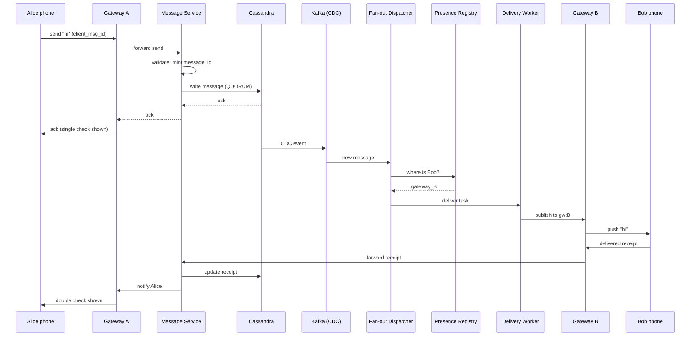
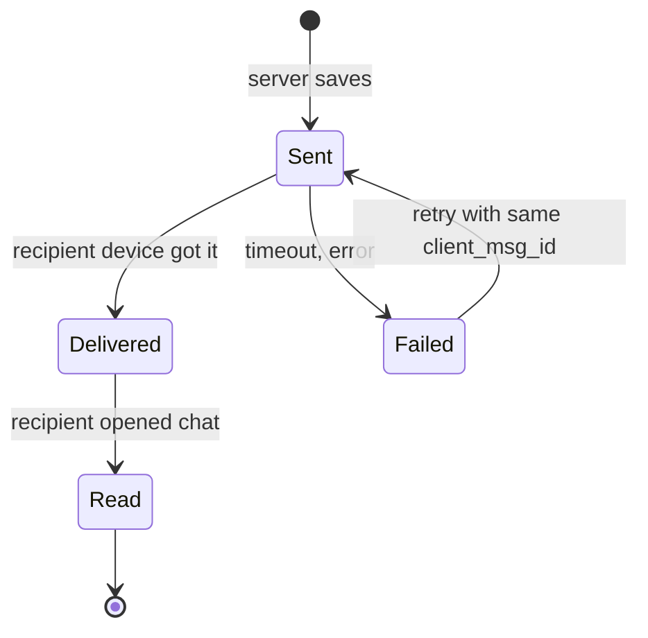
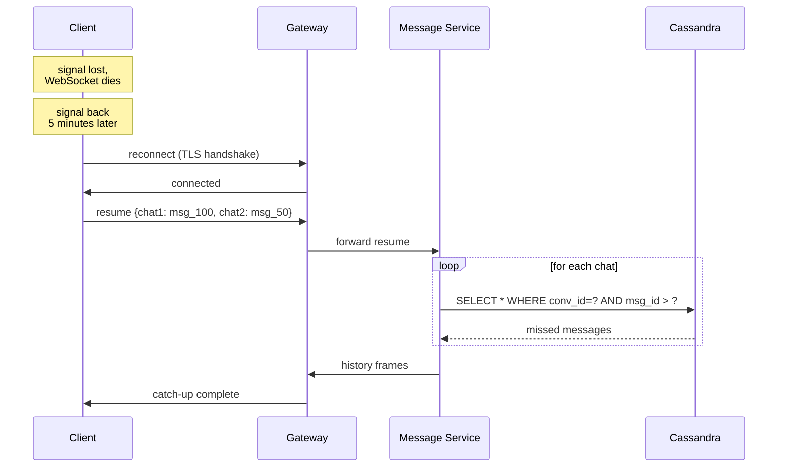
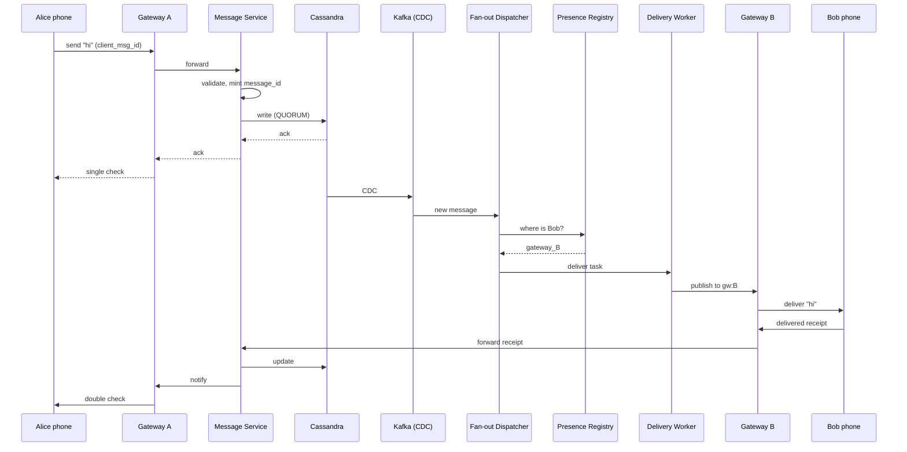
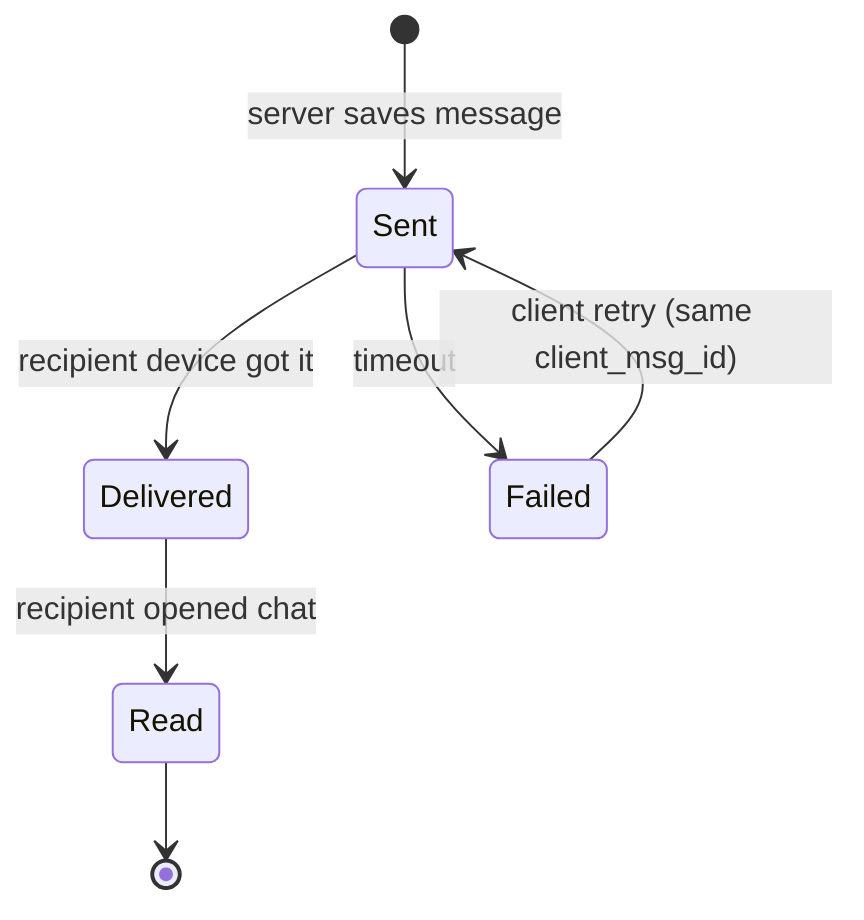


## The scene

You sit down. The interviewer used to work at WhatsApp. Then Slack. They open with one line:

> *"Design a chat system. One-to-one chats and group chats. Real-time. Mobile is the main client. Go."*

It looks simple. It is not. The trap is the word "real-time." If you start by listing REST endpoints, you have already missed the point. If you draw one box called "WebSocket server" and stop, you missed the other point.

Two things make chat hard:

1. Holding open hundreds of millions of network connections at the same time.
2. Keeping messages in the right order even when phones lose signal every few minutes.

We will walk this from a tiny chat app for 100 users to a system that holds 500 million open connections. At each step we will name what breaks first, then add the smallest fix.

---

## Step 1: Ask the right questions

Before you draw anything, sit for 5 minutes. Write down the questions you would ask the interviewer.

A good answer is not "ask 20 questions about every edge case." It is the small set of questions that change the design if answered differently.

<details markdown="1">
<summary><b>Show: 8 questions that matter</b></summary>

1. **How many users? How many open connections at peak?** *(WhatsApp answer: 1 billion daily users, 500 million open connections at peak. The connection count drives the whole edge fleet size.)*
2. **One-to-one only, or groups too? How big can groups get?** *(WhatsApp caps groups at 1024. Slack channels can hit 10,000+. Group size decides if fan-out fits in one transaction or needs a worker pool.)*
3. **What order guarantees do we need?** *(Most chat apps promise: messages from the same sender stay in order. They do not promise a strict global order. That difference saves you from needing distributed consensus on every message.)*
4. **Do we show sent / delivered / read?** *(Receipts triple the load in groups. One message to 1000 people creates 1000 "delivered" events. Receipts are the real workload, not messages.)*
5. **Do we show online / typing / last-seen?** *(Presence is its own beast. High update rate, low durability, different audience.)*
6. **History on the server? How long?** *(WhatsApp keeps little server-side. Slack keeps everything forever. This decides your storage tier.)*
7. **End-to-end encryption?** *(If yes, the server cannot read messages. That limits search, notifications, and moderation.)*
8. **Push notifications when offline?** *(Apple APNs and Google FCM have their own rules. They are part of the design.)*

> **Why these matter most.** Asking just "how many users?" misses the questions that actually shape the system. Concurrent connections, group size, and receipts together drive 80% of the architecture.

</details>

---

## Step 2: How big is this thing?

Same problem, two scales. Do the math.

**Inputs from the interviewer (enterprise scale):**

- 1 billion daily active users
- 500 million WebSocket connections open at peak (a WebSocket is a long-lived two-way connection)
- 100 billion messages per day
- Half the messages go to groups. Average group has 50 people. Biggest group has 1000.
- Each message creates one "delivered" event from each online recipient. 80% of recipients open and read it.
- Average message is 200 bytes
- Keep history for 1 year, searchable

Compute four things on paper, then peek.

<details markdown="1">
<summary><b>Show: the math</b></summary>

**Messages per second.**

- 100B / 86,400 seconds = ~1.16M messages/second steady
- Peak is about 3x = ~3.5M messages/second

**Total events per second (messages + receipts).**

- Half the messages are 1-to-1: 1 delivered + 0.8 read = ~1.8 receipts per message
- Half are group messages with ~49 other people. About 80% are online. So ~39 delivered + ~31 read = ~70 receipts per group message
- Weighted average: 0.5 x 1.8 + 0.5 x 70 = ~36 receipts per message
- Total events: 1.16M x (1 + 36) = ~43M events/second steady, ~130M peak

> **Receipts dominate.** This is the first non-obvious insight. A group message of 1000 people creates 1 write to the message store and ~1800 receipt events. If you treat each receipt like a real message, you store 36 PB/year instead of 12.

**Edge servers (the boxes holding open connections).**

- 500M connections / 100K per server = 5,000 servers
- Add 30-40% spare = 7,000-8,000 servers
- Each connection uses ~10 KB of memory. 100K x 10 KB = ~1 GB per server. Trivial.

**Storage for 1 year.**

- 100B/day x 365 = 36.5 trillion messages
- 350 bytes per message (200 content + ~150 metadata) = ~12 PB/year
- Need 3 copies for safety = ~36 PB

**Outbound bandwidth at peak.**

- 3.5M messages x 36 fan-out x ~300 bytes = ~38 GB/second
- Spread across 7,000 servers = ~5 MB/second per server. Trivial.

> **What the math tells you.** Receipts beat messages 30 to 1. Connection count drives the server fleet. Group size drives the fan-out cost. None of it is about raw message throughput.

</details>

---

## Step 3: How do messages reach phones?

Phones need to receive messages without asking the server "any new messages?" every second. There are three ways to do this. Think about each one before peeking.

| Way | How it works |
|---|---|
| **Short polling** | Phone asks "any new messages?" every 5 seconds |
| **Long polling** | Phone asks "any new messages?" Server waits up to 30 seconds before answering |
| **WebSocket** | One always-open connection. Server pushes messages instantly |

Which one wins for chat at 500M users? Why?

<details markdown="1">
<summary><b>Show: why WebSocket wins</b></summary>

> **Why not short polling?** With 500M users polling every 5 seconds, that is 100 million requests per second hitting your servers. Almost all of them get back "nothing new." That is a huge waste of CPU, bandwidth, and battery.

> **Why not long polling?** Better, but the server still holds the connection open. You get all the cost of WebSocket without the two-way push benefit. Also, every message takes a round trip: phone asks, server waits, server answers, phone asks again.

> **Why WebSocket wins.** One always-open connection per user. Server pushes messages the moment they arrive. The same connection sends receipts back. No wasted polling. An idle WebSocket on Linux costs ~10 KB of memory. Cheap.

**The trade-off.** WebSockets are stateful. Each one lives on a specific server. If that server dies, every connection on it drops. Phones drop signal often (subway, elevator, plane). So you need:

- A way for the phone to reconnect fast
- A way to catch up on messages missed during the drop
- A way to route the phone back to the same logical place each time

Use WebSocket as the main transport. Fall back to plain HTTPS only when WebSocket is blocked (some corporate networks block the upgrade).

</details>

---

## Step 4: Draw the system

You know phones use WebSockets. Now draw the boxes behind them.

Try to fill in the missing pieces below. Eight boxes are missing. Think about: where the WebSocket lands, who validates the message, where messages get stored, how the system knows which other users are online and where, and how offline users get a push notification.

```
            Phone (iOS, Android, web)
                       |
                       | WebSocket over TLS
                       v
              +-----------------+
              |   [ ? ]         |   holds 100K connections per node,
              |   (stateful)    |   pushes messages out
              +----+--------+---+
                   |        |
        send       |        |    receive (from other gateways)
                   |        |
                   v        ^
              +-----------------+
              |   [ ? ]         |   validates, assigns message ID,
              |   (stateless)   |   saves to storage
              +--------+--------+
                       |
                       v
              +-----------------+      +------------------+
              |   [ ? ]         | ---> |   [ ? ]          |
              |   (durable      | CDC  |   (decides who   |
              |    storage)     |      |    needs this    |
              |                 |      |    message)      |
              +-----------------+      +-------+----------+
                                               |
                       +-----------------------+---------------------+
                       |                       |                     |
                       v                       v                     v
              +----------------+      +----------------+    +----------------+
              |   [ ? ]        |      |   [ ? ]        |    |  APNs / FCM    |
              |   (knows which |      |   (sends to    |    |  (push for     |
              |    gateway     |      |    online      |    |   offline      |
              |    each user   |      |    users)      |    |   users)       |
              |    is on)      |      |                |    |                |
              +----------------+      +----------------+    +----------------+
```

<details markdown="1">
<summary><b>Show: the full architecture</b></summary>

```
            Phone (iOS, Android, web)
                       |
                       | WebSocket over TLS
                       v
              +---------------------+
              | Connection Gateway  |   holds 100K connections per node,
              | (stateful edge)     |   pushes messages out
              +----+-----------+----+
                   |           |
        send       |           |    receive (from other gateways)
                   |           |
                   v           ^
              +---------------------+
              | Message Service     |   validates, mints message_id,
              | (stateless)         |   saves to Cassandra, sends ack
              +----------+----------+
                         |
                         v
              +---------------------+    +----------------------+
              | Cassandra (sharded  |--->| Fan-out Dispatcher   |
              | by conversation_id) |CDC | (reads new messages, |
              |                     |    |  finds recipients)   |
              +---------------------+    +-----+----------------+
                                               |
              +--------------------------------+----------------+
              |                                |                |
              v                                v                v
        +----------------+         +----------------+    +----------------+
        | Presence /     |         | Delivery       |    | Push Service   |
        | Session        |         | Workers        |    | (APNs for iOS, |
        | Registry       |         |                |    |  FCM for       |
        |                |         | Sends to       |    |  Android)      |
        | Redis: maps    |         | online users   |    |                |
        | user_id ->     |         | via pub/sub    |    | For offline    |
        | gateway_id     |         | to their       |    | users          |
        |                |         | gateway        |    |                |
        +----------------+         +----------------+    +----------------+
```

What each piece does in one line:

- **Connection Gateway.** The edge server. Holds the open WebSocket. Knows nothing else. Stateless except for the live socket. If it dies, phones reconnect to a new one.
- **Message Service.** The brain. Validates the message, gives it an ID, saves it. Stateless. Scales by adding more pods.
- **Cassandra.** The message store. Sharded (split) by conversation_id, so all messages in one chat live on one node. Reading the last 50 messages of a chat is one fast query.
- **Fan-out Dispatcher.** Reads new messages from Cassandra's change stream. Looks up who is in the conversation. Sends each one a delivery task.
- **Presence / Session Registry.** A small Redis cluster. Knows which user is on which gateway right now. Also tracks online/idle/offline.
- **Delivery Workers.** Take a delivery task. Look up the user's gateway. Publish the message to that gateway's channel.
- **Push Service.** For users with the app closed. Talks to Apple (APNs) and Google (FCM). Sends a push notification so the user knows to open the app.

> **Why pub/sub between Delivery Workers and Gateways?** The worker does not know directly which socket the user is on. The gateway is the only place that knows for sure. Publishing to a gateway channel lets the gateway decide if the socket is alive. If the user moved to a different gateway, the old one drops the event. The user's reconnect protocol catches them up later.

</details>

---

## Step 5: The send-message flow

A user named Alice sends "hi" to Bob. Both are online. Trace it step by step. What happens between Alice pressing Send and Bob seeing the message?

<details markdown="1">
<summary><b>Show: the full path with diagram</b></summary>



Step by step:

1. Alice's phone sends a frame over the WebSocket: `{type: send, client_msg_id: uuid, body: "hi"}`. The `client_msg_id` is for safety. If the phone retries after a network blip, the server uses this ID to skip the duplicate.
2. Gateway A forwards to the Message Service.
3. Message Service does five things: checks Alice is allowed to send to this chat, mints a `message_id` (Snowflake style, sortable by time), saves to Cassandra, and sends back an ack.
4. Alice's UI shows a single check (sent).
5. Cassandra emits a CDC event (CDC = "change data capture", a stream of every row change). The Fan-out Dispatcher reads it.
6. Dispatcher asks the Presence Registry: where is Bob? Answer: Gateway B.
7. Dispatcher creates a delivery task. A Delivery Worker publishes to Gateway B's channel.
8. Gateway B sees the event. It finds Bob's live socket. It writes the message frame.
9. Bob's phone receives "hi". It sends back a "delivered" receipt (batched with other recent receipts to save bandwidth).
10. The receipt flows back the same way. Alice's UI updates to show double check (delivered).
11. Bob opens the chat. His phone sends a "read" receipt. Alice sees double check turn blue.

> **Why a separate ack and delivery path?** Sender's ack means "the server has your message safe." Delivery means "the other person's device got it." Read means "they opened it." Three states, three events. Users want all three.

> **Why client_msg_id?** Phones lose signal mid-send all the time. The phone retries. Without an ID, the server might save the same message twice. With it, the server says "already saved, here's the message_id again."

</details>

---

## Step 6: Keeping messages in order

A user types fast: "hi", "are you there", "ok bye". On the other phone, they must appear in that order. Even if the network reorders. Even if the phone retries.

What if Alice and Bob are typing at the same time in a group? What order does everyone see?

<details markdown="1">
<summary><b>Show: ordering rules and how to make them work</b></summary>

**The rules chat apps actually promise:**

1. **Same sender stays in order.** Alice's three messages appear in the order Alice sent them. Always.
2. **Same view for everyone in a conversation.** If Alice and Bob both send at nearly the same time, the server picks an order. Every viewer sees the same order. Nobody tries to enforce a specific cross-sender order.
3. **No order across different chats.** Messages in chat X and chat Y are independent.

**How to make it work:**

The `message_id` is the canonical order. It is a Snowflake ID:

```
| 41 bits timestamp (ms) | 10 bits machine ID | 12 bits sequence |
```

- Time-prefixed, so newer messages have bigger IDs
- Globally unique without needing a coordinator
- Sortable, so recipients sort by message_id when displaying

> **Why Snowflake and not a database auto-increment?** Auto-increment needs a single source. At 3.5M messages/second across many regions, that source becomes the bottleneck. Snowflake lets each Message Service instance mint IDs without talking to anyone, and the IDs still sort by time.

**FIFO per sender, enforced in the engine.** Each client has a counter (`client_seq`) that goes up per conversation. The Message Service tracks the last seen `client_seq` for (sender, conversation). If a new send has a smaller or equal seq, reject it. The client refreshes and retries.

**What you do NOT need:**

- Vector clocks (overkill, users do not notice 1ms reorderings)
- Distributed consensus per message (slow, expensive)
- Lamport timestamps (the Snowflake already gives you time ordering)

> **Common trap.** Junior candidates try to design Paxos for chat ordering. The interviewer lets you. Then asks: "what does the user see if order breaks by 1ms on a 50-message screen?" Answer: nothing. Match the engineering to the user-visible problem.



</details>

---

## Step 7: The receipt problem (groups are expensive)

A message goes to a group of 1000 people. 800 are online. Each one's phone says "delivered." 600 open the chat and say "read." That is 1400 events from one message.

How do you store that? How do you show the sender "delivered to 800 out of 1000"?

<details markdown="1">
<summary><b>Show: the receipt model</b></summary>

**For 1-to-1 chats.** Store sent_at, delivered_at, and read_at on the message row itself. One row covers everything.

**For group chats.** A new table:

```sql
CREATE TABLE group_receipts (
    conversation_id  TEXT,
    message_id       BIGINT,
    member_id        BIGINT,
    state            SMALLINT,    -- 1=delivered, 2=read
    state_ts         TIMESTAMP,
    PRIMARY KEY ((conversation_id, message_id), member_id)
) WITH default_time_to_live = 7776000;   -- 90 days
```

One row per (message, member). At 1000 members per message, that table grows fast.

**Three tricks to make it affordable:**

1. **Batch receipts.** The phone does not send one receipt per message. Every 1-2 seconds it sends "everything up to message_id X is delivered." One event covers many messages. Saves bandwidth and database writes.

2. **TTL the table.** After 90 days, nobody cares who read what. Cassandra deletes the rows for free.

3. **Drop "delivered" in huge groups.** In WhatsApp groups over 256 members, only "sent" and "read" are shown. "Delivered" is skipped. That alone cuts receipt volume in half.

**Showing "delivered to 800/1000" without scanning 800 rows.**

Maintain a counter in Redis:

```
Key:   receipts:{conv_id}:{msg_id}
Value: hash { delivered: 800, read: 600 }
TTL:   90 days
```

The Delivery Worker bumps this counter as receipts come in. The sender's UI shows the counter. Reading is one Redis get. No scan.

> **Why a counter instead of a list?** The sender wants two numbers, not 1000 names with checkmarks. The counter answers the question in O(1). The list is only used when the user taps "see who read this," which is rare.

</details>

---

## Step 8: What happens when the phone drops signal?

This is the hard part of mobile chat. A user goes into a subway tunnel. WebSocket dies. 5 minutes later they come out. New connection. They might have missed 20 messages from 5 different chats.

How do they catch up without re-downloading their whole history?

<details markdown="1">
<summary><b>Show: the reconnect-with-resume protocol</b></summary>

The trick is the client remembers what it has. On reconnect, it tells the server "I have everything up to here in each chat. What did I miss?"



**The protocol:**

1. Phone connects WebSocket. Sends a `resume` frame with the last message_id it has per conversation.
2. Server reads Cassandra: "give me messages with `message_id > last_seen` per conversation." Cap at 1000 messages or 7 days.
3. Server sends them back as `history` frames over the WebSocket.
4. If the gap is too big (more than 1000 missed messages), server says "too old." The phone falls back to the REST history API and pages through.

**Most reconnects find 0-2 missed messages.** They resume in under 100ms. The user does not notice anything.

> **Why client-side state instead of a server-side queue?** Some designs maintain a per-user inbox queue. At 500M users that is a huge state to keep current. Letting the client track what it has and asking the server to fill the gap is simpler and just as correct. Cassandra reads are cheap (one partition).

> **Why does this work even if the gateway crashes?** The gateway has no durable state. Everything that matters is in Cassandra, Postgres, or Redis. A gateway crash drops 100K connections. They reconnect to other gateways within seconds. No message is ever lost.

</details>

---

## Step 9: Online users vs offline users

A message goes out. Some recipients have the app open (online). Some have it closed (offline). They need different paths.

**Online users.** The system finds their gateway and pushes through the WebSocket. Instant.

**Offline users.** No socket. The system sends a push notification through Apple APNs (iOS) or Google FCM (Android). The phone shows a notification banner. The user taps it. The app opens. The resume protocol catches them up.

<details markdown="1">
<summary><b>Show: the push path and why it is separate</b></summary>

```
Message Service writes to Cassandra
         |
         v
   Fan-out Dispatcher
         |
         +---- for each recipient ----+
         |                            |
   is user online?                  is user offline?
         |                            |
         v                            v
   Delivery Worker             Push Service
   (publish to gateway)        (call APNs / FCM)
         |                            |
         v                            v
   live WebSocket              notification banner
```

Why two paths:

1. **APNs and FCM have their own rules.** They batch. They rate-limit. They sometimes drop messages. You cannot treat them like an internal queue.
2. **Push is best-effort.** If the provider is down for an hour, you do not buffer pushes. The user opens the app and resume catches them up.
3. **Push payload is small.** Some apps send the message body in the push. End-to-end encrypted apps send only "new message from X" because the server cannot decrypt the body.
4. **Token management is its own problem.** Each device has a push token. Tokens expire. Users uninstall. The Push Service maintains the token registry and cleans up dead ones.

> **Why not just rely on push?** Push is slow (1-5 seconds) and unreliable (occasional drops). The WebSocket path is fast (under 500ms) and direct. Use WebSocket when you can. Use push when you must.

</details>

---

## Follow-up questions

Try answering each in 2 or 3 sentences before opening the solution.

1. **Catch-up after a 30-minute drop.** A user goes offline mid-conversation, comes back 30 minutes later. How does the client catch up without re-downloading everything?

2. **A chatty bot.** A group has 1000 members. One member is a bot sending a message every 5 seconds. What strain does this put on the system? How do you protect against it?

3. **Presence at scale.** Every user has 200 contacts and toggles online/offline often. What is the fan-out? Where is presence stored?

4. **Typing indicators.** How do you deliver these? Are they saved anywhere? What happens if the user closes the app while typing?

5. **Multi-device sync.** A user has a phone and a laptop both logged in. How do you make a message read on the phone disappear from the unread badge on the laptop?

6. **End-to-end encryption.** If messages are E2E-encrypted, the server cannot see them. How does that affect search, push previews, and group fan-out?

7. **Gateway crash.** A gateway holding 100K WebSocket connections crashes. What happens to those clients? How fast do they recover?

8. **New device bootstrap.** A user logs in on a new phone. They have 500 chats and 10 years of history. How do you bootstrap them without sending gigabytes?

9. **Spam detection.** A user is mass-DMing strangers. How do you detect and rate-limit them without blocking legitimate business accounts?

10. **Sudden lag in one region.** At 3am, message delivery lag in one region spikes to 30 seconds. The message store metrics look fine. Where do you look first?

---

## Related problems

- **[News Feed (002)](../002-news-feed/question.md).** Same fan-out patterns. A group chat is fan-out-on-write with a small audience.
- **[Notification System (010)](../010-notification-system/question.md).** The push notification path here uses the same machinery for offline users.
- **[Distributed Cache (009)](../009-distributed-cache/question.md).** The presence registry and receipt counters lean on Redis. Knowing its limits matters.


<div class="pr-solution-divider"></div>


## Solution: Chat System (WhatsApp / Slack)

### The short version

A chat system is two problems stuck together:

1. **A connection layer** that holds hundreds of millions of WebSockets open at the same time. Bound by socket count, kernel tuning, and reconnect logic.
2. **A message layer** that stores messages in order and sends them out. Bound by receipt volume, which beats raw message volume 30 to 1 in group chats.

The shape:

- **Stateful gateways** at the edge holding WebSockets
- **Stateless Message Service** that owns ordering and writes to Cassandra
- **Cassandra** sharded by `conversation_id` as the durable log
- **Fan-out Dispatcher** that reads Cassandra's change stream and routes deliveries
- **Pub/sub bus** (Redis) between Dispatcher and Gateways
- **Push Service** (APNs / FCM) for offline users
- **Redis Presence Registry** mapping user to gateway

The interesting work hides in small details. Snowflake IDs for FIFO-per-sender without consensus. Batched receipts to keep groups affordable. Resume-on-reconnect to make mobile drops invisible. A counter in Redis instead of scanning per-member receipt rows. And a clear story for what happens when a gateway with 100K connections dies (clients reconnect in a wave you have to shape).

---

### 1. Clarifying questions, in one paragraph

The single most important number is **peak concurrent connections**, not message rate. 500M open WebSockets dictates the edge fleet size. Everything else flexes around it. Second most important is **max group size**, because that controls per-message fan-out work. Third is **whether receipts are shown**, because receipts dominate write volume.

Everything else (history retention, encryption, presence, push) follows from those three.

---

### 2. The math, in plain numbers

| Metric | Value |
|---|---|
| Messages per second | 1.16M steady, 3.5M peak |
| Events per second (with receipts) | 43M steady, 130M peak |
| Edge servers needed | ~5,000 (over-provision to 7,000-8,000) |
| Storage per year | ~12 PB raw, ~36 PB with 3 replicas |
| Outbound bandwidth at peak | ~38 GB/sec across the fleet |

The decisive observation: a group message of 1000 members produces 1 write to storage and ~1800 receipt events. Receipts dominate. Design the receipt path well or the system melts.

> **Why receipts beat messages 30 to 1.** Each message in a 50-person group fires ~36 receipt events (39 delivered + 31 read on average). Multiply by message rate and the receipt write path is the busiest pipe in the system.

---

### 3. The API

Most of chat lives over WebSocket. A few things use REST (history fetch, media upload, account stuff).

**WebSocket upgrade:**

```
GET /chat/v1/ws
Upgrade: websocket
Connection: Upgrade
Authorization: Bearer <token>
Sec-WebSocket-Protocol: chat.v1
```

After upgrade, the connection speaks JSON or protobuf frames (protobuf in production, JSON shown here for clarity).

**Client-to-server frames:**

```json
// Send a message
{
  "type": "send",
  "client_msg_id": "uuid-v4",
  "conversation_id": "conv_abc",
  "body": "hi",
  "media_ids": []
}

// Delivery receipt (batched)
{
  "type": "delivered",
  "conversation_id": "conv_abc",
  "up_to_message_id": "msg_1234567"
}

// Read receipt (batched)
{
  "type": "read",
  "conversation_id": "conv_abc",
  "up_to_message_id": "msg_1234567"
}

// Typing indicator
{
  "type": "typing",
  "conversation_id": "conv_abc",
  "is_typing": true
}

// Resume after reconnect
{
  "type": "resume",
  "last_seen_message_id": {
    "conv_abc": "msg_1234560",
    "conv_xyz": "msg_999999"
  }
}
```

**Server-to-client frames:**

```json
// Ack of a sent message
{
  "type": "ack",
  "client_msg_id": "uuid-v4",
  "message_id": "msg_1234568",
  "server_ts": 1716000000123
}

// New message
{
  "type": "message",
  "message_id": "msg_1234568",
  "conversation_id": "conv_abc",
  "sender_id": "user_a",
  "body": "hi",
  "server_ts": 1716000000123
}

// Receipt update
{
  "type": "receipt",
  "conversation_id": "conv_abc",
  "message_id": "msg_1234568",
  "state": "delivered",
  "member_id": "user_b"
}

// Catch-up after resume
{
  "type": "history",
  "conversation_id": "conv_abc",
  "messages": [...]
}
```

**REST endpoints (non-real-time):**

```
POST /api/v1/conversations           // create
GET  /api/v1/conversations           // list
GET  /api/v1/conversations/:id/messages?before=<msg_id>&limit=50
POST /api/v1/media                   // upload, returns media_id
POST /api/v1/devices                 // register push token
```

Two small details that carry the design:

- **`client_msg_id` is required on send.** Phones lose signal mid-send and retry. The server deduplicates on `(sender_id, client_msg_id)` and returns the same `message_id` on retry. Without this, every flaky network creates duplicate messages.
- **Receipts are batched, not per-message.** The client says "delivered up to msg_X" once per second. The server records the high-water mark. Saves a lot of bandwidth and database writes.

> **Why HTTP 409 on a sent message?** If two phones (same user, two devices) send the same `client_msg_id`, the second one gets back the first one's `message_id`. The client treats this as success. No duplicate.

---

### 4. The data model

Five tables. Two are in Cassandra (big, write-heavy). Three are in Postgres (small, relational).

**Messages table (Cassandra):**

```sql
CREATE TABLE messages (
    conversation_id    TEXT,
    message_id         BIGINT,         -- Snowflake style, sortable by time
    sender_id          BIGINT,
    body               TEXT,
    body_type          SMALLINT,       -- 1=text, 2=image_ref, 3=system
    media_refs         LIST<TEXT>,
    reply_to           BIGINT,
    created_at         TIMESTAMP,
    deleted_at         TIMESTAMP,
    edited_at          TIMESTAMP,
    PRIMARY KEY ((conversation_id), message_id)
) WITH CLUSTERING ORDER BY (message_id DESC);
```

Things doing real work here:

- **Partition by `conversation_id`.** All messages in one chat live on one Cassandra node. Reading the last 50 is a single range query. Fast.
- **Clustering DESC.** The common query is "give me the last 50 messages." Sorting newest-first matches.
- **`message_id` is Snowflake (time + machine + sequence).** Globally unique without a coordinator. Sorts by time.
- **Soft delete via `deleted_at`.** A deleted message becomes a tombstone. The UI shows "message deleted." Surrounding messages keep their order.

**Conversations table (Postgres):**

```sql
CREATE TABLE conversations (
    conversation_id   BIGSERIAL PRIMARY KEY,
    type              SMALLINT NOT NULL,   -- 1=direct, 2=group, 3=broadcast
    name              TEXT,
    created_by        BIGINT NOT NULL,
    created_at        TIMESTAMPTZ NOT NULL DEFAULT NOW(),
    last_message_id   BIGINT,
    last_message_ts   TIMESTAMPTZ          -- for chat-list sort
);

CREATE TABLE conversation_members (
    conversation_id   BIGINT NOT NULL,
    user_id           BIGINT NOT NULL,
    role              SMALLINT NOT NULL DEFAULT 1,
    joined_at         TIMESTAMPTZ NOT NULL,
    last_read_msg_id  BIGINT,              -- drives unread count
    muted_until       TIMESTAMPTZ,
    PRIMARY KEY (conversation_id, user_id)
);
CREATE INDEX idx_member_user ON conversation_members (user_id);
```

The `last_read_msg_id` column drives the unread badge. Unread count is `count(messages where message_id > last_read_msg_id)`. We do not store the count itself. We compute it. For hot conversations we cache.

**Group receipts table (Cassandra):**

```sql
CREATE TABLE group_receipts (
    conversation_id   TEXT,
    message_id        BIGINT,
    member_id         BIGINT,
    state             SMALLINT,         -- 1=delivered, 2=read
    state_ts          TIMESTAMP,
    PRIMARY KEY ((conversation_id, message_id), member_id)
) WITH default_time_to_live = 7776000;   -- 90 days
```

For 1-to-1 chats, receipts live on the message row (delivered_at, read_at columns) since there is only one recipient. For groups, separate table.

> **Why a 90-day TTL?** Nobody opens a chat and asks "who read this 6 months ago?" The data is dead. Cassandra deletes it for free with `default_time_to_live`.

**Derived counter (Redis):**

```
Key:   receipts:{conversation_id}:{message_id}
Value: hash { delivered: 800, read: 600 }
TTL:   90 days
```

Maintained incrementally by the Delivery Worker. Lets the sender's UI show "delivered to 800/1000" without scanning the receipts table.

**Session and presence (Redis):**

```
Key:   session:{user_id}
Value: hash {
  device_id_1: { gateway: "gw-42", connection: "c-123" },
  device_id_2: { gateway: "gw-17", connection: "c-456" }
}

Key:   presence:{user_id}
Value: "online" | "idle" | "offline"
```

> **Why Cassandra for messages but Postgres for conversations?** Messages are append-heavy and partition naturally by `conversation_id`. Cassandra is built for that. Conversations and members are small, relational, queried by user ("show me my chats"). Postgres handles that better.

---

### 5. The send-and-deliver flow



Step by step:

1. Alice's phone writes a `send` frame to Gateway A.
2. Gateway A forwards over internal RPC to the Message Service.
3. Message Service:
   - Checks the auth token (cached from connect time)
   - Checks Alice is a member of this conversation
   - Mints a `message_id` (Snowflake)
   - Dedupes against `(sender_id, client_msg_id)` in Redis
   - Writes the row to Cassandra with QUORUM (2 of 3 replicas must ack)
   - Sends the ack back to Alice through Gateway A
4. Alice's UI shows a single check (sent).
5. Cassandra emits a CDC event. The Fan-out Dispatcher consumes it.
6. Dispatcher loads conversation membership (cached). For each member except Alice:
   - Look up in Presence Registry: online or offline?
   - If online: send a deliver task to a Delivery Worker
   - If offline: send a push task to the Push Service
7. Delivery Worker publishes to `gw:{gateway_id}` channel.
8. Gateway B sees the event. Finds Bob's socket. Writes the message frame.
9. Bob's phone shows the message. Sends a "delivered" receipt (batched).
10. Receipt flows back. Alice's UI updates to double check.

**Message delivery state machine:**



**Latency budget (P99 client-to-client, both online):**

| Step | Budget |
|---|---|
| Phone -> Gateway (WebSocket) | 50-150ms (mobile RTT) |
| Gateway -> Message Service RPC | 5ms |
| Validate + mint ID | 1ms |
| Redis dedup check | 2ms |
| Cassandra QUORUM write | 50-100ms |
| Ack back to sender | 10ms |
| CDC -> Fan-out | <500ms |
| Fan-out -> Gateway -> Recipient | ~50ms intra-region + RTT |
| **Total** | **~500ms** |

The Cassandra write is the dominant cost. Some products front it with a Kafka commit log and ack the sender on log durability instead. Shaves ~50ms. Doubles operational complexity. We do not in the base design.

---

### 6. The architecture

```
                       Mobile / Web client
                              |
                              | WebSocket + TLS, keepalive 30s
                              | HTTPS for REST + media
                              v
                       +----------------+
                       | Anycast LB     |    routes to nearest region
                       +-------+--------+
                               |
            +------------------+------------------+
            |                  |                  |
            v                  v                  v
       +---------+        +---------+        +---------+
       | us-east |        | eu-west |        | ap-south|
       +----+----+        +----+----+        +----+----+
            |                  |                  |
            v                  v                  v
   +-----------------------------------------------------------+
   |              Connection Gateway Fleet                      |
   |   ~2500 nodes per region x 100K WebSockets each            |
   |   Sticky routing by consistent hash on user_id             |
   |   Each gateway subscribes to gw:{id} channel               |
   +----+---------------------------------------------+--------+
        | inbound (send, receipt, typing)             | outbound
        v                                             ^
   +-------------------+                     +------------------+
   | Message Service   |                     | Pub/Sub Bus      |
   | (stateless)       |                     | (Redis Cluster)  |
   | validates, mints  |                     | per-gateway      |
   | message_id, writes|                     | channels         |
   +--------+----------+                     +--------+---------+
            |                                          ^
            v                                          |
   +-------------------+                               |
   | Cassandra         |                               |
   | sharded by        |                               |
   | conversation_id,  |                               |
   | RF=3, QUORUM      |                               |
   +--------+----------+                               |
            | CDC                                      |
            v                                          |
   +-------------------+                               |
   | Fan-out Dispatcher|                               |
   | (Kafka consumer)  |                               |
   | resolves members, |                               |
   | checks presence,  |                               |
   | emits tasks       |                               |
   +----+----------+---+                               |
        |          |                                   |
        v          v                                   |
   +---------+ +---------+                             |
   | Delivery| | Push    |                             |
   | Workers | | Service |                             |
   |         | |         |                             |
   | publish | | APNs/   |                             |
   | to gw   |-+ FCM,    |                             |
   | channel | | batched |                             |
   +----+----+ +---------+                             |
        |                                              |
        +----------------------------------------------+

   Side services:

   +------------------+   +------------------+
   | Presence /       |   | Conversation /   |
   | Session Registry |   | Membership       |
   | (Redis Cluster)  |   | (Postgres)       |
   | user -> gateway  |   | conversations,   |
   | user -> presence |   | members          |
   +------------------+   +------------------+

   +------------------+   +------------------+
   | Media Service    |   | Search Service   |
   | (object storage  |   | Elasticsearch    |
   | + CDN)           |   | (Slack only;     |
   |                  |   | not for E2E)     |
   +------------------+   +------------------+
```

Why each piece is here:

- **Anycast LB** routes the client to the nearest region. Inside a region, consistent hashing on user_id pins to a specific gateway.
- **Connection Gateway** is stateful (holds the socket) but holds no durable data. 100K sockets per node, ~1 GB of memory. Crashes are routine. Clients reconnect.
- **Pub/Sub Bus** is fire-and-forget. Each gateway subscribes to `gw:{id}`. Lost events recovered via resume or push.
- **Message Service** is stateless. Owns ordering and persistence. Scale on CPU.
- **Cassandra** is the message log. Partition by conversation_id, RF=3, QUORUM writes.
- **CDC + Fan-out Dispatcher** decouples write rate from fan-out work. Backpressure builds in Kafka if delivery falls behind. Nothing lost.
- **Delivery Workers** stateless. Auto-scale on Kafka lag.
- **Push Service** owns APNs/FCM. Batches, rate-limits, manages device tokens.
- **Presence Registry** Redis Cluster. Small per-user state. Fits in memory at 500M concurrent.

> **Why pub/sub between Dispatcher and Gateway?** The Dispatcher does not know directly if the user's socket is still alive. Publishing to a per-gateway channel lets the gateway decide. If the user moved to a new gateway, the old one drops the event. The user's resume protocol catches them up.

> **Why Kafka in front of Fan-out but not in front of Cassandra?** Cassandra has to be the source of truth for ordering. Kafka in front would split it into two sources. After Cassandra, Kafka is fine because the order is already decided and we just need to fan out.

---

### 7. Read and write paths in detail

**Write path: client sends a message.**

Already shown in section 5. Bottleneck is the Cassandra QUORUM write (~50-100ms). Everything else adds up to maybe 30ms inside the data center plus mobile RTT.

**Read path A: open an existing chat.**

```
GET /api/v1/conversations/:id/messages?limit=50
```

The Read Service issues one Cassandra range query: `SELECT * FROM messages WHERE conversation_id = ? ORDER BY message_id DESC LIMIT 50`. Returns the rows plus a `next_cursor` (oldest message_id in the page). Pagination uses `?before=<msg_id>&limit=50`.

This path does not touch WebSocket. It is paginated history fetch.

**Read path B: real-time message arrives.**

Push from the server. The client does not request. Covered in section 5.

**Read path C: client reconnects after a drop.**

1. Client opens WebSocket. Sends `resume` with per-conversation `last_seen_message_id`.
2. Gateway routes to Message Service.
3. For each conversation, Message Service queries Cassandra for messages with `message_id > last_seen_message_id`. Cap at 1000 messages or 7 days.
4. Sends back as `history` frames.
5. If gap too large, server responds `resume_failed: too_old`. Client falls back to REST history pull.

Most reconnects find 0-2 missed messages. Under 100ms.

> **Why a server-side per-user inbox queue is a bad idea.** Some textbook designs maintain durable queues per user. At 500M users that is huge state to keep current. Cassandra + resume gives the same guarantees with less infrastructure. The read on resume is cheap (single partition, bounded).

---

### 8. Scaling, stage by stage

This is the part interviewers care about. At each stage, name what just broke. Add the smallest fix.

#### Stage 1: 100 users

One app server. One Postgres. Messages in a single table. Long polling for "new messages." About $50/month.

Plenty for 100 users sending a few messages each. Building anything more is over-engineering.

#### Stage 2: 10,000 users

Polling at this scale is wasteful. Add WebSocket. Add one Redis for presence. Still one Postgres. Notifications via SendGrid for offline users. About $300/month.

Postgres is loafing. No fan-out workers, no Kafka, no Cassandra yet.

#### Stage 3: 1 million users

Several things break at once:

- Postgres struggles at ~10K messages/second of inserts
- A single app server holding 1M WebSockets crashes the kernel
- "Show me last 50 messages" gets slow because the messages table is millions of rows
- Group fan-out blocks the send path

Fixes, in order:

- **Move messages to Cassandra,** partition by conversation_id. Postgres keeps conversations and members.
- **Split gateways from app logic.** Gateways hold WebSockets. Message Service is separate and stateless. ~10 gateway nodes at 100K each.
- **Add Kafka in front of fan-out.** Async delivery. Send returns as soon as Cassandra acks.
- **Add Redis Presence Registry.** Maps user_id to gateway_id.

Cost: ~$5-10K/month.

#### Stage 4: 100 million users

Receipt volume explodes. New problems:

- Per-recipient receipt storage gets huge
- Hot conversations (town hall channels) overwhelm one Cassandra partition
- Cross-region latency for users far from the data center

Fixes:

- **Batched receipts.** Phone sends "delivered up to X" once per second instead of per message.
- **Receipt counters in Redis.** "Delivered to 800/1000" reads from a counter, not by scanning rows.
- **Drop "delivered" in groups over 256 members.** Show only "sent" and "read."
- **Multi-region.** Each region has its own gateways, Message Service, Cassandra ring. Conversations have a home region.

Cost: ~$100K/month.

#### Stage 5: 1 billion users (500M concurrent)

Now the scale targets in the question. New problems:

- Cassandra needs ~12,000 nodes for raw capacity
- 500M sockets across ~7,000 gateway nodes
- Fan-out is ~130M tasks/second at peak
- Push providers throttle if you exceed quota

Fixes:

- **Tier storage.** Hot (30 days) on SSD. Warm (1 year) on cheaper disks. Cold (older) in S3 Parquet, queried via Athena.
- **Sticky DNS routing.** Phones land on the same gateway across reconnects.
- **Hot conversation protection.** Per-conversation rate limit. Sticky fan-out partitioning so hot chats do not bottleneck one Kafka partition.
- **Push batching.** Service combines multiple notifications for the same device into one push.
- **Multi-region with home region per conversation.** Avoids multi-master conflict resolution on the ordered log.

#### What you would do at 10x

You would be the only company at this scale. At that point:

- Commit-log front of Cassandra (Kafka durable buffer, ack sender on log durability, write to Cassandra in background). Shaves ~50ms from send latency.
- MLS for E2E group chat. WhatsApp's Sender Keys do not scale to 1000-person groups with churn.
- Edge-local Message Service. Each region runs its own. Synchronize via global log.

---

### 9. The four big features and what they cost

Same engine. Different stress points.

**Sent / Delivered / Read receipts.** Drive 30x more events than messages. Batch them. Counter for groups. TTL 90 days. Drop "delivered" in large groups.

**Typing indicator.** Fire-and-forget over the bus. No storage. Auto-expires on the recipient after 5 seconds. Skip in large groups.

**Presence (online/idle/offline).** Stored in Redis, not on disk. Subscribers only (you subscribe to the ~20 contacts visible on screen). Coarse (5min idle window). At 500M concurrent users, ~300K presence events/second.

**Reactions / replies / edits.** Same flow as new messages. Edits add `edited_at`. Reactions are a separate small table keyed by (message_id, user_id, emoji). Reply links use `reply_to: message_id`.

---

### 10. Reliability

**Gateway crash.** 100K clients see their socket close. Each client backs off (jittered exponential, 1-5 seconds). Reconnects to a different gateway. Sends `resume`. Catches up. Total recovery: 5-15 seconds.

Key design choice: **gateways hold no durable state.** Everything that matters is in Cassandra, Postgres, or Redis. A gateway crash never loses data. It only causes a reconnect storm.

Reconnect storm shaping is real:

- **Client jitter.** Built into the SDK. Reconnect delay is `random(0, 5s) + exponential_backoff`.
- **LB rate limit.** Cap new connections per gateway per second.
- **Spare capacity.** Keep ~30% spare so a region can absorb another region's failure.

**Cassandra node failure.** RF=3, QUORUM writes. Lose one replica, two remain, writes and reads continue. Lose two replicas of the same partition: that partition is unavailable for QUORUM. Briefly degrade reads on that partition or surface the error. Real-time writes pause for affected chats; resume when the third replica recovers.

**Pub/Sub bus failure.** Redis pub/sub is not durable. If the bus drops, the recipient never sees the message in real time. Recovery:

- **Resume protocol** catches them up on next reconnect.
- **Push notification** is independent of pub/sub. Even if the bus drops, push notifies offline users.
- **Periodic reconciliation sweep** (optional, expensive): every 30s, scan recent messages and re-publish for any (member, conversation) pair whose last receipt is older than the message.

**Message Service crash mid-write.** Two cases:

1. Cassandra committed but ack never reached the sender. Client retries with same `client_msg_id`. Server sees the dedup, returns the original message_id. No duplicate.
2. Cassandra rejected the write. Client retries. Server mints a new message_id and writes. No duplicate.

The dedup window is short (60s in Redis). For the authoritative dedupe, the Message Service also reads Cassandra for `(sender_id, client_msg_id)` in the last ~100 messages of the partition.

**Push provider outage (APNs/FCM down).** Online users still get messages via the real-time path. Offline users do not get notified until the provider recovers or they open the app. Pushes are best-effort by design. We do not buffer.

---

### 11. Observability

| Metric | Why it matters |
|---|---|
| `gateway.connections.current` per region | Capacity and routing health |
| `gateway.connection_churn_per_sec` | Spikes mean bad client builds or network issues |
| `gateway.message_in.rate` / `message_out.rate` | Top-line traffic |
| `message_service.write_latency_p99` | Cassandra QUORUM dominates |
| `cassandra.replication_lag_p99` cross-region | Should be <3s |
| `fanout.kafka.consumer_lag` | Leading indicator of delayed delivery |
| `fanout.dispatch_latency_p99` (CDC to publish) | Should be <1s |
| `delivery.publish_drop_rate` | If pub/sub drops, this rises |
| `receipts.write_rate` | Should be ~20-40x message rate. If not, batching broke |
| `push.apns.error_rate` / `push.fcm.error_rate` | Provider health |
| `push.token_invalid_rate` | Users uninstalling. Need cleanup |
| `presence.online_count` | Should match `gateway.connections.current` within 1% |
| `resume.message_count_p99` | High means clients are missing real-time pushes |
| `resume.fallback_rate` | Resume too old. Bad if rising |

Page on: gateway availability <99.9% any region, message P99 >1s for 5 minutes, Kafka consumer lag >30s.

Ticket on: push error rate >5%, resume fallback rate >10%, receipt rate diverging from message rate.

---

### 12. Follow-up answers

**1. User offline, comes back 30 minutes later.**

Resume protocol. On reconnect, the client sends `resume` with per-conversation `last_seen_message_id` (stored locally). Server queries each conversation for messages with `message_id > last_seen_message_id`, capped at 1000 messages and 7 days. Returns as `history` frames. For larger gaps, the client falls back to REST history.

The server never assumes the client has anything. The client's local DB is the source of truth for "what does this client know." This keeps the protocol stateless on the server. No per-user "delivery queue" to maintain.

**2. A bot sending a message every 5 seconds to a 1000-member group.**

That is ~360 receipt events/second from one bot. Not much alone. If 10K bots do this, 3.6M extra receipts/second.

Protections:

- **Per-sender rate limit per conversation.** 60 messages/minute per chat, 600/minute total. Bots that need more must declare themselves and use a business API with explicit quota.
- **Receipt suppression for bot accounts.** Bots get no "read" receipts. Cuts bot receipt load in half.
- **Throttled fan-out for bot-heavy conversations.** Own Kafka partition with rate-limited consumption.

**3. Presence updates.**

A user with 200 contacts toggles online/offline. Naive: publish to all 200. At 1B users that becomes the highest-rate subsystem.

Real designs:

- **Presence is best-effort.** Redis only, no disk write. Lost on Redis failure, recomputed on reconnect.
- **Subscriber model.** A user subscribes to presence only for the contacts visible on screen (~20). Drops the subscription when navigating away.
- **Coarse granularity.** Online for 5 minutes after last activity. Idle 5-15 minutes. Offline after. Avoids flickering.
- **Per-user channel.** Each user has `presence:{user_id}`. Subscribers receive transitions.

At 500M concurrent users with ~20 subscriptions each and sparse transitions, total is ~300K events/second. Manageable.

**4. Typing indicators.**

Sent over WebSocket as `{type: typing, is_typing: true}`. Fired on first keypress, again as `false` after 5s of no typing or when the message sends.

Storage: none. Typing never touches Cassandra or Postgres. Flows gateway -> fan-out (small path) -> recipient gateways -> sockets. Auto-expires on the recipient after 5s without refresh.

Skip in large groups. Slack does not show typing in big channels. Typing is a 1-to-1 or small-group feature.

**5. Multi-device sync.**

Same user, two active sessions (phone + laptop), maybe on different gateways. The Session Registry stores per-device entries:

```
session:user_42 = {
  "phone_abc": { gateway: "gw-7", connection: "c-101" },
  "laptop_xyz": { gateway: "gw-22", connection: "c-203" }
}
```

When a message is delivered, the Fan-out Dispatcher emits one task per session, not per user. Each device gets its own copy.

Read state syncs through the receipt path. Phone marks M1 as read. The event flows to the Message Service. Updates `last_read_msg_id` in `conversation_members`. The laptop subscribes to its own conversation state updates and receives a `state_change` frame. Unread badge drops on both.

**6. End-to-end encryption.**

Messages encrypted client-side with per-conversation keys (Signal Protocol's Double Ratchet for 1-to-1, Sender Keys or MLS for groups). The server stores ciphertext blobs. It cannot read content.

Effects:

- **Search.** Cannot be server-side. WhatsApp does client-side search on the local DB. Slack does not do E2E because it needs server-side search.
- **Push previews.** The server sends a generic "New message from X" because it cannot decrypt for the preview. Some apps send the encrypted blob in the push payload and decrypt on-device.
- **Group fan-out.** Same path. Encryption affects only the body. Metadata (sender, conversation, timestamps) is plaintext and used for routing.
- **Multi-device.** Each device has its own key pair. A new device must be authorized by an existing one (QR pairing in WhatsApp).
- **Moderation.** Server cannot scan content. Use client-side reporting and metadata heuristics. Perceptual hashes (computed client-side) for media flagged as CSAM.

**7. Gateway crash with 100K connections.**

Covered in section 10. Summary: clients reconnect with jittered backoff over 5-15 seconds, get re-routed via consistent hashing, send `resume`, catch up. No data loss because no durable state lives in the gateway.

Scaling concern: at peak, the gateway fleet must absorb a fleet-wide failure of another region. Size for 30% spare. Otherwise losing a region knocks over the remaining ones.

**8. New device bootstrap.**

User logs in on a new phone. 500 chats, 10 years of history, millions of messages. Naive: download everything. Bad.

Pragmatic:

- **Lazy load.** Show conversation list with last-message preview. 500 rows x ~500 bytes = 250 KB. Fast.
- **On opening a chat, fetch the last 50 messages.** One range read.
- **Backfill older history only if user scrolls or searches.** Paginated.
- **For E2E,** the client must request key material from another active device. WhatsApp skips and just doesn't show pre-pairing history. Signal syncs a recent window.

The chat list is the only thing that has to be fast on a fresh login. Denormalized `last_message_id` and `last_message_ts` on the conversation row make it one query.

**9. Anti-abuse: spam detection.**

Track per-sender signals:

- Outbound rate to non-contacts
- Account age vs message volume (1-hour-old account sending 500 messages = bot)
- Block/report rate (>5% of recipients blocking within 24h = spam)
- Similar message body across many recipients (locality-sensitive hashing)
- Network-level signals (new device, unusual IP)

Response, in order:

1. **Soft rate limit.** Cap outbound to non-contacts at 50/hour.
2. **Friction.** CAPTCHA or phone verification before more messages.
3. **Shadow ban.** Messages accepted but never delivered. Sender sees "sent." Recipient sees nothing. Buys time to confirm.
4. **Hard block.** Account suspended.

Legitimate high-volume users (business accounts, broadcasters) are whitelisted via the business API with declared quota.

The hard part is precision. False positives are bad. Maintain an appeal flow.

**10. Delivery lag spikes to 30s in one region. Message store metrics look fine.**

Where to look, in order:

1. **Fan-out Kafka consumer lag for that region.** Most common cause. Check per-partition lag, not just aggregate. A single hot partition can drive perceived lag.
2. **Pub/Sub bus latency.** Redis CPU, slow log, connection count.
3. **Specific gateway saturation.** Consistent hashing imbalance after a deploy can land 5% of users on one gateway. Check per-gateway connection count and outbound rate.
4. **Cross-region replication lag.** Dispatcher reading stale CDC offsets if the local replica lags.
5. **Presence Registry slowness.** Every fan-out task hits it. If Redis is slow, fan-out backs up.
6. **Membership service slowness.** Cold cache, Postgres flooded.

The senior answer mentions per-partition Kafka lag (not just aggregate) and the Presence Registry as the often-overlooked culprit.

---

### 13. Trade-offs worth saying out loud

**Why stateful gateways and not stateless.** Every other system component is stateless and trivially scaled. Gateways are not. Deploys must be careful (rolling, with connection draining). The complexity is worth it because the alternative (HTTP long-poll at 500M users) costs more in aggregate request volume than the gateways cost in operational care.

**Why no per-user inbox queue.** Some textbook designs maintain durable queues per user. At 1B users the queue infra is gigantic. Cassandra + resume gives the same guarantees with less infrastructure.

**Why pub/sub is not durable.** Redis pub/sub is fire-and-forget. We accept the loss because (a) push notifications backstop offline users and (b) resume backstops reconnects. A durable replacement would double the bus operational cost for negligible gain.

**Why single home region per conversation.** Avoids multi-master conflict resolution on the ordered log. Cross-region writes have higher latency, but invisible during async pipelines and only mildly visible on send-ack for cross-region members. Massive complexity savings.

**Why Snowflake and not consensus.** Users do not notice 1ms reordering on a 50-message screen. Snowflake gives FIFO-per-sender and consistent per-conversation order for free. Paxos-per-conversation is expensive overkill.

**What you would revisit at 10x scale.**

- **Commit-log front of Cassandra.** Kafka buffers writes, sender acked on log durability, Cassandra written async. Shaves ~50ms from send latency.
- **MLS for E2E group chat.** WhatsApp's Sender Keys do not scale to 1000-person groups with member churn.
- **Edge-local Message Service.** Push to each region's edge, sync via global log. Sub-200ms cross-region.

---

### 14. Common mistakes

Most weak answers hit at least three of these:

**Drawing one box labeled "WebSocket server" and moving on.** The connection layer is half the problem. Talk about connection count, sticky routing, reconnect-with-resume, gateway crash recovery.

**Forgetting receipts dominate the load.** Many candidates compute messages-per-second and stop. Receipts are 30x larger and shape the schema.

**Strict total order via consensus.** Designing Paxos-per-conversation. The user-visible guarantee is much weaker. Snowflake gives it for free.

**Polling for messages.** "Client polls inbox every 5s." Worst of both worlds: connection state plus high-rate polling.

**No mention of push (APNs/FCM) for offline users.** Real-time only works when connected. Offline is a separate path.

**One big Postgres table for everything.** Postgres at 100B messages/day melts. Cassandra sharded by conversation_id is the standard answer.

**Per-recipient state for every message in every group, stored forever.** Use the receipts table with TTL. Drop "delivered" in large groups.

**No multi-device.** Users have phones and laptops. The session model must support multiple sessions per user_id.

**Ignoring abuse.** Always asked. Have rate limits and shadow ban ready.

**Hand-waving reconnect.** "The client reconnects" is not an answer. The resume protocol with per-conversation `last_seen_message_id` is the answer.

If you hit 8 of 10, you are interviewing at senior level. The three that separate strong from average: receipts dominating load, the resume protocol, and the multi-device session model.

