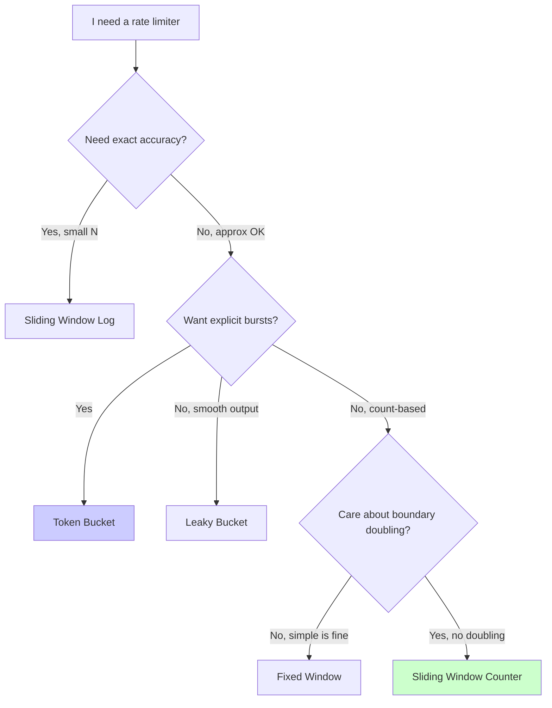
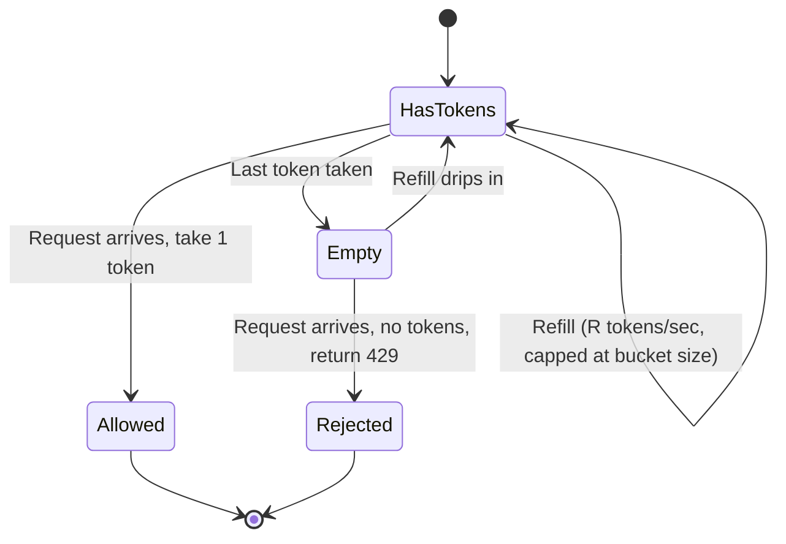
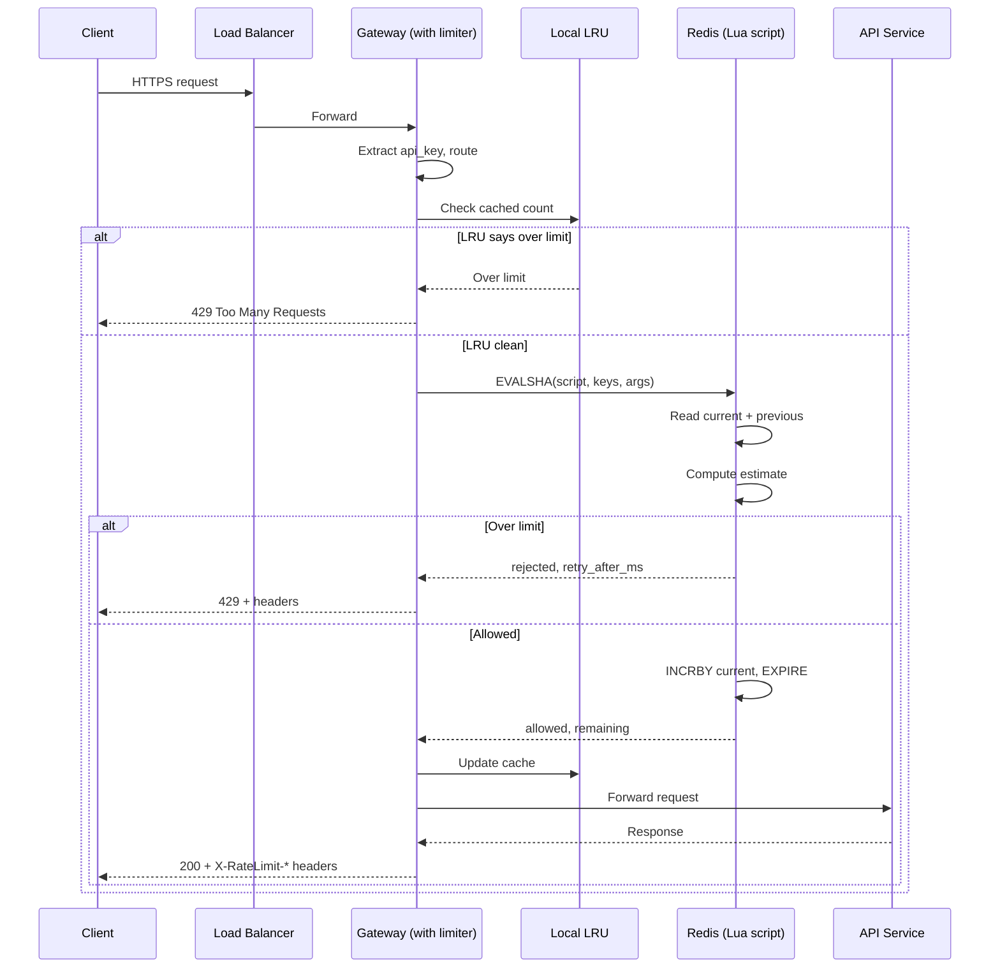
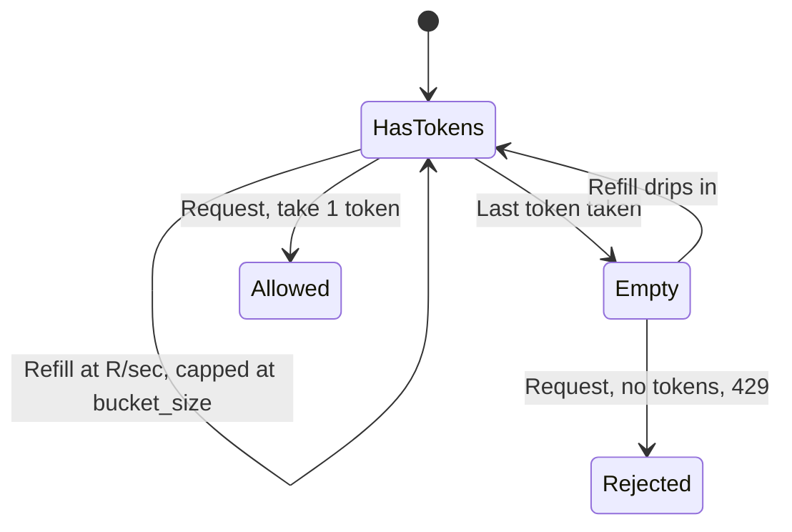


## The scene

You walk into the second round of an onsite. The interviewer runs the API gateway team at a SaaS company. They write one sentence on the whiteboard.

> *"Design a rate limiter for our public API."*

Then they add: *"We have free, pro, and enterprise tiers. Each tier has a different limit. The API runs on 200 gateway servers. Make it work."*

It looks small. It is not. Most candidates say "token bucket in Redis" in 30 seconds and then run out of things to say. The algorithm is the easy part. The hard parts are:

- Where does the limiter sit?
- What happens when Redis dies?
- How do 200 gateway nodes share one counter?
- How do we not make every API call slower because of the check itself?

We will walk through all of this. We will start small and grow the design step by step.

> **Why a rate limiter at all?** Without one, a single buggy client (or one attacker) can hammer your API and bring everything down for everyone else. The limiter is the bouncer at the door. It lets only a fair number of requests through per client per second.

---

## Step 1: Ask the right questions

Before you draw anything, sit for five minutes. Write down questions you would ask the interviewer.

A good answer here is not "ten questions about every edge case." It is the small handful of questions that change the design if the answer changes.

<details markdown="1">
<summary><b>Show: 8 questions that matter</b></summary>

1. **What do you limit on?** Per IP? Per API key? Per user_id? Per route? Some mix? *(This is the biggest question. A per-IP limit fails the moment a company NAT puts 10,000 employees behind one address. A per-API-key limit is useless against an attacker who rotates keys. Real systems use layers.)*

2. **What does the limit mean?** Is it 100 requests per minute on the clock? Or 100 in any rolling 60-second window? Are short bursts okay? *(Fixed windows are easier. Sliding windows are more fair. Bursts are usually allowed so the API feels snappy.)*

3. **Same limit for everyone?** Or does each tier (free, pro, enterprise) have its own? Can one big customer get an override? *(Almost always tiered with overrides. Shapes the config store.)*

4. **What if the store is down?** If Redis dies, do we let everything through (fail-open) or block everything (fail-closed)? *(This is a business question disguised as a technical one. Most public APIs fail-open. Payment APIs fail-closed.)*

5. **What do we return on a reject?** A 429 with `Retry-After`? Headers like `X-RateLimit-Remaining` so good clients can self-throttle? *(Headers are table stakes. Skipping them is a red flag.)*

6. **Count requests, or cost?** Is one search query worth the same as one health check? Or should the search cost 5 "units"? *(Cost-based limits are common at scale and add real complexity.)*

7. **How much latency can the check add?** Under 1ms means in-process. Under 5ms means one Redis round trip. Over 10ms is a problem. *(Sets the latency budget.)*

8. **Traffic numbers.** Total QPS? P99 per-client QPS? How many distinct clients? *(Without this you cannot size Redis.)*

The two that matter most: **what do you limit on** and **what happens when the store is down**. If you skip those, you are answering a different (smaller) problem.

</details>

---

## Step 2: How big is this thing?

The interviewer gives you these numbers:

- 100K total API requests per second, peak 300K
- 100K distinct API keys
- Free tier: 100 req/min. Pro: 1,000/min. Enterprise: 10,000/min.
- Most clients sit at 1 to 10 percent of their limit. A few sit near the cap.
- 200 gateway nodes in the fleet.
- The check must add no more than 2ms at P99.

Try the math first. Compute:

1. How many counter updates per second?
2. How much memory to track all 100K clients?
3. How many limit checks per second on each gateway node?
4. How many Redis ops per second if every check is a round trip?

<details markdown="1">
<summary><b>Show: the math</b></summary>

**Counter updates per second.**
Every request bumps a counter. 300K QPS at peak means **300K writes per second** baseline. Keep a few counters per client (per-minute, per-hour, per-route) and you multiply by 3 to 5. Call it **~1M Redis ops/sec at peak**.

**Memory for state.**
100K clients x ~3 counters each x ~100 bytes per counter = **30MB**. Tiny. Fits on one Redis node. We still shard for availability, not for capacity.

**Per-node QPS.**
300K / 200 gateway nodes = **1,500 checks per second per gateway**. Easy in-process. But each check that talks to Redis is one network round trip. That is 1,500 round trips per node per second.

**Redis ops if every check is a round trip.**
300K req/sec x 2 ops per check (read, then maybe increment) = **600K ops/sec** on the Redis cluster. One Redis instance handles about 100K ops/sec comfortably. So we shard, or cache locally, or both.

**What the math tells us:**

The state is small. The challenge is **how many times we touch the store per request**, not how much we store.

> Why this matters: Every saved Redis round trip saves real latency and money. The whole design centers on cutting round trips for hot keys.

</details>

---

## Step 3: Pick the algorithm

There are five common rate limiting algorithms. Each makes a different trade between memory, accuracy, and how it handles bursts.

Try to guess the rough idea of each before reading on:

- Token bucket
- Leaky bucket
- Fixed window counter
- Sliding window log
- Sliding window counter

Here is a quick flowchart of how to pick one:



<details markdown="1">
<summary><b>Show: side-by-side comparison</b></summary>

| Algorithm | How it works | Memory per client | Burst behavior | Boundary problem | When it is wrong |
|-----------|--------------|-------------------|----------------|------------------|-------------------|
| **Token bucket** | A bucket holds up to N tokens. It refills at R tokens/sec. Each request takes one. Empty = reject. | ~16 bytes | Allows bursts up to bucket size, then throttles to R | None | When you want zero bursts |
| **Leaky bucket** | Requests enter a queue. The queue drains at fixed rate R. Full queue = reject. | ~16 bytes plus the queue | Smooths spikes by queuing them | None | When latency matters (queuing adds delay) |
| **Fixed window** | Count requests in the current minute. Window resets on the clock. | ~16 bytes | Allows 2x burst right at the boundary | Bad: 100 at 11:59:59 plus 100 at 12:00:00 | When clients notice the doubling |
| **Sliding window log** | Store the timestamp of every request in the last window. | O(N), can be many MB | Exact | Best possible | When N is large (10K x 8 bytes x 100K clients = 8GB) |
| **Sliding window counter** | Weighted blend of the current window count and the previous window count. | ~24 bytes | Close to ideal, no boundary jump | ~99% accurate vs true sliding | When you need exact correctness (rare) |

**My pick: sliding window counter.**

- O(1) memory per client (like fixed window).
- No boundary doubling.
- Fits in a ~10-line Redis Lua script. Atomic. P99 under 1ms.
- The 1% inaccuracy is invisible to clients.

**Token bucket** is a strong second choice. AWS and Stripe use it. Pick it when you want explicit burst control (200 right now, then 1 per second after).

> Why this matters: most candidates pick token bucket because they have heard of it. The real question is *why* a sliding window counter exists. The answer: fixed window has the boundary problem, sliding window log uses too much memory, and the counter is the cheap fix for both.

</details>

---

## Step 4: A picture of the token bucket

The token bucket is the easiest to visualize. Think of a real bucket that holds, say, 200 tokens. A pipe drips 1 token per second into it. Each request scoops out 1 token. If the bucket is empty, the request is rejected.



Two things to notice:

- **Idle time fills the bucket.** If nobody calls for a minute, the bucket fills up (capped at its size). The next burst can scoop out everything at once.
- **Sustained calls throttle to the refill rate.** Once the bucket drains, you can only call as fast as the bucket refills.

> Real world: a bucket of size 200 with refill rate 1/sec lets a client send 200 requests in one second, then slows them to 1/sec after that. Good for clients that batch-load and then idle.

---

## Step 5: Where does the limiter live?

You have four options for where the limiter runs. Try to fill in the gaps below. Where would *you* put it?

```
   Client ───►   +-------------+
                 |   [ ? ]     |  (TLS, route by host)
                 +------+------+
                        |
                        v
                 +-------------+
                 |   [ ? ]     |  (where does the limiter run?)
                 |             |  +---------------+
                 |             |->|   [ ? ]       |  (shared state? local? both?)
                 |             |  +---------------+
                 +------+------+
                        |  allowed? -> forward
                        |  rejected? -> 429
                        v
                 +-------------+
                 |  API service|
                 +-------------+

   Failure path: if [ ? ] is unreachable, the limiter must decide:
                 fail-open (allow) or fail-closed (reject)?
```

<details markdown="1">
<summary><b>Show: the full picture and why</b></summary>

```
   Client ───►   +-----------------+
                 |  Load Balancer  |  Anycast IP, TLS termination,
                 |  (L7)           |  health-checks gateways
                 +--------+--------+
                          |
                          v
                 +-----------------+
                 |  API Gateway    |  Stateless. Runs the limiter
                 |  (200 nodes)    |  as in-process middleware.
                 |                 |  Each node keeps a small LRU
                 |  +-----------+  |  cache of recent counter values.
                 |  | Limiter   |  |
                 |  | middleware|--+-----------+
                 |  +-----------+  |           |  Lua script:
                 +--------+--------+           |  atomic check + INCR,
                          |                    v  returns
                          |  allowed   +-----------------+
                          v            |  Redis Cluster  |
                 +-----------------+   |  Sharded by key |
                 |   API Service   |   |  hash, replicated|
                 +-----------------+   +-----------------+

   Failure path: if Redis is unreachable from a gateway node,
   that node falls back to in-process counters with a stricter
   ceiling. Loud alert immediately.
```

**Why each piece is here:**

- **The load balancer is not the limiter.** Load balancers see TCP connections. They cannot see the API key inside the HTTP request. A limiter at the LB can only do per-IP, which is the weakest defense (NAT, IP rotation).

- **In-process middleware on the gateway.** The limiter is a *library*, not a separate service. Calling out to a "rate limiter service" would add one network hop per API call. That doubles the latency budget.

- **Per-node LRU cache (the trick).** A tiny local cache says "this key was already over the limit 50ms ago, don't ask Redis again." This cuts Redis traffic by 80% or more for abusive clients. More on this in Step 6.

- **Redis cluster for shared state.** All 200 gateway nodes share counters here. Sharded by client key. Lua scripts run atomically (read + check + increment in one shot).

- **Cold archive (optional).** When a customer asks "why did you block me yesterday?", the Redis counters have already expired. Stream rejection events to S3 + ClickHouse so you can answer the question.

</details>

---

## Step 6: How do 200 nodes share one counter?

This is the heart of the design. Without sharing, every gateway has its own count. A client could get N requests through each node and effectively get 200N total.

You have three real options. Think through each before reading on:

- **Central Redis.** Every check is a remote call.
- **Local counters with gossip.** Each node has its own counter. Nodes broadcast their counts every few seconds.
- **Local-first with reconciliation.** Each node has a local counter, drains it to Redis on a schedule.

<details markdown="1">
<summary><b>Show: compare and pick</b></summary>

| Approach | Accuracy | Latency | If Redis dies | Use when |
|----------|----------|---------|----------------|----------|
| **Central Redis** (atomic Lua) | Exact | 1 to 2ms per check | Limiter is down. Pick fail-open or fail-closed. | Default. The right answer at this scale. |
| **Gossip** | Lags. Burst of Nx200 before gossip catches up. | Sub-millisecond | Each node keeps going | Latency is brutally tight and limits are soft |
| **Local-first** | Approximate. Drift bounded by interval. | Sub-ms on hot path | Survives short outages. Drift grows with outage length. | Low latency *and* central state needed, ~10% drift is okay |

**My pick: central Redis with Lua scripts, plus a per-node LRU cache to skip Redis for known-hot keys.**

Per-request flow:

1. Compute the key. Example: `rl:apikey:sk_live_xyz:search:1716381660`.
2. Check the local LRU. If the cached count is already over the limit, **reject right away. No Redis call.**
3. Otherwise, run the Lua script on Redis. It does: read current, read previous, check estimate, increment if okay. All atomic.
4. Update the LRU with the new count.

> Why the LRU is the trick: for a client hammering at 100x their limit, only the first few requests per window hit Redis. Everything else fast-fails on the local cache. Redis traffic drops by 90% or more *exactly when you need the savings most*.

**The small race we accept.** Two requests on different nodes within 1ms can both pass the LRU before its update lands. With 200 nodes and a 100/min limit, the theoretical overshoot is ~400 requests in a window. In practice it is under 10. Invisible to users.

</details>

---

## Step 7: What happens when Redis dies?

This is the question that separates senior from mid-level. Most candidates have not thought it through.

Three failure modes to walk through:

1. **One Redis primary shard fails.** Its replica takes over.
2. **One gateway node loses its Redis connection.** Others still have it.
3. **The whole Redis cluster is down.** Nothing works.

<details markdown="1">
<summary><b>Show: how to handle each</b></summary>

**1. Single shard failover.**
The replica gets promoted. There is a 5 to 30 second window where some keys might serve stale data. Acceptable. Redis Sentinel or Redis Cluster do this automatically. The gateway retries on errors.

**2. One node loses Redis.**
That node falls back to in-process counters. It now under-counts (it cannot see traffic on the other 199 nodes), so a client routed there can get extra requests. We bound the damage two ways:
- Set a stricter local ceiling (for example, burst x 1.5).
- The load balancer marks the node unhealthy. Traffic shifts to other nodes.

**3. The whole Redis cluster is down.** This is a disaster. You have two choices.

| Choice | What it does | Right for |
|--------|--------------|-----------|
| **Fail-open** | Every gateway uses its local LRU only. Limits become per-node, not global. A client might get 200x their limit. The API keeps serving. | Public read APIs (`/api/search`, `/api/list`). Uptime matters more than perfect enforcement. |
| **Fail-closed** | Every check returns rejected. The API stops serving. | Payment, login, money transfer. Abuse risk is bigger than downtime risk. |

Make the choice **per route**, not globally. `/api/search` fails open. `/api/transfer-money` fails closed.

Whatever you pick, make the failure **loud**:
- Page on Redis cluster down.
- Emit a `limiter.degraded_mode` metric per gateway.
- Run a canary that tests the limiter rejects when over limit, so a silently broken limiter is caught.

> The bad answer is "we just use Redis." If you cannot answer "what when Redis dies?", the interview is over.

</details>

---

## Step 8: What you return on a reject

The limiter has rejected the request. What do you send back? What do good clients need so they can back off correctly?

<details markdown="1">
<summary><b>Show: the response format</b></summary>

**HTTP status: 429 Too Many Requests.** Not 503. 503 means "the server is overloaded, try anywhere." 429 means "you specifically are over your limit, others are fine."

**Headers (required):**

```
HTTP/1.1 429 Too Many Requests
Retry-After: 28
X-RateLimit-Limit: 100
X-RateLimit-Remaining: 0
X-RateLimit-Reset: 1716381660
Content-Type: application/json
```

**Body:**

```json
{
  "error": "rate_limited",
  "message": "Request exceeds rate limit of 100 requests per minute.",
  "retry_after_seconds": 28,
  "doc_url": "https://api.example.com/docs/rate-limits"
}
```

**Send headers on allowed requests too.**
`X-RateLimit-Limit`, `X-RateLimit-Remaining`, `X-RateLimit-Reset` on every response, not just 429s. Good clients use them to self-throttle before they ever get rejected. The cost is about 30 bytes per response. Nothing.

**`Retry-After` is computed, not guessed.**
- For sliding window: time until enough of the current window has rolled off.
- For token bucket: time until the next token refills.
- Don't make the client guess.

**Doc URL.**
Always include a link to the rate-limit docs. The single most effective thing you can do to cut support tickets. Half the developers who see it go read the docs instead of opening a ticket.

</details>

---

## Step 9: A request, drawn end to end

Here is the full life of one request through the system.



That whole flow is under 2ms at P99 for the happy path.

---

## Follow-up questions

Try to answer each one in 3 or 4 sentences before peeking at the solution.

1. **Multiple keys per request.** A request has an IP, an API key, and a user_id. Do you check all three rate limits in parallel or one after the other? What if the API key limit allows it but the IP limit does not?

2. **Limits per route.** `/api/search` is expensive. `/api/health` is cheap. Same client, same tier. How do you express this in your data model?

3. **Cost-based limits.** Instead of "100 requests per minute," the limit is "100 units per minute." A search costs 5 units. A lookup costs 1. What changes in the limiter?

4. **Burst allowance.** A client should be able to send 200 in the first 10 seconds of a minute but still total 1000 in that minute. Which algorithm? How do you configure it?

5. **IP rotation (botnet).** An attacker rotates through 10,000 home IPs. Per-IP limits are useless. What do you do?

6. **Customer override.** Enterprise customer X negotiated a 100x limit. Where do you store the override? How fresh must it be? What if the override service is down?

7. **Distributed accuracy.** Two requests from the same client land on two gateway nodes within 1ms. Both check Redis. Both see count = 99 (under 100 limit). Both INCR. Now count = 101 and both were allowed. What stops this?

8. **Pre-warming a known burst.** A customer says they will run a batch job at 2 AM that needs 10,000 requests in 60 seconds, way over their normal limit. How do you let them through without raising their permanent limit?

9. **"User spam" vs "user got popular".** A blog post hits Hacker News. A user's API endpoint sees 10x traffic. The limiter blocks them. Is that correct? How would you build a smarter signal?

10. **The limiter is the bottleneck.** Your dashboard shows the limiter middleware is adding 8ms to P99 latency. Where do you look first?

---

## Related problems

- **[URL Shortener (001)](../001-url-shortener/question.md).** The `POST /links` endpoint sits behind exactly this kind of limiter. The design plugs in directly.
- **[Distributed Cache (009)](../009-distributed-cache/question.md).** The Redis cluster backing the limiter *is* a distributed cache. The eviction, sharding, and replication choices there set the limiter's failure modes.
- **[News Feed (002)](../002-news-feed/question.md).** Both the `POST /posts` endpoint and the timeline read path need rate limiting. The cost-based pattern in follow-up 3 is exactly how feeds throttle expensive ranking queries.


<div class="pr-solution-divider"></div>


## Solution: Rate Limiter

### The short version

A rate limiter is a small piece of code with a huge blast radius. The algorithm is the easy part. What actually matters:

- **Where does the check run?** In-process middleware on each gateway, not a separate service. A separate service would add a network hop per API call.
- **How do nodes share state?** Redis Cluster with one atomic Lua script per check.
- **What when Redis dies?** Configurable per route. Public reads fail-open. Money endpoints fail-closed.
- **How do you keep the limiter from being the bottleneck?** A tiny per-node LRU cache that fast-fails hot keys without touching Redis.

The best algorithm for almost every real system is the **sliding window counter**, written as a ~15-line Lua script. O(1) memory per client. No boundary doubling. Token bucket is a strong second pick when you want explicit bursts.

The interesting engineering is at the seams: layered keys (IP + API key + user_id), per-route cost weighting, customer overrides, and the operational stuff (429 headers, abuse forensics, fail mode per route).

---

### 1. The clarifying questions, recap

The two that matter most:

- *"What do you limit on?"* shapes the data model. (IP? Key? User? All three?)
- *"What happens when Redis is down?"* shapes the operational story.

Candidates who say "use a token bucket in Redis" without answering either of those have answered a different, smaller problem.

---

### 2. The math, in plain numbers

| Number | Value | Why it matters |
|--------|-------|----------------|
| Peak QPS | 300K | Drives Redis sizing |
| Counter writes/sec | 300K to 1M (with multi-counters) | One Redis can do ~100K/sec, so we shard |
| State size | ~30MB total | Tiny. Shard for availability, not capacity. |
| Per-node QPS | 1,500 | Easy. Hot path stays sub-ms in-process. |
| Wire bytes per check | ~120 | Negligible. The cost is round trips, not bytes. |

State is small. Requests are many. Every request must touch the limiter. Everything else is a consequence of those three facts.

---

### 3. The API and headers

The limiter is internal middleware. It does not have its own public API. It does produce public-facing headers on every API response.

**Allowed:**

```
HTTP/1.1 200 OK
X-RateLimit-Limit: 1000
X-RateLimit-Remaining: 847
X-RateLimit-Reset: 1716381660
...response body...
```

**Rejected:**

```
HTTP/1.1 429 Too Many Requests
Retry-After: 28
X-RateLimit-Limit: 1000
X-RateLimit-Remaining: 0
X-RateLimit-Reset: 1716381660
Content-Type: application/json

{
  "error": "rate_limited",
  "message": "Request exceeds rate limit of 1000 requests per minute.",
  "retry_after_seconds": 28,
  "doc_url": "https://api.example.com/docs/rate-limits"
}
```

Four things worth defending:

- **429 not 503.** 503 means "the server is overloaded, maybe try later anywhere." 429 means "*you* are over your limit, others are fine."
- **`Retry-After` is mandatory.** Well-written SDKs respect it. Others ignore it. Either way, sending it costs you nothing.
- **Headers on success too.** Good clients self-throttle. Saves you support tickets. The 30 bytes per response are worth billions of times over.
- **`X-RateLimit-Remaining` is honest.** After a rejected request, it is 0. Not -1. Not the raw counter. Don't leak internal state.

---

### 4. The data model

Two storage layers. Hot counters in Redis. Config in Postgres (or DynamoDB).

**Hot counters (Redis).**

Keys are composite:

```
rl:{scope}:{identifier}:{route_class}:{window_start_ts}
```

Examples:

```
rl:apikey:sk_live_xyz789:search:1716381600    -> integer count, TTL 120s
rl:ip:198.51.100.42:default:1716381600        -> integer count, TTL 120s
rl:user:user_42:write:1716381600              -> integer count, TTL 120s
```

The sliding window counter reads two keys per check (current window and previous window). TTL is 2x window length so the previous key is still around when needed.

> Why: a key without a TTL is a memory leak waiting to happen. Always set EXPIRE in the same Lua script that does the INCR.

**Config store (Postgres).**

```sql
CREATE TABLE rate_limit_tiers (
    tier_name        VARCHAR(32) PRIMARY KEY,    -- 'free', 'pro', 'enterprise'
    default_limit    INTEGER NOT NULL,           -- requests per window
    window_seconds   INTEGER NOT NULL,           -- typical 60
    burst_multiplier NUMERIC(3,2) NOT NULL DEFAULT 1.00
);

CREATE TABLE rate_limit_overrides (
    api_key        VARCHAR(64) NOT NULL,
    route_class    VARCHAR(32) NOT NULL,         -- 'default', 'search', 'write'
    limit_value    INTEGER NOT NULL,
    window_seconds INTEGER NOT NULL,
    valid_until    TIMESTAMPTZ,                  -- NULL = permanent
    reason         TEXT,                         -- audit trail
    PRIMARY KEY (api_key, route_class)
);

CREATE TABLE rate_limit_route_costs (
    route_pattern  VARCHAR(128) NOT NULL,        -- '/api/v1/search'
    route_class    VARCHAR(32) NOT NULL,         -- which counter to charge
    cost_units     INTEGER NOT NULL DEFAULT 1,   -- search = 5, lookup = 1
    PRIMARY KEY (route_pattern)
);
```

Three small things doing real work:

**Tiers in a tiny static table.** Loaded into every gateway at startup. Refreshed every 60 seconds. A tier change takes up to a minute to spread. That is fine. Limits are not security boundaries.

**Overrides keyed by (api_key, route_class).** An enterprise customer with raised search limits but default write limits is two rows, not one JSON blob. Easier to debug.

**Route costs in a separate table.** Pricing team owns costs. Sales team owns overrides. Keeping them separate avoids merge conflicts and confused ownership.

---

### 5. The five algorithms

#### a. Token bucket

```
state = (tokens, last_refill_ts)

on_request:
    now = current_time()
    elapsed = now - last_refill_ts
    tokens = min(bucket_size, tokens + elapsed * refill_rate)
    last_refill_ts = now
    if tokens >= 1:
        tokens -= 1
        return allowed
    else:
        return rejected
```

Two knobs: `bucket_size` (max burst) and `refill_rate` (sustained). A bucket of 200 refilled at 1/sec allows a burst of 200, then 1/sec after.

State diagram:



Pros: explicit burst control. Used by AWS, Stripe, most public clouds.

Cons: the refill calculation is stateful. Two concurrent requests reading `(tokens, last_refill_ts)` at the same moment can both add the refill amount, double-spending. Atomic Lua handles it, but the script is longer than the sliding-window one.

#### b. Leaky bucket

Same idea but flipped: requests enter a queue, the queue drains at a fixed rate, a full queue rejects. The output is a smooth, constant stream.

Almost nobody uses this for API rate limiting. The queue adds latency. Used in network traffic shaping, not APIs.

#### c. Fixed window counter

```
key = "rl:apikey:xyz:1716381600"   # minute-aligned timestamp
count = INCR(key)
EXPIRE(key, 120)
if count > limit: reject
```

Three lines of Redis. Beautiful. Broken at boundaries. A client can send `limit` requests at 11:59:59 and `limit` more at 12:00:00, getting `2 x limit` in two seconds.

For loose advisory limits this is fine. For limits you advertise to customers, it is embarrassing.

#### d. Sliding window log

```
key = "rl:apikey:xyz"
ZREMRANGEBYSCORE(key, 0, now - window)    # drop expired
count = ZCARD(key)
if count < limit:
    ZADD(key, now, request_id)
    EXPIRE(key, window)
    return allowed
else:
    return rejected
```

Stores every request timestamp. Exactly correct. Memory is 8 bytes per request x N requests x M clients. At a 1000 limit x 100K clients = **80GB**. Unworkable.

#### e. Sliding window counter

The right answer. Section 6.

---

### 6. Sliding window counter, in depth

#### The idea

Fixed window has the boundary problem because the count snaps to zero at the boundary. True sliding solves it but costs O(N) memory. The sliding window counter is the cheap approximation: keep **two** fixed-window counters (current and previous) and compute a weighted blend.

If we are 30 seconds into the current minute and the previous minute had 80 requests, the current minute has 40 so far, the estimate is:

```
estimated = current + previous * (1 - elapsed / window)
          = 40 + 80 * (1 - 30/60)
          = 40 + 40
          = 80
```

The blend smooths the boundary. At the exact boundary (elapsed = 0), the estimate is `0 + previous * 1.0 = previous`. As time passes, the previous window contribution decays linearly. By the end of the current minute, the estimate is `current + 0`.

ASCII picture:

```
   t0                 t0+window           t0+2*window
   |                       |                    |
   v                       v                    v
   +----------------------+----------------------+
   |  previous window     |  current window      |
   |  count = P           |  count = C           |
   +----------------------+----------------------+
                          ^       ^
                          |       |
                          |       +-- now (elapsed_ms into current)
                          |
                       boundary: no doubling, contribution shifts smoothly

   estimated = C + P * (1 - elapsed_ms / window_ms)

       elapsed = 0       -> C + P * 1.0  (start of new window)
       elapsed = w/2     -> C + P * 0.5  (mid window)
       elapsed = w - 1ms -> C + P * ~0   (about to roll over)

   Decision:
       estimated + cost > limit  -> REJECT (compute retry_after)
       otherwise                  -> INCRBY current, ALLOW
```

#### The Lua script

The whole limiter logic, in one atomic script:

```lua
-- KEYS[1] = current window key, e.g. "rl:apikey:xyz:1716381660"
-- KEYS[2] = previous window key, e.g. "rl:apikey:xyz:1716381600"
-- ARGV[1] = limit (e.g. 1000)
-- ARGV[2] = window_seconds (e.g. 60)
-- ARGV[3] = now_ms (current time in milliseconds)
-- ARGV[4] = cost (units to charge, default 1)
-- Returns: { allowed (0|1), remaining, retry_after_ms }

local limit          = tonumber(ARGV[1])
local window_seconds = tonumber(ARGV[2])
local now_ms         = tonumber(ARGV[3])
local cost           = tonumber(ARGV[4])

local current  = tonumber(redis.call('GET', KEYS[1])) or 0
local previous = tonumber(redis.call('GET', KEYS[2])) or 0

-- How far into the current window are we, as a fraction [0,1)?
local window_ms   = window_seconds * 1000
local elapsed_ms  = now_ms % window_ms
local prev_weight = (window_ms - elapsed_ms) / window_ms

local estimated = current + math.floor(previous * prev_weight)

if estimated + cost > limit then
    -- Time until enough of the previous window has rolled off.
    local need_to_shed   = (estimated + cost) - limit
    local retry_after_ms = math.ceil((need_to_shed / math.max(previous, 1)) * window_ms)
    return { 0, 0, retry_after_ms }
end

-- Allowed. Increment the current window counter.
local new_current = redis.call('INCRBY', KEYS[1], cost)
-- TTL is 2x window so previous-window keys live long enough to be read.
redis.call('EXPIRE', KEYS[1], window_seconds * 2)

local remaining = math.max(0, limit - (estimated + cost))
return { 1, remaining, 0 }
```

Five things worth pointing at:

**One Redis round trip.** Two GETs, one conditional INCRBY, one EXPIRE, all inside one Lua execution. The gateway makes a single call.

**Atomic.** Two concurrent requests cannot both pass the check at count = limit - 1. Lua runs serially within a Redis shard.

**Clock from the caller, not Redis.** The gateway passes `now_ms`. On purpose. If Redis decides "now" via TIME, clock skew between Redis nodes during failover can make the same key map to different windows. The caller's clock is the authority.

**`cost` parameter supports cost-based limits.** An expensive query charges 5, a cheap one charges 1, no extra Redis calls.

**`retry_after_ms` is computed, not guessed.** Approximate (assumes the previous count is the rate going forward) but a much better hint than a fixed value.

#### Gateway-side code

```python
SCRIPT_HASH = redis.script_load(LUA_SCRIPT)   # done once at startup

class Limiter:
    def __init__(self, redis_client, local_cache_size=10000):
        self.redis = redis_client
        self.lru = LRUCache(local_cache_size)  # key -> (count_estimate, exp_ms)

    def check(self, api_key, route_class, cost=1):
        tier = config.get_tier_for(api_key)
        limit, window_s = tier.limit, tier.window_seconds

        now_ms = time.time_ns() // 1_000_000
        window_start = (now_ms // 1000 // window_s) * window_s
        prev_start = window_start - window_s

        cur_key  = f"rl:apikey:{api_key}:{route_class}:{window_start}"
        prev_key = f"rl:apikey:{api_key}:{route_class}:{prev_start}"

        # Fast path: if local LRU says we are already over, reject without Redis.
        cached = self.lru.get(cur_key)
        if cached and cached.count_estimate >= limit and cached.exp_ms > now_ms:
            return RateLimitResult(allowed=False, remaining=0,
                                   retry_after_ms=cached.exp_ms - now_ms)

        try:
            allowed, remaining, retry_ms = self.redis.evalsha(
                SCRIPT_HASH, 2, cur_key, prev_key,
                limit, window_s, now_ms, cost)
        except RedisError:
            return self._fail_mode(api_key, route_class, cost)

        # Update LRU so the next request can fast-fail without Redis.
        self.lru.set(cur_key, CachedCount(
            count_estimate=limit - remaining,
            exp_ms=now_ms + 100   # 100ms TTL on the cache entry
        ))

        return RateLimitResult(allowed=bool(allowed),
                               remaining=remaining,
                               retry_after_ms=retry_ms)

    def _fail_mode(self, api_key, route_class, cost):
        if config.fail_open_for(route_class):
            metrics.increment("limiter.degraded.fail_open")
            return RateLimitResult(allowed=True, remaining=-1, retry_after_ms=0)
        else:
            metrics.increment("limiter.degraded.fail_closed")
            return RateLimitResult(allowed=False, remaining=0, retry_after_ms=5000)
```

The LRU has a 100ms TTL per entry. Short enough that a real recovery (the client backed off) is honored. Long enough to absorb the next 5 to 10 requests from an abusive client without hitting Redis.

---

### 7. Architecture

```
                              Client (browsers, SDKs, batch jobs)
                                          |
                                          v
                                +---------------------+
                                |   Global LB / WAF   |   TLS termination,
                                |                     |   L4/L7 distribution
                                +----------+----------+
                                           |
                          +----------------+----------------+
                          |                |                |
                          v                v                v
                  +--------------+ +--------------+ +--------------+
                  |  Gateway 1   | |  Gateway 2   | |  Gateway N   |  200 stateless
                  |              | |              | |              |  nodes.
                  | +----------+ | | +----------+ | | +----------+ |
                  | | Limiter  | | | | Limiter  | | | | Limiter  | |  In-process
                  | |  + LRU   | | | |  + LRU   | | | |  + LRU   | |  middleware
                  | +-----+----+ | | +-----+----+ | | +-----+----+ |  per-node LRU.
                  +-------+------+ +-------+------+ +-------+------+
                          |                |                |
                          +----------------+----------------+
                                           |  EVALSHA Lua script
                                           v
                                +---------------------+
                                |   Redis Cluster     |  6 primary shards,
                                |   sharded by         |  one replica each.
                                |   {client_key}      |  Hash tags route
                                |                     |  same-client keys
                                +----------+----------+  to the same shard.
                                           |
                                           |  AOF + RDB snapshots
                                           v
                                +---------------------+
                                |  Redis Disk Backup  |
                                |  + S3 archive       |  Forensic
                                +---------------------+  reconstruction.

                          +------------------------------+
                          |  Config Service              |  Tiers, overrides,
                          |  (Postgres + 60s refresh on  |  route costs.
                          |   gateway side)              |  Read-mostly.
                          +------------------------------+

                          +------------------------------+
                          |  Decision log -> Kafka ->    |  Every reject and
                          |  ClickHouse                  |  a sample of allows
                          |                              |  for forensics.
                          +------------------------------+
```

Five things to notice:

- The limiter is **in-process middleware** on each gateway pod. A separate "rate limiter service" would double the latency budget. Library + remote Redis is the standard placement.
- The **local LRU** cuts Redis QPS for hot keys. Critical at scale.
- The **Redis cluster is sharded by client key.** All counters for one client land on the same shard so the Lua script reads both window keys without a cross-shard hop. Hash tag syntax `{api_key}` forces this in Redis Cluster.
- The **config service** is read-mostly. Refresh every 60 seconds on each gateway. If it dies, gateways use their last-known config.
- The **decision log** captures every reject. Streamed to ClickHouse. When customer success asks "why did we block customer X yesterday?", you have an answer.

---

### 8. Read and write paths

For a rate limiter, "read" and "write" both happen on every request. The check itself is an atomic read-and-conditional-write.

**Per-request path:**

1. Request arrives at gateway. TLS already terminated by the LB.
2. Auth middleware runs first. Extracts `(api_key, user_id, ip)`.
3. Limiter middleware computes the rate limit keys. Usually 3 to 4: per-API-key, per-IP, per-user, per-API-key-per-route.
4. For each key, check the local LRU. If any key is already known-over-limit, **reject immediately. No Redis call.**
5. If no fast-path hit, run all checks against Redis in **one pipelined batch**. One EVALSHA per key. ~1 to 2ms total.
6. Take the most restrictive result. If any key rejected, the request is rejected.
7. Update the local LRU with each key's new count.
8. If allowed: forward to the API service, attach `X-RateLimit-*` headers.
9. If rejected: return 429 with headers and JSON body. Emit a decision event to Kafka.

**Cost-based variation.**

- The Lua script takes a `cost` parameter (Section 6).
- The route table tells the limiter how many units to charge: `cost = route_cost_table[matched_route]`.
- A search costs 5 units. A health check costs 0 (free pass).

**Background config refresh.**

- Every 60 seconds, each gateway pulls a config snapshot.
- Loaded into a versioned in-memory map. Lookups are O(1).
- On parse error or fetch failure, gateway keeps the last-known-good config and logs a warning.

---

### 9. Scaling

**Redis sharding.**
- Shard by client key hash. `rl:apikey:{xyz}:search:...` routes all of client xyz's counters to the same shard because the `{xyz}` hash tag forces it.
- Why same-shard per client: the Lua script reads both current and previous window keys atomically. Different shards would need a cross-shard transaction, which Redis Cluster does not support.
- 6 shards to start. ~50K ops/sec per shard. Well under Redis limits. Scale by adding shards and migrating.
- One replica per shard for failover.

**Read replicas.**
- Counter reads (just GET, no INCR) *could* hit replicas. I don't, because Redis replicas are eventually consistent and the Lua script needs read+write atomically. Primary only.

**Per-node LRU.**
- 10K-entry LRU per gateway. At 100 bytes per entry, that is 1MB per node. Trivial.
- Entry TTL: 100ms.
- Hit rate is highest for abusers (every request to a known-over-limit client fast-fails) and for popular API keys.

**Pipelining.**
- Requests with multiple keys: all EVALSHAs go in one Redis pipeline call. One round trip for N checks.

**Geo-distribution.**
- Per-region Redis cluster. Counters are not synced across regions.
- A client routed to us-east has a separate counter from the same client routed to eu-west. Cross-region sync would add 100ms+ to every check.
- Practical effect: a client using two regions concurrently could get up to 2x their limit. Most clients use one region. Academic.
- For true global limits (rare): central counter store, accept the latency penalty, document the trade-off.

---

### 10. Reliability

**Redis primary failure.** Sentinel or Cluster promotes the replica. ~10 to 30s window. During it, Lua scripts fail and the gateway falls into degraded mode. Fail-open or fail-closed per route.

**Network partition.** Treat as Redis-down from that gateway's view. Others still have Redis. The partitioned gateway should also fail its health check so the LB stops routing to it. Single most effective defense: don't serve traffic from a node that cannot enforce limits.

**Slow Redis.** P99 latency on the Lua script climbs to 50ms. The whole API gets slower. Use a per-call timeout (for example, 5ms) with a circuit breaker. After N consecutive timeouts the gateway flips to degraded mode.

**Full cluster outage.** Configurable per route:

| Route class | Fail mode | Why |
|-------------|-----------|-----|
| `/api/search`, `/api/list` (read) | fail-open | API uptime matters more than precise enforcement |
| `/api/transfer`, `/api/pay` (money) | fail-closed | Abuse risk is bigger than downtime risk |
| `/api/login` (auth) | fail-closed | Brute force protection is the whole point |
| `/api/webhook` (callback) | fail-open with stricter local cap | Webhooks must keep flowing, cap to bound damage |

The fail-mode for each route lives in the config service. Default is fail-open. Engineering manager and security team both sign off on any fail-closed designation.

**Memory pressure on Redis.** Keys have a 2x window TTL, so old keys self-evict. No `maxmemory-policy allkeys-lru` on the limiter cluster. Explicit TTLs only. If memory pressure is real, you have too many active clients, not a configuration problem.

**Lua script bug.** A bad script could lock up Redis. Scripts are versioned. The gateway can roll back the SCRIPT_HASH it sends. Canary new scripts to one gateway, watch metrics for 10 minutes, then roll out.

**Counter drift after failover.** If a Redis primary dies before AOF sync, a few counters are lost. They reset to 0. Affected clients get a tiny extra allowance. Acceptable.

---

### 11. Observability

| Metric | Why |
|--------|-----|
| `limiter.check.latency.p99` per gateway | Over 5ms means slow Redis, bad Lua, or similar |
| `limiter.rejections_per_sec` by tier | Spikes mean abuse or a legitimate customer hitting their cap |
| `limiter.allowed_per_sec` by route | Baseline traffic per route |
| `limiter.local_cache_hit_rate` | Should be > 50% for hot keys. A drop suggests key churn or an attack |
| `limiter.redis_op_rate` | Tracks Redis cluster load, drives sharding decisions |
| `limiter.degraded_mode.fail_open_count` / `fail_closed_count` | Critical alert. Redis unreachable from at least one node |
| `limiter.script_eval_errors` | Lua failures (script update bugs) |
| `config.refresh.lag_seconds` | Stale config = wrong limits |
| `redis.cluster.shard_lag` | Replica lag |

**Page on:** `limiter.check.latency.p99 > 5ms for 5min`. Any `limiter.degraded_mode.*` sample. Any `script_eval_errors`.

**Ticket on:** rejection rate spike on any tier. Cache hit rate sustained drop.

**Per-customer dashboard:** their request rate, rejection rate, headroom against limit, tier. Customer success uses this when "the customer says they are throttled but they shouldn't be." 90% of those tickets resolve with "your client is sending more than your tier allows, here are the headers you ignored."

---

### 12. The scaling journey: 10 users to 1 million

This is the part interviewers care about most. At every stage, name what just broke and what fixes it. Build nothing before you need it.

#### Stage 1: 10 to 100 users

One Postgres, one app instance. The limiter is an in-process dictionary. No Redis. No config table (limits are constants in code). About $80/month.

This is enough. You see ten requests a minute. Anything more is over-engineering.

#### Stage 2: 1,000 users

What breaks: a customer asks for a higher limit and you have to deploy code to give it to them.

Move limits to a `rate_limit_tiers` Postgres table. Add a simple admin UI to manage overrides. Still no Redis (one app instance, in-memory counters are fine). ~$250/month.

#### Stage 3: 10,000 to 100,000 users

A lot breaks at once:

- Multiple app instances. In-memory counters drift. A client gets Nx more than they should.
- The slowest part of every API call is now the limiter check.
- A handful of abusive clients eat all the Redis bandwidth.

Fixes in order:

- Add Redis. Move counters there. One central counter per client per window.
- Use a Lua script for atomic check + increment.
- Add a per-node LRU. Fast-fail hot keys before hitting Redis.
- Shard Redis by client key. Six shards. One replica each.
- Add the decision log to Kafka -> ClickHouse for forensics.
- Add per-route fail mode (fail-open vs fail-closed).

Cost: $2K to $5K/month.

#### Stage 4: 1 million users

New problems:

- EU customers. EU data must stay in EU.
- Some routes are way more expensive than others. The flat per-request limit is wrong.
- One enterprise customer wants a 100x burst at 2 AM for their nightly batch.
- Botnet attacks rotate IPs.

Add per-region Redis clusters. Add cost-based limits (the `cost` param in the Lua script). Add the override table with `valid_until`. Add layered keys (IP + API key + user) and feed signals into a separate abuse-detection pipeline.

The core design has not changed since Stage 3. You added regions, knobs, and a separate abuse pipeline. The data model is the same.

#### What you would do at 10M users

Move counter state out of Redis to a purpose-built counter store (ScyllaDB or a custom in-memory grid). Push limit checks to the edge (PoPs) and accept some gossip-driven inaccuracy. Move tier resolution into a sidecar proxy (Envoy) so the gateway code does not have to know about tiers.

---

### 13. Follow-up answers

**1. Multiple keys per request.**

Three keys typically: per-IP, per-API-key, per-user. Check all three in **parallel via one Redis pipeline** (one round trip, three EVALSHAs). Take the most restrictive result: if any key rejected, the request is rejected.

Each key catches a different abuse vector. Per-API-key catches one key hammering. Per-IP catches one IP rotating keys. Per-user catches one user creating multiple keys.

Checking only one key leaves a gap. Checking sequentially adds 3x latency. Parallel pipelining is the answer.

**2. Limits per route.**

The route table maps URL patterns to a `route_class`:

```
/api/v1/search         -> "search"
/api/v1/users/:id      -> "default"
/api/v1/transfer       -> "write"
/health                -> "free" (always allowed)
```

The rate limit key includes `route_class`:

```
rl:apikey:xyz:search:1716381600    -> counter for search only
rl:apikey:xyz:default:1716381600   -> counter for default only
```

Per-tier configs specify limits per route_class:

```yaml
tier: pro
limits:
  search:  100/min
  write:   50/min
  default: 1000/min
```

A single API key has multiple parallel buckets. Search consumption does not eat into default consumption.

Cost: more Redis keys per client. With 4 route classes and 100K clients, that is 400K keys, ~40MB. Still tiny.

**3. Cost-based limits.**

The limit becomes "units per minute." A search costs 5. A lookup costs 1.

Implementation: the Lua script takes a `cost` parameter. The gateway looks up the cost for the matched route:

```python
cost = route_cost_table.get(matched_route_pattern, 1)
result = limiter.check(api_key, route_class, cost=cost)
```

The Lua script does `INCRBY cost` instead of `INCR`. The "would this push me over?" check is `estimated + cost > limit`.

Cost weights are not arbitrary. They should reflect real backend cost. Search hits Elasticsearch and is 50x more expensive than a Postgres lookup, so search costs 50. The hard part is keeping the table aligned with reality. Teams change service costs and forget to update the table.

**4. Burst allowance.**

The sliding window counter already allows a burst at the start of a window. For explicit bursts above the window limit, switch the route to **token bucket**.

Config:

```yaml
tier: pro
limits:
  default:
    algorithm: token_bucket
    bucket_size: 200       # max burst
    refill_rate: 16.67     # per second = 1000 / 60
```

The bucket holds 200 tokens, refills at 16.67/sec. The first 200 requests in 0 seconds are allowed. Then throttled to 16.67/sec. The switch is one branch in the limiter. Both algorithms have Lua scripts.

**5. IP rotation (botnet).**

Per-IP limits fail against botnets. Defense is layered:

- **Account/API-key-level limits** catch a botnet rotating IPs with one stolen key.
- **Behavioral signals across IPs.** User-agent stability, request path patterns, timing. If 10K IPs all hit `/api/login` with the same UA and pause exactly 1.0s between requests, that is one attacker. Feed this into a fraud-detection pipeline. Have it write to a `blocked_keys` set in Redis that the limiter consults.
- **IP reputation.** Subscribe to a known-botnet IP list (commercial feed, e.g. MaxMind). Apply stricter limits to those buckets.
- **CAPTCHA challenges** for unauthenticated endpoints. The limiter does not implement this. It hands off to a challenge service when suspicion crosses a threshold.

The limiter is one defense, not the only one. Treat it as a speed bump, not a wall.

**6. Customer override.**

Stored in `rate_limit_overrides` (Postgres). Gateway pulls a snapshot every 60 seconds.

Staleness: 60 seconds is fine. A customer who buys an upgrade sees their new limit within a minute. Acceptable because (a) limits are continuous, not transactional, and (b) customer success can manually flush the cache on upgrade.

If the config service is down, gateways use last-known config. The override is "remembered" indefinitely. The risk: a downgrade (override removed) takes effect only when the next config fetch succeeds. Acceptable.

For critical changes ("block this customer NOW"), there is a separate `blocked_keys` Redis set that the limiter consults on every request. Writing to it propagates instantly. Emergency channel, not the everyday path.

**7. Distributed accuracy / race conditions.**

Two requests at count = 99, both land on different gateways within 1ms. Both call EVALSHA.

Because the Lua script is **atomic at the Redis shard level**, only one will read count = 99 and increment to 100. The other will read count = 100 and reject (assuming limit = 100). **The Lua atomicity is the whole defense.**

If they were checking different keys (per-IP vs per-API-key) on different shards, they each succeed independently. Correct: different limits.

The only race the design does not prevent is the local LRU's brief inconsistency window (~100ms). During that window, a client can get 1 to 2 extra requests through per gateway. With 200 nodes, theoretical max overshoot is 400 requests. Practical overshoot in load tests is under 10. Documented. Nobody has complained.

**8. Pre-warming a known burst.**

Customer: "at 2 AM tomorrow we run a batch job. 10K requests in 60 seconds. Normal limit is 1K/min."

Three options:

- **Permanent raise.** Bad. They could abuse it the rest of the time.
- **Temporary override with `valid_until`.** Write a row to `rate_limit_overrides` with `valid_until = 2026-05-25 02:01:00`. Active only for that minute. **Recommended.**
- **Separate `/batch` endpoint** with its own higher limits, accessible only with a special API key. Best for recurring batch use cases.

The temporary override is the cleanest mechanism for one-off pre-announced bursts.

**9. "User spam" vs "user got popular".**

A blog post hits Hacker News. The blog's API endpoint sees 10x traffic. The limiter blocks them.

Was the block correct? Depends on whether the limit was protecting the API or the customer's bill.

- Protecting the API: limit was set with peak in mind. 10x is over peak. Block is correct.
- Protecting the customer from runaway costs: blocking is what they would want, but maybe not at this specific viral moment.

Smarter signals:

- **Trend detection.** Compare current minute's rate against the customer's 7-day P95. If it is 10x and sustained, that is a step-change, not a spike. Send an automated email: "Your API saw a 10x spike. You have been temporarily auto-throttled. Click here to raise your limit." Self-service relief.
- **Bot vs human.** If the 10x is human traffic (mixed UAs, geo-distributed, varied paths), it is probably real viral attention. If it is bot traffic (one UA, one geo, repeated path), it is scraping.
- **Cost signal.** If their account can pay for the burst, raise the limit automatically. If they are free-tier, throttle them and tell them.

The smart-signal layer sits next to the limiter and feeds in via config overrides. It is opt-in per customer. The limiter's job is to enforce. The smart layer's job is to decide.

**10. The limiter is the bottleneck.**

Observability says the limiter middleware adds 8ms P99. Budget was 2ms. Where to look:

1. **Redis latency.** Run `redis-cli --latency`. If Redis is the bottleneck, check shard CPU, network path, AOF settings (sync writes can stall everything).
2. **Pipelining.** Are checks for multiple keys being done sequentially instead of pipelined? One round trip per key x 3 keys = 3x latency. Should be one pipelined call.
3. **Local LRU misses.** If the cache misses on every request, every check hits Redis. Cache too small (raise size) or every request has a unique key (sign of an attack with varied identifiers).
4. **Lua script complexity.** Has someone added expensive logic? Profile with `SLOWLOG`.
5. **Gateway CPU.** If the pod is CPU-pegged, even fast Redis responses queue. Scale out.
6. **Connection pool exhaustion.** If the Redis pool on the gateway is small, requests wait for a free connection. Raise the pool or add nodes.

The first three explain ~90% of latency regressions in practice. A senior answer touches all six.

---

### 14. Trade-offs worth saying out loud

**Per-region vs global limits.** Per-region is the default because cross-region sync is too slow. Global limits exist only for enterprise contracts that require them. Implemented via a central counter store with explicit added latency. Document the trade-off. Don't pretend global is free.

**Tier complexity grows.** "Just 3 tiers" becomes 3 tiers x N routes x custom overrides x time-limited bursts. The data model in Section 4 handles this. Don't collapse it into one JSON blob per customer. Debugging will be miserable.

**Abuse detection is a separate system.** The limiter enforces. The abuse system decides who to enforce against. Keeping them separate lets each scale independently and lets the abuse system iterate on signals without touching the hot path.

**Why not put the limiter in front of the load balancer.** Tempting. Catch abuse before it costs a load balancer connection. But the limiter needs application identity (API key, user_id) which is inside the HTTP request. The LB does not parse HTTP. A thin L7 limiter at the edge for IP-only checks plus the full limiter at the gateway is what the big clouds do.

**Why not use the cloud provider's managed limiter.** AWS WAF, Cloudflare, etc. all offer rate limiting. Good for IP-level and bot mitigation. Not flexible enough for tiered customer pricing or cost-based limits. Most production APIs use both: cloud limiter as outer ring, custom limiter at the gateway as inner ring.

**What I would revisit at 10x scale.**

- Move counter state from Redis to a purpose-built counter store (ScyllaDB or a custom grid) once Redis Cluster cost becomes meaningful.
- Push limit checks to the edge (PoPs) for global APIs. Each PoP holds a partial counter. Gossip merges them periodically. Accept the inaccuracy.
- Probabilistic counting (HyperLogLog) for "distinct clients" signals that feed abuse detection.
- Move tier resolution into a sidecar proxy (Envoy) so gateway code does not have to know about tiers.

---

### 15. Common mistakes

Most weak answers fall into one of these:

- **"Just use a token bucket in Redis" with no further structure.** Skipped clarification. Did not address sharing across nodes. Did not address failure mode. Loses the candidate.
- **Implementing the limiter at the application layer.** Now every service has to know about rate limits. Centralize at the gateway.
- **Per-IP only.** Fails against NAT (corporate offices, mobile carriers) and against IP rotation. Layered keys is the only honest answer.
- **No mention of fail-open vs fail-closed.** The interviewer will ask. Have an opinion.
- **Forgetting `Retry-After`.** Polite clients respect it. Including it signals you have written real public APIs.
- **"Just put it behind a load balancer with rate limiting built in."** Fine for IP-level. Not fine for tier-based or key-based. The interviewer will ask how you handle the tier.
- **No mention of the local LRU.** At 300K QPS, round-trip count is the bottleneck. Local caching is the cheapest, biggest win. A senior candidate names it without prompting.
- **Confusing fixed and sliding windows.** Fixed resets at clock boundaries (100 at 11:59:59 + 100 at 12:00:00). Sliding counts the last N seconds rolling. The boundary doubling problem is the reason sliding exists.
- **Ignoring abuse detection.** Rate limiting and abuse detection are different systems. Acknowledge both even if asked only about the limiter.
- **Drawing one Redis box with no replication, no sharding, no failure plan.** Half the design score is in operational reality.

If you name 8 of these without prompting, you are interviewing at staff level. The three that separate strong from average: the local LRU, layered keys, and per-route fail mode.

