
## The scene

You sit down. The interviewer leans forward.

> *"Describe how YouTube works. Someone records a video on their phone in Tokyo. Someone else watches it on their TV in São Paulo. What happens in between?"*

It sounds like one problem. It is really two problems that share a database.

**Problem one: the upload pipeline.** A creator sends a 5 GB file. We take it, convert it to seven different resolutions, and cut each resolution into thousands of small chunks. We do this once per video. It is slow on purpose.

**Problem two: the playback path.** A billion hours of video are watched every day. The system has to send bytes to 125 million people at the same moment, each on a different network, each in a different city. It has to be fast. It does nothing else.

These two halves share almost nothing. They use the same metadata database and the same file storage. That is it. Candidates who try to design both at once in a single diagram get lost in ten minutes.

We will start with the smallest picture that captures the shape of the problem, then build up one layer at a time.

---

## Step 1: Picture one video's journey

Before any boxes, trace one video from phone to screen.

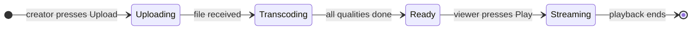

That is the whole product. A video starts as a raw file, becomes a set of small chunks at multiple quality levels, and then gets served to viewers from a server near them. Every design decision below exists to make one of those three transitions faster or cheaper.

> **Take this with you.** Video streaming is a pipeline, not a service. Upload and playback are two different systems. Treat them that way from the first sentence.

---

## Step 2: Ask the right questions

In a real interview, spend two minutes writing down your questions before drawing anything. Not twenty questions. Five focused ones.

<details markdown="1">
<summary><b>Show: 5 questions that change the design</b></summary>

1. **YouTube or Netflix?** They look the same from the outside. YouTube takes uploads from anyone (any quality, any format, billions of videos most people never watch). Netflix has a small curated library where nearly every video is popular. Storage tiering is nearly opposite: YouTube is cold-heavy, Netflix is mostly hot. *This is the biggest design fork.*

2. **Live or recorded (VOD)?** Live streaming needs sub-3-second glass-to-glass latency. Recorded video (VOD) is prepared once and served forever. They share almost no infrastructure. Scope to VOD and mention live as an extension.

3. **Which codecs?** H.264 encodes fast and plays everywhere. H.265 cuts file size by 30% but encodes 3x slower. AV1 cuts another 30% but is 15-30x slower than H.264 to encode. Deciding to support AV1 can multiply the compute bill by 5x. *The codec ladder is the transcoding budget.*

4. **How large can uploads be?** YouTube allows videos up to 256 GB. A file that large cannot arrive in one HTTP request. If the Wi-Fi drops at 4.9 GB, the user starts over unless you support resumable uploads.

5. **How fresh do analytics need to be?** View counts that are a few minutes stale are fine for the watch page. Creator dashboards that update hourly are fine. Anything under 5 seconds freshness requires a separate real-time pipeline. *Each freshness target is a different system and a different cost.*

A strong candidate also asks whether DRM is in scope. YouTube is ad-supported and open. Netflix encrypts every segment and requires a per-device license. The license server is its own system.

</details>

---

## Step 3: How big is this thing?

The same design phrase, two very different companies.

| Metric | YouTube scale | Smaller platform |
|--------|--------------|-----------------|
| Upload | 500 hours of video per minute | 5 hours per minute |
| Viewers | 125 million concurrent at peak | 1 million |
| Egress | 250 Tbps peak | 2.5 Tbps |
| Storage growth | 70 PB per year | 700 TB per year |

<details markdown="1">
<summary><b>Show: how the numbers come out</b></summary>

**Upload ingest.** 500 hours per minute = 500 × 60 = 30,000 seconds of video arriving every 60 seconds. That means 500 seconds of new footage lands every second (many creators uploading at once). At an average source bitrate of 10 Mbps per upload, that is 500 × 10 Mbps / 8 = **5 Gbps sustained**, roughly **15 Gbps at peak**.

**New videos per day.** 500 hours/min × 60 min × 24 hr / 4-min average video length ≈ **450,000 videos per day**, or about 5 per second at steady state.

**Concurrent viewers.** 1 billion watch-hours per day × 3,600 sec/hr / 86,400 sec/day = **42 million people watching at any moment** on average. At peak (Friday night, major event): about **125 million at once**.

**Peak egress.** 125 million viewers × 2 Mbps average (most people on mobile watch 480p or 720p) = **250 Tbps**. No single server, no single data center, can send that. This is the reason a CDN exists.

**Storage growth.** 500 sec of source video per second × 86,400 sec/day × 365 days/year × (10 Mbps / 8 bits per byte) ≈ **20 PB/year for source files**. Transcoded variants add another 50 PB/year (each source becomes 7-9 quality copies). Total: roughly **70 PB of new data per year**.

**Three numbers dominate the whole design:**

| Number | Size | Why it matters |
|--------|------|----------------|
| Peak egress | 250 Tbps | Requires a global CDN with hundreds of servers |
| Transcoding compute | Thousands of CPU cores | Running 24/7, just to keep up with uploads |
| Storage | 70 PB/year, growing forever | Tiering by access frequency saves ~5x in cost |

Everything in the architecture exists to keep one of these three numbers manageable.

</details>

---

## Step 4: The smallest thing that works

Forget YouTube. We are a tiny platform with 100 creators and 10,000 viewers.

Three boxes. One upload flow.

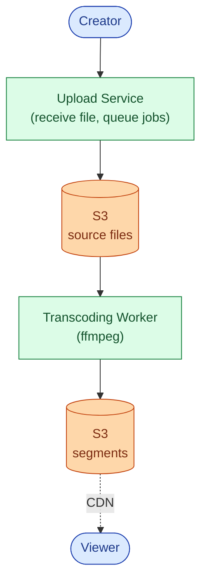

The sequence for an upload is short.

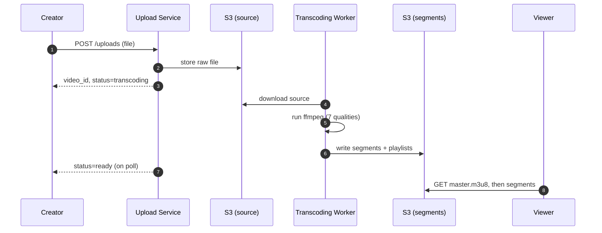

<details markdown="1">
<summary><b>Show: the two key tables</b></summary>

```sql
CREATE TABLE videos (
    video_id    VARCHAR(16) PRIMARY KEY,
    owner_id    BIGINT NOT NULL,
    title       VARCHAR(200),
    status      TEXT NOT NULL,   -- 'uploading', 'transcoding', 'ready', 'blocked'
    source_path TEXT,
    created_at  TIMESTAMPTZ NOT NULL DEFAULT NOW()
);

CREATE TABLE variants (
    video_id    VARCHAR(16),
    quality     VARCHAR(20),     -- '360p_h264', '1080p_h265'
    status      TEXT NOT NULL,   -- 'pending', 'encoding', 'ready', 'failed'
    output_path TEXT,
    completed_at TIMESTAMPTZ,
    PRIMARY KEY (video_id, quality)
);
```

`variants` has one row per (video, quality) so each transcoding job updates its own row independently. No locking on a shared JSON blob.

</details>

> **Take this with you.** At small scale, the whole system is a file upload, a background job, and a CDN URL. Complexity comes in when you need resumable uploads, queuing, and storage tiering, not before.

---

## Step 5: The first crack

The startup gets traction. Creators complain that a bad Wi-Fi connection makes them restart their 2 GB upload from zero. A 5-minute video is now 45 minutes because they have to keep trying.

The fix is resumable uploads. The idea: instead of one big HTTP request, the client sends 16 MB chunks. If a chunk fails, only that chunk retries.

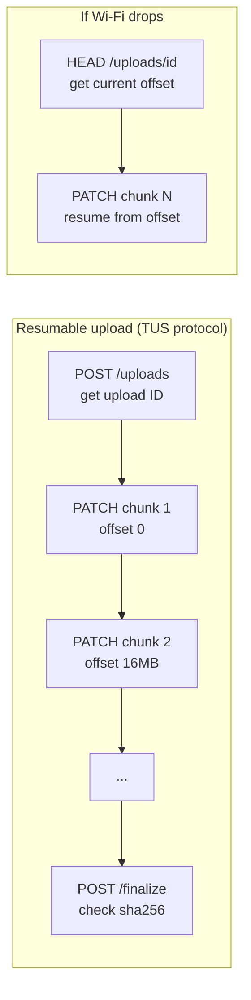

This is called the **TUS protocol** (or S3 multipart, which uses the same idea). The client calls `HEAD /uploads/<id>` to ask "where did we stop?" Then it continues from that byte offset. Only the failed chunk retries.

The second crack arrives right after: uploads are fast but transcoding is slow. A single worker falls behind when multiple creators upload at the same time. The worker needs to be a pool, not a single process. And a crash mid-job should not lose the work.

Both of these problems point toward the same fix: a durable job queue.

> **Take this with you.** Chunked uploads and a job queue are not extras. They are what makes the system work for anyone uploading from a phone.

---

## Step 6: Build the architecture, one layer at a time

### v1: one upload flow

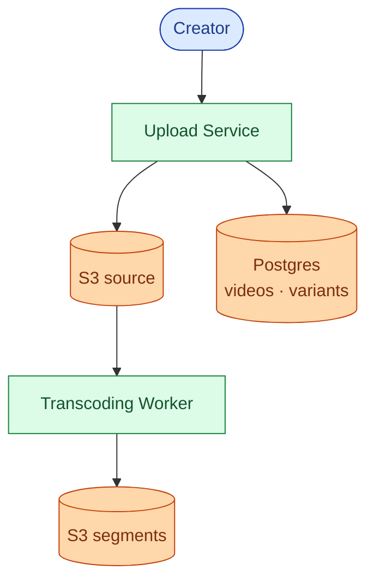

Fine for a few uploads per minute.

### v2: add a job queue so the worker pool can scale

When uploads outnumber workers, jobs need to wait somewhere. The queue also makes each job retryable: if a worker crashes, the job goes back to the queue.

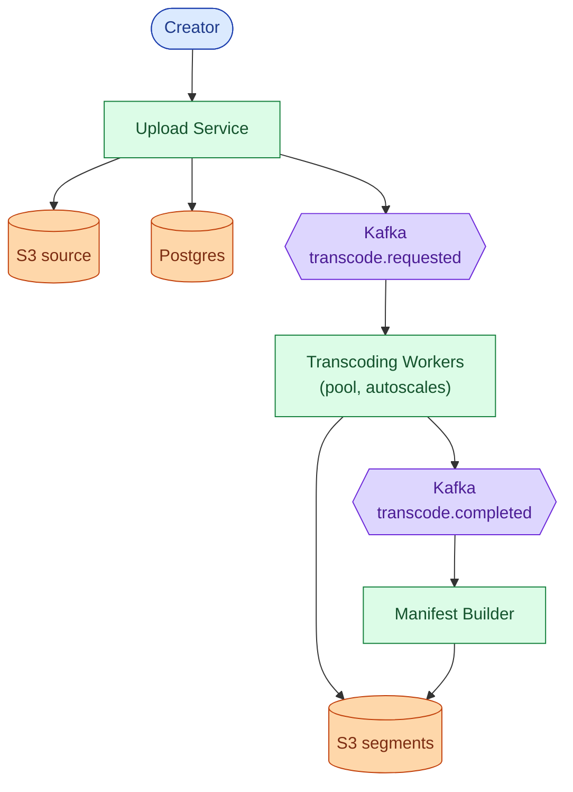

### v3: add the playback path

Upload and playback share almost nothing. The playback path is its own service.

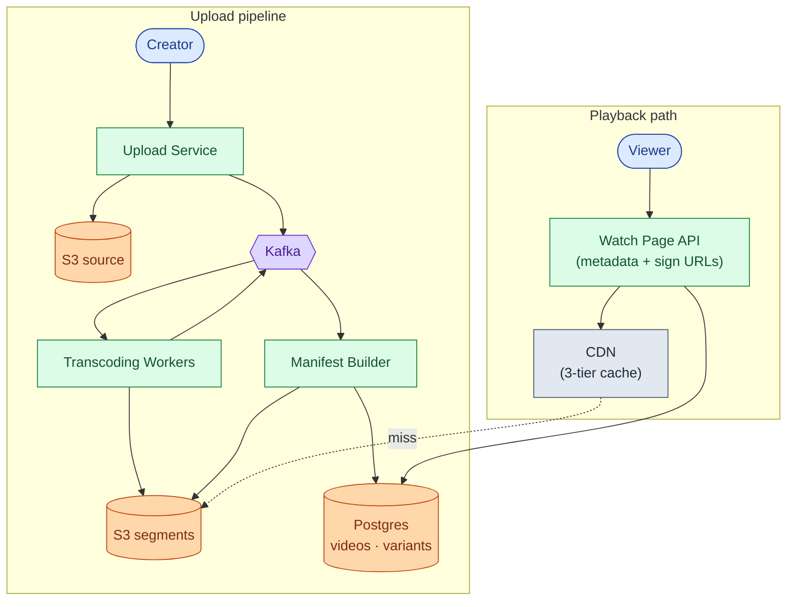

### v4: add telemetry, analytics, and storage tiering

Now viewers are watching and creators want to see data. And 70 PB/year of storage costs money unless you tier it.

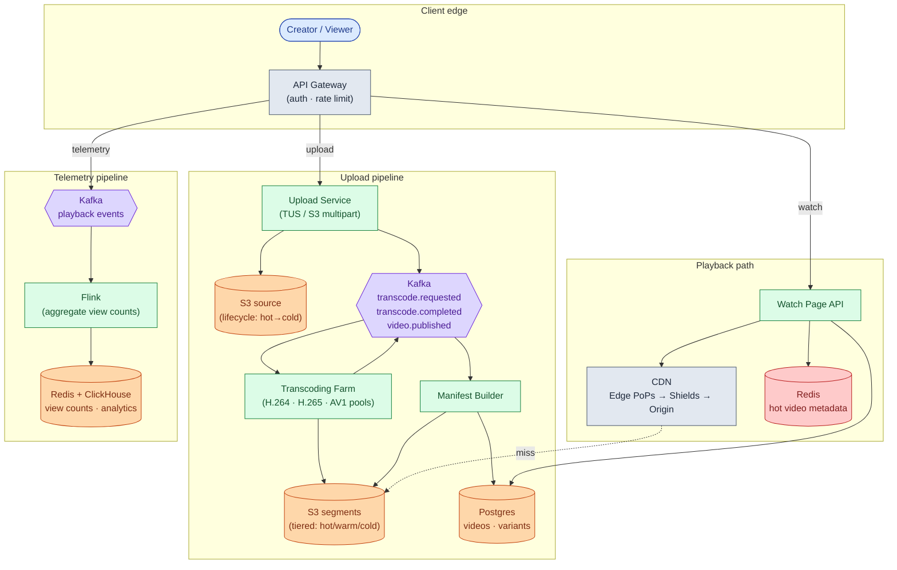

Each box in one line:

| Box | What it does |
|-----|--------------|
| **API Gateway** | Auth, rate limits, routes upload vs playback vs telemetry traffic |
| **Upload Service** | Accepts chunked uploads, issues TUS resumption tokens, triggers transcoding |
| **Kafka** | Durable queue between pipeline stages. Worker crashes do not lose jobs |
| **Transcoding Farm** | Pools of ffmpeg workers, one pool per codec. Autoscales on Kafka lag |
| **Manifest Builder** | Assembles master.m3u8 as quality variants complete |
| **Postgres** | Video catalog, per-variant job status |
| **Watch Page API** | Reads metadata, signs CDN URLs, returns JSON. The only code on the playback hot path |
| **CDN** | Three tiers: edge PoPs, regional shields, S3 origin. 95%+ cache hit rate target |
| **Redis** | Hot video metadata cache. Cuts Postgres reads by 100x for popular videos |
| **Flink + ClickHouse** | Stream-aggregate view counts and watch-time data for creator dashboards |

> **Take this with you.** Kafka is the backbone of the upload pipeline. If a transcoding worker dies at 3 a.m., the job is not lost. Kafka holds it until another worker picks it up.

---

## Step 7: One upload, all the way through

Alice records a 5 GB video of her cooking a meal. She presses Upload from her phone.

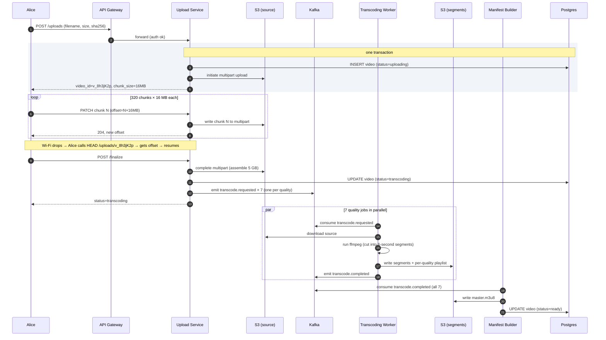

Three things worth pointing at:

1. The `INSERT video` and `initiate multipart` happen in the same transaction. If the server crashes mid-way, the video row and the S3 upload either both exist or neither does.
2. The `finalize` call is idempotent. If Alice retries because her connection dropped, the second call sees the multipart upload is already complete and skips ahead.
3. Workers produce segments at the same time cut points across all qualities. That alignment is what lets the player switch from 360p to 1080p mid-stream without a visual glitch.

---

## Step 8: How playback works

A viewer opens the watch page. Their player makes a sequence of small HTTP requests, each to the CDN.

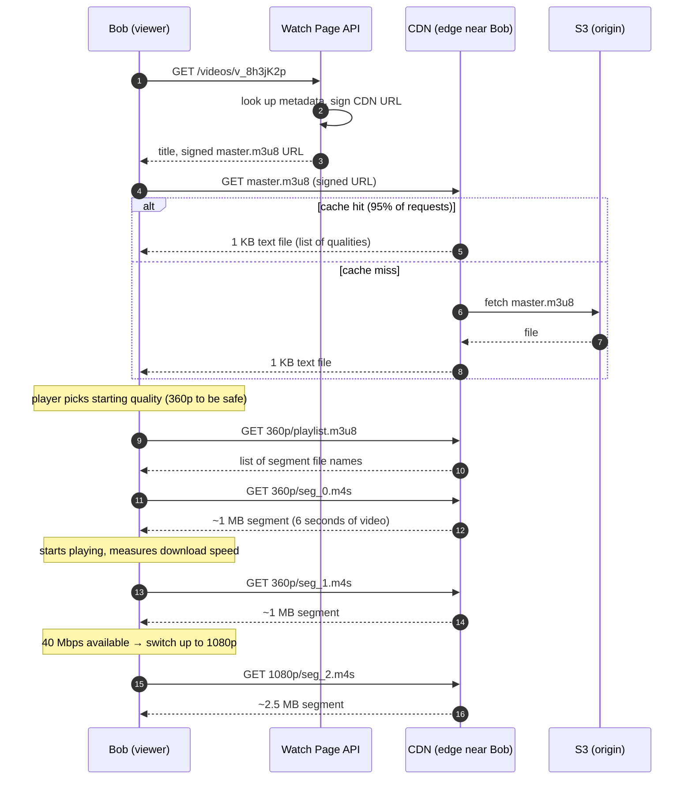

The player switches quality between segments, not mid-segment. This is called **ABR (adaptive bitrate streaming)**. Every quality uses the same segment start times (every 6 seconds), so switching from one quality to another is a clean cut.

The master playlist looks like this:

```
#EXTM3U
#EXT-X-STREAM-INF:BANDWIDTH=700000,RESOLUTION=640x360
360p/playlist.m3u8
#EXT-X-STREAM-INF:BANDWIDTH=2500000,RESOLUTION=1280x720
720p/playlist.m3u8
#EXT-X-STREAM-INF:BANDWIDTH=5000000,RESOLUTION=1920x1080
1080p/playlist.m3u8
```

The player reads this file and picks a starting quality based on the viewer's bandwidth. Then it keeps measuring and adjusts up or down as conditions change.

> **Take this with you.** The player never asks your servers for video bytes. It asks the CDN. Your Watch Page API only provides the signed URL and metadata. After that, your code is out of the loop.

---

## Step 9: Why the CDN is the whole story

250 Tbps egress. No single data center can send that. The CDN is not an optimization. It is the only reason the system works.

A CDN has three tiers. The viewer's request lands at the closest tier first. Each tier caches to protect the tier behind it.

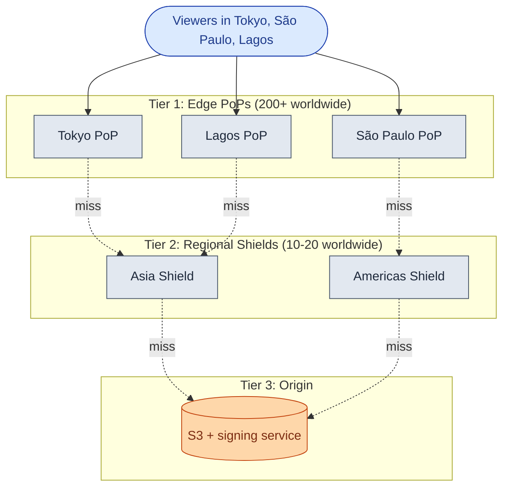

Why the regional shield matters: without it, 200 edge PoPs each missing the same segment all hit S3 directly. That is 200 S3 requests for one piece of content. The shield absorbs them. It fetches from S3 once and serves the other 199 edge PoPs from its cache.

With a 95% edge hit rate, only 5% of requests reach the shield. Only 20% of those reach S3. Your origin sees roughly 1% of total traffic. At 250 Tbps total, that means S3 sees about 2.5 Tbps. Without the CDN, S3 would see 250 Tbps and your cost would be 100x higher.

**Cache TTL choices:**

| Content | TTL | Reason |
|---------|-----|--------|
| Video segments (`seg_N.m4s`) | 7 days | Segments never change once written |
| Master playlist (`master.m3u8`) | 60 seconds | New qualities become available as transcoding completes |
| Thumbnails | 1 year | Immutable once created |
| Signed URLs | 4-8 hours | Expire before they can be shared for free |

> **Take this with you.** "Use a CDN" is not a design. The regional shield is the critical piece. Without it, S3 cannot absorb the request volume on cache misses.

---

## Step 10: Storage tiering

The system produces 70 PB of new data per year. Storage is the third-biggest cost, after CDN and compute. The key insight: most videos are never watched after the first week.

| Tier | What lives here | S3 class | Cost ($/GB/month) |
|------|-----------------|----------|-------------------|
| Hot | Segments watched in the last 7 days | S3 Standard | $0.023 |
| Warm | Segments watched in the last 90 days | S3 Infrequent Access | $0.0125 |
| Cold | Long-tail segments, source files after 30 days | S3 Glacier Instant | $0.004 |
| Archive | Source files with no view in a year | S3 Glacier Deep Archive | $0.00099 |

A daily tiering job reads `last_viewed_at` from the analytics database. It demotes variants with no recent views. It promotes them back when a cold video suddenly goes viral.

With tiering at roughly 5% hot / 15% warm / 80% cold, the blended cost drops from $0.023/GB to about $0.005/GB. That is a 4-5x reduction on the third-biggest line item.

Source files are kept forever. A new codec ships every few years (AV2 will follow AV1). You will need the original source to re-encode without losing quality.

---

## Follow-up questions

Try answering each in 2 or 3 sentences before opening the solution.

1. **Delete a viral video.** A creator deletes a video that has 100M views. It is cached in hundreds of edge PoPs around the world. How do you stop playback globally within 60 seconds?

2. **AV1 backfill.** You want to re-encode the top 10,000 videos in AV1 to reduce bandwidth costs. How do you pick which videos to prioritize, and how do you run the job without disrupting live uploads?

3. **Live streaming.** A creator wants to broadcast a concert to 5 million concurrent viewers with under 3 seconds of delay. What changes in the architecture? What stays the same?

4. **Thumbnails at scale.** Every video needs 1-3 main thumbnails and auto-generated frames for the seek bar. How do you generate, store, and serve them? (There are ~120 seek frames per 4-minute video.)

5. **Copyright takedown.** A valid takedown notice arrives. You must block playback globally within 5 minutes. You cannot delete the source file (it may be needed for legal review). How do you do it?

6. **Watch-time analytics.** A creator wants to see "60% of viewers dropped off at the 3:47 mark." Where does that data come from, and how do you compute it across billions of viewer sessions?

7. **DRM (Netflix mode).** The product switches to a subscription model. Every segment must be encrypted. Every device must get a decryption key before playback. What does the key flow look like?

8. **Multiple audio tracks.** A video has English, Spanish, and Hindi audio, plus 12 subtitle languages. How do these fit into an HLS master playlist? How does the player know which audio to download?

9. **Regional shield outage.** Your Asia regional shield goes down. What is the blast radius? What happens to the 200 edge PoPs behind it?

10. **Real-time view counts.** The recommendation team needs view counts with under 5 seconds of freshness for ranking signals. Your current Flink pipeline has 30 minutes of lag. What do you change?

---

## Related problems

- **[URL Shortener (001)](../001-url-shortener/question.md).** Introduces CDN caching, TTL trade-offs, and hot-key problems at a smaller scale.
- **[Notification System (010)](../010-notification-system/question.md).** The "your video is ready" and "new video from someone you follow" notifications run through it.
- **[News Feed (002)](../002-news-feed/question.md).** The watch page entry is one row in a feed. They share the metadata store and the follow graph.
- **[Distributed Cache (009)](../009-distributed-cache/question.md).** The manifest cache and hot-metadata cache use the same principles.


<div class="pr-solution-divider"></div>


## Solution: Design YouTube / Netflix (Video Streaming)

### The short version

Video streaming is two systems that share a database.

The **upload pipeline** is slow, batch, and compute-heavy. It takes a raw file, converts it to 7-9 quality variants, cuts each into 6-second segments, and writes a playlist. Done once per video.

The **playback path** is fast, read-heavy, and CDN-dominated. It delivers bytes to millions of people at the same time. The only code you own on the playback hot path is the Watch Page API, which signs a CDN URL and returns metadata. Every actual byte of video comes from the CDN.

They share two things: a metadata database (titles, owners, status) and object storage (the video files). Everything else is separate.

Three design choices dominate everything:

1. **Keep upload bytes off your servers.** TUS chunked uploads go directly to S3 multipart. 15 Gbps of ingest is S3's problem.
2. **Codec choice is the compute budget.** H.264 encodes fast. AV1 is 15-30x slower. Use AV1 only for the top 1% of videos by watch time.
3. **The CDN shield is not optional.** Edge PoP → regional shield → S3 origin. A 95% edge hit rate means S3 sees roughly 1% of all traffic. That is the only way the numbers work.

Numbers to know: 500 hours uploaded per minute, 125 million concurrent viewers at peak, 250 Tbps egress, 70 PB of new storage per year.

---

### 1. The two questions that matter most

**YouTube or Netflix?** The whole design forks here. YouTube is a long-tail UGC platform: billions of videos, 80% of them cold, aggressive tiering required. Netflix is a curated library: ~15,000 titles, nearly every video is hot, tiering matters less. The codec and cost story is completely different.

**Live or VOD?** Live needs real-time transcoding, RTMP/WebRTC ingest, and a LL-HLS or LL-DASH delivery stack that produces 1-2 second segments. VOD prepares files once. They share almost nothing operationally. Call your scope early.

Everything else (codec ladder, DRM, storage tiering, freshness of analytics) follows from those two answers.

---

### 2. The math, in plain numbers

| Number | Value | What it tells you |
|--------|-------|-------------------|
| Upload ingest | 5 Gbps sustained, 15 Gbps peak | Chunked upload to S3, not to your servers |
| New videos/day | ~450,000 (5/sec sustained) | Kafka queue depth for transcoding |
| Concurrent viewers | 42M average, 125M peak | CDN sizing |
| Peak egress | 250 Tbps | The reason a three-tier CDN exists |
| Source storage | 20 PB/year | Cheap if tiered; kept forever for re-encoding |
| Transcoded storage | 50 PB/year | About 2.5x the source |
| Transcoding compute | ~3,500 CPU cores steady (H.264 only) | Add several thousand more for AV1 |

Two costs dominate: CDN egress and transcoding compute. Storage is third. Everything else is rounding error.

---

### 3. The API

Two flows: upload (creator side) and playback (viewer side).

**Start an upload:**

```
POST /api/v1/uploads
Idempotency-Key: <uuid>

{
  "filename": "cooking-video.mp4",
  "size_bytes": 5368709120,
  "sha256": "abc123...",
  "title": "Spaghetti carbonara",
  "visibility": "public"
}
```

Response includes `video_id`, the upload endpoint URL, and `chunk_size` (16 MB).

**Send a chunk (TUS style):**

```
PATCH /u/<upload_id>
Upload-Offset: 33554432
Content-Length: 16777216
Content-Type: application/offset+octet-stream
<binary chunk>
```

Returns `204 No Content` with the new `Upload-Offset`. To resume after a drop, `HEAD /u/<upload_id>` returns the current offset.

**Finalize:**

```
POST /api/v1/uploads/<upload_id>/finalize
```

Returns `{ "video_id": "v_8h3jK2p", "status": "transcoding" }`.

**Get video info (creator polling or viewer loading the watch page):**

```
GET /api/v1/videos/v_8h3jK2p

{
  "status": "ready",
  "manifests": {
    "hls": "https://cdn.example.com/v_8h3jK2p/master.m3u8?sig=...",
    "dash": "https://cdn.example.com/v_8h3jK2p/manifest.mpd?sig=..."
  },
  "available_qualities": ["360p", "480p", "720p", "1080p"],
  "duration_seconds": 248
}
```

**Manifests and segments are served by the CDN, not by your API.** Your API produces the signed URL. The CDN serves every byte.

**Playback telemetry (batched, fire and forget):**

```
POST /api/v1/telemetry/playback
{
  "video_id": "v_8h3jK2p",
  "events": [
    { "ts": 1716364800000, "type": "start", "quality": "720p" },
    { "ts": 1716364812000, "type": "rebuffer", "duration_ms": 850 },
    { "ts": 1716365100000, "type": "complete", "watched_seconds": 300 }
  ]
}
```

Three choices worth defending:

- **Idempotency-Key on create.** A mobile client retries on timeout. Without the key, you get duplicate video rows and double-charged storage budgets.
- **Signed URLs on manifests.** Short-lived (4-8 hours). Stops third-party sites from embedding your video for free.
- **Telemetry is off the critical path.** Players batch events and POST every few seconds. A lost batch means approximate analytics, not a broken product.

---

### 4. The data model

Four tables. Postgres works fine until you reach billions of videos; then Cassandra with `video_id` as the partition key.

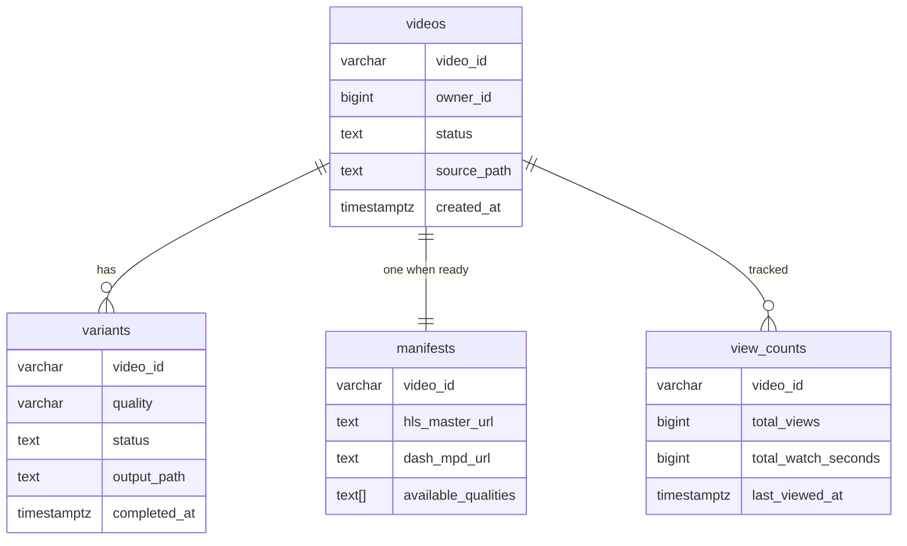

<details markdown="1">
<summary><b>Show: the full SQL</b></summary>

```sql
CREATE TABLE videos (
    video_id        VARCHAR(16) PRIMARY KEY,
    owner_id        BIGINT NOT NULL,
    title           VARCHAR(200),
    visibility      SMALLINT NOT NULL DEFAULT 1,  -- 1=public, 2=unlisted, 3=private
    status          TEXT NOT NULL DEFAULT 'uploading',
    source_path     TEXT,
    duration_ms     BIGINT,
    sha256          BYTEA,
    idempotency_key TEXT,
    created_at      TIMESTAMPTZ NOT NULL DEFAULT NOW(),
    published_at    TIMESTAMPTZ
);
CREATE INDEX idx_videos_owner ON videos (owner_id, created_at DESC);

CREATE TABLE variants (
    video_id        VARCHAR(16),
    quality         VARCHAR(20),     -- '360p_h264', '1080p_h265', '720p_av1'
    status          TEXT NOT NULL DEFAULT 'pending',
    bitrate_kbps    INT,
    codec           VARCHAR(16),
    segment_count   INT,
    output_prefix   TEXT,
    started_at      TIMESTAMPTZ,
    completed_at    TIMESTAMPTZ,
    PRIMARY KEY (video_id, quality)
);

CREATE TABLE manifests (
    video_id             VARCHAR(16) PRIMARY KEY,
    hls_master_url       TEXT,
    dash_mpd_url         TEXT,
    available_qualities  TEXT[],
    updated_at           TIMESTAMPTZ
);

CREATE TABLE view_counts (
    video_id             VARCHAR(16) PRIMARY KEY,
    total_views          BIGINT NOT NULL DEFAULT 0,
    total_watch_seconds  BIGINT NOT NULL DEFAULT 0,
    last_viewed_at       TIMESTAMPTZ,
    last_updated         TIMESTAMPTZ
);
```

</details>

Three choices worth defending:

**`variants` has one row per (video, quality).** Each transcoding job updates its own row independently as it completes. No compare-and-swap on a shared JSON blob, no lock contention between workers.

**`view_counts` is a separate table.** Updated by the analytics pipeline at its own cadence. The write path for views is separate from the write path for catalog edits. Mixing them would force every view event through the catalog's write path.

**`manifests` is separate from `videos`.** The Manifest Builder writes it when enough qualities complete. This lets you show a partial playlist (360p available, 1080p still encoding) without touching the main `videos` row.

Why Postgres first, Cassandra later: at startup, ACID transactions matter (update variant status and publish Kafka message in one go). At 10 billion videos, point lookups by `video_id` with no joins are all you need, which is exactly what Cassandra is designed for.

---

### 5. The transcoding pipeline

One source file spawns 7-9 jobs, one per (quality, codec) combination.

| Job | Codec | Resolution | Bitrate |
|-----|-------|------------|---------|
| 1 | H.264 | 426×240 | 400 kbps |
| 2 | H.264 | 640×360 | 700 kbps |
| 3 | H.264 | 854×480 | 1,200 kbps |
| 4 | H.264 | 1280×720 | 2,500 kbps |
| 5 | H.264 | 1920×1080 | 5,000 kbps |
| 6 | H.265 | 1280×720 | 1,500 kbps |
| 7 | H.265 | 1920×1080 | 3,000 kbps |
| 8 | AV1 (top 1% only) | 1280×720 | 1,000 kbps |
| 9 | AV1 (top 1% only) | 1920×1080 | 2,000 kbps |

<details markdown="1">
<summary><b>Show: one worker's loop</b></summary>

```python
while True:
    job = kafka.consume("transcode.requested", timeout=0.5)
    if job is None:
        continue

    db.update_variant(job.video_id, job.quality, status="encoding")
    source = s3.download(f"s3://video-source/{job.video_id}/source.mp4")

    run_ffmpeg(
        input=source,
        codec=job.codec,
        bitrate=job.bitrate,
        resolution=job.resolution,
        segment_duration=6,
        force_key_frames="expr:gte(t,n_forced*6)",   # align cuts across qualities
        output_format="m4s",
        output_prefix=f"s3://transcoded/{job.video_id}/{job.quality}/",
    )

    s3.upload(f"{job.output_prefix}/playlist.m3u8", build_variant_playlist(job))
    db.update_variant(job.video_id, job.quality, status="ready", segment_count=...)
    kafka.publish("transcode.completed", {"video_id": job.video_id, "quality": job.quality})
```

</details>

Four details that matter for production:

**Segment alignment across qualities.** Every quality cuts at exactly the same timestamps (0s, 6s, 12s, 18s ...). The player switches qualities between segments. If 360p cuts at different boundaries than 1080p, the switch causes a visual jump. Use `-force_key_frames` to enforce this.

**Idempotent output.** Re-running the same job overwrites the same S3 keys. This is intentional. Kafka may redeliver a message after a worker crash. Idempotent output makes at-least-once delivery safe.

**Janitor for stuck jobs.** A periodic scan finds `variants` rows with `status=encoding` older than 2x the expected job duration and republishes them to Kafka. Workers are stateless; restarting is always safe.

**Manifest assembly.** A separate Manifest Builder consumes `transcode.completed` events. When all required qualities are ready (or even after the first one, for progressive availability), it writes `master.m3u8` and updates `videos.status=ready`. The master playlist has a 60-second CDN TTL so viewers see new qualities quickly as they finish.

---

### 6. The engine: adaptive bitrate

The player, not the server, decides which quality to request next. This is ABR (adaptive bitrate streaming).

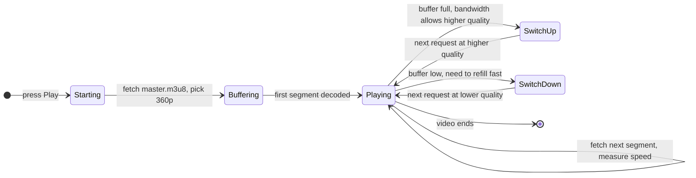

The player keeps about 30 seconds of video in its buffer. It measures bandwidth on each segment download. If a 1 MB segment downloads in 200 ms, that is 5 MB/s = 40 Mbps. Plenty for 1080p at 5 Mbps. If the buffer drops below 5 seconds, it drops to a lower quality to refill fast.

HLS and DASH are the two protocols. Both do the same thing with different file formats:

- **HLS** (Apple): `.m3u8` playlists, `.ts` or `.m4s` segments. Default on iOS and Safari.
- **DASH** (ISO standard): `.mpd` XML manifests, `.m4s` segments. Default on Android.

Modern platforms write segments in `.m4s` (the CMAF format) and produce both an HLS playlist and a DASH manifest pointing to the same byte files. One set of segment files, two manifests.

---

### 7. The full architecture

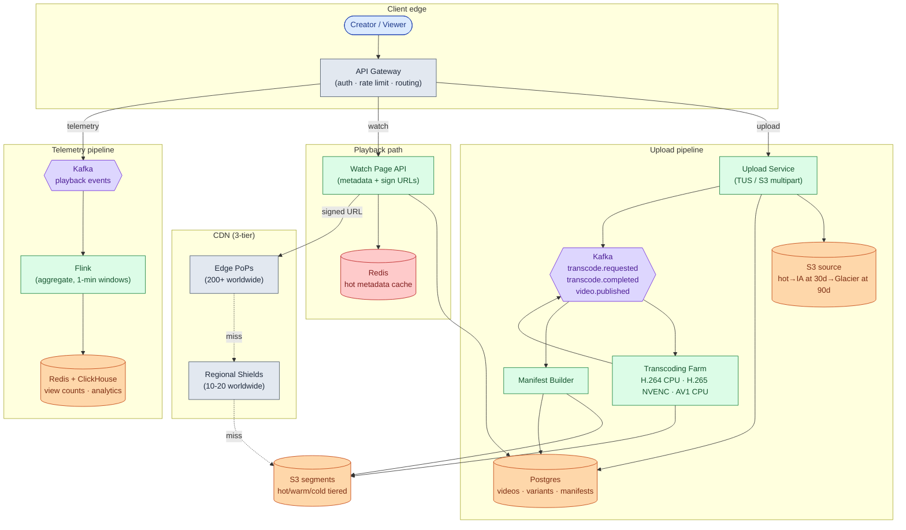

Five things worth noticing:

- The Watch Page API is the only piece of your code on the playback hot path. Target P99 latency: 50 ms.
- Kafka sits between every pipeline stage. A worker crash at 3 a.m. does not lose jobs.
- Transcoding workers are stateless. Restart any worker at any time; the job reruns from scratch (idempotent output makes this safe).
- Telemetry is fully async. If Flink has a lag spike, watch pages keep loading. View counts just update a bit late.
- Redis caches the most popular video metadata. For a video with 10M views/day, Postgres would get crushed without it.

---

### 8. A playback request, end to end

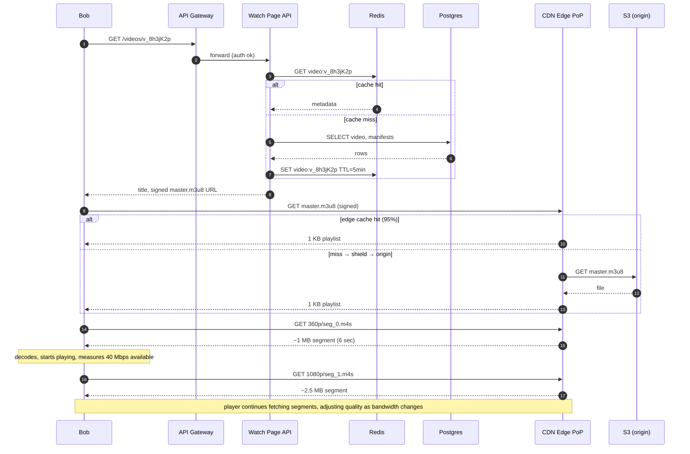

Latency budget for first frame:

| Step | Typical time | Notes |
|------|-------------|-------|
| API call (`GET /videos/<id>`) | 50 ms | Redis hit for popular videos |
| `GET master.m3u8` (CDN edge hit) | 50 ms | Edge PoP in the same city |
| `GET playlist.m3u8` (CDN edge hit) | 50 ms | Same |
| `GET seg_0.m4s` (CDN edge hit) | 200-500 ms | Depends on segment size and local bandwidth |
| First frame decode | 50 ms | |
| **Total** | **~400-700 ms** | Cache hits assumed |

A 2-second start-time SLO is achievable with cold-cache misses included.

---

### 9. The scaling journey: 10 users to 1 million

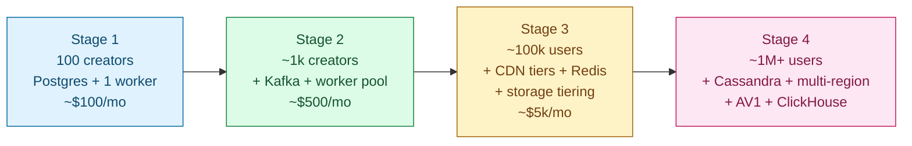

#### Stage 1: 100 creators

One Postgres, one transcoding worker, direct-to-S3 playback behind a basic CDN. Uploads are single-file HTTP posts. No queue. If the worker dies, you restart it and resubmit. ~$100/month.

Enough because you see maybe 50 uploads per day. Over-engineering at this stage wastes weeks.

#### Stage 2: ~1,000 creators

Something breaks: a popular creator uploads a 2 GB file, their Wi-Fi drops, they have to start over. Another problem: upload spikes during peak hours overwhelm the single worker.

Fix both at once: chunked resumable uploads (TUS or S3 multipart) and Kafka + a pool of workers. Workers autoscale on Kafka consumer lag. ~$500/month.

#### Stage 3: ~100,000 users

Several things break:

- Popular videos cause hundreds of requests per second to S3. S3 throttles you.
- Creators complain the watch page is slow.
- Storage costs are growing faster than revenue.

Fixes: three-tier CDN (edge + shield + origin), Redis for hot video metadata, storage tiering (S3 lifecycle rules move old segments to Glacier). Cost jumps to ~$5k/month but CDN and tiering save 5-10x more than they cost.

#### Stage 4: ~1M+ users

New problems:

- Postgres starts struggling at ~100M video rows.
- A single region means EU users have high latency.
- AV1 starts making economic sense for your most-watched 1%.

Migrate to Cassandra, sharded by `video_id`. Add a second region with cross-region S3 replication for the top 5% of hot content. Start the AV1 pipeline on a dedicated CPU pool. Add ClickHouse for creator analytics. The core pipeline shape has not changed since Stage 2; you are adding capacity and correctness around it.

---

### 10. The CDN in detail

| Tier | Location | Caches | TTL | Hit rate target |
|------|----------|--------|-----|-----------------|
| Edge PoPs | One per major city (200+ worldwide) | Hot segments and manifests for this city | 24h-7d for segments, 60s for master | 95%+ |
| Regional shields | One per cloud region (10-20 worldwide) | Everything any edge in this region fetched | 7 days | 80%+ on edge misses |
| Origin | S3 + signing service | Everything | Authoritative | N/A |

Why the shield changes the cost model: without it, 200 edges in a region missing the same segment each issue a separate S3 GET. That is 200 requests for one file. With the shield, the first miss does one S3 GET and serves the other 199 from its cache. S3 request volume scales with the number of distinct videos being watched, not the number of PoPs.

At 250 Tbps total egress with a 95% edge hit rate: S3 origin sees roughly 1% of total traffic. Without the CDN, S3 would need to serve all 250 Tbps. With it, S3 sees ~2.5 Tbps. The rest is served from cache. That is where the 100x cost reduction lives.

---

### 11. Storage tiering

From question.md Step 10, with cost math:

- 70 PB new per year. If all stored at S3 Standard: $0.023/GB × 70,000 TB × 12 months = ~$20M/year for one year of content. After 10 years: hundreds of millions.
- With tiering (5% hot / 15% warm / 80% cold): blended ~$0.005/GB. Same data costs ~$4M/year. About 5x cheaper.

The tiering job runs nightly, reads `last_viewed_at` from ClickHouse, emits S3 lifecycle transitions in bulk. Source files never get deleted; they move from Standard to Glacier after 30 days. When AV2 ships in 5 years, you pull sources out of Glacier and re-encode.

---

### 12. Reliability

**Worker crash mid-transcoding.** Kafka redelivers the message. The worker re-runs and overwrites the same S3 keys. Output is idempotent; no partially-written segments survive.

**Kafka broker loss.** Replication factor 3. Leader election handles a single broker failure. Producers with idempotency enabled prevent duplicates on retry.

**CDN PoP outage.** The CDN's own routing shifts traffic to neighboring PoPs. Latency rises for viewers in that city. Nothing else breaks.

**Regional shield outage.** Edge PoPs fall back to direct-to-S3. S3 request volume spikes 10-50x for cold-tail content. Edges serve cached segments via `stale-while-revalidate`; most viewers see no interruption. Long-tail videos may be unplayable until the shield recovers.

**S3 outage.** Switch signed URLs to point at a cross-region replica. Replication lag means videos uploaded in the last few minutes may 404. Accept this as a narrow window.

**Metadata DB partial failure.** At Cassandra scale, replication factor 3 per region survives node failures. A full-region failure means writes from that region stall; reads continue from other regions. At Postgres scale, a read replica handles the read side during primary recovery.

**Janitor for stuck jobs.** A periodic scan finds `variants` rows stuck in `encoding` longer than 2x the expected job duration and republishes them. Expected durations are estimated from the source file size and codec.

---

### 13. Observability

| Metric | Why it matters |
|--------|----------------|
| `upload.ingest_bytes_per_sec` | Spike means attack; drop means auth is broken |
| `upload.chunk_fail_rate` | High means upload service or S3 is degraded |
| `kafka.transcode.requested.lag` | Autoscaler input; high means farm is undersized |
| `transcoder.job_duration` by codec | Regression in ffmpeg or source quality |
| `transcoder.failure_rate` | Bad sources, OOMs, or codec bugs |
| `manifest.assembly_lag` | Time from last variant done to master published; slow hurts creators |
| `cdn.edge_hit_rate` per PoP | The headline cost driver. Below 90%, investigate. |
| `cdn.shield_hit_rate` | Below 70% means shield is undersized or TTLs are wrong |
| `cdn.s3_origin_request_rate` | Should be ~1% of total. Spike means edge+shield failed |
| `playback.first_frame_p99_ms` | The viewer SLO. Page at >3,000 ms for 5 minutes |
| `playback.rebuffer_ratio` | Rebuffer seconds / playback seconds. Target <0.5% |
| `playback.quality_distribution` | Viewers stuck on 240p = CDN issue or ABR bug |
| `view_counter.lag_seconds` | If a video goes viral and shows 0 views, this is broken |

Page on: `cdn.edge_hit_rate < 85%` for 10 min. `playback.first_frame_p99 > 3,000 ms` for 5 min. `transcoder.failure_rate > 5%`. `s3_origin_request_rate > 10x baseline`.

---

### 14. Follow-up answers

**1. Delete a viral video from every cache.**

Update `videos.status=blocked` in Postgres immediately. The Watch Page API now refuses to issue signed URLs. New viewers get "video unavailable." Issue a CDN cache purge by URL pattern (`/v_8h3jK2p/*`). Major CDNs (Cloudflare, Fastly, Akamai, CloudFront) propagate purges in 5-30 seconds globally. For the most urgent takedowns (CSAM, court order), revoke the signing key for that video. Signed URLs in-flight stop working. Viewers mid-playback drain their buffer, then see an error. The 60-second target is reachable.

**2. AV1 backfill for the top 10,000 videos.**

Sort videos by `total_watch_seconds` descending (more meaningful than view count alone). Take the top 10K. Estimate savings per video: `(h264_bitrate - av1_bitrate) × monthly_watch_seconds`. Filter to videos where bandwidth savings exceed 10x the one-time encoding cost. Average video is 10 minutes. AV1 at 0.5x real-time = 20 minutes of compute per video. 10K videos × 20 min / 1,000 cores in parallel ≈ 3 hours wall-clock. Publish 10K `transcode.requested` messages with `priority=backfill` (lower priority than live uploads). Manifest Builder adds the AV1 variant to the existing master playlist when done. Players that support AV1 pick it automatically; older players stick with H.264.

**3. Live streaming.**

Live and VOD share almost no infrastructure. Ingest changes from HTTP upload to RTMP or WebRTC pushed to a regional ingest server. Transcoding becomes real-time: each incoming GOP is encoded on the fly into the quality ladder, not post-hoc on a source file. The segment protocol changes to LL-HLS or LL-DASH with 1-2 second segments and HTTP chunked transfer, so the player can start downloading a segment while it is still being produced. CDN TTLs on live segments are seconds, not days. For 5 million concurrent viewers, LL-HLS at 3-5 seconds glass-to-glass is the practical answer. Sub-second latency via WebRTC does not scale beyond a few thousand concurrent viewers without a complex mesh.

When the stream ends, the live segments become the VOD asset with no re-transcoding needed.

**4. Thumbnails at scale.**

During transcoding, a second ffmpeg pass extracts frames: one at 10%, 50%, and 90% of duration for main thumbnails, and one every 2 seconds for the seek bar. A 4-minute video produces about 120 seek frames × 30 KB = 3.6 MB. At 450,000 videos/day, that is roughly 1.6 TB/day of thumbnail data. Pack seek frames into a sprite sheet (one image, CSS coordinates in a JSON descriptor). One CDN request instead of 120. Store in S3 alongside segments. Long TTL (1 year). Serve through the same CDN. Custom thumbnails uploaded by creators go through the Upload Service as a small file (no chunking needed) and overwrite the auto-generated main thumbnail.

**5. Copyright takedown.**

Trust-and-safety calls `POST /admin/videos/<id>/block`. This updates `videos.status=blocked`, revokes the signing key for that `video_id`, and triggers a CDN purge for `/v_<id>/*`. Do not delete the S3 objects. Move them to a restricted S3 bucket with a separate IAM policy that only the legal team and a logged-access process can read. Every block is an immutable audit record: who blocked, when, which notice, expected review date. If the takedown is withdrawn, restore the signing key and move files back. The 5-minute target is reachable with CDN purge propagation plus signing-key revocation.

**6. Watch-time analytics.**

Players emit heartbeats every few seconds with `(video_id, session_id, position_seconds)`. Flink aggregates: for each video and each 10-second position bucket, count distinct sessions that reached it. The result is a retention curve: at position 0:00, 100% of sessions; at 3:47, maybe 60%; at the end, maybe 30%. Store in ClickHouse, partitioned by `video_id`, bucketed by position. Query latency is in the hundreds of milliseconds even on large data. Creators see the curve in their Studio. Updating nightly is fine; real-time would not change creator decisions.

**7. DRM (Netflix mode).**

Every transcoded segment is encrypted with AES-128 in CTR mode using a per-content encryption key (CEK). The manifest references a license server URL. At playback start: (1) player fetches the manifest, (2) player requests a license, (3) license server verifies the user is subscribed and geo-allowed, then returns the CEK wrapped for this device, valid for this session with a TTL, (4) player decrypts segments on the fly. Add to the architecture: a License Server (stateless API), a Key Management Service (stores CEKs indexed by `video_id`), and integration with Widevine (Android/Chrome), FairPlay (Apple), and PlayReady (Windows). Per-session license issuance adds 50-200 ms to start time. Manifests can be cached. Licenses cannot.

**8. Multiple audio tracks and subtitles.**

HLS master playlists have `#EXT-X-MEDIA` entries for each audio and subtitle track. Audio is transcoded as separate variant streams (one per language). Subtitles are WebVTT files served as their own playlists. The player downloads video + one audio track at a time. Mixing at encode time is not needed: 7 video variants × 3 audio = 10 total files, not 21. Subtitles are tiny and all 12 can be listed in the manifest without significant overhead.

**9. Regional shield outage.**

Every edge PoP behind the downed shield now falls back to S3 for cache misses. S3 request volume spikes 10-50x. Edges have `stale-while-revalidate` set: they serve cached segments to in-progress viewers while attempting a background refresh. Most viewers see no interruption. Long-tail videos (not yet cached at the edge) may be unplayable until the shield recovers. Pre-provision higher S3 request rate limits when you deploy a shield so the spike does not exhaust your S3 concurrency quota.

**10. Real-time view counts for ranking.**

The current pipeline (player → Kafka → Flink 1-minute windows → ClickHouse) has ~5-30 minutes of lag. For 5-second freshness, add a parallel high-frequency aggregator: the same Flink job with 5-second windows writing to Redis with `INCR views:<video_id>`. The dedup is best-effort (not exactly-once across Kafka rebalances). For a ranking signal, approximate is fine. The watch page reads from the slower exactly-once pipeline for displayed view counts; the recommendation team reads from the fast approximate store. Two pipelines, two guarantees.

---

### 15. Trade-offs worth saying out loud

**Build vs buy the CDN.** At Google's scale, they built their own global edge network (Google Edge Network). Below about 10 Tbps sustained egress, buying Cloudflare or Fastly is cheaper because you avoid PoP capex and operations. Above that, owning the CDN starts to make sense. A strong candidate names the break-even, not just "buy" or "build."

**Codec choice is a budget decision, not a technical one.**

- H.264: encodes fast, decodes everywhere, file size baseline. Always ship.
- H.265: 30% smaller files, 3x slower to encode, patent licensing fees are real, decoder support is near-universal. Worth the tradeoff for most platforms above early stage.
- AV1: 30% smaller than H.265, royalty-free, 15-30x slower to encode. Use only for the top 1-5% of videos by watch time where bandwidth savings recoup the encode cost in days.

**Storage tiering tuning.** Demoting a video that gets re-promoted 30% of the time within 30 days means you demoted too early. Tune the threshold per content category: news videos age quickly (aggressive demote), cooking tutorials less so. Measure demote-then-repromote rates and adjust.

**Single manifest vs progressive manifest.** The Manifest Builder can publish a partial master after the first quality completes (360p only), then rewrite as 720p and 1080p finish. This cuts the time from "upload finished" to "watchable" from 20 minutes to 5 minutes. The cost is that master.m3u8 needs a short CDN TTL (60 seconds) during transcoding, which means more origin requests for that video's first hour. Worth it for creator experience.

**What you would revisit at 10x scale.** Custom hardware encoding ASICs (similar to Google Argos). Per-shot encoding: analyze each scene and encode at the optimal bitrate for its complexity, not a fixed ladder. Saves 20%+ bandwidth. Netflix does this. Move manifest building to CDN-edge computation, generating manifests per viewer device in real time rather than pre-building static files.

---

### 16. Common mistakes

Most weak answers fall into one of these:

**Designing upload and playback as one system.** They are two separate systems sharing a database. A single diagram for both gets confusing in ten minutes. Separate them from the first sentence.

**Skipping CDN tiers.** "Use a CDN" is not a design. The regional shield is the critical piece. Without it, S3 cannot absorb the request volume when edge caches miss. Mention all three tiers.

**No segment alignment.** Players switch qualities between segments. If 360p and 1080p cut at different timestamps, the switch glitches visually. Most candidates skip this. Interviewers at media companies always ask.

**Hand-waving the transcoding compute.** "We'll have transcoders" is not enough. Mention separate node pools per codec, autoscaling on Kafka lag, idempotent output, and the AV1 cost story.

**Forgetting resumable upload.** A 5 GB single PUT fails on a phone. Chunked resumable upload is required for any platform that takes uploads over 100 MB.

**No view-count pipeline.** 125 million concurrent viewers each generating a view event. You cannot UPDATE a DB row per view. Kafka + Flink with windowed aggregation is the standard answer.

**Ignoring storage tiering.** 70 PB/year at S3 Standard prices is financially unsustainable. The 4-5x cost reduction from tiering is material.

**Treating live as a minor variation on VOD.** Live needs real-time transcoding, RTMP/WebRTC ingest, LL-HLS delivery, and a 3-5 second latency budget. It is a different system. Acknowledge it and scope it separately.

**Overengineering thumbnails.** They are small files behind a CDN. A sprite sheet handles the seek bar. Do not spend five minutes here when the interviewer wants to hear about CDN tiering or transcoding.

**Missing DRM when the question is Netflix.** Even if not asked, one sentence naming the license server and per-device key flow shows you know the difference between YouTube and Netflix architectures.

