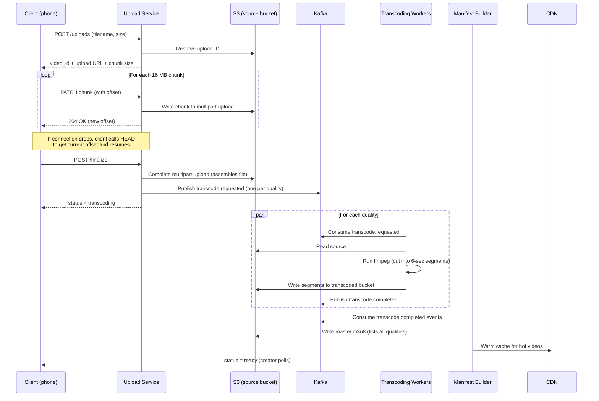
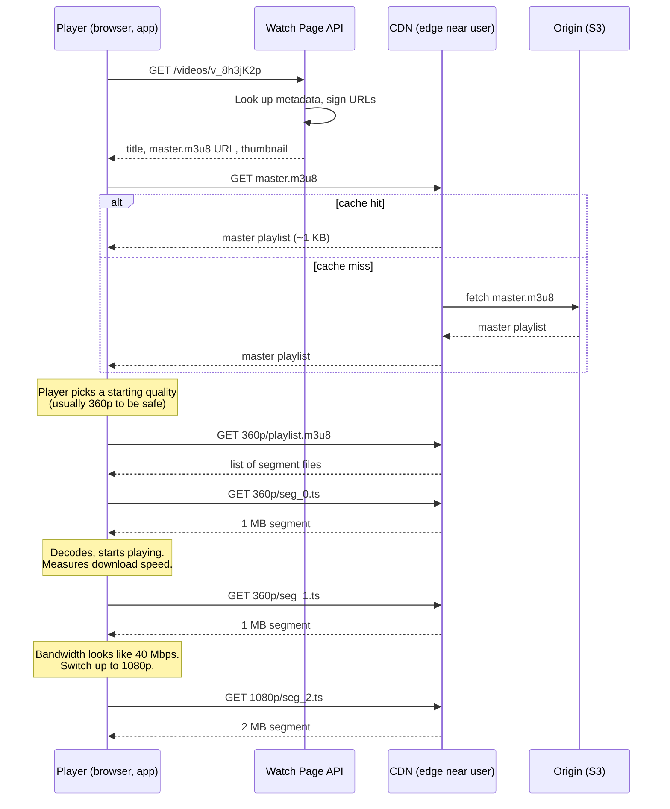
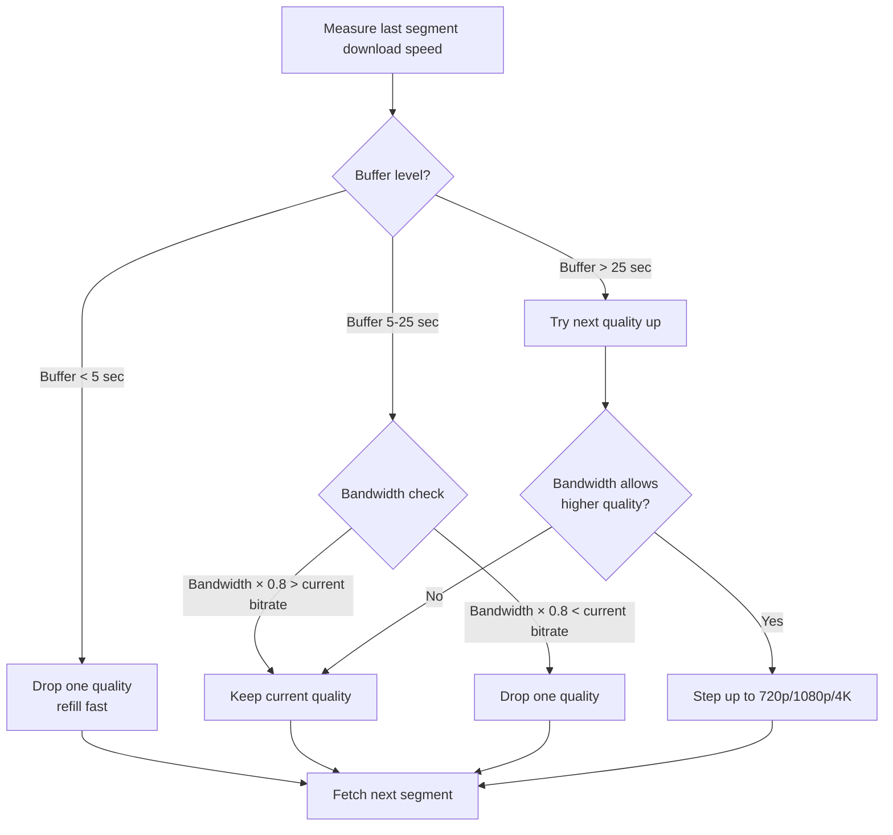


## The scene

You sit down for the interview. The interviewer says:

> *"Design YouTube. Or Netflix, pick one. I want to see how a video gets from a phone to a screen on the other side of the world."*

It sounds like one problem. It is really two problems sharing a database.

**Problem one: upload and prepare a video.** Someone records a video. We take their file, convert it into many sizes, and store it. This part is slow. It runs in the background. We do it once per video.

**Problem two: play a video.** Millions of people press play. We send them video bytes fast, in the right size for their internet speed. This part has to be quick. We do it billions of times per day.

These two halves share almost nothing. They use the same database for video info, and the same storage bucket for files. That is it. If you try to design both at the same time with one big diagram, you will get lost in ten minutes.

We will walk through this step by step. We will start small and add pieces as needed.

---

## Step 1: Ask the right questions

Before drawing anything, sit for five minutes. Write down questions you would ask the interviewer.

A good answer here is not "20 questions about edge cases." It is a small set of questions where the answer changes the whole design.

<details markdown="1">
<summary><b>Show: 8 questions that matter</b></summary>

1. **YouTube or Netflix?** They look the same but they are not. YouTube takes uploads from anyone (any quality, any format, billions of videos most people never watch). Netflix has a small library where every video is popular. Storage choices and the pipeline both change. For this design, assume YouTube-style.

2. **Live or recorded?** Live streaming (a concert happening right now) needs sub-3-second delay between camera and screen. Recorded videos (VOD = video on demand) get prepared once and served forever. They share almost no infrastructure. Scope to VOD. Mention live as an extension.

3. **Global or one country?** Global means we need servers in many places. The bill for sending bytes around the world is the biggest cost in the whole system.

4. **How many video qualities?** The standard set: 240p, 360p, 480p, 720p, 1080p, 1440p, 4K. More qualities means more files to make. Adding the AV1 codec (newer, smaller files but slow to make) can multiply our compute bill by 5x.

5. **How big can uploads be?** YouTube allows 12-hour videos up to 256 GB. A file that big cannot be uploaded in one go. If the wifi drops once, the whole upload restarts. We need resumable uploads.

6. **DRM (digital rights management) and paid content?** YouTube is free with ads. Netflix needs DRM, which means encrypted videos and a license server. Different system.

7. **Is search and recommendations in scope?** Huge separate systems. Right answer: "out of scope, but I will show where they plug in."

8. **Analytics speed?** View counts can be a few minutes late (YouTube famously delays them). Creator dashboards can update once a day. Each freshness target costs different money.

If you only asked "how many users," you missed the biggest questions. Question 2 (live or VOD) and question 4 (which codecs) each move the compute bill by 10x.

</details>

---

## Step 2: How big is this thing?

Same problem, real numbers. Do the math before you draw boxes.

Assume:

- **500 hours** of video uploaded per minute
- **1 billion hours** watched per day
- Average view: **10 minutes**
- Average upload: **4 minutes**
- Bitrate ladder (the standard set of qualities and their data rates):
  - 240p = 400 kbps (kilobits per second)
  - 360p = 700 kbps
  - 480p = 1.2 Mbps (megabits per second)
  - 720p = 2.5 Mbps
  - 1080p = 5 Mbps
  - 1440p = 9 Mbps
  - 4K = 20 Mbps
- Codecs (the rules for compressing video): H.264 always, H.265 for 720p and above, AV1 for the top 1% most-watched
- Source files kept forever (in case we need to re-encode in a new codec later)
- Target start time: under 2 seconds before video plays

Try to compute these on paper first:

1. Upload bandwidth (bytes per second arriving from creators)
2. New videos per day
3. Viewers watching at the same time
4. Egress (bytes per second going out to viewers) at peak
5. Storage growth per year

<details markdown="1">
<summary><b>Show: the math</b></summary>

**Upload bandwidth.** 500 hours per minute = 500 × 60 = 30,000 seconds of video per minute = **500 seconds of video per second**. At an average 10 Mbps (a typical phone upload), that is 500 × 10 = **5 Gbps sustained**, **15 Gbps at peak**.

> Why "seconds of video per second"? If 500 seconds of new footage arrives every second, our system is taking in video faster than time itself. That sounds wrong but it is just many people uploading at once.

**Videos per day.** 500 hours × 60 min × 24 hours / 4-minute average length = **about 450,000 new videos per day**. About 5 new videos every second. At peak: 15 per second.

**Concurrent viewers.** 1 billion hours per day × 3600 seconds / 86400 seconds in a day = **42 million viewer-seconds per second**. That means 42 million people watching at the same moment on average. At peak (Friday night, big sports event): about **125 million at once**.

**Egress at peak.** 125 million viewers × 2 Mbps average (most people watch at 480p or 720p on mobile) = **250 Tbps (terabits per second) peak**.

> Why this is the whole story. 250 Tbps is the dominant number in the design. No single server can send that. No single data center can send that. This is why we need a CDN (content delivery network, a set of servers placed close to users that cache content). The CDN serves 95% of bytes from close-by caches. Our origin only sees the 5% that misses.

**Storage per year.** 500 seconds of input per second × 86,400 seconds per day × 365 days × (10 Mbps / 8 bits per byte) = **about 20 PB (petabytes) per year just for source files**. Plus the converted versions (more on these later), the system grows by **about 70 PB per year**. And it never stops growing.

**The takeaway.** Three numbers dominate the whole design:

| Number | Size | Where it lives |
|--------|------|----------------|
| Egress | 250 Tbps peak | CDN |
| Transcoding compute | thousands of CPU cores | A worker farm |
| Storage | 70 PB per year, forever | Tiered S3 |

Everything we design exists to make one of these three numbers smaller.

</details>

---

## Step 3: How does an upload work?

A creator on their phone records a 5 GB video. They press upload. What happens next?

Take ten minutes to think. Consider:
- What if their wifi drops at 90%?
- Where does the file land first?
- Who decides when to start converting?
- How does the creator know "uploaded" vs "ready to watch"?

<details markdown="1">
<summary><b>Show: the upload pipeline</b></summary>

The upload pipeline has six stages. Each must be restartable on its own. A failure at stage 5 should not redo stages 1 through 4.

**The flow:**



**What each stage does:**

1. **Start.** Client calls `POST /uploads` with filename and total size. Server returns an upload ID and a chunk size (usually 16 MB). Server writes a row in the database with `status = uploading`.

2. **Send chunks.** Client cuts the file into 16 MB pieces. For a 5 GB video that is about 320 chunks. Each chunk is sent as `PATCH /uploads/<id>` with a header telling the server which byte range this is. The server writes it to S3 as part of a multipart upload.

    This uses the **TUS protocol** (or S3 multipart, similar idea). TUS = a standard for resumable uploads on top of HTTP. The key point: each chunk has an offset. If chunk 47 fails, the client retries chunk 47 only.

    > Why chunks instead of one big upload? A single 5 GB PUT cannot resume. If the wifi drops at 4.9 GB, you start over. With chunks, only the failing chunk retries. If the connection drops for ten minutes, the client asks the server "where am I?" using `HEAD /uploads/<id>`, gets back the current offset, and continues from there.

3. **Finalize.** When all chunks are in, client calls `POST /uploads/<id>/finalize`. Server tells S3 to glue the chunks into one file. Server checks the sha256 hash if the client sent one. Status changes to `transcoding`.

4. **Queue conversion jobs.** Server publishes messages to Kafka (a durable message queue). One message per quality level: "convert v_123 to 240p", "convert v_123 to 360p", and so on. About 7-9 messages per video.

5. **Workers convert.** A pool of transcoding workers (running ffmpeg) read jobs from Kafka. For each job, a worker:
    - Downloads the source from S3.
    - Runs ffmpeg with the right codec and bitrate.
    - Cuts the output into 6-second segments (small files like `seg_42.ts`).
    - Uploads the segments back to S3 in a per-video folder.
    - Writes a per-quality playlist (`playlist.m3u8`) that lists all the segment files.
    - Publishes `transcode.completed`.

6. **Build the master manifest.** A separate service watches for `transcode.completed` events. When all qualities are done (or even after the first one if we want fast availability), it writes a `master.m3u8` file. This is a small text file listing all the qualities. Status changes to `ready`. The creator can now publish the video.

> Why 6-second segments? If your network drops mid-video, only the next 6 seconds need to re-buffer, not the whole movie. The player can also switch to a lower quality between segments (without restarting the video) if your wifi gets weaker.

</details>

---

## Step 4: Draw the upload architecture

You know the upload flow. Now draw the boxes. Six pieces are missing. Think about: what catches the chunks, where source files land, what queues the work, what does the converting, what builds the playlist, and where video info lives.

```
            Creator (phone, browser)
                    |
                    | upload chunks
                    v
            +-----------------+
            |   [ ? A ]       |  catches chunks, validates, writes to source
            +--------+--------+
                     |
                     v
            +-----------------+
            |   [ ? B ]       |  source files
            +--------+--------+
                     |
                     | enqueue convert jobs
                     v
            +-----------------+
            |   [ ? C ]       |  message queue
            +--------+--------+
                     |
                     v
            +-----------------+
            |   [ ? D ]       |  convert workers (CPU + GPU)
            +--------+--------+
                     |
                     | write segments
                     v
            +-----------------+
            |  S3 transcoded  |  240p, 360p, 480p ... segments
            +--------+--------+
                     |
                     v
            +-----------------+
            |   [ ? E ]       |  builds master.m3u8 when ready
            +--------+--------+
                     |
                     v
            +-----------------+
            |   [ ? F ]       |  video catalog (title, status, owner)
            +-----------------+
```

<details markdown="1">
<summary><b>Show: the full upload architecture</b></summary>

```
            Creator (phone, browser)
                    |
                    | TUS or S3 multipart (chunked, resumable)
                    v
            +-------------------+
            | Upload Gateway    |  Stateless API. Auth, quota check,
            | (API pods)        |  sha256 verify, chunk routing.
            +---------+---------+
                      |
                      v
            +-------------------+
            | s3://video-source |  Source bucket. Lifecycle policy
            | (S3 Standard)     |  moves old files to cold storage.
            +---------+---------+
                      |
                      | on finalize -> Kafka
                      v
            +-------------------+
            | Kafka             |  Topics: transcode.requested,
            | (message queue)   |  transcode.completed,
            |                   |  video.published.
            +---------+---------+
                      |
                      v
            +-------------------+
            | Transcoding Farm  |  Kubernetes pool.
            | (ffmpeg workers)  |  CPU nodes for H.264 / H.265,
            |                   |  CPU nodes for AV1 (slow but worth
            |                   |  it for popular videos).
            +---------+---------+
                      |
                      v
            +-------------------+
            | s3://transcoded   |  Per-video folder of segments.
            +---------+---------+  Hot videos copied to many regions.
                      |
                      v
            +-------------------+
            | Manifest Builder  |  Reads transcode.completed events.
            | (stateless svc)   |  Writes master.m3u8 / manifest.mpd.
            +---------+---------+
                      |
                      v
            +-------------------+
            | Metadata DB       |  Cassandra. videos table:
            | (videos, variants)|  video_id PK; title, status, owner,
            |                   |  ready_qualities, created_at.
            +-------------------+
```

**What each piece does, in one line:**

- **Upload Gateway.** A stateless web service. Catches the chunks, checks the user is logged in, checks they have not exceeded their upload quota.
- **Source bucket.** Cheap, durable object storage. Sources move to colder (cheaper) storage after 30 days.
- **Kafka topic.** A durable queue. If the worker farm is busy, jobs wait their turn. If a worker crashes, the job becomes available to another worker.
- **Transcoding workers.** Pods running ffmpeg. One worker handles one (video, quality) job at a time. Idempotent: re-running a job overwrites the same output files.
- **Transcoded bucket.** Holds all the small segment files. The whole playback path reads from here (through the CDN).
- **Manifest Builder.** Stateless service. Listens for "this quality is done" events. When enough qualities are done, writes the master playlist that the player will read.
- **Metadata DB.** The catalog. One row per video. Cassandra is the right pick because reads are by `video_id` only (no complex joins).

</details>

---

## Step 5: How does playback work?

A viewer presses play. The player makes a series of HTTP requests. Think about: what does it ask for first? In what order? How does the player decide what quality to send?

Take ten minutes, then check.

<details markdown="1">
<summary><b>Show: the playback flow</b></summary>

The playback sequence:



**Step by step:**

1. **Watch page loads.** Browser calls `GET /videos/v_8h3jK2p`. Server returns title, thumbnail, and the URL of the master playlist. The master URL is signed (has a token that expires in 4 hours) so it cannot be embedded for free elsewhere.

2. **Player fetches the master playlist.** A tiny text file (~1 KB) like this:

    ```
    #EXTM3U
    #EXT-X-STREAM-INF:BANDWIDTH=400000,RESOLUTION=426x240
    240p/playlist.m3u8
    #EXT-X-STREAM-INF:BANDWIDTH=700000,RESOLUTION=640x360
    360p/playlist.m3u8
    #EXT-X-STREAM-INF:BANDWIDTH=2500000,RESOLUTION=1280x720
    720p/playlist.m3u8
    #EXT-X-STREAM-INF:BANDWIDTH=5000000,RESOLUTION=1920x1080
    1080p/playlist.m3u8
    ```

    Each line says: "this quality needs this much bandwidth." The player picks one.

3. **Player picks a starting quality.** Usually starts at 360p or 480p. Not at 1080p, because we do not yet know how fast the network is.

4. **Player fetches the variant playlist.** Returns a list of segment files:

    ```
    #EXTM3U
    #EXT-X-TARGETDURATION:6
    #EXTINF:6.0,
    segment_0.ts
    #EXTINF:6.0,
    segment_1.ts
    ...
    ```

    Each segment is 6 seconds of video.

5. **Player fetches segments and plays.** It downloads segment 0, starts decoding, starts playing. While segment 0 plays, it fetches segment 1. Then segment 2. The buffer (the amount of video ready to play next) fills up to about 30 seconds ahead.

6. **Player measures bandwidth.** If a 1 MB segment downloads in 200 ms, that is 5 MB/s = 40 Mbps. So we have plenty of room for 1080p (5 Mbps).

7. **Player switches qualities between segments.** Next request goes to `1080p/seg_3.ts` instead of `360p/seg_3.ts`. The viewer sees the picture get sharper.

**This is called ABR (adaptive bitrate).** The player adapts the bitrate to your current network.



> Why does every quality need the same segment boundaries? Because the player switches between segments. If 360p cuts at 6.0s, 12.0s, 18.0s, then 1080p must also cut at 6.0s, 12.0s, 18.0s. Otherwise switching mid-stream causes a visible glitch.

**HLS vs DASH.** Both do the same thing two ways:

- **HLS** (HTTP Live Streaming, Apple's standard). Manifests are `.m3u8` text files. Segments are `.ts` or `.m4s` files. Default on iOS and Safari.
- **DASH** (Dynamic Adaptive Streaming over HTTP, an ISO standard). Manifests are `.mpd` XML files. Segments are `.m4s`. Default on Android.

Modern systems write segments once in `.m4s` (the **CMAF** format, Common Media Application Format) and produce both an HLS playlist and a DASH manifest pointing to the same byte files. Best of both.

</details>

---

## Step 6: Why the CDN is the whole story

We computed 250 Tbps egress at peak. No single server can send that. We need to spread the load across hundreds of servers placed close to viewers around the world. That is what a CDN does.

A CDN has three tiers (layers). The viewer hits the closest tier first. If that tier does not have the file, it asks the next tier up.

<details markdown="1">
<summary><b>Show: the three-tier CDN</b></summary>

```
                  +-------------------------------+
                  |  Viewers (all around globe)   |
                  +---+---------+--------+--------+
                      |         |        |
            Tokyo     |    NYC  |    Sao Paulo
                      v         v        v
                  +-------+ +-------+ +-------+
                  | Edge  | | Edge  | | Edge  |     Tier 1: Edge PoPs
                  | PoP   | | PoP   | | PoP   |     200+ worldwide
                  | Tokyo | | NYC   | | SP    |     Cache: 95% hit
                  +---+---+ +---+---+ +---+---+     TTL: 7 days
                      |         |         |          Latency: <50ms
                      |         |         |
                      v         v         v
                  +---------+         +---------+
                  | Shield  |         | Shield  |    Tier 2: Regional
                  | (Asia)  |         | (US-E)  |    shields, 10-20
                  +----+----+         +----+----+    Cache: 80% hit on miss
                       |                   |        TTL: 7 days
                       |                   |        Latency: <100ms
                       +---------+---------+
                                 |
                                 v
                          +-------------+
                          |   Origin    |             Tier 3: Origin
                          |   (S3 +     |             1 per region
                          |   signer)   |             Authoritative
                          +-------------+             Latency: ~30ms
```

**How it works:**

- **Edge PoP.** A PoP is a "point of presence." A small data center in a city. There are 200+ around the world. Holds the most popular content. When you press play in Tokyo, your request lands at the Tokyo PoP. 95% of requests get served right here.

- **Regional shield.** One per cloud region (about 10-20 worldwide). When the Tokyo edge does not have the file, it asks the Asia shield. The shield holds everything any Asia edge ever fetched. Without this shield, 200 edges would all hit S3 directly for the same missing file. With the shield, the shield does one S3 fetch and serves the other 199.

- **Origin.** S3 plus a small URL-signing service. The source of truth. Holds every segment of every video ever uploaded.

> Why this matters. CDN egress costs $0.005 to $0.02 per GB depending on volume. At 600 PB per day (250 Tbps), that is $3M to $12M per day if we paid for every byte. With 95% edge hit rate, only 5% of bytes touch the shield. Only 20% of that touches S3. So S3 sees about 1% of total = ~6 PB per day. The cache hit rate is the most important number in the whole bill.

**Tuning:**

- **Segment TTL: 7 days.** Segments never change once written. Long TTL is safe.
- **Master playlist TTL: 60 seconds.** Master playlists do change (when a new quality finishes encoding). Short TTL so viewers see new qualities quickly.
- **Purge on takedown.** All major CDNs (Cloudflare, Fastly, Akamai, CloudFront) can purge by pattern (`/v_123/*`) in seconds.

</details>

---

## Step 7: Storage tiering

We grow by 70 PB per year. Some videos get a billion views (Gangnam Style). Most get fewer than 100 views ever. Storing them all the same way is wasteful.

Think about: which videos belong on fast (expensive) storage? Which can sit on slow (cheap) storage? Where do source files go?

<details markdown="1">
<summary><b>Show: the storage tiers</b></summary>

Each video has two storage components: the **source** (the original upload) and the **transcoded variants** (what viewers watch). Each one moves between tiers independently based on age and views.

| Tier | What lives here | Storage type | Cost ($/GB/month) | Retrieval |
|------|-----------------|--------------|-------------------|-----------|
| CDN edge | Segments getting views right now | SSD/RAM at PoPs | (cache, not paid storage) | <50 ms |
| Shield | Warm segments per region | Regional SSD | $0.10 | <100 ms |
| Hot | Variants of popular videos | S3 Standard | $0.023 | ~30 ms |
| Warm | Variants of less popular videos | S3 Infrequent Access | $0.0125 | ~30 ms + per-GB fee |
| Cold | Source files after 30 days, variants of dead videos | S3 Glacier Instant | $0.004 | seconds |
| Archive | Sources of videos with no views in a year | S3 Glacier Deep Archive | $0.00099 | 12 hours |

**How content moves:**

- **New upload.** Source goes to hot. Variants go to hot. CDN warms up naturally as viewers watch.
- **Daily tiering job.** Reads last-viewed timestamps. Demotes a variant (hot to warm) if no views in 7 days. Demotes again (warm to cold) if no views in 90 days.
- **Promotion on read.** If a cold variant suddenly gets a spike of views (an old video goes viral), the first viewer pays a small retrieval cost. The job then promotes it back to hot.
- **Source files.** Kept forever. We might need them later to re-encode in a new codec (when AV2 ships, for example). After 30 days, source moves from hot to cold. Re-encoding from cold takes a few seconds, fine for a background job.

**The money math:**

- 70 PB of new content per year, growing.
- If all of it stayed in S3 Standard: $0.023/GB/mo × 70 PB × 12 = **$20M/year** for one year of content. After 10 years compounded: hundreds of millions.
- With tiering: roughly 5% hot, 15% warm, 80% cold. Blended cost: ~$0.005/GB/mo. Same data costs **~$4M/year**. About 5x cheaper.

> Why tiering is a trade-off. Aggressive demotion saves money but costs retrieval fees when a cold video gets a sudden view. The break-even rule: a demoted video should stay demoted longer than the cost to re-promote it. Real systems measure both demote count and within-30-day promotion count. If more than 30% of demoted videos get re-promoted, you demoted too early.

</details>

---

## Follow-up questions

Try answering each in 2 or 3 sentences before opening the solution.

1. **Delete a viral video from every cache.** A creator deletes a video with 100M views. It is cached in every CDN edge around the world. How do you make playback stop globally within 60 seconds?

2. **Backfill a new codec.** AV2 ships. You want to re-encode the top 10,000 most-watched videos to save bandwidth. How do you pick which ones, and how do you run the backfill?

3. **Live streaming.** A creator wants to go live to 5 million concurrent viewers with sub-3-second latency. What changes in the architecture? Hint: ingest changes, transcoding becomes real-time, the segment protocol changes (LL-HLS or LL-DASH).

4. **Thumbnails.** Every video has 1 to 3 main thumbnails plus auto-generated frames for the seek-bar preview. How do you make, store, and serve them at scale (millions per day)?

5. **Copyright takedown.** A takedown notice arrives. You must block playback globally within 5 minutes, but you cannot delete the file (you may need it for legal review). How do you do it?

6. **Watch-time analytics.** A creator wants to see "viewers dropped off at the 3:47 mark." Where does that data come from, and how do you compute it across billions of sessions?

7. **DRM (Netflix mode).** Now every segment must be encrypted. Every device must request a per-session decryption key. Add the DRM pieces to your diagram and explain the key flow.

8. **Subtitles and multiple audio tracks.** A video has English, Spanish, and Hindi audio plus 12 subtitle languages. How do these fit into HLS or DASH? What does the manifest look like?

9. **Shield outage.** Your regional shield goes down. All edges now hit S3 directly. What is the blast radius and how do you survive?

10. **Real-time view counts.** The recommendation team wants view counts with under 5 seconds of freshness for ranking. Your current pipeline is 30 minutes behind. Where do they plug in?

---

## Related problems

- **[URL Shortener (001)](../001-url-shortener/question.md).** Introduces CDN caching, TTL trade-offs, hot keys in a smaller system.
- **[Notification System (010)](../010-notification-system/question.md).** The "your video is ready" and "new video from someone you follow" notifications ride on it.
- **[News Feed (002)](../002-news-feed/question.md).** The watch page is one row in a feed; they share the metadata store and the follow graph.
- **[Distributed Cache (009)](../009-distributed-cache/question.md).** The manifest cache and metadata cache lean on the same primitives.


<div class="pr-solution-divider"></div>


## Solution: Design YouTube / Netflix (Video Streaming)

### The short version

Video streaming is two systems that share a database.

The **upload pipeline** is slow, batch, compute-heavy. We take a 5 GB file, cut it into 7 to 9 different qualities, store the pieces, and write a playlist. We do this once per video.

The **playback path** is fast, read-heavy, CDN-dominated. We send video bytes to millions of people at the same time, in the right quality for their network. We do this billions of times per day.

They share two things: a metadata database (titles, owners, status) and an object store (the video files). Everything else is separate.

The interesting work lives in three places:

1. **Keep the upload bytes off your origin servers.** Use TUS or S3 presigned multipart uploads so 15 Gbps of incoming traffic is somebody else's problem.
2. **Size the converter farm without going broke.** AV1 is about 30x slower to encode than H.264. Use AV1 only for the top 1% of popular videos.
3. **Build a three-tier CDN that gets above 95% cache hit rate.** Edge cache, regional shield, origin. S3 only sees about 1% of all traffic.

Storage tiering (hot/warm/cold S3) cuts the storage bill by 5x.

Numbers worth memorizing: 500 hours uploaded per minute, 1 billion hours watched per day, 125 million viewers at peak, 250 Tbps egress, 70 PB per year of new storage, thousands of CPU cores running ffmpeg around the clock.

---

### 1. Clarifying questions, recap

The eight questions from `question.md`. The ones that change the design:

- **YouTube vs Netflix.** UGC (user generated content) long tail vs curated catalog. Storage tiering is opposite (UGC is cold-heavy; Netflix is nearly all hot).
- **Live vs VOD.** Live has its own pipeline. VOD is the default.
- **Geographic scope.** Global means CDN tiers and multi-region storage.
- **Codec ladder.** H.264 only is one design. H.264 + H.265 + AV1 is a 5x compute story.
- **Upload size limit.** Above ~1 GB, resumable uploads become required.
- **DRM.** Adds a license server and per-device key flow.
- **Recommendations and search.** Mention where they plug in; do not design.
- **Analytics freshness.** Real-time vs daily decides whether you have one or two view-count pipelines.

If you started drawing without asking "live or VOD," you are about to design the wrong system.

---

### 2. The math, in plain numbers

| Number | Value | What it tells you |
|--------|-------|-------------------|
| Ingest | 5 Gbps sustained, 15 Gbps peak | Upload gateway sizing |
| New videos/day | ~450,000 | About 5 per second sustained |
| Concurrent viewers | 42M avg, 125M peak | CDN sizing |
| Egress | 250 Tbps peak | The whole reason a CDN exists |
| Source storage | 20 PB/year | Cheap if tiered |
| Transcoded storage | 50 PB/year | About 2.5x the source |
| Transcode compute | ~3,500 CPU cores steady (H.264 only) | Add several thousand more for AV1 |

Two costs dominate everything: CDN egress and transcoding compute. Storage is third. Everything else is rounding error.

---

### 3. The API

Two flows: upload (creator side) and playback (viewer side).

**Upload, start:**

```
POST /api/v1/uploads
Authorization: Bearer <token>

{
  "filename": "vacation.mp4",
  "size_bytes": 5368709120,
  "sha256": "abc123...",        // optional, client-computed
  "title": "Beach trip 2026",
  "visibility": "public"        // public | unlisted | private
}
```

Response:

```
{
  "video_id": "v_8h3jK2p",
  "upload_url": "https://upload.example.com/u/8h3jK2p",
  "chunk_size": 16777216,       // 16 MB
  "expires_at": "2026-05-24T18:00:00Z"
}
```

**Upload, send chunks (TUS style):**

```
PATCH /u/<upload_id>
Upload-Offset: 33554432
Content-Length: 16777216
Content-Type: application/offset+octet-stream
<binary chunk>
```

Response: `204 No Content` with `Upload-Offset: 50331648` (new total).

**Upload, resume:**

```
HEAD /u/<upload_id>
```

Returns `Upload-Offset` so the client knows where to continue from.

**Upload, finalize:**

```
POST /api/v1/uploads/<upload_id>/finalize

Response:
{
  "video_id": "v_8h3jK2p",
  "status": "transcoding"
}
```

**Get video info (creator and viewer):**

```
GET /api/v1/videos/v_8h3jK2p

Response:
{
  "video_id": "v_8h3jK2p",
  "title": "Beach trip 2026",
  "owner": { "user_id": "u_42", "name": "Amir" },
  "status": "ready",
  "duration_seconds": 248,
  "thumbnails": ["https://i.example.com/v_8h3jK2p/t0.jpg", ...],
  "manifests": {
    "hls": "https://cdn.example.com/v_8h3jK2p/master.m3u8?sig=...",
    "dash": "https://cdn.example.com/v_8h3jK2p/manifest.mpd?sig=..."
  },
  "available_qualities": ["240p", "360p", "480p", "720p", "1080p"],
  "view_count": 14271
}
```

**Manifest and segments (served by CDN, not by your API):**

```
GET https://cdn.example.com/v_8h3jK2p/master.m3u8     -> ~1 KB text
GET https://cdn.example.com/v_8h3jK2p/720p/seg_42.ts  -> ~2 MB binary
```

These are static signed URLs. Your API stays off the playback hot path.

**Playback telemetry (player to backend, batched):**

```
POST /api/v1/telemetry/playback
{
  "video_id": "v_8h3jK2p",
  "session_id": "...",
  "events": [
    { "ts": 1716364800000, "type": "start", "quality": "720p" },
    { "ts": 1716364812000, "type": "rebuffer", "duration_ms": 850 },
    { "ts": 1716364900000, "type": "quality_switch", "from": "720p", "to": "1080p" },
    { "ts": 1716365100000, "type": "complete", "watched_seconds": 300 }
  ]
}
```

Fire and forget. Off the critical path.

A few small but load-bearing choices:

- **Manifests and segments are served by the CDN, not by your API.** Your code produces the URL pattern when it builds the manifest. The CDN serves the bytes.
- **Idempotency key on `POST /uploads`.** Mobile retries the submit on timeout. Without the key, you get duplicate video rows.
- **Signed URLs.** Master playlists have a short-lived signature (4 to 8 hours). Stops third-party sites from embedding for free. Important for cost.

---

### 4. The data model

Four tables. Cassandra (or DynamoDB) at scale. Postgres works fine in early stages.

```sql
-- One row per video. The catalog.
CREATE TABLE videos (
    video_id        VARCHAR(16) PRIMARY KEY,    -- short ID, base62
    owner_id        BIGINT NOT NULL,
    title           VARCHAR(200),
    description     TEXT,
    visibility      SMALLINT NOT NULL DEFAULT 1, -- 1=public, 2=unlisted, 3=private
    status          SMALLINT NOT NULL DEFAULT 0, -- 0=uploading, 1=transcoding, 2=ready, 3=blocked, 4=deleted
    duration_ms     BIGINT,                      -- known after transcode
    source_path     TEXT,                        -- s3://video-source/...
    created_at      TIMESTAMPTZ NOT NULL,
    published_at    TIMESTAMPTZ,
    sha256          BYTEA
);
CREATE INDEX idx_owner ON videos (owner_id, created_at DESC);

-- One row per (video, quality). Tracks conversion progress.
CREATE TABLE variants (
    video_id        VARCHAR(16),
    variant         VARCHAR(20),                 -- "240p_h264", "1080p_h265"
    status          SMALLINT,                    -- 0=pending, 1=encoding, 2=ready, 3=failed
    bitrate_kbps    INT,
    codec           VARCHAR(16),
    segment_count   INT,
    output_prefix   TEXT,
    started_at      TIMESTAMPTZ,
    completed_at    TIMESTAMPTZ,
    PRIMARY KEY (video_id, variant)
);

-- One row per video summarizing what is playable.
CREATE TABLE manifests (
    video_id        VARCHAR(16) PRIMARY KEY,
    hls_master_url  TEXT,
    dash_mpd_url    TEXT,
    available_qualities TEXT[],
    updated_at      TIMESTAMPTZ
);

-- View counts. Updated by the analytics pipeline. Eventually consistent.
CREATE TABLE view_counts (
    video_id            VARCHAR(16) PRIMARY KEY,
    total_views         BIGINT,
    total_watch_seconds BIGINT,
    last_viewed_at      TIMESTAMPTZ,
    last_updated        TIMESTAMPTZ
);
```

A few choices worth defending:

**A wide-column store (Cassandra or DynamoDB) at scale.** The access pattern is read by `video_id` (point lookup) and write by `video_id`. No relational joins. Cassandra was designed for this exact access pattern. At ~10 billion videos (YouTube scale), Postgres needs aggressive sharding and the ops cost is high.

**`variants` as separate rows, not a JSON column on `videos`.** Each variant updates independently as its worker finishes. Atomic per-variant updates are cleaner than CAS (compare and swap) on a JSON blob.

**`view_counts` is its own table.** Updated by a streaming aggregator on a different cadence than the catalog. Mixing them would force every view-count update through the same write path as catalog edits.

---

### 5. The transcoding pipeline

For one source video, the system spawns one job per (quality, codec) pair. For a 1080p source:

| Job | Codec | Bitrate | Resolution |
|-----|-------|---------|------------|
| 1 | H.264 | 400 kbps | 426x240 |
| 2 | H.264 | 700 kbps | 640x360 |
| 3 | H.264 | 1200 kbps | 854x480 |
| 4 | H.264 | 2500 kbps | 1280x720 |
| 5 | H.264 | 5000 kbps | 1920x1080 |
| 6 | H.265 | 1500 kbps | 1280x720 |
| 7 | H.265 | 3000 kbps | 1920x1080 |
| 8 | AV1 (if popular candidate) | 1000 kbps | 1280x720 |
| 9 | AV1 (if popular candidate) | 2000 kbps | 1920x1080 |

So 7 to 9 jobs per video. Each runs on its own worker.

**One worker's loop:**

```
loop:
    job = consume_from_kafka("transcode.requested")
    if job is None: sleep(0.5); continue

    mark_started(job)                           # UPDATE variants SET status=1
    source = download("s3://video-source/{video_id}/source.mp4")

    ffmpeg_args = build_args(
        input=source,
        codec=job.codec,
        bitrate=job.bitrate,
        resolution=job.resolution,
        segment_duration=6,                     # seconds
        output_format="m4s",
    )
    run_ffmpeg(ffmpeg_args)                     # produces seg_0.m4s, seg_1.m4s, ...

    upload_segments_to_s3(job.output_prefix)
    write_variant_playlist("playlist.m3u8")
    upload(playlist.m3u8, job.output_prefix)

    mark_completed(job, segment_count)          # UPDATE variants SET status=2
    publish_to_kafka("transcode.completed", job)
```

Three details that matter:

**Segments must align across qualities.** Every quality cuts segments at the same wall-clock offsets (0s, 6s, 12s, 18s). This is what lets the player switch qualities mid-stream without a glitch. Use ffmpeg's `-force_key_frames` to put a keyframe exactly at each segment boundary.

**Segment duration trade-off.** 6 seconds is the standard compromise. Shorter (2s) means lower start latency for live, but more files and more CDN requests. Longer (10s) gives better compression but slower seek and slower quality switching. VOD picks 6s; live LL-HLS picks 2s or less.

**Idempotency.** Re-running the same job overwrites the same S3 keys. This matters because Kafka may redeliver a message after a worker crash. Idempotent output makes at-least-once delivery safe.

**Failure handling.** A worker that crashes mid-job leaves a stale `status=encoding` row. A janitor process scans for rows older than 2x the expected job duration and republishes them to Kafka.

**Manifest assembly.**

When `transcode.completed` is published, a separate Manifest Builder consumes it:

```
on event ("transcode.completed", video_id, variant):
    all_variants = SELECT * FROM variants WHERE video_id = ?
    if any required variant is not status=ready:
        return                                  # wait for more events

    master = build_master_m3u8(all_variants)
    mpd    = build_dash_mpd(all_variants)

    write_to_s3(f"s3://transcoded/{video_id}/master.m3u8", master)
    write_to_s3(f"s3://transcoded/{video_id}/manifest.mpd", mpd)

    UPDATE videos SET status='ready', duration_ms=... WHERE video_id=?
    publish_to_kafka("video.published", {video_id})
```

The master playlist is a small text file referencing the per-quality playlists (which the workers already wrote). The Manifest Builder never touches segment files.

**Progressive availability.** A platform like YouTube can show the video as playable at 360p before 1080p is done. The Manifest Builder publishes a partial master playlist after the first quality completes, then rewrites it as more qualities come in. CDN TTL on the master is 60 seconds for exactly this reason.

---

### 6. The full architecture

Upload pipeline up top, playback path below.

```
        +----------+
        | Creator  |
        +----+-----+
             | TUS / S3 multipart (chunked, resumable)
             v
        +----------------------+
        |  Upload Gateway      |  Stateless API. Auth, quota, chunk routing,
        |  (API pods)          |  sha256 verify, presigned-URL issuance.
        +---------+------------+
                  |
                  v
        +----------------------+
        | s3://video-source/   |  Source bucket. Lifecycle policy
        | (S3 Standard)        |  moves to IA at 30 days, Glacier at 90.
        +---------+------------+
                  | on finalize -> Kafka
                  v
        +----------------------+
        | Kafka                |  Topics:
        |                      |    transcode.requested,
        |                      |    transcode.completed,
        |                      |    video.published.
        +---------+------------+
                  |
                  v
        +-------------------------------------------+
        |  Transcoding Farm (Kubernetes pool)       |
        |  -------------------------------------    |
        |   CPU nodes (H.264, H.265): N=~3000       |
        |   GPU nodes (NVENC H.264):  M=~200        |
        |   CPU nodes (AV1, slow):    K=~2000       |
        |  Autoscaler watches Kafka lag.            |
        +---------+---------------------------------+
                  |
                  v
        +----------------------+
        | s3://transcoded/     |  Per-video folder of segments.
        | (Standard, IA,       |  Hot videos cross-region copied.
        |  Glacier)            |  Tiering by view recency.
        +---------+------------+
                  |
                  v
        +----------------------+
        | Manifest Builder     |  Consumes transcode.completed.
        | (stateless consumer) |  Writes master.m3u8 / manifest.mpd.
        +---------+------------+
                  |
                  v
        +----------------------+
        | Metadata DB          |  Cassandra (videos, variants, manifests).
        | (sharded by          |  Read replicas in every region.
        |  video_id)           |
        +----------------------+
                                ^
                                | reads from Watch Page API
                                |
        --- Playback Path -----------------------------------------------

        +--------+              |
        | Viewer |              |
        | player |              |
        +---+----+              |
            | GET /watch/{id}   |
            v                   |
        +----------------------+|
        | Watch Page API       |+
        | (returns metadata +  |
        |  signed manifest URL)|
        +----------------------+

            | GET master.m3u8     | GET seg_N.m4s
            v                     v
        +-------------------------------------------------------------+
        |  CDN: 3-tier cache                                          |
        |  -------------------------------------------------------    |
        |   Edge PoPs (in-city) -> Regional shields -> Origin (S3)    |
        |   ~200+ PoPs              ~10-20 shields    1 per region    |
        |   TTL 24h-7d for segs     TTL 7d            authoritative   |
        |   Hit rate target: 95%+   Hit rate: 80%+                    |
        +-------------------------------------------------------------+

            | playback events (batched)
            v
        +----------------------+
        | Telemetry -> Kafka   |  Per-session events: start, rebuffer,
        +---------+------------+  quality switch, complete.
                  v
        +----------------------+
        | Stream processor     |  Flink. Aggregates view counts and
        | (Flink)              |  watch time. Windows: 1 min, 1 hour.
        +---------+------------+
                  v
        +----------------------+
        | View counter store   |  Redis (real-time) + ClickHouse
        | + Analytics DB       |  (time-series for creator dashboards).
        +----------------------+
```

**Component-by-component:**

- **Upload Gateway.** Stateless. Public HTTPS endpoint. Logs the creator in. Issues per-upload IDs. Can proxy chunks to S3, or issue presigned URLs so the client uploads directly to S3 (bypasses your byte path entirely).
- **Source bucket.** S3 Standard first. Lifecycle rules demote to IA at 30 days, Glacier at 90 days. Sources are never deleted (re-encoding to new codecs needs them).
- **Kafka.** Three topics. Each partitioned by `video_id`. Durable buffer between stages.
- **Transcoding Farm.** Kubernetes pool. Separate node groups per codec (each codec has different optimal hardware). Autoscaler watches Kafka consumer lag.
- **Transcoded bucket.** Where every segment lives. Same tiering as source, driven by view recency.
- **Manifest Builder.** Stateless consumer. Builds and rewrites master playlists.
- **Metadata DB.** Cassandra. Partition key is `video_id`. Read-heavy. Read replicas in every region.
- **Watch Page API.** Stateless. Reads from Metadata DB, builds signed CDN URLs, returns JSON. The only piece of your code on the playback critical path. P99 latency target: 50 ms.
- **CDN.** Three tiers (see Section 8).
- **Telemetry pipeline.** Players POST batches. Goes to Kafka. Flink aggregates. View counts land in Redis (fast read for watch page) and ClickHouse (creator analytics).

---

### 7. Upload, end to end

A creator uploads a 5 GB MP4. Full sequence:

1. Client calls `POST /uploads`. Upload Gateway authenticates, checks quota, creates `videos` row with `status=uploading`, mints `video_id=v_8h3jK2p`, returns the upload URL.

2. Client splits the file into 16 MB chunks (~320 chunks).

3. Client sends `PATCH /u/v_8h3jK2p` repeatedly. Each request has `Upload-Offset` and one chunk in the body.
    - If a chunk fails: client retries the same chunk. Gateway is idempotent on chunk write.
    - If connection drops: client calls `HEAD /u/v_8h3jK2p` to get the current offset, then resumes.

4. After the last chunk: client calls `POST /uploads/v_8h3jK2p/finalize`.

5. Upload Gateway verifies sha256 (if provided). Marks `videos.status=transcoding`. Publishes `transcode.requested` messages to Kafka, one per (video, quality). Typically 7 to 9 per video.

6. Transcoding workers consume the messages. Each worker:
    - Updates `variants.status=encoding`.
    - Downloads source.
    - Runs ffmpeg.
    - Uploads segments to `s3://transcoded/v_8h3jK2p/{quality}/`.
    - Writes per-quality playlist.
    - Updates `variants.status=ready`.
    - Publishes `transcode.completed`.

7. Manifest Builder consumes `transcode.completed`. When all required qualities are ready:
    - Builds master playlist.
    - Updates `videos.status=ready`.
    - Publishes `video.published`.

8. Downstream consumers of `video.published`:
    - Search indexer updates the index.
    - Notification service sends "new video from someone you follow" pushes.
    - Recommendation service updates candidate sets.

9. Creator polls `GET /videos/v_8h3jK2p` and sees `status=ready`. They can hit publish.

**Where it can break:**

- **Chunk upload fails partway.** Resume mechanism handles it. No data lost.
- **Finalize succeeds but Kafka publish fails.** Finalize endpoint is idempotent; client retries. For partial publishes (some messages sent, some not), use a transactional outbox: write Kafka messages to a `pending_kafka_messages` table in the same DB transaction as the status update. A separate publisher drains the table.
- **Worker crashes mid-job.** Janitor scans for stuck rows and republishes. Workers are idempotent on output S3 keys.
- **Source corrupted.** sha256 verification at finalize catches it. Upload rejected.

---

### 8. Playback, end to end

A viewer opens youtube-like.com/watch?v=v_8h3jK2p. Full sequence:

1. Browser loads HTML page.

2. JS calls `GET /api/v1/videos/v_8h3jK2p`. Watch Page API:
    - Looks up `videos` row in Cassandra (cache hit in Redis for popular videos).
    - Looks up `manifests` row to get the master playlist URL.
    - Signs the URL with a short-lived token (HMAC, 4-hour expiry).
    - Returns metadata + signed manifest URL.

3. Player (HLS.js in browser, ExoPlayer on Android, AVPlayer on iOS) fetches `master.m3u8` from the signed CDN URL.
    - CDN edge cache hit for popular videos (~50 ms).
    - On miss, edge fetches from regional shield. Shield aggregates: if 50 edges miss the same playlist, shield does 1 S3 fetch and serves the other 49 from its cache.

4. Player picks a starting quality (usually 360p). Fetches that quality's `playlist.m3u8`.

5. Player fetches segment 0, decodes, starts playing. Continues fetching ahead.

6. Player measures bandwidth per segment. Switches qualities up or down between segments.

7. Telemetry. Player batches events (start, rebuffer, switch, pause, complete) and POSTs every few seconds. Fire and forget.

**Latency budget for first frame:**

| Step | Time | Notes |
|------|------|-------|
| TCP + TLS to watch page | 100-200 ms | HTTP/3 + 0-RTT helps |
| `GET /videos/<id>` API call | 50 ms | Mostly cached |
| `GET master.m3u8` (CDN hit) | 50 ms | Edge in same city |
| `GET playlist.m3u8` (CDN hit) | 50 ms | Same |
| `GET seg_0.m4s` (CDN hit) | 200-500 ms | Depends on segment size |
| Decode first frame | 50 ms | |
| **Total** | **~500-900 ms to first frame** | Cache hits assumed |

A 2-second start latency is reachable with cache hits. A cache miss on segment 0 (a brand new video, no one watched yet) adds 100-300 ms for the shield-to-S3 fetch.

---

### 9. The CDN: three tiers

This is where the egress bill lives.

| Tier | Where | Caches | TTL | Hit rate target |
|------|-------|--------|-----|-----------------|
| Edge | PoPs (one per major city, 200+ globally) | Segments and manifests popular in this city | 24h-7d segs, 60s master | 95%+ |
| Regional shield | One per cloud region (10-20 globally) | Anything an edge fetched from this region | 7 days | 80%+ on edge miss |
| Origin | S3 + signing service | Everything | (authoritative) | (n/a) |

**Why the shield matters.** Without it, every edge miss goes to S3. 200 edges in a region, each missing the same segment, means 200 S3 GETs for one piece of content. The shield aggregates: edges miss the segment, all 200 ask the shield, shield does 1 S3 GET and serves the other 199 from its cache. Without the shield, S3 request rate scales with the number of edges; with it, S3 sees mostly cold-tail traffic.

**Tuning for hit rate:**

- **Segment TTL: 7 days.** Segments never change once written (each is identified by video_id + segment number).
- **Master playlist TTL: 60 seconds.** Master changes when new qualities become ready. Short TTL ensures viewers see them quickly.
- **Purge on takedown.** Cache invalidation by URL pattern (`/v_8h3jK2p/*`). All major CDNs (Cloudflare, Fastly, Akamai, CloudFront) propagate purges in seconds.

**Cost.** CDN egress runs $0.005 to $0.02 per GB depending on volume tier. At 600 PB per day this is $3M to $12M per day if you paid for every byte. With 95% edge hit rate, only 5% hits the shield. Only 20% of that hits S3. So actual S3 egress is about 1% of total = ~6 PB per day from S3. The cache hit rate is the most important number on the bill.

---

### 10. Transcoding farm scaling

- **Autoscaler signal.** Kafka consumer lag on `transcode.requested`. If lag exceeds X messages, scale up. If lag is consistently 0, scale down.
- **Separate pools per codec.** H.264 jobs go to NVENC GPU nodes (much faster). H.265 to NVENC or CPU. AV1 to CPU pools with high core counts (AV1 GPU encoders exist but quality is worse at the same bitrate).
- **Priority lanes.** Premium creators or live-event archives use a high-priority Kafka topic. The high-priority pool drains it first.
- **Spot / preemptible nodes.** Transcoding is restartable. Run 60-80% of the pool on preemptible nodes. Workers checkpoint progress: if preempted halfway through segment 47, the resumed worker restarts at segment 47, not from scratch.

---

### 11. Storage tiering

From `question.md` Step 7. Summary:

- **Hot (S3 Standard):** anything watched in the last 7 days. ~5% of catalog.
- **Warm (S3 IA):** watched in the last 90 days. ~15% of catalog.
- **Cold (Glacier Instant):** the long tail. ~80% of catalog.
- **Archive (Glacier Deep Archive):** source files with no view in a year.

Blended cost drops from $0.023/GB-mo (all hot) to ~$0.005/GB-mo (tiered). 5x savings.

The tiering job reads `view_counts.last_viewed_at` from the analytics DB. Runs daily. Emits S3 lifecycle transitions in bulk.

---

### 12. Metadata DB scaling

- **Cassandra cluster sharded by `video_id`.** About 100 nodes for ~10 billion videos.
- **Replication factor 3 within a region.** One full replica per region.
- **All reads are point reads** or partition reads. No scatter-gather (except "videos by owner_id" which uses a secondary table with `owner_id` as partition key).
- **Hot videos cached in Redis** with a TTL of a few hours. Plus in-process LRU in the Watch Page API for the top videos.

---

### 13. Reliability

- **CDN PoP outage.** Traffic shifts to neighboring PoPs via the CDN's own routing. Latency rises for viewers in that city; nothing else breaks.
- **Regional shield outage.** Edges fall back to direct-to-S3. S3 request volume spikes 10-50x. Edges have `stale-while-revalidate` set, so most viewers see cached content. Cold-tail videos may be unplayable until shield recovers.
- **S3 outage in one region.** Switch to cross-region replicas via signed URLs that point at the surviving region. Replication lag becomes visible: a video uploaded in the last few minutes might 404.
- **Metadata DB partial failure.** Cassandra survives node failures by design (RF=3). A whole-region failure means writes from that region's creators stall; reads continue from other regions.
- **Transcoding farm queue overflow.** New videos sit in Kafka waiting their turn. Creators see "transcoding" for longer. Autoscaler catches up.
- **Kafka broker loss.** Replicate Kafka with RF=3. Leader election handles broker failure. Producer retries with idempotence enabled prevent duplicates.
- **Janitor for stuck jobs.** Periodic scan finds `variants` rows in `status=encoding` longer than 2x expected duration. Republishes the job. Idempotent output makes this safe.

---

### 14. Observability

| Metric | Why it matters |
|--------|----------------|
| `upload.bytes_per_sec`, `upload.chunks_failed_rate` | Detects upload regressions |
| `upload.finalize.p99_latency` | Slow finalize = sha256 mismatch storm or backend overload |
| `kafka.transcode.requested.lag` | Pipeline depth; autoscaler input |
| `transcoder.job_duration` by quality and codec | Detects ffmpeg regressions |
| `transcoder.failure_rate` | Bad sources, OOMs, codec bugs |
| `manifest.assembly_lag` | Time from last variant complete to master published |
| `cdn.edge_hit_rate` per PoP | Headline cost driver. Below 90% = investigate. |
| `cdn.shield_hit_rate` | Below 70% means shield is undersized or TTLs wrong |
| `cdn.s3_origin_request_rate` | Should be a tiny fraction of total |
| `playback.first_frame_p99_ms` | The user SLO |
| `playback.rebuffer_ratio` | Rebuffer seconds / playback seconds. Target < 0.5%. |
| `playback.quality_distribution` | Are viewers stuck on low quality? Means bandwidth or ABR bug. |
| `db.cassandra.read_p99` | Watch page latency depends on this |
| `view_counter.lag_seconds` | If creators see "0 views" for a viral video, this is broken |

Page on: `cdn.edge_hit_rate < 85%` for 10 min, `playback.first_frame_p99 > 3000 ms` for 5 min, `transcoder.failure_rate > 5%`, `s3_origin_request_rate > 10x baseline`.

Ticket on: `manifest.assembly_lag > 5 min`, `view_counter.lag > 30 min`.

---

### 15. Follow-up answers

**1. Delete a viral video from every cache.**

The video has 100M views, so its segments are in hundreds of edge PoPs.

- Update `videos.status=deleted` in Cassandra immediately. The Watch Page API now refuses to issue signed URLs. New viewers see "video unavailable."
- Issue a CDN cache purge by URL pattern for `/v_8h3jK2p/*`. Major CDNs propagate purges in 5-30 seconds globally.
- For in-flight playback sessions that already have segments buffered: they keep playing until the buffer drains, then the next segment fetch fails. Viewer sees an error mid-video. This is the price of long edge TTLs.
- For high-priority takedowns (CSAM, court order), revoke the signed-URL signing key for that video. Even if a segment is somehow served, the signature is invalid. Belt and suspenders.

The 60-second target is reachable with CDN pattern purge plus signing-key revocation.

**2. Backfill AV1 for the top 10,000 videos.**

- **Why backfill.** AV1 is about 30% smaller than H.264 at the same quality. For a video with 100M views at 5 Mbps, switching to AV1 saves 30% bandwidth, which is real money.
- **Selection.** Sort videos by `total_watch_seconds` (more meaningful than view count). Take the top 10K. Estimate per-video savings: `(h264_bitrate - av1_bitrate) × 8 × monthly_watch_seconds`. Filter to videos where savings exceed 10x the one-time encoding cost.
- **Compute estimate.** Average video length 10 min. AV1 encoding at 0.5x real-time = 20 min compute per video × 10K = 200K compute-minutes = ~140 machine-days for a single core. With 1000 cores in parallel: ~3 hours wall-clock. Fits in a maintenance window.
- **Execution.** Add `av1` variant to the pipeline. Publish 10K `transcode.requested` messages with `priority=backfill` (lower than user-uploaded). Manifest Builder picks up `transcode.completed` events and adds AV1 to the existing master playlist. Players that support AV1 (newer Chrome, Firefox, Android) will pick it; older players stick with H.264.
- **Source files.** Some may be in Glacier. The backfill job restores them in batches (bulk restore is much cheaper than per-object). Schedule the restore the day before encoding.

**3. Live streaming.**

Live and VOD share almost no infrastructure. Changes:

- **Ingest.** Creator pushes via RTMP (legacy) or WebRTC (low latency) to an ingest server (a regional pool of nginx-rtmp or pion-webrtc instances).
- **Transcoding.** Real-time, not batch. The ingest server transcodes on the fly into the ladder, producing segments as the stream comes in. Latency budget: 1-2 seconds for transcoding.
- **Distribution.** Low-Latency HLS (LL-HLS) or Low-Latency DASH (LL-DASH). Segment duration is short (1-2 sec). HTTP chunked transfer is used so the segment is delivered while still being produced.
- **CDN.** Same CDN, but short TTLs and request coalescing for "many viewers asking for segment N before it exists."
- **Glass-to-glass latency.** LL-HLS gets 3-5 sec. WebRTC delivery gets under 1 sec but cannot scale to 5M viewers without a mesh. For 5M viewers, LL-HLS at 3-5 sec is the practical choice.
- **DVR / VOD conversion.** As segments are generated, archive them. When the live stream ends, the same segments become the VOD asset. No re-transcoding.

**4. Thumbnails.**

- **Generation.** During transcoding, a separate ffmpeg pass extracts frames at fixed intervals (every 2 seconds for seek-bar thumbnails; 1-3 at 10%/50%/90% positions for the main thumbnail).
- **Storage.** Thumbnails are small JPGs (10-50 KB). Store in S3 alongside the video. A 4-minute video has ~120 seek thumbnails × 30 KB = 3.6 MB. At 450K videos/day = ~1.6 TB/day of thumbnails.
- **Sprite sheets.** Pack thumbnails into a sprite sheet (single image with all thumbs in a grid) plus a JSON describing the grid. One image fetch instead of 120. This is what YouTube does.
- **Serving.** Same CDN. Long TTLs (1 year; immutable).
- **Custom thumbnails.** Creators upload their own. Upload Gateway handles as a small file (no chunking needed). Store next to auto-generated ones with `is_custom=true`.

**5. Copyright takedown.**

- **Receive notice.** Trust-and-safety team reviews. If valid, they call an internal API: `POST /admin/videos/<id>/block`.
- **Block.** Update `videos.status=blocked`. Revoke signed-URL signing key. Trigger CDN purge for `/v_<id>/*`.
- **Keep file for legal.** Do not delete the S3 objects. Move them to a restricted bucket with a separate access policy that only legal and a logged-access process can read.
- **Audit trail.** Every block has a record: who blocked, when, which takedown notice, expected unblock date. Required for compliance.
- **Re-enable.** If the takedown is withdrawn, restore the signing key. Move files back to the normal bucket.

**6. Drop-off analytics.**

Players emit periodic heartbeats with `(video_id, session_id, position_seconds)`. Flink aggregates:

- For each video and each 10-second bucket of position, count distinct sessions that reached that bucket.
- A retention curve is the distribution: at position 0:00, 100% of sessions. At 1:00, maybe 78%. At 5:00, maybe 41%. The shape tells the creator where viewers leave.
- Stored in ClickHouse, partitioned by `video_id`, bucketed by position. Query latency in hundreds of ms even on huge data.
- Creators see the curve in their Studio. Updated nightly (real-time would be expensive and would not change creator decisions).

**7. DRM (Netflix mode).**

- Every transcoded segment is encrypted with AES-128 in CTR mode, using a per-content encryption key (CEK).
- The CEK is wrapped (encrypted) with the device's public key obtained from the DRM provider (Widevine, FairPlay, PlayReady).
- When a viewer hits play:
    1. Player fetches the manifest. Manifest references a license server URL.
    2. Player requests a license. License server authenticates the user (logged in, subscription active, geo allowed).
    3. License server returns the wrapped CEK, valid for this device and session, with a TTL.
    4. Player decrypts segments on the fly.
- Add to architecture: License Server (stateless API), Key Management Service (storing CEKs by video_id), integration with Widevine / FairPlay / PlayReady SDKs.
- Trade-off: per-session license issuance adds 50-200 ms to playback start. Manifest can be cached but license cannot.

**8. Subtitles and multiple audio tracks.**

HLS master playlist has separate `#EXT-X-MEDIA` entries for each audio and subtitle track:

```
#EXTM3U
#EXT-X-MEDIA:TYPE=AUDIO,GROUP-ID="audio",NAME="English",LANGUAGE="en",DEFAULT=YES,URI="audio/en/playlist.m3u8"
#EXT-X-MEDIA:TYPE=AUDIO,GROUP-ID="audio",NAME="Spanish",LANGUAGE="es",URI="audio/es/playlist.m3u8"
#EXT-X-MEDIA:TYPE=AUDIO,GROUP-ID="audio",NAME="Hindi",LANGUAGE="hi",URI="audio/hi/playlist.m3u8"
#EXT-X-MEDIA:TYPE=SUBTITLES,GROUP-ID="subs",NAME="English",LANGUAGE="en",URI="subs/en.m3u8"
... (12 subtitle tracks)
#EXT-X-STREAM-INF:BANDWIDTH=2500000,RESOLUTION=1280x720,AUDIO="audio",SUBTITLES="subs"
720p/playlist.m3u8
```

Audio is transcoded as a separate variant (one per language). Subtitles are WebVTT files served as their own playlists. Player picks one of each based on user preference. Audio is muxed by the player at playback time, not at encode time. So we need 7 video + 3 audio = 10 variants, not 7 × 3 = 21.

**9. Origin shield outage.**

Blast radius: every CDN edge that gets a cache miss now fans out to S3 directly. S3 request rate spikes 10-50x. Most viewers see cached content from the edge and notice nothing. Cache misses (long-tail videos, first viewers of new videos) see higher latency.

Survival:

- Edges have `stale-while-revalidate` set: serve stale segments while refresh fails. Viewers see no interruption.
- S3 is provisioned for the burst. Pre-provision higher S3 limits if you know shield is your only buffer.
- Long-tail videos may be unplayable until shield recovers. Acceptable cost for a 15-30 min outage.

**10. Real-time view counts for ranking.**

Current pipeline: Player -> Kafka -> Flink (1-min windows) -> ClickHouse -> reads. Lag: 5-30 min.

For 5-second freshness:

- Add a parallel high-frequency aggregator. Same Flink job but with 5-sec windows, writing to a separate output: Redis with INCR on a `views:<video_id>:current_5s` key, then a rolling sum.
- Output is approximate: dedup is best-effort (no exactly-once across Kafka rebalances). For ranking signals this is fine.
- The recommendation team reads from the high-frequency store. The displayed view count on the watch page reads from the slower exactly-once pipeline.

The high-frequency path is approximate. The slow path is exact. Two pipelines is the price of having both.

---

### 16. Trade-offs worth saying out loud

**Build vs buy CDN.** At YouTube scale Google built their own (Google Edge Network). At smaller scale you buy Cloudflare or Fastly. The break-even is around 10 Tbps sustained egress; below that, buying is cheaper because you avoid PoP capex and operations. Above that, owning the CDN starts to make sense. A strong candidate names the break-even, not just "buy" or "build."

**Codec choice.**

- **H.264:** encode fast, decodes everywhere, file size baseline. Always ship.
- **H.265 (HEVC):** 30% smaller files than H.264 at equal quality. Encode 2-5x slower. Decoder support: iOS yes, Android yes, web partial. Trade-off: bandwidth savings vs encode cost vs licensing fees (H.265 patent fees are real).
- **AV1:** 30% smaller than H.265, but 10-30x slower to encode. Royalty-free. Decoder support: modern Chrome, Firefox, recent Android, modern Apple. Use for the top 1-5% of videos by watch time, where bandwidth savings amortize encode cost in days. Not viable for routine encoding yet.

**Storage tier transitions: when do they pay off?** Demote a video after 7-day no-view. If 30% of demoted videos get re-promoted within 30 days, demotion was too early. Tune the threshold per category: news ages fast (aggressive demote), evergreen tutorials less so. A strong candidate measures this.

**Push vs pull manifest updates.** Master playlists change as new qualities come online. Push (websocket to player) would cut start latency for new uploads, but adds complexity. Pull with short TTL is the standard answer. Only adopt push at extreme scale.

**Single bucket vs region-per-bucket.** Cross-region S3 replication for hot videos costs replication bandwidth. Trade-off: faster reads from local region vs cost to replicate. Replicate hot videos (top 5%) eagerly. Replicate the rest on first read miss.

**What I would revisit at 10x scale.**

- Custom hardware encoding (Argos-class ASICs that Google deploys). 10-100x more efficient than CPU encode at huge capex.
- Per-shot encoding (encode each scene at the optimal bitrate, not a global ladder). Saves 20%+ bandwidth. Netflix does this.
- Move manifests to a CDN-edge-computed format (build the manifest at the edge based on viewer's device and region) instead of pre-built static manifests.

---

### 17. Common mistakes

Most weak answers fall into one of these:

- **Designing one system for upload and playback.** They are two different systems sharing a database. A candidate who keeps them in one diagram gets lost.
- **Skipping the CDN tiers.** "Use a CDN" is not enough. The shield is the critical piece for keeping S3 cost down. Mention all three tiers.
- **No mention of segment alignment across qualities.** Players cannot switch mid-stream without aligned keyframes. The average candidate skips this.
- **Hand-waving the transcoding compute.** "We'll have transcoders" is not enough. Mention separate node pools per codec, autoscaling on queue depth, idempotent output for restartability, and the AV1 cost story.
- **Forgetting resumable upload.** A 5 GB single PUT fails on a phone connection. Resumable upload (TUS or S3 multipart) is required.
- **No view-count pipeline.** Every view triggers a count. You cannot UPDATE a DB row per view at 125M concurrent users. Async via Kafka + Flink is the standard answer.
- **Ignoring storage tiering.** The 5x cost reduction matters. PB of storage is real money.
- **Ignoring DRM when the question is Netflix.** Even if not asked, mention the license server as the difference between YouTube and Netflix designs.
- **Treating live as a small variation on VOD.** Live needs real-time transcoding, RTMP/WebRTC ingest, LL-HLS or LL-DASH delivery, and a different latency budget. Acknowledge it is a different system.
- **Overengineering thumbnails.** They are tiny. A sprite sheet plus CDN handles them. Do not spend five minutes on this when the interviewer wants to hear about CDN tiering.

If you can hit 8 of these 10 in your design walkthrough, you are interviewing well. Hit 6 and you are at the bar for a senior role at a media company. The remaining 4 are what separate a senior from a staff engineer who has actually run a transcoding farm.

