
## What we are building

Omar opens Uber in Midtown Manhattan. He taps a destination: JFK airport. The app quotes $42 and shows a map. He taps confirm. Four seconds later, a driver named Priya gets a ping on her phone. She accepts. Omar's map shows Priya's car icon moving toward him. Four minutes later she arrives, he gets in, and twenty-two minutes after that she drops him at the terminal. His card is charged $44.80 (a little waiting time added). The ride is done.

That product touches four genuinely hard problems.

1. **Real-time location at scale.** A million drivers are each pinging their location every 4 seconds. That is 250,000 writes per second, all of them overwrite-in-place, all of them feeding a live map index that matching reads from.
2. **Fast matching.** From Omar's tap to "Priya is on her way," the P99 target is under 2 seconds. Miss it and riders give up.
3. **A state machine that cannot be wrong.** The ride passes through seven states over 25 minutes, across dropped connections and retries. Every transition must be idempotent. One bad transition means a double charge or a ghost ride.
4. **Surge pricing and billing accuracy.** Surge is computed per neighborhood, changes every 10 seconds, and must be locked in at quote time. If the connection drops before trip end, the fare still has to be correct.

We will start with the smallest version that works, then add one piece at a time as each problem appears.

---

## The lifecycle of one ride

Before drawing any boxes, picture what a ride actually is.

```mermaid
stateDiagram-v2
    direction LR
    [*] --> requested: Omar taps Request
    requested --> matched: Priya accepts
    matched --> driver_arriving: en route to Omar
    driver_arriving --> in_progress: Omar boards, Priya taps Start
    in_progress --> completed: Priya taps End Trip
    driver_arriving --> cancelled: either side cancels
    in_progress --> cancelled: rare; fraud / system
    requested --> cancelled: no driver found
    driver_arriving --> no_show: Priya waited, Omar did not show
    completed --> [*]
    cancelled --> [*]
    no_show --> [*]
```

Everything we add later, the location index, the matching algorithm, surge pricing, path history, is machinery that drives this state machine forward safely.

> **Take this with you.** A ride-sharing system is a state machine with a fast map lookup bolted to the front. The map gets you the right driver. The state machine makes sure you bill correctly.

---

## How big this gets

Two scales. Same product.

| Metric | Startup city (Austin) | Uber global |
|--------|-----------------------|-------------|
| Online drivers | 500 | ~1,000,000 |
| Active riders | 2,000 | ~5,000,000 |
| Trips per day | 5,000 | ~100,000,000 |
| Location pings per second | ~125 | ~475,000 |
| Active trips at any moment | ~52 | ~1,000,000 |

<details markdown="1">
<summary><b>Show: how the numbers come out</b></summary>

**Trips per second.** 100M / 86,400 is about 1,160 per second sustained. Friday-night peak is 5-10x that: roughly 10,000 per second at peak.

**Location pings per second.** Idle drivers ping every 4 seconds. On-trip drivers ping every 1 second. About 30% of online drivers are on a trip at any moment.

- Idle: 700,000 × (1/4) = 175,000/sec
- On-trip: 300,000 × (1/1) = 300,000/sec
- Total: ~475,000/sec sustained, ~1,000,000/sec at peak

Location ingest is the dominant write workload. It beats matching by a factor of 50.

**Bandwidth.** Each ping is ~100 bytes (driver_id, lat, lng, heading, speed, accuracy, timestamp, signature). 475,000 × 100B = 47 MB/sec. Not a bottleneck. Storage is.

**Storage.** We store on-trip pings only, not idle pings.

- 100M trips/day × ~225 pings/trip × 100B per ping = ~2 TB/day. Compress and age off after 90 days.
- Current locations: 1M drivers × 200B = ~200 MB total. Tiny. Overwrite in place every 4 seconds.

**What the math tells you.** There are two very different workloads:

- Location ingest: 500k+ writes/sec. Overwrite-in-place in a fast in-memory store.
- Matching: ~10k/sec. Cheap to compute, but every millisecond counts.

Most of the architecture exists to keep these two paths from interfering with each other.

</details>

> **Take this with you.** Location ingest dwarfs every other workload. Keep it on its own infrastructure so it does not leak into matching latency.

---

## The smallest version that works

We are launching in Austin with 500 drivers. Draw the minimum system first.

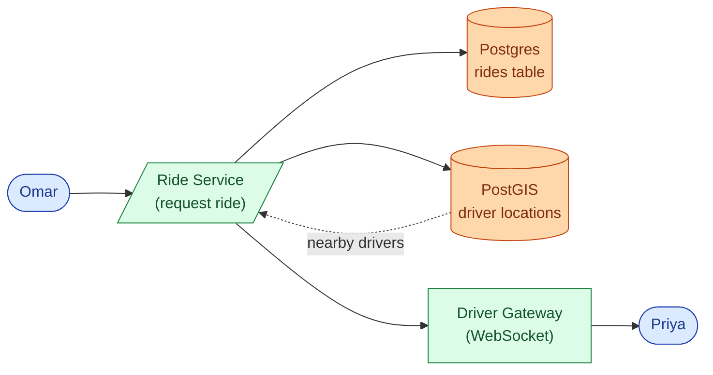

Three endpoints carry the whole product.

| Endpoint | What it does |
|----------|--------------|
| `POST /rides` | Rider submits pickup and dropoff, gets back a fare range and a ride ID |
| `POST /rides/{id}/accept` | Driver accepts a dispatch offer |
| `GET /rides/{id}` | Rider or driver polls the current ride state |

<details markdown="1">
<summary><b>Show: the core tables</b></summary>

```sql
CREATE TABLE rides (
    ride_id         BIGINT PRIMARY KEY,
    rider_id        BIGINT NOT NULL,
    driver_id       BIGINT,                 -- NULL until matched
    city_id         INT NOT NULL,
    state           SMALLINT NOT NULL,      -- 1=requested ... 6=cancelled
    pickup_lat      DOUBLE PRECISION NOT NULL,
    pickup_lng      DOUBLE PRECISION NOT NULL,
    dropoff_lat     DOUBLE PRECISION NOT NULL,
    dropoff_lng     DOUBLE PRECISION NOT NULL,
    vehicle_class   SMALLINT NOT NULL,
    requested_at    TIMESTAMPTZ NOT NULL,
    matched_at      TIMESTAMPTZ,
    completed_at    TIMESTAMPTZ,
    cancelled_at    TIMESTAMPTZ,
    fare_cents      INT,
    surge_mult      NUMERIC(3,2) NOT NULL DEFAULT 1.00,
    idempotency_key UUID
);

CREATE UNIQUE INDEX idx_idempotency ON rides (rider_id, idempotency_key);
CREATE INDEX idx_rider_active  ON rides (rider_id)  WHERE state IN (1,2,3,4);
CREATE INDEX idx_driver_active ON rides (driver_id) WHERE state IN (3,4);
```

The partial index on `driver_id` for active states is the guard against double-assignment at the database layer.

</details>

This handles Austin at 500 drivers. PostGIS nearby queries are fast enough. The problem shows up when we expand to NYC with 25,000 drivers and 6,000 location writes per second.

> **Take this with you.** Start from the smallest thing that works. The interesting part is what breaks next.

---

## Decision 1: how do we index a million moving cars?

The v1 PostGIS table breaks at scale. At 25,000 drivers pinging every 4 seconds, that is 6,250 writes per second to a relational table with a spatial index. The index cannot keep up with continuous updates while simultaneously serving fast range queries.

The core need is a location store that is fast to write (overwrite-in-place, not INSERT) and fast to query (give me all drivers within 500m of a point, right now).

The solution is a geospatial cell index in Redis. The question is which cell scheme to use.

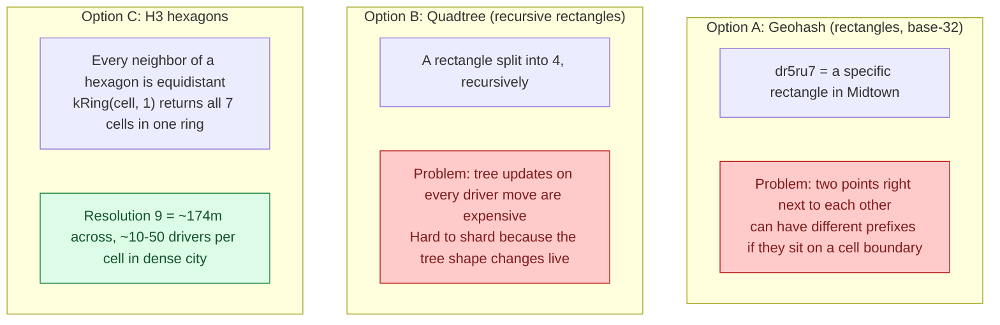

**Why hexagons beat squares.** With a square grid, diagonal neighbors are 1.41x farther than edge neighbors. When you search for "drivers near a pickup," hexagons give clean symmetric results. The code does not need to compensate for diagonal vs. edge distance.

**The pick: H3 resolution 9.** Cells are ~174m across, ~0.1 sq km. A dense city has 10-50 available drivers per cell at peak. A `kRing(cell, 1)` call covers the cell plus its 6 neighbors, a radius of roughly 500m. That is the right scale for "drivers close enough to arrive in a few minutes."

The Redis data layout per driver:

```
driver:{driver_id}          HASH    lat, lng, h3_r9, status, vehicle_class, last_update_ts
                                    TTL: 30s (refreshed on every ping)

cell:{h3_r9}                SET     driver IDs currently in this cell
                                    (no TTL; swept by driver key expiry)

driver_inflight:{driver_id} STRING  ride_id of active dispatch claim
                                    TTL: 30s (released on accept or timeout)

surge:{h3_r8}               STRING  surge multiplier, e.g. "2.1"
                                    TTL: 30s (refreshed by Surge Service)
```

Shard by H3 resolution 6 (cells ~6km across). All drivers in one metro neighborhood land on the same Redis shard. When a rider is near a shard boundary, the Matching Service reads from adjacent shards in parallel.

> **Take this with you.** Geohash is fine for v1. H3 is the right answer at scale. Quadtree on a live dataset is wrong because tree updates on every driver move are too expensive.

---

## Decision 2: how do we match a rider to a driver in under 2 seconds?

Omar taps Request. The Matching Service has 2 seconds to claim a driver and push an offer. Here is the algorithm.

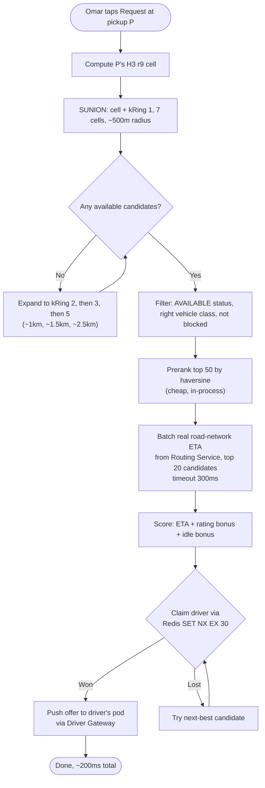

The `SET NX EX 30` claim is the mutual-exclusion mechanism. If two matching attempts race for Priya, one returns `1` (won) and the other returns `0` (try the next-best driver). The 30-second TTL is a safety net: if the Matching Service crashes before dispatching, the lock auto-releases.

Never use haversine as the final score. A driver 200m away on the other side of a river is much farther by road-network ETA. Haversine is acceptable for the coarse pre-filter (narrowing 200 candidates to 50), but the final score always uses road ETA.

<details markdown="1">
<summary><b>Show: three levels of matching, simplest first</b></summary>

**Level 1: greedy nearest.** Search the 1-ring. Filter. Score top 20 by real ETA. Claim the best available. Fast (under 200ms). Works well when supply is plentiful. Ship this first.

The downside: locally optimal, globally wasteful. If two riders request at almost the same time and the same driver is best for both, the second rider gets a much worse match than they would under paired matching.

**Level 2: greedy with a dispatch window.** Wait ~500ms to collect other pending requests in the same H3 area. Run a small batch match (Hungarian algorithm) to minimize total ETA across all pairs. The 500ms hold is invisible to the rider (still under 2 seconds) and improves average ETA by 5-15% in dense areas.

**Level 3: predictive matching.** The candidate pool includes drivers about to finish a trip in the next 60 seconds. Their ETA includes remaining trip time plus drive to pickup.

Ship Level 1. Add Level 2 when load and data justify it.

</details>

> **Take this with you.** The Redis `SET NX` is the lock that prevents double-assignment. The Routing Service is the heaviest dependency on the match path. Bound its concurrency, timeout, and fallback before your design is complete.

---

## Decision 3: how do we keep the ride state machine correct?

The state machine has seven states and ten transitions. The machine runs for 20-25 minutes across dropped connections, retries, and backgrounded apps. A wrong transition means a double charge or an unrefunded cancellation.

Four invariants that cannot be broken:

1. **Every transition is idempotent.** `POST /accept` called twice leaves the state unchanged. `matched_at` is set only on the first transition.
2. **No backward transitions.** Once `in_progress`, the only exits are `completed` or `cancelled`.
3. **One driver per ride. One active ride per driver.** The Redis `driver_inflight` key and the partial unique index on `rides.driver_id WHERE state IN (3,4)` both enforce this. Two locks, two layers.
4. **Cancel reason is required.** `rider_cancelled`, `driver_cancelled`, `system_no_drivers`, `no_show`, `fraud`. This drives the billing and refund decision.

Transitions are conditional SQL updates:

```sql
UPDATE rides
SET state = 2, driver_id = $driver, matched_at = NOW()
WHERE ride_id = $ride AND state = 1
RETURNING state;
```

If `RETURNING` yields 0 rows, the transition failed: the ride already moved on. The Driver Gateway tells Priya "ride no longer available" and clears her inflight key.

The `Idempotency-Key` header on `POST /rides` handles mobile retries. Without it, a rider who loses connectivity at the wrong moment creates two rides and gets charged twice.

> **Take this with you.** The partial unique index on `driver_id` for active states is the database-layer guard against double-assignment. The Redis `SET NX` is the application-layer guard. Never rely on just one.

---

## Decision 4: how do we handle surge pricing without coupling it to matching?

Surge is not part of the matching path. It is a read-only input to the quote.

The Surge Service reads supply and demand per H3 cell every 10 seconds and writes a multiplier:

```
multiplier = clip(demand_rate / supply_count, min=1.0, max=5.0)
```

`demand_rate` is ride requests in the cell in the last 60 seconds. `supply_count` is available drivers in the cell. The multiplier is written to `surge:{h3_r8}` in Redis with a 30-second TTL.

Surge uses H3 resolution 8 (cells ~3km across), one level coarser than the resolution 9 used for matching. A 5x multiplier on one block but 1x on the next would feel arbitrary. Neighborhood-level surge feels natural.

When Omar's request comes in, the Ride Service reads the current multiplier from Redis and locks it into `rides.surge_mult`. If Priya drives slowly or waits, the fare uses the locked surge, not whatever the live multiplier is when the trip ends.

If the `surge:{h3_r8}` key is missing or stale, the Ride Service defaults to 1.0. The Surge Service being slow or down does not break matching.

> **Take this with you.** Surge and matching do not talk to each other. Surge is a periodic write to a Redis key. Matching reads that key when building the quote. If surge goes down, rides keep working at 1x.

---

## The full architecture

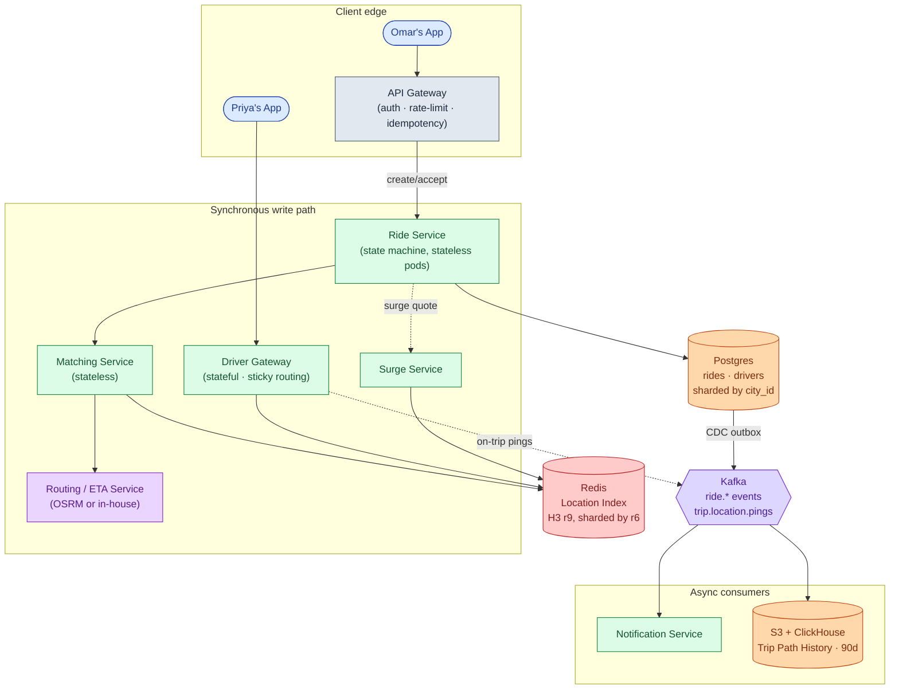

Each component, in one line:

| Component | Purpose |
|-----------|---------|
| API Gateway | Authenticates callers, rate-limits bots, dedupes mobile retries via idempotency keys |
| Ride Service | Owns the ride state machine. Stateless pods. Calls Matching when a driver is needed. |
| Matching Service | Stateless. Reads Redis, scores candidates with real ETA, claims driver via `SET NX`. |
| Driver Gateway | Stateful pods. One WebSocket per online driver. Receives pings, pushes dispatch offers. |
| Routing / ETA Service | Road-network ETA from A to B. CPU-heavy. Isolated so slowdowns do not cascade to matching. |
| Surge Service | Reads supply and demand per H3 r8 cell every 10 seconds. Writes multipliers to Redis. |
| Redis Location Index | Overwrite-in-place. H3 cell sets. Sharded by r6. The hot index for matching. |
| Postgres (sharded by city) | Source of truth for ride records. One shard per city or metro. |
| Kafka + consumers | Trip path history for fraud and disputes. Notification fan-out. All off the synchronous path. |

---

## Walk: a ride request, end to end

Omar taps Request in Midtown. Here is what happens.

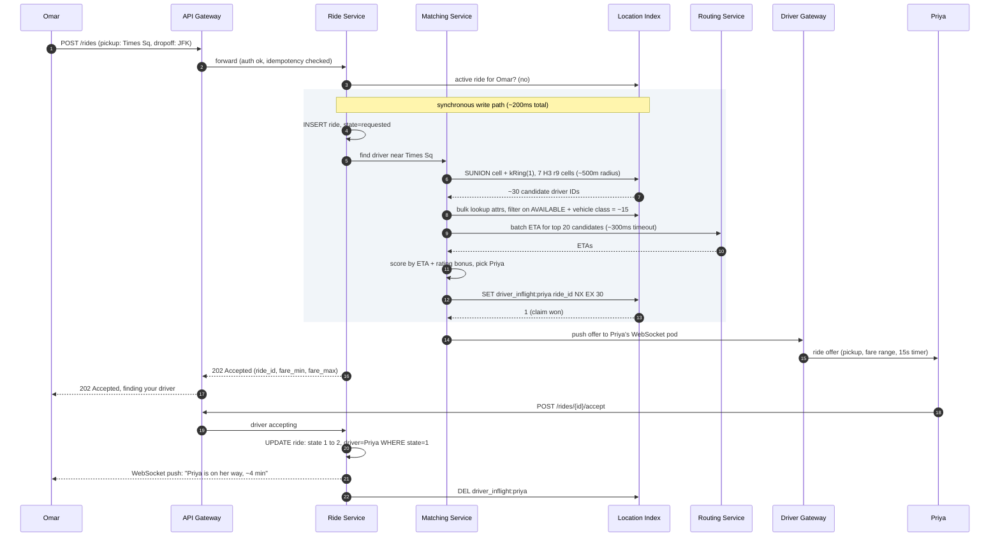

Three things worth pointing at:

1. The 202 goes back to Omar **before** Priya accepts. The ride is created. Matching is in progress. Omar sees a spinner. The WebSocket delivers the update when Priya taps Accept.
2. The `SET NX EX 30` in step 10 is the mutual-exclusion lock. If two matching instances race for Priya, one gets `1` and the other gets `0` and moves to the next candidate.
3. The match path (steps 3-10) targets under 200ms. Driver acceptance adds another 3-15 seconds on top. These are different SLOs.

---

## Walk: location pings at scale

Priya is driving toward Omar. She pings every second. With 1M online drivers, the system receives 475,000+ pings per second globally. Each ping causes exactly two writes.

**Write 1: overwrite the location index (every driver, always).**

The Driver Gateway computes the H3 cell from `(lat, lng)`. It updates two Redis keys:

- `driver:{driver_id}`: overwrite with new lat, lng, h3_r9, last_update_ts. TTL refreshed to 30 seconds.
- If the H3 cell changed since last ping: remove from `cell:{old_h3}` set, add to `cell:{new_h3}` set. If same cell: no-op.

Latency: ~0.5ms per ping. Both operations are in memory.

**Write 2: trip path history (on-trip drivers only).**

If Priya is on a trip, the Gateway also pushes the ping to Kafka topic `trip.location.pings` keyed by `trip_id`. A consumer batches per trip and writes to S3 and ClickHouse.

Idle-online drivers are not persisted. Only on-trip pings go to durable storage. This cuts storage cost by roughly 90%.

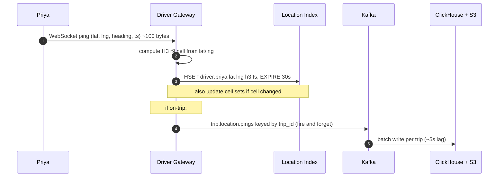

> **Take this with you.** Two writes per ping: one cheap overwrite to Redis (every driver), one durable append to Kafka (on-trip only). Separating these cuts storage cost by 10x and keeps the hot write path fast.

---

## The hot cell problem

JFK at 5pm has 200 available drivers in two H3 cells. Every rider request in that area triggers a SUNION returning 200 driver IDs. Then a Routing call for ETA across all 200. The Redis shard that owns the JFK cells is at 100% CPU, and every other key on that shard is suffering.

The defenses, cheapest first:

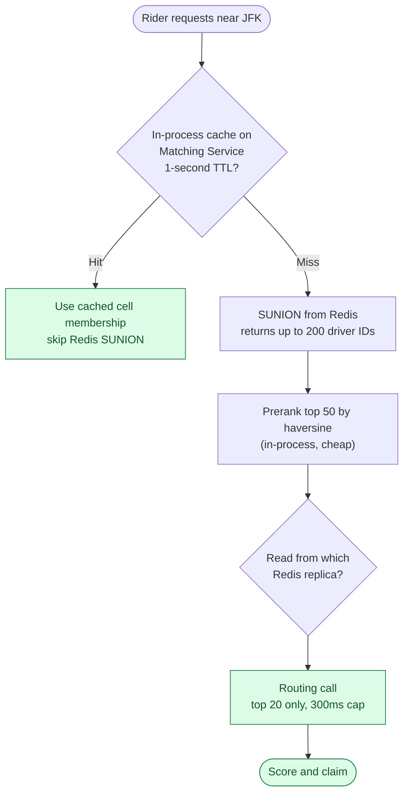

For predictable surges like a concert ending, pre-populate the cell cache at 9:55 before the 10pm rush. The storm hits a warm cache.

> **Take this with you.** The hot cell problem is solved by an in-process cache on the Matching Service, not by scaling Redis. Cap the Routing call at 20 candidates. Most deployments need nothing more than those two changes.

---

## Follow-up questions

Try answering each in 3 or 4 sentences before opening the solution.

1. **Driver ignores the offer.** Priya does not tap Accept within 15 seconds. What does the system do? What if she keeps ignoring requests?

2. **Driver loses connectivity mid-trip.** Priya's phone drops off the network for 90 seconds. How does the system know the trip is still going? What does Omar see? What if she never reconnects?

3. **Two riders, one best driver.** Omar and another rider both request at the same moment and Priya is the best match for both. Walk through the race. How do you prevent Priya from being double-assigned?

4. **Hot cell: airport at rush hour.** JFK has 200 available drivers in two H3 cells. How do you bound the work on every request so matching stays under 200ms?

5. **Hot Redis key.** The `cell:{jfk_h3}` set is on one Redis shard at 100% CPU. Diagnose the problem and describe the fix in order of cheapest to most expensive.

6. **Region failure.** `us-east-1` goes down. NYC rides live there. What happens to in-progress trips? Can riders in other cities still book?

7. **Driver heading away from pickup.** Priya just dropped off a rider and is driving toward home. The matcher picks her because she is 300m from the pickup. Is this the right call? How do you handle direction in scoring?

8. **Fraud: fake GPS.** A driver submits fake coordinates to appear in a high-surge cell. How do you detect this without adding latency to the ingest path?

9. **Routing Service is slow or down.** Matching depends on it for ETAs. How do you degrade gracefully so riders can still get matched?

10. **Bulk cancel.** A major storm hits NYC. Ops wants to cancel all in-progress rides in Manhattan and refund riders. How does the backend handle this, and what can go wrong?

---

## Related problems

- **[News Feed (002)](../002-news-feed/question.md).** The hot-cell problem at an airport is the same fan-out problem as a celebrity post in news feed. Same fixes: in-process cache, replicas, jittered TTLs.
- **[Chat System (003)](../003-chat-system/question.md).** The in-ride chat between Omar and Priya is the same WebSocket and presence problem. The Driver Gateway here is shaped exactly like the chat gateway there.
- **[Notification System (010)](../010-notification-system/question.md).** Dispatch push to drivers, "your driver is arriving" to riders, and SMS fallback when the app is backgrounded all flow through the notification service.


<div class="pr-solution-divider"></div>


## Solution: Design Uber / Lyft (Ride Sharing)

### What this system is

Ride sharing is three problems in one. A real-time location index that tracks ~1M moving drivers at 475,000+ pings per second. A matching pipeline that turns a rider's tap into an assigned driver in under 2 seconds. A ride state machine that survives 20-25 minutes of dropped connections, retries, and backgrounded apps without charging anyone for a ride that never happened.

The architecture splits cleanly along those three concerns. Location pings flow through a stateful Driver Gateway into a Redis cluster keyed by H3 hexagonal cells, overwrite-in-place, never queried for history. The Matching Service is stateless: it reads from the Redis index, applies filters, scores candidates by real road-network ETA from a separate Routing Service. Ride records live in Postgres sharded by city, with on-trip path history streamed to Kafka and S3 for fraud and dispute resolution.

The interesting work is in the seams. The Driver Gateway must be stateful (it holds a WebSocket per driver), which makes deploys harder. The state machine has cancellation, no-show, and reconnect transitions that all must be idempotent because a flaky network delivers every event at least twice.

---

### 1. The two questions that matter most

**What is in scope?** Matching only, or also payments, surge, ETA prediction, in-ride chat, driver onboarding? A reasonable slice: rider requests, system finds a driver, both sides see live updates until pickup, mention surge briefly, skip payments. Without scoping this first, you can spend the whole interview designing a payments system.

**How big is the hottest single city?** Uber global has ~1M online drivers at peak, but the single-city number shapes one shard. NYC can have 50,000 online drivers on a busy Friday night. That number is the shard size target and it determines whether Postgres with PostGIS (fine for 500 drivers) or Redis with H3 cells (required for NYC at peak) is the right location store.

Everything else follows from those two answers.

---

### 2. The math

| Metric | Value |
|--------|-------|
| Trip requests/sec, sustained | ~1,160 |
| Trip requests/sec, peak | ~10,000 |
| Location pings/sec, sustained | ~475,000 |
| Location pings/sec, peak | ~1,000,000 |
| Active trips globally at any moment | ~1,000,000 |
| Active trips, NYC at peak | 50,000 to 100,000 |
| Durable trip-path storage per day | ~2 TB (on-trip only, compressed) |
| Current-location storage (all online drivers) | ~200 MB |

The most important observation: location ingest dwarfs every other workload by a factor of 50. Keep it on its own infrastructure so it does not bleed into matching latency or trip-state writes.

---

### 3. The API

**Request a ride (rider side).**

```
POST /api/v1/rides
Authorization: Bearer <rider_token>
Idempotency-Key: <uuid>

{
  "pickup":  { "lat": 40.7580, "lng": -73.9855, "address": "Times Sq" },
  "dropoff": { "lat": 40.6413, "lng": -73.7781, "address": "JFK Airport" },
  "vehicle_class": "uberx",
  "payment_method_id": "pm_abc"
}
```

| Status | Meaning |
|--------|---------|
| **202 Accepted** | Ride created in `requested` state. Matching in progress. |
| **200 OK** | Idempotency replay. Same ride returned. |
| **400 Bad Request** | Bad input or pickup outside service area. |
| **402 Payment Required** | Payment method invalid or expired. |
| **409 Conflict** | Rider already has an active ride. |
| **503 Service Unavailable** | No drivers found after timeout. |

Small but load-bearing choices:

| Choice | Reason |
|--------|--------|
| 202, not 201 | The ride exists but is not yet matched. The resource is not complete. |
| Idempotency-Key required | Mobile retries on timeout. Without it, retries create duplicate rides and double charges. |
| Fare is a range | `fare_min` and `fare_max`. Final fare depends on actual trip time and any waiting time. |

**Driver accepts.**

```
POST /api/v1/rides/{ride_id}/accept
Authorization: Bearer <driver_token>

{ "driver_eta_seconds": 240 }
```

| Status | Meaning |
|--------|---------|
| **200 OK** | Driver assigned. |
| **409 Conflict** | Already accepted by another driver, or wrong state. |
| **410 Gone** | Rider cancelled or offer timed out. |

**Location pings (driver side).** Not REST. Sent over the persistent WebSocket as a compact binary frame, about 46 bytes vs ~200 bytes for JSON. At 475,000 pings/sec, the bandwidth saving is material.

---

### 4. The data model

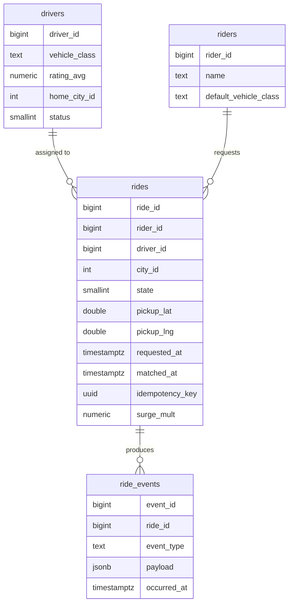

<details markdown="1">
<summary><b>Show: the full SQL</b></summary>

```sql
CREATE TABLE rides (
    ride_id          BIGINT PRIMARY KEY,
    rider_id         BIGINT NOT NULL,
    driver_id        BIGINT,
    city_id          INT NOT NULL,
    state            SMALLINT NOT NULL,      -- 1=requested 2=matched 3=driver_arriving
                                            --   4=in_progress 5=completed 6=cancelled 7=no_show
    pickup_lat       DOUBLE PRECISION NOT NULL,
    pickup_lng       DOUBLE PRECISION NOT NULL,
    dropoff_lat      DOUBLE PRECISION NOT NULL,
    dropoff_lng      DOUBLE PRECISION NOT NULL,
    vehicle_class    SMALLINT NOT NULL,
    requested_at     TIMESTAMPTZ NOT NULL,
    matched_at       TIMESTAMPTZ,
    picked_up_at     TIMESTAMPTZ,
    completed_at     TIMESTAMPTZ,
    cancelled_at     TIMESTAMPTZ,
    cancel_reason    SMALLINT,
    fare_cents       INT,
    surge_mult       NUMERIC(3,2) NOT NULL DEFAULT 1.00,
    idempotency_key  UUID
);

CREATE UNIQUE INDEX idx_idempotency ON rides (rider_id, idempotency_key);
CREATE INDEX idx_rider_active  ON rides (rider_id)  WHERE state IN (1,2,3,4);
CREATE INDEX idx_driver_active ON rides (driver_id) WHERE state IN (3,4);

CREATE TABLE ride_events (
    event_id      BIGINT PRIMARY KEY,
    ride_id       BIGINT NOT NULL REFERENCES rides(ride_id),
    event_type    TEXT NOT NULL,
    payload       JSONB,
    occurred_at   TIMESTAMPTZ NOT NULL DEFAULT NOW()
);
CREATE INDEX idx_events_ride ON ride_events (ride_id, occurred_at);
```

The partial index on `driver_id` for active states is the database-layer guard against double-assignment. If Matching tries to write `driver_id=Priya` to two different rides in state (3,4), the second write violates this index. Belt and suspenders alongside the Redis `SET NX` claim.

</details>

**The Driver Location Index (Redis, not SQL).**

```
driver:{driver_id}          HASH    lat, lng, h3_r9, h3_r6, status,
                                    vehicle_class, last_update_ts
                                    TTL: 30s (refreshed on every ping)

cell:{h3_r9}                SET     driver IDs in this cell
                                    (no TTL; entries swept by driver key expiry)

driver_inflight:{driver_id} STRING  ride_id of active dispatch claim
                                    TTL: 30s (cleared on accept or timeout)

surge:{h3_r8}               STRING  multiplier, e.g. "2.1"
                                    TTL: 30s (refreshed by Surge Service every 10s)
```

Sharded by `h3_r6` (coarse cells, ~6km across). All drivers in one neighborhood land on the same Redis shard. ~20 shards at peak. ~5 GB per shard.

---

### 5. H3 indexing and the matching loop

**Why H3 resolution 9.** Cells are ~174m across, ~0.1 sq km. A dense city has 10-50 available drivers per cell at peak. A `kRing(cell, 1)` call covers 7 cells, a ~500m radius. Most matches happen within ring 1. If not (suburbs), expand to ring 2, 3, 5. Cap at ring 5.

**Why hexagons beat squares.** Every neighbor of a hexagon is equidistant. With a square grid, diagonal neighbors are 1.41x farther than edge neighbors. Searching "drivers near a pickup" with hexagons gives symmetric results and no distance-compensation code.

<details markdown="1">
<summary><b>Show: the matching loop</b></summary>

```python
def match(ride):
    pickup_cell = h3.geo_to_h3(ride.pickup_lat, ride.pickup_lng, resolution=9)

    for ring_size in [1, 2, 3, 5]:
        cells = h3.k_ring(pickup_cell, ring_size)
        candidate_ids = redis.sunion(*[f"cell:{c}" for c in cells])

        candidates = location_index.bulk_lookup(candidate_ids)
        candidates = [
            d for d in candidates
            if d.status == AVAILABLE
            and d.vehicle_class >= ride.vehicle_class
            and d.driver_id not in ride.rider.blocked_drivers
        ]

        if not candidates:
            continue

        candidates = sorted(candidates, key=lambda d: haversine(d, ride.pickup))[:50]
        etas = routing_service.batch_eta(
            origins=[(c.lat, c.lng) for c in candidates[:20]],
            destination=(ride.pickup_lat, ride.pickup_lng),
            timeout_ms=300,
        )

        scored = sorted(
            zip(etas, candidates[:20]),
            key=lambda t: t[0] + rating_penalty(t[1].rating) + idle_bonus(t[1])
        )

        for eta, candidate in scored:
            if try_claim(candidate.driver_id, ride.ride_id):
                return candidate.driver_id

    return None
```

`try_claim` is a Redis Lua script:

```lua
if redis.call('SET', KEYS[1], ARGV[1], 'NX', 'EX', 30) == 1 then
    return 1
else
    return 0
end
```

`SET NX EX 30`: set only if not exists, expire in 30 seconds. Two racing requests for the same driver: one returns 1 (won), the other returns 0 (try next). The 30-second expiry is a safety net: if Matching crashes before dispatching, the lock releases and the driver becomes claimable again.

</details>

---

### 6. The ride state machine

```mermaid
stateDiagram-v2
    direction LR
    [*] --> requested: rider taps Request
    requested --> matched: driver accepts
    requested --> cancelled: no driver found / rider cancels
    matched --> driver_arriving: en route shown
    driver_arriving --> in_progress: rider boards, driver taps Start
    driver_arriving --> cancelled: either side cancels
    driver_arriving --> no_show: driver waited, rider did not show
    in_progress --> completed: driver taps End Trip
    in_progress --> cancelled: rare; fraud / system cancel
    completed --> [*]
    cancelled --> [*]
    no_show --> [*]
```

Four invariants:

1. **Every transition is idempotent.** `POST /accept` called twice leaves the state unchanged.
2. **No backward transitions.** Once `in_progress`, the only exits are `completed` or `cancelled`.
3. **One driver per ride. One active ride per driver.** Redis `driver_inflight` key plus the partial unique index on `rides.driver_id`. Two locks, two layers.
4. **Cancel reason is required.** `rider_cancelled`, `driver_cancelled`, `system_no_drivers`, `no_show`, `fraud`. This drives the billing and refund decision.

Transitions are conditional SQL updates:

```sql
UPDATE rides
SET state = 2, driver_id = $driver, matched_at = NOW()
WHERE ride_id = $ride AND state = 1
RETURNING state;
```

If `RETURNING` yields 0 rows, the transition failed. The Driver Gateway tells Priya "ride no longer available" and clears her inflight key.

---

### 7. The architecture

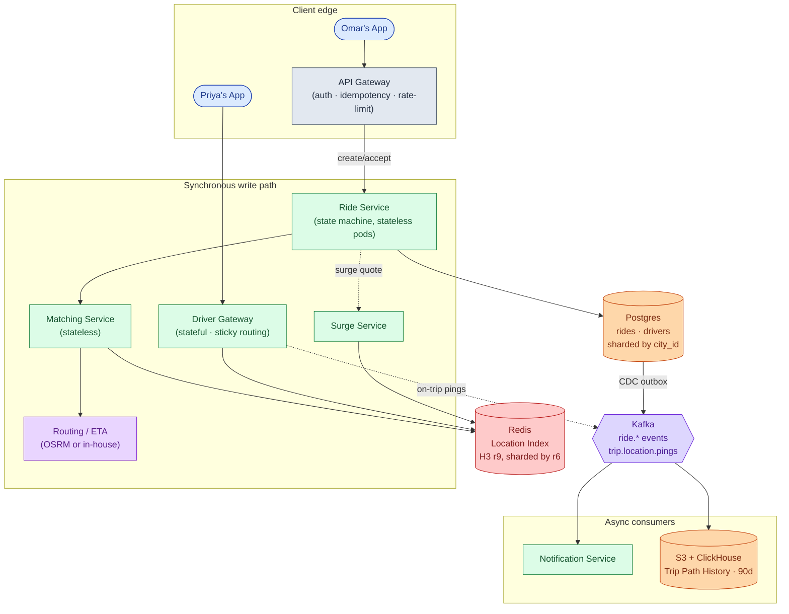

Five things to notice:

- The Driver Gateway is **stateful**. A WebSocket is a connection. Sticky routing by `driver_id` plus a Redis session table (`gateway_session:{driver_id} -> pod_id`) lets Matching push dispatch offers by looking up which pod holds each driver.
- The Matching Service is **stateless**. It reads Redis, calls Routing, claims via `SET NX`, tells the gateway to push. Easy to scale horizontally.
- The Routing Service is **isolated**. Road-network ETA is CPU-heavy. A routing slowdown does not crash matching. Matching times out at 300ms and falls back to haversine.
- The Trips DB is **sharded by city**. NYC going down does not affect London.
- Notifications and path history live **after Kafka**. If the Notification Service crashes at 3am, rides still get matched and completed. Push messages queue up and deliver when it recovers.

---

### 8. A request, traced

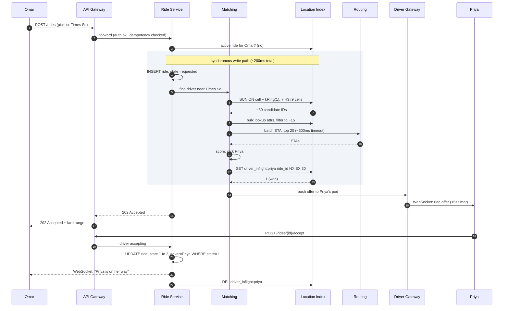

Target latencies:

| Operation | P99 target |
|-----------|------------|
| Create ride (202 back to Omar) | ~200ms (bottleneck: SUNION + Routing call) |
| Driver accept (state transitions to matched) | ~150ms |
| Ride status read | ~50ms |

---

### 9. The scaling journey: one city to global

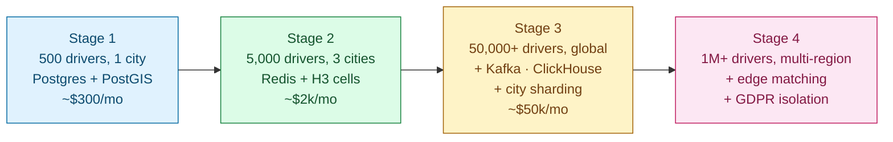

#### Stage 1: 500 drivers, one city

One Postgres with PostGIS. Driver locations in a table with a GiST spatial index. One app instance. Notifications inline. About $300/month. Ships in a weekend.

This works because you see 50 ride requests per hour. PostGIS is loafing.

#### Stage 2: 5,000 drivers, 3 cities

PostGIS cannot keep up with ~1,250 pings/sec. Move location to Redis with H3 cell sets. Add a dedicated Driver Gateway for WebSocket connections. Add a standalone Matching Service. Notifications consume a small Kafka topic instead of inline HTTP calls. About $2k/month.

Still one Postgres for ride records. Still one Routing instance.

#### Stage 3: 50,000+ drivers, global

Several things break at once: airport H3 cells become Redis hot keys; the Routing Service cannot keep up at peak; one global Matching Service has cross-region latency; the single Postgres cannot handle writes from dozens of cities.

Fixes in order:

1. In-process cache on Matching for cell reads (1-second TTL). Cuts Redis load on hot cells by 10-100x.
2. Matching Service replicated per city-region.
3. Postgres sharded by `city_id`. Each region runs its own primary plus read replicas.
4. Routing Service scaled independently with a circuit-breaker and haversine fallback.
5. Trip path history streamed to Kafka then S3 and ClickHouse.

Cost ~$50k/month.

#### Stage 4: 1M+ drivers, multi-region

New problems: a region failure takes down all rides in that region; EU operations require EU rider data to stay in EU; GDPR isolation becomes a hard requirement.

Each region runs its full stack: Gateway, Redis, Matching, Trips DB, Kafka. The rider's home region decides where the ride record lives. A full region failure triggers DNS failover for new traffic and auto-cancel with refund for in-progress rides.

The architecture has not fundamentally changed since Stage 3. You added regions and GDPR isolation. The core data model is the same one written in Stage 1.

---

### 10. Four hard sub-problems

| Situation | What stresses the system | The fix |
|-----------|--------------------------|---------|
| **Airport pickup at 5pm** | One H3 cell has 200 available drivers. SUNION returns 200 IDs. Routing for all 200 would be slow. | Pre-filter by haversine to top 50 before fetching attributes. Cap Routing at top 20. In-process cache for cell membership. |
| **Concert lets out, 5,000 requests in 10 minutes** | Demand spike in a small area. Matching races. Surge computation lags. | Batch matching with 500ms dispatch window. Surge Service updates every 10 seconds with smoothing. |
| **Driver connectivity drops mid-trip** | Ride is `in_progress`. No pings arriving. Omar sees no movement. | State machine does not care about pings. Omar's app shows "GPS lost" after 30 seconds. Driver app queues pings locally and replays on reconnect with original timestamps. |
| **Driver just dropped off a rider, heading home** | Available status but moving away from request area. Haversine makes them look close. | Use Routing Service ETA (road-network, direction-aware) not haversine for final score. A driver heading away ranks lower by ETA even if close by straight line. |

---

### 11. Reliability

**Driver Gateway pod crash.** All drivers on that pod disconnect. Apps retry with exponential backoff plus jitter (start 1s, max 30s). Within ~10 seconds a healthy pod absorbs them. During the reconnection window, those drivers are not matchable. In-progress rides on those drivers are unaffected: ride state lives in Postgres, not the Gateway.

**Driver loses connectivity mid-trip.** The trip stays `in_progress`. No event has transitioned it. After 15 minutes with no pings during an `in_progress` ride, ops gets an alert. The fare is computed from the End Trip event, not from pings, so lost connectivity does not by itself invalidate the trip.

**Redis cluster loss.** Catastrophic for matching. AZ replication handles most failures in ~30 seconds. On full cluster loss, location pings buffer in Gateway memory for up to 60 seconds. After that, drivers appear offline and riders see "no drivers available."

**Routing Service slow or down.** Match path falls back to haversine. Quality drops but the system functions. A circuit breaker trips after sustained failures and switches all matches to haversine for a 30-second cooldown before probing again.

**Trips DB primary failure.** Failover to replica (~30 seconds). During the window, new ride requests in that city return 503. In-progress rides cannot transition state. Other cities are fully functional.

---

### 12. Observability

| Metric | Why it matters |
|--------|----------------|
| `match.latency.p99` by city | Headline SLO. >2s for 5 min is a page. |
| `match.success_rate` by city | Percent of requests that find a driver before timeout. |
| `match.no_drivers_rate` | >5% in a city means a supply problem. |
| `dispatch.accept_rate` | Percent of offers accepted. <40% means drivers gaming the system or bad match quality. |
| `location.ingest_rate` by region | Should track `drivers_online × 0.475`. |
| `location.stale_driver_count` | Drivers with last update >30s. Spikes mean a Gateway problem. |
| `redis.hot_cell.ops` for airports | Should stay below shard CPU capacity. |
| `routing.latency.p99` | Feeds directly into match latency. |
| `state_machine.illegal_transitions` | Should be near zero. Any nonzero value means a client bug or replay attack. |
| `trip.in_progress_no_pings.count` | Trips with no ping in 60s. Possible fraud or network failure. |

Page on: match P99 >2s for 5 min in any top-20 city. Match success rate <90% for 5 min. Gateway disconnect rate >5%/min. Trips DB unavailable.

Ticket on: dispatch accept rate <40%. Hot cell ops >80% of shard capacity. Illegal transitions >0.

---

### 13. Follow-up answers

**1. Driver ignores the offer.**

The Matching Service holds a soft claim via `driver_inflight:{driver_id}` with a 30-second TTL. When dispatch times out at 15 seconds:

- Gateway tells Matching "no answer."
- Matching releases the claim and increments a per-driver `ignored_count`.
- Matching re-runs, excluding this driver for the next 5 minutes.
- Omar's UI keeps showing "finding your driver." State stays `requested`. No fee.

If a driver ignores 3 offers in a row, their status flips to `offline` automatically. Their app gets: "You seem inactive. Are you still online?" This stops abandoned phones from holding queue slots.

**2. Driver loses connectivity mid-trip.**

The ride is in `in_progress`. The state machine does not care about the WebSocket connection, only about state-change events.

Gateway marks the driver `connection_lost` in the session table but does not change ride state. After 30 seconds, Omar's app shows a "GPS lost" overlay. Priya's app queues location samples locally (up to ~10 minutes). When she reconnects, the Gateway accepts the queued samples, timestamped and replayed in order. If she never reconnects: after 15 minutes during `in_progress`, ops gets an alert and manually resolves. The fare is computed from the End Trip event, not GPS pings.

**3. Two riders, one best driver.**

Omar and Yui both request at almost the same time. Priya is the best match for both. Both Matching Service instances attempt `SET driver_inflight:priya NX EX 30`. One wins at t=200ms. The other gets `0` at t=210ms and moves to the next-best candidate.

The Redis `SET NX` is the first layer. The partial unique index on `rides.driver_id` for active states is the second layer. Belt and suspenders.

**4. Hot cell: airport at rush hour.**

Two costs to bound: the SUNION returns up to 200 IDs, and Routing needs real ETA for each one.

Fix: pre-filter by haversine (cheap, in-process) to the 50 nearest before fetching full attributes. After filtering on status and vehicle class, pass only the top 20 to Routing. The hot cell adds a few milliseconds of in-process work, not a Routing round-trip per candidate.

Also: in-process cache on Matching with a 1-second TTL for cell membership. A hot cell serving dozens of requests per second will be served from memory for most of them.

**5. Hot Redis key.**

Symptoms: one Redis shard at 100% CPU, `cell:{jfk_h3}` reads dominate, every other key on that shard has degraded P99.

Mitigations in order:

1. In-process cache on Matching (1-second TTL). Cuts hot-cell reads by 10-100x. This alone often fixes it.
2. Read replicas of the hot shard. Matching round-robins reads across them.
3. Sub-shard the hot cell: replace `cell:{h3}` with `cell:{h3}:bucket{0..15}` keyed by `hash(driver_id) mod 16`. Reads become a 16-way SUNION (still fast). Writes distribute across 16 keys.
4. Pin known hot cells (airports, stadiums) to a dedicated high-resource shard at provisioning.

Most deployments need only steps 1 and 2.

**6. Region failure.**

In-progress trips in the failed region cannot transition state. Riders on those trips see "service interrupted" and are auto-cancelled with a full refund. Riders in unaffected cities are fully functional. City sharding gives independent blast radii by design.

For within-region reliability: the Trips DB is replicated across AZs. A single AZ failure is invisible. A full region failure triggers DNS-based failover for new traffic, plus the auto-cancel path for in-progress rides.

**7. Driver heading away from pickup.**

The driver has `status=AVAILABLE` but is driving home. Haversine says she is 300m away. Her road-network ETA is 8 minutes because she needs to make a U-turn.

The fix: always use the Routing Service for final scoring, not haversine. Road-network ETA is direction-aware and factors in the U-turn, one-way streets, and current heading. Haversine for the coarse pre-filter (narrow 200 to 50) is fine. The final score always uses road ETA.

**8. Fraud: fake GPS locations.**

Detection without adding latency to the ingest path:

- **Plausibility check at the Gateway.** If a driver moves more than 1km between two pings 4 seconds apart (that is 900 km/h), flag the ping. Sub-millisecond check. Real cars do not teleport.
- **Road-path check.** For on-trip drivers, the path should follow roads. A path cutting through buildings is suspicious. Run this as a nightly batch against Trip History in ClickHouse.
- **Device attestation.** Google Play Integrity and Apple DeviceCheck verify the location came from a real device, not a mock-location app. Bake into the WebSocket handshake. Flagged devices receive lower matching priority.
- **Surge-zone teleportation.** A driver appearing in a high-surge cell with no path leading there gets flagged.

None of these sit in the synchronous match path. Fraud is mostly an async detection problem.

**9. Routing Service slow or down.**

Matching falls back to haversine distance for scoring:

```python
try:
    etas = routing_service.batch_eta(origins, dest, timeout_ms=300)
except (TimeoutError, ServiceUnavailable):
    etas = [haversine(o, dest) / AVG_SPEED for o in origins]
    metrics.inc("matching.routing_fallback")
```

Quality drops because haversine ignores the road network. A driver across a river may rank too high. But the system keeps functioning and most urban grid matches stay acceptable.

A circuit breaker trips after sustained failures and switches all Matching to haversine for a 30-second cooldown. For rider-facing ETA display: fall back to "a few minutes" instead of a specific number. A wrong number is worse than a vague one.

**10. Bulk cancel: storm in Manhattan.**

Ops calls `POST /admin/bulk_cancel` with a city and bounding-box filter. The service iterates over rides in that box with state in (2, 3, 4), transitions each to `cancelled` with `cancel_reason=system_event`, and enqueues refund events to Kafka.

Risks:

- Serial iteration at 50,000 active trips is slow. Run it as a background job with a progress key in Redis. Do not block the API thread.
- Some rides will have just completed between the query and the update. The conditional `WHERE state IN (2,3,4)` handles that safely.
- The refund consumer must be idempotent. If the bulk cancel job crashes halfway and replays, the consumer must not double-refund.
- Notify drivers too. Drivers with active dispatch offers should receive "ride cancelled" over their WebSocket immediately, not through a Kafka event that might lag.

---

### 14. Trade-offs worth saying out loud

**Greedy match vs. batch match.** Greedy is simpler, faster, and locally optimal. Batch with a 500ms dispatch window gives 5-15% better global ETA in dense areas. Ship greedy first. Add batched matching as a per-city experiment with a tunable window.

**Why H3 and not geohash.** Hexagonal neighbor uniformity matters when most matches are within 1-2 rings. Geohash neighbors have non-uniform distance, requiring more rings to cover the same physical radius. H3 also has `compact`/`uncompact` for multi-resolution queries.

**Why a stateful Driver Gateway.** The alternative (long-polling) costs 3-5x more bandwidth and battery. Stateful with sticky routing and a session table is correct here. "Stateless" is right for most services, but a WebSocket is a connection.

**Why not Postgres for driver locations.** 475,000 overwrite-in-place operations per second on a relational table is very painful. Redis handles this at under 1ms per operation. Location is "current truth, not historical truth." Treating it as a cache, not a record, is the right model.

**Why separate the Routing Service.** Road-network ETA is CPU-intensive with a different scaling profile than matching. If Routing slows down during a sporting event, it degrades in isolation, not taking matching down with it.

---

### 15. Common mistakes

**"Store driver locations in Postgres with a GiST index."** Fine for v1 at 500 drivers. Falls over at 25,000+ drivers with sustained writes. The strongest answers say "v1 uses PostGIS; here is the signal that tells us to switch."

**"Use haversine for scoring."** Acceptable as a pre-filter. As the primary score, it ignores the road network and ranks drivers on the wrong side of rivers or one-way streets. The Routing Service is a separate layer and the interview is checking whether you know that.

**No state machine.** A design that describes matching but never names ride states is incomplete. The state machine is where most production bugs and billing errors live.

**Ignoring idempotency.** Network retries on `POST /rides` cause duplicate rides and double charges. Idempotency keys are required, not optional. This is the single most common production incident in ride-sharing systems.

**No mention of the hot-cell problem.** Every city has an airport. Every stadium empties after a game. If you cannot describe how to keep one Redis key alive under load, you are missing a real operational concern that Uber has published about publicly.

**Treating Routing as a free function call.** It is the heaviest dependency in the match path. Bounding its concurrency, timeout, and fallback is essential. Weak answers call Routing and never discuss what happens when it is slow.

**Forgetting cancellation.** Half the state machine is cancel paths. Happy-path only leaves the interviewer to infer the rest. Call out driver no-response, rider cancel, driver cancel, and system cancel explicitly.

**Confusing match latency with acceptance latency.** Matching takes under 200ms. Driver acceptance takes 3-15 seconds. The 2-second P99 SLO is for "from rider tap until the offer reaches the driver's phone," not "until the driver taps Accept." Be explicit about which one you are measuring.

**Over-engineering multi-region.** Cities are independent. A globally distributed multi-master location index is not needed. Per-region, per-city sharding is correct. A NYC driver cannot pick up a Tokyo rider anyway.

