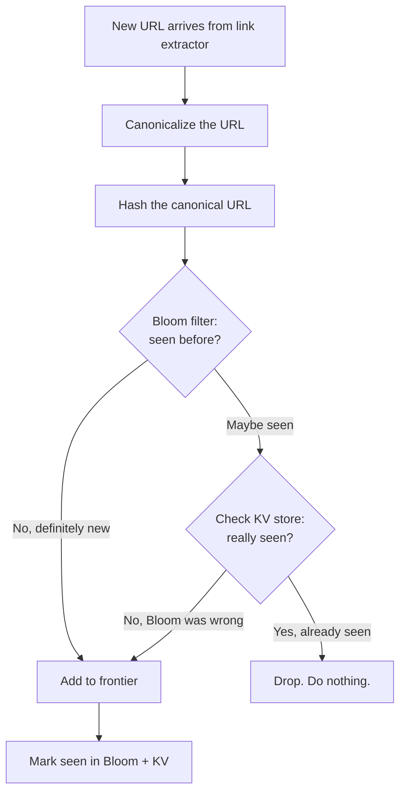
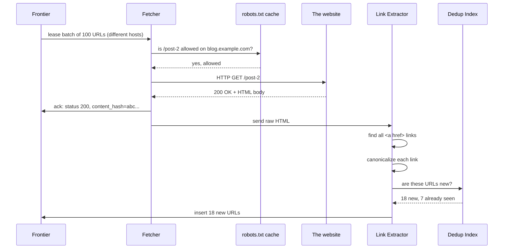


## The scene

You sit down. The interviewer pulls up a blank whiteboard tab. They type one line.

> *"Design a web crawler. Something like Googlebot. Walk me through it."*

Then they wait.

Most people start by drawing a queue and a pool of workers. That gets you the wrong answer. The hard parts of a web crawler are not the queue. They are:

- Being polite to websites so they do not block you.
- Not crawling the same page twice when you have billions of pages.
- Splitting work across hundreds of machines without them stepping on each other.

We will walk this step by step. At each step we will name what breaks first, then add the smallest fix that solves it.

A few words you will see a lot:

- **Crawler.** A program that visits web pages and saves them.
- **Frontier.** The to-do list of URLs we still need to fetch. Think of it as a giant inbox.
- **Fetcher.** A worker that does the actual HTTP GET to download a page.
- **Politeness.** Rules that stop us from hammering one website too hard.
- **robots.txt.** A small file at `https://site.com/robots.txt` where the site owner tells crawlers what they may and may not fetch.
- **Bloom filter.** A tiny memory structure that quickly tells you if you have probably seen a URL before. Fast but allowed to be wrong sometimes (false positives).
- **Canonicalize.** Clean up a URL so different forms of the same URL look identical.

---

## Step 1: Ask the right questions

Before you draw anything, sit for five minutes. Write down questions you would ask the interviewer.

A good answer here is not "20 questions." It is the handful of questions that change the design if answered differently.

<details markdown="1">
<summary><b>Show: 8 questions that matter</b></summary>

1. **What are we crawling?** Just HTML pages? Also images, PDFs, videos? Also pages that need JavaScript to render? *(Each one is a different pipeline. If you assume "everything" you will design a system 10x bigger than what they wanted.)*

2. **Where do we start?** From a seed list? From sitemaps? Are we adding to an existing crawl, or starting from zero? *(Real crawlers always have an existing list. Starting from scratch is a different problem.)*

3. **How fresh must the index be?** Hourly for news? Daily for blogs? Monthly for dormant pages? *(The recrawl scheduler can be bigger than the main crawler.)*

4. **How polite must we be?** What is the default per-site rate? *(One stranger's website should never go down because of us. This is the most load-bearing rule.)*

5. **What does the crawler output?** Raw HTML to a blob store? Parsed text to an indexer? *(Most candidates skip this and have no plan for what happens after the fetch.)*

6. **How big?** Pages per day? Hosts? Bandwidth? Storage budget? *(5 billion pages/day at 100KB each is 500TB/day. If the answer is 1 billion, the storage problem is 5x smaller.)*

7. **JavaScript rendering?** Headless browser, or only static HTML? *(Rendering is 10x to 100x more expensive than a plain fetch. Treat it as a smaller, separate pipeline.)*

8. **Spam and traps?** How do we deal with calendar widgets that link to the year 9999? Spam farms? Fake "page not found" pages? *(The web is adversarial. The interviewer wants to see if you know that.)*

If you only ask "how many pages per day," you skipped politeness, scope, and freshness. Those three things together are most of the design's complexity.

</details>

---

## Step 2: How big is this thing?

Suppose the interviewer gives you these numbers.

- Crawl target: **5 billion pages per day**
- Average HTML page size: 100KB compressed
- Average outlinks per page: 20
- Total URLs the system knows about: 50 billion
- Distinct hosts (websites): 500 million
- Default politeness: **1 request per host per second**
- Storage: 30 days hot, then archived

Try to work out these numbers yourself before peeking.

1. Fetches per second (steady, and peak)
2. Bandwidth at peak
3. Storage per day, and for 30 days
4. Memory for the "seen URLs" check
5. How many fetcher machines do we need?

<details markdown="1">
<summary><b>Show: the math</b></summary>

**Fetches per second.**

```
5,000,000,000 fetches / 86,400 seconds = 58,000 fetches/sec sustained
Peak is 2-3x that = ~150,000 fetches/sec peak
```

**Bandwidth.**

```
58,000 fetches/sec * 100KB = 5.8 GB/sec sustained
Peak: ~17 GB/sec
That is roughly 50-150 Gbps of inbound bandwidth across the fleet.
```

**Storage for raw HTML.**

```
58,000/sec * 86,400 sec = 5B pages/day
5B * 100KB = 500 TB/day of compressed HTML
30 days = 15 PB
After we dedupe identical pages, save ~30%, so ~10 PB hot.
```

**Frontier (the to-do list).**

```
50 billion URLs * ~110 bytes each (URL + small metadata) = ~5.5 TB
Split across, say, 64 shards = ~85 GB per shard. Fits easily.
```

**Seen-URL Bloom filter.**

```
50 billion URLs * 10 bits each (for ~1% false positive rate)
= 500 Gbit = ~60 GB
Sits in memory across a small cluster of nodes.
```

**Fetcher machines.**

```
One fetcher node handles ~500 fetches/sec (500 open connections,
each takes ~1 second for DNS + TLS + GET + body).

Peak 150,000/sec / 500 per node = 300 nodes
Add 50% headroom: ~450 nodes.
```

**What the math is telling you.**

Storage is large but manageable. Bandwidth is large but linear. The hard part is **coordination**: 450 machines must crawl 5 billion pages per day while collectively respecting "1 request per second" for each of 500 million different websites. That is the real puzzle.

Also: the Bloom filter for 50 billion URLs only takes 60 GB. Tiny. Bloom filters are magic for this kind of problem.

</details>

---

## Step 3: The frontier is a priority list, not a FIFO

A crawler walks the web by following links. Page A links to page B, B links to C, and so on. It is a giant graph.

If you do plain BFS (breadth-first search) you visit links in the order you found them. That sounds fine. It is not. Three problems:

1. **The web is infinite.** A calendar widget links to `?date=2026-05-25`, `?date=2026-05-26`, and so on forever. Plain BFS would happily follow all of them.
2. **Not all pages are equal.** The CNN homepage matters more than `someguy.geocities.com/page9`. You want to spend disk on the useful ones.
3. **Politeness forces you to interleave.** You cannot fetch 1000 URLs from one site in a row. You have to spread requests across many sites.

So what should the frontier actually look like?

<details markdown="1">
<summary><b>Show: the priority frontier and two-layer dedup</b></summary>

**The frontier is a priority queue.** Each URL has a score made from:

- **Importance.** Pages with many incoming links score higher (PageRank-style).
- **Freshness.** News pages get pulled up so they get recrawled soon.
- **Penalties.** URLs that look like traps (calendars, session tokens) get pushed way down.

URLs come out highest-priority-first, but only if politeness allows (more on that in Step 5).

**Dedup happens in two layers.**

Layer 1: **URL dedup.** Before adding a URL to the frontier, ask "have we seen this URL before?"

```
URL arrives  ->  canonicalize (clean it up)
            ->  hash the cleaned URL
            ->  ask Bloom filter
            ->  if Bloom says "probably seen", confirm in the KV store
            ->  if truly new, add to frontier
```

Layer 2: **Content dedup.** After fetching, hash the actual page content. If two URLs return the same content (mirror sites, duplicate templates), point them at the same stored blob.

**Depth limit.** Each URL carries a "how many hops from the seed" counter. Past depth 20, almost everything is junk (a calendar, a session-token mess). Stop there.

**Why a Bloom filter at all?** Because checking "have we seen 50 billion URLs" against a real database for every new URL would be too slow and too expensive. The Bloom filter is small, in-memory, and very fast. It can be wrong sometimes (says "seen" when it has not), but then we just do one extra check in the KV store. False positive rate of 1% is fine.

</details>

Here is the dedup decision drawn as a flowchart.



> Why two layers? Bloom alone is fast but says "maybe seen" for 1% of new URLs. We do not want to drop new URLs by mistake. So when Bloom says "maybe", we check the truth store. Most checks never reach the KV store, so the system stays fast.

---

## Step 4: Draw the system

You know what data the frontier holds. Now draw the components that move URLs through it.

Try to fill in the missing pieces below. Five boxes are missing. Think about: where the to-do URLs live, who downloads pages, where the raw HTML is stored, who finds new links in a page, and who checks if a URL is a duplicate.

```
                seed URLs              outlinks from fetched pages
                    |                              |
                    v                              |
            +------------------+                   |
            |   [ ? ]          | <-----------------+
            |  (the to-do list |
            |   of URLs)       |
            +--------+---------+
                     | pop next batch (only URLs we are allowed to fetch now)
                     v
            +------------------+
            |   [ ? ]          |
            |  (downloads      |
            |   pages over     |
            |   HTTP)          |
            +--------+---------+
                     | raw HTML
                     |
          +----------+----------+
          v                     v
   +-------------+        +-------------+
   |   [ ? ]     |        |   [ ? ]     |
   | (saves the  |        | (reads the  |
   |  raw page)  |        |  HTML, pulls|
   |             |        |  out links) |
   +-------------+        +------+------+
                                 |
                                 v
                          +-------------+
                          |   [ ? ]     |
                          | (have we    |
                          |  seen this  |
                          |  URL?)      |
                          +-------------+
```

<details markdown="1">
<summary><b>Show: the full architecture</b></summary>

```
                seed URLs              outlinks from fetched pages
                    |                              |
                    v                              |
            +------------------+                   |
            |   URL Frontier   | <-----------------+
            |  priority queue  |
            |  sharded by host |
            +--------+---------+
                     | lease batch of URLs (politeness gate)
                     v
            +------------------+
            |  Fetcher Pool    |  ~450 stateless nodes
            |  HTTP/HTTPS      |  DNS cache, robots.txt cache,
            |  500 connections |  honors crawl-delay
            |  per node        |
            +--------+---------+
                     | raw HTML + status
                     |
          +----------+----------+
          v                     v
   +-------------+        +-------------+
   | Content     |        | Link        |
   | Store       |        | Extractor   |
   | (S3/GCS,    |        | (parse HTML,|
   |  keyed by   |        |  find links,|
   |  content    |        |  clean them |
   |  hash)      |        |  up)        |
   +-------------+        +------+------+
                                 | candidate URLs
                                 v
                          +-------------+
                          | Dedup Index |  Bloom filter first,
                          | (seen URLs) |  then sharded KV store
                          +------+------+
                                 | truly new URLs
                                 v
                         (back to URL Frontier)

  Side flows:
    - robots.txt cache: refreshed every 24 hours per host.
    - DNS cache: refreshed on TTL.
    - Recrawl scheduler: re-injects URLs that are due for a refresh.
    - Trap detector: scans for suspicious patterns, downgrades them.
```

What each piece does, in one line:

- **URL Frontier.** The brain. Priority queue of URLs, split across many shards so politeness for each host is a single-shard decision.
- **Fetcher Pool.** The dumb hands. Stateless workers that download pages. DNS and robots.txt are cached locally on each fetcher.
- **Content Store.** Where raw HTML lives. Object storage (S3, GCS) keyed by the hash of the page content. Two URLs serving the same page share one blob.
- **Link Extractor.** Reads the HTML, finds `<a href>` links, cleans them up, sends candidates to dedup.
- **Dedup Index.** Bloom filter says "probably new" or "probably seen". KV store confirms.

> Why is Link Extractor separate from Fetcher? Two reasons. First, fetching is mostly waiting on network (IO-bound), parsing is CPU-heavy work. Mixing them wastes both kinds of capacity. Second, if the parser dies, we still have the raw HTML safely saved. We can reparse later.

</details>

---

## Step 5: Politeness (the rule most candidates skip)

If your crawler hits cnn.com with 1000 requests per second, three things happen:

1. CNN's site slows down or crashes.
2. CNN's ops team blocks your IPs.
3. CNN files a complaint with your abuse desk.

Politeness is not a nice-to-have. It is the single biggest constraint that shapes the whole design.

Try to guess the rules before peeking. What should the crawler do before fetching a page? How does it stay under the per-site rate limit?

<details markdown="1">
<summary><b>Show: the politeness rules</b></summary>

**robots.txt.**

Before fetching any URL on a site, GET `https://site.com/robots.txt`. Cache the result for 24 hours per host.

```
User-agent: MyCrawler
Disallow: /private/
Crawl-delay: 2
Sitemap: https://site.com/sitemap.xml
```

- `Disallow` means do not fetch this path.
- `Crawl-delay: 2` means wait 2 seconds between requests to this site.
- If robots.txt returns 404, RFC 9309 says "no rules, fetch freely."
- If robots.txt times out or returns 5xx, skip the site until it is readable again. Safe default.

**Per-host rate limit.**

Default: 1 request per second per host. If the site's robots.txt sets `Crawl-delay`, honor that instead.

Implemented as a **token bucket** per host:

- The bucket holds 1 token.
- The bucket refills at the configured rate (e.g. 1 token/sec).
- To fetch a URL on host H, the fetcher consumes a token from H's bucket. If empty, the URL waits.

> Why one fetcher per host? Because if you hit cnn.com with 1000 requests/sec from 100 different fetchers, CNN will block you. Politeness means staying under the per-site rate limit. The simplest way to enforce that is: all decisions about CNN live on one machine. We achieve this by sharding the frontier by hostname (Step 6).

**HTTP status backoff.**

| Status | What to do |
|--------|------------|
| 200, 301, 302 | Success. Follow normally. |
| 404 | Record. Do not retry. |
| 403 | Disallowed. Do not retry for 7 days. |
| 429 (Too Many Requests) | Honor `Retry-After`. Double the per-host delay. |
| 503 (Service Unavailable) | Same as 429. |
| Repeated 5xx | Exponential backoff. After 5 failures in 24h, treat the host as down. |
| Connection timeout | Lower the host's "health score". If it drops too low, slow down further. |

**User agent.**

Identify yourself:

```
Mozilla/5.0 (compatible; MyCrawler/2.0; +https://example.com/crawler-info)
```

The URL leads to a page explaining what your crawler does and how to block it. Webmasters expect this. Missing it is rude and gets you blocked.

**Bandwidth caps.**

Per-host: do not pull more than X MB per day from one host without permission. Stops you from accidentally mirroring someone's entire site.

</details>

---

## Step 6: How do 450 machines share the work?

You have 450 fetcher nodes. They share a 50-billion-URL frontier. They must collectively crawl 5 billion pages per day **without duplicating work** and **without violating per-host rate limits**.

How is the work divided? Three options. For each, ask: what happens if a node dies? What if one host has 50M URLs in the frontier? How is per-host politeness enforced?

<details markdown="1">
<summary><b>Show: why hash-by-host wins</b></summary>

**Option A: one shared queue, all 450 fetchers pull from it.**

Pros: simple. Cons: politeness is broken. Two fetchers can grab two URLs from cnn.com at the same instant. You would need every fetcher to coordinate with every other fetcher ("are you about to fetch CNN? then I won't"). 450 nodes * 449 others = thousands of conversations. Does not scale.

**Option B: hash by URL.**

Each URL goes to a shard based on `hash(url) mod num_shards`. Pros: even spread. Cons: URLs from cnn.com land on different shards. Same problem as A. The politeness state for cnn.com is split across many shards. Coordination nightmare.

**Option C: hash by host. This is the answer.**

```
shard_id = hash(hostname) mod num_shards
```

All URLs for `cnn.com` live on **one** shard. That shard owns:

- The priority queue for CNN's URLs.
- CNN's token bucket and rate-limit state.
- CNN's robots.txt cache.
- CNN's health score.

When a fetcher needs work, it asks a shard for a batch of URLs that are **safe to fetch right now** (politeness satisfied). The shard picks N URLs across N different hosts that all have free tokens. Hands them to the fetcher. Fetcher does the IO. Returns results. Shard updates state.

This is the standard pattern. Almost every large crawler is structured this way.

**What if a shard dies?**

Replicate each shard (Raft, or primary + warm standby). On failover, rebuild the in-memory queue from disk. Hosts on that shard pause for a minute, then resume.

**What if a fetcher dies mid-batch?**

Use a **lease**. Fetcher gets URLs with a 60-second lease. If not acknowledged within 60 seconds, URLs go back to the queue.

**What about a hot host (50M URLs from one site)?**

- Cap the per-host pop rate. Even if the bucket is full, never hand out more than 10 URLs/sec for one host.
- Spill the host's URLs to secondary storage. Only the top-priority ones stay hot in memory.
- For truly huge hosts (Wikipedia, GitHub), coordinate with the site owners and use their sitemaps.

</details>

Here is the journey of one URL drawn as a sequence diagram.



---

## Step 7: Read the full solution

You have walked through the four hard parts:

1. **Priority frontier.** Not plain BFS. URLs are scored by importance, freshness, and trap penalties.
2. **Two-layer dedup.** URL dedup with Bloom + KV. Content dedup by hashing the body.
3. **Politeness.** robots.txt, per-host token buckets, status code backoff, user agent.
4. **Host-sharded coordination.** Hash by hostname so each host's politeness state is on one machine.

The solution covers the rest: data models, recrawl scheduling, JavaScript rendering, trap detection, multi-region crawling, and what breaks on day two.

---

## Follow-up questions

Try to answer each in 3 or 4 sentences before opening the solution.

1. **Crawler trap.** A site has a calendar widget that links to `?date=2026-05-25`, `?date=2026-05-26`, and so on for 10,000 years. Your crawler dutifully follows every link and the frontier fills with junk. How do you detect and stop this without hardcoding a list of trap sites?

2. **Soft 404.** A site returns HTTP 200 with a body that says "Page not found." You add it to your index. Later you find every URL on that site returns the same "not found" page. How do you catch this?

3. **JavaScript-rendered pages.** A modern single-page app returns an almost-empty `<div id="root">` and loads everything via JS. The link extractor finds zero links. How does the pipeline handle these?

4. **Recrawl scheduling.** A news site posts 100 articles per day. A dormant blog posts once a year. You want news refreshed within an hour and the blog refreshed monthly. How do you decide each URL's refresh rate without tuning per site?

5. **Frontier persistence.** A frontier shard's machine reboots. There are 5 billion URLs queued in that shard. How do you persist the queue without making every push a synchronous disk write?

6. **Bloom filter race.** Two fetchers in different regions discover the same new URL at the same instant. Both query the dedup service. How do you make sure only one of them adds it to the frontier?

7. **Two URLs, same content.** `example.com/article/123` and `example.com/article/123?utm=email` are the same page. Both got fetched. How does the storage layer notice, and what does the search index see?

8. **A new important domain.** A major news site launches with 1 million pages. At 1 req/sec, it would take 12 days to crawl. How do you go faster without being rude?

9. **Spam farm.** Someone generates 10 million auto-generated low-value pages on cheap domains that interlink. How does the crawler avoid wasting capacity on them?

10. **Geo-distributed targets.** A French news site is hosted in France. Your fetchers are in us-east. Each fetch costs 200ms of round-trip latency. How do you cut the latency without running a full crawler in every region?

---

## Related problems

- **[Rate Limiter (004)](../004-rate-limiter/question.md).** Per-host politeness is a token bucket at huge cardinality. Same patterns, same edge cases.
- **[Distributed Cache (009)](../009-distributed-cache/question.md).** The dedup index, robots.txt cache, and DNS cache all use sharded cache patterns from there.
- **[Typeahead Autocomplete (005)](../005-typeahead-autocomplete/question.md).** Both have a batch pipeline that turns raw input into a serving-side index. Same shape: Kafka spine, stateless workers, periodic compaction.


<div class="pr-solution-divider"></div>


## Solution: Design a Web Crawler (Googlebot)

### The short version

A web crawler is a graph walker. It pulls a URL off a to-do list (the **frontier**), downloads the page, finds the links inside, cleans them up, checks if they are new, and adds the new ones back to the to-do list. Repeat forever.

The hard parts are not the queue. They are:

- **Politeness.** Don't crash other people's websites. One stranger should never get hurt by your crawler.
- **Dedup.** When you have 50 billion URLs, you cannot afford to fetch the same page twice. A Bloom filter handles the hot path. A key-value store confirms.
- **Coordination.** 450 machines must work together without stepping on each other. The trick: split the frontier by hostname so all decisions about one site live on one machine.
- **Recrawl.** News sites change every hour. Old blogs change once a year. A separate scheduler decides when to revisit each page.

The throughput numbers are big but tractable. The real complexity is etiquette and coordination, not raw QPS.

---

### 1. The clarifying questions, in one paragraph

The most important question is **scope**. HTML only? Or also images, video, JS-rendered pages? Each one is a separate pipeline. If you assume "everything," you will design a system 10x larger than the interviewer wanted.

The second most important is **freshness**. A crawler that promises hourly freshness for news has a recrawl scheduler that is bigger than the discovery crawler itself.

Everything else (politeness, output format, JS rendering) follows from those two.

---

### 2. The math, in plain numbers

| What | Number |
|------|--------|
| Fetches/sec sustained | 58,000 |
| Fetches/sec peak | 150,000 |
| Bandwidth sustained | 5.8 GB/sec |
| Raw HTML storage / day | 500 TB compressed |
| 30 days hot storage | ~10 PB (after dedup) |
| Frontier metadata | ~5.5 TB across 64 shards |
| Bloom filter for 50B URLs | ~60 GB across 8-16 nodes |
| Fetcher nodes | ~450 |
| Concurrent host slots needed | ~58,000 (out of 500M known hosts) |

The headline observation: **the bottleneck is not storage or CPU. It is per-host politeness coordination.** That single constraint drives the sharding scheme. Hash by host so all decisions about one website happen on one shard.

---

### 3. Internal APIs (between subsystems)

The crawler does not face users. The APIs that matter are between its own pieces.

**Frontier to Fetcher: lease a batch.**

```
POST /frontier/{shard_id}/lease_batch
{
  "fetcher_id": "fetcher-042",
  "batch_size": 100,
  "lease_seconds": 60
}

Response (200):
{
  "lease_id": "L-9871234",
  "urls": [
    { "url": "https://example.com/a", "host": "example.com",
      "priority": 0.81, "depth": 3, "parent": "..." },
    ...
  ],
  "expires_at": "2026-05-25T10:01:23Z"
}
```

Two load-bearing details:

- No two URLs in the batch come from the same host. That gives the fetcher 100 URLs it can fetch in parallel without violating politeness.
- The **lease** means: if the fetcher does not call back in 60 seconds, the URLs go back into the queue. Prevents lost work if a fetcher dies.

**Fetcher to Frontier: acknowledge results.**

```
POST /frontier/{shard_id}/ack
{
  "lease_id": "L-9871234",
  "results": [
    { "url": "...", "status": 200, "content_hash": "sha256:...",
      "outlinks_count": 21, "fetched_at": "..." },
    { "url": "...", "status": 429, "retry_after_seconds": 600 },
    { "url": "...", "status": 0, "error": "dns_timeout" }
  ]
}
```

Each result updates the host's health, the next-allowed-fetch timestamp, and the URL's record.

**Link Extractor to Dedup Index: check and add.**

```
POST /dedup/check_and_add
{
  "candidates": [
    { "url": "https://example.com/x", "parent_url": "...", "depth": 4 },
    ...
  ]
}

Response:
{
  "new_urls": [ { "url": "...", ... } ]   # only the ones we have not seen
}
```

The service does a Bloom filter check, then a KV lookup for the ones Bloom said "maybe seen." Only the truly-new ones go back to the frontier.

**Recrawl Scheduler to Frontier: re-inject.**

```
POST /frontier/{shard_id}/reinject
{
  "urls": [
    { "url": "...", "priority": 0.92, "reason": "freshness_due" }
  ]
}
```

Once a URL is in the frontier, recrawl and discovery look identical. The only difference is who put it there.

---

### 4. The data model

Two main tables. One blob store. Plus in-memory state on the frontier shards.

**Per-URL metadata** (sharded by URL hash):

```sql
CREATE TABLE url_meta (
    url_hash         BYTEA PRIMARY KEY,         -- SHA-256 of canonical URL
    url              TEXT NOT NULL,             -- canonical form
    host_id          INT NOT NULL,
    first_seen       TIMESTAMPTZ NOT NULL,
    last_fetched     TIMESTAMPTZ,               -- NULL if never fetched
    last_status      INT,                       -- HTTP status
    content_hash     BYTEA,                     -- SHA-256 of body
    priority         REAL,                      -- 0.0 to 1.0
    next_refresh_at  TIMESTAMPTZ,               -- when to revisit
    depth            SMALLINT,                  -- hops from a seed
    parent_url_hash  BYTEA,
    flags            INT NOT NULL DEFAULT 0     -- bitfield
);
CREATE INDEX idx_host_priority ON url_meta (host_id, priority DESC)
    WHERE last_fetched IS NULL;
CREATE INDEX idx_refresh ON url_meta (next_refresh_at)
    WHERE next_refresh_at IS NOT NULL;
```

**Per-host metadata** (sharded by host hash):

```sql
CREATE TABLE host_meta (
    host_id              INT PRIMARY KEY,
    hostname             TEXT NOT NULL UNIQUE,
    robots_fetched_at    TIMESTAMPTZ,
    robots_body          TEXT,
    crawl_delay_seconds  REAL NOT NULL DEFAULT 1.0,
    health_score         REAL NOT NULL DEFAULT 1.0,
    last_fetched_at      TIMESTAMPTZ,
    consecutive_failures INT NOT NULL DEFAULT 0,
    daily_quota_used     INT NOT NULL DEFAULT 0,
    daily_quota_max      INT NOT NULL DEFAULT 100000,
    flags                INT NOT NULL DEFAULT 0
);
```

**Per-frontier-shard in-memory state:**

- Priority queue (heap, or Redis sorted set) keyed by `(host_id, scheduled_at, priority)`.
- Per-host token bucket: `(tokens_available, next_refill_at)`.
- Per-host "next allowed fetch" timestamp.

**Content store** (object storage like S3 or GCS):

- Key: `content_hash` (SHA-256 of the page body).
- Value: compressed raw HTML.
- Why hash-addressed: two URLs serving the same content write the same blob. The second write is a no-op. Saves 20-40% on storage because templates and mirrors repeat heavily on the open web.

Two design choices worth saying out loud:

**State is duplicated on purpose.** The frontier shard holds in-memory queues. The `url_meta` table is the durable record. If a shard's machine dies, rebuild the queue from `url_meta`. Survivability beats perfect tidiness.

**`flags` is a bitfield, not separate columns.** New states (`trap_suspected`, `redirect_chain_too_long`, `off_domain_redirect`) can be added without schema migration. Each bit is one test.

---

### 5. Core algorithm: priority frontier with politeness

#### URL canonicalization (clean up the URL)

Before doing anything else, clean the URL so different forms of the same URL look identical.

```python
def canonicalize(raw_url, base_url):
    url = urljoin(base_url, raw_url)            # resolve relative URLs

    parsed = urlparse(url)

    # Lowercase scheme and host
    scheme = parsed.scheme.lower()
    host = parsed.hostname.lower()
    if host.startswith("www."):
        host = host[4:]

    # Drop default ports
    port = parsed.port
    if (scheme, port) in (("http", 80), ("https", 443)):
        port = None

    # Path: collapse "//", resolve "./" and "../"
    path = posixpath.normpath(parsed.path) or "/"

    # Sort query parameters alphabetically; strip known tracking and session tokens
    params = parse_qs(parsed.query)
    for token in ("sid", "PHPSESSID", "jsessionid",
                  "utm_source", "utm_medium", "utm_campaign"):
        params.pop(token, None)
    query = urlencode(sorted(params.items()), doseq=True)

    # Drop the #fragment, never sent to the server
    fragment = ""

    return urlunparse((scheme, host_with_port(host, port),
                       path, "", query, fragment))
```

Notes worth saying out loud:

- Session tokens like `sid` and `PHPSESSID` cause infinite URL explosions. The same page has a different URL for each visitor. Strip them aggressively.
- Trailing slash decisions (`/foo` vs `/foo/`) depend on the site. Treat them as the same and confirm by content hash after fetching.
- Stripping `utm_*` is opinionated. Correct for crawl dedup. If you need tracking elsewhere, keep it elsewhere.

#### Dedup with a Bloom filter

```python
def is_new(url):
    h = sha256(canonical(url))
    if not bloom.contains(h):
        return True                              # definitely new
    if not kv_store.exists(h):
        return True                              # Bloom lied (false positive)
    return False                                 # confirmed seen

def mark_seen(url):
    h = sha256(canonical(url))
    bloom.add(h)
    kv_store.put(h, {"first_seen": now()})
```

The Bloom filter is partitioned by URL hash prefix across N nodes. Each node owns 1/N of the keyspace. Both reads and writes go to one specific node based on the hash.

False positive rate: 1%. That means 1% of new URLs trigger an extra KV lookup that says "actually new." Tunable.

> Why 10 bits per element for 1% false positive rate? It is a property of Bloom filters. Roughly: `bits per element = -1.44 * log2(target_fpr)`. For 1% you get ~9.6, rounded to 10. You can spend more bits for a lower rate.

#### Priority scoring

```python
def initial_priority(url, parent_url, parent_priority):
    p = 0.5                                      # default
    p *= host_quality_score(host_of(url))        # 0.0 (spam) to 1.0 (great)
    p *= parent_priority ** 0.5                  # diffuse from parent
    p *= 1 / (1 + depth(url))                    # depth decay
    if has_known_trap_pattern(url):
        p *= 0.1
    return min(1.0, max(0.0, p))
```

Host quality is a slow-moving signal. PageRank-style scores are computed offline in a batch job over the link graph, updated daily.

#### Politeness with token buckets

```python
class HostTokenBucket:
    def __init__(self, rate_per_sec=1.0):
        self.rate = rate_per_sec
        self.tokens = 1.0
        self.last_refill = now()

    def try_consume(self):
        elapsed = now() - self.last_refill
        self.tokens = min(1.0, self.tokens + elapsed * self.rate)
        self.last_refill = now()
        if self.tokens >= 1.0:
            self.tokens -= 1.0
            return True
        return False
```

The bucket lives on the frontier shard that owns the host. `lease_batch` only returns URLs whose bucket has a token. URLs with empty buckets get skipped and the shard moves on to other hosts.

---

### 6. The architecture, drawn out

Here is the whole picture on one screen.

```
              +-------------------------------------------+
              |        Seed Set + Sitemaps                |
              +---------------------+---------------------+
                                    |
                                    v
              +-------------------------------------------+
              |             URL Frontier                  |
              |   64 shards, hash-by-host                 |
              |   Each shard owns a slice of hosts        |
              |   Per-host priority queue                 |
              |   Per-host token bucket                   |
              |   Per-host quota                          |
              |   Backed by RocksDB / Cassandra           |
              +------+----------------------------+-------+
                     | lease_batch                | ack
                     v                            |
              +-------------------------------------------+
              |             Fetcher Pool                  |
              |   ~450 stateless nodes                    |
              |   Each holds:                             |
              |     - DNS cache (per-host TTL)            |
              |     - robots.txt cache (24h TTL per host) |
              |     - HTTPS connection pool               |
              |   500 concurrent fetches per node         |
              +-----+---------------------+---------------+
                    | raw response        | events
                    v                     v
        +--------------------+    +-----------------------+
        |  Content Store     |    |   Link Extractor      |
        |  Object store      |    |   Stateless workers   |
        |  Keyed by          |    |   Parse HTML, find    |
        |  content_hash      |    |   <a href>, clean up, |
        |  Metadata in       |    |   apply depth limit   |
        |  url_meta          |    +-----------+-----------+
        +--------------------+                | candidate URLs
                                              v
                                  +----------------------+
                                  |   Dedup Service      |
                                  |   Sharded Bloom + KV |
                                  |   Returns only new   |
                                  +-----------+----------+
                                              | new URLs
                                              v
                                  (back to URL Frontier)

  Side systems:
  +----------------------+   +----------------------+
  |  Recrawl Scheduler   |   |  Trap Detector       |
  |  Scans url_meta for  |   |  Scans frontier      |
  |  URLs whose          |   |  patterns, flags     |
  |  next_refresh_at is  |   |  hosts with bad      |
  |  due. Re-injects.    |   |  URL shapes.         |
  +----------------------+   +----------------------+

  +----------------------+   +----------------------+
  |  JS Render Pipeline  |   |  Indexer (downstream)|
  |  Headless Chromium.  |   |  Reads from Content  |
  |  For JS-heavy pages. |   |  Store + url_meta to |
  |  Output goes back to |   |  build search index. |
  |  Content Store.      |   |  Out of scope here.  |
  +----------------------+   +----------------------+
```

Five things to notice:

1. **The frontier is the coordination bottleneck.** Politeness, priority, and dedup-confirmation all need state. Sharding by host keeps the hot path local.
2. **The fetcher pool is the bandwidth bottleneck.** Stateless. Easy to scale. Caches are per-node to avoid choke points.
3. **Content Store is hash-addressed.** Two URLs serving the same content write the same blob. Free dedup at write time.
4. **Link Extractor is separate from Fetcher.** Parsing is CPU-bound. Fetching is IO-bound. Mixing them wastes both kinds of capacity. Also, if the parser dies, the raw HTML is still safely stored.
5. **Dedup Service is separate from the Frontier.** The Bloom filter is global. Co-locating it with frontier shards (which are sharded by host) would not work because URLs from one parsed page span many hosts.

---

### 7. One URL's journey, end to end

Follow a single URL through the system to make the architecture concrete.

1. **Discovery.** A fetched page `https://blog.example.com/post-1` is parsed by the Link Extractor. One of its `<a href>` links is `/post-2`. Canonicalize to `https://blog.example.com/post-2`.

2. **Dedup check.** Send the URL to the Dedup Service. Bloom filter says "not seen." Return as new.

3. **Frontier insert.** Routed to the shard owning `hash("blog.example.com") mod 64 = shard 17`. Compute initial priority from parent + depth + host quality. Insert into shard 17's priority queue.

4. **Wait.** The URL sits in the queue. Many other URLs from the same host are also waiting. The host's token bucket releases 1 token/sec.

5. **Lease.** Fetcher node `fetcher-042` calls `lease_batch` on shard 17 with batch_size=100. Shard 17 picks 100 URLs from 100 different hosts (each with a free token). `post-2` is one of them. Tokens are consumed. URLs returned with a 60-second lease.

6. **DNS.** `fetcher-042` checks its DNS cache. Cache miss. Query DNS. Cache for the TTL.

7. **Robots.** Check robots.txt cache. Cache hit. Rules say `/post-2` is allowed.

8. **Fetch.** Open HTTPS connection (reuse from the pool if possible). GET `/post-2` with the crawler's user agent. Receive 200 + body.

9. **Content hash.** Normalize the body (strip stuff that changes per request like CSRF tokens). Compute SHA-256.

10. **Store.** Write the compressed body to object storage at key `sha256:abc...`. Update `url_meta`: `last_fetched=now()`, `last_status=200`, `content_hash=abc...`.

11. **Ack.** Fetcher sends ack to shard 17. Shard updates host health (success), schedules next refresh, removes URL from the active queue.

12. **Extract.** Link Extractor consumes from the "fetched pages" queue (Kafka). Parses `post-2`'s HTML. Finds 25 outlinks. Each goes through canonicalize -> dedup -> frontier insert.

13. **Done.** Total time from discovery to having all outlinks queued: queue wait (often hours for low-priority URLs) + 1-2s fetch + 100ms parse + 10ms insert.

> The interesting observation: most of the latency is queue wait. The actual work is fast. The system is throughput-bound, not latency-bound. We can tolerate processing each URL slowly as long as many URLs are in flight at all times.

---

### 8. Frontier maintenance

The frontier is not just "a queue we push to and pop from." It needs active maintenance.

**Trim dead URLs.** URLs with `last_status` in `[404, 410, 451]` for more than 30 days are removed. They will not be retried.

**Refresh policy.** Each URL has a `next_refresh_at`. The Recrawl Scheduler scans `url_meta` periodically and re-injects URLs whose refresh time has come.

The refresh interval is **adaptive**:

```python
def update_refresh_interval(url):
    prev = url.refresh_interval_seconds
    if url.content_changed_since_last:
        new = max(MIN_INTERVAL, prev * 0.5)     # changes often, recrawl sooner
    else:
        new = min(MAX_INTERVAL, prev * 1.5)     # stable, recrawl less often
    url.refresh_interval_seconds = new
    url.next_refresh_at = url.last_fetched + new
```

`MIN_INTERVAL` and `MAX_INTERVAL` are per-host-class:

- News hosts: floor 10 minutes, ceiling 6 hours.
- Generic hosts: floor 1 day, ceiling 30 days.
- Dormant hosts: floor 30 days.

**Daily priority recompute.** Recompute each host's quality score and reorder the queue. Spam hosts identified yesterday have their pending URLs deprioritized today.

**Compaction.** RocksDB accumulates tombstones from ack'd URLs. Compact off-peak.

**Resharding.** If one shard is consistently hot (one or two giant hosts dominate it), split the shard. Drain its URLs into the new shards atomically and update the routing table. Same pattern as resharding a SQL database.

---

### 9. The scaling journey

This is the part interviewers care about most. At every stage, name what just broke and what fixes it. Build nothing before you need it.

#### Stage 1: prototype (1 machine, 100K pages/day)

One machine. Python script. SQLite for `url_meta`. Local disk for HTML. No Bloom filter (the seen-set fits in RAM). robots.txt fetched on every request. About $30/month.

Fine because 100K pages/day is ~1 fetch/sec. You are nowhere near saturating anything. Building more is over-engineering.

#### Stage 2: small fleet (10 machines, 10M pages/day)

What breaks: SQLite locks up under concurrent writes. Local disk runs out. robots.txt traffic annoys webmasters.

Fixes, in order:

- Move `url_meta` to Postgres.
- Move HTML to S3, addressed by content hash.
- Cache robots.txt in Redis with a 24h TTL.
- Add a real Bloom filter for seen URLs (fits in RAM at this size).
- Add a per-host token bucket (in Redis).

Still one shared frontier. One Postgres. ~$1k/month.

#### Stage 3: hundreds of machines (~500M pages/day)

What breaks: Postgres becomes the bottleneck. One shared frontier can't give out URLs fast enough. Politeness violations happen because fetchers race for tokens.

Fixes:

- **Shard the frontier by hostname.** All URLs for one host go to one shard. Politeness becomes a single-shard decision.
- 64 shards backed by RocksDB. Each shard runs as primary + 1 standby (Raft).
- **Decouple parsing from fetching.** Raw HTML goes to Kafka. Link Extractor consumes from Kafka. Fetcher only fetches.
- Sharded Bloom filter for dedup (8 nodes).
- Regional fetcher pools for hosts in Europe and Asia.

About $50-100k/month.

#### Stage 4: Googlebot scale (5B pages/day)

What breaks at this scale:

- One frontier shard with a giant host (Wikipedia, GitHub) becomes hot.
- JS-only pages produce empty content. Need a render pipeline.
- Spam farms and traps fill the frontier with junk.
- The Bloom filter's false positive rate drifts up as the universe grows.

Fixes:

- **Hot host mitigation.** Cap per-host pop rate. Spill low-priority URLs to cold storage. Coordinate with mega-hosts via their sitemaps.
- **JS render pipeline.** A separate fleet of headless Chromium nodes. Allocate ~5% of capacity. Send only URLs that look JS-heavy.
- **Trap detector.** Background job clusters URLs by shape. Hosts where one shape dominates get flagged.
- **Bloom rebuild.** Nightly job rebuilds the Bloom filter from the KV store, restoring the 1% false positive rate.
- **Adaptive recrawl scheduler.** Frequency per URL based on observed content changes.

This is where the multi-region story shows up. Each major region runs its own fetcher pool. The frontier is still globally sharded. Only the IO leg is regional.

#### What you would do at 10x scale

You wouldn't. By then you are Google, and Googlebot is a multi-decade project with custom hardware. The architecture above is roughly what a top-3 search engine would build today.

---

### 10. JavaScript rendering, briefly

The modern web is JS-heavy. A page like `https://airbnb.com/rooms/123` might return an almost-empty `<div id="root">` and load the real content via JavaScript. Plain HTTP GET sees nothing.

Two-pass crawl, the way Googlebot actually works:

1. **First pass: static fetch.** Standard HTTP GET. Parse the HTML. If the page looks JS-heavy (very little text, few or no outlinks, large `<script>` blocks), flag it.
2. **Second pass: render.** Send the URL to a render queue. A headless Chromium node loads the URL, runs the JavaScript, waits a few seconds for the page to settle, takes a snapshot of the rendered DOM, and writes the rendered HTML to the Content Store under a new key.
3. **Re-extract.** Link Extractor runs again on the rendered HTML. Now it finds the real outlinks.

Cost matters: rendering is 10x to 100x more expensive than a plain fetch. Allocate maybe 5% of total capacity to it. Prioritize high-value URLs.

---

### 11. Reliability

**Frontier shard fails.** The hosts on that shard are temporarily uncrawlable. Replicate each shard (Raft or warm standby). On failover, rebuild the in-memory queue from RocksDB. Hosts pause for under a minute then resume.

**Fetcher node fails.** Leases expire. URLs return to the queue. No data loss. Auto-scaling replaces the node.

**Link Extractor fails.** Backlog grows in the "fetched, not yet parsed" Kafka topic. Once the extractor recovers, it catches up. Fetcher does not block.

**Dedup Service fails.** Cannot confirm new URLs. **Fail open** (treat all as new). Accept some duplicate work. The Bloom filter catches up when the service comes back. Failing closed (reject all) would lose new URLs forever, which is much worse.

**Content Store fails.** Cannot persist HTML. Fetcher buffers locally for a few minutes. Beyond that, drop the fetch and requeue the URL with a delay.

**Region fails.** Regional fetcher pool is offline. URLs targeted at that region get reassigned to the next closest region. Latency degrades but throughput holds.

General posture: anything between the fetcher and the store can fail and the system buffers + retries. The frontier itself must be highly available because everything depends on it.

---

### 12. Observability

| Metric | Why it matters |
|--------|----------------|
| `fetches_per_sec` (sustained, peak) | Headline throughput |
| `frontier_size_per_shard` | Detects hot shards |
| `host_quota_used_per_host` | Politeness compliance |
| `robots_disallow_rate` | Spike means your user agent is getting banned somewhere |
| `dedup_false_positive_rate` | Above 1% means rebuild the Bloom filter |
| `content_dedup_rate` | Should be ~30%. Higher means you are crawling mirrors |
| `outlinks_per_page` p50/p99 | Spike means trap site |
| `fetch_status_breakdown` (200/4xx/5xx) | Spike in 429/503 means you are being too aggressive |
| `frontier_lease_expiry_rate` | High means fetcher pool is struggling |
| `recrawl_scheduler_lag` | If overdue refreshes pile up, freshness SLO is breached |
| `dns_cache_hit_rate` | Below 95% means you are hammering DNS |
| `js_render_queue_depth` | JS pipeline is slower and can bottleneck |
| `webmaster_complaint_count` | Page on this. Politeness is the headline non-functional SLO |

**Page on:** webmaster complaint volume rising, frontier shard down, 429/503 rate >5%, throughput below 50% of target.

**Ticket on:** dedup rate drift, content dedup rate spike (mirror crawl), trap detector firings.

---

### 13. Follow-up answers

These are the questions a senior interviewer is listening for. Each answer is short on purpose. The depth is in the *why*.

**1. Crawler trap.**

Symptoms: one host produces unbounded outlinks of the same shape (`?date=2026-05-25`, `?date=2026-05-26`, ...).

Detection in layers:

- **Per-host URL count cap.** If a host adds more than 1M URLs to the frontier in a day, pause new additions from that host pending review.
- **Pattern heuristic.** For each host, cluster URLs by normalized shape (replace digits and tokens with placeholders). If one shape is >80% of the host's URLs, flag as a likely trap.
- **Depth limit.** Hard cap at depth 20. Calendar traps link to themselves so depth grows monotonically. The cap stops them.
- **Outlink density.** Pages with >500 same-shape outlinks to the same host get flagged for the extractor to ignore.

Recovery: drop the trap URLs (not marked seen, so if a legitimate path finds them later they can be revisited). Lower the host's quality score.

**2. Soft 404.**

A site returns HTTP 200 with a "page not found" body. The URL looks fetched-successfully but is useless.

Detection:

- **Per-host duplicate-content ratio.** If a single content_hash accounts for >30% of fetched pages on a host, those URLs are soft 404s.
- **Boilerplate signals.** Simple classifier: "404", "not found", "page does not exist" in the body, plus short length.
- **External signal.** Compare against the Wayback Machine. If the URL was meaningful before and is now the boilerplate, the page died.

Once detected, mark `soft_404` in `url_meta`. The indexer ignores them. Recrawl drops to once a month in case the site fixes itself.

**3. JavaScript-rendered content.**

A SPA returns a near-empty document. Link Extractor finds zero outlinks.

Pipeline change:

- **Detect.** If `outlinks_count == 0` and the page is non-trivially long, flag for JS rendering.
- **Render.** Separate fleet of headless Chromium. Load the URL, run JS, wait a few seconds, snapshot. Write rendered HTML back to the Content Store under a new key with a `rendered=true` flag.
- **Re-extract.** Run Link Extractor on the rendered HTML.

Cost: 10x to 100x more expensive than static fetch. Allocate ~5% of total capacity. Prioritize high-value URLs.

**4. Recrawl scheduling.**

Naive: recrawl everything every X hours. Wrong, because news needs hourly and dormant pages need monthly.

**Adaptive per URL:**

- Track whether `content_hash` changed since last fetch.
- If changed: halve the interval (down to a floor).
- If not changed: 1.5x the interval (up to a ceiling).

**Host-level floor and ceiling:**

- News hosts (detected by HTTP cache headers, sitemap freshness, or a learned classifier): floor 10 minutes.
- Generic hosts: floor 1 day.
- Dormant hosts: floor 30 days.

The Recrawl Scheduler runs continuously, scanning `url_meta` for `next_refresh_at < now()` and pushing those URLs back into the frontier with a freshness priority.

**5. Frontier persistence.**

Writing every push synchronously to disk would melt the IOPS budget. Instead:

- **In-memory primary, RocksDB secondary.** Queue is in memory for low latency. Every op is appended to a RocksDB write-ahead log asynchronously.
- **Periodic snapshots.** Every 5 minutes, snapshot the in-memory state to RocksDB.
- **Replication.** Primary + 1 or 2 standbys via Raft (or simpler primary-driven).
- **On restart.** Load the most recent snapshot. Replay the log past it. Resume.

Cost: a crash may lose the last few seconds of pushes. Fine, because URLs are idempotent. A re-discovered URL is caught by the Bloom filter and discarded.

**6. Bloom filter race.**

Two fetchers in different regions discover `https://example.com/new` at the same instant. Both query dedup.

- **Sharded Bloom.** Each URL hash has one owning shard. Both calls route to the same shard regardless of which region the caller is in.
- **Single-node compare-and-swap.** On the shard, the operation is atomic: if not in Bloom, add to Bloom + KV; otherwise reject. Only one wins.
- **Bloom is a set.** Adding twice is idempotent anyway. The KV store enforces uniqueness via primary key.

No inter-region race possible because the URL hash deterministically routes both calls to the same shard.

**7. Two URLs serving identical content.**

`example.com/article/123` and `example.com/article/123?utm=email`. After canonicalization, `utm` is stripped. They become the same URL and dedup at the URL layer.

What if canonicalization missed something? Then both URLs get fetched. Both compute the same `content_hash`. The Content Store deduplicates at the blob layer (already addressed by content_hash, the second write is a no-op). The `url_meta` table has two rows pointing to the same `content_hash`.

The indexer notices multiple `url_meta` rows share a `content_hash`, picks a canonical URL among them (by signals like inlink count, URL length), and indexes the rest as aliases.

Two-layer dedup (URL + content) is why we keep them separate. URL dedup catches 95% of duplicates cheaply. Content dedup catches the long tail.

**8. New important domain at default rate.**

12 days to crawl 1M pages at 1 req/sec is too slow if the domain matters (a major news site relaunching).

- **Negotiate.** Big sites have crawler-relations contacts. Set a per-host config with `crawl_delay_seconds=0.1` (10 req/sec) by mutual agreement.
- **Use the sitemap.** Sitemaps publish update timestamps. Ingest once, recrawl only changed URLs.
- **Boost only important pages.** Quick PageRank pass on the new domain's link graph. Fetch the top 10K pages at the higher rate. Leave the long tail at the default.

Politeness is a default, not a law. With consent and signal, you can crawl faster.

**9. Spam farm.**

10M auto-generated low-value pages that link to each other.

Mitigation in layers:

- **Host quality score.** Spam hosts have low PageRank, low inlink diversity, low content quality. Compute offline. Use it for per-host quota and per-URL priority.
- **Content quality filter.** Pages with extreme repetition, very low text-to-markup ratio, or known spam patterns get flagged. Outlinks get a steep priority discount.
- **Cap outlinks per page.** A page with 5000 outlinks to itself is junk. Cap extraction at 200 outlinks per page.
- **Drop entire hosts.** If quality drops below a threshold + spam features, blacklist. Reviewed weekly.

A spam farm should burn through its host quota in a day and then stop affecting capacity.

**10. Geo-distributed targets.**

French news site hosted in France. Fetching from us-east costs 200ms round-trip.

**Regional fetcher pools.** Maintain a small fetcher pool in each major region (us-east, eu-west, ap-south). The frontier annotates each URL with a `region_hint` based on the host's geo IP. When dispatched, the URL prefers a fetcher in the closest region.

The frontier remains globally sharded. Only the IO leg is regional. Cost: 3x deployment, but only fetcher pools are duplicated, not the frontier or stores. Benefit: typical fetch latency for Asian sites drops from 300ms to 50ms.

---

### 14. Trade-offs worth saying out loud

**BFS vs PageRank-prioritized.** Pure BFS spends capacity equally on everything. PageRank prioritization focuses on useful pages but can starve the long tail. Most production crawlers run weighted: 80% priority-driven, 20% exploration budget for low-priority URLs to avoid blindspots.

**URL dedup only, or also content dedup.** URL dedup catches 95% cheaply (Bloom + KV). Content dedup catches the rest but only after fetching. Fetching duplicates wastes bandwidth, but content-hash dedup is free at storage time. Most crawlers do both.

**Strict robots.txt or lenient.** Strict: respect every directive, refresh every 24h, fail closed on unreachable robots.txt. Lenient: cache longer, fail open. Strict is safer for webmaster relations. Strict is the only defensible answer in interviews and in practice.

**Synchronous fetch-parse-dedup vs decoupled pipeline.** Decoupled is harder to operate but lets each stage scale independently. At this scale, decoupled wins.

**In-house JS rendering or skip JS-only pages.** Rendering is expensive. If 30% of the web is JS-only and you skip it, your index misses a third of the modern web. Major crawlers render but only for high-value pages, budgeted.

**What you would revisit at 10x scale:**

- Shard by TLD first, then by host within TLD, so country-specific shards can be regional.
- Streaming PageRank: continuous update rather than daily batch, so quality scores reflect link-graph changes faster.
- Per-host adaptive rate: a learned model that estimates the host's safe rate based on response times, instead of a static token bucket.
- Federated frontier: a top-level coordinator and regional frontiers, so the system survives entire-region outages without global degradation.

---

### 15. Common mistakes

Most weak answers fall into one of these.

**"Just BFS from a seed."** No priority, no politeness, no dedup. This is a homework crawler, not a production one.

**Hashing by URL instead of by host.** Politeness becomes an N^2 coordination problem. The interviewer will catch this immediately.

**Forgetting robots.txt.** Politeness is the load-bearing constraint. If you do not mention robots.txt and per-host rate limits, you skipped the most important part.

**Treating recrawl as an afterthought.** "Just recrawl daily" does not work for news (too slow) or for dormant pages (too wasteful). Adaptive scheduling is the expected answer.

**Ignoring content dedup.** The web has massive duplication. A crawler without content_hash dedup wastes 30% of its storage and pollutes the index with mirrors.

**No mention of crawler traps.** Calendars, session tokens, infinite pagination. Every real crawler has trap detection. Without it the frontier fills with junk in days.

**"Use a single big queue."** Sharding is non-negotiable at this scale. A single queue limits throughput and creates a single point of failure.

**Overengineering dedup.** Some candidates propose perfect-consistency distributed sets. A Bloom filter with 1% false positive rate is fine. Strong consistency on dedup is over-budget.

**No JS rendering plan.** Modern web is JS-heavy. Without a render pipeline you miss a large fraction of pages. Even if you do not design it in detail, name the pipeline and say it is a separate fleet.

**Skipping geo-distribution.** Crawl latency to far-side hosts is real. Regional fetcher pools are a cheap win that experienced candidates name.

If you hit 9 of these in a 45-minute slot, you are interviewing well. Most candidates miss content dedup, the recrawl scheduler, and crawler trap handling, which together are about half the design's complexity.

