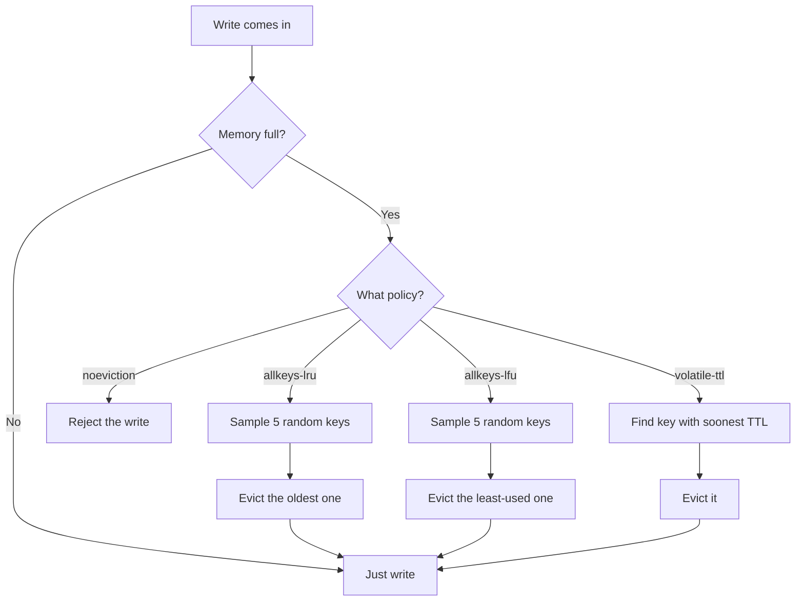
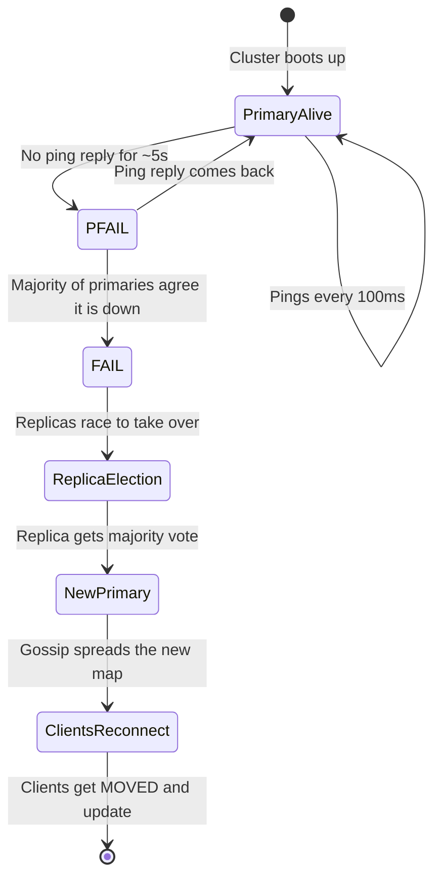
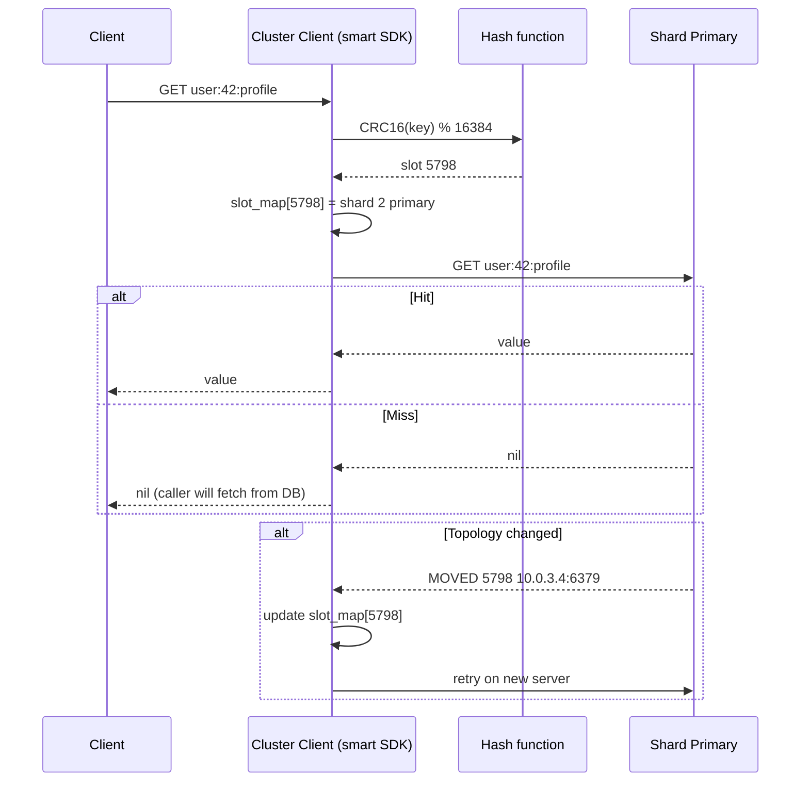


## The scene

You walk into the second interview round. The interviewer points at the whiteboard and says:

> *"You have used Redis before, right? Good. Now design it. Not one Redis server. The whole cluster. How does the cluster find a key? What happens when a server dies? How do you add a new server without taking the system down?"*

They lean back and wait.

This is the question that separates two kinds of candidates. The first kind treats Redis like a magic box. They say *"Redis stores keys in memory"* and stop. The second kind treats Redis like a distributed system. They talk about how many computers share the work, how they find each other, and what happens when one of them dies.

If you open with *"Redis stores key-value pairs in memory"* you have already lost ground. The interviewer wants the cluster story. Sharding. Replication. Failover. Resharding.

A cache is also a tool that you will use again and again in other system designs. URL shorteners use it. News feeds use it. Autocomplete uses it. So you will be asked this question, or something close to it, more than once.

We will walk this from a small cache for a startup to a giant cache for a company with millions of users. At every step we name what breaks first, then add the smallest fix that solves it.

---

## A few words you will see a lot

Before we start, here are some terms in plain language. If you already know them, skip ahead.

- **Cache.** A fast store that keeps copies of data so you do not have to ask the slow database every time. Think of a sticky note on your monitor versus walking to the file cabinet.
- **Key-value store.** A simple kind of database. You ask for a key like `user:42:name`, you get back a value like `"Alice"`. That is it. No tables, no joins.
- **In-memory.** Stored in RAM, not on disk. RAM is about 1000x faster than disk, but it loses everything when the power goes out.
- **Shard.** One slice of the data. If your cluster has 12 shards, each shard holds about 1/12 of the keys.
- **Primary and replica.** The primary is the main copy. The replica is a backup copy that follows the primary. If the primary dies, the replica takes over.
- **Consistent hashing.** A way to assign keys to servers so that adding or removing one server only re-shuffles a small fraction of keys, not all of them.
- **Eviction.** When the cache is full and you need to throw out old keys to make room for new ones.
- **TTL (time-to-live).** A timer on a key. After the timer runs out, the key is gone.

That is enough to start.

---

## Step 1: Ask the right questions

Before you draw anything, sit for five minutes. Write down questions you would ask the interviewer.

A good answer here is not "ten questions about every edge case." It is the small handful of questions that change the design if answered differently.

<details markdown="1">
<summary><b>Show: 8 questions that matter</b></summary>

1. **How strict is "fresh"?** If I write a value and immediately read it back, do I have to see the new value? Or is it okay to see the old value for a moment? *(Most caches are okay with "eventually fresh." If the interviewer says "must always be fresh," you are now building a database, not a cache. Whole shape changes.)*

2. **What happens on restart?** If a server reboots, do we lose the data, or do we want it back? *(Memcached loses everything. Redis can save to disk. The answer decides if we need persistence.)*

3. **How big are the values? What operations?** Are values small (under 1 KB) or huge (multi-MB)? Just simple get and set? Or do we need lists, sets, sorted sets, pub/sub? *(Memcached is just simple keys. Redis has many data structures. This changes the API surface.)*

4. **How much traffic?** Operations per second? Total data size? Read-to-write ratio? *(Without numbers we cannot size the cluster. A common answer: 1 million operations per second, 1 TB of data, 10 reads per 1 write.)*

5. **What happens when memory is full?** Throw out old keys (LRU)? Reject new writes? Use only TTL? *(This is a product question. The wrong choice silently breaks the app.)*

6. **One region or many?** Just one data center, or also Europe and Asia? *(Cross-region caching is unusual. Most teams keep caches in one region and let the database handle the other regions. Confirm.)*

7. **Smart client or proxy?** Do clients know which server has which key (smart client)? Or do they talk to a proxy that figures it out? *(Redis uses smart clients. Memcached often uses a proxy. Both work, different trade-offs.)*

8. **How many failures must we survive?** One server down without losing data? Two? *(This drives how many replica copies we keep per shard.)*

A candidate who only asks "how many ops per second" and "how much data" missed the three important ones: freshness, persistence, eviction. Those are what the interviewer wants to hear.

</details>

---

## Step 2: How big is this thing?

Let's say the interviewer gave us these numbers:

- 1 million operations per second on a normal day, 3 million at peak
- 1 TB of cached data
- 10 reads per 1 write
- Average value size: 1 KB
- Average key size: 50 bytes
- Target: P99 latency under 5 ms in the same region
- Survive one server failure per shard without losing data

Work out these on paper before peeking:

1. Reads per second and writes per second at peak
2. Network bandwidth at peak
3. Memory per server in a 6-server cluster (with 2 copies of data)
4. Memory per server in a 12-server cluster
5. How many TCP connections do we have if 1000 app servers each open 50 connections?

<details markdown="1">
<summary><b>Show: the math</b></summary>

**Reads and writes at peak.** 3 million ops/sec with 10:1 read-to-write:

- Reads: about 2.7 million per second
- Writes: about 300 thousand per second

One Redis server tops out around 100K-200K ops/sec on simple get/set. (Higher with pipelining. Pipelining means batching many commands together on the wire to save round trips. Lower with complex commands.) So we need at least 15-30 servers to handle 3M ops/sec before we even add safety headroom.

**Network bandwidth at peak.** Each op moves about 50 bytes key + 1 KB value + 20 bytes protocol overhead = around 1.1 KB. 3M times 1.1 KB = about 3.3 GB/sec across all servers. Across 30 servers, that is 110 MB/sec per server. A 25 Gbps network card has about 3 GB/sec to spare, so this is comfortable. One thing to watch: replication doubles the write bandwidth on the primary server.

**Memory per server, 6 servers, 2 copies.** 1 TB times 2 copies = 2 TB total. Across 6 servers = 340 GB per server. Doable on the right machine (an r7g.16xlarge has 512 GB). But if one server dies, 170 GB of primary data is briefly unavailable. Big blast radius.

**Memory per server, 12 servers, 2 copies.** 2 TB total / 12 = 170 GB per server. Smaller blast radius. An r7g.8xlarge (256 GB) fits with room to spare.

Plus overhead: Redis itself uses about 20% more RAM than the raw data, because of internal encoding, expiration metadata, and replication buffers. So budget 200 GB instances for 170 GB of dataset.

**Connections.** 1000 servers times 50 connections = 50,000 client connections. With smart clients, every client opens a connection to every shard primary. 50K times 12 = 600K connections across the cluster, about 50K per server.

Redis handles this on one event loop. 50K idle connections is fine. But each connection costs about 20 KB of buffer memory inside Redis. 50K times 20 KB = 1 GB per server just for connection state. Worth knowing.

**What the math is telling you.**

The bottleneck is per-server CPU, not memory or network. (Redis runs one main thread, so per-server CPU is limited.) The cluster size is driven by how many ops one server can handle, and how much data you are willing to lose if one server dies. Not by how much storage you need.

</details>

---

## Step 3: How do we find a key?

You have a key like `user:42:profile`. You have 12 servers. Which server has that key?

This is the central question. Three serious approaches.

<details markdown="1">
<summary><b>Show: compare three ways to assign keys</b></summary>

| Way | How it works | Cost to add or remove a server | How even is the spread? |
|-----|-------------|-------------------------------|-------------------------|
| **Modulo hashing** | `server = hash(key) % N` | Disaster. Going from 6 to 7 servers re-shuffles about 6/7 of all keys. | Perfectly even. |
| **Consistent hashing** | Put keys and servers on a ring. Key goes to the next server clockwise. | About 1/N of keys move when you add one server. | Uneven with few servers. Fix with virtual nodes. |
| **Rendezvous (HRW)** | For each key, score every server. Highest score wins. | About 1/N of keys move. Same as consistent hashing. | Even by design. |

> **Why consistent hashing and not modulo?** With modulo, adding one new server changes the assignment of almost every key. All those keys then miss the cache, slamming the database. With consistent hashing, only about 1/N of keys move when you add a server. That is the whole reason it exists.

**Consistent hashing with virtual nodes is the standard answer.**

The simple ring (one position per server) gives uneven spread. With 6 servers, one server might own 30% of the ring and another 5%. The fix: give each real server many (100-200) virtual positions on the ring. With 1200 virtual nodes for 6 servers, the spread becomes close to uniform.

**Redis Cluster uses a variant: 16384 fixed slots.** Each key hashes to `CRC16(key) mod 16384`. Slots are assigned to servers. Adding a server moves some slots. Mathematically the same as 16384 virtual nodes, but with explicit slot ownership.

**Memcached takes a different path.** The protocol has no built-in clustering. The client library does the work. Clients use libketama (consistent hashing with virtual nodes) to pick a server. No server-side rebalancing. If you change the client config, keys move and you accept the cache miss storm.

### A simple ASCII picture of the ring

```
              slot 0 / 16384
                    .
            .               .
        S3 vnode A       S1 vnode A
       .                         .
      .                           .
    S2 vnode B                  S2 vnode A
      .                           .
       .                         .
        S3 vnode B       S1 vnode B
            .               .
                    .
              slot 8192

  Each S1, S2, S3 has many vnodes scattered around.
  A key hashes to a point on the ring.
  Walk clockwise to find the next vnode. That server owns the key.
```

### Migration math

Say we have 12 servers, 85 GB per server. We add server 13. With consistent hashing, about 1/13 of keys move, spread across the 12 old servers:

- Each old server sends about 7 GB to server 13
- Server 13 receives about 85 GB total
- At 100 MB/sec migration rate (throttled so we do not saturate the network), 85 GB / 100 MB/sec = about 14 minutes

**What happens to lookups for keys being moved?** Redis Cluster uses `ASK` redirects. If a key is in flight, the client first tries the old server. The old server says `ASK` and points to the new server. Client retries on the new server. After migration is done, the old server responds with `MOVED` for that whole slot, and the client updates its slot map.

**Honest trade-off.** Consistent hashing reduces movement. It does not eliminate it. A dumb client that ignores `MOVED` and `ASK` and just retries on the old server will see cache misses (and may fall through to the database) during the migration window. Migration is not free. It is just contained.

</details>

---

## Step 4: Draw the system

Some boxes are missing. Try to fill in the five `[ ? ]` spots before peeking. Hint: how does the client find a server? How do servers find each other? What sits next to each primary for safety? What runs across all servers to keep the cluster healthy?

```
              +----------------------+
              |  Application Server   |
              |   +---------------+   |
              |   |   [ ? ]       |   |  (knows the cluster layout,
              |   +-------+-------+   |   picks the right server)
              +-----------+-----------+
                          |
                          v
        +----------------------------------------+
        |          [ ? ]                          |  (decides which server
        |                                         |   owns a given key)
        +-----+--------------+-------------+------+
              |              |             |
              v              v             v
       +------------+ +------------+ +------------+
       |  Shard 1   | |  Shard 2   | |  Shard 3   |
       |            | |            | |            |
       | +--------+ | | +--------+ | | +--------+ |
       | |Primary | | | |Primary | | | |Primary | |
       | +---+----+ | | +---+----+ | | +---+----+ |
       |     | repl | |     |      | |     |      |
       | +---v----+ | | +---v----+ | | +---v----+ |
       | | [ ? ]  | | | | [ ? ]  | | | | [ ? ]  | |  (takes over if primary dies)
       | +--------+ | | +--------+ | | +--------+ |
       +------------+ +------------+ +------------+
              ^             ^             ^
              +-------------+-------------+
                            |
                   +--------v--------+
                   |    [ ? ]        |  (every server talks to every other
                   |                 |   server, sharing health info)
                   +-----------------+
```

<details markdown="1">
<summary><b>Show: the full architecture</b></summary>

```
              +----------------------------+
              |  Application Server         |
              |   +-------------------+    |
              |   |  Smart Client Lib  |    |  Caches slot-to-server map.
              |   |  (Lettuce, Jedis,  |    |  Picks server by
              |   |   redis-py-cluster)|    |  CRC16(key) % 16384.
              |   +---------+---------+    |  Reacts to MOVED/ASK.
              +-------------+--------------+
                            |
                            v
        +----------------------------------------------+
        |  Hash Slot Ring (16384 fixed slots)           |
        |  slot = CRC16(key) % 16384                    |
        |  slot -> owning server, kept in sync via      |
        |  gossip                                       |
        +----+-----------------+----------------+-------+
             |                 |                |
             v                 v                v
      +--------------+   +--------------+   +--------------+
      |  Shard 1     |   |  Shard 2     |   |  Shard 3     |
      |  slots       |   |  slots       |   |  slots       |
      |  0-5460      |   |  5461-10922  |   |  10923-16383 |
      |              |   |              |   |              |
      | +----------+ |   | +----------+ |   | +----------+ |
      | | Primary  | |   | | Primary  | |   | | Primary  | |
      | | takes    | |   | |          | |   | |          | |
      | | writes   | |   | |          | |   | |          | |
      | +----+-----+ |   | +----+-----+ |   | +----+-----+ |
      |      | async  |   |      |      |   |      |      |
      |      | repl   |   |      |      |   |      |      |
      | +----v-----+ |   | +----v-----+ |   | +----v-----+ |
      | | Replica  | |   | | Replica  | |   | | Replica  | |
      | | can      | |   | |          | |   | |          | |
      | | serve    | |   | |          | |   | |          | |
      | | reads    | |   | |          | |   | |          | |
      | | promoted | |   | |          | |   | |          | |
      | | on fail  | |   | |          | |   | |          | |
      | +----------+ |   | +----------+ |   | +----------+ |
      +--------------+   +--------------+   +--------------+
             ^                 ^                ^
             +-----------------+----------------+
                               |
                      +--------v---------+
                      |  Gossip Protocol  |  Every server pings a few
                      |  (cluster bus on  |  peers per second.
                      |   a separate      |  Shares:
                      |   TCP port)       |   - who is alive
                      |                   |   - slot ownership map
                      |                   |   - epoch numbers
                      |                   |   - failover votes
                      +-------------------+
```

**What each piece does, in one line each:**

- **Smart Client Library.** Holds the slot map locally. Sends each command directly to the right primary. If the topology changed and the client targets the wrong server, the server responds `MOVED <slot> <new_address>` and the client updates its map. `ASK` is the same idea but only for the duration of a slot migration.

- **Hash Slot Ring.** 16384 fixed slots. Each slot owned by exactly one primary at a time. The slot map is replicated across all servers via gossip.

- **Primary per shard.** The single writer for its slot range. Holds the real data in memory.

- **Replica per shard.** An async copy. Can serve reads (slightly stale). Promoted to primary if the primary dies.

- **Gossip protocol.** The cluster's nervous system. Every server sends a `PING` to a small random subset of peers every 100ms, sharing its view of the topology. After a few rounds, every server converges on the same view. Detects failures within a few seconds. Coordinates failover votes.

**For Memcached, the picture is simpler.** No built-in cluster. No gossip. No replication. The "cluster" lives only in the client library, which consistent-hashes across a static list of servers. If a server dies, clients notice the broken connection, mark it dead, and re-hash to the survivors. No automatic failover. This is on purpose. Memcached likes simplicity and assumes the application can handle any key disappearing.

</details>

---

## Step 5: When memory fills up

The cache fills up. Now what?

There are two different things people confuse: **expiration** (TTL ran out) and **eviction** (memory is full, throw something out even if its TTL is still good).

Here is a flowchart of the eviction decision:



<details markdown="1">
<summary><b>Show: expiration vs eviction, and why "approximated LRU"</b></summary>

### Expiration (TTL)

`SET key value EX 60` gives the key a 60-second TTL. Two ways the key gets removed:

- **Passive.** When a client tries to read the key, Redis notices it has expired and deletes it before responding. Cheap. But if no one ever reads it, the expired key sits in memory forever.
- **Active.** A background job samples 20 random TTL keys every 100ms. If more than 25% are expired, it samples again right away. This keeps memory close to actual live keys without scanning the whole keyspace.

Both run together.

### Eviction policies (when `maxmemory` is hit)

| Policy | What it does |
|--------|-------------|
| `noeviction` | Reject writes with an error. Reads still work. Application must handle the error. |
| `allkeys-lru` | Evict the approximate least-recently-used key from anywhere. |
| `volatile-lru` | Evict the approximate LRU key, but only from keys with a TTL. |
| `allkeys-lfu` | Evict the approximate least-frequently-used key (counts access frequency over a decay window). |
| `volatile-lfu` | Same as above but only TTL keys. |
| `allkeys-random` | Evict a random key. |
| `volatile-random` | Evict a random key from those with TTL. |
| `volatile-ttl` | Evict the key with the soonest TTL. |

**How to choose:**

- **Pure cache:** `allkeys-lru` or `allkeys-lfu`. You do not care about specific keys; keep the hot ones.
- **Mixed cache + counters or locks:** `volatile-lru`. Put TTLs on cacheable keys. Leave critical keys (counters, locks) without TTL so eviction skips them.
- **No eviction allowed:** `noeviction` with strict monitoring. Used when the cache is the only copy of the data, which you should usually avoid.

### What is "approximated LRU" and why?

True LRU needs a doubly-linked list of every key. Every access moves the touched key to the front of the list. With 100M keys and millions of ops/sec, the cost hurts: about 16 bytes per key just for prev/next pointers, plus cache-unfriendly random pointer chasing.

Redis approximates. Sample 5 random keys (configurable, can go up to 10) and evict the oldest of the sample. With a sample size of 10, the result is statistically very close to true LRU at a tiny fraction of the cost.

> **Why this matters:** with 100M keys, no linked list saves 1.6 GB of RAM per server. That is a real number.

How "oldest" is tracked: every key has a 24-bit "last access time" field in its object header, updated on read or write. Sampling reads this field. No linked list, no pointer overhead.

Trade-off: sometimes evicts a not-quite-oldest key. For cache use cases this is invisible.

LFU is similar: each key has a small counter that goes up on access and decays over time, so old-but-popular keys do not stay sticky forever.

</details>

---

## Step 6: When a server dies

Each primary has one or more replicas. When the primary dies, a replica takes over. How does that happen?

Here is a state diagram of the failover dance:



<details markdown="1">
<summary><b>Show: async vs sync, detection, election, and the "old primary returns" problem</b></summary>

### Async replication (default)

Primary handles the write, replies to the client, and queues the write for replication. Replicas pull from the primary's replication buffer and apply.

- **Latency:** write returns as soon as the primary commits to memory. Replicas catch up in milliseconds under normal conditions.
- **Data loss window:** the writes still in the buffer that have not reached the replica. Under normal load, just a handful of operations.
- **If the primary dies before replication catches up, those writes are lost.**

This is the right default for cache workloads. The cache is not the only copy of the data.

### Synchronous replication (the `WAIT` command)

After a write, the client can issue `WAIT <num_replicas> <timeout_ms>`. This blocks until that many replicas have acked the previous writes, or the timeout fires.

- **Latency:** bounded by the slowest of the N replicas. One same-AZ replica adds about 1ms. Cross-AZ adds 5-10ms.
- **Data loss window:** zero if you wait for all replicas. But `WAIT` is not true synchronous semantics; if the primary crashes between the write and the WAIT, things get fuzzy.

Sync replication is rare for caches. Use it only for the small set of writes that cannot tolerate loss (a financial counter, a deduplication marker).

### How do we detect the primary is down?

Gossip-based detection. Each server pings a few random peers every 100ms. If a server fails to reply for about 5 seconds, the pinging server marks it `PFAIL` (possibly failed) and gossips this. Once a majority of primaries agree, the state becomes `FAIL` (cluster-wide consensus that it is down).

> Lower threshold = faster failover but more false positives during network blips. Higher = slower recovery. Default 5s is usually fine.

### Leader election

When a primary is declared `FAIL`, its replicas race to take over.

1. Each replica waits a small delay proportional to its replication lag (the most-current replica goes first).
2. The replica asks all other primaries for votes: "should I take over for failed primary X?"
3. Other primaries vote yes if they agree X is `FAIL` and the requesting replica is the only one asking in this epoch (term number).
4. With a majority vote, the replica promotes itself, claims the slot range, and gossips the new layout.
5. Clients learn the new primary via `MOVED` redirects on the next request.

Total failover time: usually 5-15 seconds. Most of that is the detection window; the actual promotion takes under a second.

Memcached has no failover. Server dies, the client library notices, hashes to remaining servers. Keys on the dead server are simply gone until it comes back.

### The "old primary returns" problem

The old primary was network-partitioned, not actually dead. Now it can talk again. The cluster has already promoted a replica.

On its first gossip exchange, the returning server learns its epoch is stale. It demotes itself to a replica of the new primary, throws away its in-memory state, and syncs from the new primary. Any writes accepted during the partition window are lost.

This is the classic CAP trade-off: the cluster chose availability (let the new primary take writes during the partition) and accepts that writes on the old primary cannot be reconciled.

To make this smaller: use `min-replicas-to-write` so a primary refuses writes if it cannot reach at least one replica. Trades a bit of availability for less data loss. Some teams set this. Most caches accept the small loss window.

</details>

---

## Step 7: A GET, drawn end to end

Here is a Mermaid sequence of a simple GET request:



---

## Follow-up questions

Try to answer each in 2 or 3 sentences before opening the solution.

1. **Hot key.** One key gets 500,000 requests per second. It lives on one shard. That shard's CPU pegs at 100%. What do you do?

2. **Big key.** One key holds a sorted set with 2 million entries. A single `ZRANGE 0 -1` stalls the event loop for 800ms. Every other operation queues behind it. How do you prevent this, and how do you recover?

3. **TTL stampede.** You set a TTL of 60 seconds on a million keys at once (bulk import). 60 seconds later, the application's P99 latency doubles. Why? Fix it without changing the TTL.

4. **Persistence.** When should you use RDB? When AOF? When both? When neither? What does each cost in latency and data loss window?

5. **Resharding.** Six servers growing to twelve. How do you do this without dropping operations per second or losing data? How long does it take?

6. **Network partition.** Two servers in one data center can talk to each other but not to the rest of the cluster. What happens? Will the partition try to elect its own primaries?

7. **Memory fragmentation.** Redis reports `used_memory_rss / used_memory = 1.8`. Explain what that means in plain words, and what you would do about it.

8. **Cache stampede.** A popular key expires. 10,000 concurrent requests miss, all hit the database. The database melts. How do you prevent this in the cache layer?

9. **Read-after-write surprise.** A user writes `SET balance 100`, immediately reads back, and sees the old value. Why? When can this happen in a cluster that uses replicas for reads?

10. **Hit rate crash.** Cache hit rate dropped from 95% to 60% overnight. No deploys happened. What is your investigation path?

---

## Related problems

- **[URL Shortener (001)](../001-url-shortener/question.md).** Uses this cache heavily on the redirect path. The hot key problem there is the same one analyzed here.
- **[News Feed (002)](../002-news-feed/question.md).** The timeline store is a Redis cluster. Sorted-set encoding, hot-key replicas, cold-user eviction all come from this design.
- **[Typeahead Autocomplete (005)](../005-typeahead-autocomplete/question.md).** The prefix index sits in the same kind of distributed cache. The big-key problem is acute there (top prefixes hold large suggestion lists).


<div class="pr-solution-divider"></div>


## Solution: Distributed Cache (like Redis or Memcached)

### The short version

A distributed cache is a fast in-memory key-value store split across many servers. The data is **sharded** (each server holds a slice) and **replicated** (each shard has a backup copy). A few hard problems are hiding inside:

- How to find a key when servers come and go.
- How to keep replicas close enough to the primary so failover does not lose much.
- How to throw out old data gracefully when memory fills up.
- How to survive the few keys that get all the traffic.

The standard shape is **consistent hashing** (or fixed hash slots) across a cluster of **shards**. Each shard has one **primary** and one or more **replicas**. The replicas copy from the primary in the background. A **gossip protocol** runs across all servers, sharing health and topology info.

Clients are smart. They cache the slot-to-server map in memory and adjust when servers redirect them. Eviction uses **approximated LRU** or **LFU** because true LRU costs too much memory. Persistence is optional and almost always trades latency for durability.

The interesting engineering happens at the edges: the **hot key** that breaks one shard (fixed with in-process caches and replica reads), the **big key** that stalls the event loop (fixed by capping value size at write time), and the **resharding** that has to happen without dropping traffic (incremental slot migration with `ASK` redirects).

---

### 1. The clarifying questions

Covered in `question.md`. The eight that matter: consistency, persistence, value size, traffic shape, eviction, multi-region, client topology, failure tolerance.

The classic miss is skipping persistence and consistency. They change the design fundamentally.

---

### 2. The math, in plain numbers

| Item | Value |
|------|-------|
| Sustained ops/sec | 1 million |
| Peak ops/sec | 3 million |
| Read:write ratio | 10:1 |
| Working set | 1 TB |
| Average value | 1 KB |
| Single-node Redis ceiling | ~150K ops/sec mixed get/set |

What this tells us:

- A 6-shard cluster is too small for peak. A 12-shard cluster is comfortable.
- With 2 copies of the data (RF=2), that is 24 servers total.
- Per server: about 170 GB of primary data, plus replication buffers and connection state, plus 20% encoding overhead. 256 GB machines fit with headroom.
- Network: about 110 MB/sec per server. Well under a 25 Gbps card.
- Connections: about 50K per server from 1000 application servers. Buffer cost about 1 GB per server.

The bottleneck is **per-shard CPU** (single event loop), not memory or network. Cluster size is driven by per-shard ops/sec and blast radius, not raw storage.

---

### 3. The API

Two things to design: the wire protocol and the client-facing semantics.

#### The core commands (Redis style)

| Command | What it does |
|---------|-------------|
| `GET key` | Return value or nil. O(1). |
| `SET key value [EX seconds] [NX\|XX]` | Set with optional TTL. NX = only if missing. XX = only if exists. O(1). |
| `MGET key1 key2 ...` | Batch get. Note: all keys must be on the same shard, or the client has to fan out. |
| `MSET k1 v1 k2 v2 ...` | Batch set. Same shard constraint. |
| `DEL key` | Delete. Returns 1 if existed, 0 otherwise. |
| `EXPIRE key seconds` | Add TTL to an existing key. |
| `TTL key` | Return remaining TTL. -1 means no TTL, -2 means key does not exist. |
| `INCR key` / `INCRBY key n` | Atomic integer increment. Foundation for counters. |
| `EXISTS key` | Cheap existence check. |
| `SCAN cursor [MATCH pattern]` | Cursored iteration. Use this. **Never use `KEYS *`** in production. |

Plus the data-structure commands: `HSET`/`HGET` (hash), `LPUSH`/`LRANGE` (list), `SADD`/`SMEMBERS` (set), `ZADD`/`ZRANGE` (sorted set), `XADD`/`XREAD` (streams). Each is O(1) or O(log N) per element. But operations on entire structures (`SMEMBERS` on a 1M-element set) are O(N) and block the event loop.

**Memcached is a strict subset:** `get`, `set`, `add`, `replace`, `delete`, `incr`, `decr`, `cas` (check-and-set). That is it. No data structures, no scripting, no pub/sub.

#### Cluster-aware semantics

- **Hash tags.** `SET {user:42}:profile ...` and `SET {user:42}:settings ...` hash to the same slot because only the text inside `{...}` is hashed. This lets multi-key operations like `MGET` or `MULTI`/`EXEC` stay on one shard.
- **Multi-key constraint.** `MGET k1 k2` and transactions only work if all keys are on the same shard. The client either uses hash tags or fans out and merges on its side.
- **Pipelining.** Send N commands without waiting for responses, then read N responses. Cuts round-trip cost from N to 1. Critical for throughput. A client can push 500K ops/sec with aggressive pipelining where without it gets 50K.

#### Errors clients must handle

| Response | Meaning | Client action |
|----------|---------|---------------|
| `MOVED <slot> <host:port>` | Slot now lives on another server. | Update slot map. Retry on the new server. |
| `ASK <slot> <host:port>` | Slot is migrating; this specific key is on the new server temporarily. | Send `ASKING` then the command to the new server. Do not update slot map yet. |
| `CLUSTERDOWN` | Cluster is unhealthy (some slots have no owner). | Back off, retry, alert the operator. |
| `LOADING` | Server is loading data from disk after restart. | Retry after a delay. |
| `READONLY` | Tried to write to a replica. | Update slot map. Write to the primary. |
| `OOM` | Eviction disabled and memory is full. | Application must handle the rejection. |

---

### 4. The data model and how memory is laid out

The conceptual model is a flat hash table: keys to values. The interesting engineering is how Redis encodes values to save memory.

**Object header.** Every Redis value has a small header: type tag, encoding, reference count, and a 24-bit "last access time" used for LRU/LFU sampling. About 16 bytes per object.

**Encoding tricks.** Redis picks an encoding based on size and content:

| Type | Small encoding | Large encoding | Switch threshold |
|------|---------------|----------------|------------------|
| String | `embstr` (one allocation, max 44 bytes) | `raw` (separate allocation) | 44 bytes |
| String of small integer | `int` (value sits in the header pointer) | `embstr`/`raw` | Not an integer |
| Hash | `listpack` (flat array of key-value pairs) | `hashtable` | 128 entries or any field > 64 bytes |
| List | `listpack` | `quicklist` (linked list of listpacks) | 128 entries or any element > 64 bytes |
| Set of integers | `intset` (sorted dense array) | `hashtable` | 512 entries or any non-integer |
| Sorted set | `listpack` | `skiplist + hashtable` | 128 entries or any element > 64 bytes |

> **Why this matters.** A 10-field hash stored as `listpack` takes about 200 bytes. The same hash stored as `hashtable` takes about 600 bytes. At 100M small hashes that is 40 GB saved just by staying in `listpack`.

The trade: operations on `listpack` are O(N) (linear scan). Once the threshold trips and the encoding switches to `hashtable`, operations become O(1) but memory triples. Redis picks the encoding at write time and only upgrades (never downgrades).

**For Memcached:** simpler. A **slab allocator** with fixed-size slabs (64 B, 128 B, 256 B, etc.). A 100-byte value goes into a 128-byte slab. Memory-efficient if value sizes cluster nicely. Wasteful if not. The "calcification" problem: once slabs are allocated to a size class, they cannot easily be reassigned. If traffic shifts from many small values to fewer large values, small slabs sit empty.

**Expiration metadata.** Keys with TTL have an entry in a secondary "expires" dictionary, mapping key to expiration timestamp. Active expiration samples from this dictionary, not from the main keyspace.

---

### 5. The core algorithm: consistent hashing + replication

#### Consistent hashing with hash slots

Redis Cluster uses **16384 fixed slots**. Big enough that slots can be assigned at fine granularity (each shard owns 16384/N slots). Small enough that the slot map is a manageable size to gossip (16384 bits = about 2 KB).

```
slot = CRC16(key) & 16383
server = slot_map[slot]
```

The slot map is replicated across all servers via gossip. Clients also cache it. When the map changes (a shard was added, removed, or migrated), clients learn through `MOVED` redirects on the next operation that targets the wrong server.

The hash ring, drawn flat as fixed slots:

```
   slot:    0        4096       8192      12288     16383
            |---------|----------|----------|---------|
   owner:   Shard 1   Shard 2    Shard 3    Shard 4

   key "user:42:profile"
     -> CRC16("user:42:profile") & 16383 = 5798
     -> slot 5798 lives in [4096..8191] -> Shard 2 primary

   key "{user:42}:settings"
     -> CRC16("user:42") & 16383 = 5798     (hash tag forces same slot)
     -> also Shard 2 primary (sits next to profile)
```

#### A GET, end to end

```
  +------------+                                  +--------------+
  |  App + SDK |-- 1. compute slot -------------->|  slot_map    |
  +-----+------+                                  +------+-------+
        |                                                |
        | 2. open TCP to owning primary (cached)         |
        v                                                v
  +-----------------------------------------------------------+
  |  Shard 2 primary                                          |
  |   - looks up key in hash table                            |
  |   - if TTL expired, deletes and returns nil               |
  |   - updates lru / lfu counter                             |
  |   - returns value                                         |
  +-----------------------------------------------------------+
        |
        | on topology change:
        |   responds MOVED 5798 10.0.3.4:6379
        |   SDK updates slot_map[5798] = 10.0.3.4:6379
        |   retries on new server (one extra round-trip, once)
        v
  +------------+
  |  App + SDK |
  +------------+
```

**Why CRC16 and not a fancier hash?** CRC16 is fast (a few cycles per byte) and has well-understood distribution on text keys. xxHash would be slightly faster, but the difference is nanoseconds when the rest of the op is microseconds. A historical "good enough" choice.

#### Hash tags

The hash function only hashes the text inside `{...}` if present:

```
CRC16("{user:42}:profile")  = CRC16("user:42")
CRC16("{user:42}:settings") = CRC16("user:42")
```

Both keys land on the same slot. The application uses this to colocate related keys for multi-key operations.

#### Replication protocol

Each shard has one primary and one or more replicas. Replication is async by default.

**The replication backlog.** The primary keeps a circular buffer (default 1 MB, configurable) of recent writes. When a replica connects, the primary checks if the replica's replication offset is within the backlog.

- If yes, stream forward from that offset (**partial resync**, fast, seconds).
- If no, the replica fell too far behind. The primary does a **full resync**: serializes the entire dataset (RDB snapshot), ships it, then streams new writes. Slow (depends on dataset size; ~30 GB takes a few minutes).

> Size the backlog so brief network blips do not trigger a full resync. 1 MB is too small for most production workloads. 256 MB or even 1 GB is common.

**Replica reads.** Replicas serve reads if the client issues `READONLY` on connect. Application accepts that reads may be slightly stale (usually milliseconds; can spike under replication lag).

**WAIT for sync writes.** A client can issue `WAIT <N> <timeout>` after a write to block until N replicas have acked. This is best-effort, not true synchronous replication. If the primary crashes during the wait, the client gets a timeout but the write may or may not have made it.

#### Failover

When gossip detects a primary down (threshold around 5 seconds), replicas of that primary race to take over:

1. Each replica computes its readiness based on replication lag. Most-current goes first.
2. After a small delay, the replica increments its `currentEpoch` and broadcasts a vote request.
3. Other primaries vote yes if (a) they also see the old primary as failed, (b) they have not voted yet in this epoch, and (c) the requester is a real replica of the failed primary.
4. With a majority vote, the replica promotes itself.
5. The promoted server claims the slot range and gossips the new ownership.
6. Other replicas of the old primary reattach to the new primary.

Raft-like but not exactly Raft. A Redis-specific protocol tuned for fast cache failover. Typical failover completes in 5-15 seconds end to end.

**Redis Sentinel** (not Redis Cluster) is a separate failover mechanism for non-clustered deployments. A small set of Sentinel processes watches a primary-replica pair and triggers failover when the primary fails. Same idea, different protocol. Used when you want high availability but not horizontal sharding.

---

### 6. The architecture, drawn out

```
                +-----------------------------------------+
                |           Application Tier              |
                |  +--------+ +--------+ +--------+       |
                |  | App 1  | | App 2  | | App N  |       |
                |  | +----+ | | +----+ | | +----+ |       |
                |  | |SDK | | | |SDK | | | |SDK | |       |  Smart client.
                |  | |+LRU| | | |+LRU| | | |+LRU| |       |  Holds slot map.
                |  | +-+--+ | | +-+--+ | | +-+--+ |       |  Optional in-process
                |  +---+----+ +---+----+ +---+----+       |  LRU for hot keys.
                +------+----------+----------+------------+
                       |          |          |
                       +----------+----------+
                                  |
            +---------------------+--------------------------+
            |                     |                          |
            v                     v                          v
       +----------+         +----------+               +----------+
       | Shard 1  |         | Shard 2  |   .  .  .     | Shard 12 |
       | slots    |         | slots    |               | slots    |
       | 0-1364   |         | 1365-    |               | 15020-   |
       |          |         | 2729     |               | 16383    |
       | +------+ |         | +------+ |               | +------+ |
       | |Prim. | |         | |Prim. | |               | |Prim. | |
       | |256GB | |         | |      | |               | |      | |
       | +--+---+ |         | +--+---+ |               | +--+---+ |
       |    | async         |    |     |               |    |     |
       |    | repl          |    |     |               |    |     |
       | +--v---+ |         | +--v---+ |               | +--v---+ |
       | |Repl. | |         | |Repl. | |               | |Repl. | |
       | |same  | |         | |      | |               | |      | |
       | |AZ    | |         | |      | |               | |      | |
       | +------+ |         | +------+ |               | +------+ |
       |          |         |          |               |          |
       | +------+ |         | +------+ |               | +------+ |
       | |Repl. | |         | |Repl. | |               | |Repl. | |
       | |cross | |         | |      | |               | |      | |
       | |AZ    | |         | |      | |               | |      | |
       | +------+ |         | +------+ |               | +------+ |
       +----+-----+         +----+-----+               +----+-----+
            |                    |                          |
            +--------------------+--------------------------+
                                 |
                       +---------v----------+
                       |  Cluster Bus        |  Separate TCP port per server.
                       |  (gossip)           |  Every server pings ~5 peers
                       |                     |  every 100ms. Shares:
                       |                     |   - PING/PONG
                       |                     |   - liveness state
                       |                     |   - slot ownership
                       |                     |   - epoch numbers
                       |                     |   - failover vote requests
                       +---------------------+

       Per server, out of band:
       +---------------------------+
       |  Disk: RDB snapshot file  |   Periodic checkpoint of the dataset.
       |  (optional)               |   Used for backup and replica seeding.
       +---------------------------+
       +---------------------------+
       |  Disk: AOF append log     |   Every write appended.
       |  (optional)               |   Used for durability.
       +---------------------------+
       +---------------------------+
       |  Monitoring agent         |   Scrapes INFO, slowlog, MEMORY USAGE.
       +---------------------------+
```

**Why each piece:**

- **Smart client with optional in-process LRU.** First line of defense against hot keys. A 1000-entry process-local LRU with a 5-second TTL turns 500K req/s on one key into 200 req/s reaching the cluster.
- **12 shards.** Sized so per-shard ops/sec stays comfortably under 200K and per-shard memory under 200 GB primary.
- **Replicas: one same-AZ, one cross-AZ.** Same-AZ catches up in under 1ms (low lag, used for failover). Cross-AZ protects against AZ failure but lags more.
- **Gossip on a separate port.** Cluster bus traffic (port 16379 by default, data port + 10000) does not compete with client traffic. Bus messages are small (about 100 bytes per ping); aggregate gossip is a few MB/sec across the cluster.
- **Disk persistence is optional.** Most caches do not persist. Some do, to seed new replicas faster or to survive a full cluster restart without losing the working set.

---

### 7. Read and write paths

#### Write path: `SET key value EX 60`

1. Application calls `client.set("user:42:profile", v, ex=60)`.
2. Client computes `slot = CRC16("user:42:profile") & 16383`. Looks up `slot_map[slot]` to find the primary.
3. Client sends SET over its persistent TCP connection to that primary.
4. Primary parses the command, validates key length, applies to its in-memory hash table, sets TTL in the expires dictionary. Updates the `lru` field on the object.
5. Primary appends the command to its replication backlog (and to the AOF file, if AOF is enabled).
6. Primary returns `+OK`. Latency so far: about 0.3 ms in the same data center.
7. In the background, replicas pull from the backlog and apply. Replication lag at steady state: under 1 ms intra-AZ, about 5 ms cross-AZ.
8. If `WAIT 1 100` follows, the primary blocks until at least one replica acks (or 100ms timeout). Most workloads do not use WAIT.

P99 target: 5 ms. Under load, the bottleneck is event-loop contention on the primary (single-threaded). The mitigation is keep keys spread evenly and never let big keys hog the event loop.

#### Read path: `GET key`

1. Application calls `client.get("user:42:profile")`.
2. Client computes the slot, looks up the primary (or a replica if `READONLY` is set on the connection).
3. Client sends GET.
4. Server looks up the key in its hash table. If the TTL has expired (passive expiration), deletes the key and returns nil.
5. Updates the `lru` field (so the key stays "young" for LRU eviction).
6. Returns the value. Latency: about 0.2 ms in the same DC.

**If the slot has moved:**

- Server returns `MOVED <slot> <new_server>`.
- Client updates its slot map and retries on the new server. One extra round-trip on the first redirected request after a topology change.

**If the slot is mid-migration:**

- Server returns `ASK <slot> <new_server>`.
- Client sends `ASKING` followed by the command to the new server. Does not update the slot map yet (migration is not complete).

**In-process LRU.** Before any of the above, the client checks its local LRU. Hit returns in microseconds. Miss falls through to the cluster.

---

### 8. Scaling: add and remove servers without downtime

#### Adding a shard (12 to 13)

1. Bring up the new primary and its replica. Empty.
2. Add them to the cluster (`CLUSTER MEET`). They appear in gossip but own no slots.
3. Plan slot migrations. To even things out, each existing shard gives about 1/13 of its slots to the new shard. 16384/13 ≈ 1260 slots to the new shard.
4. Migrate slot by slot. For each slot:
   - Mark the slot as MIGRATING on the source and IMPORTING on the destination.
   - Iterate the keys in that slot. For each, call `MIGRATE`, which copies it to the destination atomically (network ack required) and deletes it from the source.
   - During this window, the source still serves reads/writes for keys not yet moved, and responds with `ASK` redirects for keys that have moved.
   - After all keys in the slot are migrated, send `CLUSTER SETSLOT <slot> NODE <new_node>` to all primaries. They gossip the new ownership.
5. After all 1260 slots migrate, the cluster is balanced.

**Throughput cost.** Migration uses bandwidth and CPU on both source and destination. Default migration rate is a few thousand keys/sec per slot, configurable. For 100 GB per source shard moving to a new shard, expect a few hours of migration. Migration is incremental; the cluster keeps serving traffic throughout.

**Client behavior during migration.** Smart clients handle `MOVED`/`ASK` transparently. The application sees slightly higher tail latency (one extra round-trip per redirected request) but no errors. Dumb clients that ignore redirects see "cache misses" and may overload the database. Client choice matters.

#### Removing a shard (12 to 11)

1. Pick the shard. Move its slots to the remaining 11 (same mechanism).
2. After migration completes, the shard owns zero slots. Shut it down.
3. Tell the cluster (`CLUSTER FORGET`). Other servers remove it from their topology.

#### Rebalancing without changing shard count

If load is uneven (some shards hotter than others), move slots between shards without adding or removing servers. Same mechanism. Useful when traffic patterns drift.

---

### 9. Reliability

#### Persistence options

| Mechanism | What it saves | Latency cost | Data loss window |
|-----------|--------------|--------------|------------------|
| **None** (default for caches) | Nothing | Zero | Everything on process restart |
| **RDB snapshot** | Point-in-time binary dump of the dataset | Brief CPU + I/O spike during snapshot. Fork-based, so 2x memory transient. | Up to the snapshot interval (typical 5 min) |
| **AOF (append-only file)** | Every write command, appended | Small per-write (depends on fsync policy) | `appendfsync always`: 0 (per-write fsync, kills throughput). `everysec`: 1 second. `no`: OS decides (seconds to minutes). |
| **RDB + AOF** | Both | AOF latency cost + RDB CPU spike | AOF window. RDB is just for faster boot. |

**When to use each:**

- **Pure cache, ephemeral data.** No persistence. The database is the source of truth. If cache restarts, repopulate on miss.
- **Cache that takes hours to warm.** RDB snapshots every 5 minutes. After restart, load the snapshot and start serving warm immediately. Acceptable loss: the last 5 minutes of cache updates, which the application will repopulate naturally.
- **Stateful Redis (Redis as primary store).** AOF with `everysec`. Up to 1 second of writes lost on crash; fine for many workloads. Combined with replicas, real-world loss is rare.
- **Strict durability.** AOF with `always`. Throughput drops about 10x. Use only for the few keys that demand it.

**For Memcached:** no persistence. Process restart = empty cache. By design. Memcached assumes a warmer cache layer or the database absorbs the warm-up traffic.

#### Failure scenarios

- **One server dies.** Replica is promoted in 5-15 seconds. Slot range unavailable for that window. Clients see errors; well-built apps treat cache errors as cache misses and fall through to the database. Database briefly sees a fraction of cache traffic for the affected slots.

- **Entire shard (primary + all replicas) dies.** Slot range unavailable until at least one replica returns or the shard is rebuilt. RF=2 (primary + 1 replica) tolerates one failure per shard. RF=3 tolerates two.

- **Network partition.** The smaller side cannot get a majority of primaries to vote on failover and refuses to promote replicas. Avoids split-brain. The larger side proceeds normally. When the partition heals, the smaller side reattaches with the larger as authoritative.

- **Cluster-wide reboot.** Without persistence, the cluster comes back empty. The application's database tier absorbs the cache-miss storm. Sizing the database to handle this is a separate decision; you do not want a 100% cache miss to take down production.

- **Slow consumer (replica falling behind).** Replication backlog overflows. Primary promotes the replica from "online" to "needs full resync." Replica requests an RDB dump and reloads. During this window the replica cannot serve reads. Mitigation: make the backlog generous, monitor replication lag, alert on saturation.

---

### 10. Observability

| Metric | What it tells you | Alert threshold |
|--------|------------------|-----------------|
| `ops_per_sec` per shard | Hot-shard detection | Shard at >2x cluster median |
| `latency.p99` per shard | Slow shard detection | P99 > 10 ms |
| `cache_hit_rate` | App using cache effectively | Below 80% (depends on workload) |
| `used_memory` vs `maxmemory` | Eviction headroom | Above 80% |
| `mem_fragmentation_ratio` (rss/used) | Memory waste from the allocator | Above 1.5 |
| `evicted_keys_per_sec` | Eviction pressure | Spike from baseline |
| `expired_keys_per_sec` | Active expiration cost | Spike (could mean TTL stampede) |
| `replication_lag_sec` | Replica freshness | Above 1 second sustained |
| `connected_clients` | Connection leak detection | Spike beyond expected |
| `slowlog_count` | Commands past threshold (default 10ms) | Any sustained appearance |
| `cluster_state` | Cluster health (ok / fail) | Not "ok" |
| `keyspace_hits` / `keyspace_misses` | Cache efficiency | Miss rate climbing |

**Slowlog deserves attention.** Every command past a threshold (default 10ms) gets logged. For a single-threaded event-loop server, a 100ms command blocks every other operation for 100ms. The slowlog names the offenders. Almost always: `KEYS *`, `SMEMBERS` on a giant set, `HGETALL` on a giant hash. Cap value sizes and avoid these commands.

**Alerting:**

- **Page on:** `cluster_state != ok`, `replication_lag > 5s`, P99 latency > 20ms, ops/sec drop > 50%.
- **Ticket on:** hit rate drop > 10 percentage points, evicted_keys spike, fragmentation > 1.8.

---

### 11. Follow-up answers

**1. Hot key (500K req/s on one key).**

Symptoms: that shard's CPU pegs. P99 for everyone on that shard climbs. Other shards fine.

Mitigations in order of cheapness:

1. **In-process LRU on application servers.** A 100-entry LRU with a 5-second TTL absorbs over 99% of the load. The hottest 1% of keys never reach the cluster. The single biggest win.
2. **Replica reads.** Direct reads for that key to replicas (using `READONLY` connections). With 2 replicas, triple the read throughput for that key. Trade: slightly stale.
3. **Key splitting (sharding the hot key).** Store the same value under N keys (`hot_key:0`, `hot_key:1`, ..., `hot_key:7`), each on a different slot. Clients pick a random suffix per request. Spreads load across 8 shards. Adds complexity: every write must update all 8 copies. Worth it only for extreme hot keys.
4. **Client-side request coalescing.** If many concurrent requests on one app server want the same expired key, only one fetches from cache+DB; the rest wait. Reduces stampede when the local LRU entry expires.

**2. Big key (sorted set with 2M entries, ZRANGE 0 -1 stalls for 800ms).**

The event loop is single-threaded. An 800ms command blocks every other operation on that server for 800ms. P99 spikes across all keys on that server.

*Prevention:*

- Cap value size at the application layer. Reject writes that would push a set past 10K entries, or split into multiple smaller sets.
- Use `SCAN`-family commands (`SSCAN`, `HSCAN`, `ZSCAN`) which return small batches per call. Many small commands instead of one giant one.
- Track key size via `MEMORY USAGE key`. Alert on outliers.

*Recovery (key already exists, currently causing pain):*

- Do not delete with `DEL`. `DEL` on a 2M-entry sorted set is itself a multi-second blocking call.
- Use `UNLINK` (Redis 4+) which moves the deletion to a background thread. Returns immediately; deallocation happens off the event loop.
- For breaking up the data: iterate with `ZSCAN` in a script, move chunks to new keys, then `UNLINK` the original.

**3. TTL stampede (1M keys all expire at 60s).**

At t=60s, the active expiration job has to delete 1M keys at once. Active expiration samples 20 keys per 100ms; if more than 25% are expired, samples again immediately. With 1M keys all expired, the job runs at full speed for many seconds. CPU dedicated to expiration; client latency spikes.

Also: at expiration, dependent application code (a "regenerate" path) fires for many keys at once, hammering the source-of-truth database.

*Fix without changing the TTL value:* add **jitter** at write time. Instead of `EX 60`, use `EX (60 + random(0, 30))`. Spreads expirations across a window. 1M keys over 30 seconds = 33K expirations/sec, which active expiration handles without spiking.

Same idea as cache stampede prevention: never let many things expire simultaneously when they were created simultaneously.

**4. RDB vs AOF.**

| Use case | Recommendation | Why |
|----------|---------------|-----|
| Pure cache, fast warm time | RDB only, snapshot every 5-15 min | Recovers a warm cache after restart in seconds. Some data loss between snapshots is acceptable. |
| Pure cache, slow warm time (hours to fill) | RDB + small AOF (or just RDB) | Same as above; RDB is enough. |
| Cache that doubles as a queue or counter store | AOF with `everysec` | Up to 1 second loss on crash. Tolerable for most use cases. |
| Source-of-truth storage | AOF with `everysec`, plus replicas | Durability without paying for `appendfsync always`. |
| Tightest durability | AOF with `always` | Each write fsyncs. Throughput drops to thousands of ops/sec per server. Use sparingly. |

**Both:** snapshot for fast recovery; AOF for the writes since the last snapshot. AOF rewrite compacts the log periodically (replays it into a new file with all redundancies removed).

**Neither (Memcached-style):** when restart latency is acceptable and the database can handle the warm-up storm. The most common production choice for true cache workloads.

**5. Resharding from 6 to 12 servers.**

1. Bring up 6 new shards (each with primary + replica). Empty and gossip in.
2. Plan slot migrations: each of the original 6 gives half its slots to one of the new shards. About 1365 slots per migration.
3. Migrate slot by slot using `MIGRATE`. Each slot's keys move atomically; clients get `ASK` redirects during migration and `MOVED` after.
4. Throttle migration so source and destination are not saturated. Target: about 5% CPU overhead.
5. Migration time depends on data per shard. For 200 GB per source shard, half (about 100 GB) moves at about 50 MB/sec sustained: about 30 minutes per source shard. In parallel across the 6 sources = about 30 minutes total.

Traffic continues throughout. Cache hit rate may dip slightly (a few percentage points) from redirect overhead on migrating slots. Application sees no errors if the client handles `ASK`/`MOVED`.

**6. Network partition (two servers isolated).**

Two servers can talk to each other but not to the other 22.

If those two are not primaries (or only one is): primaries on the other side promote replicas. The isolated servers, when they get only minority votes in any election attempt, refuse to act. Eventually they time out and shut down (the `cluster-require-full-coverage` flag affects this; defaults vary).

If both are primaries of different shards: the larger side declares them dead and promotes their replicas. The isolated primaries, unable to gather a majority for anything, refuse new writes (they cannot confirm they still own their slots safely). They accept reads of their cached data until they realize they are partitioned and stop.

When the partition heals, the isolated servers gossip in, see their epochs are stale, demote themselves to replicas of the new primaries.

**No split-brain.** A primary on the minority side that kept accepting writes would corrupt the system. The cluster prevents this by requiring majority for failovers and by old primaries deferring to higher-epoch servers on reunion.

**7. Memory fragmentation ratio 1.8.**

`used_memory_rss / used_memory = 1.8` means the OS sees Redis using 1.8x the memory Redis thinks it is using. The 80% gap is **allocator fragmentation**: jemalloc has free chunks scattered through arenas that it cannot return to the OS because of allocation patterns.

*Causes:*

- Workloads with widely varying value sizes (small and large mixed). The allocator cannot cleanly defragment.
- High churn: many small allocations and frees over time fragment the heap.
- Keys with TTLs that expire in random order leave gaps.

*Mitigations:*

- Enable active defragmentation (`activedefrag yes`). Redis runs a background defragmenter that moves objects to consolidate free space. CPU cost: about 5%.
- Restart Redis. Aggressive but effective: new process starts with a clean memory layout. Plan failover; restart the replica first, fail over, then restart the demoted primary.
- Audit value size distribution. If many sizes, consider normalizing (pad to power-of-two sizes) or using Memcached's slab approach for that specific workload.

Above 1.5 warrants investigation. Above 2.0 is action-required.

**8. Cache stampede on key expiry.**

A popular key expires. 10K concurrent requests miss and hit the database. The database melts.

*Mitigations:*

- **Probabilistic early expiration.** A small percentage of reads (well before the TTL) trigger a refresh. One client refreshes; others continue serving the old value. Spreads the refresh across the TTL window. Implementations: XFetch algorithm.
- **Request coalescing.** On miss, the client uses a per-key in-process lock. The first request fetches and populates the cache; concurrent requests for the same key wait on the lock and read the populated value. Reduces 10K DB calls to 1.
- **Stale-while-revalidate.** Serve the expired value for a short grace window while one goroutine fetches the new value asynchronously. Application tolerates a few seconds of staleness in exchange for no stampede.
- **Jittered TTLs (prevention).** As above, prevents synchronized expiration.

All four together is the standard defense. None alone is sufficient at high request rates.

**9. Inconsistent read after write.**

User issues `SET balance 100`, then `GET balance`, gets the old value.

Most common cause: the GET went to a replica that has not yet received the write. Replication lag is usually under 1 ms intra-AZ but can spike under load.

Other causes:

- The SET went to a shard that just failed over; the read goes to the new primary which has not yet received that write through replication. Failover with `min-replicas-to-write` would prevent this but at the cost of some availability.
- The client has a stale slot map and sent SET to one server and GET to another (briefly possible during resharding).

*Fixes:*

- Route both SET and GET to the primary when read-after-write consistency is required for that code path.
- Use a transaction or pipeline that keeps both commands on the same server.
- For cluster-wide guarantees, use `WAIT 1 timeout_ms` after the SET so it is acked by at least one replica before GET goes to a replica.
- Accept eventual consistency for caches (the common choice).

**10. Cache hit rate dropped from 95% to 60% overnight.**

Investigation order:

1. **Eviction pressure.** Check `evicted_keys_per_sec`. If high, the cache is full and evicting hot keys. Cause: working set grew (new feature, more users) or memory shrunk (replica added, RAM used by something else).
2. **TTL change.** Did someone shorten TTLs in a deploy? Even a small reduction can collapse hit rate on long-tail keys.
3. **Key churn.** Are app servers writing new keys at a higher rate? `DEBUG OBJECT` on samples, look at write rate trends. A code change writing a unique key per request (instead of a shared one) is a classic regression.
4. **Cluster topology change.** Did a server fail and is the cluster degraded? `CLUSTER INFO` will say. During degraded operation, redirects increase and some keys may be effectively missing.
5. **Resharding.** A migration that did not complete cleanly can leave slots half-owned. Symptoms: high `MOVED` rate in slowlog, application metrics showing redirect chains.
6. **Application bug.** Cache key construction changed (new prefix, version bump). The application is reading with a new key name and writing too. Existing keys are stranded.

Mid-level investigates eviction first. Senior also considers application changes and topology. Fastest signal is usually: did anything deploy? Has anyone changed Redis config? If both no, look at cluster state and application traffic patterns.

---

### 12. Trade-offs worth saying out loud

**Memcached vs Redis.** Memcached is simpler, multi-threaded per process (scales to all cores on a single box), and has lower memory overhead per key (slab allocator, no per-key encoding metadata). Redis is single-threaded per process and supports data structures, persistence, scripting, pub/sub, and cluster mode. Use Memcached when you want a pure KV cache with maximum density and the simplest operational model. Use Redis when you want any of: TTL, data structures, atomic counters, persistence, replication, cluster mode.

**Sharded client (twemproxy) vs cluster mode.** Twemproxy and similar proxies sit between clients and a static set of Redis servers. Clients are dumb (talk to the proxy, which forwards). Pro: simple client. Con: no automatic failover, no live resharding. Cluster mode (smart client + gossip) handles both but requires a more capable client library. Cluster mode is the default modern choice for new deployments; proxies linger in legacy systems.

**Why single-threaded event loop?** Avoids lock contention. Every command is atomic against the keyspace by construction. Trade: a single slow command stalls everything. The fix is operational discipline (cap value sizes, no `KEYS *`, watch slowlog). Redis 6+ added I/O threads (parse requests and write responses in parallel) but command execution stays serial.

**Multi-region cache.** Almost always wrong. Cache should be regional; the database (or its replication) handles multi-region durability. Cross-region cache replication adds latency and consistency headaches with little benefit for a layer that is supposed to be lossy by design.

**What you would revisit at 10x scale:**

- Move from a single large cluster to many smaller per-service clusters. Reduces blast radius and lets each service tune eviction, persistence, and replication independently.
- Adopt a tiered cache (in-process LRU → regional Redis → DB) explicitly, with metrics at each tier.
- For specific high-traffic keys, consider Memcached or a custom in-memory service. Redis's data structures are not needed for everything.
- Re-evaluate hash slot count. 16384 was fine at 6-12 shards. At 100 shards, slots get smaller and migration is more granular.

---

### 13. Common mistakes

- **"Redis stores things in memory."** Yes, but the question is the cluster. Skip the intro; go to partitioning.
- **Using modulo hashing.** Falls apart on every cluster size change. Always say consistent hashing or hash slots.
- **No mention of virtual nodes.** Consistent hashing without vnodes gives uneven distribution. The interviewer waits for "vnodes" or "hash slots."
- **Confusing expiration and eviction.** TTL is per-key; eviction is global memory pressure. Different mechanisms, different policies.
- **Recommending true LRU.** Memory overhead for a doubly-linked list across 100M keys is huge. Approximated LRU is the right answer, and you should know why.
- **Forgetting the hot key problem.** Will be asked. In-process LRU plus replica reads is the standard answer.
- **Forgetting the big key problem.** Less often asked, but a sign of seniority if you bring it up unprompted. The phrase is "single-threaded event loop blocks on O(N) commands."
- **Synchronous replication everywhere.** Doubles latency for writes that almost never need it. Default async; opt into `WAIT` per-call.
- **No persistence story.** Even if the answer is "none," explain the choice. The interviewer wants to hear that you reasoned about it, not that you skipped it.
- **Cache stampede handwave.** "We'll use TTLs" is not enough. Mention jitter, request coalescing, stale-while-revalidate.

If you can name 7 of these 10 without prompting, you are clearly above the bar. The spine of a strong answer is: consistent hashing, replication-and-failover narrative, eviction policy choice, and hot-key mitigation.

