
## What we are building

Alice replies to Bob's comment. A single database write in the Post Service needs to reach Bob's phone as a push notification, his inbox as an in-app banner, and possibly his email, all within a few seconds, in the right language, only if he has not turned that channel off, only if it is not 3 a.m. in his timezone, and never more than once even if the upstream service retried the event.

That is the notification system. One event fans out into zero, one, or many notifications across four channels (iOS push, Android push, email, SMS), each delivered through a third-party provider that has its own quotas, its own error codes, and its own reliability profile.

The product looks like a thin wrapper around three `POST` calls. The hard part is everything around the call itself.

There are five real problems hiding here:

1. **Fan-out shape.** A social event goes to one user. A marketing blast goes to ten million. The system has to handle both without manual tuning.
2. **Channel isolation.** If SendGrid goes down, email delivery should back up without touching push or SMS.
3. **Retry without duplication.** A provider returns 5xx. Retry is correct. But if the retry fires twice, the user gets two SMS messages. Dedup keys must follow the message all the way to the provider call.
4. **Quiet hours and per-user caps.** The system must enforce these at fan-out time, not inside each channel worker.
5. **Dead token and invalid address cleanup.** APNs tells you a push token is dead. If you ignore it and keep sending, APNs throttles you account-wide.

We will start with a single event to a single user. Then we add one layer at a time as each problem appears.

---

## The lifecycle of one notification

Before drawing boxes, picture one notification's path from event to device.

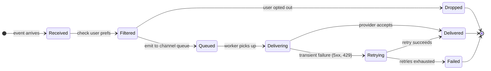

A notification spends most of its life moving between `Queued`, `Delivering`, and `Delivered`. `Dropped` and `Failed` are the failure modes worth designing for.

> **Take this with you.** A notification is not just a message delivery. It is a policy decision (should we send at all?) followed by a delivery attempt with retry semantics. Both halves need their own design.

---

## How big this gets

| Input | Number |
|-------|--------|
| Users | 1 billion |
| Notifications per day | ~10 billion |
| Channel split | 60% push, 30% in-app, 7% email, 3% SMS |
| Marketing campaign burst | 10 million recipients in 5 minutes |
| Delivery latency target (push) | < 60 seconds P99 |
| Audit log retention | 30 days hot, 7 years cold |

<details markdown="1">
<summary><b>Show: derived throughput and storage numbers</b></summary>

| Metric | Value | How |
|--------|-------|-----|
| Sustained QPS, all channels | ~116,000/sec | 10B / 86,400 |
| Peak QPS (3x burst) | ~350,000/sec | marketing campaigns on top of baseline |
| Push worker count at sustained load | ~230 | 500 provider calls/sec per worker |
| Storage per notification row | ~120 bytes | UUID, status, timestamps, provider_msg_id |
| Storage per day | ~1.2 TB | 10B × 120 bytes |
| 30-day hot storage | ~36 TB | spread across 64 Postgres shards, ~600 GB each |

Per-channel sustained QPS:

| Channel | Share | QPS |
|---------|-------|-----|
| Push (iOS + Android) | 60% | ~70,000 |
| In-app | 30% | ~35,000 |
| Email | 7% | ~8,000 |
| SMS | 3% | ~3,500 |

**The number that matters.** The sustained QPS is not the hard ceiling. Kafka handles 116,000/sec without breaking a sweat. The ceiling is the per-account quotas at each provider: APNs throttles per HTTP/2 connection per certificate, Twilio per sender number, SendGrid per sub-account. At scale you hold many provider credentials and round-robin across them.

</details>

> **Take this with you.** Throughput is not the interesting constraint. Provider quotas are. Fan-out shape (one event to ten million) and dedup at retry are where the design gets hard.

---

## The smallest version that works

Forget a billion users. One event type: someone liked your post. One channel: iOS push. One provider: APNs.

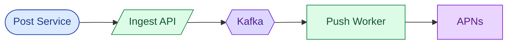

Two endpoints carry the whole product at this stage.

| Endpoint | What it does |
|----------|--------------|
| `POST /events` | Accept an event from a producer service, append to Kafka |
| `PUT /users/me/notification-preferences` | Store channel opt-ins and quiet hours |

<details markdown="1">
<summary><b>Show: the minimal table</b></summary>

```sql
CREATE TABLE notifications (
    notification_id   UUID PRIMARY KEY,
    event_id          UUID NOT NULL,
    recipient_user_id BIGINT NOT NULL,
    channel           SMALLINT NOT NULL,
    status            SMALLINT NOT NULL DEFAULT 1,
    queued_at         TIMESTAMPTZ NOT NULL DEFAULT NOW(),
    sent_at           TIMESTAMPTZ
);
```

One table. Everything we add next is a response to a real problem, not a speculative feature.

</details>

This is enough for tens of thousands of users. Three things will break next: fan-out when we add a second channel, preference enforcement at scale, and duplicate sends when Kafka consumer groups rebalance. We address each in turn.

---

## Decision 1: how do we handle fan-out?

The moment we add a second channel, a question appears: which channels does this event go to, for this user? That decision touches user preferences, quiet hours, and per-user caps. It cannot live inside each channel worker, because then each worker repeats the same logic with different bugs.

The answer is a Fan-out Service: a single stage that reads the event, runs the policy checks, and emits per-channel tasks to separate queues.

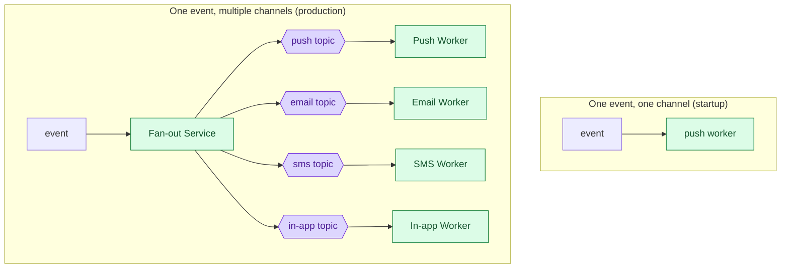

The Fan-out Service runs five checks, in order, for every (event, recipient, channel) triple:

1. Is this channel enabled in the user's preferences?
2. Is this event category enabled (e.g., marketing vs. transactional)?
3. Are we inside the user's quiet hours?
4. Has the user hit their hourly cap for this channel?
5. Have we already started delivering this notification (dedup check)?

If any check fails, the notification is dropped or deferred. Only notifications that pass all five reach a channel queue.

Per-channel topics are load-bearing. If SendGrid has a 30-minute outage, the email topic backs up to ~14 million messages. Push and SMS keep draining. Without separate topics, one bad provider stalls all channels.

> **Take this with you.** The Fan-out Service is the one place that knows about every notification for every user before it goes anywhere. Preferences, quiet hours, and caps belong there, not scattered across workers.

---

## Decision 2: how do we prevent duplicate sends?

Duplicates come from two places: producer retries (the upstream service sent the same event twice) and Kafka consumer group rebalances (two workers briefly process the same message).

The fix is a dedup key at two points in the pipeline.

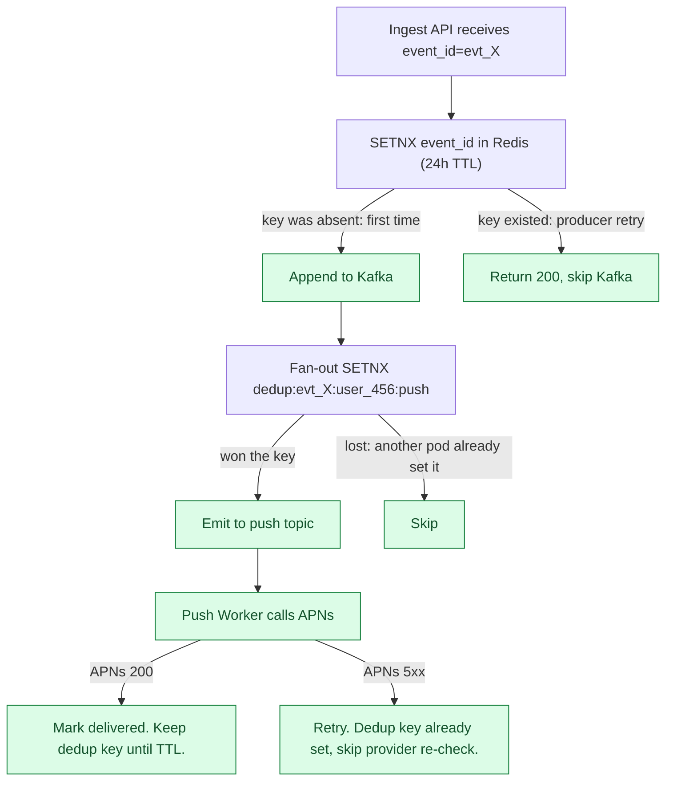

The Redis key `dedup:{event_id}:{recipient_user_id}:{channel}` serializes two concurrent workers racing on the same message. The first wins with `SETNX`. The second sees the key and skips the provider call without returning an error.

Why 24 hours? Long enough that a retry within a reasonable time window is caught. After 24 hours, the same `event_id` is more likely an operator resend than a duplicate. For strict exactly-once guarantees on 2FA SMS, use a Postgres `INSERT ... ON CONFLICT` with a durable unique constraint instead of Redis.

> **Take this with you.** Idempotency keys must travel with the message from ingest to the provider call. A dedup check only at the Ingest API does not catch Kafka consumer rebalances. A dedup check only at the worker does not catch producer retries that never hit Kafka.

---

## Decision 3: how do we handle provider failures?

APNs returns 429 when you push too fast. SendGrid returns 5xx during incidents. Twilio rejects messages to unported numbers with a 4xx. The worker must know which errors mean "try again" and which mean "give up."

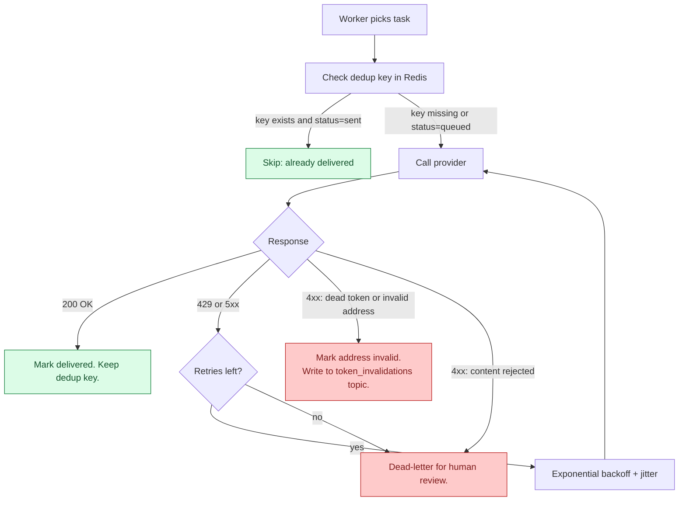

Retry windows differ by channel, because staleness means different things:

| Channel | Max retries | Max window | Why |
|---------|-------------|------------|-----|
| Push | 5 | 60 seconds | A "your driver arrived" push from two hours ago is useless |
| In-app | 3 | 7 seconds | If the session is still open, it needs to appear now |
| Email | 8 | 24 hours | Store-and-forward. An invoice email delivered 4 hours late is still useful. |
| SMS | 3 | 5 minutes | Timely, and Twilio retries independently at the carrier layer |

Why jitter? If 1,000 workers all sleep exactly 8 seconds after a 429, they hit the provider at the same instant and cause another 429. Adding ±2 seconds of random offset spreads them out.

Token invalidation is its own feedback loop. When APNs returns `410 Unregistered`, the push worker writes to a `token_invalidations` Kafka topic. A small consumer marks that token `invalid` in the device registry. The next fan-out skips it.

> **Take this with you.** 4xx means stop retrying. 5xx means try again later. Mixing these up turns one bad address into a million pointless API calls and a throttled account.

---

## Decision 4: how do we enforce quiet hours and per-user caps?

These checks run at fan-out time, not inside channel workers. The fan-out layer sees every notification for every user. Channel workers do not.

**Quiet hours.** Each user's preferences include a timezone and a do-not-disturb window. Fan-out converts the current UTC time to the user's local time and checks the window.

| Category | Quiet hours behavior |
|----------|----------------------|
| `transactional` (2FA, invoice, security alert) | Send immediately. Quiet hours do not apply. |
| `marketing` | Drop. A "lunch deal: $5 off" delivered at 8 a.m. the next day is stale. |
| `social` (likes, comments) | Defer to a delayed topic. User gets a digest when the window ends. |

**Per-user cap.** A sliding-window counter per `(user_id, channel)` in Redis:

```
INCR notifications:hourly:user_456:push
EXPIRE notifications:hourly:user_456:push 3600
```

If the counter exceeds the cap, drop or defer. Caps are per-channel, not per-user globally, because SMS costs ~$0.01 each and push costs near zero. The caps should reflect cost and intrusiveness.

**Aggregation.** Alice's post goes viral. Bob gets 100 "Alice liked your post" events in one hour. Without aggregation, he gets 100 notifications.

Fan-out checks Redis for an open aggregation window keyed on `post:789:likes`. If no window exists, start one with `SETEX` and schedule a close message. If a window exists, increment its count and emit nothing. At close time, fan-out reads the count and emits one notification: "Alice and 99 others liked your post."

> **Take this with you.** Aggregation, quiet hours, and per-user caps all belong in the Fan-out Service. The Fan-out layer is the only part of the system with full visibility into what is being sent to whom before it goes anywhere.

---

## Decision 5: where do preferences live at hot-path speed?

Fan-out runs 116,000 times per second at the billion-user scale. A synchronous Postgres read for each one means 116,000 Postgres reads per second. That melts the database.

Preferences live in Postgres as the source of truth, but are read from Redis on the hot path. Writes invalidate the cache via pub/sub.

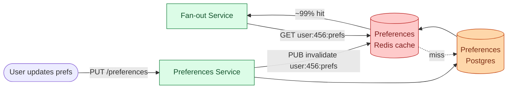

The pub/sub invalidation on write means a preference change is visible to fan-out within about 1 second. For marketing, this creates a small window of inconsistency: events already past fan-out and sitting on a channel topic are not re-checked. For strict opt-out compliance, re-check preferences in the channel worker too, at the cost of one extra Redis read per send.

> **Take this with you.** Preferences must be a cache read on the hot path, not a database read. Pub/sub invalidation on write keeps the cache fresh without a time-based TTL that could serve stale opt-outs.

---

## The full architecture


Each component, in one sentence:

| Component | Purpose |
|-----------|---------|
| API Gateway | Authenticates producers, rate-limits, checks idempotency keys. |
| Ingest API | Schema validation, event-level dedup, appends to Kafka. |
| Fan-out Service | Checks prefs, quiet hours, per-user cap, aggregation. Emits per-channel tasks. |
| Preferences Service | Per-user opt-ins, quiet hours, timezone. Postgres-backed, Redis-cached. |
| Template Service | Versioned, localized message templates. Rendered at fan-out time. |
| Dedup Store | Redis with 24h TTL. Key = `event_id + recipient + channel`. |
| Device Registry | Maps `user_id` to active push tokens per platform. |
| Channel Workers | Render the message, call the provider, record the result, handle retries. |
| Notifications DB | Delivery log. One row per notification: status, timestamps, provider message ID. |
| Campaign Scheduler | Expands a segment query into events, feeds Ingest API at a controlled rate. |
| Dead-letter topics | Notifications that failed all retries. Cleans invalid tokens; surfaces others for review. |

---

## Walk: Alice likes Bob's post

Bob has push and in-app enabled. He is in Los Angeles. It is 2 p.m.

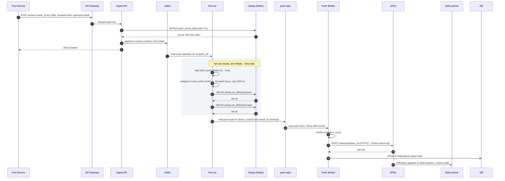

Three things to notice:

1. The 202 goes back to the Post Service at step 6, before any fan-out work starts. The producer is never blocked on delivery.
2. All fan-out checks hit Redis. Postgres is not on the hot path.
3. APNs is called over a persistent HTTP/2 connection. One worker holds many open streams, not one connection per notification.

---

## Walk: APNs returns 429

The push topic has 10,000 tasks queued. APNs starts rate-limiting.

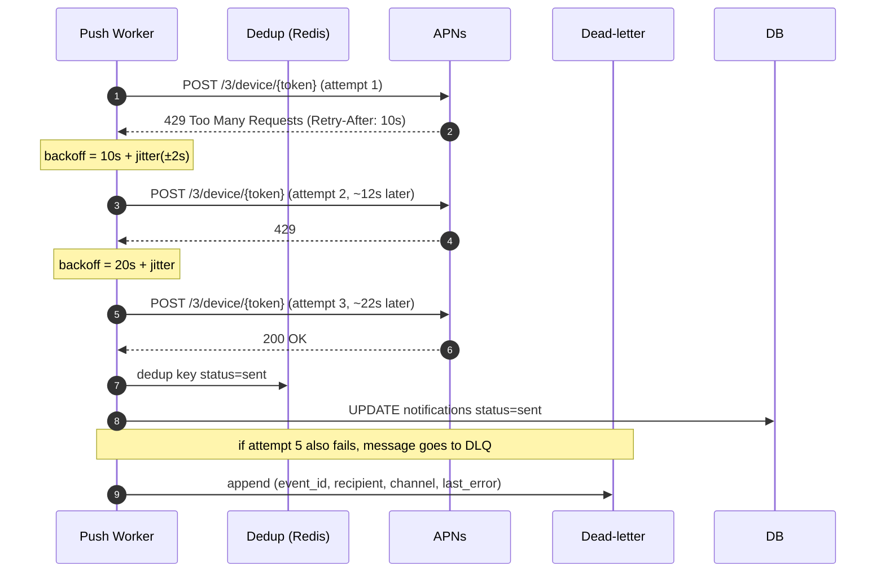

The jitter on each retry step is what prevents 1,000 workers all waking up at the same instant and causing another 429.

---

## The fan-out problem at marketing scale

One "Black Friday" campaign targets 10 million users. Without a Campaign Scheduler, the operator's one API call produces 10 million `events.created` messages in milliseconds. Kafka backs up. Fan-out consumers fall behind. Channel workers queue for hours. Other transactional events (2FA codes, invoice notifications) sit behind the marketing blast.

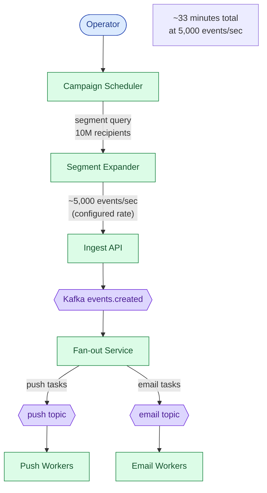

The Campaign Scheduler controls the rate. It also respects per-user local time: if the campaign is set to deliver between 10 a.m. and 8 p.m. local time, the scheduler computes each user's local time from their timezone in the preferences store and holds events until the window opens.

> **Take this with you.** Marketing campaigns need a separate entry point with a rate limit. Without it, one careless campaign saturates Kafka and delays 2FA codes for every other user.

---

## Follow-up questions

Try answering each in 2 or 3 sentences before opening the solution.

1. A producer service retries `event_id=42` because of a network blip, sending it twice within 100ms. Walk through how the system avoids sending duplicate notifications. What if the second retry comes 25 hours later, after the dedup TTL expires?

2. A marketing campaign is supposed to target 10 million users but the operator accidentally targets 100 million. How do you stop it mid-flight? What state has to be torn down?

3. APNs is down for 30 minutes. What happens to push notifications during the outage? What happens when it comes back? Do users see a flood at recovery?

4. A user updates their notification preferences to opt out of marketing. A marketing campaign was already queued and is mid-fan-out. Which notifications still go out?

5. A user has 5 devices. They do something that triggers a notification to themselves (like "your scheduled post just went live"). How many push notifications? On which devices? What if one device is signed out?

6. You discover a template bug: it renders literal `{{name}}` instead of the user's name. How do you roll back? What about messages already sent?

7. The notifications database shows one shard much hotter than the others. Diagnose it.

8. A user complains they got an SMS at 4 a.m. Trace the path. Who is responsible? How do you reproduce it?

9. Web push (browser-based notifications) needs to be added as a new channel. What changes in the architecture? What stays the same?

10. Compliance asks: prove that user 12345 received exactly the notifications we claim, and no others. What is your audit trail? How long do you keep it?

---

## Related problems

- **[News Feed (002)](../002-news-feed/question.md).** The fan-out worker pattern is the same. The celebrity problem maps onto the marketing campaign problem here.
- **[Rate Limiter (004)](../004-rate-limiter/question.md).** The per-user notification cap is exactly a rate limiter scoped to a user. Sliding-window counters apply directly.
- **[Chat System (003)](../003-chat-system/question.md).** Push notification delivery to mobile devices is the same problem as chat message delivery. APNs and FCM are shared tools, and the device-token lifecycle is identical.
- **[Distributed Cache (009)](../009-distributed-cache/question.md).** Preferences and dedup state both live in Redis with TTL. Hot-key and eviction behavior matters here too.
- **[Approval Management (011)](../011-approval-management/question.md).** Every approval event fires notifications. The fan-out, retry, and quiet-hours machinery here consumes the approval engine's events.


<div class="pr-solution-divider"></div>


## Solution: Notification System

### What this system is

A notification system is a policy-enforcement pipeline. One event comes in. The system decides, per recipient and per channel, whether to send at all. If yes, it delivers the message through a third-party provider (APNs, FCM, SendGrid, Twilio) and retries on transient failure without sending duplicates.

The architecture is a stateless Fan-out Service in front of per-channel Kafka queues in front of channel worker pools. Fan-out is the brains: it checks user preferences, quiet hours, per-user caps, and aggregation windows. Workers are the hands: they call providers, retry with backoff, and record results.

What trips candidates: one worker pool for all channels (one bad provider stalls all channels), synchronous Postgres preference reads on the hot path (cannot scale past ~1,000/sec), and retries without dedup keys (users get the same SMS twice).

---

### 1. The two questions that matter most

**Fan-out shape: transactional or marketing?** A transactional event (Alice liked your post) goes to one user. A marketing campaign targets ten million. These need separate code paths. The marketing path needs a Campaign Scheduler, a rate limiter, and per-user local-time delivery windows. The transactional path needs low latency and high dedup correctness. Conflating them builds the wrong system.

**What are the delivery freshness requirements per channel?** A push notification about a nearby driver arriving must land within 60 seconds or it is useless. An invoice email can arrive 4 hours late and still be useful. These different deadlines drive completely different retry policies. Without asking this question, you cannot size the retry windows.

---

### 2. The math, in plain numbers

| Scale | Notifications/day | Sustained QPS | Peak QPS | Storage (30 days) |
|-------|-------------------|---------------|----------|-------------------|
| Startup (100k users) | ~1 million | ~12 | ~50 | 3.6 GB |
| Mid-size (10M users) | ~100 million | ~1,200 | ~5,000 | 360 GB |
| Billion-user product | ~10 billion | ~116,000 | ~350,000 | 36 TB |

Per-channel split at billion-user scale:

| Channel | Share | QPS |
|---------|-------|-----|
| Push (iOS + Android) | 60% | ~70,000 |
| In-app | 30% | ~35,000 |
| Email | 7% | ~8,000 |
| SMS | 3% | ~3,500 |

One marketing campaign targeting 10 million users in 5 minutes: 10M / 300 sec = ~33,000/sec for that burst, roughly 30% on top of the baseline.

Worker pool sizing: at 500 provider calls per second per worker, sustained 116,000/sec needs ~230 workers; peak needs ~700. Scale on Kafka consumer lag.

The real ceiling is provider quotas, not compute. APNs throttles per HTTP/2 connection per certificate. Twilio throttles per sender number. At scale, hold many provider credentials and round-robin across them.

---

### 3. The API

Two endpoints carry the core product.

**Event submission (from producer services):**
```
POST /api/v1/events
Idempotency-Key: <event_id>

{
  "event_id": "evt_8f3a91...",
  "event_type": "post.liked",
  "category": "social",
  "actor": { "user_id": 123 },
  "recipients": [{ "user_id": 456, "context": { "post_id": 789 } }],
  "aggregation_key": "post:789:likes",
  "template_id": "tpl_like_v3",
  "template_vars": { "actor_name": "Alice", "post_title": "My trip" },
  "ttl_seconds": 3600
}
```

| Status | Meaning |
|--------|---------|
| **202** | Event queued |
| **200** | Same event_id already accepted (idempotent replay) |
| **400** | Invalid payload or unknown template |
| **413** | Recipient list exceeds 10k; use the campaign endpoint |
| **429** | Producer rate limit hit |

Three load-bearing choices in the payload:

- `Idempotency-Key` is required. Mobile apps and microservices retry on timeout. Without it, a retry creates a duplicate notification.
- `category` controls policy. `transactional` bypasses quiet hours and per-user caps. `marketing` does not.
- `ttl_seconds` is a hard deadline. A push that sits in a backed-up queue past its TTL is dropped, not delivered stale. This prevents the flood-at-recovery problem after a provider outage.

**Campaign endpoint (for marketing blasts):**
```
POST /api/v1/campaigns
{
  "campaign_id": "cmp_winter_2026",
  "segment_query": { "country": "US", "tier": "active" },
  "template_id": "tpl_winter_v2",
  "channels": ["push", "email"],
  "send_window": {
    "start_local_time": "10:00",
    "end_local_time": "20:00",
    "timezone_strategy": "per_user_local"
  },
  "rate_limit": { "per_second": 5000 }
}
```

**Preferences:**
```
PUT /api/v1/users/me/notification-preferences
{
  "channels": { "push": { "enabled": true }, "sms": { "enabled": false } },
  "categories": { "marketing": { "enabled": false }, "transactional": { "enabled": true } },
  "quiet_hours": { "enabled": true, "start": "22:00", "end": "07:00", "timezone": "America/Los_Angeles" }
}
```

---

### 4. The data model

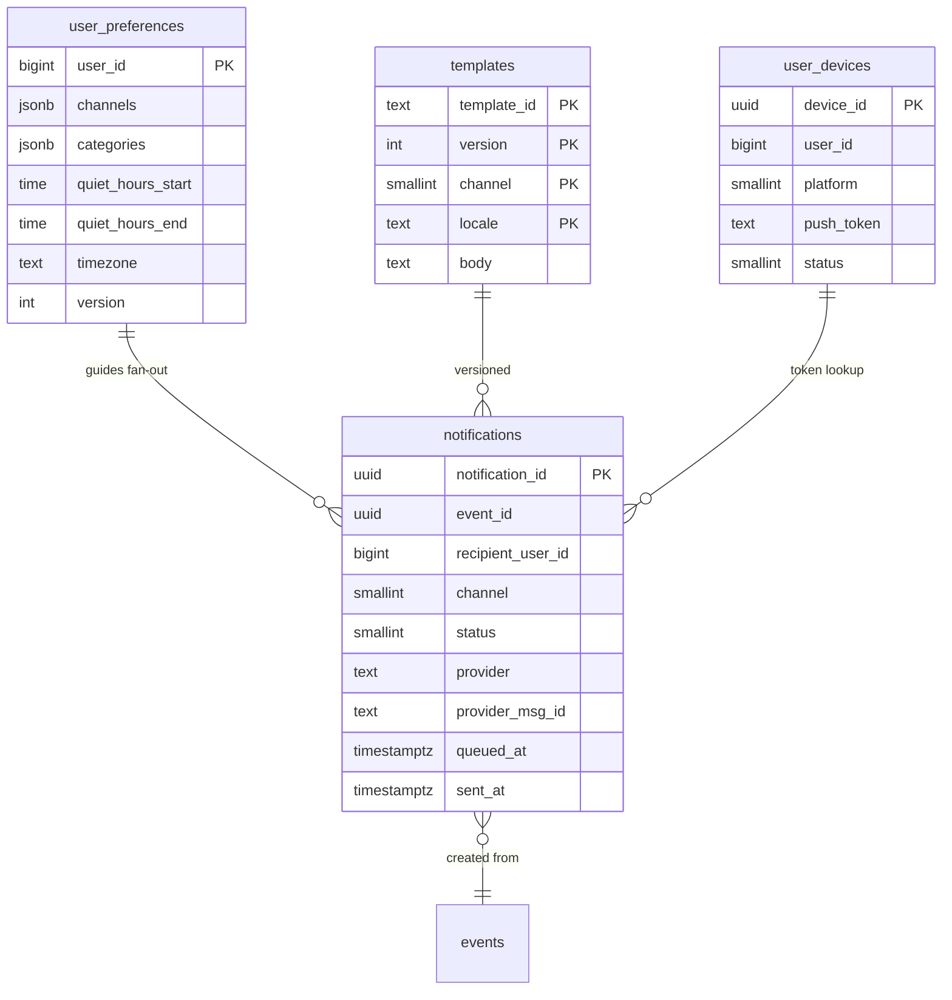

<details markdown="1">
<summary><b>Show: the full SQL</b></summary>

```sql
CREATE TABLE notifications (
    notification_id     UUID PRIMARY KEY,
    event_id            UUID NOT NULL,
    recipient_user_id   BIGINT NOT NULL,
    channel             SMALLINT NOT NULL,       -- 1=push, 2=email, 3=sms, 4=inapp
    template_id         VARCHAR(64) NOT NULL,
    template_version    INT NOT NULL,
    status              SMALLINT NOT NULL,       -- 1=queued, 2=sent, 3=failed, 4=dropped
    category            SMALLINT NOT NULL,       -- 1=transactional, 2=social, 3=marketing
    provider            VARCHAR(32),
    provider_msg_id     VARCHAR(128),
    retry_count         SMALLINT NOT NULL DEFAULT 0,
    queued_at           TIMESTAMPTZ NOT NULL,
    sent_at             TIMESTAMPTZ,
    error_code          VARCHAR(64),
    error_message       TEXT
);

CREATE INDEX idx_event_recipient_channel
    ON notifications (event_id, recipient_user_id, channel);
CREATE INDEX idx_recipient_recent
    ON notifications (recipient_user_id, queued_at DESC);

CREATE TABLE user_preferences (
    user_id              BIGINT PRIMARY KEY,
    channels             JSONB NOT NULL,
    categories           JSONB NOT NULL,
    quiet_hours_start    TIME,
    quiet_hours_end      TIME,
    timezone             VARCHAR(64),
    locale               VARCHAR(16),
    updated_at           TIMESTAMPTZ NOT NULL DEFAULT NOW(),
    version              INT NOT NULL DEFAULT 1
);

CREATE TABLE templates (
    template_id     VARCHAR(64) NOT NULL,
    version         INT NOT NULL,
    channel         SMALLINT NOT NULL,
    locale          VARCHAR(16) NOT NULL,
    subject         TEXT,
    body            TEXT NOT NULL,
    variables       JSONB NOT NULL,
    created_at      TIMESTAMPTZ NOT NULL,
    deprecated_at   TIMESTAMPTZ,
    PRIMARY KEY (template_id, version, channel, locale)
);

CREATE TABLE user_devices (
    device_id       UUID PRIMARY KEY,
    user_id         BIGINT NOT NULL,
    platform        SMALLINT NOT NULL,    -- 1=ios, 2=android, 3=web
    push_token      VARCHAR(512) NOT NULL,
    status          SMALLINT NOT NULL,    -- 1=active, 2=revoked, 3=invalid
    last_seen_at    TIMESTAMPTZ NOT NULL
);
CREATE INDEX idx_user_active ON user_devices (user_id) WHERE status = 1;
```

**Dedup store (Redis, not SQL):**
```
KEY:   dedup:{event_id}:{recipient_user_id}:{channel}
VALUE: notification_id
TTL:   24 hours
```

</details>

Four choices doing real work:

**`notifications` sharded by `notification_id` hash.** Writes spread evenly. The `idx_event_recipient_channel` index makes "did we already send this?" lookups fast within the shard. Redis SETNX is the fast path; this index is the durable backup for reconciliation.

**`templates` are immutable per version.** To fix a template, publish version N+1 and flip the current-version pointer. Roll back by pointing back to N. Messages already sent are stuck (you cannot recall a push), but new sends pick up the fix within minutes.

**`user_devices` filtered by `status = 1`.** Fan-out expands "send to user_456" into active device tokens only. Revoked and invalid tokens never reach the provider.

**`status` is a `SMALLINT`.** Adding new states (`deferred`, `gdpr_deleted`) later is a new integer value, not a schema migration.

---

### 5. The engine: event to delivered push

The timing of one event through the full pipeline:

```
T+0ms      Post Service calls POST /events (event_id=evt_X, recipient=user_456).
T+5ms      Ingest API checks payload. SETNX event_id=evt_X in Redis (24h TTL).
           Appends to events.created Kafka topic.
           Returns 202.

T+10ms     Fan-out consumer reads the event.
T+11ms     Loads user_456's prefs from Redis (~1ms, cache hit).
T+12ms     Checks in order:
            - category=social, prefs.social=on. OK.
            - quiet_hours: user is in PST, time is 14:00. Not in window.
            - per-user cap: counter=3, cap=20. OK.
            - aggregation: no open window for post:789:likes.
              SETEX agg:post:789:likes 3600 1. Schedule close at T+3600s.
            - dedup: SETNX dedup:evt_X:user_456:push. Won.
           Decision: emit to push (iOS + Android) and in-app.
T+14ms     Expand user_456 to active devices: device_A (iOS), device_B (Android).
T+15ms     Emit 2 push tasks and 1 in-app task to channel topics.
T+17ms     INSERT 3 rows into notifications (status=queued).

T+25ms     Push worker pulls task for device_A.
T+26ms     Render template body (~1ms).
T+27ms     POST /3/device/{token_A} via persistent HTTP/2 connection.
T+150ms    APNs returns 200. Worker updates: status=sent, provider_msg_id=apns_xyz.

T+3600s    Aggregation window closes.
           Fan-out reads count: 47 likes.
           Emits one notification: "Alice and 46 others liked your post."
```

P50 end-to-end for a single push: ~150ms. The APNs round trip is the biggest chunk.

---

### 6. The architecture

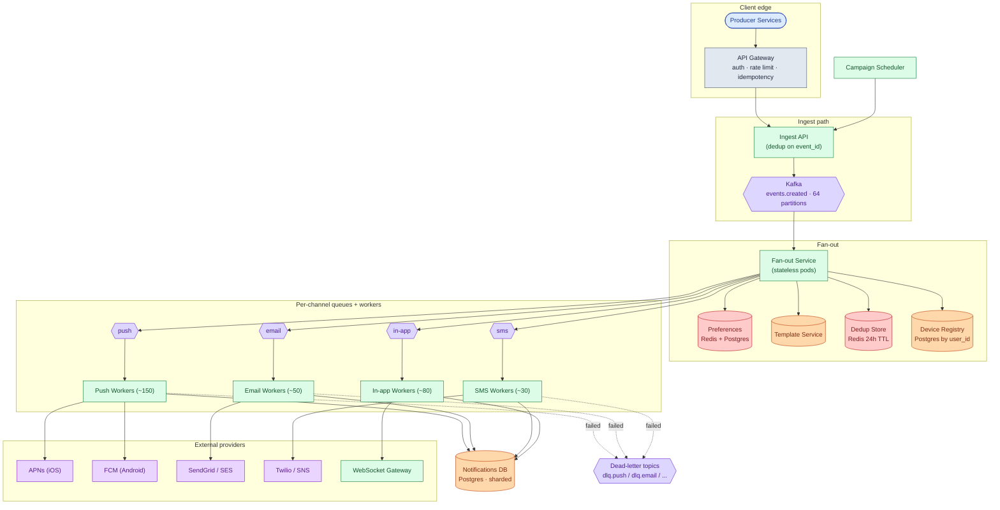

Five things to notice:

- The Ingest API returns 202 before any fan-out work starts. Producers are never blocked on delivery latency.
- Kafka is partitioned by `recipient_user_id` on `events.created`. All events for one user land on one partition. The per-user cap counter lives on the consumer that owns that partition, so no cross-pod synchronization is needed.
- Fan-out and channel workers split because they have different bottlenecks. Fan-out is IO-bound on Redis lookups. Channel workers are blocked by provider latency.
- Per-channel topics contain blast radius. SendGrid outage backs up only the email topic.
- Campaign Scheduler is separate because marketing needs pacing. Without it, one careless campaign floods Kafka and delays 2FA codes.

---

### 7. A request, end to end

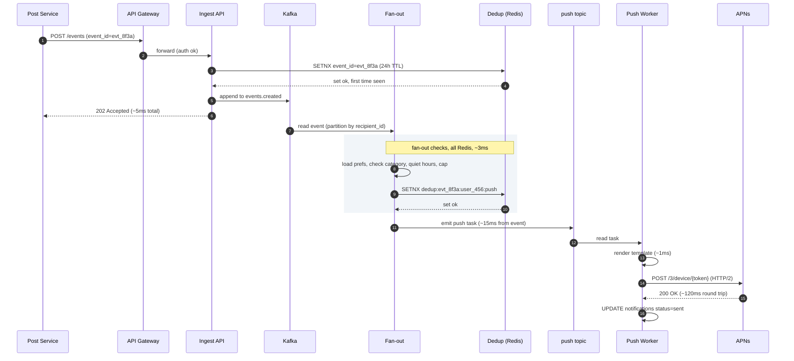

Target latencies for the common paths:

| Path | P99 |
|------|-----|
| Ingest to Kafka | ~5ms |
| Fan-out checks (all Redis) | ~3ms |
| Push worker to APNs and back | ~120ms |
| Full end-to-end (happy path push) | ~150ms |
| Email delivery (SendGrid queued) | ~5 seconds |

---

### 8. The scaling journey: 10 users to 1 billion

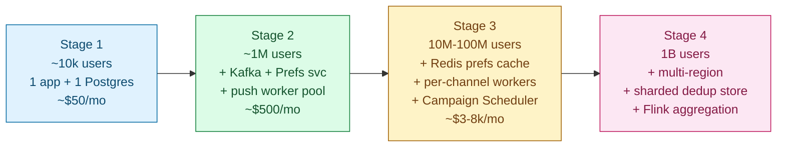

#### Stage 1: ~10,000 users

One Postgres, one app instance. Preferences in Postgres. Push only (APNs + FCM). Notifications delivered inline via HTTP call. No Kafka, no retry logic, no dedup.

Enough because you see a few hundred notifications per hour. Building more is over-engineering.

#### Stage 2: ~1 million users

What breaks: the inline APNs call takes 50-200ms per notification. At a few hundred concurrent requests, the Ingest API starts timing out.

Add Kafka to decouple ingest from delivery. Add a push worker pool. Add basic retry logic. ~$500/month. Still synchronous Postgres preference reads; at 1M users this is manageable.

#### Stage 3: 10M to 100M users

Several things break at once:

- Preferences Postgres at 10,000 events/sec: 10,000 synchronous reads per second. Database falls over.
- One marketing campaign targeting 5M users overwhelms the single worker pool. Email backs up behind push.
- Kafka consumer rebalance causes workers to re-process 500 messages. Users get duplicate push notifications.

Fixes in priority order:

1. Redis cache for preferences with pub/sub invalidation on write. Cache hit rate hits 99%.
2. Separate Kafka topics and worker pools per channel. Email and push fail independently.
3. Redis dedup store with SETNX. Consumer rebalance duplicates handled.
4. Campaign Scheduler to pace large campaigns.
5. Aggregation windows, quiet hours, and per-user caps in fan-out.

Cost jumps to $3-8k/month.

#### Stage 4: 1 billion users

New problems at this scale:

- GDPR requires EU user data to stay in EU. The architecture goes multi-region.
- Redis dedup store at 100k writes/sec on one cluster becomes a bottleneck. Shard by `recipient_user_id`.
- Aggregation window state is too large for stateless fan-out workers. Move to Flink or Kafka Streams for declarative window aggregation with built-in state management.
- Marketing campaigns can target 100M+ users. Campaign Scheduler needs segment pre-computation and multi-region fan-out.

Each region has its own Kafka, workers, Postgres, and Redis. Cross-region delivery (a US user notifying an EU user) routed via authenticated cross-region API. The core data model has not changed since Stage 1.

---

### 9. The variants

| Variant | What changes |
|---------|--------------|
| **In-app only (no external providers)** | No retry complexity, no token cleanup, no provider quotas. Fan-out writes directly to an inbox table. WebSocket gateway for online users. |
| **2FA / security SMS** | Exactly-once guarantee required. Use Postgres `INSERT ON CONFLICT` (two-phase commit) instead of Redis SETNX. Accept ~5ms extra latency. |
| **Weekly digest** | Fan-out defers all social notifications to a "digest" bucket. A cron job at Sunday midnight aggregates per user and emits one email. |
| **WhatsApp / LINE channel** | Same channel adapter pattern. New Kafka topic, new worker pool, new provider credentials. ~2 weeks per channel. Nothing else changes. |

---

### 10. Reliability

**Provider outage.** APNs is down for 30 minutes. Push topic backs up. Workers retry with exponential backoff. After 5 attempts (~60 seconds), messages go to dead-letter. When APNs returns, the backlog drains. Two safeguards stop a flood: per-notification TTL drops anything past its expiration, and workers respect APNs's throughput limits on recovery.

**Consumer rebalance.** Kafka consumer groups rebalance when a pod dies or joins. A partition briefly gets processed by two consumers. Redis SETNX serializes them: the loser sees the key set and skips the provider call. For 2FA SMS, use Postgres two-phase commit instead.

**Late-arriving events.** A producer held an event for 10 minutes due to its own outage, then sent it. If `ttl_seconds` was 5 minutes, drop it. If no TTL was set, deliver it. Producers set TTL based on the event's business meaning.

**Preferences write race.** A user rapidly toggles marketing opt-out. The pub/sub invalidation fires multiple times. The preferences cache refetches from Postgres on each invalidation and picks up the latest value. Last write wins. Correct behavior.

---

### 11. Observability

| Metric | Why it matters |
|--------|----------------|
| `notifications.queued_rate` (by channel, category) | Headline throughput |
| `notifications.delivery_rate_pct` (delivered / queued) | Below 95% is a page |
| `fanout.latency_p99` | Fan-out service health |
| `channel.latency_p99` (per provider) | Spots APNs or SendGrid slowdowns early |
| `provider.error_rate` (by code) | Distinguishes transient from permanent failures |
| `dedup.hit_rate` | Near 0% in steady state; a spike means producers are retrying |
| `quiet_hours.deferred_rate` | Too high may mean the system is holding too much |
| `preferences.cache_hit_rate` | Should be above 99% |
| `kafka.consumer_lag_p99` (per topic) | Leading indicator of backup |
| `deadletter.rate` (by channel, reason) | Triggers manual triage |
| `token_invalidation.rate` | A sudden spike may indicate an auth bug |
| `unsubscribe.rate` (by category) | Product signal for notification fatigue |

Page on: any channel's `delivery_rate_pct` below 95% for 5 minutes. Fan-out `latency_p99` above 30 seconds for 5 minutes. Dead-letter rate spike more than 10x baseline.

Ticket on: unsubscribe rate spike (likely a bad campaign). Token invalidation spike (auth bug?). Preferences cache hit rate dropping (eviction tuning needed).

---

### 12. Follow-up answers

**1. Producer retries `event_id=42` twice within 100ms. Later, after TTL expires.**

Within 100ms: the Ingest API checks Redis for the event_id. The first call SETs the key (24h TTL) and proceeds. The second call sees the key and returns 200 immediately. Nothing reaches Kafka twice.

After 25 hours: the dedup key has expired. The second call is treated as a new event and a second notification fires. This is intentional. Twenty-four hours is long enough that a legitimate retry has already landed. After that, the same event_id is more likely an operator manually resending or a bug. For strict deduplication beyond 24 hours, write the event_id to a Postgres `processed_events` table with a unique constraint at ingest time.

**2. Marketing campaign accidentally targets 100M instead of 10M.**

Detection: the volume alert fires when `notifications.queued_rate` for the marketing category spikes beyond the expected band.

Stop at the Campaign Scheduler: `POST /campaigns/{id}/pause`. The scheduler stops emitting events within 1-2 seconds.

Events already on Kafka are not stopped by pausing the scheduler. The fan-out Service checks a campaign blocklist Redis set on every event. If the campaign_id is in the blocklist, drop without fan-out. The operator adds the campaign_id via an admin endpoint, effective within seconds. Channel workers also check the blocklist before calling the provider.

**3. APNs is down for 30 minutes.**

During: push topic backs up. Workers retry with exponential backoff. After 5 attempts (~60 seconds), messages go to dead-letter.

Recovery: APNs returns. Workers resume. A backlog of ~500k messages drains over the next few minutes. Flood prevention: per-notification TTL drops anything stale (a "your driver arrived" push with a 5-minute TTL is discarded if it sat in the queue for 30 minutes). Workers also respect APNs's throughput limits on resumption.

**4. User opts out of marketing while a campaign is mid-fan-out.**

Fan-out checks preferences at the moment it processes the event, not when the event was created. The preferences cache has a short TTL with pub/sub invalidation on write. Opt-out at T=0 invalidates the cache. Fan-out refetches on next event, typically within 1 second.

Events already past fan-out and sitting on per-channel topics are not re-checked. Those are sent. Window of inconsistency: about 10 seconds. For strict legal compliance, also re-check preferences in the channel worker before calling the provider.

**5. User has 5 devices; notification to themselves.**

Fan-out expands "send to user_456" against the device registry filtered by `status = 1` (active). If device_C is revoked and device_E is invalid, they are filtered at expansion time before any provider call. Result: 3 push notifications, one per active device. For in-app: one row in the inbox per user, regardless of device count.

**6. Template bug: renders `{{name}}` literally.**

Detection: support tickets, or a lint pass that checks rendered output against a sample.

Roll back: templates are versioned and immutable. Flip the current-version pointer from v3 to v2. Fan-out picks up the new pointer when the template metadata cache expires (short TTL on the pointer, longer on the body).

Messages already sent cannot be recalled. For severe issues, send a follow-up apology notification. Prevention: every template change goes through lint, a preview render with sample data, a canary to 0.1% of recipients, then full rollout.

**7. One database shard hotter than others.**

Diagnosis steps:

1. Check the shard key. `notifications` sharded by `notification_id` hash. An imbalance on hash-sharded data usually means queries are not using the shard key and are scatter-gathering.
2. Check slow-query logs. `SELECT WHERE recipient_user_id = ?` scatter-gathers all shards when `recipient_user_id` is not the shard key. A secondary index on `recipient_user_id` on each shard handles the common case without re-sharding.
3. Check partition age. If the table is range-partitioned by week, the current week's partition takes all writes.
4. Check for a noisy neighbor on the same physical host.

Most often it is a query-pattern issue, not a sharding problem.

**8. User got an SMS at 4 a.m.**

Trace:

1. Query `notifications` for `recipient_user_id = ?`, `channel = 3` (SMS), and `sent_at` around 4 a.m. Get `notification_id`, `event_id`, `template_id`, `category`.
2. From `event_id`, find the originating event. Who emitted it? What `category`?
3. Check the user's preferences: are quiet hours set? What timezone is stored?
4. Check fan-out logs for this event: did it run the quiet-hours check? What did it decide?

Likely causes: the category was `transactional` and quiet hours were skipped by design; the user's timezone is wrong in the preferences table; or a DST edge case in the quiet-hours evaluation. Reproduce by replaying the event with the same user state against the fan-out logic. The structured fan-out log is what makes diagnosis possible.

**9. Add web push as a new channel.**

What changes: a new channel adapter for the Web Push protocol (VAPID keys, FCM for Chrome, Mozilla autopush for Firefox). A new entry in the `channel` enum. A new template variant per template (web push bodies are short). A subscription endpoint where the browser registers an `{endpoint URL, keys}` object stored in `user_devices` with `platform=3`. A web push toggle in the preferences UI.

What stays the same: Ingest API, Kafka topology, dedup store, preferences service, retry and dead-letter logic, template service. Fan-out emits to a new `notifications.web_push` topic. Adding a channel is a 2-3 week project.

**10. Audit trail for compliance.**

Every notification has a row in `notifications` with `notification_id`, `event_id`, `recipient_user_id`, `channel`, `template_id`, `template_version`, `category`, `status`, `queued_at`, `sent_at`, `provider`, `provider_msg_id`, `error_code`.

For "prove user 12345 received exactly these notifications":

```sql
SELECT *
  FROM notifications
 WHERE recipient_user_id = 12345
   AND sent_at BETWEEN ? AND ?
   AND status = 2
 ORDER BY sent_at;
```

The absence of a row proves the negative: every emitted notification is logged at queue time (status=queued) before any provider call. If status never became `sent`, the row is still there with the reason.

Retention: 30 days hot in Postgres, archived to S3 as Parquet for 7 years. Compliance queries hit Postgres for recent data and Athena for archived. For suppression audit (why a notification was dropped: quiet hours, cap, opt-out?), structured fan-out logs ship to a log warehouse.

---

### 13. Trade-offs worth saying out loud

**Build vs. buy channel adapters.** OneSignal or Braze handle all channels. Faster to launch. But you pay per notification at scale, cannot tune behavior per channel, and have less visibility into provider failures. For a product sending billions, build. For millions, buy and iterate.

**Where to evaluate preferences.** Fan-out is cheaper and runs once per event. Channel worker re-check is more responsive but adds one extra Redis read per send. Fan-out is the right default; add channel-worker re-check only for strict marketing compliance requirements.

**Strict vs. eventual dedup.** Redis SETNX is fast but has a small window where two workers can both win the key. Postgres two-phase commit is durable but adds 5-10ms. Use SETNX for social and marketing notifications; use two-phase commit for 2FA SMS where exactly-once matters.

**Aggregation window shape.** Tumbling windows (fixed duration, no overlap) are simple but can split a burst of likes across two windows and produce two notifications. Rolling windows extend on each event and delay delivery. Most products use tumbling with a 1-hour default and accept the edge case.

**What to revisit at 10x scale.** Move fan-out to Flink or Kafka Streams for declarative window aggregation and built-in state management. Federate the dedup store regionally. Build a shadow-send mode where new channels or templates can be tested against real traffic without calling the provider.

---

### 14. Common mistakes

**One worker pool for all channels.** A single worker handles push, email, and SMS. One bad channel stalls all three. Separate pools, separate topics.

**No idempotency key on producer calls.** A producer retry sends two notifications. Bad.

**Synchronous Postgres preference lookup on the hot path.** At 100k/sec, that is 100k Postgres reads per second. Cache in Redis with pub/sub invalidation.

**No aggregation.** A user with 100 likes on a post gets 100 separate notifications. A real product complaint within a day of launch.

**No quiet hours or per-user cap.** Required for any product with more than a few hundred users.

**Treating push token revocation as manual cleanup.** APNs and FCM tell you when a token is dead. Build the feedback loop on day one, or your account-wide delivery rate degrades silently.

**No dead-letter strategy.** Failed messages pile up or retry forever. Both outcomes are bad.

**Same retry policy across all channels.** Push with a 24-hour retry window delivers a "your driver arrived" push two hours late. Email with a 60-second window drops messages that could have delivered after a 1-hour SendGrid outage.

**Forgetting marketing is different from transactional.** Marketing needs pacing, a Campaign Scheduler, separate quiet-hours behavior, and compliance handling (CAN-SPAM, GDPR, TCPA). A uniform pipeline blurs them.

**No mention of compliance.** GDPR for EU, TCPA for SMS in the US, CAN-SPAM for email. The architecture must accommodate these from the start.

The three that separate strong from average answers: separate per-channel queues, dedup keys at both the ingest and fan-out layers, and preferences as a cached read. Hit those three and you are doing well.

