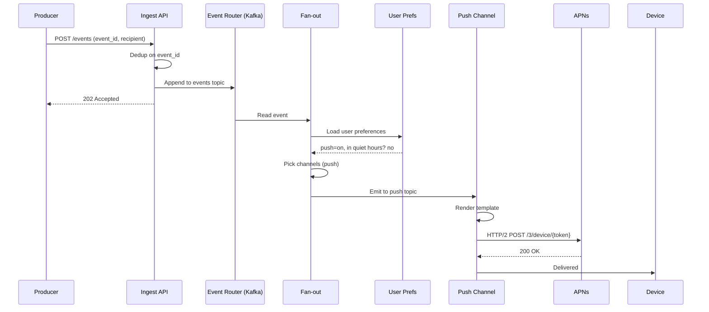
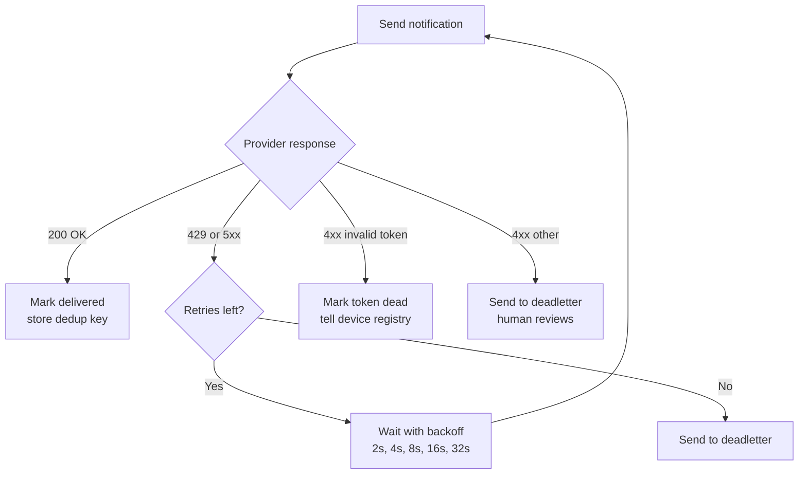
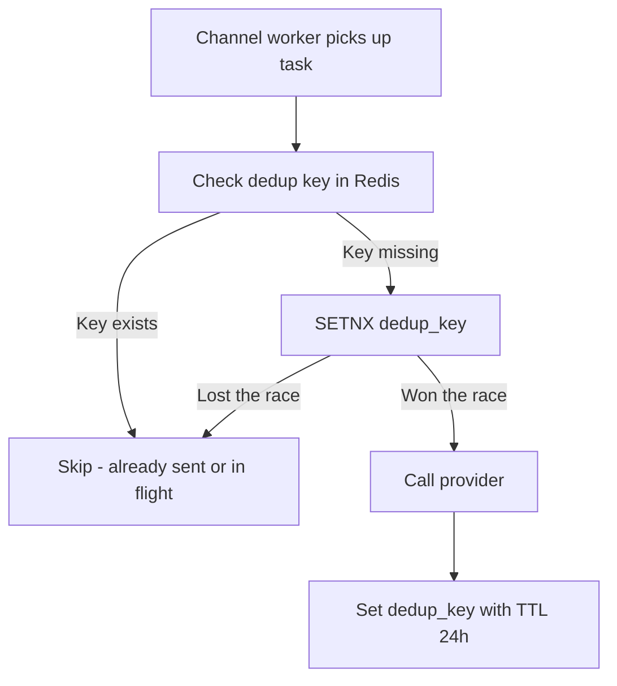
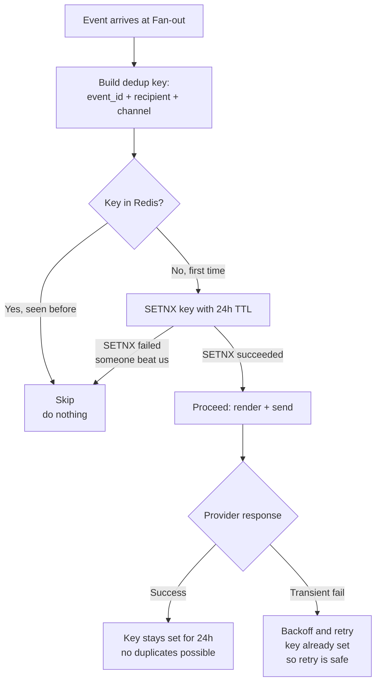


## The scene

You are in the interview room. The whiteboard already has scribbles from the last problem. The interviewer wipes it clean and writes one line:

> *"Design the notification system for our product. Push, email, SMS. One event comes in. The right notifications go out."*

It sounds easy. Read from a queue. Call Apple's push service. Done. Go home.

It is not easy. The trap is the word "one." One event is not one notification. One event might become zero notifications (the user turned them all off). Or one notification (a single SMS). Or a million notifications (a marketing blast). The system has to handle all three without breaking a sweat.

Two ugly problems meet here:

1. **Fan-out.** One input event triggers many output messages. Like one tweet posting to a thousand followers' timelines. Or one "Black Friday sale" event going out to ten million users.
2. **External delivery.** Your code does not deliver the push. Apple does. Or Google. Or SendGrid. Or Twilio. Each one has its own rules, its own failures, its own rate limits. You are not in charge. You just ask nicely.

Get fan-out wrong and you wake users up at 3am. Get retries wrong and you either drop notifications silently or send the same SMS seven times. Both make users hate you.

The interviewer is watching to see if you ask about channels, preferences, and dedup *before* you start drawing boxes. We will walk this from a small startup to a billion-user product. At each step, we name what just broke and add the smallest fix.

---

## Step 1: Ask the right questions

Before you draw anything, sit for five minutes. Write down the questions you would ask the interviewer.

A good list is not "every edge case I can think of." It is the small set of questions whose answers change the whole design.

<details markdown="1">
<summary><b>Show: 8 questions that matter</b></summary>

1. **Which channels?** Push (iPhone and Android)? Email? SMS? In-app messages? Web push? *Each channel is a different external service with its own rules. The design has to treat channels as plug-ins, not bake one in.*

2. **What kinds of events trigger notifications?** User events (someone liked your post)? System events (your invoice is ready)? Marketing campaigns? *Marketing is a totally different shape. One operator click can send to 10 million users in a few minutes. Transactional is one event to one or a few users.*

3. **Can users turn things off?** Per channel? Per event type? Quiet hours? Different languages? *Preferences are the number one source of "why did I get this?" complaints. They have to be checked before fan-out, not after.*

4. **What is the deadline per channel?** Push in under a minute? Email in under five? SMS in under one? *A 2-hour-old "your driver arrived" push is useless. A weekly digest email can wait an hour. Different channels have different deadlines.*

5. **What about aggregation?** If a user gets 100 likes on a post in an hour, is that 100 notifications or one? *Almost always one. ("John and 99 others liked your post.") This needs to be a first-class step in the design, not a hack.*

6. **How big is it?** How many notifications per day? What is the biggest single event? *Shape matters more than total. 10 billion per day spread evenly is easy. 10 billion per day with 90% of it coming from ten viral events per week is hard.*

7. **What if the same event arrives twice?** A producer service retried because of a network blip. Do we send the notification twice? *No. We need a dedup key.*

8. **What rules apply?** GDPR in Europe. TCPA for SMS in the US. CAN-SPAM for email. Unsubscribe links required? *Each channel has legal rules that change the API and the data model.*

The question that decides the whole design is **user preferences**. Without preferences, fan-out is just "for each recipient, send." With preferences, it becomes "for each recipient, check what they allow, check the time of day, check the hourly cap, check if we already sent this." That is a totally different system.

</details>

---

## Step 2: How big is this thing?

The interviewer gives you these numbers.

- 1 billion users
- 10 billion notifications delivered per day, across all channels
- Channel mix: 60% push, 30% in-app, 7% email, 3% SMS
- Single event fan-out ranges from 0 (user blocked all channels) to 1 million (a marketer's blast)
- Per-channel deadlines: push under 1 minute, in-app under 5 seconds, email under 5 minutes, SMS under 1 minute
- Worst burst: a marketing campaign fires 10 million notifications in 5 minutes

Compute five numbers before peeking:

1. Notifications per second, sustained and at peak
2. Per-channel sustained rate
3. Storage for delivery records over 30 days
4. The burst rate during a marketing campaign
5. How many worker machines you need (assume each worker can do 500 calls per second)

<details markdown="1">
<summary><b>Show: the math</b></summary>

**Notifications per second.**

10 billion / 86,400 seconds = ~116,000 per second sustained. Peak is roughly 3× that, so around **350,000 per second** across all channels combined.

**Per-channel sustained rate:**

| Channel | Share | Sustained QPS |
|---------|-------|---------------|
| Push    | 60%   | ~70,000/sec  |
| In-app  | 30%   | ~35,000/sec  |
| Email   | 7%    | ~8,000/sec   |
| SMS     | 3%    | ~3,500/sec   |

These are under what Apple's push service (APNs), Google's push service (FCM), SendGrid, and Twilio can take. But only if you stay under their per-account limits. SMS in particular has carrier limits (around 100 messages per second per long phone number). So you hold many sender phone numbers, not one.

**Storage for delivery records.**

One row per delivery is about 120 bytes. At 10 billion notifications per day:

10 billion × 120 bytes = **1.2 TB per day**.

Over 30 days, that is **36 TB**. Spread across 32 to 64 database shards, manageable.

**Marketing campaign burst.**

10 million notifications in 5 minutes = 33,000 per second for those 5 minutes. On top of the steady 116,000 per second, that is a 30% spike. Kafka handles this without sweating, as long as the partitions are sized right.

**Worker pool size.**

At 500 calls per second per worker, the 116,000 per second sustained rate needs about **230 workers**. Peak around **700**. Auto-scale based on how far behind the queues fall.

**What the math is telling you.**

Total throughput is not the hard part. The hard parts are these three:

1. Fan-out per event ranges from 0 to 1 million. The system must handle that range without operators changing settings every day.
2. External providers (Apple, Google, SendGrid, Twilio) are slow and lossy compared to your own services. You have to retry without sending duplicates.
3. Preferences and quiet hours must be checked cheaply and correctly for every single notification.

> **Why does fan-out shape matter so much?** Imagine two products. Product A sends 1 million notifications a day, evenly. That is ~12 per second. Easy. Product B sends 1 million a day, but 900,000 of them go out in a single 5-minute marketing blast. Same total, but Product B's queue must absorb a 3,000-per-second burst. Same number on paper. Totally different system.

</details>

---

## Step 3: The pipeline

Notifications flow through a pipeline. Four stages, each doing one job.

```
1. Ingest    -> 2. Fan-out    -> 3. Route per channel    -> 4. Deliver
   (front       (one event       (separate queue for         (call APNs,
    door)        becomes many     each channel)               FCM, SendGrid,
                 notifications)                               Twilio)
```

Try to fill in why each stage exists, then check.

<details markdown="1">
<summary><b>Show: full pipeline with reasons</b></summary>

```
   Producer Service (the thing that fires the event)
   like PostService, BillingService, MarketingTool
                 |
                 |  1. POST /events  { event_id, type, payload, recipients[] }
                 v
   +-------------------------------------+
   |  Notification Ingest API            |  Check who you are, check the
   |  (stateless, just a front door)     |  payload, dedup on event_id
   +------------+------------------------+
                |
                |  2. Append to "events.created" Kafka topic
                v
   +-------------------------------------+
   |  Fan-out Service                    |  For each recipient:
   |  (reads from Kafka)                 |   - load user preferences
   |                                     |   - load the template
   |                                     |   - decide which channels
   |                                     |   - check quiet hours
   |                                     |   - check aggregation window
   |                                     |  Then emit per-channel tasks.
   +------------+------------------------+
                |
                |  3. Append to per-channel topics:
                |     notifications.push, .email, .sms, .in_app
                v
   +-------------------------------------+
   |  Channel Workers                    |  One worker pool per channel.
   |  (push / email / sms / in-app)      |  Render the template, call
   |                                     |  the external provider.
   +------------+------------------------+
                |
                |  4. Call the external provider
                v
              User's phone / inbox / app
```

**Why each stage exists:**

- **Ingest API** is the front door. It checks the request, then dedups on `event_id`. If the same `event_id` shows up twice, the second one gets dropped before it costs anything downstream.

> **Why dedup at the front door?** Because producers retry on timeouts. They sent the event, then their network blipped, so they sent it again. Without dedup, your user gets two notifications. The fix is one line: check if you have seen this event_id in the last 24 hours.

- **Kafka in the middle** separates producers from consumers. Producers post and get a fast OK. Consumers process at their own pace. If a downstream provider goes down, messages queue up and drain when it comes back.

- **Fan-out Service** is where the magic happens. One event might become 0, 1, or 1,000 notifications. All preference and aggregation logic lives here.

- **Per-channel queues.** Each channel has different speeds, different limits, different retry rules. Keep them in separate queues so a SendGrid outage does not back up push delivery.

> **Why separate queues?** Imagine you have one big "notifications" queue. SendGrid goes down. Email retries pile up. The single queue gets backed up. Now push notifications also slow down, because they share the queue. One bad channel takes everyone down. Separating queues stops this.

- **Channel workers** are simple and stateless. Render the message, call the provider, record what happened.

</details>

---

## Step 4: Sequence diagram, event to delivered push

Before drawing the full architecture, walk through a single event from start to finish. One like on a post. One push notification to one phone.



The trick is what the boxes do not say. The Fan-out check is doing five things in parallel: preferences, template, quiet hours, hourly cap, dedup. If any one says "no," the notification stops there. We will see that in detail later.

---

## Step 5: The big architecture

Now draw all the supporting pieces. Eight boxes are missing in the diagram below. Think about: who owns user preferences, who renders the message, where dedup state lives, where device tokens are stored.

```
   Producer Services --> +----------------+
                         |   Ingest API   |
                         +-------+--------+
                                 |
                                 v
                         +----------------+
                         |  events Kafka  |
                         +-------+--------+
                                 |
                                 v
                         +----------------+        +------------------+
                         |   Fan-out      |<-------|    [ ? ]         |  (per-user opt-in,
                         |   Service      |        |                  |   quiet hours, locale)
                         +--+-------------+        +------------------+
                            |
                            |             +------------------+
                            |<------------|    [ ? ]         |  (subject, body,
                            |             |                  |   localized, versioned)
                            |             +------------------+
                            |
                            |             +------------------+
                            |<------------|    [ ? ]         |  (event_id + recipient +
                            |             |                  |   channel -> already sent?)
                            |             +------------------+
                            |
                            v
                +----------------------------+
                |  per-channel Kafka topics  |
                | push / email / sms / inapp |
                +-----+----+----+----+-------+
                      |    |    |    |
                      v    v    v    v
                +---+ +---+ +---+ +---+
                |[?]| |[?]| |[?]| |[?]|  (each calls its external provider)
                +-+-+ +-+-+ +-+-+ +-+-+
                  |     |     |     |
                  v     v     v     v
                APNs/  Send  Twilio/ WebSocket
                FCM    Grid   SNS    push to
                              SMS    open app
```

<details markdown="1">
<summary><b>Show: full architecture</b></summary>

```
   Producer Services --> +----------------+
                         |   Ingest API   |  Auth, dedup on event_id
                         +-------+--------+
                                 |
                                 v
                         +----------------+
                         |  events Kafka  |  topic: events.created
                         +-------+--------+  partitioned by recipient_id hash
                                 |
                                 v
                         +----------------+      +-----------------------+
                         |   Fan-out      |<-----|  Preferences Service  |
                         |   Service      |      |  (per-channel opt-in, |
                         +--+-------------+      |   per-event opt-out,  |
                            |                    |   quiet hours, tz,    |
                            |                    |   locale)             |
                            |                    +-----------------------+
                            |
                            |             +-----------------------+
                            |<------------|  Template Service     |
                            |             |  (subject + body,     |
                            |             |   localized, versioned|
                            |             |   per channel,        |
                            |             |   A/B variants)       |
                            |             +-----------------------+
                            |
                            |             +-----------------------+
                            |<------------|  Dedup Store          |
                            |             |  (Redis with TTL,     |
                            |             |   key = event_id +    |
                            |             |   recipient +         |
                            |             |   channel)            |
                            |             +-----------------------+
                            |
                            v
                +----------------------------+
                |  per-channel Kafka topics  |
                | push / email / sms / inapp |
                +-----+----+----+----+-------+
                      |    |    |    |
                      v    v    v    v
                +----+ +----+ +----+ +-----+
                |Push| |Mail| |SMS | |InApp|
                |Wkr | |Wkr | |Wkr | |Wkr  |
                +-+--+ +-+--+ +-+--+ +-+---+
                  |     |     |     |
                  v     v     v     v
                APNs/  Send  Twilio/ WebSocket
                FCM    Grid   SNS    push to
                              SMS    open app
                  |     |     |     |
                  v     v     v     v
              Device Inbox  Phone  In-app feed
```

What each new piece does:

- **Preferences Service.** Cheap, hot, mostly read. Fan-out hits it once per recipient. Heavily cached because preferences rarely change.

- **Template Service.** Stores message templates with variables (like `Hi {{name}}, you have {{count}} new likes`). Versioned. Localized. The renderer is a small library called inside the channel workers. The Template Service just hands out template content.

- **Dedup Store.** Redis with TTL. Key is `event_id + recipient + channel`. If the key is there, the notification was already sent (or is on its way). Skip. TTL is 24 hours, long enough to cover all retry windows.

- **Per-channel workers.** Each pool is sized on its own. Push workers call APNs and FCM in batches. Email workers call SendGrid. SMS workers call Twilio with per-number rate limiting. In-app workers write to a WebSocket gateway or to a store-and-poll table.

> **Why is dedup keyed on three things, not just `event_id`?** Because one event can go to many recipients (fan-out). And one recipient can get notifications on multiple channels (push, email, in-app for the same event). The unique unit is `event + person + channel`. Anything less and you either miss real notifications or send duplicates.

</details>

---

## Step 6: Retry, dedup, and deadletter

External providers fail. APNs returns 429 when you push too fast. SendGrid returns 5xx during their incidents. Twilio rejects messages to invalid numbers. The design has to tell "try again later" apart from "give up forever" without sending the same notification twice.

Take 10 minutes. Design:

1. The retry policy per channel (how many tries, with what wait between)
2. The idempotency key (so retries do not duplicate)
3. What goes to the deadletter queue and who looks at it
4. How invalid push tokens get cleaned up



<details markdown="1">
<summary><b>Show: full retry strategy</b></summary>

**Sorting responses into three buckets.** Every provider response falls into one of three:

| Bucket | What it means | What to do |
|--------|---------------|------------|
| Transient | 429, 5xx, timeout, network reset | Wait, then try again |
| Permanent invalid recipient | APNs `Unregistered`, FCM `NotRegistered`, Twilio invalid number, email hard bounce | Do not retry. Mark the address as dead. Clean it up. |
| Permanent rejection | Template rejected, content flagged, sender blacklisted | Do not retry. Send to deadletter for a human to look at. |

> **Why retry only on 5xx but not 4xx?** Because 5xx means the server temporarily failed (it might work next time). 4xx means we sent something wrong (invalid token, bad payload). Retrying a 4xx will fail forever. Knowing the difference stops a million pointless API calls.

**Per-channel retry policy:**

| Channel | Max retries | Backoff | Max retry window |
|---------|-------------|---------|------------------|
| Push (APNs/FCM) | 5 | 2s, 4s, 8s, 16s, 32s + jitter | 60 seconds (push must be fresh) |
| In-app | 3 | 1s, 2s, 4s | 7 seconds |
| Email | 8 | 30s, 1m, 5m, 15m, 1h, 4h, 12h, 24h | 24 hours |
| SMS | 3 | 5s, 30s, 2m + jitter | 5 minutes |

Push retries have a tight window because a 2-hour-old "your driver arrived" push is junk. Email retries are generous because email is store-and-forward by nature. SendGrid outages can last hours.

> **What is jitter?** Random wiggle added to the backoff. If 1,000 workers all wait exactly 8 seconds, they all hit the provider at the same instant. The provider falls over again. Jitter spreads them out so they retry at different times. Tiny detail, huge impact.

**The idempotency key:**

```
dedup_key = sha256(event_id + recipient_user_id + channel)
```

Stored in Redis with a 24-hour TTL.



> **Why SETNX and not just SET?** SETNX means "set only if not exists." It is atomic. If two workers both try at the same instant, only one wins. The loser sees "already set" and skips the provider call. Without SETNX, both could check, both see empty, both send. Duplicate notification.

For mission-critical channels (SMS for 2FA codes), use a stronger check. Write to a Postgres row with `INSERT ON CONFLICT DO NOTHING RETURNING`. Slower (one DB write per send) but bulletproof.

**Deadletter queue.** Messages that fail all retries go to `notifications.deadletter.{channel}`. A small dashboard groups them by error reason. Permanent invalid recipients get auto-cleaned. The rest land in front of a human, usually within an hour.

**Push token cleanup.** APNs and FCM both tell you when a token is dead. The channel worker:

1. Sees the dead-token response.
2. Writes to a `push_token_invalidations` topic.
3. A small consumer marks the token as `revoked` in the device table.
4. Future notifications skip that token. If the user has no other devices, push acts like an opt-out for that user.

</details>

---

## Step 7: Dedup, drawn out

The dedup check is the single most important thing in this design. If it works, retries are safe. If it does not, users hate you.



> **Why does the TTL exist?** Two reasons. One, Redis would fill up forever otherwise. Two, after 24 hours, a "retry" of the same event_id is more likely an operator manually resending or a real bug. You want it to go through, not silently skip.

> **What if a worker dies right after SETNX but before calling the provider?** The key is set, but the notification was never sent. The user never gets it. To handle this, you can store the worker_id and a timestamp in the dedup value. On replay, check if that worker is still alive (heartbeat). If dead, the replay proceeds. For social and marketing notifications, the simpler SETNX is fine. For 2FA codes, use the bulletproof Postgres version.

---

## Step 8: Rate limiting, aggregation, and quiet hours

Notifications are the fastest way to make users uninstall your app. Three guardrails, each at a different layer.

Take 10 minutes:

1. **Per-user cap.** A user should not get more than N notifications per hour, across all channels.
2. **Aggregation.** 100 likes on one post should be one notification ("John and 99 others"), not 100.
3. **Quiet hours.** A user in Tokyo at 2am should not get a marketing push, even if it is 10am in California where your servers run.

How do you build each? Where in the pipeline do they live?

<details markdown="1">
<summary><b>Show: all three guardrails</b></summary>

**Per-user cap.** Lives in the Fan-out Service. After choosing channels, before emitting per-channel tasks.

How: a Redis sliding-window counter per `(user_id, channel)`.

```
INCR notifications:hourly:user_456:push
EXPIRE notifications:hourly:user_456:push 3600
```

If the counter exceeds the cap (say 20/hour for push, 5/hour for SMS), drop the notification or hold it for a daily digest.

> **Why per-channel and not just per-user?** Because the costs differ. SMS costs about $0.01 each. Push costs near zero. You can send a user 50 pushes a day without thinking. 50 SMS a day costs you $0.50 and probably gets you sued.

Transactional notifications (your code, your invoice, your driver arrived) bypass the cap. They are tagged `category=transactional` and the check skips them. Only `marketing` and `social` count.

**Aggregation.** Same place. Separate path for events that can be batched.

Events that can be aggregated (likes, follows, comments on the same post) carry an `aggregation_key` like `post:789:likes`. The Fan-out Service does:

1. On arrival, check Redis for an open window: `EXISTS agg:post:789:likes`.
2. If no window: start one with `SETEX agg:post:789:likes 3600 1` (1-hour window). Schedule a "close" message for window end.
3. If window exists: `INCR agg:post:789:likes`. Do not emit anything new.
4. When the window expires, a scheduled job reads the count and sends one notification with the aggregated content.

The template looks like: `"{{first_actor.name}} and {{count - 1}} others liked your post"`. Fan-out materializes the actor list at window close.

> **Subtle ordering bug.** Window starts on the first event. User gets 1 like at T=0 and 99 likes at T=3,599. They get one notification at T=3,600. Good. But if they get 99 likes at T=0 and 1 like at T=3,601, they get two notifications: the big one, then a lonely "1 person liked your post." Adjustable; some products use rolling windows.

**Quiet hours.** Fan-out again, before emitting to any channel.

Each user's preferences include their timezone and a do-not-disturb window (like 22:00 to 07:00 local time). Fan-out converts "now" to the user's local time and checks the window.

If now is inside the quiet window:

- **Transactional.** Send anyway. Quiet hours do not apply.
- **Marketing.** Drop. Do not delay. Users hate a morning rush of overnight notifications.
- **Social** (likes, follows, comments). Hold. Move to a "deferred" topic with a delayed delivery time set to the end of quiet hours. When the user wakes up, they get a digest.

> **Why drop marketing instead of holding it?** Because the marketing message is timed. "Lunch deal, $5 off until 3pm" is useless at 8am the next day. Holding it would deliver a stale message. Dropping is better than misleading.

**Timezone matters.** A marketing campaign that fires "Tuesday 10am" should fire at 10am in each user's local time. Not 10am UTC. Fan-out groups campaign work by user timezone.

</details>

---

## Follow-up questions

Try answering each in 3 to 4 sentences before reading the solution.

1. A producer service retries an event because of a network blip and sends `event_id=42` twice within 100ms. Walk through how the system avoids sending duplicate notifications. What if the second retry comes 25 hours later, after the dedup TTL expires?

2. A marketing campaign is meant to send to 10 million users but the operator accidentally targets 100 million. How do you stop it mid-flight? What state has to be torn down?

3. APNs is down for 30 minutes. What happens to push notifications during the outage? What happens when it comes back? Do users see a flood at recovery?

4. A user updates their notification preferences to opt out of marketing, but a marketing campaign was already queued. Are messages already in the queue still sent, or do they honor the latest preferences?

5. A user has 5 devices. They post something that triggers a notification to themselves (like "your scheduled post just went live"). How many push notifications? On which devices? What if one device is signed out?

6. You discover that one notification template has a bug: it sends literal `{{name}}` instead of the user's name. How do you roll back? What about messages already sent?

7. The notifications database is showing one shard much hotter than others. Diagnose.

8. A user complains they got an SMS at 4am. Trace the path: who is responsible? How do you reproduce?

9. Web push (browser-based push) needs to be added as a new channel. What changes in the architecture? What stays the same?

10. Compliance asks: prove that user 12345 received exactly the notifications we claim, and not others. What is your audit trail? How long do you keep it?

---

## Related problems

- **[News Feed (002)](../002-news-feed/question.md).** The fan-out worker pattern is the same. The celebrity problem (one author with millions of followers) maps onto the marketing campaign problem here (one event targeting millions of recipients).
- **[Rate Limiter (004)](../004-rate-limiter/question.md).** The per-user notification cap is exactly a rate limiter scoped to a user. The sliding-window counter and token-bucket variants apply directly.
- **[Chat System (003)](../003-chat-system/question.md).** Push notification delivery to mobile devices is the same problem as chat message delivery. APNs and FCM are the same tools, and the device-token lifecycle is shared.
- **[Distributed Cache (009)](../009-distributed-cache/question.md).** Preferences and dedup state both live in Redis with TTL. Hot-key and eviction behavior matters here too.
- **[Approval Management (011)](../011-approval-management/question.md).** Every approval event fires off notifications. The fan-out, retry, and quiet-hours machinery here consumes the approval engine's events.


<div class="pr-solution-divider"></div>


## Solution: Notification System

### The short version

A notification system is a pipeline. One event comes in. The right messages go out. In between, four stages: ingest the event, decide what to send (fan-out), route per channel, deliver through an external provider.

The pipeline runs on Kafka. Each stage is its own service so each one can scale on its own bottleneck. Push, email, SMS, and in-app each get their own queue and their own worker pool. That way, if SendGrid goes down, push keeps flowing.

The interesting work is at the edges. **Idempotency keys** (`event_id + recipient + channel`) stop duplicate sends across retries and Kafka rebalances. **Aggregation windows** turn 100 likes into one "John and 99 others" notification. **Quiet hours** and **per-user caps** stop the system from waking people up or training them to disable notifications. **Push token cleanup** feeds back into the device registry so dead tokens get pruned within minutes.

What trips candidates: one worker pool for all channels (one bad provider drags down everyone), preferences as a sync database call on the hot path (cannot scale to 100,000 per second), and retries without dedup keys producing duplicate sends.

---

### 1. The clarifying questions, ranked

Covered in `question.md`. Ranked by how much they change the architecture:

1. **User preferences.** Biggest impact. Without preferences, fan-out is "for each recipient, send." With preferences, it becomes "for each recipient, decide channels, check time of day, check the hourly cap, check if we already sent this." Different system.
2. **Channels.** Decides how many provider adapters you build and how independent they need to be.
3. **Fan-out shape.** A 10 billion per day system with even spread is easier than one with viral spikes. The marketing-campaign worst case decides queue sizing.
4. **Idempotency.** A "no" answer means you must handle producer retries safely, which means dedup keys.

If you walked in asking only about throughput, you wrote the right architecture for the wrong problem.

---

### 2. The math, in plain numbers

| Scale | Notifications per day | Per second sustained | Peak | Storage (30 days) |
|-------|-----------------------|----------------------|------|-------------------|
| Small startup | 1 million | ~12 | ~50 | 3.6 GB |
| Mid-size | 100 million | ~1,200 | ~5,000 | 360 GB |
| Billion-user product | 10 billion | ~116,000 | ~350,000 | 36 TB |

Per-channel split at the billion-user scale:

| Channel | Share | Sustained QPS |
|---------|-------|---------------|
| Push    | 60%   | ~70,000/sec  |
| In-app  | 30%   | ~35,000/sec  |
| Email   | 7%    | ~8,000/sec   |
| SMS     | 3%    | ~3,500/sec   |

Worst burst: a 10-million-recipient marketing campaign in 5 minutes adds 33,000 per second for the duration. A ~30% spike on top of the steady 116,000.

Worker pool sizing at 500 calls per second per worker: ~230 workers sustained, ~700 at peak.

The real limit is not your code. It is the **per-account quotas** at the providers. SendGrid throttles per sub-account. Twilio throttles per phone number. APNs throttles per HTTP/2 stream per certificate. To run at scale, you hold many provider credentials and load-balance across them.

---

### 3. The API

Two endpoints carry the whole product. **Submit an event** and **read/write preferences**. Everything else is reading data back.

#### Producer API (event submission)

```
POST /api/v1/events
Content-Type: application/json
Authorization: Bearer <producer-service-token>
Idempotency-Key: <event_id>

{
  "event_id": "evt_8f3a91...",
  "event_type": "post.liked",
  "category": "social",                  // transactional | social | marketing
  "actor": { "user_id": 123 },
  "recipients": [
    { "user_id": 456, "context": { "post_id": 789 } }
  ],
  "aggregation_key": "post:789:likes",  // optional
  "template_id": "tpl_like_v3",
  "template_vars": { "actor_name": "Alice", "post_title": "..." },
  "ttl_seconds": 3600                   // drop if not delivered in this window
}
```

Responses:

| Status | Meaning |
|--------|---------|
| 202 Accepted | Event queued |
| 200 OK | Same event_id already accepted (idempotent replay) |
| 400 Bad Request | Invalid payload, unknown template, etc. |
| 401 Unauthorized | Bad producer token |
| 413 Payload Too Large | Recipient list too long for one request (>10k) |
| 429 Too Many Requests | Producer rate limit |

A few small but load-bearing choices:

- **`Idempotency-Key` is required.** It is what makes producer retries safe. The Ingest API uses it to dedup before the message ever hits Kafka.
- **`recipients` is a list.** For 1-to-1 notifications it has one entry. For fan-out events it can have up to 10,000. Above that, use a bulk endpoint that takes a recipient query (like "all users in segment X") and expands on the server.
- **`category` controls policy.** It decides whether quiet hours apply, whether per-user caps apply, and how aggressively the system retries.
- **`ttl_seconds` is a hard deadline.** Push notifications with a 1-hour TTL that miss the window are dropped, not delivered late. This is what stops the "flood at recovery" problem when a provider comes back.

> **Why does category change retry behavior?** Because a 2-hour-old marketing push is annoying but harmless. A 2-hour-old "your driver arrived" push is wrong. Different categories deserve different deadlines.

#### Bulk campaign API

```
POST /api/v1/campaigns
{
  "campaign_id": "cmp_winter_sale_2026",
  "segment_query": { "country": "US", "engagement_tier": "active" },
  "template_id": "tpl_winter_v2",
  "channels": ["push", "email"],
  "send_window": {
    "start_local_time": "10:00",
    "end_local_time": "20:00",
    "timezone_strategy": "per_user_local"
  },
  "rate_limit": { "per_second": 5000 }
}
```

Returns 202 with a `campaign_id`. The Campaign Service expands the segment query into a recipient stream and feeds it into the Fan-out path at the configured rate.

#### Preferences API (user-facing)

```
GET /api/v1/users/me/notification-preferences
PUT /api/v1/users/me/notification-preferences
{
  "channels": {
    "push":  { "enabled": true },
    "email": { "enabled": true },
    "sms":   { "enabled": false },
    "in_app":{ "enabled": true }
  },
  "categories": {
    "marketing":     { "enabled": false },
    "social":        { "enabled": true, "channels": ["push", "in_app"] },
    "transactional": { "enabled": true }    // always true, cannot disable
  },
  "quiet_hours": {
    "enabled": true,
    "start": "22:00",
    "end":   "07:00",
    "timezone": "America/Los_Angeles"
  }
}
```

Writes go to the Preferences Service primary. Reads come from a regional cache. The cache is invalidated on every write via pub/sub.

---

### 4. The data model

Five tables. Each one does one job.

#### Notifications (the delivery log)

```sql
CREATE TABLE notifications (
    notification_id     UUID PRIMARY KEY,
    event_id            UUID NOT NULL,
    recipient_user_id   BIGINT NOT NULL,
    channel             SMALLINT NOT NULL,        -- 1=push, 2=email, 3=sms, 4=inapp
    template_id         VARCHAR(64) NOT NULL,
    template_version    INT NOT NULL,
    status              SMALLINT NOT NULL,        -- 1=queued, 2=sent, 3=failed, 4=dropped
    category            SMALLINT NOT NULL,        -- 1=transactional, 2=social, 3=marketing
    provider            VARCHAR(32),              -- 'apns', 'fcm', 'sendgrid', 'twilio'
    provider_msg_id     VARCHAR(128),             -- their message ID for tracing
    retry_count         SMALLINT NOT NULL DEFAULT 0,
    queued_at           TIMESTAMPTZ NOT NULL,
    sent_at             TIMESTAMPTZ,
    error_code          VARCHAR(64),
    error_message       TEXT
);

CREATE INDEX idx_event_recipient_channel
    ON notifications (event_id, recipient_user_id, channel);
CREATE INDEX idx_recipient_recent
    ON notifications (recipient_user_id, queued_at DESC);
CREATE INDEX idx_status_queued
    ON notifications (status, queued_at) WHERE status IN (1, 3);
```

Sharded by `notification_id` hash. The `idx_event_recipient_channel` index makes "did we already send this?" lookups fast on the row store. The Redis dedup store is the fast path. This index is the durable backup.

#### Preferences

```sql
CREATE TABLE user_preferences (
    user_id              BIGINT PRIMARY KEY,
    channels             JSONB NOT NULL,         -- {"push": true, "email": true, ...}
    categories           JSONB NOT NULL,         -- per-category settings
    quiet_hours_start    TIME,
    quiet_hours_end      TIME,
    timezone             VARCHAR(64),            -- IANA tz name
    locale               VARCHAR(16),            -- en_US, ja_JP
    updated_at           TIMESTAMPTZ NOT NULL DEFAULT NOW(),
    version              INT NOT NULL DEFAULT 1  -- optimistic concurrency
);
```

Sharded by `user_id`. Cached in Redis as JSON, keyed by user_id, with a 5-minute TTL and pub/sub invalidation on write. Cache hit rate is north of 99% because preferences change rarely.

#### Templates

```sql
CREATE TABLE templates (
    template_id          VARCHAR(64) NOT NULL,
    version              INT NOT NULL,
    channel              SMALLINT NOT NULL,
    locale               VARCHAR(16) NOT NULL,
    subject              TEXT,                   -- email only
    body                 TEXT NOT NULL,          -- mustache-style
    variables            JSONB NOT NULL,         -- expected variable schema
    ab_variant           VARCHAR(16),            -- 'A', 'B', null=no test
    created_at           TIMESTAMPTZ NOT NULL,
    created_by           BIGINT NOT NULL,
    deprecated_at        TIMESTAMPTZ,
    PRIMARY KEY (template_id, version, channel, locale, ab_variant)
);
```

Templates are versioned and never edited in place. To "edit" a template, publish version N+1. The Fan-out Service resolves `template_id` at fan-out time to the current version, so you roll forward by flipping the current-version pointer. Roll back is the same operation in reverse.

> **Why versioning?** Because a bug in a template that gets edited in place affects every notification using it instantly. A versioned template means the bug is in v3, you ship v4 with the fix, and you flip the pointer. Old v3 messages already sent are stuck (you cannot un-send a push). But v4 takes effect within a minute.

#### Dedup store (Redis)

```
KEY:    dedup:{event_id}:{recipient_user_id}:{channel}
VALUE:  notification_id (so you can find the original)
TTL:    24 hours
```

#### Device tokens

```sql
CREATE TABLE user_devices (
    device_id            UUID PRIMARY KEY,
    user_id              BIGINT NOT NULL,
    platform             SMALLINT NOT NULL,      -- 1=ios, 2=android, 3=web
    push_token           VARCHAR(512) NOT NULL,
    status               SMALLINT NOT NULL,      -- 1=active, 2=revoked, 3=invalid
    last_seen_at         TIMESTAMPTZ NOT NULL,
    app_version          VARCHAR(32)
);
CREATE INDEX idx_user_active ON user_devices (user_id) WHERE status = 1;
```

Sharded by `user_id`. The Fan-out Service uses this to turn "send to user 456" into "send to device tokens T1, T2, T3 for user 456."

---

### 5. Core algorithm: event to delivered notification

Here is the path of one event from producer to delivered push on a user's phone, with timing.

```
T+0ms     Producer calls POST /events with event_id=evt_X, recipient=user_456.
T+5ms     Ingest API checks payload, checks idempotency on event_id in Redis.
          Not seen before. Inserts event_id into idempotency cache (TTL 24h).
          Appends to events.created Kafka topic, partition = hash(recipient_user_id).
          Returns 202.

T+10ms    Fan-out Service consumer reads the message.
T+11ms    Loads user_456's preferences from Redis (cache hit, ~1ms).
T+12ms    Loads template tpl_like_v3 metadata from Redis (cache hit).
T+13ms    Checks:
          - category=social, preferences.categories.social.enabled=true. OK.
          - quiet_hours: user is in PST, now is 14:00 PST. Not in quiet window.
          - per-user-cap: notifications.hourly.user_456.push counter = 3. Cap is 20. OK.
          - aggregation: aggregation_key=post:789:likes. Check agg:post:789:likes.
            Window does not exist. Start window: SETEX 3600 1.
            Schedule a delayed "agg-close" message for T+3600s.
          - dedup: not relevant yet (only one event so far).

          Decision: emit to push and in-app channels (per user_456's channel prefs).

T+15ms    Look up user_456's active devices: [device_A (ios), device_B (android)].
T+16ms    Emit two messages to notifications.push topic:
          - {notification_id: n1, device: device_A, token: t1, ...}
          - {notification_id: n2, device: device_B, token: t2, ...}
          Emit one message to notifications.in_app.

T+18ms    INSERT 3 rows into notifications table with status=queued.

T+25ms    Push worker (one of the 230 in the pool) pulls n1.
T+26ms    Check dedup_key in Redis: not present. SETNX dedup_key with value=n1.
T+27ms    Render template body with template_vars. ~1ms.
T+28ms    Call APNs HTTP/2 stream: POST /3/device/{token}.
T+150ms   APNs returns 200. Worker updates notifications row: status=sent,
          provider_msg_id=apns_xyz, sent_at=now.
T+155ms   Worker fires a "delivered" event to Kafka (for analytics).

T+150ms   Push worker for n2 similarly completes.

T+30ms    In-app worker writes to the WebSocket gateway. If user is online,
          message appears in their feed within 100ms. If offline, stored in
          inbox; appears on next app open.
```

Total time from event submission to delivered push: ~150ms P50. The biggest chunk is the round trip to APNs.

What changes for the aggregated case: at T+3600s the close message fires. Fan-out reads the count from `agg:post:789:likes` (say 47), reads the actor list materialized during the window, and emits a single notification with template `tpl_like_aggregated_v1` and `template_vars={actor_name: "Alice", others_count: 46}`. From there, the path is the same as a regular notification.

---

### 6. The full architecture

```
   +----------------------------------------------------------------------+
   |  Producer Services                                                   |
   |  PostService, BillingService, MarketingTool, OnboardingService, ... |
   +----------------------------------+-----------------------------------+
                                      |
                                      v  POST /events
                            +----------------------+
                            |   Ingest API         |  Stateless, N pods.
                            |   (REST + gRPC)      |  Auth, schema check,
                            |                      |  dedup on event_id.
                            +----------+-----------+
                                       |
                                       v
                            +----------------------+
                            |   events.created     |  Kafka topic.
                            |   topic              |  Partitioned by
                            |   ~64 partitions     |  recipient_user_id.
                            +----------+-----------+
                                       |
                                       v
   +----------------------------------------------------------------------+
   |  Fan-out Service (consumer pool)                                     |
   |                                                                      |
   |  For each event message:                                             |
   |   1. Load preferences (Redis cache).                                 |
   |   2. Load template metadata.                                         |
   |   3. Check category, quiet hours, per-user cap.                      |
   |   4. Aggregation window check.                                       |
   |   5. Expand recipient to devices (push) and contact (email/sms).     |
   |   6. Dedup_key set (SETNX) per (event_id, recipient, channel).       |
   |   7. INSERT notification rows (status=queued).                       |
   |   8. Emit per-channel tasks.                                         |
   +----+-----------------+-----------------+-----------------+-----------+
        |                 |                 |                 |
        v                 v                 v                 v
   +--------+        +--------+        +--------+        +----------+
   | push   |        | email  |        |  sms   |        | in_app   |  Per-channel
   | topic  |        | topic  |        | topic  |        | topic    |  Kafka topics.
   +---+----+        +---+----+        +---+----+        +----+-----+
       |                 |                 |                  |
       v                 v                 v                  v
   +--------+        +--------+        +--------+        +----------+
   | Push   |        | Email  |        |  SMS   |        | In-App   |  Per-channel
   | Wkrs   |        | Wkrs   |        |  Wkrs  |        |  Wkrs    |  worker pools.
   | ~150   |        | ~50    |        |  ~30   |        |  ~80     |  Each stateless.
   +---+----+        +---+----+        +---+----+        +----+-----+
       |                 |                 |                  |
       |                 |                 |                  v
       |                 |                 |           +--------------+
       |                 |                 |           |  WebSocket   |
       |                 |                 |           |  Gateway     |
       |                 |                 |           +--------------+
       |                 |                 v
       |                 |           +--------------+
       |                 |           |  Twilio /    |
       |                 |           |  SNS SMS     |
       |                 |           +--------------+
       |                 v
       |           +--------------+
       |           |  SendGrid /  |
       |           |  SES         |
       |           +--------------+
       v
   +----------------------+
   |  APNs (iOS) +        |
   |  FCM (Android, web)  |
   +----------------------+

   Supporting services:

   +----------------------+    +----------------------+
   |  Preferences Service |    |  Template Service    |
   |  Postgres + Redis    |    |  Postgres + S3 +     |
   |                      |    |  Redis               |
   +----------------------+    +----------------------+

   +----------------------+    +----------------------+
   |  Device Registry     |    |  Dedup Store         |
   |  Postgres sharded    |    |  Redis cluster       |
   |  by user_id          |    |  with 24h TTL        |
   +----------------------+    +----------------------+

   +----------------------+    +----------------------+
   |  Notifications DB    |    |  Deadletter Topics   |
   |  Postgres sharded    |    |  notifications.dlq.* |
   |  by notification_id  |    |  Manual review       |
   +----------------------+    +----------------------+

   +----------------------+
   |  Campaign Scheduler  |  For bulk/marketing.
   |  (segments -> events)|  Reads segment queries,
   |                      |  paces emission into the
   |                      |  events topic.
   +----------------------+
```

A few things worth pointing at:

- **The Ingest API sits in front of Kafka** so the producer is never slowed by downstream. A producer call returns 202 in under 10ms regardless of fan-out load.

- **Kafka is partitioned by `recipient_user_id`.** All events for one user land on one partition. Useful for per-user ordering and for the per-user cap counter (a single consumer maintains the counter for users in its partition, no cross-pod fighting).

- **Fan-out and channel workers are split** because they have different bottlenecks. Fan-out is light on CPU, heavy on IO (preferences, template, dedup lookups). Channel workers are heavy on IO and blocked by the provider. Splitting them lets each scale on its own constraint.

- **Per-channel topics matter for blast radius.** If SendGrid is down, the email topic backs up. Push and SMS keep flowing. One channel's outage cannot become an everything outage.

- **Redis carries the hot reads.** Preferences, dedup, aggregation counters, per-user caps. All small, all hot, all need under 2ms reads. Postgres is the source of truth and the rebuild path.

- **The Campaign Scheduler is separate** because marketing campaigns need pacing. You do not fire 10 million push notifications in 10 seconds. The scheduler reads a segment query, expands it into events, and feeds them into the ingest API at a controlled rate.

> **Why so many separate services?** Could you put it all in one big service? Yes. Until one bug brings down notifications across the company. Or one bursty workload starves the others. The separation costs a little operational complexity, but it gives you blast-radius limits for free.

---

### 7. Channel adapters

Each channel is wrapped in an adapter that hides the provider's specifics. The Fan-out Service does not know that "push to iOS" means "APNs HTTP/2 with a JWT." It just emits to the `push` topic. The push worker is the only thing that talks to APNs and FCM.

#### Push (APNs and FCM)

The Push adapter holds a long-lived HTTP/2 connection per certificate to APNs (for iOS) and to FCM (for Android and web). It POSTs to `/3/device/{token}` with headers including `apns-topic`, `apns-push-type`, `apns-priority` (10 for urgent, 5 otherwise), and `apns-expiration` (the TTL deadline). The body holds the alert (title, body), badge, and sound. The response is classified as SUCCESS (200), TOKEN_INVALID (410, device unregistered), TRANSIENT (429 or 5xx), or PERMANENT (other 4xx).

Three things to know:

- **APNs cares about connection setup overhead.** One worker holds many open streams on one HTTP/2 connection. Tearing down and rebuilding on errors is expensive, so the adapter is careful about when to recycle.

- **The `apns-expiration` header is how we avoid the "flood at recovery" problem.** If the message is older than the TTL, APNs drops it server-side instead of delivering a stale push.

- **Token invalidation feeds back through the system.** A 410 from APNs means the token is dead. The worker writes to `push_token_invalidations`. A small consumer marks the row in `user_devices` as `status=invalid`. Future notifications skip that token.

FCM is similar but uses HTTP/1.1 or HTTP/2 with OAuth bearer tokens and a different invalid-token signal (`NotRegistered`). Same pattern.

#### Email (SendGrid / SES)

The Email adapter calls SendGrid's v3 API, batching up to 1,000 personalizations per request. Each call sets `template_id`, `dynamic_template_data` (the user-specific variables), and `asm.group_id` (the unsubscribe group). A few things to know:

- There is a choice between provider templates (SendGrid stores them) and in-house templates (you render and send full HTML). For simple emails the provider templates save bandwidth and give you a drag-drop editor. For complex emails it is easier to render in-house.
- `unsubscribe_group_id` is SendGrid's compliance feature and is required for marketing emails. Each category (newsletter, promotional, etc.) gets its own group. Users can unsubscribe per group instead of from all email.
- Hard bounces flow back via webhook. SendGrid notifies you when an email hard-bounces. A small consumer marks the email address as `status=invalid`. Fan-out then skips invalid addresses.

#### SMS (Twilio / SNS)

The SMS adapter calls Twilio's `/Messages.json` with a `MessagingServiceSid` (not a single `From` number), a `To` phone, the `Body`, and a `StatusCallback` URL. A few SMS-specific things:

- **Always use Messaging Services, not single From numbers.** Twilio routes across a pool of sender numbers, respecting per-number throughput. Without this you would manually shard recipients across numbers.
- **Twilio responds 201 when it accepts the message, but actual carrier delivery takes seconds to minutes.** They post status updates via webhook (`queued` -> `sent` -> `delivered` or `failed`). A small webhook consumer updates the notifications row.
- **Twilio error 21211 means invalid number.** Mark the phone in the user profile. Never retry.
- **US carriers throttle hard.** Going over the limit causes `Filtering` errors. For high-volume senders, you also need 10DLC registration with the carriers.

#### In-app

In-app is two parts: save the message to the user's inbox table, then try to push it to a live WebSocket if the user is online. WebSocket push is fire-and-forget. If it fails, the next app open reads from the inbox store, so nothing is lost. It is the simplest channel because there is no external provider with its own SLA. The only failure mode is the WebSocket gateway being down, and you tolerate that because the inbox is the source of truth.

---

### 8. Scaling

#### Kafka partitions

- **`events.created`:** 64 partitions, partitioned by `recipient_user_id`. Why by recipient? It co-locates all events for one user on one consumer, which makes the per-user cap counter easy (no cross-partition contention).
- **Per-channel topics:** 32 partitions each, partitioned by `notification_id` (random). Why random? You do not need ordering at this stage, and random partitioning gives the best load spread across workers.

#### Worker pools

- **Push:** ~150 workers sustained. Each holds APNs and FCM connections. Auto-scale on consumer lag.
- **Email:** ~50 workers. Batch sends (up to 1,000 per SendGrid request), so per-worker throughput is high.
- **SMS:** ~30 workers. Throughput is limited by Twilio's per-Messaging-Service limits, not worker CPU. Adding workers does not help once you hit the provider cap.
- **In-app:** ~80 workers. CPU-bound on serialization. The WebSocket gateway is a separate scaling concern.

Scaling triggers: consumer lag > 30 seconds for push, > 5 minutes for email. The auto-scaler reacts to these by spinning new pods.

#### Hot recipient: campaign-style fan-out

A campaign targeting 10 million users emits 10 million events. Each event has one recipient. They land on partitions by `recipient_user_id`, so they spread well. Fan-out workers process them in parallel. No single consumer is overloaded.

The problem is downstream: 10 million push-token lookups in a 5-minute window stress the device registry. Fix: the campaign expander batches lookups (`SELECT * FROM user_devices WHERE user_id = ANY(...)` with 1,000 IDs at a time) and prewarms a cache.

The other problem is provider rate limits. 10 million emails in 5 minutes is 33,000 emails per second. SendGrid throttles a single sub-account at that rate. Fix: hold multiple SendGrid sub-accounts and round-robin across them. Or use the Campaign Scheduler's `rate_limit` config to pace the campaign within the provider's quota.

#### Hot recipient: popular user case

If user 456 follows 1,000 high-volume accounts, they could get thousands of notifications per hour. The per-user cap stops the spam, but the cap counter itself becomes a hot Redis key. Every event for that user does `INCR notifications:hourly:user_456:push`. At hundreds of writes per second on one key, Redis handles it, but it is worth knowing the limit.

Mitigation if it becomes a problem: shard the counter across N sub-counters and sum at read time. For 99% of users (who get fewer than 100 notifications per hour) the single counter is fine.

#### Database growth

Notifications table grows by 1.2 TB per day. With 30-day retention that is 36 TB across 64 shards, around 600 GB per shard. Manageable, but partition by month or week within each shard so you can drop old data with `DROP PARTITION` instead of `DELETE` (which would bloat the table).

For long-term audit (some rules require 7 years), archive to S3 as compressed Parquet after 30 days. The audit-query path reads from S3 via Athena, not from the live database.

---

### 9. Reliability

#### Retries (covered in question.md Step 6)

Short version: transient failures retry with exponential backoff. Permanent failures go to deadletter or auto-cleanup. Idempotency keys stop duplicate sends across retries and consumer rebalances.

#### Provider outage

APNs goes down. The push channel topic backs up. Push workers retry with backoff. After exhausting retries, they emit to deadletter. When APNs returns, the backlog drains over the next 5 to 30 minutes.

What we do **not** do: dump the entire backlog at APNs the instant it returns. Two safeguards:

1. **Per-notification TTL.** Notifications older than their TTL are dropped, not sent. A 30-minute outage means notifications queued in the first 30 minutes are dropped if their TTL was 30 minutes.
2. **Worker rate-limiting.** Workers respect APNs's published throughput and our own backpressure. They do not flood on recovery.

#### Late-arriving events

A producer sits on an event for 10 minutes due to its own outage, then sends it. Do we deliver?

Two cases:

- **Has TTL.** Honor the TTL. If TTL is 10 minutes and the event is 10 minutes old, drop.
- **No TTL.** Send. Some events (your invoice for last month) really should be delivered even if they are slightly stale.

Producers are expected to set TTL based on event meaning.

#### Consumer rebalance duplicates

Kafka consumer groups rebalance when a consumer dies or joins. During rebalance, a partition can briefly be processed by two consumers. Without dedup keys, this causes duplicate sends.

The dedup key in Redis (`SETNX dedup:event_id:recipient:channel`) handles this. The losing consumer sees the key already set and skips the provider call.

There is still a window. Between `SETNX success` and `provider call complete`, if the worker dies, the consumer that replays sees the key set and skips. The notifications row is in `status=queued`, but the actual provider call may or may not have happened. A real edge case.

Mitigation for mission-critical channels:

- Set dedup_key with worker_id and timestamp. On replay, check if the original worker is still alive (heartbeat in Redis with TTL). If dead, the replay can proceed.
- Or use a two-phase commit. Mark the row as `status=sending` before the provider call, `status=sent` after. On replay, only retry if `status=queued` or `status=sending` and elapsed time > N seconds.

For social and marketing categories, at-most-once with a tiny duplicate risk is fine. For 2FA SMS, you want exactly-once with stronger guarantees, which costs latency. Pick per category.

#### Deadletter triage

Messages in deadletter are categorized:

- **Invalid recipient (~90%).** Auto-handled. Token invalidated, email marked bounced, phone marked invalid. No human action.
- **Template rendering failure (rare).** A bug in the template made the renderer fail. Page the on-call.
- **Provider permanent rejection (5-10%).** Content flagged, sender blacklisted. Surface to product owner. May indicate abuse or compliance issue.

Deadletter messages older than 7 days are archived to S3 and dropped from the active queue.

---

### 10. Observability

| Metric | Why it matters |
|--------|-----|
| `notifications.queued_rate` (by channel, category) | Headline throughput |
| `notifications.delivered_rate` (by channel) | Headline delivery |
| `notifications.delivery_rate_pct` (delivered / queued) | Lower bound on health |
| `fanout.latency_p99` (event arrival -> first channel emit) | Fan-out service health |
| `channel.latency_p99` (channel emit -> provider response) | Per-channel provider health |
| `provider.error_rate` (by provider, error code) | Spot APNs / SendGrid / Twilio issues early |
| `dedup.hit_rate` | Should be ~0% normally. Spike means producer is retrying often |
| `aggregation.windows_open` | Sanity check on aggregation correctness |
| `quiet_hours.deferred_rate` | If too high, the system may be holding too much |
| `preferences.cache_hit_rate` | Should be >99% |
| `kafka.consumer_lag_p99` (per topic) | Leading indicator |
| `deadletter.rate` (by channel, reason) | Manual triage trigger |
| `token_invalidation.rate` | Sudden spike may be a token-revocation bug |
| `unsubscribe.rate` (by category) | Product signal. Correlates with notification fatigue |

Alerts:

- **Page on:** any channel's delivery_rate_pct drops below 95% for 5 minutes. Fan-out latency P99 > 30s for 5 min. Deadletter rate spike > 10x baseline.
- **Ticket on:** unsubscribe rate spike (likely a bad campaign). Token invalidation rate spike (auth bug?). Preferences cache hit rate dropping (cache eviction tuning).

Per-user audit: every notification has a row in the `notifications` table with `event_id`, decisions taken (which channels selected and why others were skipped), and provider message ID. Compliance can answer "what did user 12345 receive on 2026-03-15?" with one query.

---

### 11. Follow-up answers

**1. Producer retries `event_id=42` twice within 100ms. Later, after dedup TTL expires.**

Within 100ms: the Ingest API hashes `event_id` and checks Redis. The first call SETs the key with a 24-hour TTL and gets a `1`. The second call sees the key already set and returns 200 with the original `queued_at`. No downstream impact. The event is processed once.

After 25 hours: the dedup key has expired. The second call is treated as a new event and a second notification fires. This is intentional. 24 hours is long enough that a legitimate retry has already happened. After that, "retry" is more likely an operator manually resending or a system bug producing the same event_id twice for different intents.

If you need protection beyond 24 hours: write the event_id into a Postgres `processed_events` table at ingest time with a unique constraint. INSERT-OR-IGNORE pattern. Costs more (one DB write per event) but is durable across Redis evictions.

**2. Marketing campaign accidentally targets 100M instead of 10M.**

Detection: the operator notices, or the volume alerts fire (notifications.queued_rate spike for the marketing category).

Stopping it: the Campaign Scheduler exposes `POST /campaigns/{id}/pause`. This writes a `paused=true` flag to the campaign state. The scheduler stops emitting new events for that campaign within 1-2 seconds.

But events already in `events.created` Kafka are not stopped. To kill those:

- Fan-out Service checks a "campaign blocklist" Redis set on every event. If the event's `campaign_id` is in the blocklist, drop the event without fan-out.
- Operator adds the campaign_id to the blocklist via an admin endpoint. Takes effect within seconds.

Per-channel topics still have queued messages from the bad campaign. Same trick: channel workers check the blocklist before calling the provider. Drop if blocked.

Cleanup state: campaign_id stays in blocklist for 24 hours, then expires. Notifications already sent are in the notifications table for audit. Nothing to roll back.

The deeper lesson: a circuit breaker per campaign is a cheap insurance policy. Build it on day one.

**3. APNs is down for 30 minutes.**

During: push channel topic backs up. Push workers retry. After max retries, messages go to deadletter. We do not actively drain APNs. Backoff naturally throttles our retries.

Recovery: APNs returns. Workers resume. A backlog of (say) 500K messages drains over the next ~5 minutes at our throughput.

Flood prevention: per-message TTL drops anything older than its expiration. A "your driver has arrived" push with a 5-minute TTL is dropped if it sat in the queue for 30 minutes. Marketing pushes typically have 1-hour TTLs and may also be dropped.

What users see: they get the notifications that are still valid, and they miss the ones that are not. No flood. We deliberately drop stale ones.

**4. User opts out of marketing while a campaign is in flight.**

Fan-out checks preferences at the moment it processes the event, not at the moment the event was created. The Preferences cache has a 5-minute TTL with pub/sub invalidation on write.

So: user opts out at T=0. Pub/sub invalidates the cache. Fan-out refetches on next event. Within ~1 second of the opt-out, the new preference is honored.

Events already past the Fan-out stage (sitting on per-channel topics) do not re-check preferences. Those are sent. Window of inconsistency: about 10 seconds typically.

For strict compliance (legally must not send marketing after opt-out), re-check preferences in the channel worker too. Adds about 1ms per send. Worth it for marketing. Not necessary for transactional.

**5. User has 5 devices; notification triggered for themselves.**

Fan-out expands "send to user_456" to all active devices for that user: device_A (ios, active), device_B (android, active), device_C (ios, signed out, status=revoked, skip), device_D (web push, active), device_E (ios, old token, status=invalid, skip).

Result: 3 push notifications, one per active device. Signed-out and invalid-token devices are filtered at expansion time.

The user gets 3 push notifications. Correct. They have 3 active devices they might be looking at. Whether to also dedup within a user (one push per user, picking the most recently active device) is a product decision. Most products send to all active devices and let the user mute on devices they do not want.

In-app: one entry in the inbox, regardless of devices. Inbox is per-user, not per-device.

**6. Template has a bug. It renders literal `{{name}}` instead of the user's name.**

Detection: support tickets, or an automated template QA check that catches unrendered variables.

Roll back: templates are versioned and immutable. Flip the "current version" pointer for `tpl_X` from v3 to v2. Fan-out picks up the new pointer on next template metadata read (cache TTL is short for the pointer, longer for the body).

Messages already sent: they are sent. You cannot un-send a push or email. For very severe issues (PII leaked in the body, say), send a follow-up notification apologizing. Mostly you accept the damage and move on.

Prevention: every template change goes through:

- **Lint:** check that template_vars provided match the variables referenced in the body.
- **Preview:** render a sample with test data and have a human review.
- **Canary:** send to 0.1% of recipients first. If error rate spikes (rendering failures, unsubscribes), pause.
- **Full rollout.**

A senior candidate mentions all four.

**7. One shard hotter than others.**

Diagnosis steps:

1. **Check the shard key.** `notifications` is sharded by `notification_id` hash, which is random. An imbalanced shard suggests something other than shard key. Maybe one shard has more long-running queries pending.
2. **Check the query pattern.** If a query like `SELECT FROM notifications WHERE recipient_user_id = ?` runs and recipient_user_id is not the shard key, the query scatter-gathers across all shards. One slow shard means the whole query is slow, and the slow shard looks "hot" from outside.
3. **Check partition skew within the shard.** Notifications grow over time. If you partition by month within shard, the latest month is hottest. Expected and fine.
4. **Check noisy neighbor.** Shared infrastructure? The shard may be hot because another tenant is hogging the host.
5. **Resolve.** If shard key is bad (e.g., accidentally sharded by `user_id` instead of `notification_id`), rebalance via consistent hashing. If it is query pattern, add a secondary index or a denormalized table. If it is noisy neighbor, move the shard.

Most often it is a query-pattern issue. A senior candidate asks for the slow-query log before reaching for re-sharding.

**8. User got an SMS at 4am.**

Trace path:

1. Find the notification row in DB: `SELECT FROM notifications WHERE recipient_user_id = ? AND sent_at BETWEEN ? AND ? AND channel = 3`. Returns `notification_id`, `event_id`, `template_id`, `category`, `sent_at`.
2. From `event_id`, find the originating event. Who emitted it? What category?
3. Check user's preferences: are quiet hours set? What timezone?
4. Check the Fan-out Service log for this event. Did it check quiet hours? What did it decide?

Likely causes:

- **Transactional category.** Quiet hours do not apply to transactional. If the SMS was a 2FA code, by design.
- **Timezone wrong.** User's timezone is UTC in your records but they are actually in PST. You sent at "10am UTC" which is 3am PST. Fix: refresh user timezone on app open.
- **Bug in quiet hours evaluation.** Off-by-one or DST issue. Reproduce by replaying the same event with the same user state.

The audit log (which Fan-out decisions were made for this notification) is what makes diagnosis possible. Without it, you cannot answer this question.

**9. Add web push as a new channel.**

What changes:

- New channel adapter for Web Push protocol (uses VAPID keys, talks to FCM for Chrome, Mozilla autopush for Firefox, etc.). New entry in the `channel` enum.
- New template variant per template (web push bodies are short, no rich content).
- Subscription endpoint: browser subscribes to push and gets a subscription object (endpoint URL + keys). We store this in `user_devices` with `platform=3 (web)`.
- Preferences UI adds the web push toggle.

What stays the same:

- Ingest API: no change. Producers emit events. Fan-out decides whether to add web push as a channel based on the user having an active web subscription.
- Kafka topology: add `notifications.web_push` topic, but the pattern is identical.
- Templates, dedup, preferences, retries, deadletter: all reused.

Adding a channel is a 2-3 week project once. The architecture pays back this design choice every time.

**10. Audit trail for compliance.**

Every notification has a row in `notifications` with:

- `notification_id`, `event_id`, `recipient_user_id`, `channel`, `template_id`, `template_version`, `category`.
- `status` (queued / sent / failed / dropped).
- `queued_at`, `sent_at`.
- `provider`, `provider_msg_id` (the provider's own ID, traceable on their dashboard).
- `error_code`, `error_message` if it failed.

For "prove user 12345 received exactly these notifications":

```sql
SELECT * FROM notifications
WHERE recipient_user_id = 12345
  AND sent_at BETWEEN ? AND ?
  AND status = 2  -- sent
ORDER BY sent_at;
```

That is the source-of-truth answer. To prove the negative ("user did not receive notification X"), the absence of a row is sufficient because every emitted notification is logged at queue time, before any provider call.

Retention: 30 days hot in Postgres, archived to S3 as Parquet for 7 years. Compliance queries hit Postgres for recent data and Athena for archived.

For deeper audit (which Fan-out decisions were made, like "we considered SMS but skipped because user opted out"), structured logs from Fan-out are shipped to a log warehouse. Cheaper than putting every decision into Postgres. Sufficient for the rare compliance audit.

---

### 12. Trade-offs worth saying out loud

**Build vs buy channel adapters.** You could use a single service like OneSignal or Braze to handle all channels. Pro: less code, faster to launch. Con: you pay per notification, you cannot tune behavior per channel, and you have less visibility into provider issues. For a product sending billions, build. For a product sending millions, buy.

**Aggregation aggressiveness.** Aggregate too much and users miss real-time events. Aggregate too little and they get spammed. The right answer is product-specific and depends on user segmentation. Some products tier: power users see real-time, casual users get hourly digests.

**Where to put preferences evaluation.** Earlier (in Fan-out) is cheaper but less responsive to preference changes. Later (in channel worker) is more responsive but more expensive. Pick Fan-out for the steady state and accept the ~10-second window where stale preferences may still send.

**Strict vs eventual dedup.** SETNX in Redis is fast but has a tiny window where two workers can both win. Two-phase commit with Postgres is durable but adds 5-10ms. SETNX for social and marketing. Two-phase for transactional and 2FA.

**Per-user cap vs per-recipient cap.** A user can have many recipients (multiple devices, multiple emails). Do we cap per user (one limit across all their addresses) or per recipient (each device its own limit)? Per user. Otherwise a user with 5 devices effectively gets 5x the cap.

**What you would revisit at 10x scale:**

- Move the Fan-out Service to a streaming framework (Flink or Kafka Streams) instead of bare Kafka consumers. Lets you express aggregation windows declaratively and get state management for free.
- Federate the dedup store regionally. At 100K/sec writes, one global Redis becomes the bottleneck. Shard by recipient_user_id with strong consistency within shard, eventually consistent across shards.
- Build a "shadow send" mode where new channels or new templates can be tested against real traffic without actually delivering. The shadow path writes to a log instead of calling the provider. Lets you validate behavior before rolling out.

---

### 13. Common mistakes

Most weak answers fall into one of these:

- **One worker pool for all channels.** "We have a worker that handles push, email, and SMS." Wrong. One bad channel drags down the others. Separate pools, separate Kafka topics.

- **No idempotency key on producer calls.** "Producers just call our API." Then a producer retry sends two notifications. Bad.

- **Synchronous preference lookup from a database.** "We look up preferences for each event from Postgres." At 100K/sec, that is 100K Postgres reads per second, which melts the database. Use a Redis cache with pub/sub invalidation.

- **No mention of aggregation.** A user with 100 likes on a post gets 100 notifications. Real product complaint within a day of launch.

- **No quiet hours, no per-user cap.** Both are required for any product that has more than a handful of users.

- **Treating push token revocation as a manual cleanup.** APNs and FCM tell you when a token is dead. Build the feedback loop on day one.

- **No deadletter strategy.** "Failed messages just retry forever." Either you flood the provider or messages pile up forever. Deadletter + categorization + auto-cleanup is required.

- **Ignoring channel-specific SLAs.** Treating push and email with the same retry policy means you either over-retry push (delivers a "your driver arrived" 2 hours late) or under-retry email (drops messages that could have been delivered after the provider's 1-hour outage).

- **Forgetting that marketing is different.** Transactional and marketing have different latency, different scale, different compliance. A single uniform pipeline blurs them and creates problems.

- **No mention of compliance.** GDPR for EU, TCPA for SMS in US, CAN-SPAM for email. Each has hard rules (unsubscribe links required in marketing email, opt-in proof for SMS). The architecture must accommodate them, not bolt them on later.

If you hit 8 of these 10, you are interviewing well. Most candidates miss aggregation, quiet hours, and push token cleanup. The three that separate strong from average answers: separate per-channel queues, dedup keys on the producer path, and preferences as a cached read.

