
## The scene

You sit down. The interviewer smiles and says:

> *"Think of the last time you asked your boss for time off. You filled in a form, your boss clicked Approve, you got the days. Easy."*
>
> *"Now imagine the same company also approves expenses, purchase orders, code reviews, and contract signatures. Different rules, different approvers, but the basic shape is the same: someone asks, someone decides. Design one service that handles all of them."*

That is the question. It sounds tiny. It is not.

Here is the trap. The word "approval" sounds like a single checkbox. The real questions are different:

- What happens when the approver is on vacation?
- What if they never respond?
- What if they quit the company while your request is still pending?
- How do you stop a person from approving their own request?
- And five years from now, when an auditor knocks, how do you prove who approved what?

We will start with the simplest version that works for ten people. Then we will add one pressure at a time and watch the design grow.

---

## Step 1: What is an approval, really?

Before any system design, picture the smallest possible approval. One person asks. One person decides. Three outcomes.

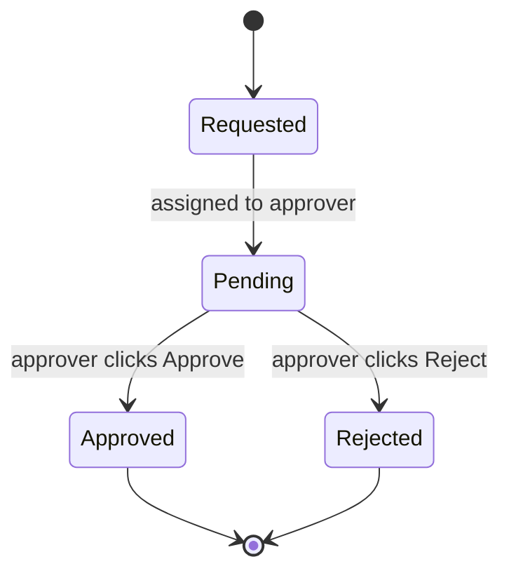

That is the whole product, in one picture. Everything we add later (multiple approvers, vacations, deadlines, audit) is a complication on top of this.

If you remember nothing else from this problem, remember: **an approval service is a small state machine, asked to run a lot of times, by a lot of people, on a lot of different shapes of request.**

---

## Step 2: Ask the right questions

In a real interview you should sit quietly for two minutes and write down what you want to ask. Not twenty questions. Five good ones.

<details markdown="1">
<summary><b>Show: 5 questions that change the design</b></summary>

1. **One workflow, or many?** Just leave requests? Or also expenses, POs, contracts? *Almost always many. This is the biggest decision in the whole design.*
2. **Who writes the workflow rules?** Engineers in code, or HR admins in a UI? *If non-engineers write them, you need a definition store, a UI, and versioning.*
3. **What about vacation?** If Alice is out, does her approval auto-route to Bob? *Delegation is the single biggest source of production bugs.*
4. **What if nobody responds?** Auto-approve after 48 hours? Escalate? Page someone? *This is the SLA layer.*
5. **How long do we keep the records?** SOX needs 7 years. Healthcare needs longer.

A strong candidate also asks the meta question: *"Is sending the notifications part of this service, or a separate one?"* The right answer is separate. The engine emits events. A notification service consumes them.

</details>

---

## Step 3: How big is this thing?

Same problem, two scales.

| Scale | Employees | Requests/day | Per second | Active in flight |
|-------|-----------|--------------|------------|------------------|
| Startup | 50 | ~36 | tiny | 50 to 70 |
| Enterprise | 100,000 | ~71,000 | ~1 steady, ~3 peak | ~200,000 |

<details markdown="1">
<summary><b>Show: how the numbers come out</b></summary>

Assume each person creates about 5 approval requests per week.

**Startup (50 people).** 50 × 5 = 250 requests/week ≈ **36 per day**. One every 40 minutes. A Google Sheet could handle this.

**Enterprise (100,000 people).** 100k × 5 = 500k/week ≈ **71,000 per day** ≈ **1 per second steady, 3 per second at peak**. Each request lives about 3 days on average, so ~200,000 are open at any moment.

**What the math is telling you.** The throughput is small. A single Postgres handles it. The real problem at enterprise scale is not requests per second, it is **organizational complexity**: thousands of workflow types, tens of thousands of approver roles, hundreds of downstream integrations.

Also: reads beat writes 25 to 1. Every employee opens their dashboard ~10 times a day to check status. The read path matters more than the write path.

</details>

---

## Step 4: Build the simplest version that works

Forget enterprise for a moment. We are a 10-person startup. One workflow: leave requests. Manager approves. Done.

Picture the flow:

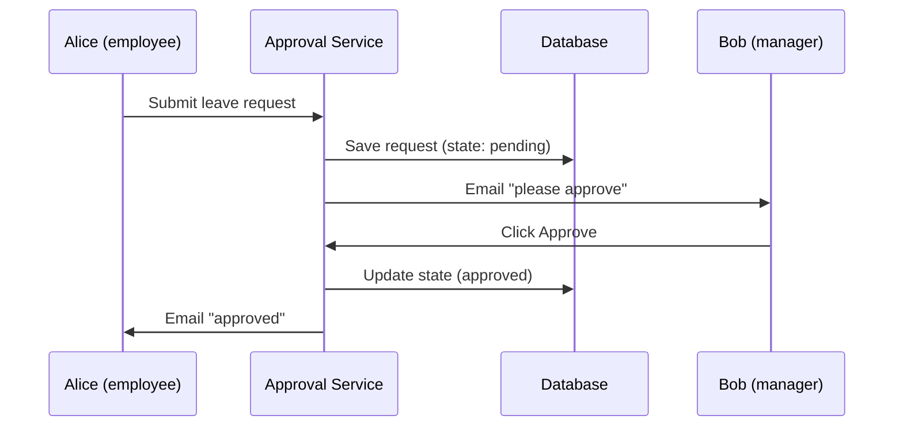

That is it. A web form, a database table with five columns, and an email. You could build it in a weekend.

<details markdown="1">
<summary><b>Show: the database table</b></summary>

```sql
CREATE TABLE leave_requests (
    id              UUID PRIMARY KEY,
    employee_id     TEXT NOT NULL,
    manager_id      TEXT NOT NULL,
    start_date      DATE,
    end_date        DATE,
    state           TEXT NOT NULL,    -- 'pending', 'approved', 'rejected'
    created_at      TIMESTAMPTZ DEFAULT NOW(),
    decided_at      TIMESTAMPTZ
);
```

Five columns. Tiny. This is the right place to start. Everything we add from here is in response to a real problem.

</details>

This is the version most candidates would draw on the whiteboard. It is correct. The interesting part of the interview is what happens next.

---

## Step 5: Then what breaks?

The next morning the CFO walks in: *"Can your team also handle purchase order approvals? Same idea, but anything over $5k also needs finance to sign off."*

You look at your code. The word `leave_request` is everywhere. If you copy-paste a `purchase_orders` table, you are going to copy-paste another five tables this year. Each one a near-copy of the last. Each one slightly different.

This is the trap. The fix is one idea: **stop hardcoding the workflow. Treat it as data.**

A workflow becomes a small recipe the engine reads:

```
leave_request:
   step 1: ask the employee's manager
   step 2: done

purchase_order:
   step 1: ask the employee's manager
   step 2: if amount > $5,000, also ask finance
   step 3: done
```

Same engine. Different recipe. New workflows take five minutes, no deploy.

<details markdown="1">
<summary><b>Show: a workflow written as YAML</b></summary>

```yaml
workflow: leave_request
version: 3

steps:
  - id: auto_approve_short
    when: days < 3
    action: approve

  - id: manager_approval
    type: approval
    approver: "{{ employee.manager }}"
    timeout: 48h
    on_timeout: escalate

  - id: hr_and_grandboss
    when: days > 14
    type: parallel
    branches:
      - approver: "{{ employee.manager.manager }}"
      - approver: "hr-leave-admin"
    quorum: all
```

A workflow language needs to support five things, and each one maps to a real problem:

1. **Conditional steps (`when:`).** Auto-approve short leaves. Skip finance for tiny POs.
2. **Timeouts (`timeout:` + `on_timeout:`).** Humans miss things. Without timeouts your queue grows forever.
3. **Delegation.** Vacation happens. The engine has to follow the chain without looping.
4. **Parallel with quorum.** Code review needs 2 of 3 senior approvals. Some signoffs need *all* department heads.
5. **Roles, not just users.** If `hr-leave-admin` quits, the workflow still works. The engine resolves the role to a real person at runtime.

The `version` field matters. When this request was created, the workflow was on v3. Even if v4 ships tomorrow, this request keeps running on v3, forever. Otherwise the shape of running requests changes mid-flight and audit becomes a nightmare.

</details>

---

## Step 6: The system, drawn out

Now we have an engine that reads workflow definitions and runs them. Here is the whole architecture.

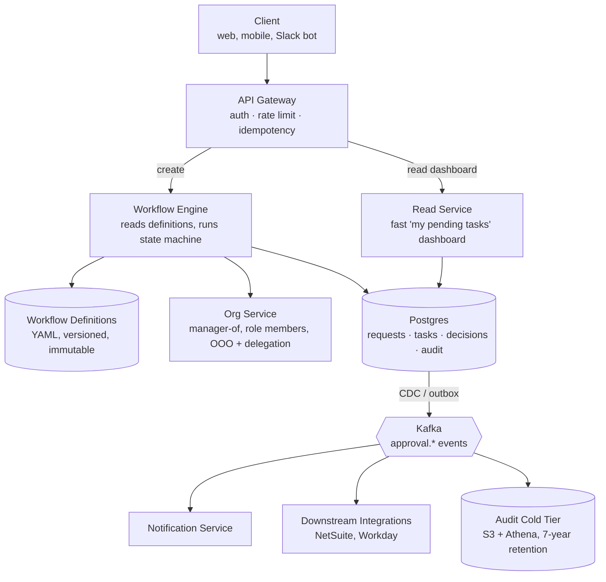

What each box does, in one line:

- **API Gateway.** Authenticates the caller, rate-limits bots, dedupes retries.
- **Workflow Engine.** The brain. Reads the current state, decides what is next, assigns the next task. Stateless. State lives in Postgres.
- **Workflow Definitions.** Where the YAML recipes live. Versioned. New versions never overwrite old ones.
- **Org Service.** Knows Alice's manager is Bob, that Bob is on vacation, and that Carol is his delegate. Usually a thin layer over Workday or BambooHR.
- **Postgres.** Source of truth. Small live state, plus an append-only audit log for the last 90 days.
- **Read Service.** Optimized for the dashboard. Reads from a Redis cache populated by engine events. Lets the primary DB rest.
- **Kafka.** Carries events out to the side-effect world: notifications, downstream syncs, analytics, audit archival.
- **Audit cold tier.** Older audit rows in S3, queryable by Athena for years.

Notice what is *not* in the write path: notifications, downstream integrations, audit archival. They are all consumers of Kafka events. If the notification service dies at 3am, new approvals still flow. Emails just queue up.

---

## Step 7: One request, end to end

Picture Alice submitting a leave request, all the way through.

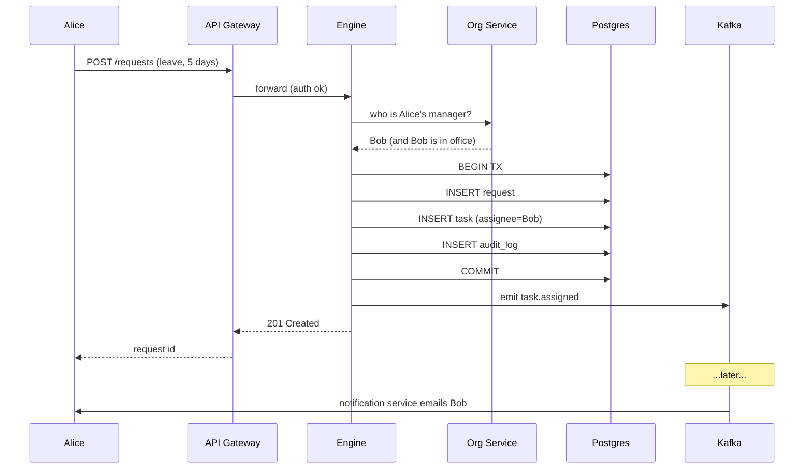

Three details worth pointing at:

1. The request, the task, and the audit row are all written in **one database transaction**. Either all three exist, or none do. Crashes mid-write roll back cleanly.
2. The engine writes the event to Kafka *after* the transaction commits. Notifications, integrations, and audit archival fan out from there.
3. The engine itself is stateless. Restart it in the middle of the day. The next request lands on a different pod and works fine.

---

## Step 8: The vacation problem (delegation)

The workflow says `approver: "{{ employee.manager }}"`. The engine has to turn that template into a real person before it can assign a task.

That sounds simple. Let's see why it isn't.

**Alice submits a leave request. Her manager is Bob. But:**

- Bob is on vacation. He set Carol as his delegate.
- Carol is on the same vacation. She set Dave as her delegate.
- Dave is in the office.

Who gets the task?

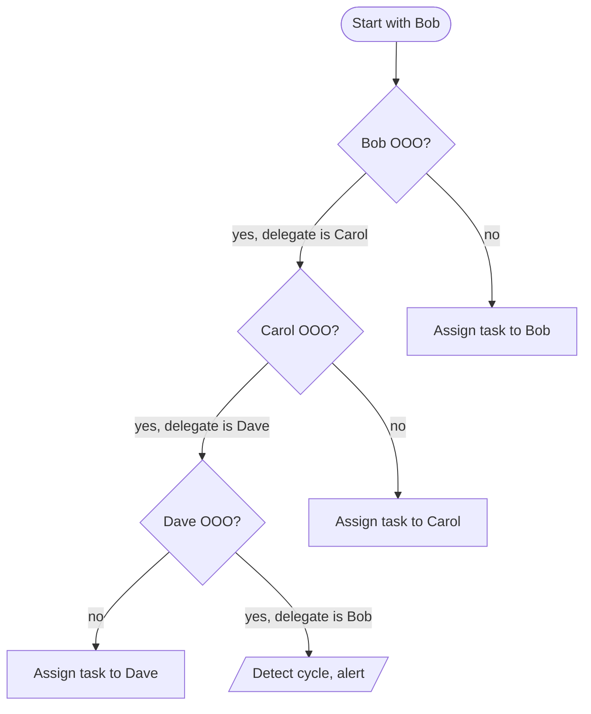

The engine walks the chain. Three safety rails make it production-safe:

1. **Cap the depth** (max 5 hops). Otherwise an HR mistake can recurse forever.
2. **Track visited users**. If the chain loops back to someone already seen, stop and raise an alert.
3. **Record the chain on the task.** Dave's dashboard then shows *"You are approving on behalf of Bob, via Carol."* Audit shows the same chain.

<details markdown="1">
<summary><b>Show: the resolver, written out</b></summary>

```python
def resolve_approver(spec, requester, when):
    target = render_template(spec, {"employee": requester})

    if is_role(target):
        members = org.role_members(target, at=when)
        if not members:
            raise NoApproverFound(target)
        target = pick_round_robin(members)

    return follow_delegation(target, when, depth=0, visited=set())


def follow_delegation(user, when, depth, visited):
    if depth > 5:
        raise DelegationTooDeep(user)
    if user.id in visited:
        raise DelegationCycle(visited)
    visited.add(user.id)

    if not user.exists:
        return fallback_for_departed(user)

    ooo = org.get_active_ooo(user, at=when)
    if ooo is None or ooo.delegate is None:
        return user
    return follow_delegation(ooo.delegate, when, depth + 1, visited)
```

The `when` parameter looks redundant but is the key to audit replay. To rebuild who *would have been* the approver back when this request was created, you need a point-in-time view of the org chart. People change jobs. Delegations expire. Roles get reassigned.

</details>

---

## Step 9: The audit trail

Five years from now an auditor will ask: *"Show me every approval decision on purchase orders over $50,000 in Q3 2024."*

By then:

- The people who made those decisions may have left.
- The workflow definitions have changed many times.
- The approvers' roles have been reorganized.

Your system must still answer. That means audit is not a log file. It is a product.

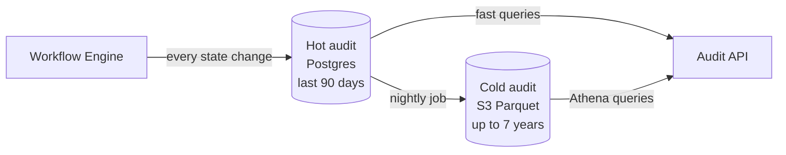

Five rules you cannot break:

1. **Append-only.** No UPDATE. No DELETE. Ever. The DB user that writes audit has INSERT-only privileges.
2. **Snapshot in every row.** The request's full state at that moment, frozen. Lets you replay the request's life by walking events in order.
3. **Workflow version pinned.** If `leave_request` is on v5 today and this request ran against v3, the audit row shows v3.
4. **Who and on whose behalf.** If Carol approved as Bob's delegate, both names are recorded.
5. **Hash chain for high-compliance industries.** Each event has `prev_hash` and `hash`. Tampering with one event invalidates every event after it. Required in healthcare and finance.

<details markdown="1">
<summary><b>Show: the audit_log schema</b></summary>

```sql
CREATE TABLE audit_log (
    event_id          UUID PRIMARY KEY,
    occurred_at       TIMESTAMPTZ NOT NULL,
    request_id        UUID NOT NULL,           -- referenced, not foreign key
    workflow_id       TEXT NOT NULL,
    workflow_version  INT NOT NULL,            -- pinned forever
    event_type        TEXT NOT NULL,
    actor             JSONB,                   -- {user, role, delegated_from}
    payload           JSONB NOT NULL,
    snapshot          JSONB                    -- request state at this moment
);

CREATE INDEX idx_audit_request   ON audit_log (request_id, occurred_at);
CREATE INDEX idx_audit_workflow  ON audit_log (workflow_id, occurred_at);
CREATE INDEX idx_audit_actor     ON audit_log USING gin (actor);
```

There is no foreign key to `requests`. On purpose. If a request is ever deleted (GDPR, mistaken bulk import), the audit must survive. Audit is the truth-of-record, not the requests table.

</details>

---

## Step 10: Four workflows, one engine

Here are four real workflows. The same engine, the same data model, the same audit log runs all of them. Each one stresses a different feature.

| Workflow | What stresses the engine | The lesson |
|----------|--------------------------|------------|
| **Purchase order** ($12k for servers) | Conditional steps. Manager always approves. Finance if > $5k. CFO if > $25k. | The engine must evaluate `when:` at each step and skip cleanly. |
| **Leave request** (21-day vacation) | Parallel approval with quorum. After manager, HR and grandboss in parallel. **Both** must approve. | Default quorum must be `all`, not `any`. Otherwise rubber-stamping is too easy. |
| **Expense report** (finance asks for a missing receipt) | Backward transitions. Request rewinds to the requester, then forward again. | Engine needs explicit `return_to_step`. Pending downstream tasks must be cancelled when the request rewinds. |
| **Code review** (PR with 2 approvals, new commit pushed) | External events. CI status must pass. New commits invalidate prior approvals. | Engine needs `on_input_change: invalidate_approvals` and the ability to react to non-human events. |

The big idea: one engine, four wildly different workflows, no special cases. If you instead built a separate `purchase_orders` service, you would also need a separate `leave_requests` service, then `expense_reports`, then `code_reviews`, then twenty more. That is the trap the design exists to avoid.

---

## Follow-up questions

Try answering each in 2 or 3 sentences before opening the solution.

1. **Self-approval.** A user submits a PO and is also in the finance approver group. How do you stop them from approving their own request?

2. **Approver leaves the company.** Their dashboard still shows a pending task forever, but they cannot log in. What happens to that task?

3. **Delegation cycle.** Alice delegates to Bob. Bob delegates to Alice. The engine tries to resolve Alice's request and loops forever. How do you stop it?

4. **Workflow version migration.** You ship `leave_request` v4. There are 800 requests still in flight on v3. What happens to them?

5. **Two approvers click at the same moment.** They are both listed in parallel with `quorum: any`. Both hit Approve in the same millisecond. Does the request advance twice?

6. **Auto-approval rule was broken.** Last night, finance's `when: amount < 100` rule auto-approved 50,000 fraudulent micro-purchases. How do you detect this and recover?

7. **Bulk import.** HR wants to load 5,000 historical leave requests with their original timestamps and approvers. How do you preserve the audit trail's accuracy?

8. **Slow dashboard.** Carol has 120 pending tasks. Her dashboard takes 4 seconds to load. Why? How do you fix it?

9. **Search across all approvals.** Auditor needs *"all POs mentioning vendor Acme Corp approved in Q2."* Your `requests` table has a JSON `inputs` column. Naive search is slow. What do you do?

10. **NetSuite integration.** Every approved PO must create a record in NetSuite. NetSuite returns 5xx errors 1% of the time. How do you guarantee the record is created exactly once?

11. **Notification storm.** A request transitions through 8 states in 10 minutes. 12 watchers get 8 emails each. They unsubscribe. How do you fix it?

12. **The "approve all" button.** Carol has 80 pending leave requests for school holiday week. She wants to approve them all at once. What does the backend API look like, and what can go wrong?

13. **Privacy.** Salary-affecting decisions (raise requests) should not be visible to non-HR users, even in audit logs. How do you enforce this?

14. **Infinite-loop workflow.** A workflow author writes step A → step B → step A. You publish it. First request through it loops forever. How do you catch this before publication?

15. **Multi-region.** EU operations open. EU employee data must stay in EU. How does the engine handle a request where the requester is in EU but the approver is in US?

---

## Related problems

- **[Notification System (010)](../010-notification-system/question.md).** Every approval event fires off notifications. The fan-out, retry, and quiet-hours machinery there consumes the approval engine's events.
- **[Help Desk Ticketing (019)](../019-helpdesk-ticketing/question.md).** Same state-machine + role-routing + SLA-timer patterns. A ticket's lifecycle is structurally identical to an approval's.
- **[Write-Heavy System Patterns (018)](../018-write-heavy-patterns/question.md).** The audit log here is exactly a write-heavy append-only system.
- **[Read-Heavy System Patterns (017)](../017-read-heavy-patterns/question.md).** The "my pending approvals" dashboard is the read-heavy half of this design.


<div class="pr-solution-divider"></div>


## Solution: Approval Management Service

### The short version

An approval service is a small state machine. You read a recipe that says *"first the manager approves, then finance approves, then we are done,"* and you walk through it step by step. Each step gets assigned to a real person. You wait for them to click Approve or Reject. You move on.

The runtime is tiny. What makes the problem interesting is everything around it:

- Turning *"the requester's manager"* into a real person when that person is on vacation.
- Surviving the approver leaving the company while the task is still pending.
- Stopping someone from approving their own request.
- Keeping an audit trail that holds up five years from now in court.

The data model fits on a napkin: workflow definitions, requests, tasks, decisions, audit log. Scale is not the hard part. At 100,000 employees, the whole company only generates about 1 request per second. The hard part is **organizational complexity**, not throughput.

---

### 1. The two questions that matter most

If you only get to ask two clarifying questions, ask these.

**One workflow or many?** If it is just leave requests, you have a CRUD app. If it is a workflow engine that runs many types defined by config, you have a real system design.

**Who writes workflows?** If HR admins through a UI, you need a definition store, versioning, and a lint pass. If engineers in YAML in the repo, you skip half of that.

Everything else (vacation, escalation, audit, retention) follows from those two answers.

---

### 2. The math, in plain numbers

| Scale | Requests/day | Per second | Active in flight |
|-------|--------------|------------|------------------|
| 50-person startup | ~36 | ~0.0004 | 50 to 70 |
| 100k enterprise | ~71,000 | ~1 sustained, ~3 peak | ~200,000 |

The throughput is small. A single Postgres handles it. The interesting numbers are:

- **200,000 active requests at any moment.** The "show me my pending approvals" query has to find the right ones in under 50ms.
- **5,000 different workflow types** at a mature company. Most are cold. A few (leave, expense) are hot.
- **Reads beat writes 25 to 1.** Every employee checks their dashboard ten times a day. Caching the read path matters more than write throughput ever will.

---

### 3. The API

Two endpoints carry the whole product. *Create a request* and *record a decision*. Everything else is reading data back.

```
POST /api/v1/requests
Idempotency-Key: <uuid>

{
  "workflow_id": "leave_request",
  "workflow_version": null,            # null = use the latest published
  "inputs": { "start_date": "...", "end_date": "...", "days": 5 }
}
```

You get back the request id and the tasks just created. Two parallel approvers needed? Two tasks. The workflow auto-approved (under-3-day leave)? You get back a finalized request immediately.

```
POST /api/v1/tasks/{task_id}/decisions

{
  "decision": "approve" | "reject" | "request_changes" | "delegate",
  "comment": "...",
  "on_behalf_of": "user_bob"           # set if a delegate is acting
}
```

A few small but load-bearing choices:

- **Idempotency-Key is required on create.** Mobile retries the submit on timeout. Without the key, you get duplicate requests and double-charged budget reservations.
- **`workflow_version: null` defaults to the latest published.** You can pin to a specific version for testing.
- **Tasks are the unit of work, not requests.** A request can have multiple tasks in flight at once (parallel approval). Approvers act on tasks. This shapes the database design too.

Status codes worth knowing: **409** on the decision endpoint means the task was already decided (someone else, or a delegate, beat you to it). **410** means the task was cancelled because the request was withdrawn or returned to the requester.

---

### 4. The data model

Five tables. Two big, three small.

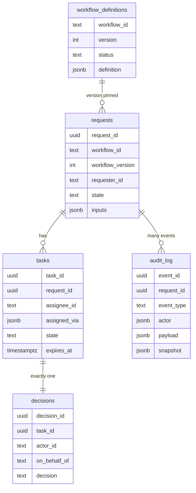

<details markdown="1">
<summary><b>Show: the full SQL</b></summary>

```sql
-- Workflows live here. Versioned. Never edited in place.
CREATE TABLE workflow_definitions (
    workflow_id      TEXT NOT NULL,
    version          INT NOT NULL,
    status           TEXT NOT NULL,        -- 'draft' | 'published' | 'archived'
    definition       JSONB NOT NULL,
    published_at     TIMESTAMPTZ,
    published_by     TEXT,
    PRIMARY KEY (workflow_id, version)
);

-- One row per request.
CREATE TABLE requests (
    request_id          UUID PRIMARY KEY,
    workflow_id         TEXT NOT NULL,
    workflow_version    INT NOT NULL,
    requester_id        TEXT NOT NULL,
    state               TEXT NOT NULL,
    inputs              JSONB NOT NULL,
    state_data          JSONB,
    created_at          TIMESTAMPTZ NOT NULL DEFAULT NOW(),
    finalized_at        TIMESTAMPTZ,
    final_state         TEXT,
    idempotency_key     TEXT,
    FOREIGN KEY (workflow_id, workflow_version)
        REFERENCES workflow_definitions(workflow_id, version)
);
CREATE INDEX idx_req_requester ON requests (requester_id, created_at DESC);
CREATE INDEX idx_req_open      ON requests (state) WHERE finalized_at IS NULL;

-- One row per pending human action.
CREATE TABLE tasks (
    task_id        UUID PRIMARY KEY,
    request_id     UUID NOT NULL REFERENCES requests(request_id),
    step_id        TEXT NOT NULL,
    assignee_id    TEXT NOT NULL,
    assigned_via   JSONB,                  -- delegation chain, if any
    state          TEXT NOT NULL,          -- 'pending' | 'decided' | 'cancelled' | 'expired'
    created_at     TIMESTAMPTZ NOT NULL DEFAULT NOW(),
    expires_at     TIMESTAMPTZ
);
CREATE INDEX idx_tasks_assignee_pending
    ON tasks (assignee_id) WHERE state = 'pending';

-- Immutable record of every decision.
CREATE TABLE decisions (
    decision_id    UUID PRIMARY KEY,
    task_id        UUID NOT NULL REFERENCES tasks(task_id),
    request_id     UUID NOT NULL REFERENCES requests(request_id),
    actor_id       TEXT NOT NULL,
    on_behalf_of   TEXT,
    decision       TEXT NOT NULL,
    comment        TEXT,
    created_at     TIMESTAMPTZ NOT NULL DEFAULT NOW(),
    UNIQUE (task_id)                       -- one decision per task, enforced by the DB
);

-- Append-only audit. INSERT privilege only.
CREATE TABLE audit_log (
    event_id           UUID PRIMARY KEY,
    occurred_at        TIMESTAMPTZ NOT NULL,
    request_id         UUID NOT NULL,
    workflow_id        TEXT NOT NULL,
    workflow_version   INT NOT NULL,
    event_type         TEXT NOT NULL,
    actor              JSONB,
    payload            JSONB NOT NULL,
    snapshot           JSONB
);
CREATE INDEX idx_audit_request ON audit_log (request_id, occurred_at);
```

</details>

Three small things doing real work:

**`UNIQUE (task_id)` on decisions.** Two managers in parallel both click Approve at the same instant. The database serializes them. The first INSERT wins. The second fails with a unique-violation. The API turns that into a friendly 409. The request still advances exactly once. No application-level locks needed.

**`workflow_definitions` is immutable per version.** Publishing v4 of `leave_request` does not touch v3. In-flight requests stay on v3 forever. This is what lets you ship workflow changes without breaking running requests, and what makes audit replay work years later.

**`audit_log` has no foreign key to `requests` on purpose.** If you ever delete a request (GDPR, mistaken bulk import), the audit must survive. Audit is the truth-of-record, not the requests table.

Why Postgres, not Cassandra? Because the whole system is small and ACID matters here (claiming a task, recording a decision, advancing the request state all happen together). Postgres gives you that in one box.

---

### 5. The engine

The engine is a state machine executor. One function does most of the work. It is called every time something might let a request progress: a request was just created, a decision came in, a timeout fired, or an external event arrived.

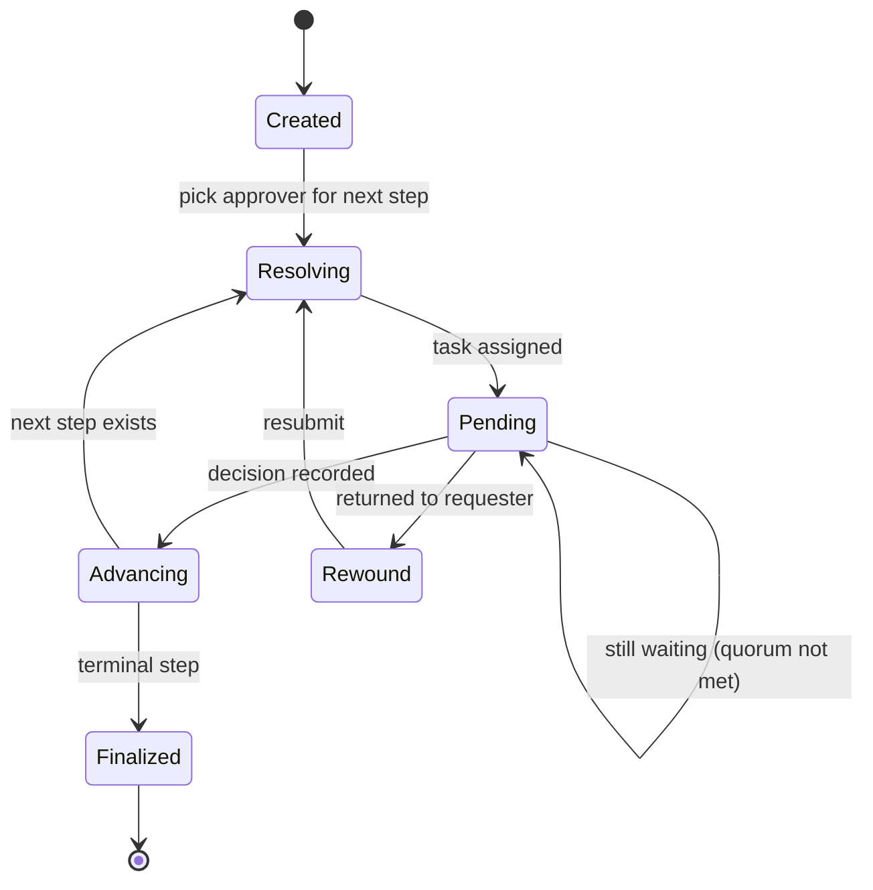

<details markdown="1">
<summary><b>Show: the advance function</b></summary>

```python
def advance_request(request_id):
    with db.transaction():
        request = db.lock_for_update("requests", request_id)
        if request.finalized_at is not None:
            return                                  # already done

        workflow = workflow_store.get(request.workflow_id, request.workflow_version)
        current_step = workflow.find_step(request.state)

        # Is the current step done?
        if current_step.type == "approval":
            tasks = db.query_tasks(request_id, current_step.id)
            if not quorum_met(tasks, current_step.quorum):
                return                              # still waiting on humans

        next_step = workflow.next_step(current_step, request.inputs, request.state_data)

        if next_step.type == "terminal":
            db.finalize(request_id, state=next_step.state)
            emit("request.finalized", request_id)
            return

        if next_step.type == "approval":
            for who in resolve_assignees(next_step, request.requester):
                db.insert_task(request_id, next_step.id, who, expires_at=...)
                emit("task.assigned", task_id)

        elif next_step.type == "auto":
            outcome = execute_auto_step(next_step, request)
            db.update_state(request_id, outcome.state)
            return advance_request(request_id)      # auto-steps chain

        db.update_state(request_id, next_step.id)
        emit("request.advanced", request_id, new_state=next_step.id)
```

</details>

Three things make this safe:

The whole advance happens in one DB transaction. Crashes mid-way roll back. After restart, the engine sees the same state and tries again. No partial-advance ever lands on disk.

The `SELECT ... FOR UPDATE` lock on the request row serializes concurrent attempts to advance the same request. Without it, two simultaneous decisions could each push the request forward and corrupt the state machine.

The function is idempotent at step boundaries. Calling it twice on the same request either sees the same state and proceeds, or sees that someone else already advanced and does nothing.

---

### 6. Resolving an approver

The workflow says `approver: "{{ employee.manager }}"`. The engine has to turn that into a real person before assigning a task. That sounds simple. Production says otherwise.

The full algorithm is in `question.md` Step 8. The key ideas:

- Cache role membership for 5 minutes. Cache OOO state for 1 minute. Cuts HRIS load by 100x.
- When you follow a delegation chain (Bob OOO → Carol OOO → Dave), store the full chain on the task as `assigned_via`. Dave's UI shows *"approving on behalf of Bob, via Carol."* Audit logs the same chain.
- The `when` parameter to `resolve_approver` is what lets audit replay work years later. People change jobs. Delegations expire. Roles get reassigned. You need a point-in-time view of the org chart.

---

### 7. The architecture

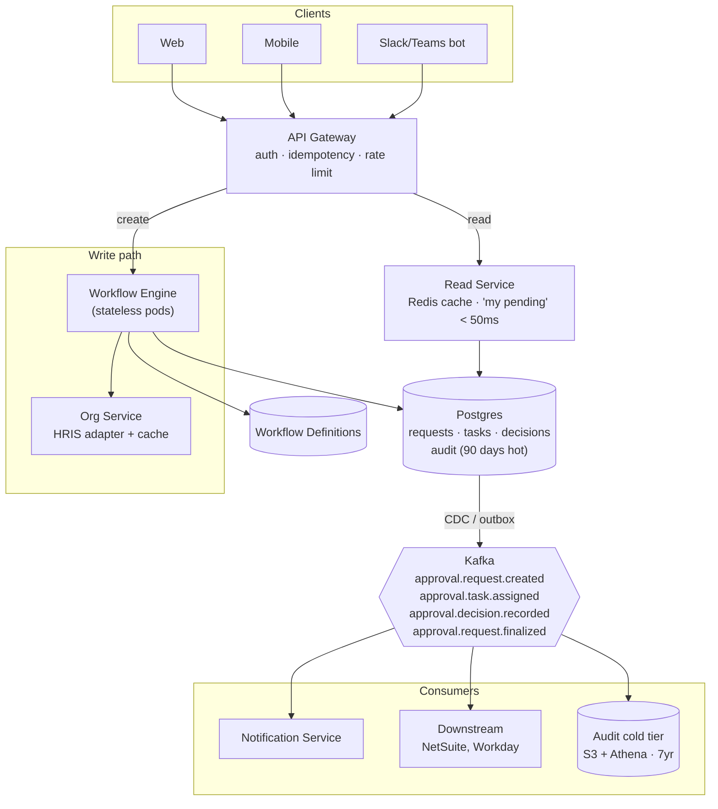

Five things to notice while reading this:

- The engine reads workflow definitions but does not call out to other services on the write path. The Org Service is the only external call (cached aggressively). Everything else is a Postgres transaction.
- Notifications, integrations, and audit archival are downstream of Kafka. They are not in the write path. If the notification service dies, requests still get created and approved. Emails just queue up.
- The Read Service is denormalized. It listens to Kafka and maintains a "what is pending for each user" Redis cache. Dashboards never touch the primary DB in the common case.
- Audit lives in two tiers. Last 90 days in Postgres. Older in S3 Parquet, queried via Athena. A nightly job moves rows between tiers.
- Engine pods are stateless. State is in Postgres. You can roll them in the middle of the day with zero impact.

---

### 8. A request, drawn end to end

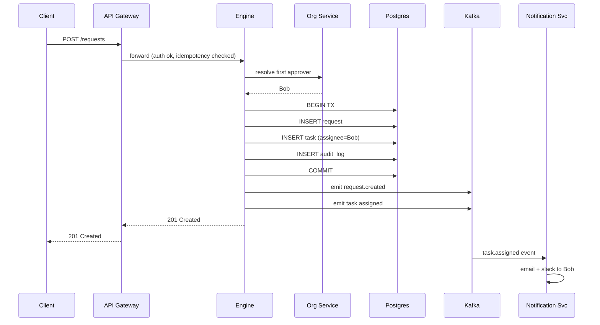

Recording a decision looks almost the same. The engine fetches the task, checks the caller, inserts a row in `decisions` (the unique constraint catches double-decide races), updates the task, writes an audit event, and calls `advance_request` to see if the workflow can move forward. All in one transaction.

Reads have their own short flow. Client → API gateway → Read Service → Redis check (`user:{uid}:pending_tasks`) → return. Cache misses fall through to a Postgres read replica.

Target latencies, roughly:

- Create request: P99 ~200ms (bottleneck is the role resolver when cache is cold).
- Decision: P99 ~150ms (role is usually warm because it was looked up when the task was created).
- Dashboard read: P99 ~50ms.

---

### 9. The scaling journey: 10 users to 1 million

This is the part interviewers care about most. At every stage, name what just broke and what fixes it. Build nothing preemptively.

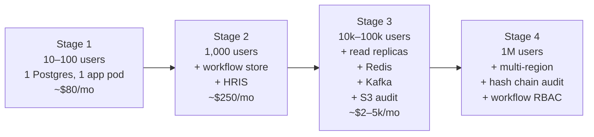

#### Stage 1: 10 to 100 users

One Postgres, one app instance. Workflow YAML lives in the repo. Manager mappings hardcoded. No cache, no queue. Notifications are inline HTTP calls to SendGrid. About $80/month total. Two weeks to ship.

Enough because you see ten requests a day. Postgres is loafing. Building anything more is over-engineering.

#### Stage 2: 1,000 users

Something breaks: someone asks for a new workflow type without a deploy.

Move workflow YAML out of code into a `workflow_definitions` Postgres table with a minimal admin UI. While you are in there, add versioning. Integrate with the HRIS (Workday or BambooHR) instead of hardcoded manager mappings. 5-minute cache on HRIS responses. Notifications stop being inline calls and start consuming a small `request_events` table. About $250/month.

Still no Kafka, no read replicas, no Redis. One request every couple of minutes. One Postgres is still fine.

#### Stage 3: 10,000 to 100,000 users

Several things break at once:

- The dashboard for power approvers takes 4 seconds. Carol has 120 pending tasks.
- Audit queries on 80M rows time out.
- Engine pods compete for the same `SELECT FOR UPDATE` lock under bursty load.
- The Workday API rate-limits you during peak hours.

Fixes, in order:

- Two Postgres read replicas. Dashboards read from them, engine writes go to primary. ~1s replication lag is fine.
- A Redis cache for "my pending tasks" populated by listening to engine events. Dashboards read Redis directly.
- Move audit older than 90 days to S3 Parquet. Athena for ad-hoc queries.
- Partition engine pods by `request_id` hash. Stops them racing for the same locks.
- Tighten Org Service cache. Pre-fetch on dashboard load.
- Bring in Kafka properly. Notifications, audit tiering, and external integrations all become consumers.

Cost jumps to $2-5k/month.

#### Stage 4: 1 million users

New problems:

- EU operations open. EU data must stay in EU.
- One customer is a hospital. HIPAA needs hash-chained audit.
- 5,000+ workflow definitions. Different teams want different RBAC.
- Some workflows have 30 steps and live for weeks.

Multi-region everything. Engine, DB, Redis, Kafka all per-region. The requester's home region (from HRIS) decides where the request lives and where audit is written. Cross-region approvals (US person approves EU request) routed via authenticated cross-region API.

Workflow definitions get RBAC by "policy domain." Audit events get a hash chain. Long-running workflows survive engine deploys because state lives entirely in DB.

The architecture has not fundamentally changed since Stage 3. You added regions, RBAC, and tenant isolation. The core data model is still the same one you wrote in Stage 1.

#### What you would do at 10M users

You wouldn't. By then you are bigger than any one company, which means you are selling this as SaaS (Workday, ServiceNow scale). At that point you might swap your homegrown engine for Temporal as the runtime and keep your approval-specific logic on top.

---

### 10. The four variants, fast

Same engine. Four real workflows. Each one stresses a different feature.

- **Purchase order** uses conditional branching. `when: amount > 5000` sends to finance. `when: amount > 25000` adds the CFO. Lint your conditions or you get edge cases like a $25,001 PO needlessly going to both finance and the CFO.
- **Leave request** uses parallel with quorum. Long leaves go to HR and grandboss at the same time. Both must approve. If one rejects, the other's task is cancelled and the request rejects.
- **Expense report** needs backward transitions. Finance says "missing receipt." The request rewinds to the requester. The engine has `on_action: return_to(<step>)` for this. Subtle: pending downstream tasks must be cancelled when the request rewinds.
- **Code review** needs external-event integration. The workflow waits for CI status, not just a human. When a new commit lands, prior approvals get invalidated.

One engine, four workflows, no special cases. That is the design victory.

---

### 11. Reliability

Engine crashes mid-advance roll back cleanly. State is in the DB. The transaction is atomic. The lock prevents concurrent advance attempts. After restart, the engine sees the request's current state and continues.

The escalation worker is separate from the engine. It scans for `expires_at < now()` and records timeout events. If it dies, escalations get delayed but never lost.

Audit writes happen in the same transaction as the state change. If the audit insert fails, the state change rolls back. You never advance state without an audit record.

If HRIS goes down, the Org Service serves stale data from cache. The engine keeps working with whoever was cached. After an hour, it logs warnings. After 24 hours, it refuses to assign tasks that need role lookups.

If a region goes down, that region's requests pause. Cross-region approvals routed through the down region queue in Kafka. When the region comes back, queued operations replay.

---

### 12. Observability

| Metric | Why it matters |
|--------|----------------|
| `requests.created.rate` | Spike means a bot. Drop means auth or HRIS broken. |
| `requests.in_flight` | Growing slowly means approvals are stalling on someone. |
| `request.cycle_time` p50/p95 per workflow | The headline SLO. Often audit-required. |
| `task.assignment_latency` p99 | High means the role resolver is sluggish. |
| `escalations.fired.rate` | Spike means lots of stalled tasks. Could be a workflow bug. Could be flu season. |
| `delegation.depth.max` | Should never exceed 3-4. Higher means OOO chains that need fixing. |
| `delegation.cycles.detected` | Should be 0. Page if non-zero. |
| `engine.lock_wait` p99 | High means you need partitioning across pods. |
| `audit.write.lag` | Audit must never lag. Alert at >5s. |

Page on: engine error rate >1% over 5min. Audit write failure (any). Delegation cycle detected.

Ticket on: cycle time regression >30%. HRIS cache age >30 min.

---

### 13. Follow-up answers

These are the questions a senior interviewer is listening for. Each answer is short on purpose. The depth is in the *why*.

**1. Self-approval.**

Filter the requester out of the eligible approver set inside `resolve_approver`. For role-based steps, pick the next available role member. For named-user steps where the user happens to be the requester, raise a workflow definition error. The check lives in the engine, not just in the API, because someone could otherwise reassign a task to the requester through delegation.

**2. Approver leaves the company.**

A nightly job:

```sql
SELECT t.task_id, t.assignee_id, r.requester_id
  FROM tasks t JOIN requests r ON t.request_id = r.request_id
 WHERE t.state = 'pending'
   AND t.assignee_id NOT IN (SELECT id FROM users WHERE active);
```

For each orphan, reassign to the original assignee's last manager from HRIS history. If not findable, fall back to the workflow's `fallback_approver`. Notify the new assignee: *"this task was originally assigned to X who has since left."* For layoffs, run the job on demand with a bulk-reassign mode.

**3. Delegation cycle.**

The `visited` set in `follow_delegation` raises `DelegationCycle` on a repeat. Assign to the original target anyway with a warning in the UI. Better still: when a user *sets* their delegate, walk the chain and refuse if it includes them. Catch it at the source, not at runtime.

**4. Workflow version migration.**

In-flight requests stay on their original version forever. `requests.workflow_version` is set at create time and never updated. Old versions are kept indefinitely. If you ship v4 with a critical fix and want in-flight requests to benefit, you do not modify v3. You manually apply a "patch" to specific requests (rare; carries audit annotation `workflow_patched`). Workflows can be archived but never deleted while any historical request references them.

**5. Concurrent approval race.**

`UNIQUE (task_id)` on `decisions` is the lock. Two approvers click at once. Two INSERTs race. The first wins. The second gets a unique-violation. The API turns that into 409. The first decision's `advance_request` runs, sees the quorum is satisfied, and cancels the sibling tasks. The losing approver sees "task no longer requires action" (410 Gone). No application-level coordination needed. The database does the work.

**6. Auto-approval bug.**

Detection: `metrics.auto_approve.rate` is normally stable. A 100x spike triggers a page.

Recovery: an `admin_reopen(request_id)` endpoint creates an `audit.admin_reopened` event, resets state to a configurable point, and cancels downstream effects. The downstream is whoever consumes the "approved" event. If NetSuite already wrote a payment record, NetSuite needs its own reversal.

Prevention: cap auto-approve rate per workflow per hour. A circuit breaker switches to manual review on overrun.

**7. Bulk import.**

A separate `bulk_import` endpoint bypasses the engine and writes directly to `requests`, `tasks`, `decisions`, and `audit_log` with the original timestamps. Each audit event tagged with `source: bulk_import_<batch_id>` so future auditors can tell imported from live. The audit hash chain (if enabled) treats imported events as a separate chain. Admin-only. Heavily audited itself.

**8. Slow dashboard.**

Carol's 120 pending tasks make her dashboard slow because the frontend issues 120 sub-queries hydrating each task.

Fix: the backend returns a denormalized "task list view" per assignee from the Read Service cache. Single Redis read. Cache updated on `task.assigned` and `task.decided` events. Paginate if she has more than 50 tasks.

**9. Search across all approvals.**

Postgres JSONB search on `requests.inputs` is slow without help. For most companies, a `tsvector` GIN index on `to_tsvector('english', inputs::text)` is enough. Above ~10M searchable requests, pipe `requests` to Elasticsearch or ClickHouse via CDC.

**10. NetSuite integration.**

A `netsuite-sync-worker` consumes `request.finalized` from Kafka. For each event: check an `external_syncs (request_id, target)` table. If status is `success`, skip. Otherwise call NetSuite with `idempotency_key = "ns-{request_id}"` (NetSuite uses it to dedupe). On 2xx, mark success. On 5xx, exponential backoff (1s, 5s, 25s, 2m, 10m, 30m, deadletter). On 4xx, mark `failed_permanent` and alert a human.

**11. Notification storm.**

60-second aggregation window per recipient per request. Send one digest. Configurable per user (instant, hourly, daily). The notification service owns preferences. The engine just emits raw events.

**12. The "approve all" button.**

API: `POST /api/v1/tasks/bulk_decide` with `{"task_ids": [...], "decision": "approve"}`. Server iterates serially (serial because each decision might advance a request and concurrent advances cause version skew). 80 decisions at 50ms each = 4 seconds. Returns a per-task result array. Some tasks might 409 if a delegate beat the user to it. The result shows that.

**13. Privacy and visibility scoping.**

Workflow definitions get a `visibility_scope` field: `public | private | department | role:<role>`. Denormalized to `requests.visibility_scope`. All read APIs filter by it. Restricted workflows publish to a separate Kafka topic (`approval.events.restricted`) that only authorized consumers subscribe to. Notifications for restricted workflows omit details: *"you have a pending approval; log in to see."*

**14. Infinite-loop workflow.**

Publish-time check: graph-traverse the workflow definition. If there is a cycle without any `when:` condition that can break it, refuse to publish. Some cycles are intentional (review → request changes → review), allowed only if at least one transition has a guard referencing input data that can change. Runtime safety net: max-transitions counter per request. More than 100 transitions pauses the request for human review.

**15. Multi-region with data residency.**

Each region has its full stack. The requester's home region (from HRIS) decides where the request lives. Cross-region approvals: the EU region creates the task and assigns to the US employee, who sees it via the US region's dashboard. When the US employee decides, the decision is forwarded to EU via an authenticated cross-region API call (queued in a `cross_region_decisions_outbox` table and retried idempotently). The decision is recorded in the EU region's tables and audit. The US region keeps only a *"this US user sent a decision to EU region"* record for its own audit. No PII about the EU request.

The lesson: data residency forces the request to be the unit of locality. The user can be anywhere. The request is somewhere specific.

---

### 14. Trade-offs worth saying out loud

**Why a custom engine and not Temporal or Step Functions.** Off-the-shelf workflow engines are great for general computation. They are awkward for approval-shaped workflows because the role, delegation, and audit story is approval-specific and would have to be built on top anyway. At 10M+ workflows you might pick Temporal as the runtime. The approval logic stays in your service either way.

**Why Postgres and not Cassandra.** Approval needs strong consistency. No double-approve. No lost decisions. Postgres gives ACID for free. Cassandra would force you to invent compensating logic for the same guarantees.

**Why YAML for workflow definitions and not code.** YAML lets non-engineers author workflows through a UI. Plugins force every workflow change through a deploy. The cost is limited expressiveness. For the few workflows that need real code (a custom integration step), the engine has an `exec` step that runs sandboxed JavaScript.

**Why an immutable audit log and not just event-sourcing the requests.** Event-sourcing would make audit queries fast but ties the application's data model to the audit format. Decoupling lets you refactor the application without breaking audit. Worth the duplication.

**What you would revisit at 10x scale.** Adopt Temporal as the runtime. Move workflow authoring into its own product with its own DB and RBAC. Move audit to a dedicated immutable-storage product (QLDB, or a hash-chained ledger).

---

### 15. Common mistakes

Most weak answers fall into one of these:

**Modeling requests with a hardcoded status enum.** If your design has `status: pending | approved | rejected` and transitions live in if-statements, you have written CRUD, not a workflow service. The whole point is a data-driven engine.

**No version pinning on workflows.** If in-flight requests follow the latest version, you introduce time-traveling bugs and break audit replay.

**Self-approval allowed by default.** Junior candidates rarely think of it. The interviewer will ask.

**Audit as a side effect.** *"I'll just log it."* Audit has a schema, a retention policy, an immutability contract, and a query interface. It is a feature, not a log line.

**Treating notifications as part of the engine.** They are not. The engine emits events. The notification service consumes them. This separation is what lets you add Slack, Teams, or SMS without touching the engine.

**Designing for write throughput.** Even at enterprise scale you have ten writes per second. The hard numbers are about read latency for dashboards and audit queries.

**Forgetting parallel approval with quorum.** Serial-only works for 80% of workflows. The other 20% (medical, legal, compliance) need parallel. Retrofitting later is expensive.

**Hand-waving the org service.** The role, delegation, and OOO machinery is half the system. Treating it as a single `manager_id` column loses the design.

**No mention of multi-region or data residency.** GDPR alone forces it at enterprise scale.

**Microservices "the right way" before understanding the workflow shape.** Start from the data model. Service boundaries follow from that, not the other way around.

If you can name seven of these ten without prompting, you are interviewing at staff level. The three that separate strong from average answers: engine versus CRUD, audit immutability, and role-resolution depth. Those are the answers a senior architect listens for.

